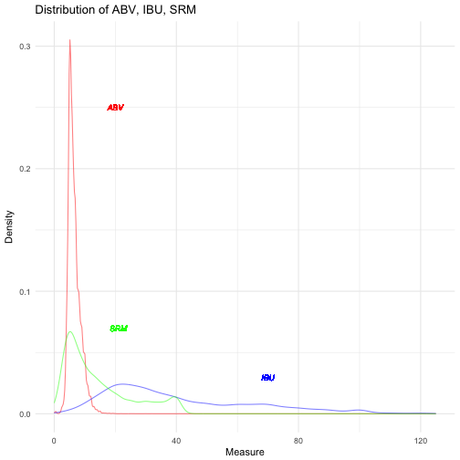
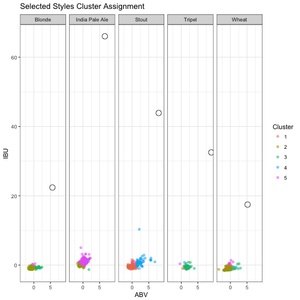
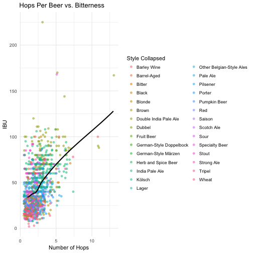
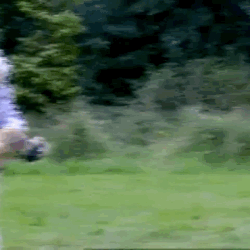

Beer-in-Hand Data Science
========================================================
author: Amanda Dobbyn
date: 
autosize: true
transition: zoom
<!-- output: ioslides_presentation -->


Where's the code at
========================================================
Code at: <https://github.com/aedobbyn/beer-data-science>


The Order of Things, theoretically
========================================================

<br>


***

<br>


#### Are beer styles just a social construct?


Implications
========================================================

* If styles do demarcate the beer landscape well, we should expect to see distinct clusters dominated mostly by beers classified into a *single* style.

* It should also be easy to predict style from the other variables

This all, assuming the features we have can account for most of the variance between styles


<br> 

**The stakes could not be higher**.


The beer landscape
========================================================
Looks a bit messier than it should


Step 1: GET Beer
========================================================


***


Step 1: GET Beer
========================================================


```r
base_url <- "http://api.brewerydb.com/v2"
key_preface <- "/?key="

paginated_request <- function(ep, addition, trace_progress = TRUE) {    
  full_request <- NULL
  first_page <- fromJSON(paste0(base_url, "/", ep, "/", key_preface, key
                                , "&p=1"))
  number_of_pages <- ifelse(!(is.null(first_page$numberOfPages)), 
                            first_page$numberOfPages, 1)      

    for (page in 1:number_of_pages) {                               
    this_request <- fromJSON(paste0(base_url, "/", ep, "/", key_preface, key
                                    , "&p=", page, addition),
                             flatten = TRUE) 
    this_req_unnested <- unnest_it(this_request)    #  <- request unnested here
    
    if(trace_progress == TRUE) {message(paste0("Page ", this_req_unnested$currentPage))} # if TRUE, print the page we're on
    
    full_request <- bind_rows(full_request, this_req_unnested[["data"]])
  }
  return(full_request)
} 

all_beer_raw <- paginated_request("beers", "&withIngredients=Y")
```


What have we got?
========================================================

<br> 

* ABV: alcohol by volume
* IBU: International Biterness Units (really)
* SRM: a measure of color
    
***




Where did we put it?
========================================================


Step 2: Breathe sigh of relief, Collapse
========================================================


```r
keywords <- c("Lager", "Pale Ale", "India Pale Ale", "Double India Pale Ale", "India Pale Lager", "Hefeweizen", "Barrel-Aged","Wheat", "Pilsner", "Pilsener", "Amber", "Golden", "Blonde", "Brown", "Black", "Stout", "Imperial Stout", "Fruit", "Porter", "Red", "Sour", "Kölsch", "Tripel", "Bitter", "Saison", "Strong Ale", "Barley Wine", "Dubbel")

keyword_df <- as_tibble(list(`Main Styles` = keywords))
```


```r
collapse_styles <- function(df, trace_progress = TRUE) {
  
  df[["style_collapsed"]] <- vector(length = nrow(df))
  
  for (beer in 1:nrow(df)) {
    if (grepl(paste(keywords, collapse="|"), df$style[beer])) {    
      for (keyword in keywords) {         
        if(grepl(keyword, df$style[beer]) == TRUE) {
          df$style_collapsed[beer] <- keyword    
        }                         
      } 
    } else {
      df$style_collapsed[beer] <- as.character(df$style[beer])       
    }
    if(trace_progress == TRUE) {message(paste0("Collapsing this ", df$style[beer], " to: ", df$style_collapsed[beer]))}
  }
  return(df)
}
```

Collapse
========================================================


Which styles reign supreme?
========================================================


```r
# Pare down to only cases where style is not NA
beer_dat_pared <- beer_necessities[complete.cases(beer_necessities$style), ]

# Arrange by style popularity
style_popularity <- beer_dat_pared %>% 
  group_by(style) %>% 
  count() %>% 
  arrange(desc(n))

# Add a column that z-scores popularity
style_popularity <- bind_cols(style_popularity, 
                               n_scaled = as.vector(scale(style_popularity$n)))

# Find styles that are above a z-score of 0 (the mean)
popular_styles <- style_popularity %>% 
  filter(n_scaled > 0)

# Pare dat down to only beers that fall into those styles, so styles that are above mean popularity
popular_beer_dat <- beer_dat_pared %>% 
  filter(
    style %in% popular_styles$style
  ) %>% 
  droplevels() %>% 
  as_tibble() 
```

* Style "centers" I defined as the mean ABV, IBU, and SRM of each style


Clustering
========================================================

* If styles truly define distinct pockets of beer, some of that should be represented in unsupervised clustering


```r
prep_clusters <- function(df, preds, to_scale, resp) {
  df_for_clustering <- df %>%
    select_(.dots = c(response_vars, cluster_on)) %>%
    na.omit() %>%
    filter(
      abv < 20 & abv > 3    # Only keep beers with ABV between 3 and 20 and an IBU less than 200
    ) %>%
    filter(
      ibu < 200    
    )
  
  df_all_preds <- df_for_clustering %>%
    select_(.dots = preds)
  
  df_preds_scale <- df_all_preds %>%
    select_(.dots = to_scale) %>%
    rename(
      abv_scaled = abv,
      ibu_scaled = ibu,
      srm_scaled = srm
    ) %>%
    scale() %>%
    as_tibble()
  
  df_preds <- bind_cols(df_preds_scale, df_all_preds[, (!names(df_all_preds) %in% to_scale)])
  
  df_outcome <- df_for_clustering %>%
    select_(.dots = resp) %>%
    na.omit()
  
  cluster_prep_out <- list(df_for_clustering = df_for_clustering, preds = df_preds, outcome = df_outcome)
  
  return(cluster_prep_out)
}
```


```r
cluster_on <- c("abv", "ibu", "srm", "total_hops", "total_malt")
to_scale <- c("abv", "ibu", "srm", "total_hops", "total_malt")
response_vars <- c("name", "style", "style_collapsed")

cluster_prep <- prep_clusters(df = beer_dat,
                   preds = cluster_on,
                   to_scale = to_scale,
                   resp = response_vars)
```


```r
cluster_it <- function(df_preds, n_centers) {
  set.seed(9)
  clustered_df_out <- kmeans(x = df_preds$preds, centers = n_centers, trace = FALSE)

  clustered_df <- as_tibble(data.frame(
    cluster_assignment = factor(clustered_df_out$cluster),
    df_preds$outcome, df_preds$preds,
    df_preds$df_for_clustering %>% select(abv, ibu, srm)))

  return(clustered_df)
}
```


```r
clustered_beer <- cluster_it(df_preds = cluster_prep, n_centers = 10)
```


Clusterfun with Shiny
========================================================


```r
  output$cluster_plot <- renderPlot({
  
    # If our checkbox is checked saying we do want style centers, show them. Else, don't.
    if (input$show_centers == TRUE & input$show_all == FALSE) {
      
      this_style_center <- reactive({style_centers %>% filter(style_collapsed == input$style_collapsed)})
      
      ggplot() +
        geom_point(data = this_style_data(),
                   aes(x = abv, y = ibu, colour = cluster_assignment), alpha = 0.5) +
        geom_point(data = this_style_center(),
                   aes(mean_abv, mean_ibu), colour = "black") +
        geom_text_repel(data = this_style_center(),
                        aes(mean_abv, mean_ibu, label = input$style_collapsed),
                        box.padding = unit(0.45, "lines"),
                        family = "Calibri") +
        ggtitle("k-Means Clustered Beer") +
        labs(x = "ABV", y = "IBU") +
        labs(colour = "Cluster Assignment") +
        theme_minimal() +
        theme(legend.position="none")
    } else if ... etc., etc.
```


Clusterfun with Shiny
========================================================

<https://amandadobbyn.shinyapps.io/clusterfun/>


Narrowing In
========================================================





And now for something completely different
========================================================


...a quick dive into hops


Hops
========================================================


Hops
========================================================

### No, not those hops!


Hops
========================================================


Hops
========================================================


Our question: do more kinds of hops generally make a beer more bitter?

(Note that this is different than the *amount* of hops poured into a beer)

Hops
========================================================




Okay back on track!
========================================================




Prediction
========================================================
Here's my reasoning: if beers are well-defined by their styles we should be able to predict style reasonably well using our other available variables.


Prediction: Neural Net
========================================================

* Package: `nnet`
* Outcome variable: `style` or `style_collapsed`

**What we'll do**
* Feed it a dataframe, an outcome variable, and a set of predictor variables
* It will train it 80%, test on 20%
    * From this, we can get a measure of accuracy
    
Neural Net
========================================================


```r
run_neural_net <- function(df, outcome, predictor_vars) {
  out <- list(outcome = outcome)
  
  # Create a new column outcome; it's style_collapsed if you set outcome to style_collapsed, and style otherwise
  if (outcome == "style_collapsed") {
    df[["outcome"]] <- df[["style_collapsed"]]
  } else {
    df[["outcome"]] <- df[["style"]]
  }

  cols_to_keep <- c("outcome", predictor_vars)
  
  df <- df %>%
    select_(.dots = cols_to_keep) %>%
    mutate(row = 1:nrow(df)) %>% 
    droplevels()

  # Select 80% of the data for training
  df_train <- sample_n(df, nrow(df)*(0.8))
  
  # The rest is for testing
  df_test <- df %>%
    filter(! (row %in% df_train$row)) %>%
    select(-row)
  
  df_train <- df_train %>%
    select(-row)
  
  # Build multinomail neural net
  nn <- multinom(outcome ~ .,
                 data = df_train, maxit=500, trace=TRUE)

  # Which variables are the most important in the neural net?
  most_important_vars <- varImp(nn)

  # How accurate is the model? Compare predictions to outcomes from test data
  nn_preds <- predict(nn, type="class", newdata = df_test)
  nn_accuracy <- postResample(df_test$outcome, nn_preds)

  out <- list(out, nn = nn, 
              most_important_vars = most_important_vars,
              df_test = df_test,
              nn_preds = nn_preds,
              nn_accuracy = nn_accuracy)

  return(out)
}
```


Neural Net
========================================================


```r
p_vars <- c("total_hops", "total_malt", "abv", "ibu", "srm")

nn_collapsed_out <- run_neural_net(df = beer_dat %>% drop_na(!!p_vars), outcome = "style_collapsed", 
                         predictor_vars = p_vars)
```

```
# weights:  210 (174 variable)
initial  value 10693.364568 
iter  10 value 8913.144391
iter  20 value 8322.663279
iter  30 value 8060.927839
iter  40 value 7877.214536
iter  50 value 7486.313660
iter  60 value 7293.453716
iter  70 value 7025.745494
iter  80 value 6850.992071
iter  90 value 6616.372252
iter 100 value 6476.934628
iter 110 value 6395.085844
iter 120 value 6327.937533
iter 130 value 6298.006368
iter 140 value 6285.252178
iter 150 value 6282.364908
iter 160 value 6282.051302
iter 170 value 6281.996882
iter 180 value 6281.985788
iter 190 value 6281.976669
iter 200 value 6281.966916
final  value 6281.965884 
converged
```

Neural Net
========================================================
How'd we do? 


```r
nn_collapsed_out$nn_accuracy
```

```
 Accuracy     Kappa 
0.4218551 0.3712258 
```

Not awful given we've got 30 collapsed styles; chance would be 3.3%.


Future Directions
========================================================
In no particular order, some thoughts I've had plus suggestions from others:

* Join this data on other data (e.g., Untappd or something scraped from the interwebs) to attach ratings and flavor profiles to some of the beers we have
* Beer consumption: how is this trending over time, for each style?
    * What drives the trend? Supply or demand?
        * i.e., do brewers brew more sours causing people buy more of them or do people start liking sours and cause brewers to brew more?
* Shiny features:
    * Beer search
    * Tooltips on hover
* Some funky model (neural net?) to generate beer names
    


