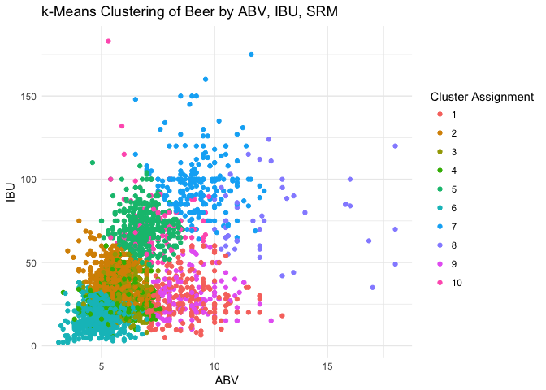

# Data Science Musings on Beer
`r format(Sys.time(), '%B %d, %Y')`  

* Main motivation of the project
  * Are there natural clusters in beer that are defined by styles? Or are style boundaries more or less arbitrary?
    * Unsupervised (k-means) clustering based on 
      * ABV (alcohol by volume), IBU (international bitterness units), SRM (measure of color)
    * Style centers defined by mean of ABV, IBU, and SRM
      
* Answer
  * Looks more or less fluid: there aren't really pockets centered around a style
  

### General Workflow

* Hit the BreweryDB API to iteratively pull in all beers and their ingredients
  * Dump them into a MySQL database along with other things we'd want like breweries and glassware
* Unnest the JSON response including all the ingredients columns
* Create a `style_collapsed` column
  * Look for main style strings like `Pale Ale` and chop out everything else
* Unnest the ingredients `hops` and `malts` into a sparse matrix

* Data courtesy of [BreweryDB](http://www.brewerydb.com/developers)
    * Special thanks to [Kris Kroksi](https://kro.ski/) for data ideation and beer

## Unsupervised Clustering 
* Pare down to beers that have ABV, IBU, and SRM
* K-means cluster beers based on these predictors

style                                                            n     n_scaled
-----------------------------------------------------------  -----  -----------
American-Style India Pale Ale                                 6156    8.7938700
American-Style Pale Ale                                       3734    5.1205610
Imperial or Double India Pale Ale                             2525    3.2869398
French & Belgian-Style Saison                                 2167    2.7439816
American-Style Amber/Red Ale                                  1961    2.4315532
Golden or Blonde Ale                                          1547    1.8036631
American-Style Imperial Stout                                 1518    1.7596804
American-Style Brown Ale                                      1462    1.6747484
Brown Porter                                                  1451    1.6580654
American-Style Stout                                          1401    1.5822332
South German-Style Hefeweizen / Hefeweissbier                 1089    1.1090406
Specialty Beer                                                1044    1.0407917
Belgian-Style White (or Wit) / Belgian-Style Wheat             973    0.9331101
Fruit Beer                                                     905    0.8299783
Herb and Spice Beer                                            872    0.7799291
Light American Wheat Ale or Lager with Yeast                   837    0.7268466
American-Style Sour Ale                                        797    0.6661809
American-Style Lager                                           794    0.6616310
Belgian-Style Tripel                                           734    0.5706324
German-Style Pilsener                                          696    0.5130000
Sweet or Cream Stout                                           695    0.5114833
Oatmeal Stout                                                  624    0.4038017
American-Style Black Ale                                       622    0.4007684
American-Style Barley Wine Ale                                 605    0.3749855
German-Style Kölsch / Köln-Style Kölsch                        593    0.3567858
American-Style Premium Lager                                   585    0.3446526
American-Style Pilsener                                        572    0.3249363
Irish-Style Red Ale                                            560    0.3067366
Belgian-Style Pale Ale                                         546    0.2855036
Wood- and Barrel-Aged Beer                                     540    0.2764037
Robust Porter                                                  522    0.2491041
Extra Special Bitter                                           516    0.2400043
Other Belgian-Style Ales                                       506    0.2248378
Belgian-Style Blonde Ale                                       497    0.2111881
Pumpkin Beer                                                   458    0.1520390
Berliner-Style Weisse (Wheat)                                  450    0.1399058
American-Style Cream Ale or Lager                              448    0.1368726
Ordinary Bitter                                                423    0.0989565
Rye Ale or Lager with or without Yeast                         403    0.0686236
Belgian-Style Dubbel                                           399    0.0625571
Scotch Ale                                                     393    0.0534572
Belgian-Style Dark Strong Ale                                  389    0.0473906
Strong Ale                                                     378    0.0307076
German-Style Doppelbock                                        376    0.0276743
Fruit Cider                                                    370    0.0185744
German-Style Märzen                                            370    0.0185744
Session India Pale Ale                                         368    0.0155411
English-Style Brown Ale                                        345   -0.0193417
Specialty Stouts                                               345   -0.0193417
English-Style India Pale Ale                                   334   -0.0360247
Belgian-Style Pale Strong Ale                                  324   -0.0511912
German-Style Altbier                                           314   -0.0663576
German-Style Heller Bock/Maibock                               311   -0.0709075
Imperial Red Ale                                               306   -0.0784907
Common Cider                                                   304   -0.0815240
American-Style Märzen / Oktoberfest                            295   -0.0951738
Classic Irish-Style Dry Stout                                  294   -0.0966904
Vienna-Style Lager                                             293   -0.0982071
South German-Style Dunkel Weizen / Dunkel Weissbier            288   -0.1057903
Wood- and Barrel-Aged Sour Beer                                284   -0.1118569
Session Beer                                                   278   -0.1209567
Old Ale                                                        272   -0.1300566
Classic English-Style Pale Ale                                 271   -0.1315732
German-Style Schwarzbier                                       269   -0.1346065
Bohemian-Style Pilsener                                        266   -0.1391564
American-Style Imperial Porter                                 261   -0.1467397
Münchner (Munich)-Style Helles                                 261   -0.1467397
Coffee-Flavored Beer                                           252   -0.1603894
Traditional German-Style Bock                                  238   -0.1816224
Belgian-Style Quadrupel                                        235   -0.1861724
Dortmunder / European-Style Export                             232   -0.1907223
Scottish-Style Heavy Ale                                       230   -0.1937556
American-Style Light (Low Calorie) Lager                       216   -0.2149886
Other Specialty Cider or Perry                                 214   -0.2180219
Light American Wheat Ale or Lager without Yeast                211   -0.2225718
Baltic-Style Porter                                            208   -0.2271217
Fruit Wheat Ale or Lager with or without Yeast                 194   -0.2483547
English-Style Pale Mild Ale                                    191   -0.2529047
Contemporary Gose                                              184   -0.2635212
German-Style Oktoberfest / Wiesen (Meadow)                     184   -0.2635212
American-Style Amber Lager                                     182   -0.2665544
Belgian-Style Flanders Oud Bruin or Oud Red Ales               177   -0.2741377
British-Style Imperial Stout                                   170   -0.2847542
Smoke Beer (Lager or Ale)                                      169   -0.2862708
European-Style Dark / Münchner Dunkel                          168   -0.2877874
California Common Beer                                         158   -0.3029539
French-Style Bière de Garde                                    158   -0.3029539
British-Style Barley Wine Ale                                  157   -0.3044705
Special Bitter or Best Bitter                                  153   -0.3105371
Belgian-Style Fruit Lambic                                     151   -0.3135704
International-Style Pilsener                                   151   -0.3135704
Wood- and Barrel-Aged Dark Beer                                149   -0.3166037
Foreign (Export)-Style Stout                                   146   -0.3211536
South German-Style Weizenbock / Weissbock                      146   -0.3211536
Wild Beer                                                      140   -0.3302534
Bamberg-Style Weiss (Smoke) Rauchbier (Dunkel or Helles)       139   -0.3317701
Wood- and Barrel-Aged Strong Beer                              137   -0.3348034
Specialty Honey Lager or Ale                                   136   -0.3363200
American-Style Dark Lager                                      131   -0.3439032
English-Style Dark Mild Ale                                    129   -0.3469365
Smoke Porter                                                   127   -0.3499698
American-Style Strong Pale Ale                                 126   -0.3514864
Flavored Malt Beverage                                         125   -0.3530031
German-Style Leichtbier                                        125   -0.3530031
Fresh "Wet" Hop Ale                                            117   -0.3651362
Leipzig-Style Gose                                             117   -0.3651362
American-Style Wheat Wine Ale                                  115   -0.3681695
Kellerbier (Cellar beer) or Zwickelbier - Ale                  102   -0.3878859
Scottish-Style Light Ale                                        94   -0.4000190
Non-Alcoholic (Beer) Malt Beverages                             93   -0.4015357
Other Strong Ale or Lager                                       87   -0.4106355
Brett Beer                                                      80   -0.4212520
Chocolate / Cocoa-Flavored Beer                                 80   -0.4212520
International-Style Pale Ale                                    77   -0.4258019
English Cider                                                   75   -0.4288352
Sweet Mead                                                      73   -0.4318685
English-Style Summer Ale                                        72   -0.4333852
German-Style Leichtes Weizen / Weissbier                        72   -0.4333852
Dry Mead                                                        68   -0.4394517
Scottish-Style Export Ale                                       66   -0.4424850
Experimental Beer (Lager or Ale)                                64   -0.4455183
Kellerbier (Cellar beer) or Zwickelbier - Lager                 59   -0.4531015
South German-Style Kristall Weizen / Kristall Weissbier         58   -0.4546182
German-Style Rye Ale (Roggenbier) with or without Yeast         56   -0.4576514
Open Category Mead                                              56   -0.4576514
American-Style Malt Liquor                                      50   -0.4667513
Gluten-Free Beer                                                50   -0.4667513
Pale American-Belgo-Style Ale                                   47   -0.4713012
Semi-Sweet Mead                                                 46   -0.4728179
Australian-Style Pale Ale                                       43   -0.4773678
Dark American Wheat Ale or Lager with Yeast                     42   -0.4788844
Dark American-Belgo-Style Ale                                   39   -0.4834344
Belgian-Style Lambic                                            38   -0.4849510
Aged Beer (Ale or Lager)                                        36   -0.4879843
Australasian, Latin American or Tropical-Style Light Lager      36   -0.4879843
Belgian-Style Table Beer                                        36   -0.4879843
Braggot                                                         36   -0.4879843
Chili Pepper Beer                                               36   -0.4879843
New England Cider                                               36   -0.4879843
Wood- and Barrel-Aged Pale to Amber Beer                        36   -0.4879843
Belgian-Style Gueuze Lambic                                     33   -0.4925342
Historical Beer                                                 33   -0.4925342
Field Beer                                                      31   -0.4955675
American-Style Amber (Low Calorie) Lager                        24   -0.5061840
Cyser (Apple Melomel)                                           24   -0.5061840
Double Red Ale                                                  24   -0.5061840
Indigenous Beer (Lager or Ale)                                  23   -0.5077007
American-Style Low-Carbohydrate Light Lager                     22   -0.5092173
Dark American Wheat Ale or Lager without Yeast                  20   -0.5122506
French Cider                                                    18   -0.5152839
German-Style Eisbock                                            17   -0.5168005
Belgian-style Fruit Beer                                        16   -0.5183172
South German-Style Bernsteinfarbenes Weizen / Weissbier         16   -0.5183172
Dry Lager                                                       15   -0.5198338
Bamberg-Style Helles Rauchbier                                  14   -0.5213504
Grodziskie                                                      14   -0.5213504
Bamberg-Style Märzen Rauchbier                                  10   -0.5274170
Energy Enhanced Malt Beverage                                    9   -0.5289337
Bamberg-Style Bock Rauchbier                                     7   -0.5319669
Other Fruit Melomel                                              7   -0.5319669
Traditional Perry                                                7   -0.5319669
Common Perry                                                     5   -0.5350002
Ginjo Beer or Sake-Yeast Beer                                    5   -0.5350002
American-Style Ice Lager                                         3   -0.5380335
Adambier                                                         2   -0.5395502
Mixed Culture Brett Beer                                         2   -0.5395502
Apple Wine                                                       1   -0.5410668
Dutch-Style Kuit, Kuyt or Koyt                                   1   -0.5410668
Metheglin                                                        1   -0.5410668
Pyment (Grape Melomel)                                           1   -0.5410668

Cluster counts vs. styles

                                                       1     2    3    4     5    6     7    8    9   10
---------------------------------------------------  ---  ----  ---  ---  ----  ---  ----  ---  ---  ---
American-Style Amber/Red Ale                           2    33    8   87     9   18     2    0    1    4
American-Style Barley Wine Ale                         7     0    0    0     2    0    19   15    2    0
American-Style Black Ale                               0     0    4    1     0    0     0    0    2   36
American-Style Brown Ale                               1     1   20   68     2    7     1    1    6    3
American-Style Cream Ale or Lager                      3     4    0    1     0   43     0    0    0    0
American-Style Imperial Stout                          2     0    3    0     0    0     0   23   10    9
American-Style India Pale Ale                          2    64    1    6   395    1    27    0    0   26
American-Style Lager                                   1     9    1    7     4   29     0    0    0    0
American-Style Pale Ale                                5   211    1   25    29   32     0    0    1    3
American-Style Pilsener                                1    15    0    0     2   28     1    0    0    1
American-Style Premium Lager                           0     0    1    4     0   14     0    0    0    0
American-Style Sour Ale                                1     4    1    2     1   17     0    0    2    0
American-Style Stout                                   0     3   24    1     0    1     0    0    3    9
Belgian-Style Blonde Ale                              16     6    1    0     0   21     0    0    0    0
Belgian-Style Dark Strong Ale                         10     0    1    1     0    0     0    1   21    0
Belgian-Style Dubbel                                   8     0    1   14     1    0     0    0   16    1
Belgian-Style Pale Ale                                 6    10    0    5     3   18     0    0    0    0
Belgian-Style Tripel                                  59     1    0    0     0    0     2    0    2    1
Belgian-Style White (or Wit) / Belgian-Style Wheat     4     1    0    3     0   71     0    0    0    0
Berliner-Style Weisse (Wheat)                          0     0    0    0     0   26     0    0    0    0
Brown Porter                                           0     0   51   24     0    0     0    0    3    0
Extra Special Bitter                                   0    26    0   18     2    5     0    0    0    1
French & Belgian-Style Saison                         35    44    2    6     2   48     0    0    2    0
Fruit Beer                                             5     2    2    6     4   36     0    1    0    0
Fruit Cider                                            0     0    0    0     0    1     0    0    0    0
German-Style Doppelbock                                7     0    1    4     0    0     0    0   16    1
German-Style Kölsch / Köln-Style Kölsch                0     3    0    1     1   67     0    0    0    0
German-Style Märzen                                    0     2    1   15     0   12     0    0    0    0
German-Style Pilsener                                  0    24    0    1     1   18     0    0    0    0
Golden or Blonde Ale                                   5    12    0    3     1   94     0    0    1    0
Herb and Spice Beer                                    5     4    8   11     6   13     0    1    6    1
Imperial or Double India Pale Ale                      5     0    0    0    38    0   174    6    0    9
Irish-Style Red Ale                                    0     3    6   40     1   11     1    0    0    2
Light American Wheat Ale or Lager with Yeast           1    12    0    3     3   47     0    0    0    0
Oatmeal Stout                                          0     0   32    0     0    0     0    0    2    1
Ordinary Bitter                                        1     2    0    7     0    8     0    0    0    0
Other Belgian-Style Ales                               6     5    4    7     8    3     1    0    4    1
Pumpkin Beer                                           9     3    5   18     0    7     0    0    4    0
Robust Porter                                          0     1   51    5     0    0     0    0    8    3
Rye Ale or Lager with or without Yeast                 1     8    1    5    16    4     2    0    0    4
Scotch Ale                                             7     1    4    9     0    0     0    0   12    0
Session India Pale Ale                                 0    29    0    0     2    5     0    0    0    0
South German-Style Hefeweizen / Hefeweissbier          4     1    0    0     1   84     0    0    0    0
Specialty Beer                                        11     5    8   13     5   15     1    0    6    1
Strong Ale                                            11     0    1    1     0    0     4    3    1    2
Sweet or Cream Stout                                   0     0   32    1     0    0     0    1    7    0
Wood- and Barrel-Aged Beer                             5     3    2    4     1    2     1    1    4    0

name                                                      style                                           styleId   style_collapsed    abv    ibu   srm
--------------------------------------------------------  ----------------------------------------------  --------  ----------------  ----  -----  ----
"Ah Me Joy" Porter                                        Robust Porter                                   19        Porter             5.4   51.0    40
"Bison Eye Rye" Pale Ale | 2 of 4 Part Pale Ale Series    American-Style Pale Ale                         25        Pale Ale           5.8   51.0     8
"Dust Up" Cloudy Pale Ale | 1 of 4 Part Pale Ale Series   American-Style Pale Ale                         25        Pale Ale           5.4   54.0    11
"God Country" Kolsch                                      German-Style Kölsch / Köln-Style Kölsch         45        Kölsch             5.6   28.2     5
"Jemez Field Notes" Golden Lager                          Golden or Blonde Ale                            36        Blonde             4.9   20.0     5
#10 Hefewiezen                                            South German-Style Hefeweizen / Hefeweissbier   48        Wheat              5.1   11.0     4

<!-- -->

## Plot clusters related to style centers

<!-- -->

