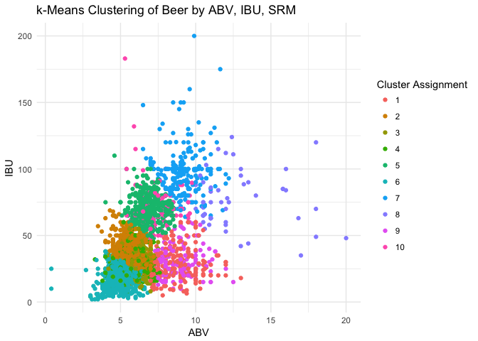
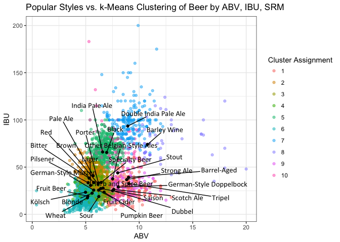

# Musings on Beer
`r format(Sys.time(), '%B %d, %Y')`  


* Data courtesy of [BreweryDB](http://www.brewerydb.com/developers)
    * Special thanks to [Kris Kroksi](https://kro.ski/)


## Unsupervised Clustering 
* Pare down to beers that have ABV, IBU, and SRM
* K-means cluster beers based on these predictors


name                                                                 style                                                styleId   style_collapsed               abv      ibu   srm
-------------------------------------------------------------------  ---------------------------------------------------  --------  -------------------------  ------  -------  ----
"Ah Me Joy" Porter                                                   Robust Porter                                        19        Porter                       5.40    51.00    40
"Bison Eye Rye" Pale Ale | 2 of 4 Part Pale Ale Series               American-Style Pale Ale                              25        Pale Ale                     5.80    51.00     8
"Dust Up" Cloudy Pale Ale | 1 of 4 Part Pale Ale Series              American-Style Pale Ale                              25        Pale Ale                     5.40    54.00    11
"God Country" Kolsch                                                 German-Style Kölsch / Köln-Style Kölsch              45        Kölsch                       5.60    28.20     5
"Jemez Field Notes" Golden Lager                                     Golden or Blonde Ale                                 36        Blonde                       4.90    20.00     5
#10 Hefewiezen                                                       South German-Style Hefeweizen / Hefeweissbier        48        Wheat                        5.10    11.00     4
#9                                                                   American-Style Pale Ale                              25        Pale Ale                     5.10    20.00     9
#KoLSCH                                                              German-Style Kölsch / Köln-Style Kölsch              45        Kölsch                       4.80    27.00     3
'Inappropriate' Cream Ale                                            American-Style Cream Ale or Lager                    109       Lager                        5.30    18.00     5
'tis the Saison                                                      French & Belgian-Style Saison                        72        Saison                       7.00    30.00     7
(306) URBAN WHEAT BEER                                               Belgian-Style White (or Wit) / Belgian-Style Wheat   65        Wheat                        5.00    20.00     9
(512) Bruin (A.K.A. Brown Bear)                                      American-Style Brown Ale                             37        Brown                        7.60    30.00    21
(512) FOUR                                                           Strong Ale                                           14        Strong Ale                   7.50    35.00     8
(512) IPA                                                            American-Style India Pale Ale                        30        India Pale Ale               7.00    65.00     8
(512) Pale                                                           American-Style Pale Ale                              25        Pale Ale                     6.00    30.00     7
(512) SIX                                                            Belgian-Style Dubbel                                 58        Dubbel                       7.50    25.00    28
(512) THREE                                                          Belgian-Style Tripel                                 59        Tripel                       9.50    22.00    10
(512) THREE (Cabernet Barrel Aged)                                   Belgian-Style Tripel                                 59        Tripel                       9.50    22.00    40
(512) TWO                                                            Imperial or Double India Pale Ale                    31        Double India Pale Ale        9.00    99.00     9
(512) White IPA                                                      American-Style India Pale Ale                        30        India Pale Ale               5.30    55.00     4
(512) Wit                                                            Belgian-Style White (or Wit) / Belgian-Style Wheat   65        Wheat                        5.10    10.00     5
(904) Weissguy                                                       South German-Style Hefeweizen / Hefeweissbier        48        Wheat                        4.40    19.00     4
(916)                                                                American-Style Pale Ale                              25        Pale Ale                     5.20    35.00     8
+1 Pumpkin                                                           Pumpkin Beer                                         121       Pumpkin Beer                 6.30    24.00    13
077XX India Pale Ale                                                 Imperial or Double India Pale Ale                    31        Double India Pale Ale        7.80    80.00     5
08.08.08 Vertical Epic Ale                                           Belgian-Style Pale Ale                               62        Pale Ale                     8.90    45.00     5
10 Blocks South                                                      American-Style Pale Ale                              25        Pale Ale                     5.50    56.00     9
10 Ton                                                               Oatmeal Stout                                        21        Stout                        7.00    30.00    34
100 Barrel Series #54 Nordic Saison                                  French & Belgian-Style Saison                        72        Saison                       6.10    30.00     4
1020 Pale Ale                                                        American-Style Pale Ale                              25        Pale Ale                     5.30    40.00    12
110K+OT Batch #9                                                     American-Style Brown Ale                             37        Brown                        9.80    59.00    36
12 Gauge                                                             American-Style India Pale Ale                        30        India Pale Ale               9.90   100.00     9
120 Minute IPA                                                       Imperial or Double India Pale Ale                    31        Double India Pale Ale       18.00   120.00    21
13 Rebels ESB                                                        Extra Special Bitter                                 5         Bitter                       5.20    42.00     7
15 Hands                                                             Wood- and Barrel-Aged Beer                           132       Barrel-Aged                  5.50    34.00     7
1805 IPA                                                             American-Style India Pale Ale                        30        India Pale Ale               6.00    60.00    15
1890 Founder's Ale                                                   American-Style Amber/Red Ale                         32        Red                          6.10    30.00    19
19th Amendment Imperial Stout                                        American-Style Imperial Stout                        43        Stout                        7.80    35.00    40
1st Anniversary Ale                                                  Imperial or Double India Pale Ale                    31        Double India Pale Ale        9.30   100.00     7
1ZENUFF                                                              Imperial or Double India Pale Ale                    31        Double India Pale Ale       11.00   100.00    13
2 Turtle Doves                                                       Belgian-Style Dark Strong Ale                        64        Strong Ale                  12.00    25.00    30
20 Pounds of Pumpkin                                                 Pumpkin Beer                                         121       Pumpkin Beer                 5.70    14.00    33
2013 Holiday IPA                                                     American-Style India Pale Ale                        30        India Pale Ale               7.70    60.00    12
20th Birthday Suit                                                   American-Style Sour Ale                              40        Sour                         7.40    20.00    20
21st Anniversary                                                     Specialty Beer                                       125       Specialty Beer              10.20    28.00    24
21st Anniversary Ale                                                 Wood- and Barrel-Aged Beer                           132       Barrel-Aged                 10.20    28.00    24
2200lbs of Sin                                                       American-Style Barley Wine Ale                       34        Barley Wine                  9.20    96.00    18
2nd Anniversary Ale                                                  American-Style India Pale Ale                        30        India Pale Ale               7.50    74.00    14
3 Bagger                                                             Belgian-Style Tripel                                 59        Tripel                       9.00    40.00     5
3 Bolt Pale Ale                                                      American-Style Pale Ale                              25        Pale Ale                     4.50    35.00    17
3 French Hens                                                        Belgian-Style Dark Strong Ale                        64        Strong Ale                  10.00    22.50    30
30A Beach Blonde                                                     Golden or Blonde Ale                                 36        Blonde                       4.60    13.00     3
31 Kings                                                             American-Style India Pale Ale                        30        India Pale Ale               6.50    75.00    11
312 Urban Wheat Ale                                                  Light American Wheat Ale or Lager with Yeast         112       Wheat                        4.20    18.00     3
3333′ Imperial IPA                                                   Imperial or Double India Pale Ale                    31        Double India Pale Ale        8.70    85.00    16
3rd Ring Belgian Strong Ale                                          Belgian-Style Dark Strong Ale                        64        Strong Ale                  10.50    21.00    15
4 Foot Drop                                                          American-Style Pale Ale                              25        Pale Ale                     4.00    46.00     6
4-Leaf Irish Red Ale                                                 Irish-Style Red Ale                                  22        Red                          5.50    21.00    25
423 Blonde Ale                                                       Golden or Blonde Ale                                 36        Blonde                       5.00    10.90     5
471 Double IPA Small Batch                                           American-Style India Pale Ale                        30        India Pale Ale               9.20    70.00    11
5 Barrel Pale Ale                                                    Ordinary Bitter                                      3         Bitter                       5.20    36.00    25
5 Rabbit                                                             Golden or Blonde Ale                                 36        Blonde                       5.30    30.00     5
5-Day IPA                                                            American-Style India Pale Ale                        30        India Pale Ale               6.10    66.00     9
500 Monks Strong Belgian Ale                                         Belgian-Style Pale Ale                               62        Pale Ale                     8.00    29.00    19
503 Amber Ale                                                        American-Style Amber/Red Ale                         32        Red                          5.30    34.00    14
530 Belgian Pale Ale                                                 Belgian-Style Pale Ale                               62        Pale Ale                     5.30    22.00     9
60 Minute IPA                                                        American-Style India Pale Ale                        30        India Pale Ale               6.00    60.00     9
6th Street Wheat                                                     Light American Wheat Ale or Lager with Yeast         112       Wheat                        5.12    19.40     4
7 AM                                                                 Oatmeal Stout                                        21        Stout                        7.50    29.00    28
7 Grain Saison                                                       French & Belgian-Style Saison                        72        Saison                       5.00    35.00     6
7 Hop                                                                American-Style India Pale Ale                        30        India Pale Ale               7.77    90.00    17
8 Second Kölsch                                                      German-Style Kölsch / Köln-Style Kölsch              45        Kölsch                       5.00    15.00     2
801 Small Batch Pilsner                                              German-Style Pilsener                                75        Pilsener                     4.00    22.00     4
805                                                                  Golden or Blonde Ale                                 36        Blonde                       4.70    20.00     7
9-Pin Kolsch                                                         German-Style Kölsch / Köln-Style Kölsch              45        Kölsch                       6.80    24.00     7
90 Minute IPA                                                        Imperial or Double India Pale Ale                    31        Double India Pale Ale        9.00    90.00     9
919 Pale Ale                                                         American-Style Pale Ale                              25        Pale Ale                     7.20    60.00     6
99 Shilling                                                          Scotch Ale                                           15        Scotch Ale                   6.20    31.00    18
9th Island Pineapple Sour                                            American-Style Sour Ale                              40        Sour                         5.00     7.00     4
A Little Hoppy                                                       Session India Pale Ale                               164       India Pale Ale               4.60    65.00     6
A Partridge in a Pear Tree                                           Belgian-Style Dark Strong Ale                        64        Strong Ale                  11.00    20.00    20
A-Town Brown                                                         American-Style Brown Ale                             37        Brown                        6.50    16.00    18
A.P.A                                                                American-Style Pale Ale                              25        Pale Ale                     5.30    33.00    11
A57S Kölsch                                                          German-Style Kölsch / Köln-Style Kölsch              45        Kölsch                       5.50    20.00     4
Abbey Ale                                                            Belgian-Style Dubbel                                 58        Dubbel                       8.00    20.00    31
Abbey Ale                                                            Belgian-Style Dubbel                                 58        Dubbel                       8.20    20.00    38
Abbey Blonde                                                         Belgian-Style Blonde Ale                             61        Blonde                       6.10    40.00     5
Abbey Brune                                                          Other Belgian-Style Ales                             70        Other Belgian-Style Ales     6.30    15.00    15
Abbey Dubbel                                                         Belgian-Style Dubbel                                 58        Dubbel                       6.90    25.00    18
Abbey Terno                                                          Belgian-Style Dubbel                                 58        Dubbel                       7.50    24.00    17
Abby's Amber Ale                                                     American-Style Amber/Red Ale                         32        Red                          6.00    31.70    11
Abigale                                                              Other Belgian-Style Ales                             70        Other Belgian-Style Ales     8.00    52.00    14
Abiqua Black                                                         American-Style Black Ale                             41        Black                        6.50    70.00    36
Abrasive Ale                                                         Imperial or Double India Pale Ale                    31        Double India Pale Ale        9.20   120.00     8
Acclimator Doppelbock                                                German-Style Doppelbock                              90        German-Style Doppelbock      7.60    30.00    20
Accumulation                                                         American-Style India Pale Ale                        30        India Pale Ale               6.20    70.00    10
Ace In The Hole IPA                                                  American-Style India Pale Ale                        30        India Pale Ale               7.20    58.70    13
Ace IPA                                                              American-Style India Pale Ale                        30        India Pale Ale               7.40    83.00    13
Adamanthea: Adelaide Sparkling Ale                                   Ordinary Bitter                                      3         Bitter                       4.20    30.00     8
Adambier                                                             American-Style Sour Ale                              40        Sour                         9.00    40.00    28
Addendum French Toast Ale                                            Herb and Spice Beer                                  124       Herb and Spice Beer          6.30    27.80    19
Aerial IPA                                                           American-Style India Pale Ale                        30        India Pale Ale               6.50    65.00     8
Aesel Kolsch                                                         German-Style Kölsch / Köln-Style Kölsch              45        Kölsch                       4.70    28.00     4
After Midnight Moo                                                   Sweet or Cream Stout                                 20        Stout                        5.40    28.00    38
Afterburner                                                          Imperial or Double India Pale Ale                    31        Double India Pale Ale       11.60   100.00     6
AfterBurner Habanero Ale                                             Specialty Beer                                       125       Specialty Beer               4.20    22.50     4
Agate Lake Pale Ale                                                  American-Style Pale Ale                              25        Pale Ale                     5.80    40.00     8
Airdale Afterburner                                                  American-Style Amber/Red Ale                         32        Red                          5.30    34.00    18
Airdale Altitude                                                     American-Style Pale Ale                              25        Pale Ale                     6.10    47.00     8
Airdale Homecoming                                                   Herb and Spice Beer                                  124       Herb and Spice Beer          5.50    25.00    35
Airdale Horizon                                                      South German-Style Hefeweizen / Hefeweissbier        48        Wheat                        4.90    12.00     5
Alaskan Amber                                                        American-Style Amber/Red Ale                         32        Red                          5.30    18.00    22
Alaskan Birch Bock                                                   German-Style Doppelbock                              90        German-Style Doppelbock      8.50    20.00    30
Alaskan Imperial IPA                                                 Imperial or Double India Pale Ale                    31        Double India Pale Ale        8.50    70.00    18
Alaskan White                                                        Belgian-Style White (or Wit) / Belgian-Style Wheat   65        Wheat                        5.30    15.00     7
Alden                                                                Imperial or Double India Pale Ale                    31        Double India Pale Ale        8.00    80.00     5
Ale Diablo                                                           Golden or Blonde Ale                                 36        Blonde                       8.50    33.00     5
Ale Primeur                                                          Belgian-Style Pale Ale                               62        Pale Ale                     5.80    35.00    11
Alenda Weissbier                                                     South German-Style Hefeweizen / Hefeweissbier        48        Wheat                        5.20    10.00    12
Alestake and Evergreen                                               American-Style India Pale Ale                        30        India Pale Ale               5.90    55.00     6
Alexander Porter                                                     Brown Porter                                         18        Porter                       5.70    12.00    30
All American IPA - Legend Series                                     American-Style India Pale Ale                        30        India Pale Ale               6.50    71.00     6
All Call                                                             German-Style Kölsch / Köln-Style Kölsch              45        Kölsch                       5.00    25.00     3
All Call                                                             German-Style Kölsch / Köln-Style Kölsch              45        Kölsch                       5.00    25.00     3
All Day IPA                                                          Session India Pale Ale                               164       India Pale Ale               4.70    42.00     9
All Green Everything                                                 Imperial or Double India Pale Ale                    31        Double India Pale Ale       10.50   120.00    13
All Jacked Up                                                        Robust Porter                                        19        Porter                       5.70    34.00    40
All Rise Session Pale Ale                                            American-Style Pale Ale                              25        Pale Ale                     4.20    25.00     5
All Rise Temporary Solution                                          Brown Porter                                         18        Porter                       6.20    33.00    30
Allie's Big Hitter                                                   Light American Wheat Ale or Lager with Yeast         112       Wheat                        5.20    48.70     6
Almanac IPA                                                          American-Style India Pale Ale                        30        India Pale Ale               6.25    72.00     5
Alpenglow Wheat Ale                                                  Light American Wheat Ale or Lager with Yeast         112       Wheat                        4.70    14.00     4
Alpha Ale                                                            American-Style Amber/Red Ale                         32        Red                          5.20    38.00    14
Alpha Dog Imperial IPA                                               Imperial or Double India Pale Ale                    31        Double India Pale Ale        8.50   127.00     6
Alpha King                                                           American-Style Pale Ale                              25        Pale Ale                     6.70    68.00    21
Alpha Klaus                                                          Brown Porter                                         18        Porter                       6.00    38.00    37
Alpine Meadows Saison                                                French & Belgian-Style Saison                        72        Saison                       7.90    35.00     6
Alpirsbacher Klosterbräu Pils                                        German-Style Pilsener                                75        Pilsener                     4.90    28.00     5
Alter Ego                                                            French & Belgian-Style Saison                        72        Saison                       6.20    33.00     5
Alternate Side American Stout                                        American-Style Stout                                 42        Stout                        8.10    57.00    35
Amarilla Gorilla IPA                                                 American-Style India Pale Ale                        30        India Pale Ale               7.80    63.00     5
Amber                                                                German-Style Märzen                                  81        German-Style Märzen          5.38    28.00    16
Amber Ale                                                            American-Style Amber/Red Ale                         32        Red                          5.20    24.00    15
Amber Ale                                                            American-Style Amber/Red Ale                         32        Red                          5.50    30.00    13
Amber Ale                                                            American-Style Amber/Red Ale                         32        Red                          5.70    37.00    16
Amber Ale                                                            American-Style Amber/Red Ale                         32        Red                          6.00    44.00    15
Amber Ale                                                            American-Style Amber/Red Ale                         32        Red                          6.00    23.00    15
Amber Ale                                                            American-Style Amber/Red Ale                         32        Red                          5.00    12.00     8
Amber Ale                                                            American-Style Amber/Red Ale                         32        Red                          5.50    33.00    11
Amberosia                                                            Irish-Style Red Ale                                  22        Red                          5.50    25.00    12
AmericAle                                                            American-Style Amber/Red Ale                         32        Red                          6.30    45.00    15
American Amber Ale                                                   American-Style Amber/Red Ale                         32        Red                          6.50    42.00    18
American Blonde                                                      German-Style Kölsch / Köln-Style Kölsch              45        Kölsch                       4.50    16.00     8
American Brown Ale (Can Sessions)                                    American-Style Brown Ale                             37        Brown                        5.00    30.00    21
American Dream                                                       American-Style Pale Ale                              25        Pale Ale                     5.30    39.00     8
American Expedition                                                  Light American Wheat Ale or Lager with Yeast         112       Wheat                        4.50    15.00     3
American Flyer                                                       American-Style Lager                                 93        Lager                        4.70    15.00     4
American IPA                                                         American-Style India Pale Ale                        30        India Pale Ale               7.00    76.00     8
American Pale Ale                                                    American-Style Pale Ale                              25        Pale Ale                     5.40    35.00     9
American Pale Ale                                                    American-Style Pale Ale                              25        Pale Ale                     4.50    38.00     9
American Pale Ale                                                    American-Style Pale Ale                              25        Pale Ale                     5.20    35.00     6
American Pale Ale                                                    American-Style Pale Ale                              25        Pale Ale                     5.70    35.00    18
American Pale Ale                                                    American-Style Pale Ale                              25        Pale Ale                     5.00    25.00    15
American Pale Ale                                                    American-Style Pale Ale                              25        Pale Ale                     5.50    40.00     7
American Pilsner                                                     American-Style Pilsener                              98        Pilsener                     5.00    21.00     6
American Sour Ale                                                    American-Style Sour Ale                              40        Sour                         6.50    10.00    30
American Wheat                                                       Light American Wheat Ale or Lager with Yeast         112       Wheat                        5.50    19.00     5
American White                                                       Belgian-Style White (or Wit) / Belgian-Style Wheat   65        Wheat                        4.80    13.00     3
American Wit                                                         Belgian-Style White (or Wit) / Belgian-Style Wheat   65        Wheat                        4.80    13.00     6
Americano Stout                                                      American-Style Imperial Stout                        43        Stout                        8.70    65.00    40
Americus IPA                                                         American-Style India Pale Ale                        30        India Pale Ale               6.40    55.00     6
Amra Mango IPA                                                       American-Style India Pale Ale                        30        India Pale Ale               6.70    52.00     5
Amstel 1870 Pilsner                                                  American-Style Pilsener                              98        Pilsener                     5.00    26.00    12
Anchor Slammer Pale Ale                                              American-Style Pale Ale                              25        Pale Ale                     5.50    45.00     9
Anchorsmith Amber Ale                                                American-Style Amber/Red Ale                         32        Red                          5.90    34.00    15
Andygator                                                            German-Style Doppelbock                              90        German-Style Doppelbock      8.00    25.00     8
Angel Seat Amber Ale                                                 American-Style Amber/Red Ale                         32        Red                          5.60    38.00    15
Angel's Trumpet                                                      American-Style India Pale Ale                        30        India Pale Ale               7.70    74.00    15
Angel's Trumpet                                                      American-Style India Pale Ale                        30        India Pale Ale               7.00    74.00    15
Anglers Pale Ale                                                     American-Style Pale Ale                              25        Pale Ale                     5.80    32.00    14
Anglican Extra Special Bitter                                        Extra Special Bitter                                 5         Bitter                       6.00    22.00    12
Angry Pirate - Aye Aye PA                                            Imperial or Double India Pale Ale                    31        Double India Pale Ale        9.10    70.00    13
Angry Planet Pale Ale                                                American-Style Pale Ale                              25        Pale Ale                     6.00    48.00    14
Anniversary Barley Wine                                              American-Style Barley Wine Ale                       34        Barley Wine                 10.40    72.00    20
Anonymous IPA                                                        American-Style India Pale Ale                        30        India Pale Ale               6.20    60.00    12
Anthem Golden Ale                                                    Golden or Blonde Ale                                 36        Blonde                       5.00    35.00     5
Antiquity                                                            American-Style Barley Wine Ale                       34        Barley Wine                 12.10    78.00    21
Anvil Ale                                                            Extra Special Bitter                                 5         Bitter                       4.20    30.00     9
Anvil ESB                                                            Extra Special Bitter                                 5         Bitter                       5.50    30.00    10
Apex Predator                                                        French & Belgian-Style Saison                        72        Saison                       6.50    25.00     5
Apocalypse IPA                                                       American-Style India Pale Ale                        30        India Pale Ale               6.50    65.00    13
Apollo                                                               American-Style Pale Ale                              25        Pale Ale                     5.20    11.00     4
Apollo Mono                                                          American-Style India Pale Ale                        30        India Pale Ale               5.80    68.00     9
Apolo                                                                American-Style Brown Ale                             37        Brown                        6.00    21.00    33
Apricot Weiss                                                        Berliner-Style Weisse (Wheat)                        46        Wheat                        4.50     4.00     3
Apricot Wheat                                                        Fruit Beer                                           119       Fruit Beer                   5.10    13.00     5
April IPA of the Month - "April Showers"                             American-Style India Pale Ale                        30        India Pale Ale               6.40    82.00     6
Ard Ri Imperial Red Ale                                              Irish-Style Red Ale                                  22        Red                          9.30    77.00    14
Argonaut's Amber                                                     American-Style Amber/Red Ale                         32        Red                          5.30    32.40    15
Arizona Honey Wheat                                                  Light American Wheat Ale or Lager with Yeast         112       Wheat                        5.20    16.00     2
Arkansas Red                                                         American-Style Amber/Red Ale                         32        Red                          5.20    16.00    13
Arkie Amber Ale                                                      American-Style Amber/Red Ale                         32        Red                          5.60    17.00    13
Arrowhead Red IPA                                                    American-Style Amber/Red Ale                         32        Red                          7.20    73.00    28
Arson Amber Ale                                                      American-Style Amber/Red Ale                         32        Red                          5.80    36.00    10
Artisan Pouseuré (Halloween)                                         Pumpkin Beer                                         121       Pumpkin Beer                 7.00    32.00     9
Artists Series: The Galactic Heroes IPA                              American-Style India Pale Ale                        30        India Pale Ale               7.00    65.00    14
Asgard IPA                                                           American-Style India Pale Ale                        30        India Pale Ale               6.50    65.00     6
Ashland Amber                                                        American-Style Amber/Red Ale                         32        Red                          5.40    24.00    15
Asylum Porter                                                        Brown Porter                                         18        Porter                       6.80    45.00    35
Audible Ale                                                          American-Style Pale Ale                              25        Pale Ale                     4.70    22.00     9
August IPA of the Month ("Spot")                                     American-Style India Pale Ale                        30        India Pale Ale               5.80    54.00     7
August IPA of the Month - "Coral"                                    American-Style India Pale Ale                        30        India Pale Ale               5.50    90.00     5
Augusta Ale                                                          American-Style Pale Ale                              25        Pale Ale                     5.50    34.00     9
Aureole                                                              German-Style Pilsener                                75        Pilsener                     5.40    45.00     3
Autopilot                                                            Golden or Blonde Ale                                 36        Blonde                       4.80    40.00     7
Autumnal Molé Stout                                                  Sweet or Cream Stout                                 20        Stout                        5.80    15.00    40
Autumnation                                                          Herb and Spice Beer                                  124       Herb and Spice Beer          6.70    58.00    15
AVIDITY                                                              American-Style India Pale Ale                        30        India Pale Ale               7.40    75.00     8
awesome sauce                                                        Wood- and Barrel-Aged Beer                           132       Barrel-Aged                  9.50    86.00    24
Axiom                                                                Other Belgian-Style Ales                             70        Other Belgian-Style Ales    10.50    28.00    19
Azacca Pale Ale                                                      American-Style Pale Ale                              25        Pale Ale                     6.00    36.00     4
Azacca Spring Ale                                                    American-Style Pale Ale                              25        Pale Ale                     5.50    38.00     9
B.D.T.K.                                                             German-Style Kölsch / Köln-Style Kölsch              45        Kölsch                       5.10    25.00     4
B/A/Y/S                                                              American-Style Imperial Stout                        43        Stout                        9.10    80.00    38
B/A/Y/S - Tequila Barrel Aged (Ghost 075)                            American-Style Imperial Stout                        43        Stout                        9.60    80.00    38
Bacchus IPA                                                          American-Style India Pale Ale                        30        India Pale Ale               6.50    65.00    10
Back Country Class VI                                                Imperial or Double India Pale Ale                    31        Double India Pale Ale        9.00    90.00    11
Backwoods Bastard                                                    Scotch Ale                                           15        Scotch Ale                  10.20    50.00    29
Backwoods Belgian                                                    Belgian-Style Blonde Ale                             61        Blonde                       8.51    25.00     6
Bacon Stout                                                          American-Style Imperial Stout                        43        Stout                        5.00    27.00    38
Bad Elmer’s Porter                                                   Robust Porter                                        19        Porter                       5.00    19.60    34
Baderbräu Lawnmower Lager                                            American-Style Lager                                 93        Lager                        5.50    45.00     6
Baderbräu Red Velvet                                                 American-Style Amber/Red Ale                         32        Red                          6.00    30.00    18
Badlands Extra Pale Ale                                              American-Style Pale Ale                              25        Pale Ale                     6.50    70.00     5
Bag O' Tricks Dbl IPA                                                Imperial or Double India Pale Ale                    31        Double India Pale Ale        8.60    70.00     7
Baked Pumpkin Ale                                                    Pumpkin Beer                                         121       Pumpkin Beer                 7.30    33.00    17
Bakers' Beach Pina Colada                                            American-Style India Pale Ale                        30        India Pale Ale               6.30    77.00     8
Baldwin FishEYE PA                                                   American-Style India Pale Ale                        30        India Pale Ale               6.50    65.00    16
Ballast Point Belgian-Style Tripel                                   Belgian-Style Tripel                                 59        Tripel                       9.80    34.00     7
Bancreagie Peated Scotch Ale                                         Strong Ale                                           14        Strong Ale                   7.60    20.00    11
Bang Bang                                                            Imperial or Double India Pale Ale                    31        Double India Pale Ale        8.90    90.00     8
Bangarang!™                                                          American-Style India Pale Ale                        30        India Pale Ale               6.40    65.00     9
Banshee Strong Scotch Ale                                            Strong Ale                                           14        Strong Ale                   7.90    26.20    16
Bar Belle Blonde Ale                                                 Belgian-Style Blonde Ale                             61        Blonde                       9.00    28.00     4
Bard's Song                                                          American-Style Brown Ale                             37        Brown                        6.00    20.00    24
Bare Ass Blonde                                                      Golden or Blonde Ale                                 36        Blonde                       5.00    19.00     9
Bare Bear                                                            Specialty Beer                                       125       Specialty Beer               7.00    24.00    21
Bare Bones Kolsch                                                    German-Style Kölsch / Köln-Style Kölsch              45        Kölsch                       5.00    21.00     4
BarFly IPA                                                           American-Style India Pale Ale                        30        India Pale Ale               6.50    70.00     8
BarleyWine                                                           American-Style Barley Wine Ale                       34        Barley Wine                 11.00    75.00    18
Barleywine                                                           American-Style Barley Wine Ale                       34        Barley Wine                  9.60    60.00    31
Barleywine                                                           American-Style Barley Wine Ale                       34        Barley Wine                 10.60    73.00    28
Barn Hopper                                                          Other Belgian-Style Ales                             70        Other Belgian-Style Ales     7.50    80.00     9
Barney Flats Oatmeal Stout                                           Oatmeal Stout                                        21        Stout                        5.80    15.00    37
Barney's Imperial Red                                                Imperial or Double India Pale Ale                    31        Double India Pale Ale        9.50   113.00    15
Barnraiser Pale Ale                                                  American-Style Pale Ale                              25        Pale Ale                     5.40    41.00     7
Barrel Aged Barley Wine · Barrel Cracker                             Wood- and Barrel-Aged Beer                           132       Barrel-Aged                 10.50    75.00    35
Barrel Aged BMX                                                      American-Style Barley Wine Ale                       34        Barley Wine                 10.30    58.00    40
Barrel Roll No. 3 - Pugachev's Cobra                                 American-Style Imperial Stout                        43        Stout                       15.80    85.00    40
Barrel Roll No. 3 - Pugachev's Cobra                                 American-Style Imperial Stout                        43        Stout                       15.80    85.00    40
Barrel-Aged Old Baba Yaga (Cognac)                                   American-Style Imperial Stout                        43        Stout                       11.50   115.00    40
Barrel-Aged Old Rasputin XVI                                         American-Style Imperial Stout                        43        Stout                       11.30    38.00    40
Barrel-Aged Old Rasputin XVIII                                       American-Style Imperial Stout                        43        Stout                       11.30    38.00    40
Barrel-Licked Bock                                                   Wood- and Barrel-Aged Beer                           132       Barrel-Aged                  6.40    34.00    22
Barrique Black Ale                                                   Robust Porter                                        19        Porter                       7.00    35.00    34
Bascom Blonde                                                        Golden or Blonde Ale                                 36        Blonde                       4.50    24.00     4
Base Camp Porter                                                     Brown Porter                                         18        Porter                       7.00    20.00    40
Base Jumper                                                          American-Style India Pale Ale                        30        India Pale Ale               7.20    80.00    16
Base Layer                                                           American-Style Black Ale                             41        Black                        6.00    19.00    26
Basil Ryeman                                                         Herb and Spice Beer                                  124       Herb and Spice Beer          6.25    28.00     8
Basin Mills Brown                                                    American-Style Brown Ale                             37        Brown                        5.20    25.00    16
Bass Ackwards Berryblue Ale                                          Fruit Beer                                           119       Fruit Beer                   4.40    13.40    21
Batch #10 Berliner Weisse - Brown Bag Series                         Berliner-Style Weisse (Wheat)                        46        Wheat                        3.40     6.00     5
Batch 002                                                            Imperial or Double India Pale Ale                    31        Double India Pale Ale        8.40    80.00     5
Batch 004 (Passionsquirt)                                            French & Belgian-Style Saison                        72        Saison                       8.70    29.00     4
Batch 4                                                              French & Belgian-Style Saison                        72        Saison                       6.80    50.00     5
Bates Blonde                                                         Belgian-Style Blonde Ale                             61        Blonde                       5.50    16.00    29
Battle Axe IPA                                                       American-Style India Pale Ale                        30        India Pale Ale               7.20    67.00     6
Battle Cry                                                           American-Style India Pale Ale                        30        India Pale Ale               7.10    84.00     6
Battle Line                                                          American-Style Brown Ale                             37        Brown                        6.50    22.70    18
Bauren Bock                                                          German-Style Doppelbock                              90        German-Style Doppelbock      7.50    30.00    16
Bavarian Hefeweizen                                                  South German-Style Hefeweizen / Hefeweissbier        48        Wheat                        5.20    13.50     4
Be Hoppy                                                             American-Style India Pale Ale                        30        India Pale Ale               6.50    69.00     9
Beach St. Wheat                                                      Light American Wheat Ale or Lager with Yeast         112       Wheat                        5.10    25.00     3
Bear lake IPA                                                        American-Style India Pale Ale                        30        India Pale Ale               6.10    87.00    11
Bear's Choice                                                        American-Style India Pale Ale                        30        India Pale Ale               6.30    75.00     6
Beard Envy                                                           American-Style Barley Wine Ale                       34        Barley Wine                  9.30    80.00    14
Beard of Paradise                                                    American-Style Pale Ale                              25        Pale Ale                     6.20    30.00     5
Beastie Barrel Porter                                                Wood- and Barrel-Aged Beer                           132       Barrel-Aged                  6.70    36.00    32
Beat Your Wheat                                                      Light American Wheat Ale or Lager with Yeast         112       Wheat                        6.00    30.00     5
Bedotter™                                                            Belgian-Style Tripel                                 59        Tripel                       9.50    38.00     4
Beer Line                                                            American-Style Barley Wine Ale                       34        Barley Wine                 12.00    53.00    14
Beer Run IPA                                                         American-Style India Pale Ale                        30        India Pale Ale               7.30    80.00     8
Beer Street Gin Lane (Juniper gin Beer)                              Herb and Spice Beer                                  124       Herb and Spice Beer          6.00    40.00     9
BEHIND ABBEY DOORS                                                   Other Belgian-Style Ales                             70        Other Belgian-Style Ales     6.40    25.00    18
Bela                                                                 American-Style Pilsener                              98        Pilsener                    10.20    85.00     5
Belayer's Blonde                                                     Golden or Blonde Ale                                 36        Blonde                       4.60    22.00     4
Belga                                                                French & Belgian-Style Saison                        72        Saison                       7.20     9.50     5
Belga Con Pasion                                                     French & Belgian-Style Saison                        72        Saison                       7.20     9.50     5
Belgian Baster                                                       Belgian-Style Dubbel                                 58        Dubbel                       7.40    20.00    17
Belgian Blond                                                        Belgian-Style Blonde Ale                             61        Blonde                       5.30    17.00     4
Belgian Blonde                                                       Belgian-Style Blonde Ale                             61        Blonde                       6.00    18.00     5
Belgian Blonde Ale                                                   Belgian-Style Blonde Ale                             61        Blonde                       7.00    23.00     5
Belgian Dark Strong                                                  Belgian-Style Dark Strong Ale                        64        Strong Ale                  10.00    25.00    12
Belgian Dubbel                                                       Belgian-Style Dubbel                                 58        Dubbel                       8.00    19.00    40
Belgian Dubbel                                                       Belgian-Style Dubbel                                 58        Dubbel                       7.00    33.00    36
Belgian Dubbel                                                       Belgian-Style Dubbel                                 58        Dubbel                       7.70    20.00    14
Belgian IPA                                                          Belgian-Style Pale Ale                               62        Pale Ale                     6.20    55.00     7
Belgian Pale                                                         Belgian-Style Pale Ale                               62        Pale Ale                     5.90    35.00    13
Belgian Pale Ale                                                     Belgian-Style Pale Ale                               62        Pale Ale                     5.50    30.00     9
Belgian Red Rye                                                      Other Belgian-Style Ales                             70        Other Belgian-Style Ales     6.80    19.00    18
Belgian Rye                                                          Other Belgian-Style Ales                             70        Other Belgian-Style Ales     6.00    20.00    13
Belgian Session Ale                                                  Belgian-Style Pale Ale                               62        Pale Ale                     4.90    14.00    10
Belgian Strong Dark                                                  Belgian-Style Dark Strong Ale                        64        Strong Ale                  10.00    38.00    32
Belgian Strong Dark                                                  Belgian-Style Dark Strong Ale                        64        Strong Ale                  10.00    30.00    40
Belgian Style Blond                                                  Belgian-Style Blonde Ale                             61        Blonde                       7.70    23.00     5
Belgian Tripel                                                       Belgian-Style Tripel                                 59        Tripel                       9.30    20.00     6
Belgian Tripel                                                       Belgian-Style Tripel                                 59        Tripel                       9.50    36.00     5
Belgian Tripel                                                       Belgian-Style Tripel                                 59        Tripel                       9.75    35.00     5
Belgian Tripel                                                       Belgian-Style Tripel                                 59        Tripel                       9.00    34.00     6
Belgian White                                                        Belgian-Style White (or Wit) / Belgian-Style Wheat   65        Wheat                        5.40     9.00     3
Belgian Witbier                                                      Belgian-Style White (or Wit) / Belgian-Style Wheat   65        Wheat                        5.10    15.00     3
Belgian's Maibock                                                    Specialty Beer                                       125       Specialty Beer               6.80    30.00    11
Belgian-Style Pale Ale                                               Belgian-Style Pale Ale                               62        Pale Ale                     5.20    25.00    14
Belgo Sutra                                                          Belgian-Style Dark Strong Ale                        64        Strong Ale                   8.20    20.00    38
Bell Cow Milk Chocolate Porter                                       Brown Porter                                         18        Porter                       5.60    22.00    30
Belly River Oat Meal Stout                                           American-Style Stout                                 42        Stout                        5.50    30.00    28
Benard, Belgian Dubbel                                               Belgian-Style Dubbel                                 58        Dubbel                       8.20    20.00    14
Bengali                                                              American-Style India Pale Ale                        30        India Pale Ale               6.50    69.00    15
Beret                                                                French & Belgian-Style Saison                        72        Saison                       9.00    10.00     6
Berghoff DortWunder Lager                                            American-Style Premium Lager                         97        Lager                        5.50    26.00     8
Berghoff Sir Dunkle Crispy Dark Lager                                American-Style Premium Lager                         97        Lager                        5.50    20.00    19
Berlin Turnpike Lager                                                German-Style Pilsener                                75        Pilsener                     4.70    33.00     3
Berliner Weisse                                                      Berliner-Style Weisse (Wheat)                        46        Wheat                        3.90     7.00     4
Berliner Weisse                                                      Berliner-Style Weisse (Wheat)                        46        Wheat                        3.30     2.00     7
Berliner Weisse Ale                                                  South German-Style Hefeweizen / Hefeweissbier        48        Wheat                        4.30    11.60     3
Bermuda Triangle Tripel                                              Belgian-Style Tripel                                 59        Tripel                       9.10    31.00     6
Beta 2.0                                                             American-Style India Pale Ale                        30        India Pale Ale               7.00    60.00     3
Beta-Way                                                             Other Belgian-Style Ales                             70        Other Belgian-Style Ales     6.10    24.00     9
Bête Noire                                                           Oatmeal Stout                                        21        Stout                        5.20    37.00    35
Better Weather IPA                                                   American-Style India Pale Ale                        30        India Pale Ale               9.40    92.00    21
Betty                                                                German-Style Kölsch / Köln-Style Kölsch              45        Kölsch                       5.75    21.00     3
Betty IPA                                                            American-Style India Pale Ale                        30        India Pale Ale               6.40    64.00     9
Beyond the Pale                                                      American-Style Pale Ale                              25        Pale Ale                     7.20    73.00     5
Bicycle Tree Red                                                     American-Style Amber/Red Ale                         32        Red                          5.20    35.00    22
Big A IPA                                                            Imperial or Double India Pale Ale                    31        Double India Pale Ale        9.70   126.00    13
Big Bad Red                                                          American-Style Amber/Red Ale                         32        Red                          6.17    38.60    13
Big Barrel Double IPA                                                American-Style India Pale Ale                        30        India Pale Ale               9.00    90.00    15
Big Bear Stout                                                       Oatmeal Stout                                        21        Stout                        6.30    30.00    33
Big Bike Double IPA                                                  Imperial or Double India Pale Ale                    31        Double India Pale Ale        8.10   100.00    12
Big Black Homo Erectus CDA                                           American-Style Black Ale                             41        Black                        8.80    85.00    38
Big Blue Van                                                         Fruit Beer                                           119       Fruit Beer                   5.40     6.00     4
Big Creek Kolsch                                                     German-Style Kölsch / Köln-Style Kölsch              45        Kölsch                       5.00    24.00     4
Big D.I.P.A.’h (Double IPA)                                          Imperial or Double India Pale Ale                    31        Double India Pale Ale        9.50    75.00     8
Big Daddy IPA                                                        American-Style India Pale Ale                        30        India Pale Ale               6.50    60.00     5
Big Easy                                                             American-Style India Pale Ale                        30        India Pale Ale               4.50    40.00     7
Big Eye                                                              American-Style India Pale Ale                        30        India Pale Ale               7.00    71.00    13
Big Eye IPA w/ Fresh Ginger Root                                     American-Style India Pale Ale                        30        India Pale Ale               7.00    71.00     9
Big Grizz Barleywine                                                 American-Style Barley Wine Ale                       34        Barley Wine                 10.20   100.00    18
Big Hundo                                                            Imperial or Double India Pale Ale                    31        Double India Pale Ale        9.00   100.00     5
Big Mountain Pale Ale                                                American-Style Pale Ale                              25        Pale Ale                     5.70    45.00    15
Big Oak                                                              American-Style Lager                                 93        Lager                        7.00    25.00    13
Big Shot                                                             American-Style Brown Ale                             37        Brown                        6.00    38.00    13
Big Sound Scotch Ale                                                 Strong Ale                                           14        Strong Ale                   8.50    40.00    20
Big Swell IPA                                                        American-Style India Pale Ale                        30        India Pale Ale               6.80    82.00     9
Big Texas Blonde                                                     Belgian-Style Blonde Ale                             61        Blonde                      10.54    28.00     5
Big Yellow Truck                                                     German-Style Pilsener                                75        Pilsener                     5.50    40.30     5
Bineary Double IPA                                                   Imperial or Double India Pale Ale                    31        Double India Pale Ale        9.10    98.00     8
Birra Minestra                                                       Fruit Beer                                           119       Fruit Beer                   5.00    13.00     5
Birthday Cake                                                        Golden or Blonde Ale                                 36        Blonde                       4.40    20.00     4
Bishop's Bride's Ale                                                 German-Style Märzen                                  81        German-Style Märzen          5.80    28.00    15
Bishopweizen Bavarian Heffe Weizen                                   South German-Style Hefeweizen / Hefeweissbier        48        Wheat                        4.90    13.00     3
Bitter Brewer                                                        Ordinary Bitter                                      3         Bitter                       4.10    37.00     3
Bitterama                                                            Extra Special Bitter                                 5         Bitter                       6.30    49.00    11
Black Ale                                                            Sweet or Cream Stout                                 20        Stout                        5.60    36.20    36
Black Bear Honey Wheat                                               Light American Wheat Ale or Lager with Yeast         112       Wheat                        5.70    25.00     5
Black Berliner Weisse                                                Berliner-Style Weisse (Wheat)                        46        Wheat                        3.00     4.00    30
Black Cherry Porter                                                  Brown Porter                                         18        Porter                       5.22    29.90    30
Black Cowgirl                                                        Imperial or Double India Pale Ale                    31        Double India Pale Ale        8.00    72.00    35
Black Creek Brew IPA                                                 American-Style Black Ale                             41        Black                        6.00    63.50    36
Black Dwarf                                                          American-Style Stout                                 42        Stout                        8.00    30.00    30
Black Fly                                                            American-Style India Pale Ale                        30        India Pale Ale               5.70    61.70    24
Black Helicopter Coffee Stout                                        Sweet or Cream Stout                                 20        Stout                        5.30    25.00    28
Black Hills Golden Pilsner                                           American-Style Pilsener                              98        Pilsener                     5.20    30.00     4
Black Hop IPA                                                        American-Style Black Ale                             41        Black                        6.80    93.00    32
Black hOPs                                                           American-Style Black Ale                             41        Black                        7.70    34.00    26
Black Ice                                                            American-Style Cream Ale or Lager                    109       Lager                        5.00    19.00     4
Black IPA                                                            American-Style India Pale Ale                        30        India Pale Ale               7.60    70.00    31
Black IPA                                                            American-Style Black Ale                             41        Black                        6.10    59.00    38
Black IPA                                                            American-Style Black Ale                             41        Black                        7.00    60.00    22
Black Jack Porter                                                    Brown Porter                                         18        Porter                       6.80    35.00    40
Black Knight                                                         Robust Porter                                        19        Porter                       8.50    15.00    36
Black Light Cocoa Porter                                             Brown Porter                                         18        Porter                       5.40    25.00    30
Black Mountain Porter                                                Robust Porter                                        19        Porter                       5.50    36.00    34
Black Pale Ale                                                       American-Style Pale Ale                              25        Pale Ale                     5.20    40.00    30
Black Rock Porter                                                    Robust Porter                                        19        Porter                       5.00    28.00    26
Black Rye Reserve                                                    American-Style India Pale Ale                        30        India Pale Ale               7.90    61.00    39
Black Sheep Black IPA                                                American-Style Black Ale                             41        Black                        6.80    70.00    37
Black Shox Porter                                                    Robust Porter                                        19        Porter                       6.50    50.00    33
Black Spruce Porter                                                  Brown Porter                                         18        Porter                       5.80    40.00    32
Black Warrior Oatmeal Stout                                          Oatmeal Stout                                        21        Stout                        5.60    27.00    38
Black “Eye” PA                                                       American-Style Black Ale                             41        Black                        6.70    95.00    23
Blackball Belgian IPA                                                American-Style India Pale Ale                        30        India Pale Ale               8.50    80.00    14
Blackberry IPA                                                       American-Style India Pale Ale                        30        India Pale Ale               5.00    35.00    10
Blackened Soul IPA                                                   American-Style India Pale Ale                        30        India Pale Ale               6.20    66.60    32
BlackMamba Oatmeal Stout                                             Oatmeal Stout                                        21        Stout                        6.30    87.00    40
Blame the Dog                                                        Belgian-Style Dark Strong Ale                        64        Strong Ale                   9.20    31.00     8
Blanche de Chambly                                                   Belgian-Style White (or Wit) / Belgian-Style Wheat   65        Wheat                        5.00    10.00     4
Blanche du Prospecteur                                               Belgian-Style White (or Wit) / Belgian-Style Wheat   65        Wheat                        5.30    13.00     4
Blast Radius                                                         American-Style Pale Ale                              25        Pale Ale                     5.80    41.90     8
Blatherskite Scottish Ale                                            Scotch Ale                                           15        Scotch Ale                   5.30    22.00    13
Blazing World                                                        American-Style Amber/Red Ale                         32        Red                          6.80    85.00    17
Blight Buster                                                        American-Style India Pale Ale                        30        India Pale Ale               6.20    70.00     4
Blind Faith                                                          American-Style India Pale Ale                        30        India Pale Ale               6.20    60.00    15
Blind Man's Holiday                                                  American-Style Pale Ale                              25        Pale Ale                     6.00    42.00     5
Blind Tiger Pale Ale                                                 American-Style Pale Ale                              25        Pale Ale                     4.50    31.00     7
Blitzen IIIPA                                                        Imperial or Double India Pale Ale                    31        Double India Pale Ale       10.50    80.00     9
Blitzkrieg Hops Double IPA                                           Imperial or Double India Pale Ale                    31        Double India Pale Ale        9.00    98.00     7
Blizzard Of Hops                                                     American-Style India Pale Ale                        30        India Pale Ale               6.40    80.00     5
Block IPA                                                            American-Style India Pale Ale                        30        India Pale Ale               7.20   105.00     6
Blond                                                                Golden or Blonde Ale                                 36        Blonde                       6.80    35.00    17
Blonde Ale                                                           Golden or Blonde Ale                                 36        Blonde                       5.00    21.00     5
Blonde Ale                                                           Golden or Blonde Ale                                 36        Blonde                       5.10    19.00     5
Blonde Ale                                                           Golden or Blonde Ale                                 36        Blonde                       3.80    21.00     4
Blonde Ale                                                           Golden or Blonde Ale                                 36        Blonde                       5.20    26.00     5
Blonde Ale                                                           Golden or Blonde Ale                                 36        Blonde                       5.10    21.00     8
Blonde Ale                                                           Golden or Blonde Ale                                 36        Blonde                       5.50    32.00     4
Blonde Ambition                                                      Golden or Blonde Ale                                 36        Blonde                       5.30    22.00     4
Blonde Bomber                                                        Golden or Blonde Ale                                 36        Blonde                       7.00    55.70     8
Blonde de Chambly                                                    French & Belgian-Style Saison                        72        Saison                       5.00    13.00     6
Blonde du Prospecteur                                                Golden or Blonde Ale                                 36        Blonde                       4.00    13.00     3
BLONDE HEFE-WEIZEN                                                   South German-Style Hefeweizen / Hefeweissbier        48        Wheat                        5.50    12.50     8
Blonde Street Brownie                                                American-Style Brown Ale                             37        Brown                        4.80    33.00    26
Blondes Have More Fun                                                Golden or Blonde Ale                                 36        Blonde                       6.20    28.00     7
Blood Orange Griffin                                                 South German-Style Hefeweizen / Hefeweissbier        48        Wheat                        5.00     5.00    11
Blood Orange Hefe                                                    South German-Style Hefeweizen / Hefeweissbier        48        Wheat                        4.60    16.00     7
Blood Orange IPA                                                     Fruit Beer                                           119       Fruit Beer                   7.00    60.00     7
Blood Orange Pale Ale                                                Fruit Beer                                           119       Fruit Beer                   5.20    24.00     7
Blood Orange Pale Ale                                                American-Style Pale Ale                              25        Pale Ale                     5.00    40.00    10
Bloody Roots                                                         American-Style Brown Ale                             37        Brown                       10.40    93.00    13
Blown Gasket                                                         Robust Porter                                        19        Porter                       7.50    20.00    25
Blue Bridge Coffee Stout                                             American-Style Stout                                 42        Stout                        5.40    27.00    40
Blue Collar Cream Ale                                                American-Style Cream Ale or Lager                    109       Lager                        5.00    22.00     3
Blue IPA                                                             Fruit Beer                                           119       Fruit Beer                   6.90    56.00     6
Blue Lake Pale Ale                                                   American-Style Pale Ale                              25        Pale Ale                     6.10    43.00     6
Blue Sky Pilsner                                                     German-Style Pilsener                                75        Pilsener                     4.00    22.00     4
Blue-Belly Barleywine                                                American-Style Barley Wine Ale                       34        Barley Wine                 10.70   103.00    26
Blueberry Ale                                                        Fruit Beer                                           119       Fruit Beer                   4.50    14.00     2
Blueberry Hill Lager                                                 American-Style Lager                                 93        Lager                        5.50    18.00     7
Blueberry Oil Piers Porter                                           Fruit Beer                                           119       Fruit Beer                   5.30    30.00    35
Blueberry Wheat                                                      Fruit Beer                                           119       Fruit Beer                   4.40    16.00     7
Bluff                                                                American-Style Stout                                 42        Stout                        6.70    30.00    11
Bluffdiver IPA                                                       American-Style India Pale Ale                        30        India Pale Ale               7.50    96.00    10
Boat Beer                                                            Session India Pale Ale                               164       India Pale Ale               4.20    35.00     3
Boathouse Brown Ale                                                  American-Style Brown Ale                             37        Brown                        4.20    24.00    12
Boatswain American IPA                                               American-Style India Pale Ale                        30        India Pale Ale               6.70    79.00    25
Bob Ale                                                              Pumpkin Beer                                         121       Pumpkin Beer                 5.00    26.20     5
Bockslider                                                           American-Style Amber/Red Ale                         32        Red                          5.60    18.00    22
Bodega American Pale Ale                                             American-Style Pale Ale                              25        Pale Ale                     5.60    79.00     5
Bolder Burnt Bottom Brown Ale                                        Specialty Beer                                       125       Specialty Beer               7.20    26.00    40
Bolo Coconut Brown                                                   American-Style Brown Ale                             37        Brown                        5.60    30.00    29
Bolshoi                                                              American-Style Imperial Stout                        43        Stout                       12.40   124.00    38
Bomber Blonde                                                        Golden or Blonde Ale                                 36        Blonde                       5.00    17.00     5
Bomber ESB                                                           Extra Special Bitter                                 5         Bitter                       5.20    40.00    15
Bomber IPA                                                           American-Style India Pale Ale                        30        India Pale Ale               6.30    65.00     9
Bomber Mountain                                                      Irish-Style Red Ale                                  22        Red                          4.60    20.00    15
Bombshell Blonde                                                     Golden or Blonde Ale                                 36        Blonde                       5.25    20.00     5
Bonfire Rye                                                          Rye Ale or Lager with or without Yeast               117       Lager                        5.50    67.00    20
Boo Brew                                                             Pumpkin Beer                                         121       Pumpkin Beer                 5.40    14.00     8
Boohai Red Ale                                                       American-Style Amber/Red Ale                         32        Red                          6.00    40.00    12
Boom Lake Lager                                                      American-Style Premium Lager                         97        Lager                        5.30    18.00     4
Boone County Brown                                                   American-Style Brown Ale                             37        Brown                        5.20    30.00    26
Bootjack IPA                                                         American-Style India Pale Ale                        30        India Pale Ale               6.50    64.00     6
Borderland IPA                                                       American-Style India Pale Ale                        30        India Pale Ale               6.80    72.00     5
Born & Raised                                                        American-Style India Pale Ale                        30        India Pale Ale               7.00    80.00    21
Boss Flamingo Bronze Ale                                             American-Style Brown Ale                             37        Brown                        7.20    50.00    38
Bourbon Barrel Aged Smashed Pumpkin                                  Wood- and Barrel-Aged Beer                           132       Barrel-Aged                 11.40    35.00    15
Bourbon Barrel GIngerbread Stout                                     Sweet or Cream Stout                                 20        Stout                       10.60    55.00    40
Bourbon Barrel Rude Elf's                                            Belgian-Style Dark Strong Ale                        64        Strong Ale                   9.00    20.00    29
Bourbon Barrel Wheat                                                 Wood- and Barrel-Aged Beer                           132       Barrel-Aged                  9.00    31.00     7
Boxcar Porter                                                        Robust Porter                                        19        Porter                       5.60    42.00    35
Brabo's Cut                                                          Belgian-Style Dark Strong Ale                        64        Strong Ale                   9.40    27.00    21
Bradweiser                                                           Golden or Blonde Ale                                 36        Blonde                       5.90     9.70     3
Brass Tail Tripel                                                    Belgian-Style Tripel                                 59        Tripel                       9.50    40.00     8
Bravo                                                                American-Style Brown Ale                             37        Brown                       13.50    44.00    40
Brazen                                                               Ordinary Bitter                                      3         Bitter                       5.20    33.00    19
Breakaway IPA                                                        American-Style India Pale Ale                        30        India Pale Ale               7.20    90.00    20
Breakfast Berliner Weisse - Side Trail Series                        Berliner-Style Weisse (Wheat)                        46        Wheat                        3.50     6.00     3
Breakfast Grapefuit IPA                                              Fruit Beer                                           119       Fruit Beer                   7.00    65.00     6
Breakside IPA                                                        American-Style India Pale Ale                        30        India Pale Ale               6.40    74.00     8
Breeches ESB                                                         Extra Special Bitter                                 5         Bitter                       5.00    36.00    11
Brett Safe                                                           French & Belgian-Style Saison                        72        Saison                       6.20    20.00     6
Bretta Weisse                                                        Berliner-Style Weisse (Wheat)                        46        Wheat                        4.90     4.50     5
Bretty Grable                                                        Other Belgian-Style Ales                             70        Other Belgian-Style Ales     6.50    29.00     9
Brevity Wit Ale                                                      Belgian-Style White (or Wit) / Belgian-Style Wheat   65        Wheat                        5.10    22.00     5
Brew Free or Die IPA                                                 American-Style India Pale Ale                        30        India Pale Ale               7.00    70.00     6
Brewers Kriek                                                        Fruit Beer                                           119       Fruit Beer                   8.50    28.00    17
Brewers' Cut No. 19                                                  Belgian-Style Pale Ale                               62        Pale Ale                     5.40    25.00     4
Brewhouse                                                            American-Style Brown Ale                             37        Brown                        5.40    30.00    28
Brewhouse Rarities Hoppy American Wheat Ale                          Light American Wheat Ale or Lager with Yeast         112       Wheat                        5.50    20.00     5
Brewtus                                                              American-Style Imperial Stout                        43        Stout                        8.60    55.00    40
Bridezilla                                                           Imperial or Double India Pale Ale                    31        Double India Pale Ale       10.50   120.00    12
Brimstone IPA                                                        American-Style India Pale Ale                        30        India Pale Ale               6.40    80.00    12
Bristlecone Brown Ale                                                American-Style Brown Ale                             37        Brown                        4.00    25.00    25
Broad Street Brown                                                   American-Style Brown Ale                             37        Brown                        5.40    27.00    25
Broken Rudder                                                        Irish-Style Red Ale                                  22        Red                          5.00    25.00    10
Bronx Autumn PA                                                      Fruit Beer                                           119       Fruit Beer                   6.50    48.00     4
Bronx Belgian Style Pale Ale                                         Belgian-Style Pale Ale                               62        Pale Ale                     6.70    36.00     5
Bronx Pale Ale                                                       American-Style Pale Ale                              25        Pale Ale                     6.30    50.00    10
Bronx Rye Pale Ale                                                   Rye Ale or Lager with or without Yeast               117       Lager                        6.30    58.00     8
Bronx Session IPA                                                    Session India Pale Ale                               164       India Pale Ale               5.00    75.00     5
Brooklyn Blast!                                                      Imperial or Double India Pale Ale                    31        Double India Pale Ale        8.40    53.00     9
Brother Dewey's Date Night                                           Herb and Spice Beer                                  124       Herb and Spice Beer          8.10    19.70    26
Brother Maynard                                                      Belgian-Style Pale Ale                               62        Pale Ale                     6.10    70.00     3
Brother Thelonious                                                   Belgian-Style Dark Strong Ale                        64        Strong Ale                   9.40    32.00    25
Brothers Mason Dubbel                                                Belgian-Style Dubbel                                 58        Dubbel                       7.90    21.00    18
Brown Ale                                                            American-Style Brown Ale                             37        Brown                        4.70    21.00    12
Brown I Girl                                                         American-Style Brown Ale                             37        Brown                        6.50    30.00    22
Brown Porter                                                         Brown Porter                                         18        Porter                       5.50    20.00    36
Brown Porter                                                         Brown Porter                                         18        Porter                       4.70    25.00    24
Brown Porter                                                         Brown Porter                                         18        Porter                       4.00    25.00    20
Brown Porter                                                         Brown Porter                                         18        Porter                       4.50    30.00    35
Brownstone                                                           American-Style Brown Ale                             37        Brown                        6.00    45.00    21
Brüe 32                                                              American-Style Pale Ale                              25        Pale Ale                     5.70    30.00     7
Brüe Diamond                                                         American-Style India Pale Ale                        30        India Pale Ale               5.90   100.00     7
Brüe Scarlet                                                         American-Style Amber/Red Ale                         32        Red                          4.80    33.00    15
Brüenette                                                            American-Style Brown Ale                             37        Brown                        5.20    24.00    18
Bruevarian                                                           Belgian-Style White (or Wit) / Belgian-Style Wheat   65        Wheat                        5.60    18.00     4
Bruja                                                                Pumpkin Beer                                         121       Pumpkin Beer                12.00    30.00    17
Brunch. Dinner. Grub.                                                American-Style Pale Ale                              25        Pale Ale                     6.00    45.00     9
Brunette Ale                                                         American-Style Brown Ale                             37        Brown                        6.80    25.00    20
Brushfire Imperial IPA                                               Imperial or Double India Pale Ale                    31        Double India Pale Ale       10.00    95.00    17
Brutal IPA                                                           American-Style India Pale Ale                        30        India Pale Ale               6.30    46.00    13
Bubba's Dirty Blonde                                                 American-Style Cream Ale or Lager                    109       Lager                        4.90    21.00     3
Buchanan                                                             American-Style Brown Ale                             37        Brown                        5.90    20.00    30
Buck Tooth “Big Bite” IPA                                            American-Style India Pale Ale                        30        India Pale Ale               7.50    78.85     7
Buckshot Ale                                                         American-Style Amber/Red Ale                         32        Red                          6.37    21.30     3
Buckshot Amber Ale                                                   American-Style Amber/Red Ale                         32        Red                          4.80    25.00    15
Buckshot Pale Ale                                                    American-Style Pale Ale                              25        Pale Ale                     5.80    44.00     6
Buddy Black IPA                                                      American-Style Black Ale                             41        Black                        9.10    88.00    32
Buffalotrout Golden                                                  Golden or Blonde Ale                                 36        Blonde                       5.30    20.00     9
Bugler Brown                                                         American-Style Brown Ale                             37        Brown                        4.80    10.00    11
BulkHead American Red                                                American-Style Amber/Red Ale                         32        Red                          6.30    45.00    16
Bulldog Blonde                                                       Golden or Blonde Ale                                 36        Blonde                       6.00    17.00     3
Bump's Bitter ESB                                                    Extra Special Bitter                                 5         Bitter                       5.50    55.60     7
Burley Viking                                                        Specialty Beer                                       125       Specialty Beer               8.00    12.00     5
Burlin White                                                         Berliner-Style Weisse (Wheat)                        46        Wheat                        5.20     4.00     3
Burn Out                                                             American-Style Brown Ale                             37        Brown                        9.50    90.00    33
Burn the Boats                                                       American-Style India Pale Ale                        30        India Pale Ale               5.70    75.00    10
Burning River Pale Ale                                               American-Style Pale Ale                              25        Pale Ale                     6.00    45.00     7
Busker Brown                                                         American-Style Brown Ale                             37        Brown                        5.00    30.00    20
Butt Head Bock Lager                                                 German-Style Doppelbock                              90        German-Style Doppelbock      8.00    33.00    39
Butterfly Flashmob                                                   Other Belgian-Style Ales                             70        Other Belgian-Style Ales     7.25    87.00     5
Buzzbird Belgian Honey-Wheat                                         Belgian-Style Blonde Ale                             61        Blonde                       4.70    10.00     5
Buzzin' Bee Honey Rye Wheat                                          Rye Ale or Lager with or without Yeast               117       Lager                        6.30    21.00     6
Byway Pils                                                           German-Style Pilsener                                75        Pilsener                     4.50    30.00     2
C4 Double Coffee Brown Ale                                           American-Style Brown Ale                             37        Brown                        8.00    50.00    18
Cabin Fever                                                          American-Style Brown Ale                             37        Brown                        6.50    25.00    40
Caddo Peak Porter                                                    Robust Porter                                        19        Porter                       6.10    39.00    31
Calabaza Boreal                                                      French & Belgian-Style Saison                        72        Saison                       7.00    40.00     3
Calaveras                                                            American-Style Pale Ale                              25        Pale Ale                     5.50    47.00     5
Caldera IPA                                                          American-Style India Pale Ale                        30        India Pale Ale               6.10    94.00    10
Cali Weiz Guy                                                        South German-Style Hefeweizen / Hefeweissbier        48        Wheat                        5.23    21.63     7
Calyptic Blonde Ale                                                  Belgian-Style Blonde Ale                             61        Blonde                       5.60    35.00     6
Camel Toad Pils                                                      American-Style Pilsener                              98        Pilsener                     5.30    30.00     5
Camelback IPA                                                        American-Style India Pale Ale                        30        India Pale Ale               6.10    60.00    14
Can I Get a Wheatness                                                Belgian-Style White (or Wit) / Belgian-Style Wheat   65        Wheat                        4.40    11.00     3
Cane and Ebel                                                        Rye Ale or Lager with or without Yeast               117       Lager                        7.00    68.00    29
Cannoli Beer                                                         Specialty Beer                                       125       Specialty Beer               5.20    24.00    12
Cannonball Double IPA                                                Imperial or Double India Pale Ale                    31        Double India Pale Ale        8.00    81.00    14
Cannonball Pale Ale                                                  American-Style Pale Ale                              25        Pale Ale                     5.60    39.00     9
Canyon Cream Ale                                                     Golden or Blonde Ale                                 36        Blonde                       5.00    10.00     1
Cape Cod Session IPA                                                 American-Style India Pale Ale                        30        India Pale Ale               4.40    55.00     9
Cape May Richie’s Rad Pale Ale                                       American-Style Pale Ale                              25        Pale Ale                     5.40    58.00     4
Capital City Kolsch                                                  German-Style Kölsch / Köln-Style Kölsch              45        Kölsch                       4.60    18.00     3
Capital Trail                                                        American-Style India Pale Ale                        30        India Pale Ale               5.60    50.00    10
Capitol Light                                                        American-Style Pilsener                              98        Pilsener                     4.30    21.00     1
Captain Jack Pilsner                                                 German-Style Pilsener                                75        Pilsener                     4.80    27.00     3
Captain Kidd's Lost IPA                                              Imperial or Double India Pale Ale                    31        Double India Pale Ale        7.50    60.00     6
Captain Pumkin's Maple Mistress                                      Pumpkin Beer                                         121       Pumpkin Beer                 9.20     8.00    13
Captain's Pale Ale                                                   American-Style India Pale Ale                        30        India Pale Ale               5.50    70.00    14
Captain's Reserve Imperial IPA                                       Imperial or Double India Pale Ale                    31        Double India Pale Ale        9.00    80.00     9
Caramel Apple                                                        American-Style Brown Ale                             37        Brown                        7.20    32.00    17
CaraRyeZer                                                           American-Style Pale Ale                              25        Pale Ale                     5.00    40.00    12
Carmelite Wheat                                                      South German-Style Hefeweizen / Hefeweissbier        48        Wheat                        5.00    11.00     4
Carolina Blonde                                                      Golden or Blonde Ale                                 36        Blonde                       3.80    12.00     3
CAROUSEL RIDE                                                        Belgian-Style Blonde Ale                             61        Blonde                       6.00    22.00     5
Carpe Noctem                                                         Oatmeal Stout                                        21        Stout                        5.80    50.00    39
Carton Canyon                                                        American-Style Lager                                 93        Lager                        6.40    35.00     3
Carved Pumpkin                                                       Fruit Beer                                           119       Fruit Beer                   5.10    16.00    20
Cascade Harvest                                                      American-Style Pale Ale                              25        Pale Ale                     6.20    36.50     8
Cascaderade                                                          American-Style Lager                                 93        Lager                        6.60    50.00    17
Cascadian Black Ale                                                  American-Style Black Ale                             41        Black                        7.50    65.00    40
Cascazilla                                                           American-Style Amber/Red Ale                         32        Red                          7.00    50.00    17
Cashed Out Black IPA                                                 American-Style Black Ale                             41        Black                        7.30    58.00    40
CASK CONDITIONED BEHIND ABBEY DOORS WITH RASPBERRIES                 Other Belgian-Style Ales                             70        Other Belgian-Style Ales     6.40    25.00    18
CASK CONDITIONED DOUBLE DRY HOPPED MAZZIE                            American-Style Pale Ale                              25        Pale Ale                     5.40    45.00     7
CASK CONDITIONED DR PANGLOSS WITH CITRA AND COMET HOPS               American-Style Black Ale                             41        Black                        6.60    69.00    35
CASK CONDITIONED THE FULL LEMONTY WITH COMET HOPS                    Golden or Blonde Ale                                 36        Blonde                       5.00    20.00     5
Cast Out                                                             American-Style India Pale Ale                        30        India Pale Ale               7.60    60.00     5
Castaway IPA                                                         American-Style India Pale Ale                        30        India Pale Ale               6.00    50.00     5
Castle Rock Red Ale                                                  American-Style Amber/Red Ale                         32        Red                          6.70    34.00    15
Casual                                                               Session India Pale Ale                               164       India Pale Ale               4.50    30.00     4
Catalyst                                                             Imperial or Double India Pale Ale                    31        Double India Pale Ale        9.60   160.00    10
Catch 23                                                             American-Style Black Ale                             41        Black                        7.50    77.00    30
Catherine the Great                                                  Imperial or Double India Pale Ale                    31        Double India Pale Ale        8.10    74.00     8
Catoctin Ale                                                         Ordinary Bitter                                      3         Bitter                       5.50    38.00    14
Caught Lookin'                                                       Golden or Blonde Ale                                 36        Blonde                       4.40    30.00     7
Cedar Creek Belgian Style Dubbel                                     Belgian-Style Dubbel                                 58        Dubbel                       7.60    17.00    27
Celestial Saison                                                     French & Belgian-Style Saison                        72        Saison                       6.80    28.00    17
Centennial Falcon                                                    American-Style Pale Ale                              25        Pale Ale                     5.30    47.00     9
Centennial IPA                                                       American-Style India Pale Ale                        30        India Pale Ale               7.20    65.00     9
Centennial Martyr Double IPA                                         Imperial or Double India Pale Ale                    31        Double India Pale Ale        8.50    92.00    15
Centennial Rye                                                       Rye Ale or Lager with or without Yeast               117       Lager                        6.50    27.00     5
Centennial Session Ale                                               American-Style Pale Ale                              25        Pale Ale                     4.20    33.00     7
Central Valley Breakfast Sour                                        American-Style Sour Ale                              40        Sour                         6.20    13.00     8
Cereal City Champagne                                                Berliner-Style Weisse (Wheat)                        46        Wheat                        3.50     3.00     3
Cerveza De Autor                                                     American-Style Pale Ale                              25        Pale Ale                     5.40    35.00    10
Cetacea Szechuan Peppercorn Saison                                   Herb and Spice Beer                                  124       Herb and Spice Beer          6.50    20.00     5
Chai Brown                                                           Herb and Spice Beer                                  124       Herb and Spice Beer          6.00    30.00    18
Chalk Rock                                                           American-Style Amber/Red Ale                         32        Red                          5.60    32.00    14
Champagne Velvet                                                     American-Style Pilsener                              98        Pilsener                     5.50    29.00     4
Chanson de Boheme                                                    Golden or Blonde Ale                                 36        Blonde                       6.10    19.00     5
Chaotic Chemistry                                                    American-Style Barley Wine Ale                       34        Barley Wine                  9.90    50.00    10
Chaotic Double India Pale Ale                                        Imperial or Double India Pale Ale                    31        Double India Pale Ale       10.10    93.00     5
Chaparral Saison                                                     French & Belgian-Style Saison                        72        Saison                       8.70    38.00     4
Charles Henri Ambrée                                                 American-Style Amber/Red Ale                         32        Red                          6.20    31.00     9
Charles Henri White                                                  Belgian-Style White (or Wit) / Belgian-Style Wheat   65        Wheat                        5.10    19.00     3
Charleston Lager                                                     American-Style Lager                                 93        Lager                        5.40    25.00     5
Charrette                                                            Rye Ale or Lager with or without Yeast               117       Lager                        7.70    68.00     7
Charter Oak Abbey Dubbel                                             Belgian-Style Dubbel                                 58        Dubbel                       7.50    25.00    30
Charter Oak Kolsch-Style                                             German-Style Kölsch / Köln-Style Kölsch              45        Kölsch                       5.00    20.00     5
Charter Oak Porter                                                   Brown Porter                                         18        Porter                       5.00    30.00    35
Charter Oak Royal Charter Pale Ale                                   American-Style Pale Ale                              25        Pale Ale                     5.50    45.00    13
Charter Oak's Sanford Tavern ESB                                     Extra Special Bitter                                 5         Bitter                       5.00    35.00    10
Charter Oak's Wadsworth IPA                                          American-Style India Pale Ale                        30        India Pale Ale               6.50    65.00    12
Chaser Pale                                                          German-Style Kölsch / Köln-Style Kölsch              45        Kölsch                       5.20    18.00     2
Chasing The Dragon                                                   Imperial or Double India Pale Ale                    31        Double India Pale Ale        9.90   200.00     8
Chatoe Rogue OREgasmic Ale                                           American-Style Pale Ale                              25        Pale Ale                     6.00    40.00     6
Cherchez La Femme                                                    Sweet or Cream Stout                                 20        Stout                        5.30    23.00    40
Cherry Kriek                                                         Fruit Beer                                           119       Fruit Beer                   4.70    15.00    17
Cherrywood Smoked Red                                                Wood- and Barrel-Aged Beer                           132       Barrel-Aged                  6.00    19.00    12
Chesebro IPA                                                         Imperial or Double India Pale Ale                    31        Double India Pale Ale        9.50   100.00    13
Cheval de Noir                                                       Belgian-Style Dark Strong Ale                        64        Strong Ale                  11.10    32.00    27
Chicago Daily                                                        American-Style Pale Ale                              25        Pale Ale                     5.00    35.00     5
Chicago Pilsner                                                      American-Style Pilsener                              98        Pilsener                     4.80    38.00     9
Chief Peak                                                           American-Style India Pale Ale                        30        India Pale Ale               7.00    75.00     5
Chillwave                                                            Imperial or Double India Pale Ale                    31        Double India Pale Ale        9.40    80.00     6
Chilly Water                                                         American-Style Pale Ale                              25        Pale Ale                     4.80    40.10     5
Chimay Première (Red)                                                Belgian-Style Dubbel                                 58        Dubbel                       7.00    21.00    23
Ching Ching                                                          American-Style Sour Ale                              40        Sour                         4.50     5.00     4
Chinookie                                                            American-Style India Pale Ale                        30        India Pale Ale               7.10   103.10    19
Chinquapin Chestnut Porter                                           Brown Porter                                         18        Porter                       5.10    28.00    23
Chip Shot Coffee Porter                                              Herb and Spice Beer                                  124       Herb and Spice Beer          6.00    40.00    30
ChiPA                                                                American-Style India Pale Ale                        30        India Pale Ale               6.50    60.00     7
Chipotle Ale                                                         American-Style Amber/Red Ale                         32        Red                          5.50    35.00    23
Chips & Salsa Cerveza                                                Herb and Spice Beer                                  124       Herb and Spice Beer          6.00    17.00     3
Chocolate Cream Porter                                               Brown Porter                                         18        Porter                       7.50    13.00    23
Chocolate Milk Stout                                                 Sweet or Cream Stout                                 20        Stout                        5.00    38.00    38
Chocolate Milk Stout                                                 Sweet or Cream Stout                                 20        Stout                        5.00    35.00    35
Chocolate Porter                                                     Robust Porter                                        19        Porter                       6.30    26.00    40
Chocothickfreakness                                                  American-Style Imperial Stout                        43        Stout                       10.50    71.00    40
Christmas Ale                                                        Herb and Spice Beer                                  124       Herb and Spice Beer          7.50    30.00    12
Christmas Ale                                                        Herb and Spice Beer                                  124       Herb and Spice Beer          5.50    38.00    35
Christmas Bier - Winter Doppelbock                                   German-Style Doppelbock                              90        German-Style Doppelbock      8.20    34.00    21
Christmas Cookie                                                     Herb and Spice Beer                                  124       Herb and Spice Beer          6.10    28.00    15
Chu Need? Lager!                                                     American-Style Lager                                 93        Lager                        5.10    15.00     2
Chubgutz                                                             Extra Special Bitter                                 5         Bitter                       5.50    45.00    16
Chucky                                                               Imperial or Double India Pale Ale                    31        Double India Pale Ale        8.00    86.00     9
Chupacabra Quinceañera                                               Belgian-Style Blonde Ale                             61        Blonde                       6.28    19.70     5
Chupahopra                                                           American-Style India Pale Ale                        30        India Pale Ale               7.50    63.00     7
Cin-Ful Porter                                                       Robust Porter                                        19        Porter                       5.00    31.00    34
Cinderella’s Twin Double IPA                                         Imperial or Double India Pale Ale                    31        Double India Pale Ale       10.20   135.00    11
Cinnamon Raisin Commodore                                            American-Style Stout                                 42        Stout                        6.50    60.00    40
Circus Boy                                                           South German-Style Hefeweizen / Hefeweissbier        48        Wheat                        4.40    15.00     6
Citra Ass Down                                                       American-Style India Pale Ale                        30        India Pale Ale               8.20    68.00     9
Citra Faced Wheat                                                    Light American Wheat Ale or Lager with Yeast         112       Wheat                        6.50     4.90     7
Citra Rye                                                            American-Style Pale Ale                              25        Pale Ale                     5.40    58.00     8
Citra Splendor                                                       Imperial or Double India Pale Ale                    31        Double India Pale Ale        8.30    83.00     9
Citra Wheat                                                          Light American Wheat Ale or Lager with Yeast         112       Wheat                        6.00    28.20     4
CitraDIPAty                                                          Imperial or Double India Pale Ale                    31        Double India Pale Ale        8.40   100.00     6
Citrus                                                               American-Style India Pale Ale                        30        India Pale Ale               7.00    70.00    13
City Limits                                                          American-Style Pale Ale                              25        Pale Ale                     4.50    47.00     5
City of Blokes Bitter                                                Extra Special Bitter                                 5         Bitter                       4.00    34.00    12
City of the Sun                                                      American-Style India Pale Ale                        30        India Pale Ale               7.50    85.00    13
Claim Jumper IPA                                                     American-Style India Pale Ale                        30        India Pale Ale               5.80    81.00     9
Clan Warrior Scotch Ale                                              Scotch Ale                                           15        Scotch Ale                   9.20    29.00    23
Claremont Grapefruit IPA                                             Imperial or Double India Pale Ale                    31        Double India Pale Ale        8.50   100.00     5
Clarice                                                              Belgian-Style Dark Strong Ale                        64        Strong Ale                  10.00    32.00    20
Clarice Grand Cru                                                    Belgian-Style Dark Strong Ale                        64        Strong Ale                  10.00    32.00    21
Class of '88 Barleywine Style Ale                                    American-Style Barley Wine Ale                       34        Barley Wine                 10.00    75.00     8
Classic Saison                                                       French & Belgian-Style Saison                        72        Saison                       6.30    31.00     5
Claybank Kolsch                                                      German-Style Kölsch / Köln-Style Kölsch              45        Kölsch                       4.70    26.00     5
Clear Cut Pale                                                       American-Style Pale Ale                              25        Pale Ale                     5.80    50.00     4
Clear Cut Pale                                                       American-Style Pale Ale                              25        Pale Ale                     5.80    50.00     4
Cloud 9                                                              American-Style India Pale Ale                        30        India Pale Ale               6.80    62.00     6
Cloud Cover                                                          Belgian-Style White (or Wit) / Belgian-Style Wheat   65        Wheat                        4.80    14.00     4
Clover Kicker Saison                                                 French & Belgian-Style Saison                        72        Saison                       6.80    27.00     5
Club                                                                 American-Style Lager                                 93        Lager                        4.50    19.00     2
Clusterflies Farmhouse Ale                                           French & Belgian-Style Saison                        72        Saison                       5.60    30.00     4
Clyde                                                                American-Style India Pale Ale                        30        India Pale Ale               6.50    65.00     9
Coal Train Porter                                                    Robust Porter                                        19        Porter                       5.60    44.00    28
Coast to Coast IPA                                                   American-Style India Pale Ale                        30        India Pale Ale               7.00    70.00    10
Coastal Dark Ale                                                     American-Style Black Ale                             41        Black                        7.50    50.00    37
Coastal Empire Pale Ale                                              American-Style Pale Ale                              25        Pale Ale                     5.80    40.00    11
Coco Loco                                                            Robust Porter                                        19        Porter                       6.20    40.00    32
Cocoa Porter                                                         Brown Porter                                         18        Porter                       6.30    29.50    30
Coconut Hiwa Porter                                                  Robust Porter                                        19        Porter                       6.00    30.00    40
Coconut Porter                                                       Brown Porter                                         18        Porter                       5.20    24.00    30
CocoXoco                                                             Brown Porter                                         18        Porter                       7.00    20.00    37
Coffee Amber                                                         American-Style Amber/Red Ale                         32        Red                          5.50    40.00    17
Coffee Hidden Pipe Porter                                            Robust Porter                                        19        Porter                       6.30    34.00    38
Coffee Porter                                                        Robust Porter                                        19        Porter                       6.60    35.00    40
Coffee Stout                                                         American-Style Stout                                 42        Stout                        5.60    27.00    35
Cohasset Cream                                                       American-Style Cream Ale or Lager                    109       Lager                        4.90    20.50     3
Cold Shivers Pale ale                                                American-Style Pale Ale                              25        Pale Ale                     6.10    37.00     8
Collaboration No. 2 - White IPA                                      American-Style India Pale Ale                        30        India Pale Ale               7.40    42.00    10
Colorado Cream Ale                                                   American-Style Cream Ale or Lager                    109       Lager                        5.10    15.00     4
Colorado Kölsch                                                      German-Style Kölsch / Köln-Style Kölsch              45        Kölsch                       4.85    17.00     3
Comfortably Blonde                                                   Golden or Blonde Ale                                 36        Blonde                       4.80    19.80     3
Commodore Perry                                                      American-Style India Pale Ale                        30        India Pale Ale               7.70    70.00    15
Commodore Perry with Grapefruit Peel                                 American-Style India Pale Ale                        30        India Pale Ale               7.50    80.00    15
Common Ground                                                        American-Style Amber/Red Ale                         32        Red                          5.30    15.00    12
Commons Ale                                                          American-Style Pale Ale                              25        Pale Ale                     4.20    23.00     6
Commonwealth                                                         German-Style Kölsch / Köln-Style Kölsch              45        Kölsch                       5.00    22.00     4
Compass Rose Amber                                                   American-Style Amber/Red Ale                         32        Red                          5.50    34.00    13
CONDEMNATION                                                         Other Belgian-Style Ales                             70        Other Belgian-Style Ales     8.00    25.00     4
Conductor                                                            Imperial or Double India Pale Ale                    31        Double India Pale Ale        9.10    81.00    12
Conductor Imperial IPA                                               Imperial or Double India Pale Ale                    31        Double India Pale Ale        9.24    81.80    12
Confrontation Of The Unconscious                                     French & Belgian-Style Saison                        72        Saison                       6.80    32.00    17
Conshy Blonde                                                        Golden or Blonde Ale                                 36        Blonde                       5.00    26.00     4
Contra                                                               French & Belgian-Style Saison                        72        Saison                       6.60    27.20     7
Convicted Kiwi Pale Ale                                              American-Style Pale Ale                              25        Pale Ale                     6.00    26.50    11
Conway's Irish Ale                                                   Irish-Style Red Ale                                  22        Red                          6.50    25.00    22
Copper Canyon Pub Ale                                                Ordinary Bitter                                      3         Bitter                       4.10    21.00    11
Copper Moon                                                          American-Style Amber/Red Ale                         32        Red                          5.03    47.00     7
Copperhead                                                           American-Style Pale Ale                              25        Pale Ale                     6.10    36.50     8
Copperline Amber Ale                                                 American-Style Amber/Red Ale                         32        Red                          5.50    20.00    10
Corduroy Rye                                                         Rye Ale or Lager with or without Yeast               117       Lager                        7.00    70.00    10
Corky’s Irish Red                                                    Irish-Style Red Ale                                  22        Red                          4.90    20.00    14
Coronado Golden                                                      German-Style Pilsener                                75        Pilsener                     4.90    26.00     3
Cosmic Owl                                                           Belgian-Style Pale Ale                               62        Pale Ale                     5.00    30.00     6
Cotton Mill Gold                                                     American-Style Pale Ale                              25        Pale Ale                     6.00    38.90     7
Cotton Pickin' Farmhouse IPA                                         Imperial or Double India Pale Ale                    31        Double India Pale Ale        8.20    85.00     9
Cottonmouth Killer                                                   Session India Pale Ale                               164       India Pale Ale               4.90    37.00     5
Cottonwood Endo India Pale Ale                                       American-Style India Pale Ale                        30        India Pale Ale               5.90    66.00     5
Cottonwood Low Down                                                  American-Style Brown Ale                             37        Brown                        5.60    40.00    16
Cottonwood Pumpkin Ale                                               Pumpkin Beer                                         121       Pumpkin Beer                 5.30     5.20     7
Councill's Store Cream Ale                                           American-Style Cream Ale or Lager                    109       Lager                        5.40    12.00     3
Counter Clockweisse                                                  Berliner-Style Weisse (Wheat)                        46        Wheat                        3.00     4.00     3
Covalent                                                             Imperial or Double India Pale Ale                    31        Double India Pale Ale       10.00    84.00     4
Cow Catcher Milk Stout                                               Sweet or Cream Stout                                 20        Stout                        5.70    29.00    40
Cow Creek                                                            American-Style Lager                                 93        Lager                        5.40    26.00    14
Cowboy Coffee Porter                                                 Brown Porter                                         18        Porter                       6.20    32.00    30
Craic! Vanilla Cream Ale                                             American-Style Cream Ale or Lager                    109       Lager                        5.80    22.00     4
Crank Shaft                                                          American-Style India Pale Ale                        30        India Pale Ale               6.00    75.00    10
CRAZY FARM ALE                                                       French & Belgian-Style Saison                        72        Saison                       6.00    29.00     5
Crazy Mountain Amber Ale                                             American-Style Amber/Red Ale                         32        Red                          5.25    25.00    11
Crazy Seven Cream                                                    American-Style Cream Ale or Lager                    109       Lager                        4.30     8.38     3
Cream Ale                                                            American-Style Cream Ale or Lager                    109       Lager                        5.70    15.00     3
Cream Ale                                                            American-Style Cream Ale or Lager                    109       Lager                        5.60    18.00     3
Cream Ale                                                            American-Style Cream Ale or Lager                    109       Lager                        4.70    17.00     3
Cream Ale                                                            American-Style Cream Ale or Lager                    109       Lager                        5.00    12.00     4
Cream Ale                                                            American-Style Cream Ale or Lager                    109       Lager                        5.00    19.00     3
Cream Ale                                                            American-Style Cream Ale or Lager                    109       Lager                        6.30    20.00     2
Cream of the Crop                                                    American-Style Lager                                 93        Lager                        5.20    15.00     4
Creamy Wet Spot                                                      American-Style Cream Ale or Lager                    109       Lager                        5.45     9.70     4
Creekfestbier Lager                                                  German-Style Märzen                                  81        German-Style Märzen          5.20    20.90    13
Creemore Springs Kellerbier                                          Specialty Beer                                       125       Specialty Beer               5.00    30.00    10
Creemore Springs Premium Lager                                       American-Style Premium Lager                         97        Lager                        5.00    24.00     8
Cremerick                                                            American-Style Cream Ale or Lager                    109       Lager                        5.00    13.00     6
Cretaceous Black IPA                                                 American-Style India Pale Ale                        30        India Pale Ale               5.30   183.00    40
Crew Black CB01                                                      Brown Porter                                         18        Porter                       4.70    30.00    30
Crimson Ale                                                          Irish-Style Red Ale                                  22        Red                          5.20    22.00    20
Crimson Clover Red Irish Ale                                         Irish-Style Red Ale                                  22        Red                          5.50    38.00    34
Crimson Harvest Wheat                                                Light American Wheat Ale or Lager with Yeast         112       Wheat                        6.00    24.00     9
Critical Point                                                       American-Style Pale Ale                              25        Pale Ale                     5.60    49.00     8
Cromulence                                                           American-Style Sour Ale                              40        Sour                         4.00    10.00     5
Crony                                                                American-Style Brown Ale                             37        Brown                        5.10    30.00    37
Crooked Road Cream Ale                                               American-Style Cream Ale or Lager                    109       Lager                        5.30    13.90     3
Crop Formation                                                       Belgian-Style White (or Wit) / Belgian-Style Wheat   65        Wheat                        6.00    18.00     7
Cross Knot Kolsch                                                    German-Style Kölsch / Köln-Style Kölsch              45        Kölsch                       4.40    23.90     7
Cross Over Ipa                                                       American-Style India Pale Ale                        30        India Pale Ale               6.50    42.00     7
Cross Roads                                                          American-Style Cream Ale or Lager                    109       Lager                        4.90    21.00     2
Cross Variation                                                      Other Belgian-Style Ales                             70        Other Belgian-Style Ales     7.30    20.00    35
Crosscut Pale Ale                                                    American-Style Pale Ale                              25        Pale Ale                     5.50    55.00    13
Crosscut Pilsner                                                     German-Style Pilsener                                75        Pilsener                     5.00    28.00     3
Crossed Arrows Scotch Ale                                            Scotch Ale                                           15        Scotch Ale                   7.20    15.00    21
Crow Hop's Ipa                                                       American-Style India Pale Ale                        30        India Pale Ale               6.50    86.00    10
Crow Wing Cream Ale                                                  American-Style Cream Ale or Lager                    109       Lager                        5.80    17.00     4
Crowbar                                                              American-Style India Pale Ale                        30        India Pale Ale               5.90   132.00    30
Cryin’ Holy IIPA                                                     Imperial or Double India Pale Ale                    31        Double India Pale Ale        8.70    85.00     9
CTZar                                                                American-Style India Pale Ale                        30        India Pale Ale               6.20    78.00    12
Cubano-Style Espresso                                                American-Style Brown Ale                             37        Brown                        5.50    25.00    24
Cucumber Saison                                                      French & Belgian-Style Saison                        72        Saison                       5.00    10.00     6
Cucumbier - Cucumber Pilsner                                         German-Style Pilsener                                75        Pilsener                     4.90    22.00     4
Cult 022: Ichabod's Breakfast                                        Sweet or Cream Stout                                 20        Stout                        9.20    40.00    37
Cult 024: Ichabod's Elixer                                           Pumpkin Beer                                         121       Pumpkin Beer                 8.00    30.00    18
Cup A Joe                                                            Sweet or Cream Stout                                 20        Stout                        7.00    35.00    40
Cup O’ Joe                                                           Oatmeal Stout                                        21        Stout                        4.70    32.00    27
Cutaway                                                              Rye Ale or Lager with or without Yeast               117       Lager                        6.00    70.00    15
Cutthroat Pale Ale                                                   Ordinary Bitter                                      3         Bitter                       4.00    34.00    16
Cyclopes Coconut Porter                                              Brown Porter                                         18        Porter                       6.00    33.30    29
Cygnus X-1 Porter                                                    Brown Porter                                         18        Porter                       6.50    45.00    25
CynicAle                                                             French & Belgian-Style Saison                        72        Saison                       6.60    33.00    10
D'Bag Jimmy                                                          Belgian-Style Pale Ale                               62        Pale Ale                     5.40    27.00     8
D.N.T Scotch Ale                                                     Scotch Ale                                           15        Scotch Ale                   8.00    26.00    23
Dad                                                                  American-Style Amber/Red Ale                         32        Red                          6.00    60.00    17
Dahkness Stout                                                       American-Style Stout                                 42        Stout                        6.40    19.00    35
Dahlia                                                               Belgian-Style Dubbel                                 58        Dubbel                       7.00    19.00    18
Daily Pils                                                           German-Style Pilsener                                75        Pilsener                     5.00    35.00     2
Daily Wages Saison                                                   French & Belgian-Style Saison                        72        Saison                       6.70    22.00     4
Dale's Pale Ale                                                      American-Style Pale Ale                              25        Pale Ale                     6.50    65.00    13
Damascene Apricot Sour                                               Fruit Beer                                           119       Fruit Beer                   5.20    12.00     4
Dancin' Monks                                                        Belgian-Style Dubbel                                 58        Dubbel                       7.20    22.00    24
Dankosaurus IPA                                                      American-Style India Pale Ale                        30        India Pale Ale               6.80    65.00     6
Dankzilla                                                            Imperial or Double India Pale Ale                    31        Double India Pale Ale        7.30    82.00    13
Dara’s Pale Ale                                                      American-Style Pale Ale                              25        Pale Ale                     5.50    34.80    11
Dark Penance                                                         Imperial or Double India Pale Ale                    31        Double India Pale Ale        8.90   100.00    40
Dark Side                                                            American-Style Black Ale                             41        Black                        8.00    70.00    24
Dark Territory Oatmeal Stout                                         Oatmeal Stout                                        21        Stout                        6.40    49.00    31
Dark Thymes                                                          French & Belgian-Style Saison                        72        Saison                       6.10    28.00    31
Darkside of the Pint                                                 Oatmeal Stout                                        21        Stout                        5.80    26.00    32
Darth Farmer                                                         French & Belgian-Style Saison                        72        Saison                       6.60    34.90    30
Dasher's Envy (Xmas)                                                 Other Belgian-Style Ales                             70        Other Belgian-Style Ales     8.00    25.00    34
Dated * 1858                                                         American-Style India Pale Ale                        30        India Pale Ale               6.90    86.10    19
Day of the Dead Pale Ale                                             American-Style Amber/Red Ale                         32        Red                          4.80    30.00    13
Day Trip IPA                                                         American-Style India Pale Ale                        30        India Pale Ale               7.80    75.00     6
DayTime Ale                                                          Session India Pale Ale                               164       India Pale Ale               4.65    54.20     5
DDH (Double Dry Hopped) Gen. Sherman IPA                             American-Style India Pale Ale                        30        India Pale Ale               7.50    65.00     9
De Achste Hond Peach Sour                                            American-Style Sour Ale                              40        Sour                         7.00    27.00     7
Dead Blow Brewed w/ Started Coffee                                   American-Style Stout                                 42        Stout                        7.20    27.00    35
Dead Ryes Ryes-N-Bock                                                Rye Ale or Lager with or without Yeast               117       Lager                        7.20    68.00     6
Dead Sled                                                            Scotch Ale                                           15        Scotch Ale                   7.00    32.00    12
Dear 'ol Dixie                                                       American-Style Pale Ale                              25        Pale Ale                     5.60    48.00     8
Dearfield Ale                                                        Golden or Blonde Ale                                 36        Blonde                       4.80    11.40     3
Death By Coconut                                                     Brown Porter                                         18        Porter                       6.50    25.00    40
Death By Hops                                                        Imperial or Double India Pale Ale                    31        Double India Pale Ale        7.00   108.00     7
Decadent Imperial IPA                                                Imperial or Double India Pale Ale                    31        Double India Pale Ale       10.00    99.00    14
December IPA of the Month                                            American-Style India Pale Ale                        30        India Pale Ale               8.20    66.00    11
Deception                                                            Fruit Beer                                           119       Fruit Beer                   4.50    16.00     3
Decoy                                                                Herb and Spice Beer                                  124       Herb and Spice Beer         12.00    28.00     9
Deduction                                                            Belgian-Style Dubbel                                 58        Dubbel                       8.00    22.00    22
Deep Ellum IPA                                                       American-Style India Pale Ale                        30        India Pale Ale               7.00    70.00     6
Deer Beer Brown Ale                                                  American-Style Brown Ale                             37        Brown                        5.80    24.00    21
Defender American Pale Ale                                           American-Style Pale Ale                              25        Pale Ale                     5.20    60.00    22
Delicious IPA                                                        American-Style India Pale Ale                        30        India Pale Ale               7.70    80.00     9
Demon D'Or                                                           Belgian-Style Tripel                                 59        Tripel                      11.50    35.00     5
Demon Stout                                                          American-Style Stout                                 42        Stout                        4.90    40.00    40
Demonic Stout                                                        Sweet or Cream Stout                                 20        Stout                        6.00    27.00    29
Derailleur                                                           American-Style Black Ale                             41        Black                        6.00    64.00    36
Detour                                                               Imperial or Double India Pale Ale                    31        Double India Pale Ale        9.50    95.00    15
Deugniet                                                             Belgian-Style Blonde Ale                             61        Blonde                       7.50    25.00     9
deVEILed                                                             American-Style Amber/Red Ale                         32        Red                          5.20    37.00    17
Deviant Dale’s                                                       American-Style India Pale Ale                        30        India Pale Ale               8.00    85.00    25
Devil Dancer                                                         Imperial or Double India Pale Ale                    31        Double India Pale Ale       12.00   112.00    23
Devil Dog Imperial IPA                                               Imperial or Double India Pale Ale                    31        Double India Pale Ale       10.80    99.00     7
Devil's Backbone                                                     Belgian-Style Tripel                                 59        Tripel                       8.10    35.00     6
Devil's Milk                                                         American-Style Barley Wine Ale                       34        Barley Wine                 10.60    66.00    25
Devil's Millhopper IPA                                               American-Style India Pale Ale                        30        India Pale Ale               6.66    63.00     8
Devils Tramping Ground Tripel                                        Belgian-Style Tripel                                 59        Tripel                       9.20    31.00     5
Diesel                                                               American-Style Stout                                 42        Stout                        6.30    69.00    33
Dillinger Pale Ale                                                   American-Style Pale Ale                              25        Pale Ale                     5.50    41.00     6
Dirty Bastard                                                        Scotch Ale                                           15        Scotch Ale                   8.50    50.00    33
Dirty Bird IPA                                                       American-Style India Pale Ale                        30        India Pale Ale               7.00    65.00    29
Dirty Blonde                                                         Golden or Blonde Ale                                 36        Blonde                       5.00    40.70     6
Dirty Deeds Russian Imperial Stout                                   American-Style Imperial Stout                        43        Stout                       10.00    70.00    35
Dirty Helen Brown Ale                                                American-Style Brown Ale                             37        Brown                        5.20    25.00    21
Dirty Penny Ale                                                      American-Style Black Ale                             41        Black                        5.00    30.00    35
Dirty Secret Stout  - Dry Irish Batch                                American-Style Stout                                 42        Stout                        4.98    27.40    21
Dirtyface Amber                                                      German-Style Märzen                                  81        German-Style Märzen          5.00    21.00    11
Disruption                                                           American-Style Black Ale                             41        Black                        6.70    77.00    21
Ditz                                                                 Session India Pale Ale                               164       India Pale Ale               4.50    43.00     3
Diver Down Double IPA                                                Imperial or Double India Pale Ale                    31        Double India Pale Ale        7.60    75.00    10
Doberman                                                             American-Style Brown Ale                             37        Brown                        4.80    23.00    24
Doc Rae Scotch Ale                                                   Scotch Ale                                           15        Scotch Ale                   8.70    30.00    20
Doc's Porter                                                         Robust Porter                                        19        Porter                       7.30    38.40    27
Dockside Blonde Ale                                                  Golden or Blonde Ale                                 36        Blonde                       4.30    23.00     4
Doel                                                                 Belgian-Style Pale Ale                               62        Pale Ale                     6.00    24.40     8
Dog Days                                                             South German-Style Hefeweizen / Hefeweissbier        48        Wheat                        4.10    12.00     4
DOG PATCH                                                            American-Style Pale Ale                              25        Pale Ale                     5.50    35.00     9
Dogtooth Pale Ale                                                    American-Style Pale Ale                              25        Pale Ale                     6.50    46.30    13
Dogtown Duck IPA                                                     American-Style India Pale Ale                        30        India Pale Ale               6.80    93.00    12
Doin' Thyme Witbier                                                  Herb and Spice Beer                                  124       Herb and Spice Beer          4.30    15.00     3
Dolores Day                                                          American-Style India Pale Ale                        30        India Pale Ale               4.50    46.00     3
Don De Dieu                                                          Belgian-Style Tripel                                 59        Tripel                       9.00    10.50     5
Doolittle Saison                                                     French & Belgian-Style Saison                        72        Saison                       8.00    19.00     5
Doppel Shot Doublebock                                               German-Style Doppelbock                              90        German-Style Doppelbock      8.20    40.00    16
Doppelbock                                                           German-Style Doppelbock                              90        German-Style Doppelbock      8.50    22.00    21
Doppelbock                                                           German-Style Doppelbock                              90        German-Style Doppelbock      7.10    19.50    20
Dopplebock                                                           German-Style Doppelbock                              90        German-Style Doppelbock      7.50    35.00    30
DoppleBock                                                           German-Style Doppelbock                              90        German-Style Doppelbock      7.80    34.00    11
Dorado Double IPA                                                    Imperial or Double India Pale Ale                    31        Double India Pale Ale       10.00    90.00     8
Dos Perros                                                           American-Style Brown Ale                             37        Brown                        3.50    21.00    13
Double Action                                                        Imperial or Double India Pale Ale                    31        Double India Pale Ale       10.30   114.00    14
Double Agent IPL                                                     American-Style Lager                                 93        Lager                        5.00    43.00    10
Double Battle Axe                                                    Imperial or Double India Pale Ale                    31        Double India Pale Ale        9.00    80.00     5
Double Bean Blonde                                                   Golden or Blonde Ale                                 36        Blonde                       6.30    25.00     6
Double Cannon                                                        Imperial or Double India Pale Ale                    31        Double India Pale Ale        9.50    90.00    19
Double Chocolate Milk Stout                                          Sweet or Cream Stout                                 20        Stout                        6.80    33.00    40
Double Citrus IPA                                                    Imperial or Double India Pale Ale                    31        Double India Pale Ale        8.00    80.00    17
Double Cone                                                          Imperial or Double India Pale Ale                    31        Double India Pale Ale        9.10   100.00     6
Double Cutt IIPA                                                     Imperial or Double India Pale Ale                    31        Double India Pale Ale        8.50    65.00     4
Double Daddy                                                         Imperial or Double India Pale Ale                    31        Double India Pale Ale        8.50   100.00    15
Double Dragonfly Imperial IPA                                        Imperial or Double India Pale Ale                    31        Double India Pale Ale        9.10    80.00    12
Double Dry Hopped Juicy Bits                                         American-Style India Pale Ale                        30        India Pale Ale               6.70    55.00     6
Double Dubbel                                                        Belgian-Style Dubbel                                 58        Dubbel                       8.40    38.50    25
Double Eagle Scotch Ale                                              Scotch Ale                                           15        Scotch Ale                   6.80    14.00    34
Double Hemp Brown Ale                                                American-Style Brown Ale                             37        Brown                        8.00    23.00    26
Double Implosion                                                     Imperial or Double India Pale Ale                    31        Double India Pale Ale        7.90    74.00     9
Double IPA                                                           Imperial or Double India Pale Ale                    31        Double India Pale Ale        9.00    95.00     9
Double IPA                                                           Imperial or Double India Pale Ale                    31        Double India Pale Ale        8.20    70.00    18
Double IPA                                                           Imperial or Double India Pale Ale                    31        Double India Pale Ale        8.40    68.00     8
Double IPA                                                           Imperial or Double India Pale Ale                    31        Double India Pale Ale        9.50   115.00     9
Double IPA                                                           Imperial or Double India Pale Ale                    31        Double India Pale Ale       11.30    87.00     6
Double IPA No. 2                                                     Imperial or Double India Pale Ale                    31        Double India Pale Ale        5.40   100.00     7
Double Jack                                                          Imperial or Double India Pale Ale                    31        Double India Pale Ale        9.50    85.00     8
Double O Face Amber                                                  American-Style Amber/Red Ale                         32        Red                          8.60    42.50    18
Double Simcoe IPA                                                    Imperial or Double India Pale Ale                    31        Double India Pale Ale        9.00    90.00    25
Double Sparkle                                                       Imperial or Double India Pale Ale                    31        Double India Pale Ale        8.40    72.00     6
Double Sweet Action                                                  Strong Ale                                           14        Strong Ale                   9.80    75.00    16
Double Ugly Rye Pale Ale                                             Rye Ale or Lager with or without Yeast               117       Lager                        6.50   148.00    12
Double Up                                                            Imperial or Double India Pale Ale                    31        Double India Pale Ale        8.00    75.00     6
Double Wide I.P.A.                                                   Imperial or Double India Pale Ale                    31        Double India Pale Ale        8.50    71.00    17
Downstate Pale Ale                                                   American-Style Pale Ale                              25        Pale Ale                     5.20    54.00    11
DR PANGLOSS                                                          American-Style Black Ale                             41        Black                        6.60    69.00    35
Dr. Kool                                                             American-Style India Pale Ale                        30        India Pale Ale               6.80    73.00    20
Dr. Pat's IPA                                                        Imperial or Double India Pale Ale                    31        Double India Pale Ale        8.60    92.00    10
Dr. Terminus                                                         American-Style Pale Ale                              25        Pale Ale                     5.20    45.00    12
Draco                                                                Other Belgian-Style Ales                             70        Other Belgian-Style Ales     8.50    75.00    16
Dracula's Bite Black IPA                                             American-Style Black Ale                             41        Black                        7.70    66.00    30
Dragonfly IPA                                                        American-Style India Pale Ale                        30        India Pale Ale               6.70    65.00    10
Dragons Blood                                                        French & Belgian-Style Saison                        72        Saison                       8.10    47.70     8
Dragoon IPA                                                          American-Style India Pale Ale                        30        India Pale Ale               7.30    83.00    10
Draken Robust Porter                                                 Robust Porter                                        19        Porter                       6.80    49.00    37
Dream Crusher                                                        Imperial or Double India Pale Ale                    31        Double India Pale Ale        8.50   103.00     8
Dream Machine                                                        American-Style Lager                                 93        Lager                        5.70    50.00    12
Dream Weaver                                                         Specialty Beer                                       125       Specialty Beer               5.90    15.00    15
Dreamin'                                                             Imperial or Double India Pale Ale                    31        Double India Pale Ale        8.50    75.00     5
DreamWeaver Wheat Ale                                                Light American Wheat Ale or Lager with Yeast         112       Wheat                        4.80    15.00     9
Drift Line                                                           American-Style Brown Ale                             37        Brown                        6.20    32.00    38
Drink Well Red Ale                                                   Irish-Style Red Ale                                  22        Red                          6.60    33.00    16
Drive By Glitter Bomb                                                American-Style Sour Ale                              40        Sour                         6.20    15.00     6
Drone                                                                American-Style India Pale Ale                        30        India Pale Ale               7.00    85.00    11
Drop Top                                                             American-Style Amber/Red Ale                         32        Red                          5.30    18.00    14
Drumroll                                                             American-Style Pale Ale                              25        Pale Ale                     5.30    42.00     6
Dry Hop Orange                                                       Fruit Beer                                           119       Fruit Beer                   5.60    80.00     9
Dry Hopped APA                                                       American-Style Pale Ale                              25        Pale Ale                     5.90    50.00    12
DRY HOPPED PALE ALE                                                  American-Style Pale Ale                              25        Pale Ale                     5.20    35.00    14
Dry Hopped Pale Ale                                                  American-Style Pale Ale                              25        Pale Ale                     5.40    35.00     6
Dry Lock IPA                                                         American-Style India Pale Ale                        30        India Pale Ale               6.30    57.00     7
Dry-Hopped Pale Ale                                                  American-Style Pale Ale                              25        Pale Ale                     4.60    23.00     7
Dubbel                                                               Belgian-Style Dubbel                                 58        Dubbel                       7.30    22.00    22
Dubbel                                                               Belgian-Style Dubbel                                 58        Dubbel                       8.40    23.00    22
Dubbel Night Vision                                                  Belgian-Style Dubbel                                 58        Dubbel                       7.40    18.70    24
Dubbel Trap                                                          Belgian-Style Dubbel                                 58        Dubbel                       6.80    77.00    17
Dubbel Up - Side Trail Series                                        Belgian-Style Dubbel                                 58        Dubbel                       6.50    20.00    19
Dubs Dubbel                                                          Belgian-Style Dubbel                                 58        Dubbel                       7.09    17.00    14
Duck Duck Goose Porter                                               Brown Porter                                         18        Porter                       6.00    32.00    23
Dude of York                                                         Ordinary Bitter                                      3         Bitter                       4.50    10.00     6
Due South Category 3 (Cat 3)                                         American-Style India Pale Ale                        30        India Pale Ale               6.10    64.00    29
duganA                                                               Imperial or Double India Pale Ale                    31        Double India Pale Ale        8.50    93.00     8
Duke of Normington                                                   French & Belgian-Style Saison                        72        Saison                      10.70    26.00     9
Dunder & Blixem                                                      Herb and Spice Beer                                  124       Herb and Spice Beer          8.80    35.00    19
Dunkel Dimmel Porter                                                 Brown Porter                                         18        Porter                       5.10    36.00    26
Dutchman's Creek                                                     South German-Style Hefeweizen / Hefeweissbier        48        Wheat                        4.50    12.00     3
Earthrise                                                            American-Style India Pale Ale                        30        India Pale Ale               7.00    75.00     7
East Bay IPA                                                         American-Style India Pale Ale                        30        India Pale Ale               7.00    69.00     7
East Side Pale                                                       American-Style Pale Ale                              25        Pale Ale                     6.00    50.00    21
Eastside IPA                                                         American-Style India Pale Ale                        30        India Pale Ale               7.00    60.00     5
Easy Day Kolsch                                                      German-Style Kölsch / Köln-Style Kölsch              45        Kölsch                       4.50    25.00     4
Easy Jack                                                            Session India Pale Ale                               164       India Pale Ale               4.50    47.00     4
Easy Livin' IPA                                                      Session India Pale Ale                               164       India Pale Ale               4.80    32.00     4
Echo Sierra Bravo (ESB)                                              Extra Special Bitter                                 5         Bitter                       5.60    38.00    12
Ed's Red                                                             American-Style Amber/Red Ale                         32        Red                          5.00    40.00    35
Eden blond                                                           Specialty Beer                                       125       Specialty Beer               7.00    20.00     5
Edinbrüe                                                             Scotch Ale                                           15        Scotch Ale                   8.20    19.00    16
EffinghammerWeisse                                                   Berliner-Style Weisse (Wheat)                        46        Wheat                        3.80     6.00     1
El Hefe                                                              South German-Style Hefeweizen / Hefeweissbier        48        Wheat                        5.20    15.00     5
El Jefe Hefeweizen                                                   South German-Style Hefeweizen / Hefeweissbier        48        Wheat                        5.50    13.00    11
El Robo                                                              American-Style India Pale Ale                        30        India Pale Ale               6.40    78.00    11
Elated IPA                                                           American-Style India Pale Ale                        30        India Pale Ale               6.30    77.00     8
Elderflower beer · Garden of Eden                                    Specialty Beer                                       125       Specialty Beer               4.60    20.00     8
Electric Horsemen                                                    Imperial or Double India Pale Ale                    31        Double India Pale Ale       10.00   110.00    15
Electric Peel Grapefruit IPA                                         American-Style India Pale Ale                        30        India Pale Ale               6.00    65.00     5
Electric Porter                                                      Brown Porter                                         18        Porter                       6.50    25.00    32
Electric Tower IPA                                                   American-Style India Pale Ale                        30        India Pale Ale               7.10    65.00    10
Element 115 Lager                                                    American-Style Lager                                 93        Lager                        5.50    50.00    13
Elevator Wheat                                                       South German-Style Hefeweizen / Hefeweissbier        48        Wheat                        5.60    17.00     5
Elias                                                                Extra Special Bitter                                 5         Bitter                       5.40    39.00    11
Ellida IPA                                                           American-Style India Pale Ale                        30        India Pale Ale               6.90    82.00    25
Ellie's Brown Ale                                                    American-Style Brown Ale                             37        Brown                        5.50    28.00    34
Emergency Drinking Beer                                              American-Style Pilsener                              98        Pilsener                     4.00    10.00     3
Emily’s Ember                                                        American-Style Amber/Red Ale                         32        Red                          4.50    35.00    15
Emotional Rescue                                                     Imperial or Double India Pale Ale                    31        Double India Pale Ale        9.00   150.00    11
Empire Amber Ale                                                     American-Style Amber/Red Ale                         32        Red                          5.50    14.00    21
Empire Cream Ale                                                     American-Style Cream Ale or Lager                    109       Lager                        5.80     7.00     5
Empire IPA                                                           American-Style India Pale Ale                        30        India Pale Ale               7.20    62.00    15
EN AVANT                                                             French & Belgian-Style Saison                        72        Saison                       5.20    25.00     4
Endless Summer Light                                                 American-Style Pilsener                              98        Pilsener                     3.40    15.00     4
Endless Vacation                                                     Belgian-Style Blonde Ale                             61        Blonde                       4.00    14.00     3
Endsinator                                                           German-Style Doppelbock                              90        German-Style Doppelbock      7.50    22.50    33
Engelharn                                                            German-Style Pilsener                                75        Pilsener                     4.90    40.30     5
English Porter                                                       Robust Porter                                        19        Porter                       5.60    26.00    29
English Pub Ale                                                      Ordinary Bitter                                      3         Bitter                       4.10    21.00    10
English Session Ale                                                  Ordinary Bitter                                      3         Bitter                       3.30    32.00    18
Enjoy By 07.04.15 IPA                                                American-Style India Pale Ale                        30        India Pale Ale               9.40     8.80    13
Enjoy By 10.31.16 Tangerine IPA                                      Imperial or Double India Pale Ale                    31        Double India Pale Ale        9.40    90.00    13
Enjoy by 4.20.16                                                     American-Style India Pale Ale                        30        India Pale Ale               9.40    90.00     9
Enjoy By IPA 04.20.15                                                American-Style India Pale Ale                        30        India Pale Ale               9.40    88.00     4
Enkel                                                                French & Belgian-Style Saison                        72        Saison                       6.20    25.00     3
Enlighten Ale                                                        German-Style Kölsch / Köln-Style Kölsch              45        Kölsch                       5.30    20.00     6
Entwined                                                             Fruit Beer                                           119       Fruit Beer                   4.10     6.90     5
Éphémère Apple                                                       Belgian-Style White (or Wit) / Belgian-Style Wheat   65        Wheat                        5.50    10.00     4
Éphémère Cassis                                                      Fruit Beer                                           119       Fruit Beer                   5.50     8.50     7
Éphémère Cherry                                                      Fruit Beer                                           119       Fruit Beer                   5.50    12.00     5
Ephémère Cranberry                                                   Fruit Beer                                           119       Fruit Beer                   5.50     9.50     7
Epic Armageddon IPA                                                  American-Style India Pale Ale                        30        India Pale Ale               6.66    60.00     5
Epiphany SMASH                                                       American-Style India Pale Ale                        30        India Pale Ale               6.80    70.00     7
Equinox                                                              Wood- and Barrel-Aged Beer                           132       Barrel-Aged                  6.60    11.00     4
Equinox                                                              American-Style Pale Ale                              25        Pale Ale                     8.40    50.00    13
Ermal's                                                              Belgian-Style White (or Wit) / Belgian-Style Wheat   65        Wheat                        5.40    20.00     4
Erudition                                                            French & Belgian-Style Saison                        72        Saison                       4.80    44.00     7
ESA                                                                  Strong Ale                                           14        Strong Ale                   8.00    30.00    20
ESB                                                                  Extra Special Bitter                                 5         Bitter                       6.00    41.60     8
ESB                                                                  Extra Special Bitter                                 5         Bitter                       5.40    40.00    17
ESB                                                                  Extra Special Bitter                                 5         Bitter                       6.00    36.00    13
ESB                                                                  Extra Special Bitter                                 5         Bitter                       5.80    28.00    13
ESB                                                                  Extra Special Bitter                                 5         Bitter                       6.00    48.00    10
ESB                                                                  Extra Special Bitter                                 5         Bitter                       4.47    33.70     8
Esbzb                                                                Ordinary Bitter                                      3         Bitter                       7.80    40.00    11
Escape Artist                                                        American-Style Pale Ale                              25        Pale Ale                     5.50    30.00     6
Escapist                                                             American-Style India Pale Ale                        30        India Pale Ale               6.70    78.00     8
Eschaton                                                             Other Belgian-Style Ales                             70        Other Belgian-Style Ales    10.50    20.00    20
Esperanza                                                            Wood- and Barrel-Aged Beer                           132       Barrel-Aged                  8.00    30.00    26
Espresso Porter                                                      Robust Porter                                        19        Porter                       5.30    26.70    28
Estate Ale                                                           Specialty Beer                                       125       Specialty Beer               6.70    67.00     7
Euro Pale                                                            Belgian-Style Pale Ale                               62        Pale Ale                     5.30    50.00     8
EVA Cöttbusser                                                       Specialty Beer                                       125       Specialty Beer               7.20    66.00     2
Evangeline: Saison                                                   French & Belgian-Style Saison                        72        Saison                       8.00    27.00     7
Evelyn                                                               Session India Pale Ale                               164       India Pale Ale               4.90    45.00     3
Evil 8° Belgian-Style Dubbel Ale                                     Belgian-Style Dubbel                                 58        Dubbel                       7.70    50.00    37
Evil Cousin Ale                                                      Imperial or Double India Pale Ale                    31        Double India Pale Ale        8.00   100.00     4
Evil Owl American Amber                                              American-Style Amber/Red Ale                         32        Red                          5.24    39.68    13
Evil Twin                                                            American-Style Amber/Red Ale                         32        Red                          6.80    45.00    18
Exemption                                                            Belgian-Style Tripel                                 59        Tripel                       8.50    30.00     6
EXHIBITION SESSION IPA                                               Session India Pale Ale                               164       India Pale Ale               4.50    30.00    10
Experimental Ale (Autumn 2015)                                       Extra Special Bitter                                 5         Bitter                       5.70    43.00    21
Exposition Hard Ginger Ale                                           Specialty Beer                                       125       Specialty Beer               4.50    10.20     1
Extra Easy                                                           Extra Special Bitter                                 5         Bitter                       5.25    37.00    14
Extra Pale Ale                                                       American-Style Pale Ale                              25        Pale Ale                     5.10    45.00    13
Extra Pale Ale                                                       American-Style Pale Ale                              25        Pale Ale                     6.08    40.30     5
Extra Special Bart                                                   Extra Special Bitter                                 5         Bitter                       6.00    35.00    11
Extraterrestrial Weed                                                Extra Special Bitter                                 5         Bitter                       6.00    24.00    18
Extrovert                                                            American-Style India Pale Ale                        30        India Pale Ale               7.10    75.00    13
Fade to Black, Volume 5                                              American-Style Black Ale                             41        Black                        7.80    40.00    40
Fade to Red                                                          American-Style Amber/Red Ale                         32        Red                          8.00    65.00    14
Fake Plastic Trees                                                   Light American Wheat Ale or Lager with Yeast         112       Wheat                        6.40    40.00     2
Fall Saints                                                          Pumpkin Beer                                         121       Pumpkin Beer                 9.40     6.40     7
Fall Saison                                                          French & Belgian-Style Saison                        72        Saison                       6.30    30.00    17
Fallen DIPA                                                          Imperial or Double India Pale Ale                    31        Double India Pale Ale        8.50   100.00     7
Fallout Dust                                                         American-Style Pale Ale                              25        Pale Ale                     4.60    41.00     5
Fallow Fields                                                        American-Style Brown Ale                             37        Brown                        5.50    33.80    26
Fangorn                                                              Imperial or Double India Pale Ale                    31        Double India Pale Ale        8.90   145.00    10
Fantasy Factory                                                      American-Style India Pale Ale                        30        India Pale Ale               6.30    65.00    11
Fantine: Red Belgian IPA                                             Belgian-Style Pale Ale                               62        Pale Ale                     6.80    58.00    15
Far Away                                                             American-Style India Pale Ale                        30        India Pale Ale               6.50    70.00     8
Farm Dog, Farmhouse Ale                                              French & Belgian-Style Saison                        72        Saison                       7.00    24.00    11
Farm Girl Saison                                                     French & Belgian-Style Saison                        72        Saison                       6.00    30.00     5
Farm Out Saison                                                      French & Belgian-Style Saison                        72        Saison                       7.30    22.00     5
Farmhouse Ale                                                        French & Belgian-Style Saison                        72        Saison                       6.10    40.00     5
Farmhouse Ale                                                        French & Belgian-Style Saison                        72        Saison                       7.20    29.00     5
Farmhouse Ale                                                        French & Belgian-Style Saison                        72        Saison                       7.20    23.00     5
Farmhouse Bock                                                       German-Style Doppelbock                              90        German-Style Doppelbock      7.70    54.00    29
Farmhouse IPA                                                        American-Style India Pale Ale                        30        India Pale Ale               6.80    28.00     6
Farmhouse Pumpkin                                                    Pumpkin Beer                                         121       Pumpkin Beer                 8.50    21.00    18
Farmhouse Red                                                        American-Style Amber/Red Ale                         32        Red                          6.30    54.00    18
Farmside                                                             French & Belgian-Style Saison                        72        Saison                       5.60    14.00     5
Farnam House Biere de Garde                                          French & Belgian-Style Saison                        72        Saison                       6.30    22.00    10
Farnam House IPA                                                     Other Belgian-Style Ales                             70        Other Belgian-Style Ales     7.50    65.00     6
Fat Angel                                                            American-Style Pale Ale                              25        Pale Ale                     4.80    28.00    14
Fat Jack                                                             Pumpkin Beer                                         121       Pumpkin Beer                 8.50    28.00    25
Fat Mac Champion of the Sun                                          Strong Ale                                           14        Strong Ale                   7.90    22.00     7
Fat Tire                                                             American-Style Amber/Red Ale                         32        Red                          5.20    18.50    11
Fate Scottsdale Abbey Dubbel                                         Belgian-Style Dubbel                                 58        Dubbel                       7.60    20.00    14
Fate Scottsdale Imperial IPA                                         Imperial or Double India Pale Ale                    31        Double India Pale Ale        8.50   100.00     7
FatStack                                                             Brown Porter                                         18        Porter                       6.00    26.00    30
Fear Is Your Only God (Ghost 073)                                    French & Belgian-Style Saison                        72        Saison                       8.80    31.00     4
Feast Like a Sultan IPA                                              American-Style India Pale Ale                        30        India Pale Ale               7.20   100.00     7
February IPA of the Month - "Rosie the Riveting"                     American-Style India Pale Ale                        30        India Pale Ale               7.50    60.00     5
Ferhoodle Hefe                                                       South German-Style Hefeweizen / Hefeweissbier        48        Wheat                        4.70    16.00     4
Festbier                                                             German-Style Märzen                                  81        German-Style Märzen          5.40    20.00     7
Festina Peche                                                        Berliner-Style Weisse (Wheat)                        46        Wheat                        4.50     8.00     4
Fibonacci                                                            Imperial or Double India Pale Ale                    31        Double India Pale Ale        8.00   100.00    30
Field 2 Farmhouse Ale                                                French & Belgian-Style Saison                        72        Saison                       6.10    28.00     4
Field Trip IPA                                                       American-Style India Pale Ale                        30        India Pale Ale               6.50    52.00     8
Fieldhouse Wheat                                                     Light American Wheat Ale or Lager with Yeast         112       Wheat                        5.40    25.00     4
Fields Ablaze                                                        French & Belgian-Style Saison                        72        Saison                       6.80    22.00    22
Fierce                                                               Berliner-Style Weisse (Wheat)                        46        Wheat                        3.80     3.00     4
Finestkind IPA                                                       American-Style India Pale Ale                        30        India Pale Ale               6.90    65.00    10
FIONN'S RED ALE                                                      Irish-Style Red Ale                                  22        Red                          5.20    18.00    15
Fire Engine Red                                                      Irish-Style Red Ale                                  22        Red                          6.30    18.90     3
Fire Escape                                                          American-Style Pale Ale                              25        Pale Ale                     5.50    30.00     6
Fire House Pale Ale                                                  American-Style Pale Ale                              25        Pale Ale                     5.90    47.50    13
Fire In The Hole                                                     Irish-Style Red Ale                                  22        Red                          4.50    15.00    13
Fire IPA                                                             American-Style India Pale Ale                        30        India Pale Ale               6.20    66.00    11
Firehouse Blonde                                                     Golden or Blonde Ale                                 36        Blonde                       5.20    16.20     5
Firemans #4                                                          Golden or Blonde Ale                                 36        Blonde                       5.10    23.00     3
Fireside Chat                                                        Herb and Spice Beer                                  124       Herb and Spice Beer          7.90    45.00    37
First Anniversary Ale                                                Robust Porter                                        19        Porter                       9.00    48.00    40
First Born IPA                                                       American-Style India Pale Ale                        30        India Pale Ale               7.00    69.00    12
First Rye                                                            American-Style India Pale Ale                        30        India Pale Ale               7.88    90.00    17
Fist Bump Strong Pale                                                American-Style Pale Ale                              25        Pale Ale                     6.50    48.00     6
Fisticuffs                                                           American-Style Barley Wine Ale                       34        Barley Wine                  9.50    60.00    16
Five AM Red Ale                                                      American-Style Amber/Red Ale                         32        Red                          5.00    35.00    13
Five Points Irish Red Ale                                            Irish-Style Red Ale                                  22        Red                          4.30    30.00    20
Flaherty's Irish Ale                                                 Golden or Blonde Ale                                 36        Blonde                       4.50    12.00     8
Flakey Blonde                                                        Belgian-Style Blonde Ale                             61        Blonde                       4.20    16.00     4
Flannel Friday                                                       American-Style Amber/Red Ale                         32        Red                          5.70    35.00    32
Flat Top Wheat                                                       Light American Wheat Ale or Lager with Yeast         112       Wheat                        4.80    17.00     4
Flatlands                                                            French & Belgian-Style Saison                        72        Saison                       6.00    25.00     4
Flemish Amber                                                        American-Style Sour Ale                              40        Sour                         6.50    15.00    13
Fleur De Saisom                                                      French & Belgian-Style Saison                        72        Saison                       6.40    20.00     4
Flipside Red IPA                                                     American-Style Amber/Red Ale                         32        Red                          6.20    60.00    29
Float Trip Ale                                                       Golden or Blonde Ale                                 36        Blonde                       4.50    18.00     4
Florida Cracker                                                      Belgian-Style White (or Wit) / Belgian-Style Wheat   65        Wheat                        5.00    18.00     3
Florida's True Blonde Ale                                            Golden or Blonde Ale                                 36        Blonde                       5.00    24.00     4
Flower Power                                                         American-Style India Pale Ale                        30        India Pale Ale               7.50    75.00    13
Fluffy White Rabbits                                                 Belgian-Style Tripel                                 59        Tripel                       8.50    50.00     9
Fluvanna Fluss                                                       South German-Style Hefeweizen / Hefeweissbier        48        Wheat                        5.00     9.00     4
Flyin' Monks                                                         Belgian-Style Dubbel                                 58        Dubbel                      10.90    40.00    40
Flyin' Rye                                                           American-Style India Pale Ale                        30        India Pale Ale               7.00    75.00     7
Flying Gourd Pumpkin Ale                                             Pumpkin Beer                                         121       Pumpkin Beer                 6.20    21.00    13
Flying Mouflan                                                       American-Style Barley Wine Ale                       34        Barley Wine                 11.70    75.00    29
Foam Top                                                             American-Style Cream Ale or Lager                    109       Lager                        5.50    13.00     2
Foothills Red                                                        Irish-Style Red Ale                                  22        Red                          4.70    25.00    13
FORBIDDEN FRUIT                                                      Fruit Beer                                           119       Fruit Beer                   5.00    17.00     3
Forbidden Island                                                     Imperial or Double India Pale Ale                    31        Double India Pale Ale       10.00    60.00     5
Forest King American Stout                                           American-Style Stout                                 42        Stout                        7.00    80.00    40
Forgot Stevie Double IPA                                             Imperial or Double India Pale Ale                    31        Double India Pale Ale        8.50   110.00    13
Fort                                                                 Fruit Beer                                           119       Fruit Beer                  18.00    49.00    13
Foster's                                                             American-Style Premium Lager                         97        Lager                        5.00    12.00     3
Foundation                                                           American-Style India Pale Ale                        30        India Pale Ale               6.80    75.00    12
Foundation Stout                                                     American-Style Stout                                 42        Stout                        6.30    45.00    30
Four Barrel Brown                                                    American-Style Brown Ale                             37        Brown                        5.20    25.00    21
Four Lakes                                                           French & Belgian-Style Saison                        72        Saison                       5.10    20.00     6
Four Squared                                                         American-Style Pale Ale                              25        Pale Ale                     5.60    42.00     4
Foxcatcher                                                           French & Belgian-Style Saison                        72        Saison                       8.00    25.00     3
Frank Lloyd Rye                                                      American-Style India Pale Ale                        30        India Pale Ale               6.70    65.00    12
Frankenlou's IPA                                                     American-Style India Pale Ale                        30        India Pale Ale               7.00   105.00    15
Fraternity Of Hops                                                   American-Style India Pale Ale                        30        India Pale Ale               7.50    53.00     9
Freaks and Geeks                                                     Belgian-Style Dark Strong Ale                        64        Strong Ale                   7.00    14.00    38
Fred Red                                                             Irish-Style Red Ale                                  22        Red                          5.00    30.00    14
Free Form                                                            American-Style India Pale Ale                        30        India Pale Ale               4.00    63.00     5
Free Will Pale Ale                                                   American-Style Pale Ale                              25        Pale Ale                     5.50    45.00     6
Freebase IPA                                                         American-Style India Pale Ale                        30        India Pale Ale               6.00    72.00     8
Freedom IPA                                                          American-Style India Pale Ale                        30        India Pale Ale               6.50    70.00    15
Freeride APA                                                         American-Style Pale Ale                              25        Pale Ale                     5.30    40.00    14
French Toast Saison                                                  French & Belgian-Style Saison                        72        Saison                       5.60    15.00     9
Fresh Hop Harvest Thunderbeast                                       American-Style India Pale Ale                        30        India Pale Ale               7.20    75.00     4
Fresh Hopwired IPA                                                   American-Style India Pale Ale                        30        India Pale Ale               7.30    70.00     7
Fresh Tracks                                                         American-Style Pale Ale                              25        Pale Ale                     6.20    38.00     9
Fringante                                                            Belgian-Style Tripel                                 59        Tripel                      10.00    14.00     5
From The Hip                                                         Belgian-Style Blonde Ale                             61        Blonde                       7.00    23.00     5
Frost Hammer                                                         German-Style Doppelbock                              90        German-Style Doppelbock     10.70    27.00    27
Frost Line Rye                                                       Rye Ale or Lager with or without Yeast               117       Lager                        5.80    50.00    25
Frostbite Black IPA                                                  American-Style India Pale Ale                        30        India Pale Ale               6.50    74.00    25
FrostNipper                                                          American-Style Brown Ale                             37        Brown                        7.20    65.00    17
Frye's Leap IPA                                                      American-Style India Pale Ale                        30        India Pale Ale               6.00    55.00    12
Fuego                                                                Specialty Beer                                       125       Specialty Beer               6.50    46.00     6
Full Circle                                                          German-Style Kölsch / Köln-Style Kölsch              45        Kölsch                       4.90    26.00     5
Full Moon                                                            Rye Ale or Lager with or without Yeast               117       Lager                        6.20    50.00    11
Full Moon Tripel                                                     Belgian-Style Tripel                                 59        Tripel                       9.50    34.00     4
Full Throttle                                                        Imperial or Double India Pale Ale                    31        Double India Pale Ale        8.40    85.00    16
Fullsuit Belgian-Style Brown Ale                                     Other Belgian-Style Ales                             70        Other Belgian-Style Ales     6.30    24.00    32
Fume                                                                 Robust Porter                                        19        Porter                       5.40    33.00    21
Funky Red Patina                                                     American-Style Amber/Red Ale                         32        Red                          5.30    22.00    25
Funnel Hat                                                           German-Style Kölsch / Köln-Style Kölsch              45        Kölsch                       4.50    24.00    10
Furious                                                              American-Style India Pale Ale                        30        India Pale Ale               6.50    99.00    27
Fuzztail                                                             Light American Wheat Ale or Lager with Yeast         112       Wheat                        5.00    20.00     4
Fyrst RIPA                                                           American-Style Amber/Red Ale                         32        Red                          6.10    47.00    17
G/I/A/A V2.0 - Mezcal (Ghost 339)                                    Imperial or Double India Pale Ale                    31        Double India Pale Ale       11.00   127.00    15
G3                                                                   Golden or Blonde Ale                                 36        Blonde                       6.90    32.00     9
Galactic HopBurst                                                    Belgian-Style Pale Ale                               62        Pale Ale                     5.00    30.00     5
Galaxy IPA                                                           American-Style India Pale Ale                        30        India Pale Ale               7.20    73.00    14
Galena                                                               Belgian-Style Dubbel                                 58        Dubbel                       8.00    30.00    37
Gambit's Peak                                                        Golden or Blonde Ale                                 36        Blonde                       5.00    22.00     4
GAMMA-RAY GINGER WHEAT                                               Light American Wheat Ale or Lager with Yeast         112       Wheat                        5.80    25.00     6
Gapper                                                               American-Style India Pale Ale                        30        India Pale Ale               6.50    60.00    13
Garden Of Grass                                                      American-Style India Pale Ale                        30        India Pale Ale               7.30    70.00     6
Garnet                                                               Belgian-Style Pale Ale                               62        Pale Ale                     6.80    20.00    14
Gateway Blonde                                                       Golden or Blonde Ale                                 36        Blonde                       5.00    19.00     3
Gateway Kolsch                                                       German-Style Kölsch / Köln-Style Kölsch              45        Kölsch                       5.00    20.00     4
Gateway Kölsch                                                       German-Style Kölsch / Köln-Style Kölsch              45        Kölsch                       5.30    32.30     4
Gearhead                                                             American-Style Amber/Red Ale                         32        Red                          4.50    27.00    14
General Resin                                                        Imperial or Double India Pale Ale                    31        Double India Pale Ale        9.20   100.00    25
Gentlemen's Preference: Blond Ale                                    Belgian-Style Blonde Ale                             61        Blonde                       5.00    15.00     4
Georgia Air Lift                                                     Berliner-Style Weisse (Wheat)                        46        Wheat                        4.20     5.00     4
Georgia Brown                                                        American-Style Brown Ale                             37        Brown                        5.80    30.00    33
German Hefeweizen                                                    South German-Style Hefeweizen / Hefeweissbier        48        Wheat                        5.00    10.00     4
German Pilsener                                                      German-Style Pilsener                                75        Pilsener                     4.90    45.00     3
German Style Pilsner                                                 American-Style Pilsener                              98        Pilsener                     5.10    40.00     4
Germaniac Pale Ale                                                   Extra Special Bitter                                 5         Bitter                       6.30    40.00    18
Gerrish IPA                                                          American-Style India Pale Ale                        30        India Pale Ale               7.70    69.00     7
Get Down Brown                                                       American-Style Brown Ale                             37        Brown                        5.00    20.00    16
GG Patton                                                            German-Style Pilsener                                75        Pilsener                     5.00    40.50     4
Ghost Drifter Pale Ale                                               American-Style Pale Ale                              25        Pale Ale                     5.80    37.00     8
Ghost Hop                                                            Specialty Beer                                       125       Specialty Beer               6.00    68.00     4
Ghost of 'lectricity                                                 German-Style Kölsch / Köln-Style Kölsch              45        Kölsch                       4.90    24.00     4
Ghost Town Brown                                                     American-Style Brown Ale                             37        Brown                        5.30    40.30    40
Gig Harbor Imperial Stout                                            American-Style Imperial Stout                        43        Stout                        8.00    26.00    40
Giggly Blonde                                                        Golden or Blonde Ale                                 36        Blonde                       5.00    19.00     4
Gilded Lily                                                          Belgian-Style Tripel                                 59        Tripel                      10.60    30.00     5
Gillespie Brown Ale                                                  American-Style Brown Ale                             37        Brown                        9.50    49.00    29
Gin Bunny                                                            Herb and Spice Beer                                  124       Herb and Spice Beer          5.80    65.00    10
Ginger                                                               Specialty Beer                                       125       Specialty Beer               4.50    21.00    15
Ginger Bee                                                           Specialty Beer                                       125       Specialty Beer               6.50    11.20     5
Ginger Bomb Organic Ale                                              Specialty Beer                                       125       Specialty Beer               6.00    20.00    25
Ginger Shandy                                                        Fruit Beer                                           119       Fruit Beer                   4.50     6.00     3
Gingerbread Brown                                                    American-Style Brown Ale                             37        Brown                        6.20    19.00     4
Gingerbread Stout                                                    American-Style Imperial Stout                        43        Stout                       10.00    17.60    37
Gingerbread Stout                                                    Sweet or Cream Stout                                 20        Stout                        9.20    55.00    40
Glacier Leavins NoDak Pale                                           American-Style Pale Ale                              25        Pale Ale                     4.50    30.00     3
Gnarly Oak Hazelnut Dark                                             Specialty Beer                                       125       Specialty Beer               5.50    24.00    35
Go Time Xtra Pale Ale                                                American-Style Pale Ale                              25        Pale Ale                     6.30    57.00    20
Go To IPA                                                            Session India Pale Ale                               164       India Pale Ale               4.50    65.00     5
Go WIT It                                                            Belgian-Style White (or Wit) / Belgian-Style Wheat   65        Wheat                        3.80    11.00     3
God Is an American - G/I/A/A                                         Imperial or Double India Pale Ale                    31        Double India Pale Ale       12.00    89.00    12
God Save the Queen City                                              Other Belgian-Style Ales                             70        Other Belgian-Style Ales     5.80    28.00    21
Going Awry                                                           Belgian-Style Pale Ale                               62        Pale Ale                     8.00    25.00    15
Gokudo                                                               American-Style Black Ale                             41        Black                        7.60    76.50    20
Gold Digger Ale                                                      Golden or Blonde Ale                                 36        Blonde                       5.10    12.00     5
Gold Road                                                            German-Style Kölsch / Köln-Style Kölsch              45        Kölsch                       4.30    19.00     4
Gold Standard                                                        Belgian-Style Blonde Ale                             61        Blonde                       6.20    20.00     5
Goldblatz                                                            Golden or Blonde Ale                                 36        Blonde                       5.00    18.00     3
Golden                                                               American-Style Lager                                 93        Lager                        4.20    11.00     3
Golden 8                                                             Belgian-Style Blonde Ale                             61        Blonde                       9.00    24.60     4
Golden Ale                                                           Golden or Blonde Ale                                 36        Blonde                       5.30    23.00     6
Golden Ale                                                           Golden or Blonde Ale                                 36        Blonde                       4.50    19.00     7
Golden Ale                                                           American-Style Cream Ale or Lager                    109       Lager                        5.30    21.00     3
Golden Dragon                                                        Belgian-Style Blonde Ale                             61        Blonde                       7.70    10.00     7
Golden Fleece BPA                                                    Belgian-Style Pale Ale                               62        Pale Ale                     4.50    32.00    22
Golden Goose                                                         American-Style Pale Ale                              25        Pale Ale                     5.00    37.00    12
Golden Hop IPA                                                       American-Style India Pale Ale                        30        India Pale Ale               5.70    55.00     5
Golden Hour                                                          French & Belgian-Style Saison                        72        Saison                       6.30    43.00     6
GOLDEN LAGER                                                         Golden or Blonde Ale                                 36        Blonde                       3.50    25.00     6
Golden One                                                           Belgian-Style Blonde Ale                             61        Blonde                       7.00    24.00     4
Golden Sombrero                                                      Golden or Blonde Ale                                 36        Blonde                       4.80    14.00     7
Golden Spike                                                         Imperial or Double India Pale Ale                    31        Double India Pale Ale        8.90    90.00    12
Golden Spike Hefeweizen                                              South German-Style Hefeweizen / Hefeweissbier        48        Wheat                        4.00    18.00     8
Golden Zoe IPA                                                       American-Style India Pale Ale                        30        India Pale Ale               7.00    82.00    17
Goldie                                                               Other Belgian-Style Ales                             70        Other Belgian-Style Ales    10.50    24.00     7
Goldline IPA                                                         American-Style India Pale Ale                        30        India Pale Ale               6.20    70.00     6
Golem                                                                American-Style Amber/Red Ale                         32        Red                          7.20    48.00    14
Gone A-Rye                                                           Imperial or Double India Pale Ale                    31        Double India Pale Ale        8.50    88.00     6
Good Faith                                                           Strong Ale                                           14        Strong Ale                   9.00    65.00    37
Good Foot                                                            American-Style Barley Wine Ale                       34        Barley Wine                 14.00    80.00    26
Good Gourd                                                           Pumpkin Beer                                         121       Pumpkin Beer                 8.50    35.00    14
Good Juju                                                            Herb and Spice Beer                                  124       Herb and Spice Beer          4.50    20.00    10
Goose IPA                                                            American-Style India Pale Ale                        30        India Pale Ale               5.90    55.00     5
Gorilla Warfare                                                      Robust Porter                                        19        Porter                       7.00    52.00    30
Gouden Carolus Tripel                                                Belgian-Style Tripel                                 59        Tripel                       9.00    22.00     4
Gourds Gone Wild                                                     Pumpkin Beer                                         121       Pumpkin Beer                 5.90    20.00    12
GPA - Ginger Pale Ale                                                American-Style Pale Ale                              25        Pale Ale                     5.50    37.00     8
Grace Kelly                                                          Golden or Blonde Ale                                 36        Blonde                       5.50    12.80     4
Graffiti House                                                       American-Style India Pale Ale                        30        India Pale Ale               7.50    75.00    11
Graham Cracker Ale                                                   Herb and Spice Beer                                  124       Herb and Spice Beer          8.00    30.00    25
Gramarye                                                             Rye Ale or Lager with or without Yeast               117       Lager                        4.40    28.00    10
Grand Arbor                                                          French & Belgian-Style Saison                        72        Saison                       8.00    38.00     3
Grand Circuit                                                        American-Style India Pale Ale                        30        India Pale Ale               7.10    52.20     7
Grand Cru                                                            Other Belgian-Style Ales                             70        Other Belgian-Style Ales     8.50    20.00    29
Grand Cru                                                            Belgian-Style Dark Strong Ale                        64        Strong Ale                  10.00    17.00    11
Grand Cru                                                            Other Belgian-Style Ales                             70        Other Belgian-Style Ales    10.00    25.00     6
Grapefruit IPA                                                       American-Style India Pale Ale                        30        India Pale Ale               6.10    60.00     7
Grapefruit King of Hop                                               American-Style India Pale Ale                        30        India Pale Ale               7.50    54.00    10
Grapefruit Sculpin                                                   American-Style India Pale Ale                        30        India Pale Ale               7.00    70.00     9
Grapefruit Zest Railsplitter IPA                                     American-Style India Pale Ale                        30        India Pale Ale               7.00    70.00     9
Grayton Pale Ale                                                     American-Style Pale Ale                              25        Pale Ale                     5.60    40.00     4
Great American Challenge                                             Belgian-Style Dark Strong Ale                        64        Strong Ale                   9.00    35.00    19
Great White                                                          Belgian-Style White (or Wit) / Belgian-Style Wheat   65        Wheat                        5.00    15.00     3
Green Bullet                                                         American-Style India Pale Ale                        30        India Pale Ale              10.10   100.00    11
Green Devil IPA                                                      American-Style India Pale Ale                        30        India Pale Ale               6.00    40.00     9
Green Eyed Lady                                                      Belgian-Style Blonde Ale                             61        Blonde                       8.40    22.00     6
Green Gate IPA                                                       American-Style India Pale Ale                        30        India Pale Ale               6.60    85.00     7
Green Giant Organic Imperial Pilsner                                 American-Style Pilsener                              98        Pilsener                     7.70    55.00    34
Green Monsta IPA                                                     American-Style India Pale Ale                        30        India Pale Ale               7.30    55.00     9
Green Mountain Pale Ale                                              American-Style Pale Ale                              25        Pale Ale                     5.40    39.00     9
Greenskeeper                                                         Session India Pale Ale                               164       India Pale Ale               4.70    64.00     3
Greenwarden                                                          American-Style Pale Ale                              25        Pale Ale                     5.60    33.00     8
Greeroom Pale Ale                                                    American-Style Pale Ale                              25        Pale Ale                     5.40    38.00     5
Griffin's Bow                                                        American-Style Barley Wine Ale                       34        Barley Wine                 10.00    45.00    12
Griffon Ale Rousse                                                   American-Style Pale Ale                              25        Pale Ale                     4.50    25.00    17
Grind Line Pale Ale                                                  American-Style Pale Ale                              25        Pale Ale                     5.00    35.00     8
Grisette                                                             French & Belgian-Style Saison                        72        Saison                       5.60    30.00     3
Grisette                                                             Other Belgian-Style Ales                             70        Other Belgian-Style Ales     3.50    14.00     2
Grizzly Imperial Pale Ale                                            American-Style India Pale Ale                        30        India Pale Ale               8.10    85.00    13
Groovy Brew                                                          German-Style Kölsch / Köln-Style Kölsch              45        Kölsch                       4.50     6.50     5
Groovy Child - Dry Hopped Guava Ale                                  American-Style Cream Ale or Lager                    109       Lager                        4.50    23.00     3
Groundswell Blonde Ale                                               Golden or Blonde Ale                                 36        Blonde                       4.80    19.00     4
Groundswell Double IPA                                               Imperial or Double India Pale Ale                    31        Double India Pale Ale        8.30    86.00     6
Groundswell Ginger Saison                                            Herb and Spice Beer                                  124       Herb and Spice Beer          6.80    28.00    10
Groundswell Hefeweizen                                               South German-Style Hefeweizen / Hefeweissbier        48        Wheat                        5.20    12.00     4
Groundswell IPA                                                      American-Style India Pale Ale                        30        India Pale Ale               6.80    62.00    11
Groundswell Piloncillo Brown Ale                                     American-Style Brown Ale                             37        Brown                        5.80    22.00    23
Groupe G                                                             Other Belgian-Style Ales                             70        Other Belgian-Style Ales     6.50    48.00    10
Growler Kölsch                                                       German-Style Kölsch / Köln-Style Kölsch              45        Kölsch                       4.50    22.00     2
Guava Grove                                                          Fruit Beer                                           119       Fruit Beer                   8.00    18.00     7
Guildmeister                                                         German-Style Kölsch / Köln-Style Kölsch              45        Kölsch                       4.80    16.00     6
Guilford Golden Ale                                                  American-Style Amber/Red Ale                         32        Red                          3.80     5.00     4
Guinness Blonde                                                      American-Style Lager                                 93        Lager                        5.00    21.00    16
Gumballhead                                                          Light American Wheat Ale or Lager with Yeast         112       Wheat                        5.60    35.00    13
Gump's Blanket APA                                                   American-Style Pale Ale                              25        Pale Ale                     7.70    71.30     9
Gunny Gold Kölsch                                                    German-Style Kölsch / Köln-Style Kölsch              45        Kölsch                       5.10    22.00     3
Guy Fawkes                                                           American-Style Brown Ale                             37        Brown                        5.00    18.00    15
Gym Class Allstar                                                    French & Belgian-Style Saison                        72        Saison                       5.60    20.00     9
Gypsy                                                                Light American Wheat Ale or Lager with Yeast         112       Wheat                        5.50    27.00     4
H.I.L.F.                                                             South German-Style Hefeweizen / Hefeweissbier        48        Wheat                        7.20    12.00     5
H3 Trippel                                                           Belgian-Style Tripel                                 59        Tripel                      10.10    68.00     6
Habitus                                                              American-Style India Pale Ale                        30        India Pale Ale               8.00    86.00     4
Hammerhead Red ESB                                                   Extra Special Bitter                                 5         Bitter                       5.20    50.00    12
Hand Shake IPA                                                       American-Style India Pale Ale                        30        India Pale Ale               7.00    75.00    17
Handful of Thorns                                                    American-Style India Pale Ale                        30        India Pale Ale               6.70    63.00     5
Handy’s Lager                                                        American-Style Lager                                 93        Lager                        4.10    32.50     1
Hans' Pils                                                           German-Style Pilsener                                75        Pilsener                     5.30    50.00     1
Hanso Stout                                                          American-Style Stout                                 42        Stout                        6.80    71.00    39
Happy Top Wheat                                                      Light American Wheat Ale or Lager with Yeast         112       Wheat                        4.80    21.00     5
HapSlappy IPA                                                        American-Style India Pale Ale                        30        India Pale Ale               7.90    66.00     8
Harbinger                                                            French & Belgian-Style Saison                        72        Saison                       4.90    35.00     4
Hardcore IPA                                                         Imperial or Double India Pale Ale                    31        Double India Pale Ale        9.20   150.00     5
Hardy Brown Ale                                                      American-Style Brown Ale                             37        Brown                        5.50    22.00    13
Harold's St Pete Style Lager                                         German-Style Kölsch / Köln-Style Kölsch              45        Kölsch                       5.00    25.00     3
Harpoon Octoberfest                                                  German-Style Märzen                                  81        German-Style Märzen          5.50    30.00    23
Harvest 2012                                                         Rye Ale or Lager with or without Yeast               117       Lager                        6.20    50.00     4
Harvest Jack Pumpkin Ale                                             Pumpkin Beer                                         121       Pumpkin Beer                 5.50    29.00     4
HARVEST MOONKIN                                                      Pumpkin Beer                                         121       Pumpkin Beer                 7.00    15.00    15
Harvester                                                            American-Style Cream Ale or Lager                    109       Lager                        5.50    15.00     3
Harvester Imperial IPA                                               Imperial or Double India Pale Ale                    31        Double India Pale Ale        9.00   100.00     8
hat trick tripel                                                     Belgian-Style Tripel                                 59        Tripel                       8.90    27.00     4
Hatchblower Pepper IPA                                               Herb and Spice Beer                                  124       Herb and Spice Beer          7.00    70.00     9
Hatton Ferry                                                         American-Style Pale Ale                              25        Pale Ale                     5.60    30.00     6
Hava Copper Ale                                                      American-Style Amber/Red Ale                         32        Red                          5.50    44.00     7
Haven                                                                South German-Style Hefeweizen / Hefeweissbier        48        Wheat                        5.20    10.00     4
Hawt Blonde                                                          Golden or Blonde Ale                                 36        Blonde                       4.70    16.00     5
Haystack Wheat                                                       South German-Style Hefeweizen / Hefeweissbier        48        Wheat                        5.00    17.00     7
Hazel                                                                Light American Wheat Ale or Lager with Yeast         112       Wheat                        4.00    38.00    19
Hazelbock                                                            German-Style Doppelbock                              90        German-Style Doppelbock      6.50    25.00    15
Hazelnut Brown Nectar                                                American-Style Brown Ale                             37        Brown                        6.00    33.00    36
HD Pale Ale                                                          American-Style Pale Ale                              25        Pale Ale                     5.80    45.00     6
Head First                                                           American-Style Pale Ale                              25        Pale Ale                     5.60    35.00     9
Head First                                                           American-Style Pale Ale                              25        Pale Ale                     6.50    39.00     4
Head Turner Blonde Ale                                               Golden or Blonde Ale                                 36        Blonde                       4.80    11.40     3
Heady Topper                                                         Imperial or Double India Pale Ale                    31        Double India Pale Ale        8.00   120.00    13
Heat Lightning Double IPA                                            Imperial or Double India Pale Ale                    31        Double India Pale Ale        9.30    99.00    12
Heavenly Light Pilsner                                               Light American Wheat Ale or Lager with Yeast         112       Wheat                        3.80     6.00     2
Heavy Melon - Watermelon Lime Ale                                    Fruit Beer                                           119       Fruit Beer                   5.00    14.00     7
Heceta Lightkeeper Barleywine                                        American-Style Barley Wine Ale                       34        Barley Wine                 11.80    69.00    11
Heelch O’ Hops                                                       Imperial or Double India Pale Ale                    31        Double India Pale Ale        8.70   100.00    17
Hefe                                                                 Light American Wheat Ale or Lager with Yeast         112       Wheat                        5.00    17.00     5
Hefe-Weizen                                                          South German-Style Hefeweizen / Hefeweissbier        48        Wheat                        4.50    10.00     2
Hefe-Weizen                                                          South German-Style Hefeweizen / Hefeweissbier        48        Wheat                        4.80    20.00     6
Hefe-Weizen                                                          South German-Style Hefeweizen / Hefeweissbier        48        Wheat                        4.30     4.80    12
Hefe-Wheat                                                           South German-Style Hefeweizen / Hefeweissbier        48        Wheat                        5.50     5.00     6
HefeRyezen                                                           South German-Style Hefeweizen / Hefeweissbier        48        Wheat                        4.70    13.40     4
Hefeweizen                                                           South German-Style Hefeweizen / Hefeweissbier        48        Wheat                        3.80    13.00     5
Hefeweizen                                                           South German-Style Hefeweizen / Hefeweissbier        48        Wheat                        5.20    18.00     4
Hefeweizen                                                           South German-Style Hefeweizen / Hefeweissbier        48        Wheat                        4.60    12.00     4
Hefeweizen                                                           South German-Style Hefeweizen / Hefeweissbier        48        Wheat                        5.00    14.00     6
Hefeweizen                                                           South German-Style Hefeweizen / Hefeweissbier        48        Wheat                        3.90    14.00     3
Hefeweizen                                                           South German-Style Hefeweizen / Hefeweissbier        48        Wheat                        5.00    13.00     3
Hefeweizen                                                           South German-Style Hefeweizen / Hefeweissbier        48        Wheat                        4.70    13.00     3
Hefeweizen                                                           South German-Style Hefeweizen / Hefeweissbier        48        Wheat                        5.00    15.00     5
Hefeweizen                                                           South German-Style Hefeweizen / Hefeweissbier        48        Wheat                        4.90    26.00     8
HefeWeizen Wheat                                                     South German-Style Hefeweizen / Hefeweissbier        48        Wheat                        5.00    15.00     9
Heineken Lager                                                       American-Style Premium Lager                         97        Lager                        5.00    18.50     5
Heineken Premium Light                                               American-Style Premium Lager                         97        Lager                        3.20    12.00     4
Helio Hefeweizen                                                     Light American Wheat Ale or Lager with Yeast         112       Wheat                        5.80    14.75     5
Heliocentric Hefeweizen                                              South German-Style Hefeweizen / Hefeweissbier        48        Wheat                        5.50    12.00     4
Helios Pale Ale                                                      American-Style Pale Ale                              25        Pale Ale                     4.90    21.70     6
Hell Yes Ma’am                                                       Belgian-Style Blonde Ale                             61        Blonde                       9.20    23.00     5
Hellhound On My Ale                                                  Imperial or Double India Pale Ale                    31        Double India Pale Ale       10.00   100.00    10
Hemp Hop Rye                                                         American-Style Amber/Red Ale                         32        Red                          5.50    25.00    10
Hempeweizen                                                          South German-Style Hefeweizen / Hefeweissbier        48        Wheat                        5.00    16.00     7
Henry Ford's Girthsome Fjord                                         American-Style Brown Ale                             37        Brown                        8.00    65.00    25
Hep Cat                                                              Golden or Blonde Ale                                 36        Blonde                       4.50    26.00     4
Heritage Festival Hefeweizen                                         South German-Style Hefeweizen / Hefeweissbier        48        Wheat                        5.00    12.80     4
Heroes Never Die                                                     American-Style India Pale Ale                        30        India Pale Ale               5.00    44.00     8
Heron's Craic                                                        Irish-Style Red Ale                                  22        Red                          4.00    21.00    30
Herron Bay American Hef                                              Light American Wheat Ale or Lager with Yeast         112       Wheat                        4.60    24.00     7
Hesperidium                                                          American-Style India Pale Ale                        30        India Pale Ale               7.50    64.00    12
Hex                                                                  German-Style Märzen                                  81        German-Style Märzen          5.40    25.00    18
Hexerei White Magic Witbier                                          Belgian-Style White (or Wit) / Belgian-Style Wheat   65        Wheat                        5.00    17.00     5
Hi-Res                                                               Imperial or Double India Pale Ale                    31        Double India Pale Ale       10.50   115.00    11
hI.P.A                                                               American-Style India Pale Ale                        30        India Pale Ale               6.70    70.00     7
Hibernation Bliss                                                    Irish-Style Red Ale                                  22        Red                          6.00    23.20    16
Hibiscus Saison                                                      French & Belgian-Style Saison                        72        Saison                       7.00    29.00     4
HIBISCUS SAISON                                                      French & Belgian-Style Saison                        72        Saison                       4.80    16.00     6
Hickory Tree American Brown Ale                                      American-Style Brown Ale                             37        Brown                        5.80    26.80    34
Hickster                                                             American-Style Cream Ale or Lager                    109       Lager                        4.80    14.00     6
HiFi+LoFi Mixtape -Stochasticity Project                             Strong Ale                                           14        Strong Ale                   8.80    70.00     9
High Altitude Hellas                                                 American-Style Pilsener                              98        Pilsener                     5.00    21.60     9
High Brass                                                           American-Style Pale Ale                              25        Pale Ale                     6.00    25.00     9
High Hopes IPA                                                       American-Style India Pale Ale                        30        India Pale Ale               6.90    70.00     6
High Hops Ridge IPA                                                  American-Style India Pale Ale                        30        India Pale Ale               7.00    51.70     6
High Lonesome                                                        South German-Style Hefeweizen / Hefeweissbier        48        Wheat                        5.20    18.00     1
High Road Everyday Ale                                               Golden or Blonde Ale                                 36        Blonde                       5.00    24.00     4
High Step Hefeweizen                                                 South German-Style Hefeweizen / Hefeweissbier        48        Wheat                        8.00    27.00    17
HighCakes Imperial Blonde                                            Imperial or Double India Pale Ale                    31        Double India Pale Ale        8.60    93.00     9
Higher Ground IPA                                                    American-Style India Pale Ale                        30        India Pale Ale               7.00    65.00    13
Higher Math                                                          Strong Ale                                           14        Strong Ale                  17.00    35.00    21
Highlander Scotch Ale                                                Scotch Ale                                           15        Scotch Ale                   8.00    28.00    35
Hill 88                                                              Imperial or Double India Pale Ale                    31        Double India Pale Ale        8.80    88.00     8
Hill Walker Saison - Side Trail Series                               French & Belgian-Style Saison                        72        Saison                       4.70    20.00     3
Hippity Hops Chrysanthemum IPA                                       American-Style India Pale Ale                        30        India Pale Ale               7.50    60.00    14
HippoHoptamus                                                        Imperial or Double India Pale Ale                    31        Double India Pale Ale        8.50    80.00     6
Hitachino Nest White Ale                                             Belgian-Style White (or Wit) / Belgian-Style Wheat   65        Wheat                        5.50    13.00     2
Hitachino Nest XH                                                    American-Style Pale Ale                              25        Pale Ale                     8.00    44.00    29
Hitting The Grit                                                     Imperial or Double India Pale Ale                    31        Double India Pale Ale        9.00   100.00     7
Hobo                                                                 Imperial or Double India Pale Ale                    31        Double India Pale Ale        5.95    62.50    12
Hochtoberfest Lager                                                  German-Style Märzen                                  81        German-Style Märzen          5.00    38.00    10
Hocus Pocus                                                          Light American Wheat Ale or Lager with Yeast         112       Wheat                        4.50    13.00     4
Hodgson's                                                            Imperial or Double India Pale Ale                    31        Double India Pale Ale        9.90    89.00    13
Hof Ten Dormaal                                                      Golden or Blonde Ale                                 36        Blonde                       7.00    20.00     6
Hog Heaven                                                           Imperial or Double India Pale Ale                    31        Double India Pale Ale        9.20   104.00    15
HogWild India Pale                                                   American-Style India Pale Ale                        30        India Pale Ale               6.70   108.00     5
Hoka Hey India Pale Ale                                              American-Style India Pale Ale                        30        India Pale Ale               7.70    70.00     5
Hold Steady                                                          Scotch Ale                                           15        Scotch Ale                   7.50    27.00    29
Hold Still                                                           American-Style Sour Ale                              40        Sour                         6.00    15.00     5
Holiday                                                              Brown Porter                                         18        Porter                       6.80    30.00    30
Holiday Bash Spiced Winter Warmer                                    Herb and Spice Beer                                  124       Herb and Spice Beer          7.40    21.00    20
Holiday Bonus                                                        Robust Porter                                        19        Porter                       6.60    41.00    31
Holy Cacao™                                                          Sweet or Cream Stout                                 20        Stout                        5.50    35.00    32
Holy Moses White Ale                                                 Belgian-Style White (or Wit) / Belgian-Style Wheat   65        Wheat                        5.40    20.00     5
Hometown Hero                                                        Golden or Blonde Ale                                 36        Blonde                       4.40    16.00     3
Honey Blonde                                                         Golden or Blonde Ale                                 36        Blonde                       5.90    25.00     5
Honey Dew It To It Ale                                               Golden or Blonde Ale                                 36        Blonde                       5.50     7.20     3
Honey Hefe                                                           South German-Style Hefeweizen / Hefeweissbier        48        Wheat                        5.50    14.50     5
Honey Kolsch                                                         German-Style Kölsch / Köln-Style Kölsch              45        Kölsch                       5.20    18.00    11
Honey Pecan Cream Ale                                                American-Style Cream Ale or Lager                    109       Lager                        6.60    23.00     9
Honey Pie                                                            Imperial or Double India Pale Ale                    31        Double India Pale Ale        8.90    80.00    15
Honey Porter                                                         Brown Porter                                         18        Porter                       6.50    27.00    30
Honey Weizen                                                         South German-Style Hefeweizen / Hefeweissbier        48        Wheat                        5.60    13.70     5
Honor                                                                French & Belgian-Style Saison                        72        Saison                       6.00    20.00     4
Hoodoo                                                               German-Style Kölsch / Köln-Style Kölsch              45        Kölsch                       4.00    25.00     6
Hookiebobb IPA                                                       American-Style India Pale Ale                        30        India Pale Ale               6.70    87.00     6
Hoot'n & Holler'n                                                    Imperial or Double India Pale Ale                    31        Double India Pale Ale        8.80    94.00    13
Hootch #5                                                            American-Style Pale Ale                              25        Pale Ale                     7.80    35.00    12
Hootie's Homegrown Ale                                               Golden or Blonde Ale                                 36        Blonde                       4.50    17.00     3
Hop Bomber Rye Pale Ale                                              Rye Ale or Lager with or without Yeast               117       Lager                        5.50    60.00     8
Hop Burst                                                            American-Style Pale Ale                              25        Pale Ale                     5.20    46.00     8
Hop Cakes                                                            Imperial or Double India Pale Ale                    31        Double India Pale Ale       10.00   118.00    10
Hop Crisis                                                           Imperial or Double India Pale Ale                    31        Double India Pale Ale        9.70    94.00    13
Hop Dang Diggity - Southern IPA                                      American-Style India Pale Ale                        30        India Pale Ale               6.70    74.00     8
Hop Dang Diggity Pineapple Habanero                                  American-Style India Pale Ale                        30        India Pale Ale               6.70    71.00     8
Hop Dish IPA                                                         American-Style India Pale Ale                        30        India Pale Ale               7.50    70.00     5
Hop Eruption IPA                                                     American-Style India Pale Ale                        30        India Pale Ale               6.80    75.00     6
Hop for Teacher IPA                                                  American-Style India Pale Ale                        30        India Pale Ale               6.00    67.00    14
Hop Geek                                                             Imperial or Double India Pale Ale                    31        Double India Pale Ale        8.90    97.00    14
Hop Heist                                                            American-Style Pale Ale                              25        Pale Ale                     4.60    30.00     4
Hop Hog                                                              American-Style India Pale Ale                        30        India Pale Ale               5.80    48.00     9
Hop Job                                                              Session India Pale Ale                               164       India Pale Ale               5.00    75.00     5
Hop Killah                                                           American-Style India Pale Ale                        30        India Pale Ale               6.70    54.00    11
Hop Knot IPA                                                         American-Style India Pale Ale                        30        India Pale Ale               6.70    47.00     8
Hop Nosh                                                             American-Style India Pale Ale                        30        India Pale Ale               7.30    82.00    15
Hop Nosh Tangerine IPA                                               American-Style India Pale Ale                        30        India Pale Ale               7.30    82.00    15
Hop On Top IPA                                                       Imperial or Double India Pale Ale                    31        Double India Pale Ale        9.00   102.70     5
Hop Ottin’ IPA                                                       American-Style India Pale Ale                        30        India Pale Ale               7.00    80.00    17
Hop Rising                                                           Imperial or Double India Pale Ale                    31        Double India Pale Ale        9.00    72.00     1
Hop Shovel                                                           American-Style India Pale Ale                        30        India Pale Ale               7.50   100.00     9
HOP SQUANCH                                                          American-Style Brown Ale                             37        Brown                        5.50    35.00    26
Hop Strike Black IPA                                                 American-Style Black Ale                             41        Black                        6.50    78.00    40
Hop Trapp                                                            Other Belgian-Style Ales                             70        Other Belgian-Style Ales     6.40    54.00    14
Hop Tycoon                                                           Imperial or Double India Pale Ale                    31        Double India Pale Ale        8.90    90.00     9
Hop Valley Pale                                                      American-Style Pale Ale                              25        Pale Ale                     4.00    45.00    14
Hop Warrior Imperial IPA                                             Imperial or Double India Pale Ale                    31        Double India Pale Ale        8.70   120.20    15
Hop'lin IPA                                                          American-Style India Pale Ale                        30        India Pale Ale               6.30    65.00     8
Hop'solutely                                                         Imperial or Double India Pale Ale                    31        Double India Pale Ale       11.50   100.00    13
Hop, Drop 'n Roll                                                    American-Style India Pale Ale                        30        India Pale Ale               7.20    80.00    10
Hop-Head                                                             Imperial or Double India Pale Ale                    31        Double India Pale Ale        9.20   100.00    11
HopAtomic                                                            Imperial or Double India Pale Ale                    31        Double India Pale Ale        8.20    75.00    10
HopBack Amber Ale                                                    American-Style Amber/Red Ale                         32        Red                          5.60    55.00    22
Hopdiculous                                                          Imperial or Double India Pale Ale                    31        Double India Pale Ale        9.00   100.00     6
Hopdinger                                                            American-Style Pale Ale                              25        Pale Ale                     6.00    49.00    14
Hoperation Overload                                                  Imperial or Double India Pale Ale                    31        Double India Pale Ale        9.60    85.00    11
Hopfather IPA                                                        American-Style India Pale Ale                        30        India Pale Ale               7.10    57.00     7
Hopfenpop!                                                           Imperial or Double India Pale Ale                    31        Double India Pale Ale        8.00    67.00     3
HopFest United IPA                                                   American-Style India Pale Ale                        30        India Pale Ale               6.50    70.00     8
Hopfull                                                              American-Style India Pale Ale                        30        India Pale Ale               6.00    80.00    12
Hopgoblin                                                            American-Style India Pale Ale                        30        India Pale Ale               6.50    83.00     8
HopHead IPA                                                          American-Style India Pale Ale                        30        India Pale Ale               6.70    95.00     7
Hopinator                                                            American-Style India Pale Ale                        30        India Pale Ale               7.00    76.00    13
HopJack                                                              American-Style India Pale Ale                        30        India Pale Ale               6.30    60.00    11
Hoplanta                                                             American-Style India Pale Ale                        30        India Pale Ale               6.80    61.00    13
Hopless Dancer                                                       Herb and Spice Beer                                  124       Herb and Spice Beer          4.50    10.00     6
Hoplite IPA                                                          American-Style India Pale Ale                        30        India Pale Ale               5.50    47.00     6
Hopmanian Devil                                                      American-Style India Pale Ale                        30        India Pale Ale               7.50    77.00     5
Hopochondria                                                         Session India Pale Ale                               164       India Pale Ale               3.50    57.00     5
Hoponacci (Mosaic)                                                   American-Style Pale Ale                              25        Pale Ale                     5.50    47.00     4
Hoponius Union                                                       American-Style Lager                                 93        Lager                        6.70    65.00     9
Hoppelujah IPA                                                       American-Style India Pale Ale                        30        India Pale Ale               7.60    92.00     5
Hoppocratic Oath Imperial IPA                                        Imperial or Double India Pale Ale                    31        Double India Pale Ale        9.00    70.00    20
Hopportunity Knocks                                                  American-Style India Pale Ale                        30        India Pale Ale               6.80   100.00    11
Hoppy Beaver                                                         American-Style Pale Ale                              25        Pale Ale                     5.90    63.80     5
Hoppy Claus Holiday Ale                                              Herb and Spice Beer                                  124       Herb and Spice Beer          7.80    53.00     6
Hoppy Farmhouse                                                      French & Belgian-Style Saison                        72        Saison                       6.10    30.00     3
Hoppy Harvest Ale                                                    American-Style Brown Ale                             37        Brown                        5.00    50.00    17
Hoppy Hour Hero Moe.saic IPA                                         American-Style India Pale Ale                        30        India Pale Ale               7.80    75.00     5
Hoppy Laker IPA                                                      American-Style India Pale Ale                        30        India Pale Ale               7.30    65.50     6
Hoppy Medium                                                         American-Style Brown Ale                             37        Brown                        7.80    70.00    21
Hoppy Salvation                                                      American-Style India Pale Ale                        30        India Pale Ale               7.80    72.00    12
Hoppy When Wet                                                       American-Style India Pale Ale                        30        India Pale Ale               6.60    58.00    14
Hoppyum IPA                                                          American-Style India Pale Ale                        30        India Pale Ale               6.30    70.00     8
Hopscursion Brett IPA                                                American-Style India Pale Ale                        30        India Pale Ale               6.50    70.00     8
Hopsecutioner                                                        American-Style India Pale Ale                        30        India Pale Ale               7.30    78.00    17
Hopsessed                                                            Imperial or Double India Pale Ale                    31        Double India Pale Ale        8.00    93.00    15
HopShock I.P.A                                                       American-Style India Pale Ale                        30        India Pale Ale               7.10    85.00    13
Hopsplosion!!! IPA                                                   American-Style India Pale Ale                        30        India Pale Ale               7.50    85.00     8
Hopsy Dazy                                                           Session India Pale Ale                               164       India Pale Ale               4.50    65.00    13
Hoptastic Voyage                                                     Session India Pale Ale                               164       India Pale Ale               4.90    66.00     7
Hoptimum                                                             Imperial or Double India Pale Ale                    31        Double India Pale Ale       10.40   100.00     9
Hoptonic IPA                                                         American-Style India Pale Ale                        30        India Pale Ale               7.30    55.00     4
HopTree IIPA                                                         Imperial or Double India Pale Ale                    31        Double India Pale Ale        8.00    80.00    11
Hopulus Erectus                                                      Imperial or Double India Pale Ale                    31        Double India Pale Ale        9.50   100.00     9
Hopwired IPA                                                         American-Style India Pale Ale                        30        India Pale Ale               7.30    70.00     7
Hopworks IPA                                                         American-Style India Pale Ale                        30        India Pale Ale               6.60    75.00    17
Hopyard IPA                                                          American-Style India Pale Ale                        30        India Pale Ale               7.25    68.00     8
Hop° Thermia                                                         Imperial or Double India Pale Ale                    31        Double India Pale Ale        8.50    70.00    20
Horizon Red Ale                                                      American-Style Amber/Red Ale                         32        Red                          5.70    60.00    22
Hornswoggled                                                         Irish-Style Red Ale                                  22        Red                          5.00    22.00    16
Horny Devil                                                          Belgian-Style Blonde Ale                             61        Blonde                      10.00    25.00     4
Horny Toad Blonde                                                    Golden or Blonde Ale                                 36        Blonde                       5.30    25.00     4
Horseshoes & Hand Grenades ESB                                       Extra Special Bitter                                 5         Bitter                       6.00    35.00    13
Horsethief IPA                                                       American-Style India Pale Ale                        30        India Pale Ale               6.50    70.00     6
Hot Date                                                             Herb and Spice Beer                                  124       Herb and Spice Beer          6.00    20.00    19
Hot Mess Blonde                                                      Golden or Blonde Ale                                 36        Blonde                       5.40    13.00     4
Hot Streak                                                           American-Style India Pale Ale                        30        India Pale Ale               6.10    65.00    10
Hottenroth                                                           Berliner-Style Weisse (Wheat)                        46        Wheat                        3.10     2.00     2
Houblon Chouffe Ale                                                  Belgian-Style Tripel                                 59        Tripel                       9.00    59.00     9
House of Clay Rye IPA                                                American-Style India Pale Ale                        30        India Pale Ale               7.20    68.00     6
House of Nicholas Heritage                                           Extra Special Bitter                                 5         Bitter                       5.90    30.00    26
Huajatolla Milk Stout                                                Sweet or Cream Stout                                 20        Stout                        6.50    34.00    39
Hubbard & Cravens Porter                                             Brown Porter                                         18        Porter                       6.00    32.00    40
Huckleberry Cream Ale                                                American-Style Cream Ale or Lager                    109       Lager                        5.50    11.70     4
Huma-Lupa-Licious                                                    American-Style India Pale Ale                        30        India Pale Ale               7.70    96.00    13
Humble Patience                                                      Irish-Style Red Ale                                  22        Red                          4.60    29.00    37
Humboldt's Homeland Hefeweizen                                       South German-Style Hefeweizen / Hefeweissbier        48        Wheat                        5.20    11.00     3
Humidor Series IPA                                                   American-Style India Pale Ale                        30        India Pale Ale               7.50    70.00    10
Humulus Lager                                                        American-Style Lager                                 93        Lager                        7.40    70.00     5
Hung Jury                                                            South German-Style Hefeweizen / Hefeweissbier        48        Wheat                        5.80    14.00     4
Hurricane Hefeweizen                                                 South German-Style Hefeweizen / Hefeweissbier        48        Wheat                        5.20    12.00     4
Hurricane Kitty                                                      American-Style India Pale Ale                        30        India Pale Ale               6.00    60.00    12
Hutte Double IPA                                                     Imperial or Double India Pale Ale                    31        Double India Pale Ale        9.50   120.00     9
Huzzah! Hefeweizen                                                   South German-Style Hefeweizen / Hefeweissbier        48        Wheat                        4.80    12.00     2
Hygge Hibernation                                                    Herb and Spice Beer                                  124       Herb and Spice Beer          7.20    50.00    25
Hyve                                                                 Specialty Beer                                       125       Specialty Beer               4.00    13.00     8
I town Brown Ale                                                     American-Style Brown Ale                             37        Brown                        5.50    40.00    22
IBU UBME                                                             Imperial or Double India Pale Ale                    31        Double India Pale Ale        8.60    98.00     8
Ice Cutter IIPA                                                      Imperial or Double India Pale Ale                    31        Double India Pale Ale        8.50   100.00     7
Ichabod Ale                                                          American-Style India Pale Ale                        30        India Pale Ale               6.00    35.00    14
Ichabod Pumpkin Ale                                                  Pumpkin Beer                                         121       Pumpkin Beer                 5.20    26.00    15
ICON Green - El Dorado IPA                                           American-Style India Pale Ale                        30        India Pale Ale               6.00    88.00    24
Icy Bay IPA                                                          American-Style India Pale Ale                        30        India Pale Ale               6.20    65.00     9
Igneous IPA                                                          American-Style India Pale Ale                        30        India Pale Ale               6.30    65.00     8
Ignition                                                             American-Style Pale Ale                              25        Pale Ale                     4.90    45.00     6
Igor's Horn                                                          American-Style Black Ale                             41        Black                        5.40   100.00    32
Imagination Atrophy - Caramel Macchiato MIlk Stout Aged in Bourbon   Sweet or Cream Stout                                 20        Stout                        7.80    20.00    40
Imagine                                                              Specialty Beer                                       125       Specialty Beer               7.20    14.00     7
IMPERIAL BLACK SAISON                                                French & Belgian-Style Saison                        72        Saison                      10.10    50.00    40
Imperial Blonde Ale                                                  Belgian-Style Blonde Ale                             61        Blonde                       7.10    22.00     6
Imperial Pils                                                        American-Style Pilsener                              98        Pilsener                     8.60    57.00     4
Imperial Pumpkin Porter                                              Brown Porter                                         18        Porter                       7.50    40.00    40
Imperial Russian Stout                                               American-Style Imperial Stout                        43        Stout                       10.50    65.00    40
Imperial Russian Stout                                               American-Style Imperial Stout                        43        Stout                       10.50    65.00    40
Imperial Stout                                                       American-Style Imperial Stout                        43        Stout                        9.00    88.00    38
Imperial Stout                                                       American-Style Imperial Stout                        43        Stout                       11.00    63.00    40
Imperial Stout                                                       American-Style Imperial Stout                        43        Stout                       10.50    90.00    40
Imperial Stout With Coconut                                          American-Style Imperial Stout                        43        Stout                       11.00    63.00    40
Imperial Stout With Tart Cherries                                    American-Style Imperial Stout                        43        Stout                       11.00    63.00    40
Imperiale Stout                                                      American-Style Imperial Stout                        43        Stout                        9.10    70.00    40
Imperialist IPA                                                      American-Style India Pale Ale                        30        India Pale Ale               7.60   130.00     9
Improv                                                               Rye Ale or Lager with or without Yeast               117       Lager                        9.00    60.00    27
In-Tents India Pale Lager                                            American-Style Lager                                 93        Lager                        6.80    55.00    15
Inari Okami                                                          Imperial or Double India Pale Ale                    31        Double India Pale Ale        8.90    75.00     6
India Pale Ale                                                       American-Style India Pale Ale                        30        India Pale Ale               6.40    65.00    16
India Pale Ale                                                       American-Style India Pale Ale                        30        India Pale Ale               6.50    69.00    10
India Pale Ale                                                       American-Style India Pale Ale                        30        India Pale Ale               6.50    95.00     3
India Pale Ale                                                       American-Style India Pale Ale                        30        India Pale Ale               6.50    65.00     4
India Pale Ale (IPA)                                                 American-Style India Pale Ale                        30        India Pale Ale               7.00    63.00     7
India Pale Ale IPA                                                   American-Style India Pale Ale                        30        India Pale Ale               6.40    66.50     5
India Wheat Ale                                                      American-Style India Pale Ale                        30        India Pale Ale               6.30    60.00     4
Indian Runner                                                        American-Style India Pale Ale                        30        India Pale Ale               6.00    45.00    25
Indian Rye IPA                                                       American-Style India Pale Ale                        30        India Pale Ale               9.00    76.00    10
Industrial IPA                                                       American-Style India Pale Ale                        30        India Pale Ale               6.80    79.90    15
Industry                                                             German-Style Pilsener                                75        Pilsener                     5.00    40.00     4
iNFiNiTE WiSDOM TRiPEL                                               Belgian-Style Tripel                                 59        Tripel                       9.00    32.50     6
INFINITY IPA                                                         American-Style India Pale Ale                        30        India Pale Ale               6.70    79.00     7
Infinium                                                             Specialty Beer                                       125       Specialty Beer              10.30    10.00     8
Innate IPA                                                           American-Style India Pale Ale                        30        India Pale Ale               6.30    83.00     6
Inspired                                                             American-Style Pale Ale                              25        Pale Ale                     5.90    39.00     5
Intermezzo                                                           American-Style Sour Ale                              40        Sour                         5.00     8.00     4
Inti                                                                 American-Style India Pale Ale                        30        India Pale Ale               6.20    60.00    17
Invasion                                                             American-Style Pale Ale                              25        Pale Ale                     5.00    36.00     6
Inverted Jenny                                                       Imperial or Double India Pale Ale                    31        Double India Pale Ale        8.30   120.00    10
Iota IPA                                                             American-Style India Pale Ale                        30        India Pale Ale               6.60    50.10     5
IPA                                                                  American-Style India Pale Ale                        30        India Pale Ale               7.25    73.00     4
IPA                                                                  American-Style India Pale Ale                        30        India Pale Ale               7.00    65.00     5
IPA                                                                  American-Style India Pale Ale                        30        India Pale Ale               6.50    70.00    13
IPA                                                                  American-Style India Pale Ale                        30        India Pale Ale               7.20    76.00    13
IPA                                                                  American-Style India Pale Ale                        30        India Pale Ale               6.80    65.00     5
IPA                                                                  American-Style India Pale Ale                        30        India Pale Ale               6.30    65.00     6
IPA                                                                  American-Style India Pale Ale                        30        India Pale Ale               6.00    45.00    15
IPA                                                                  American-Style India Pale Ale                        30        India Pale Ale               5.80    64.00     7
IPA                                                                  American-Style Pale Ale                              25        Pale Ale                     6.30    55.00     6
IPA                                                                  American-Style India Pale Ale                        30        India Pale Ale               6.50    61.00    10
IPA                                                                  American-Style India Pale Ale                        30        India Pale Ale               6.40    46.00    20
IPA                                                                  American-Style India Pale Ale                        30        India Pale Ale               7.20    75.00     7
IPA                                                                  American-Style India Pale Ale                        30        India Pale Ale               7.00    70.00     6
IPA                                                                  American-Style India Pale Ale                        30        India Pale Ale               6.50    74.00     6
IPA                                                                  American-Style India Pale Ale                        30        India Pale Ale               6.50    70.00     6
IPA                                                                  American-Style India Pale Ale                        30        India Pale Ale               7.00    56.00     8
Irie IPA                                                             American-Style India Pale Ale                        30        India Pale Ale               7.80   134.00     5
Irish Pale                                                           Irish-Style Red Ale                                  22        Red                          4.40    13.00    11
Irish Red                                                            Irish-Style Red Ale                                  22        Red                          5.00    23.00    12
Irish Red                                                            Irish-Style Red Ale                                  22        Red                          5.50    22.00     9
Irish Red                                                            Irish-Style Red Ale                                  22        Red                          5.50    33.00    20
Irish Red                                                            Irish-Style Red Ale                                  22        Red                          5.20    12.00    13
Irish Red Ale                                                        Irish-Style Red Ale                                  22        Red                          5.70    22.00    20
Irish Red Ale                                                        Irish-Style Red Ale                                  22        Red                          5.00    25.00    18
Irish Red Ale                                                        Irish-Style Red Ale                                  22        Red                          6.00    15.00    20
Irish Red Ale                                                        Irish-Style Red Ale                                  22        Red                          4.50    35.00    10
Irish Red Ale w/ Honey                                               Irish-Style Red Ale                                  22        Red                          5.40    20.00    15
Irish Red I Jedeye                                                   Irish-Style Red Ale                                  22        Red                          4.80    22.00    13
Irish Red Rye Ale                                                    Irish-Style Red Ale                                  22        Red                          5.50    38.50    19
Iron Hill Light Lager                                                American-Style Premium Lager                         97        Lager                        4.00    10.00     2
Iron Thistle                                                         Scotch Ale                                           15        Scotch Ale                   8.00    25.00    40
Ironbound Ale                                                        American-Style Pale Ale                              25        Pale Ale                     5.10    30.00     8
Ironclad Stout                                                       American-Style Stout                                 42        Stout                        5.00    35.00    38
Irony                                                                Belgian-Style Dubbel                                 58        Dubbel                       7.20    16.00    17
IsarWeizen                                                           Berliner-Style Weisse (Wheat)                        46        Wheat                        4.80    15.00     5
Island Day                                                           American-Style Pale Ale                              25        Pale Ale                     6.50    65.00     5
Island Wheat                                                         Light American Wheat Ale or Lager with Yeast         112       Wheat                        5.20    33.00     5
Islander IPA                                                         American-Style India Pale Ale                        30        India Pale Ale               7.00    75.00     7
It Burns When IPA                                                    Imperial or Double India Pale Ale                    31        Double India Pale Ale        8.80    85.00    13
It Is Wheat It Is                                                    Light American Wheat Ale or Lager with Yeast         112       Wheat                        5.00    23.00     3
Ivory Stout                                                          American-Style Stout                                 42        Stout                        4.80    19.00     8
Jacaranda Rye IPA                                                    Rye Ale or Lager with or without Yeast               117       Lager                        6.70    63.00    11
Jack D'Or                                                            French & Belgian-Style Saison                        72        Saison                       6.40    57.00     5
Jack The Bum Pale Ale                                                American-Style Pale Ale                              25        Pale Ale                     5.80    62.00     7
Jack Thorne Nitro                                                    Brown Porter                                         18        Porter                       5.20    20.00    25
Jack'd Up                                                            Pumpkin Beer                                         121       Pumpkin Beer                 5.40    30.00    25
Jack's White IPA                                                     American-Style India Pale Ale                        30        India Pale Ale               6.70    67.60     7
Jackmans Pale Ale                                                    American-Style Pale Ale                              25        Pale Ale                     5.80    33.00    13
Jade IPA                                                             American-Style India Pale Ale                        30        India Pale Ale               7.40    86.00     5
Jam Session                                                          American-Style Pale Ale                              25        Pale Ale                     5.10    31.00     7
James Blonde 007                                                     Golden or Blonde Ale                                 36        Blonde                       4.40    12.00     5
January IPA of the Month - "Ginger"                                  American-Style India Pale Ale                        30        India Pale Ale               6.80    67.00     5
Jardinier                                                            Other Belgian-Style Ales                             70        Other Belgian-Style Ales     4.90    35.00     7
Jarrylo Experimental - British II                                    American-Style Pale Ale                              25        Pale Ale                     5.50    42.00    12
Jeanneke                                                             Belgian-Style Blonde Ale                             61        Blonde                       6.20    23.00     6
JEB Stuart                                                           American-Style Imperial Stout                        43        Stout                        9.00    57.00    35
Jeezum Jim                                                           American-Style Pale Ale                              25        Pale Ale                     4.20    25.00    10
Jeff's Pale Ale                                                      American-Style Pale Ale                              25        Pale Ale                     5.00    45.60     5
Jeffrey Kream Ale                                                    American-Style Cream Ale or Lager                    109       Lager                        5.20    38.00     4
Jelly of the Month Club (JMC) Christmas Ale                          Herb and Spice Beer                                  124       Herb and Spice Beer          6.70    59.00    14
Jenny Wit                                                            Specialty Beer                                       125       Specialty Beer               5.50    15.10     3
Jeremiah’s                                                           American-Style India Pale Ale                        30        India Pale Ale               6.10    60.00     6
Jericho                                                              Imperial or Double India Pale Ale                    31        Double India Pale Ale       10.80   100.00     9
Jetty                                                                American-Style Sour Ale                              40        Sour                         4.00     8.00     3
Jimmy's Hoppy Beerthday IPA                                          American-Style India Pale Ale                        30        India Pale Ale               7.30    79.00     9
JJ Craft American Lager                                              Light American Wheat Ale or Lager with Yeast         112       Wheat                        5.20    20.00     5
JMB Stout                                                            American-Style Imperial Stout                        43        Stout                       10.50    43.90    38
Jockamo IPA                                                          American-Style India Pale Ale                        30        India Pale Ale               6.50    52.00    16
Joe IPA                                                              American-Style India Pale Ale                        30        India Pale Ale               6.90    70.00    21
Joe's Pils                                                           American-Style Pilsener                              98        Pilsener                     4.70    50.00     3
John John Dead Guy                                                   Wood- and Barrel-Aged Beer                           132       Barrel-Aged                  6.50    40.00    16
John John Hazelnut                                                   Wood- and Barrel-Aged Beer                           132       Barrel-Aged                  5.60    34.00     4
John John Juniper                                                    Wood- and Barrel-Aged Beer                           132       Barrel-Aged                  5.20    34.00     4
John the One-Eyed                                                    Belgian-Style Dubbel                                 58        Dubbel                       7.40    23.00    20
John's Porter                                                        Brown Porter                                         18        Porter                       5.50    23.00    31
John's Saison                                                        French & Belgian-Style Saison                        72        Saison                       6.70    20.00     7
Joint Custody                                                        American-Style Pilsener                              98        Pilsener                     6.20    40.00     5
Jole Mole                                                            American-Style Amber/Red Ale                         32        Red                          6.10    24.00    14
Jolly Old Milk Stout Nitro                                           Sweet or Cream Stout                                 20        Stout                        5.80    24.10    31
Jose Marti                                                           Robust Porter                                        19        Porter                       8.00    65.00    39
JRB 3.0 IPA                                                          American-Style India Pale Ale                        30        India Pale Ale               6.40    50.00     8
Juice                                                                Session India Pale Ale                               164       India Pale Ale               5.20    44.00     3
Juicy Peach Blonde Ale                                               Fruit Beer                                           119       Fruit Beer                   5.00    12.00     3
Jukebox Hero IPA                                                     American-Style India Pale Ale                        30        India Pale Ale               7.00    65.00     8
July IPA of the Month ("Seamus and Marlowe")                         American-Style India Pale Ale                        30        India Pale Ale               5.80    63.00     5
July IPA of the Month - "Yankee Doodle Dani"                         American-Style India Pale Ale                        30        India Pale Ale               5.80    63.00     5
June IPA of the Month - "Jasmine"                                    American-Style India Pale Ale                        30        India Pale Ale               5.80    64.00     5
Juniper IPA                                                          American-Style India Pale Ale                        30        India Pale Ale               5.80    50.00    15
Juniperus                                                            Imperial or Double India Pale Ale                    31        Double India Pale Ale        8.70    97.00    10
Junkyard Dog                                                         American-Style Stout                                 42        Stout                        4.20    37.70    33
Just An American IPA                                                 American-Style India Pale Ale                        30        India Pale Ale               6.80    64.00     7
Kacey's Kristmas Ale                                                 American-Style Brown Ale                             37        Brown                        4.50    15.00    30
Kafkaesque                                                           Imperial or Double India Pale Ale                    31        Double India Pale Ale       10.30    95.00    37
Kalgash Imperial Stout                                               American-Style Imperial Stout                        43        Stout                        9.50    63.00    30
Kaliedoscope                                                         American-Style Pale Ale                              25        Pale Ale                     5.60    53.00     4
Karma                                                                Belgian-Style Pale Ale                               62        Pale Ale                     5.40    10.00    10
Kayak Kölsch                                                         German-Style Kölsch / Köln-Style Kölsch              45        Kölsch                       4.50    22.00     6
Kazbek Pilsner                                                       American-Style Pilsener                              98        Pilsener                     5.40    40.00     5
Keep Calm and Saison                                                 French & Belgian-Style Saison                        72        Saison                       6.00    26.00     4
Kellerbier Kolsch Ale                                                German-Style Kölsch / Köln-Style Kölsch              45        Kölsch                       5.30    22.00     3
Kelly RIPA                                                           American-Style India Pale Ale                        30        India Pale Ale               6.70    40.00     6
Kentucky Home                                                        Golden or Blonde Ale                                 36        Blonde                       4.80    14.40     4
Kicker Session IPA                                                   Session India Pale Ale                               164       India Pale Ale               4.50    45.00     9
Kickin Kolsch                                                        German-Style Kölsch / Köln-Style Kölsch              45        Kölsch                       5.40    22.00     4
Kilt Spinner                                                         Scotch Ale                                           15        Scotch Ale                   7.70    22.00    19
Kiltin' Me Softly                                                    Scotch Ale                                           15        Scotch Ale                   5.80    24.00    28
Kind Ryed IPA                                                        American-Style India Pale Ale                        30        India Pale Ale               6.50    60.00    13
King Kitty Red                                                       American-Style Amber/Red Ale                         32        Red                          5.74    55.60    12
King Leopold's Demise                                                American-Style Imperial Stout                        43        Stout                        9.20    40.00    40
King's Peak Porter                                                   Brown Porter                                         18        Porter                       4.00    25.00    32
Kismet Saison                                                        French & Belgian-Style Saison                        72        Saison                       5.25    27.00     3
Kiss the Lips                                                        American-Style India Pale Ale                        30        India Pale Ale               6.20    31.00     9
Kittocton Kölsch                                                     German-Style Kölsch / Köln-Style Kölsch              45        Kölsch                       4.20    25.00     4
KiWit                                                                Belgian-Style White (or Wit) / Belgian-Style Wheat   65        Wheat                        5.00    18.00     4
Knickerbocker                                                        Irish-Style Red Ale                                  22        Red                          7.00    60.00    21
Knock On                                                             Belgian-Style Dubbel                                 58        Dubbel                       7.40    20.00    15
Knuckle Head Red                                                     American-Style Amber/Red Ale                         32        Red                          5.60    22.00    15
Koala Blanket IPA                                                    American-Style India Pale Ale                        30        India Pale Ale               8.30    75.90     9
Kodiak Irish Red                                                     Irish-Style Red Ale                                  22        Red                          6.80    31.70    20
Kokopelli Cream Ale                                                  American-Style Cream Ale or Lager                    109       Lager                        4.90    13.00     5
Kol'Beer                                                             German-Style Kölsch / Köln-Style Kölsch              45        Kölsch                       5.00    22.00     4
Kolsch                                                               German-Style Kölsch / Köln-Style Kölsch              45        Kölsch                       5.00    20.00     3
Kolsch                                                               German-Style Kölsch / Köln-Style Kölsch              45        Kölsch                       4.80    22.00     3
Kolsch                                                               German-Style Kölsch / Köln-Style Kölsch              45        Kölsch                       5.20    23.00     4
Kolsch                                                               German-Style Kölsch / Köln-Style Kölsch              45        Kölsch                       4.42    27.10     4
Kölsch                                                               German-Style Kölsch / Köln-Style Kölsch              45        Kölsch                       4.50    15.00    15
Kölschella                                                           German-Style Kölsch / Köln-Style Kölsch              45        Kölsch                       4.60    26.00     5
Kölschy Kölsch                                                       German-Style Kölsch / Köln-Style Kölsch              45        Kölsch                       5.10    25.00     4
Kore Shot Kolsch                                                     German-Style Kölsch / Köln-Style Kölsch              45        Kölsch                       5.00    27.00     4
Korrie and her Wheat                                                 Light American Wheat Ale or Lager with Yeast         112       Wheat                        5.10    16.00     3
Kracklauer monster                                                   Irish-Style Red Ale                                  22        Red                          7.50    80.00    16
Kryptonite Imperial IPA                                              Imperial or Double India Pale Ale                    31        Double India Pale Ale        8.50    93.00     3
KUKA - American IPA                                                  American-Style India Pale Ale                        30        India Pale Ale               6.20    60.30     9
Kutztown Lager                                                       American-Style Lager                                 93        Lager                        5.00    20.00    10
L.A. Saison                                                          French & Belgian-Style Saison                        72        Saison                       6.00    26.00     5
L.I.M.A                                                              American-Style Pale Ale                              25        Pale Ale                     6.10    35.00    13
La Buffalo Riding                                                    Belgian-Style Tripel                                 59        Tripel                       8.00    66.00    33
La Fin Du Monde                                                      Belgian-Style Tripel                                 59        Tripel                       9.00    19.00     6
La Maison                                                            French & Belgian-Style Saison                        72        Saison                       7.20    25.00     5
La Morena                                                            South German-Style Hefeweizen / Hefeweissbier        48        Wheat                        6.00    11.00    10
La Nena Hoppy Wheat                                                  Belgian-Style White (or Wit) / Belgian-Style Wheat   65        Wheat                        6.10    21.00     5
La Raoul                                                             Belgian-Style Blonde Ale                             61        Blonde                       7.20    28.00    13
La Saison des Festivals                                              French & Belgian-Style Saison                        72        Saison                       7.00    32.00     4
La Trappistine                                                       Belgian-Style Dark Strong Ale                        64        Strong Ale                   9.00    28.50    21
Laces Out Hefeweizen                                                 South German-Style Hefeweizen / Hefeweissbier        48        Wheat                        4.50     8.00     3
Ladyface Red Rye                                                     Specialty Beer                                       125       Specialty Beer               7.20    61.60    16
Lager Heads Dubbel                                                   Belgian-Style Dubbel                                 58        Dubbel                       7.40    16.00    20
Lagunitas IPA                                                        American-Style India Pale Ale                        30        India Pale Ale               6.20    45.60     9
Lagunitas Sucks Brown Shugga' Substitute Ale                         Imperial or Double India Pale Ale                    31        Double India Pale Ale        7.85    63.21     7
Lake Bluff Silvius Brabo                                             Strong Ale                                           14        Strong Ale                   7.25    24.00     6
Lake Breeze Summer Blonde                                            Golden or Blonde Ale                                 36        Blonde                       5.90    23.00     4
Lake IPA                                                             American-Style India Pale Ale                        30        India Pale Ale               7.00    85.70     9
Lakefire                                                             Rye Ale or Lager with or without Yeast               117       Lager                        5.50    35.00    14
Lakewood Kolsch                                                      German-Style Kölsch / Köln-Style Kölsch              45        Kölsch                       5.50    25.00     5
Lamp Post Milk Stout                                                 Sweet or Cream Stout                                 20        Stout                        5.40    33.00    30
Lamp Post Milk Stout                                                 Sweet or Cream Stout                                 20        Stout                        5.40    33.00    30
Lana'i Dry Hop Lager                                                 American-Style India Pale Ale                        30        India Pale Ale               7.00    43.00     5
Lancaster Hop Buggy                                                  American-Style Amber/Red Ale                         32        Red                          5.80    55.00    23
Lancaster Hop Hog IPA                                                American-Style India Pale Ale                        30        India Pale Ale               7.00    60.00    16
Lancaster Oktoberfest                                                German-Style Märzen                                  81        German-Style Märzen          6.50    18.00    13
Lancaster Strawberry Wheat                                           Light American Wheat Ale or Lager with Yeast         112       Wheat                        4.70    25.00     8
Landmark Brown Ale                                                   American-Style Brown Ale                             37        Brown                        5.00    25.00    20
Lando Kardashian                                                     Belgian-Style Tripel                                 59        Tripel                      11.00    65.00     8
Landslide                                                            Imperial or Double India Pale Ale                    31        Double India Pale Ale        8.10    75.00    14
Lane 5 IIPA                                                          Imperial or Double India Pale Ale                    31        Double India Pale Ale        9.00   109.00    11
Langhorne: Rye Wit                                                   Belgian-Style White (or Wit) / Belgian-Style Wheat   65        Wheat                        4.20    15.00     6
Laughing Skull Amber Ale                                             American-Style Amber/Red Ale                         32        Red                          5.70    25.00    12
Launch                                                               Golden or Blonde Ale                                 36        Blonde                       4.60    30.00     3
Lauren's Pale Ale (LPA)                                              American-Style Pale Ale                              25        Pale Ale                     5.50    50.00    11
Lava Lake Wit                                                        Belgian-Style White (or Wit) / Belgian-Style Wheat   65        Wheat                        5.20    15.00     4
Lawyers, Guns, & Money Barley Wine                                   American-Style Barley Wine Ale                       34        Barley Wine                 10.00    56.00    11
Lazy River                                                           American-Style Lager                                 93        Lager                        5.50    31.00     3
Le Bruit du Diable Farmhouse Ale                                     French & Belgian-Style Saison                        72        Saison                       8.30    42.00    17
Le Cheval Magique™                                                   Other Belgian-Style Ales                             70        Other Belgian-Style Ales     8.50    24.00     6
Le Wastringue                                                        South German-Style Hefeweizen / Hefeweissbier        48        Wheat                        6.70    82.00     5
Leatherhead Red                                                      American-Style Amber/Red Ale                         32        Red                          5.20    40.00    15
Leatherwood Red                                                      American-Style Amber/Red Ale                         32        Red                          5.60    38.00    12
Legendary Amber Ale                                                  American-Style Amber/Red Ale                         32        Red                          6.50    50.00    15
Lehman's First                                                       German-Style Kölsch / Köln-Style Kölsch              45        Kölsch                       6.20     6.40     4
Leisure Time                                                         American-Style Lager                                 93        Lager                        4.80    15.00     5
Lemongrass Saison                                                    French & Belgian-Style Saison                        72        Saison                       6.00    14.00     4
Leo vs. Ursus Fortem                                                 Imperial or Double India Pale Ale                    31        Double India Pale Ale        8.20    55.00     6
Leviathan Imperial IPA                                               Imperial or Double India Pale Ale                    31        Double India Pale Ale       10.00    90.00    26
LEXICAL GAP                                                          American-Style India Pale Ale                        30        India Pale Ale               7.30    85.00     6
Liam's Irish Red Ale                                                 Irish-Style Red Ale                                  22        Red                          4.40    19.00    14
Libertine                                                            Belgian-Style White (or Wit) / Belgian-Style Wheat   65        Wheat                        8.60    13.50    17
Liberty Ale                                                          American-Style Pale Ale                              25        Pale Ale                     5.90    50.00     8
Light Me Up                                                          American-Style Lager                                 93        Lager                        4.00    10.00     4
Lights Out Stout                                                     Sweet or Cream Stout                                 20        Stout                        7.70    30.00    39
Lightwave Belgian Pale                                               Belgian-Style Pale Ale                               62        Pale Ale                     5.30    27.00     9
Lil' Raspy                                                           American-Style Sour Ale                              40        Sour                         4.70     7.00     4
Lilja’s Argosy IPA                                                   American-Style India Pale Ale                        30        India Pale Ale               6.10    88.00     5
Lilja’s Heifer Weizen                                                South German-Style Hefeweizen / Hefeweissbier        48        Wheat                        5.30    19.00     6
Lilja’s Hop Nest Monster IPA                                         American-Style India Pale Ale                        30        India Pale Ale               7.00    77.00     4
Lilja’s Pulling Boat Pale Ale                                        American-Style Pale Ale                              25        Pale Ale                     5.40    44.00     6
Lime Pils                                                            American-Style Pilsener                              98        Pilsener                     5.30    14.00     4
Liminal Moment                                                       Imperial or Double India Pale Ale                    31        Double India Pale Ale        7.00    60.00     5
Limo Driver                                                          Herb and Spice Beer                                  124       Herb and Spice Beer          7.40    22.00    17
Lion's Share II: Anniversary Ale                                     Berliner-Style Weisse (Wheat)                        46        Wheat                        3.60     4.00     5
Liquid Lunch                                                         American-Style Pale Ale                              25        Pale Ale                     5.40    36.00     7
Liquid Nap                                                           Belgian-Style Tripel                                 59        Tripel                       9.20    20.00     1
Liquid Sunshine                                                      South German-Style Hefeweizen / Hefeweissbier        48        Wheat                        5.10    11.00     4
Liquid Sunshine Blonde Ale                                           American-Style Pale Ale                              25        Pale Ale                     5.00    48.00     2
Liquid Vinyl                                                         American-Style India Pale Ale                        30        India Pale Ale               7.00    74.00    32
Lissome                                                              Berliner-Style Weisse (Wheat)                        46        Wheat                        3.50     2.00     2
Little Orchard Saison                                                French & Belgian-Style Saison                        72        Saison                       5.80    25.00     6
Little Sumpin' Sumpin'                                               American-Style Pale Ale                              25        Pale Ale                     7.50    64.20    20
Lizard Breath                                                        American-Style India Pale Ale                        30        India Pale Ale               6.60    75.00     6
Lizard Head Red                                                      American-Style Amber/Red Ale                         32        Red                          5.65    25.00    20
Li’l Devil                                                           Belgian-Style Pale Ale                               62        Pale Ale                     5.75    24.00     6
Loakal Red                                                           American-Style Amber/Red Ale                         32        Red                          6.90    35.00    12
Lobo Oktoberfest                                                     German-Style Märzen                                  81        German-Style Märzen          6.00    20.00    10
Local                                                                American-Style Pale Ale                              25        Pale Ale                     5.20    36.00     7
Local Harvest Ale                                                    American-Style Pale Ale                              25        Pale Ale                     6.10    36.00    22
LOCAL HOPTION                                                        American-Style India Pale Ale                        30        India Pale Ale               7.00    55.00    15
Local Love                                                           American-Style Pale Ale                              25        Pale Ale                     4.80    38.00     8
Local Yella                                                          American-Style Cream Ale or Lager                    109       Lager                        5.60    18.00     4
Local's Stash: Bar Down Doppelbock                                   German-Style Doppelbock                              90        German-Style Doppelbock      9.60    22.00    19
Local's Stash: Black Barleywine Style Ale                            American-Style Barley Wine Ale                       34        Barley Wine                 11.00    63.00    35
Local's Stash: Hibiscus Sour Ale                                     American-Style Sour Ale                              40        Sour                         5.00    15.00     6
Local's Stash: Hippie's Hemp Brown Ale                               American-Style Brown Ale                             37        Brown                        7.40    32.00    23
Local's Stash: Imperial Grapefruit IPA                               Imperial or Double India Pale Ale                    31        Double India Pale Ale        9.00    80.00     9
Local's Stash: Jalapeno Honey IPA                                    American-Style India Pale Ale                        30        India Pale Ale               6.50    50.00     4
Local's Stash: Tequila Barrel Aged Double Wit                        Belgian-Style White (or Wit) / Belgian-Style Wheat   65        Wheat                        9.00    20.00     6
Local's Stash: Trigger-Chai Brown Ale                                American-Style Brown Ale                             37        Brown                        7.60    22.00    19
Local's Stash: Triple Chocolate Porter                               Brown Porter                                         18        Porter                       7.00    22.00    34
Lock 17 IPA                                                          American-Style India Pale Ale                        30        India Pale Ale               6.20    64.00    12
Lockwood's Retreat: India Pale Ale                                   American-Style India Pale Ale                        30        India Pale Ale               5.60    75.00     7
LoCo I.P.A. (Loudoun County India Pale Ale)                          American-Style India Pale Ale                        30        India Pale Ale               6.40    53.00    12
Lodestone Lager                                                      American-Style Lager                                 93        Lager                        5.00    25.00     8
Logan's Heroes                                                       Light American Wheat Ale or Lager with Yeast         112       Wheat                        5.60    23.00    10
Logger                                                               American-Style Cream Ale or Lager                    109       Lager                        5.00    17.00     7
Logyard IPA                                                          American-Style India Pale Ale                        30        India Pale Ale               6.70    78.00     6
Loki                                                                 Imperial or Double India Pale Ale                    31        Double India Pale Ale        8.70    78.00    10
Lollygagger                                                          German-Style Kölsch / Köln-Style Kölsch              45        Kölsch                       4.70    20.00     5
London Bridge ESB                                                    Extra Special Bitter                                 5         Bitter                       5.40    19.00    12
London Porter                                                        Brown Porter                                         18        Porter                       5.40    32.00    23
Lone Pine IPA                                                        American-Style India Pale Ale                        30        India Pale Ale               6.50    65.00    11
Lone Ranger Red                                                      American-Style Amber/Red Ale                         32        Red                          7.00    20.00    18
Lone Tree Peach Pale Ale                                             Fruit Beer                                           119       Fruit Beer                   5.70    40.00    11
Loneliest Road Stout                                                 American-Style Stout                                 42        Stout                        6.50    72.00    30
Lonely Blonde                                                        Golden or Blonde Ale                                 36        Blonde                       4.80    29.00     5
Long Days Of Summer                                                  American-Style Sour Ale                              40        Sour                         4.20    14.00     3
Long Hammer IPA                                                      American-Style India Pale Ale                        30        India Pale Ale               6.20    44.00     9
Long Pumpkin Stout                                                   Pumpkin Beer                                         121       Pumpkin Beer                 7.00    35.00    40
Long Strange Tripel                                                  Belgian-Style Tripel                                 59        Tripel                       9.00    23.00     9
Long, Dark Voyage to Uranus                                          American-Style Imperial Stout                        43        Stout                        8.50    25.00     3
Loose Tongue Lager                                                   American-Style Lager                                 93        Lager                        6.00    32.00     6
Los Angeliner Weisse                                                 Berliner-Style Weisse (Wheat)                        46        Wheat                        5.50     2.90     4
Lost Galaxy                                                          Session India Pale Ale                               164       India Pale Ale               4.80    50.00     2
Lost Gold                                                            American-Style India Pale Ale                        30        India Pale Ale               6.60    62.00     6
Lost Highway Imperial Black IPA                                      American-Style Black Ale                             41        Black                        8.00   100.00    39
Lost Meridian                                                        Belgian-Style White (or Wit) / Belgian-Style Wheat   65        Wheat                        5.00    20.00     4
Lost Province IPA                                                    American-Style India Pale Ale                        30        India Pale Ale               6.70    59.00     7
Lost Trout                                                           American-Style Brown Ale                             37        Brown                        4.90    20.00    25
Lot #6 Double IPA                                                    Imperial or Double India Pale Ale                    31        Double India Pale Ale        8.50    75.00    25
Louisiana Spiced Ale                                                 Herb and Spice Beer                                  124       Herb and Spice Beer          5.10    22.00     6
LouLou Amber Ale                                                     American-Style Amber/Red Ale                         32        Red                          5.80    26.00    25
Low Country Pale Ale                                                 American-Style Pale Ale                              25        Pale Ale                     5.40    44.00    10
Low Key                                                              Session India Pale Ale                               164       India Pale Ale               4.50    40.00     5
Low Pressure                                                         Session India Pale Ale                               164       India Pale Ale               4.70    40.00    10
Low Tide Black IPA                                                   American-Style Black Ale                             41        Black                        7.20    62.00    24
Lowrider Lager                                                       American-Style Lager                                 93        Lager                        4.60    11.50     3
Lucky Dog                                                            American-Style India Pale Ale                        30        India Pale Ale               5.20    39.00     5
Lucky Duck                                                           Golden or Blonde Ale                                 36        Blonde                       5.30    20.00     5
Lucky Kat                                                            American-Style India Pale Ale                        30        India Pale Ale               5.80    60.00    19
Lucy                                                                 Herb and Spice Beer                                  124       Herb and Spice Beer          4.40    15.00     1
Ludwig                                                               German-Style Pilsener                                75        Pilsener                     5.00    25.00     2
Lue Gim Gong                                                         American-Style Pale Ale                              25        Pale Ale                     5.00    36.00     8
Luminous                                                             American-Style India Pale Ale                        30        India Pale Ale               6.80    66.00     5
Luponic Distortion                                                   American-Style India Pale Ale                        30        India Pale Ale               5.90    59.00     4
Luscious Lupulin IPA                                                 American-Style India Pale Ale                        30        India Pale Ale               6.50    77.00     5
MacTarnahan’s Amber Ale                                              American-Style Amber/Red Ale                         32        Red                          5.10    32.00    14
Mad Elf Ale                                                          Belgian-Style Dark Strong Ale                        64        Strong Ale                  11.00    15.00    24
Mad Elf Ale                                                          Belgian-Style Dark Strong Ale                        64        Strong Ale                  11.00    15.00    24
Mad Hatter IPA                                                       American-Style India Pale Ale                        30        India Pale Ale               7.00    55.00    21
Maduro                                                               American-Style Brown Ale                             37        Brown                        5.50    25.00    24
Maggie's Leap                                                        Sweet or Cream Stout                                 20        Stout                        4.90    26.00    38
Maggie’s Peach Farmhouse Ale                                         French & Belgian-Style Saison                        72        Saison                       5.30    22.00     3
Magic City Pale Ale                                                  American-Style Pale Ale                              25        Pale Ale                     5.60    36.00     7
Magic Hat Ale                                                        Irish-Style Red Ale                                  22        Red                          4.60    20.00    34
Magic Hefeweizen                                                     South German-Style Hefeweizen / Hefeweissbier        48        Wheat                        5.00     8.20     4
Magnificent Amber                                                    American-Style Amber/Red Ale                         32        Red                          5.40    39.00    18
Magnificent Mullets - Melon Gibson                                   Imperial or Double India Pale Ale                    31        Double India Pale Ale        9.10   105.00     7
Magnum P.A.                                                          American-Style India Pale Ale                        30        India Pale Ale               6.00    82.00    12
Maiden Voyage                                                        American-Style India Pale Ale                        30        India Pale Ale               6.50    54.00    10
Major Big Time                                                       American-Style Black Ale                             41        Black                        6.00   115.00    29
Mammuth                                                              Belgian-Style Pale Ale                               62        Pale Ale                     5.10    25.00     9
Mandarzilla                                                          American-Style India Pale Ale                        30        India Pale Ale               7.60    59.20     9
Mango Graffiti House IPA                                             American-Style India Pale Ale                        30        India Pale Ale               7.50    75.00    11
Manifesto Wit                                                        Belgian-Style White (or Wit) / Belgian-Style Wheat   65        Wheat                        5.70    11.00     3
Manimal                                                              American-Style Amber/Red Ale                         32        Red                          6.50    44.00    14
Maple Ale                                                            American-Style Amber/Red Ale                         32        Red                          6.30    18.00    35
Maple-Bacon Porter                                                   Specialty Beer                                       125       Specialty Beer               5.40    33.00    22
Marauder                                                             Scotch Ale                                           15        Scotch Ale                  10.00    35.00    35
March IPA of the Month "Celtic Kelly"                                American-Style India Pale Ale                        30        India Pale Ale               6.70    88.00     8
Market Square Tripel                                                 Belgian-Style Tripel                                 59        Tripel                       9.40    21.00     7
Marmajuke                                                            Imperial or Double India Pale Ale                    31        Double India Pale Ale        8.40    73.00     9
Mary Ann                                                             American-Style Lager                                 93        Lager                        4.10    36.00     5
Marzen                                                               German-Style Märzen                                  81        German-Style Märzen          5.00    24.00    12
Mash                                                                 American-Style Barley Wine Ale                       34        Barley Wine                 12.50    15.00    30
Masked Bandit IPA                                                    Rye Ale or Lager with or without Yeast               117       Lager                        7.50    70.00    33
Massive IPA                                                          American-Style India Pale Ale                        30        India Pale Ale               6.80    50.00    14
Matador Cedar Aged Double IPA                                        Imperial or Double India Pale Ale                    31        Double India Pale Ale       10.00    88.00    37
Maudite                                                              Belgian-Style Dark Strong Ale                        64        Strong Ale                   8.00    22.00    18
Mavericks Rye Pale Ale                                               American-Style Pale Ale                              25        Pale Ale                     3.75    53.00    10
Maximus                                                              Belgian-Style Dark Strong Ale                        64        Strong Ale                   8.70    22.00    23
May IPA of the Month - "Maya Bonita"                                 American-Style India Pale Ale                        30        India Pale Ale               6.40    69.00     5
Mayford’s Appalachian IPA                                            American-Style India Pale Ale                        30        India Pale Ale               6.00    58.20    10
MAZZIE                                                               American-Style Pale Ale                              25        Pale Ale                     5.40    45.00     7
McCool's Hazelnut Porter                                             Brown Porter                                         18        Porter                       5.00    18.00    30
McGreagor Scottish Ale                                               Scotch Ale                                           15        Scotch Ale                   4.90    20.00    17
McKinney Eddy Amber Ale                                              American-Style Amber/Red Ale                         32        Red                          5.50     5.50    19
Me & The Dev-Ale                                                     Strong Ale                                           14        Strong Ale                   8.00    60.00    22
Mecktoberfest                                                        German-Style Märzen                                  81        German-Style Märzen          5.40    24.00     9
MEEWASIN 80                                                          Belgian-Style White (or Wit) / Belgian-Style Wheat   65        Wheat                        4.20    15.00     4
Melons                                                               Fruit Beer                                           119       Fruit Beer                   6.43    18.20     4
Menage a Trois                                                       Belgian-Style Tripel                                 59        Tripel                       9.20    25.00     5
Merry Monks                                                          Belgian-Style Tripel                                 59        Tripel                       9.30    15.00     5
Meta Modern                                                          Session India Pale Ale                               164       India Pale Ale               4.50    45.00     9
Metro IPA                                                            American-Style India Pale Ale                        30        India Pale Ale               5.10    58.00     7
Mexican IPA                                                          American-Style India Pale Ale                        30        India Pale Ale               6.60    67.00     9
Meyer ESB                                                            Extra Special Bitter                                 5         Bitter                       6.20    30.00    11
Michelob AmberBock                                                   American-Style Premium Lager                         97        Lager                        5.20    19.00    29
Michelob Honey Lager                                                 American-Style Premium Lager                         97        Lager                        4.90    21.00    11
Michelob Irish Red                                                   Irish-Style Red Ale                                  22        Red                          5.70    25.00    21
Michelob Original Lager                                              American-Style Premium Lager                         97        Lager                        5.00    18.00     6
Michelob Rye P.A.                                                    Light American Wheat Ale or Lager with Yeast         112       Wheat                        5.90    50.00    18
Midas Touch                                                          Specialty Beer                                       125       Specialty Beer               9.00    12.00     5
Midgard Serpent Double IPA                                           Imperial or Double India Pale Ale                    31        Double India Pale Ale        8.00    85.00     9
Midnight Crossing                                                    American-Style Black Ale                             41        Black                        7.20   100.00    20
Midnight in Wallonia                                                 French & Belgian-Style Saison                        72        Saison                       7.70    16.00    30
Midnight Mass Ale                                                    Specialty Beer                                       125       Specialty Beer               6.40    35.00    18
Midnight Mass Ale                                                    Specialty Beer                                       125       Specialty Beer               6.00    35.00    18
Midnight Monk                                                        Imperial or Double India Pale Ale                    31        Double India Pale Ale        9.80    88.00    20
Midnight Porter                                                      Brown Porter                                         18        Porter                       5.00    35.80    21
Midnight Ryed                                                        American-Style Black Ale                             41        Black                        7.30    82.00    30
Mighty Eighth                                                        American-Style India Pale Ale                        30        India Pale Ale               6.80    70.00     6
Migration                                                            Golden or Blonde Ale                                 36        Blonde                       5.00    36.00     5
Mike Modano's 561 Kolsch                                             German-Style Kölsch / Köln-Style Kölsch              45        Kölsch                       4.70    26.00     3
Mike's Milf Stout                                                    Sweet or Cream Stout                                 20        Stout                        4.70    40.00    37
Milepost 652 ESB                                                     Extra Special Bitter                                 5         Bitter                       6.00    42.00     9
Milk Mustachio Stout                                                 Sweet or Cream Stout                                 20        Stout                        5.40    26.20    40
Milk Stout                                                           American-Style Stout                                 42        Stout                        5.80    30.00    35
Mimbres Red Ale                                                      Irish-Style Red Ale                                  22        Red                          4.50    24.00    25
Miner Extra Pale Ale (XPA)                                           American-Style Pale Ale                              25        Pale Ale                     5.00    41.00     2
Minesweeper IPA                                                      American-Style India Pale Ale                        30        India Pale Ale               7.10    55.00     7
Miss B Haven Tripel                                                  Belgian-Style Tripel                                 59        Tripel                       9.00    35.00     6
Miss Bliss                                                           Rye Ale or Lager with or without Yeast               117       Lager                        4.50    20.00    10
Missouri Mule IPA                                                    American-Style India Pale Ale                        30        India Pale Ale               7.00    80.00    11
Misterioso                                                           Robust Porter                                        19        Porter                       6.20    35.00    32
Mjölnir                                                              Herb and Spice Beer                                  124       Herb and Spice Beer          7.80    15.00    40
Mo' PIls                                                             American-Style Pilsener                              98        Pilsener                     4.70    28.00     3
Mob Barley                                                           American-Style Barley Wine Ale                       34        Barley Wine                 11.63   175.00    23
Modus Hoperandi                                                      American-Style India Pale Ale                        30        India Pale Ale               6.80    68.00    18
Molly                                                                American-Style Amber/Red Ale                         32        Red                          5.50    20.00    10
Mondo's Blonde Ale                                                   Golden or Blonde Ale                                 36        Blonde                       5.00    16.00     4
Monk's Trunks                                                        Belgian-Style Pale Ale                               62        Pale Ale                     5.20    27.00     7
Monkey Chased The Weasel                                             American-Style Sour Ale                              40        Sour                         3.90     9.00     3
Monkey King                                                          French & Belgian-Style Saison                        72        Saison                       5.60    23.00    11
Monks' Ale                                                           Other Belgian-Style Ales                             70        Other Belgian-Style Ales     5.20    27.00    11
Monks' Dubbel Ale                                                    Belgian-Style Dubbel                                 58        Dubbel                       7.40    38.30    29
Monks' Dubbel Reserve                                                Belgian-Style Dubbel                                 58        Dubbel                       7.40    18.50    30
Monks' Tripel Ale                                                    Belgian-Style Tripel                                 59        Tripel                       9.20    27.00     7
Monks' Tripel Reserve Ale                                            Belgian-Style Tripel                                 59        Tripel                       9.20    16.50     4
Monks' Wit                                                           Belgian-Style White (or Wit) / Belgian-Style Wheat   65        Wheat                        5.40    19.00     4
Monkshine                                                            Belgian-Style Pale Ale                               62        Pale Ale                     6.80    26.00     9
Monticello Reserve Ale                                               Specialty Beer                                       125       Specialty Beer               5.50    27.00     1
Monumentous                                                          Rye Ale or Lager with or without Yeast               117       Lager                        7.20   100.00     8
Monumosa                                                             Rye Ale or Lager with or without Yeast               117       Lager                        7.20   100.00     8
Moon Dance                                                           Oatmeal Stout                                        21        Stout                        8.00    29.00    34
Moonlight Drive                                                      American-Style Imperial Stout                        43        Stout                        9.00    70.00    35
Moonrise Amber                                                       American-Style Amber/Red Ale                         32        Red                          6.30    40.00    11
Moose Drool                                                          American-Style Brown Ale                             37        Brown                        5.10    26.00    38
Morimoto Black Obi Soba                                              Specialty Beer                                       125       Specialty Beer               5.00    30.00    36
Morimoto Soba Ale                                                    Specialty Beer                                       125       Specialty Beer               4.80    30.00    14
Morning NoDaVation                                                   American-Style Stout                                 42        Stout                        5.80    40.00    38
Mosaic Hero                                                          American-Style India Pale Ale                        30        India Pale Ale               7.50    75.00    13
Mosaic Pale Ale                                                      American-Style Pale Ale                              25        Pale Ale                     5.25    30.00     9
Mosaic Promise                                                       American-Style India Pale Ale                        30        India Pale Ale               5.50    50.00     9
Mosaic Session Ale                                                   Session India Pale Ale                               164       India Pale Ale               5.50    45.00    11
Mosby's Raider                                                       Imperial or Double India Pale Ale                    31        Double India Pale Ale        9.20    91.00    11
Mother Fuggle™                                                       American-Style Brown Ale                             37        Brown                        5.50    27.00    22
Mother Hopper                                                        Imperial or Double India Pale Ale                    31        Double India Pale Ale        8.50   100.00    16
Mother Lager                                                         American-Style Lager                                 93        Lager                        5.00    17.00    30
Mother's Milk                                                        Sweet or Cream Stout                                 20        Stout                        5.00    19.00    40
Motown DIPA                                                          Imperial or Double India Pale Ale                    31        Double India Pale Ale        8.40    74.00    15
Motueka Dry-hopped Strong Sour                                       American-Style Sour Ale                              40        Sour                         6.00     4.00     5
Mouette à Trois                                                      Specialty Beer                                       125       Specialty Beer               8.50    10.00    35
Mounds of Grounds                                                    Specialty Beer                                       125       Specialty Beer               9.60    27.00    40
Mountain Livin' Pale Ale                                             American-Style Pale Ale                              25        Pale Ale                     5.70    40.00     9
Mousqueton: Belgian-Style Tripel                                     Belgian-Style Tripel                                 59        Tripel                       7.10    18.00     8
Movin’ On                                                            American-Style Pale Ale                              25        Pale Ale                     4.20    45.00    11
Mow Foe Black IPA                                                    American-Style Black Ale                             41        Black                        6.70    72.00    23
Mr Pigs Pale Ale                                                     American-Style Pale Ale                              25        Pale Ale                     5.00    54.00     6
Mr.  Blue Sky                                                        American-Style Lager                                 93        Lager                        4.10    11.00     2
Mr. Chain Blue Lightnin'                                             Imperial or Double India Pale Ale                    31        Double India Pale Ale        8.70   102.00    10
Mr. Chesterfield's Warmer                                            Herb and Spice Beer                                  124       Herb and Spice Beer          6.20    23.00     8
Mr. Nice Guy                                                         Imperial or Double India Pale Ale                    31        Double India Pale Ale        9.40    98.00     6
Mr. Robusto                                                          Robust Porter                                        19        Porter                       6.60    45.00    30
Mr. Weisse Guy                                                       Berliner-Style Weisse (Wheat)                        46        Wheat                        3.00     5.00     2
Mugler's Revenge IPA                                                 American-Style India Pale Ale                        30        India Pale Ale               8.00    59.00     4
Mummy Have a Bite                                                    Fruit Beer                                           119       Fruit Beer                   8.00    32.00    13
Mummy Train                                                          Pumpkin Beer                                         121       Pumpkin Beer                 5.20    30.00    13
Munchie                                                              French & Belgian-Style Saison                        72        Saison                       5.50    16.60     4
Murphy's Law IPA                                                     Imperial or Double India Pale Ale                    31        Double India Pale Ale        8.20    76.00    12
Mustafa's Dancing Helmet                                             Herb and Spice Beer                                  124       Herb and Spice Beer          9.00    60.00     6
My Bloody Valentine                                                  American-Style Amber/Red Ale                         32        Red                          6.66    24.00    10
My Hoppy Valentine                                                   American-Style Amber/Red Ale                         32        Red                          6.50    40.00    17
My Own Private IPA                                                   American-Style India Pale Ale                        30        India Pale Ale               7.50    65.00     6
Naked Lap Lager                                                      American-Style Premium Lager                         97        Lager                        4.90    13.00     3
Naked Nun                                                            Belgian-Style White (or Wit) / Belgian-Style Wheat   65        Wheat                        5.80    15.00     4
Naked Woodsman                                                       American-Style Pale Ale                              25        Pale Ale                     5.20    40.00     6
Nashweizen                                                           South German-Style Hefeweizen / Hefeweissbier        48        Wheat                        5.75    60.00     4
Natchez                                                              Herb and Spice Beer                                  124       Herb and Spice Beer          5.90    36.00    18
National Premium Beer                                                American-Style Pilsener                              98        Pilsener                     5.00    16.00     3
Natural Blond                                                        Belgian-Style Blonde Ale                             61        Blonde                       7.60    19.00     7
Nature's Kind                                                        Pumpkin Beer                                         121       Pumpkin Beer                 6.40    24.00    23
Naughty & Spiced                                                     Robust Porter                                        19        Porter                       6.50    30.00    37
Naughty List                                                         Specialty Beer                                       125       Specialty Beer               7.20    29.00    20
Naughty Marilyn                                                      Belgian-Style Tripel                                 59        Tripel                       8.20    29.00     3
Needmore Ale                                                         American-Style Cream Ale or Lager                    109       Lager                        5.20    13.20     3
Nefarious Ten Pin                                                    Robust Porter                                        19        Porter                       8.00    60.00    36
Neomexicanus Native Pale Ale                                         American-Style Pale Ale                              25        Pale Ale                     6.00    46.00     5
New Beginning                                                        German-Style Kölsch / Köln-Style Kölsch              45        Kölsch                       5.60    22.00     4
New Style American Girlfriend                                        American-Style Lager                                 93        Lager                        4.00    12.00     2
Newcastle Werewolf                                                   Extra Special Bitter                                 5         Bitter                       4.50    23.00    20
Newport Storm Hurricane Amber Ale                                    American-Style Amber/Red Ale                         32        Red                          5.20    23.00    16
Next Door Ale                                                        American-Style Pale Ale                              25        Pale Ale                     5.50    16.00     9
Nice                                                                 American-Style Black Ale                             41        Black                        6.50    65.00    33
Nice Melons                                                          Berliner-Style Weisse (Wheat)                        46        Wheat                        3.80    10.00     3
Nick's Crick                                                         Belgian-Style Dark Strong Ale                        64        Strong Ale                   7.30    18.00    21
Nickel Draw                                                          Irish-Style Red Ale                                  22        Red                          6.20    19.40    16
Night Capsicum                                                       American-Style Black Ale                             41        Black                        7.90    66.20    23
Night Owl Pumpkin Ale                                                Pumpkin Beer                                         121       Pumpkin Beer                 5.90    18.00    17
Night Stalker Pumpkin Cream Stout                                    Sweet or Cream Stout                                 20        Stout                        6.00    29.00    13
Night Time                                                           American-Style Black Ale                             41        Black                        7.90    65.00    31
Niko Weisse                                                          Berliner-Style Weisse (Wheat)                        46        Wheat                        4.00     4.00     2
Nimble Giant                                                         Imperial or Double India Pale Ale                    31        Double India Pale Ale        9.00    69.00     9
Ninja Porter                                                         Brown Porter                                         18        Porter                       5.25    26.20    26
Ninja Vs. Unicorn                                                    Imperial or Double India Pale Ale                    31        Double India Pale Ale        8.50   150.00     4
Nitro Blonde                                                         Golden or Blonde Ale                                 36        Blonde                       8.00    20.00     1
Nitro Blonde Ale                                                     Golden or Blonde Ale                                 36        Blonde                       4.50    18.00     3
Nitro Pale Ale                                                       American-Style Pale Ale                              25        Pale Ale                     5.40    35.00     9
Nitro Roebling                                                       Robust Porter                                        19        Porter                       7.80    35.00    31
No Cream ~ Anti-Cream Ale                                            American-Style Cream Ale or Lager                    109       Lager                        4.75    16.00     4
No Crusts                                                            American-Style Brown Ale                             37        Brown                        6.40    36.00    21
No Kings                                                             American-Style Pale Ale                              25        Pale Ale                     6.00    37.00     8
No Mans Land                                                         American-Style India Pale Ale                        30        India Pale Ale               8.40    65.00    40
No Number Scotch Ale                                                 Scotch Ale                                           15        Scotch Ale                   9.00    24.00    15
Noble Fir                                                            American-Style India Pale Ale                        30        India Pale Ale               6.00    55.00     8
Noble Rot                                                            Specialty Beer                                       125       Specialty Beer               9.00    18.00     5
NoDajito                                                             Belgian-Style White (or Wit) / Belgian-Style Wheat   65        Wheat                        4.80    18.00     5
NoDaRyeZ'd                                                           American-Style India Pale Ale                        30        India Pale Ale               8.65    90.00    12
Noire de Chambly                                                     Other Belgian-Style Ales                             70        Other Belgian-Style Ales     6.20    21.00    40
Noire du Prospecteur                                                 Oatmeal Stout                                        21        Stout                        4.30    32.00    36
Nooner Pilsner                                                       American-Style Pilsener                              98        Pilsener                     5.20    38.00     1
North Bank IPA                                                       American-Style India Pale Ale                        30        India Pale Ale               6.70    40.00    10
Northern Lights                                                      American-Style India Pale Ale                        30        India Pale Ale               6.50    52.00    11
Northwest IPA                                                        American-Style India Pale Ale                        30        India Pale Ale               7.50    60.00     7
Northwest Passage IPA                                                American-Style India Pale Ale                        30        India Pale Ale               6.50   115.00    12
Northwind Imperial Stout                                             American-Style Stout                                 42        Stout                        9.10    45.00    37
Norweald Stout                                                       American-Style Stout                                 42        Stout                        6.50    49.00    29
Notch 9                                                              Imperial or Double India Pale Ale                    31        Double India Pale Ale        9.10   105.00     6
Nottingham Brown Ale                                                 American-Style Brown Ale                             37        Brown                        5.10    25.00    21
November IPA of the Month - "NovAmber"                               American-Style India Pale Ale                        30        India Pale Ale               6.90    64.00     5
Nugget Nectar                                                        American-Style Amber/Red Ale                         32        Red                          7.50    93.00    14
Nugget Single Hop Pale Ale                                           American-Style Pale Ale                              25        Pale Ale                     5.50    40.00     9
Nut Brown Ale                                                        American-Style Brown Ale                             37        Brown                        6.00    38.00    18
Nut Brown Ale                                                        American-Style Brown Ale                             37        Brown                        5.70    40.00    21
Nut Hugger                                                           American-Style Brown Ale                             37        Brown                        5.50    14.26    20
Nut Hugger Brown Ale                                                 American-Style Brown Ale                             37        Brown                        6.20    41.40    22
Nut Sack Double Brown Ale                                            American-Style Brown Ale                             37        Brown                        7.10    26.00    22
Nutter Your Business Stout                                           American-Style Stout                                 42        Stout                        5.00    25.00    30
Nøgne Porter                                                         Brown Porter                                         18        Porter                       7.00    30.00    40
Nøgne Ø Dark Horizon                                                 American-Style Imperial Stout                        43        Stout                       16.00   100.00    40
O'Bay                                                                American-Style Pale Ale                              25        Pale Ale                     6.10    45.00     7
O'Fallon Gold                                                        Golden or Blonde Ale                                 36        Blonde                       5.00    10.00     5
O'Fallon Wheach                                                      Light American Wheat Ale or Lager with Yeast         112       Wheat                        5.10     7.00     3
O.T.R.                                                               American-Style Amber/Red Ale                         32        Red                          6.00    40.00     6
Oak Aged Yeti Imperial Stout                                         American-Style Imperial Stout                        43        Stout                       12.20    75.00    40
Oak Creek Hefeweizen                                                 South German-Style Hefeweizen / Hefeweissbier        48        Wheat                        5.00    14.00    10
Oak Jacked Imperial Pumpkin                                          Wood- and Barrel-Aged Beer                           132       Barrel-Aged                 10.31    39.00    21
Oak-aged Noble Rot                                                   Wood- and Barrel-Aged Beer                           132       Barrel-Aged                  9.00    18.00     5
Oaked Big Hoppy Monster                                              American-Style Amber/Red Ale                         32        Red                         10.60    73.00    10
Oaktoberfest                                                         German-Style Märzen                                  81        German-Style Märzen          5.00    24.00    12
Oat Brown Porter                                                     Brown Porter                                         18        Porter                       5.40    22.00    22
Oat N’ Aboat                                                         Oatmeal Stout                                        21        Stout                        5.10    30.00    36
Oat Street                                                           Brown Porter                                         18        Porter                       5.50    30.00    35
Oatis Oatmeal Stout                                                  Oatmeal Stout                                        21        Stout                        7.00    50.00    40
Oatmeal IPA                                                          American-Style India Pale Ale                        30        India Pale Ale               5.50    52.60    10
Oatmeal Stout                                                        Oatmeal Stout                                        21        Stout                        5.80    34.00    40
Oatmeal Stout                                                        Oatmeal Stout                                        21        Stout                        5.50    32.00    32
Oatmeal Stout                                                        Oatmeal Stout                                        21        Stout                        4.20    35.00    40
Oatmeal Stout                                                        Oatmeal Stout                                        21        Stout                        5.10    30.00    35
Oatmeal Stout                                                        Oatmeal Stout                                        21        Stout                        5.60    27.00    35
Oatmeal Stout                                                        Oatmeal Stout                                        21        Stout                        5.20    41.00    40
Oatmeal Stout                                                        Oatmeal Stout                                        21        Stout                        6.10    42.00    38
Oatmeal Stout                                                        Oatmeal Stout                                        21        Stout                        5.70    40.00    36
Oatmeal Stout                                                        Oatmeal Stout                                        21        Stout                        6.70    18.40    40
Oats In Hose                                                         Oatmeal Stout                                        21        Stout                        6.50    17.00    40
Oats Made Me Do It!                                                  American-Style Pale Ale                              25        Pale Ale                     6.40    41.40     6
Oats McGoats                                                         Oatmeal Stout                                        21        Stout                        6.50    35.00    38
OBX Beer                                                             German-Style Kölsch / Köln-Style Kölsch              45        Kölsch                       5.00    21.00     5
Ocean Man                                                            American-Style India Pale Ale                        30        India Pale Ale               6.80    79.00     9
Octave                                                               Belgian-Style Pale Ale                               62        Pale Ale                     6.40    37.00    18
October IPA of the Month - "BrewHilda"                               American-Style India Pale Ale                        30        India Pale Ale               6.80    93.00     7
Octoberfest                                                          German-Style Märzen                                  81        German-Style Märzen          5.40    20.00    15
OCULAR                                                               Imperial or Double India Pale Ale                    31        Double India Pale Ale        8.90   100.00     6
Odd Notion Fall                                                      Belgian-Style White (or Wit) / Belgian-Style Wheat   65        Wheat                        4.50    10.00     6
Odd Notion Spring                                                    Light American Wheat Ale or Lager with Yeast         112       Wheat                        6.00    35.00     6
Odd Notion Summer                                                    Other Belgian-Style Ales                             70        Other Belgian-Style Ales     5.50    15.00     5
Ode To Mercy                                                         Specialty Beer                                       125       Specialty Beer               8.20    40.00    20
Odelay                                                               American-Style Brown Ale                             37        Brown                        6.30    20.00    30
Odinator                                                             German-Style Doppelbock                              90        German-Style Doppelbock      8.75    28.00    30
Oerpils                                                              German-Style Pilsener                                75        Pilsener                     5.00    18.00     5
Off the Leash                                                        American-Style India Pale Ale                        30        India Pale Ale               7.00    72.00     8
Ohio City Oatmeal Stout                                              Oatmeal Stout                                        21        Stout                        5.40    25.00    40
Oil Piers Porter Nitro                                               Robust Porter                                        19        Porter                       5.30    30.00    35
Ojo Rojo Imperial IPA                                                Imperial or Double India Pale Ale                    31        Double India Pale Ale       10.20    50.00    15
Ojos Negros                                                          Fruit Beer                                           119       Fruit Beer                   6.30     6.00     8
Oktoberfest                                                          German-Style Märzen                                  81        German-Style Märzen          5.30    25.00     9
Oktoberfest                                                          German-Style Märzen                                  81        German-Style Märzen          5.00    20.00    15
Oktoberfest                                                          German-Style Märzen                                  81        German-Style Märzen          5.30    19.90     9
Oktoberfest                                                          German-Style Märzen                                  81        German-Style Märzen          5.00    22.00     9
Oktoberfest                                                          German-Style Märzen                                  81        German-Style Märzen          5.80    42.00    30
Oktoberfest                                                          German-Style Märzen                                  81        German-Style Märzen          5.10    25.00    20
Oktoberfest                                                          German-Style Märzen                                  81        German-Style Märzen          6.60    24.00    21
Oktoberfest                                                          German-Style Märzen                                  81        German-Style Märzen          5.70    27.00    11
Oktoberfest                                                          German-Style Märzen                                  81        German-Style Märzen          7.30    29.00    15
Oktoberfest                                                          German-Style Märzen                                  81        German-Style Märzen          5.50    20.00    12
Oktoberfest                                                          German-Style Märzen                                  81        German-Style Märzen          6.50    20.00    17
Oktoberfest Lager                                                    German-Style Märzen                                  81        German-Style Märzen          6.50    16.50     7
Oktoberfest Märzen                                                   German-Style Märzen                                  81        German-Style Märzen          5.00    23.00    25
Ol' Grumpy Barley Wine                                               American-Style Barley Wine Ale                       34        Barley Wine                 10.00    57.00    16
Old Battle Axe IPA                                                   American-Style India Pale Ale                        30        India Pale Ale               6.40    62.00    11
Old Brown Dog Ale                                                    American-Style Brown Ale                             37        Brown                        6.70    15.00    33
Old Capital                                                          Golden or Blonde Ale                                 36        Blonde                       4.00    11.00     4
Old Chub                                                             Scotch Ale                                           15        Scotch Ale                   8.00    25.00    38
Old Jail                                                             Pumpkin Beer                                         121       Pumpkin Beer                 5.80    32.00     6
Old Jubilation Ale                                                   Strong Ale                                           14        Strong Ale                   8.30    45.00    23
Old Kaya Dog                                                         American-Style Barley Wine Ale                       34        Barley Wine                  9.70   113.00    11
Old Krusher                                                          Strong Ale                                           14        Strong Ale                  10.60   108.00    19
Old Main Golden Ale                                                  Golden or Blonde Ale                                 36        Blonde                       4.40     9.00     4
Old Numbskull                                                        American-Style Barley Wine Ale                       34        Barley Wine                 11.00    96.00    11
Old School IPA                                                       American-Style Pale Ale                              25        Pale Ale                     6.25    67.00     6
Old Soul Belgian Style Ale                                           Belgian-Style Pale Ale                               62        Pale Ale                     7.50    32.00     7
Old Sour Cherry Porter                                               American-Style Sour Ale                              40        Sour                         9.00    31.00    38
Old Tom Porter                                                       Brown Porter                                         18        Porter                       5.50    40.00    22
Olde Yella                                                           American-Style Pale Ale                              25        Pale Ale                     6.10    38.00     8
Ole Gus                                                              Rye Ale or Lager with or without Yeast               117       Lager                        7.00    18.00    22
Olvi Doppelbock                                                      German-Style Doppelbock                              90        German-Style Doppelbock      8.50    23.00    18
OMG                                                                  American-Style Barley Wine Ale                       34        Barley Wine                 20.00    48.00    16
Omie                                                                 Golden or Blonde Ale                                 36        Blonde                       4.10    21.50     4
Omnipotent                                                           Scotch Ale                                           15        Scotch Ale                   8.00    21.00    16
One Planet                                                           American-Style Pale Ale                              25        Pale Ale                     5.70     6.25     6
One Wit Wünder                                                       Belgian-Style White (or Wit) / Belgian-Style Wheat   65        Wheat                        4.80    15.20     4
Oompa Loompa Chocolate Stout                                         Sweet or Cream Stout                                 20        Stout                        6.50    20.00    39
Oppigårds Thurbo Double IPA                                          American-Style Pale Ale                              25        Pale Ale                     8.00    44.00    13
OR XATA                                                              Golden or Blonde Ale                                 36        Blonde                       7.10    11.00    12
Orange Blossom Honey (OBH) Pale Ale                                  American-Style Pale Ale                              25        Pale Ale                     6.00    35.00     8
Orchard White                                                        Belgian-Style Blonde Ale                             61        Blonde                       5.70    15.00     3
Ordinary Bitter                                                      Ordinary Bitter                                      3         Bitter                       3.40    31.50     7
Ore House™ IPA                                                       American-Style India Pale Ale                        30        India Pale Ale               6.50    55.00     4
Organic Pale Ale                                                     American-Style Pale Ale                              25        Pale Ale                     5.00    40.00    13
Organic Porter                                                       Brown Porter                                         18        Porter                       6.50    30.00    33
Original                                                             Wood- and Barrel-Aged Beer                           132       Barrel-Aged                  6.60    18.00     5
Orion                                                                Belgian-Style Tripel                                 59        Tripel                       8.20    25.00     3
Osceola Island                                                       American-Style India Pale Ale                        30        India Pale Ale               6.00    68.20     5
Oskar Blues IPA                                                      American-Style India Pale Ale                        30        India Pale Ale               6.43    70.00     5
Out of Order IPA                                                     American-Style India Pale Ale                        30        India Pale Ale               5.00    54.00     7
Out of Your Gourd Pumpkin Porter                                     Pumpkin Beer                                         121       Pumpkin Beer                 5.80    25.00    40
Out-of-Bounds Brown                                                  American-Style Brown Ale                             37        Brown                        6.20    45.00    16
Outback X                                                            Strong Ale                                           14        Strong Ale                   9.50    60.00    18
Outboard Amber Ale                                                   American-Style Amber/Red Ale                         32        Red                          5.10    36.00    14
OUTBOCK!                                                             Specialty Beer                                       125       Specialty Beer               7.00    55.00     8
Outta Range Pale Ale                                                 American-Style Pale Ale                              25        Pale Ale                     5.70    40.00    11
Over the Edge                                                        American-Style India Pale Ale                        30        India Pale Ale               6.90    65.00    10
Over The Pils                                                        American-Style Pilsener                              98        Pilsener                     8.10    75.00     3
Overgrown                                                            American-Style Pale Ale                              25        Pale Ale                     5.50    55.00     5
Overhead                                                             Imperial or Double India Pale Ale                    31        Double India Pale Ale        8.20   100.00     7
O’Beardsley’s Stout                                                  American-Style Stout                                 42        Stout                        6.04    38.00    32
O’FALLON STRAWBERRY BEST                                             Fruit Beer                                           119       Fruit Beer                   4.40     7.90     5
Pacific Reign                                                        Imperial or Double India Pale Ale                    31        Double India Pale Ale        9.80   108.00     8
Padawan Pumpkin                                                      Herb and Spice Beer                                  124       Herb and Spice Beer          6.00    15.30    14
Paddle Free ESB                                                      Extra Special Bitter                                 5         Bitter                       6.00    18.00    18
Padua Porter                                                         Robust Porter                                        19        Porter                       6.50    55.00    39
Paige's Purple Wheat                                                 Light American Wheat Ale or Lager with Yeast         112       Wheat                        5.00    15.00    12
Pail Ale                                                             American-Style Pale Ale                              25        Pale Ale                     5.60    30.00     6
Pain Cave                                                            Imperial or Double India Pale Ale                    31        Double India Pale Ale        9.00   100.00    11
Paladin                                                              American-Style Pale Ale                              25        Pale Ale                     5.30    69.00     6
pALE                                                                 American-Style Pale Ale                              25        Pale Ale                     4.80    34.00     7
Pale 31                                                              American-Style Pale Ale                              25        Pale Ale                     4.90    38.00     7
Pale Ale                                                             American-Style Pale Ale                              25        Pale Ale                     5.60    36.00     9
Pale Ale                                                             American-Style Pale Ale                              25        Pale Ale                     5.80    30.00     4
Pale Ale                                                             American-Style Pale Ale                              25        Pale Ale                     5.60    60.00    11
Pale Ale                                                             American-Style Pale Ale                              25        Pale Ale                     5.40    30.00    23
Pale Ale                                                             American-Style Pale Ale                              25        Pale Ale                     4.40    27.00    11
Pale Ale                                                             American-Style Pale Ale                              25        Pale Ale                     4.90    42.00     9
Pale Ale                                                             American-Style Pale Ale                              25        Pale Ale                     5.80    47.00     6
Pale Ale                                                             American-Style Pale Ale                              25        Pale Ale                     5.70    55.00     6
Pale Ale                                                             American-Style Pale Ale                              25        Pale Ale                     5.60    55.00     6
Pale Ale                                                             American-Style Pale Ale                              25        Pale Ale                     5.50    35.00     9
Pale Ale                                                             American-Style Pale Ale                              25        Pale Ale                     5.40    37.00     6
Pale Ale                                                             American-Style Pale Ale                              25        Pale Ale                     5.40    45.00    12
Pale Ale                                                             American-Style Pale Ale                              25        Pale Ale                     5.50    55.00     5
Pale Ale                                                             American-Style Pale Ale                              25        Pale Ale                     5.60    33.00     6
Pale Ale                                                             American-Style Pale Ale                              25        Pale Ale                     5.80    37.80     7
Pale Ale                                                             American-Style Pale Ale                              25        Pale Ale                     5.20    45.00     9
Pale Brüe Eyes                                                       American-Style Pale Ale                              25        Pale Ale                     4.60    25.00     6
Paleooza                                                             American-Style Pale Ale                              25        Pale Ale                     4.40    32.94     9
Palesplitter Pale Ale                                                American-Style Pale Ale                              25        Pale Ale                     4.40    35.00     5
Pálida                                                               American-Style India Pale Ale                        30        India Pale Ale               6.80    62.00     7
Palmbender Pale Ale                                                  American-Style Pale Ale                              25        Pale Ale                     5.90    68.00     3
Palo Comado Pale Ale                                                 American-Style Pale Ale                              25        Pale Ale                     4.50    45.00     7
Panhandle Porter                                                     Robust Porter                                        19        Porter                       6.10    37.00    28
Panty Dropper Porter                                                 Robust Porter                                        19        Porter                       8.00    33.60    31
Paölschenbier                                                        American-Style Pale Ale                              25        Pale Ale                     5.80    40.00     5
Paradigm Brown Ale                                                   American-Style Brown Ale                             37        Brown                        7.00    47.00    19
Parapet ESB                                                          Extra Special Bitter                                 5         Bitter                       5.60    47.00    12
Parity Pilsner                                                       American-Style Pilsener                              98        Pilsener                     4.80    29.20     2
Parker Pilsner                                                       German-Style Pilsener                                75        Pilsener                     5.60    45.10     5
Parvati Pale Ale                                                     American-Style Pale Ale                              25        Pale Ale                     7.40    36.00     6
Patagonian Hitchhiker Lager                                          American-Style Pilsener                              98        Pilsener                     5.00    20.00     6
Patience                                                             American-Style Barley Wine Ale                       34        Barley Wine                 13.20    88.50    15
Patio Pounder                                                        American-Style Pale Ale                              25        Pale Ale                     5.10    35.00     5
Patio Red                                                            Irish-Style Red Ale                                  22        Red                          5.30    25.00    12
Patriot Brown Ale                                                    American-Style Brown Ale                             37        Brown                        5.10    25.00    18
Patriotic Pale Ale                                                   American-Style Pale Ale                              25        Pale Ale                     5.80    45.00     7
Patton's Run Porter                                                  Brown Porter                                         18        Porter                       4.50    11.00    26
Patty's Irish Cream Ale                                              American-Style Cream Ale or Lager                    109       Lager                        4.60    16.00    17
Patuxent Pale Ale                                                    American-Style Pale Ale                              25        Pale Ale                     4.75    41.00     8
Paver Porter                                                         Brown Porter                                         18        Porter                       5.60    22.00    20
Paxon the Poniless                                                   Robust Porter                                        19        Porter                       5.70    45.20    34
Payback Pilsner                                                      American-Style Pilsener                              98        Pilsener                     5.10    45.00     3
PBJ Crunch                                                           Brown Porter                                         18        Porter                       6.00    30.00    26
Peach Ale                                                            Fruit Beer                                           119       Fruit Beer                   4.20     9.00     2
Peach Cobbler Ale                                                    Fruit Beer                                           119       Fruit Beer                   6.00     9.10     4
Peach IPA                                                            American-Style India Pale Ale                        30        India Pale Ale               6.50    75.00     9
Peach Lager                                                          Fruit Beer                                           119       Fruit Beer                   4.50    15.00     5
Peachtree Wheat Ale                                                  South German-Style Hefeweizen / Hefeweissbier        48        Wheat                        5.00    12.60     3
Peanut Butter Chocolate Stout                                        Sweet or Cream Stout                                 20        Stout                        6.80    35.00    33
Pecan Amber                                                          American-Style Amber/Red Ale                         32        Red                          6.90    28.00    20
Pecan Brown Ale                                                      American-Style Brown Ale                             37        Brown                        5.50    30.00    18
Pecan Harvest                                                        Specialty Beer                                       125       Specialty Beer               5.00    20.00    19
Pecan Pie Nut Brown Ale                                              American-Style Brown Ale                             37        Brown                        5.30    22.80    26
Pecan Porter                                                         Brown Porter                                         18        Porter                       6.80    30.00    40
Pecan Porter Nitro                                                   Brown Porter                                         18        Porter                       6.80    30.00    40
Pedro’s Pale Ale                                                     American-Style Pale Ale                              25        Pale Ale                     6.00    50.00     7
Pegasus                                                              French & Belgian-Style Saison                        72        Saison                       6.20    25.00     8
Penny Weiz Ale                                                       Belgian-Style White (or Wit) / Belgian-Style Wheat   65        Wheat                        5.20    22.00     3
Penny Whistle                                                        South German-Style Hefeweizen / Hefeweissbier        48        Wheat                        5.50    15.00    10
People's BBL Aged Porter                                             Robust Porter                                        19        Porter                       6.00    42.00    30
People's Porter                                                      Robust Porter                                        19        Porter                       6.25    42.00    30
Pepe Nero                                                            Other Belgian-Style Ales                             70        Other Belgian-Style Ales     6.00    30.00    37
Pepin “The Short” Porter                                             Brown Porter                                         18        Porter                       5.80    41.50    33
Pepper Head                                                          American-Style India Pale Ale                        30        India Pale Ale               8.00    70.00    11
Peralta Porter                                                       Brown Porter                                         18        Porter                       6.20    40.00    22
Percolator                                                           American-Style Stout                                 42        Stout                        5.80    33.00    40
Perpetua Xtra Pale Ale                                               American-Style Pale Ale                              25        Pale Ale                     5.50    30.00     6
Perpetual Darkness Belgian Black Ale                                 Other Belgian-Style Ales                             70        Other Belgian-Style Ales     8.20    72.00    29
Perpetual IPA                                                        Imperial or Double India Pale Ale                    31        Double India Pale Ale        7.50    85.00    16
Perry's Revenge, Scotch Ale                                          Scotch Ale                                           15        Scotch Ale                   8.50    22.00    24
Perseus Pale Ale                                                     American-Style Pale Ale                              25        Pale Ale                     5.80    40.30     7
Persimmon Ale                                                        Fruit Beer                                           119       Fruit Beer                   6.60    21.20    16
Perstephone                                                          German-Style Kölsch / Köln-Style Kölsch              45        Kölsch                       5.40    20.40     6
Perverse Sexual Amalgam                                              Specialty Beer                                       125       Specialty Beer               6.90    14.00    33
Peter Piper's Pickled Pepper Purple Peated Pale Ale                  Belgian-Style Pale Ale                               62        Pale Ale                     9.00    40.00    15
Phantom Ship                                                         Belgian-Style Tripel                                 59        Tripel                       9.50    37.00     7
PHASE TRANSITION PORTER                                              Brown Porter                                         18        Porter                       7.50    39.00    29
Phil N. Topemove Imperial Stout                                      American-Style Imperial Stout                        43        Stout                        7.50    45.00    40
Philosophizer                                                        French & Belgian-Style Saison                        72        Saison                       7.80    36.00    12
Phoenixx Winter Ale                                                  Extra Special Bitter                                 5         Bitter                       7.20    55.00    25
Piasa Pilsner                                                        American-Style Pilsener                              98        Pilsener                     5.00    25.00     3
Piddle Pils                                                          German-Style Pilsener                                75        Pilsener                     4.90    39.00     3
Piece of Cake - Dessert Stout                                        Sweet or Cream Stout                                 20        Stout                        7.20    35.00    32
Piedmont Pilsner                                                     German-Style Pilsener                                75        Pilsener                     4.50    18.20     2
Pig Iron™ Porter                                                     Brown Porter                                         18        Porter                       5.40    37.00    23
Pile of Face                                                         American-Style India Pale Ale                        30        India Pale Ale               6.00    65.00    10
Pilgrimage Saison                                                    French & Belgian-Style Saison                        72        Saison                       7.10    29.00     5
Pillager                                                             Robust Porter                                        19        Porter                       5.20    22.00    28
Pilot Butte Bitter                                                   Ordinary Bitter                                      3         Bitter                       4.70    35.00     9
Pilot Mountain Pale Ale                                              American-Style Pale Ale                              25        Pale Ale                     5.50    43.00     8
Pilot Rock Passion Fruit                                             Fruit Beer                                           119       Fruit Beer                   4.20    22.00    10
Pilot Series: SMaSH Galaxy                                           Imperial or Double India Pale Ale                    31        Double India Pale Ale        8.50    86.00    10
Pils                                                                 German-Style Pilsener                                75        Pilsener                     5.20    35.00     3
Pils                                                                 German-Style Pilsener                                75        Pilsener                     5.00    37.00     4
Pils Party                                                           American-Style Premium Lager                         97        Lager                        5.10     9.00     5
Pilsener                                                             German-Style Pilsener                                75        Pilsener                     5.00    32.00     6
Pilsener                                                             German-Style Pilsener                                75        Pilsener                     5.00    27.00     7
Pilsener Bier                                                        German-Style Pilsener                                75        Pilsener                     5.20    33.00     4
Pilsner                                                              American-Style Pilsener                              98        Pilsener                     5.00    32.00     3
Pilsner                                                              German-Style Pilsener                                75        Pilsener                     4.70    30.30     4
Pilsner                                                              American-Style Pilsener                              98        Pilsener                     5.20    19.00     3
Pilsner                                                              American-Style Pilsener                              98        Pilsener                     4.80    35.00     5
Pilsner                                                              German-Style Pilsener                                75        Pilsener                     4.90    35.00     2
Pinchy Jeek Barl                                                     Pumpkin Beer                                         121       Pumpkin Beer                 8.50    25.00    25
Piney the First                                                      American-Style Pale Ale                              25        Pale Ale                     5.40    48.00     5
Pink Ribbon Saison                                                   French & Belgian-Style Saison                        72        Saison                       6.20    29.00     7
Pinstripe Red Ale                                                    American-Style Amber/Red Ale                         32        Red                          5.20    30.00    17
Pintail Pale Ale                                                     American-Style Pale Ale                              25        Pale Ale                     5.30    47.00    15
Pioneer Black River Red                                              German-Style Märzen                                  81        German-Style Märzen          4.80    17.00    10
Pipe City Pale Ale                                                   American-Style Pale Ale                              25        Pale Ale                     5.40    45.00     8
Pipe Welder Porter                                                   Robust Porter                                        19        Porter                       5.50    40.00    33
Pirate Eye P.A.                                                      American-Style India Pale Ale                        30        India Pale Ale               7.40    90.00     7
Pirogue                                                              Other Belgian-Style Ales                             70        Other Belgian-Style Ales     9.00    24.00    40
Pistil                                                               Specialty Beer                                       125       Specialty Beer               4.50    20.00     3
Pivo                                                                 German-Style Pilsener                                75        Pilsener                     5.30    40.00     4
PK Pale Ale                                                          American-Style Pale Ale                              25        Pale Ale                     4.70    34.00     5
Placer ESB                                                           Extra Special Bitter                                 5         Bitter                       5.50    71.00    11
Plague Bringer                                                       Imperial or Double India Pale Ale                    31        Double India Pale Ale       10.00    60.00     6
Plasma                                                               Imperial or Double India Pale Ale                    31        Double India Pale Ale        9.30    64.00     7
Plimsoll IPA                                                         American-Style India Pale Ale                        30        India Pale Ale               6.70    70.00     9
Pliny the Elder                                                      Imperial or Double India Pale Ale                    31        Double India Pale Ale        8.00    80.00    12
Pocket Aces Double IPA                                               Imperial or Double India Pale Ale                    31        Double India Pale Ale       12.00    96.00    13
Polestar Pilsner                                                     German-Style Pilsener                                75        Pilsener                     5.50    33.00     4
Polished Hippie                                                      Brown Porter                                         18        Porter                       5.70    34.00    34
Pollywog Porter                                                      Brown Porter                                         18        Porter                       5.50    37.00    35
Pontchartrain Pilsner                                                American-Style Pilsener                              98        Pilsener                     5.00    25.00     3
Pontificator Doppelbock                                              German-Style Doppelbock                              90        German-Style Doppelbock      7.00    18.00    18
Pontoon Pale Ale                                                     American-Style Pale Ale                              25        Pale Ale                     5.50    37.00     6
Ponzi                                                                American-Style India Pale Ale                        30        India Pale Ale               7.30    70.00     8
Poolside                                                             German-Style Kölsch / Köln-Style Kölsch              45        Kölsch                       5.00    22.00     3
Populist                                                             American-Style India Pale Ale                        30        India Pale Ale               7.00    71.00     8
Populous                                                             Robust Porter                                        19        Porter                       7.10    33.00    34
Port Jeff Porter                                                     Robust Porter                                        19        Porter                       6.50    36.00    33
Port Omna                                                            American-Style Imperial Stout                        43        Stout                        6.60    35.00    38
Portage Porter                                                       Robust Porter                                        19        Porter                       5.70    38.00    34
Porter                                                               Robust Porter                                        19        Porter                       4.80    42.00    31
Porter                                                               Brown Porter                                         18        Porter                       5.20    47.00    30
Porter                                                               Brown Porter                                         18        Porter                       5.60    20.00    33
Porter For Procrastinators                                           Brown Porter                                         18        Porter                       6.50    38.00    29
Porter Rican                                                         Robust Porter                                        19        Porter                       6.50    22.00    38
Porterback                                                           Brown Porter                                         18        Porter                       6.00    30.00    25
Portland State IPA                                                   American-Style India Pale Ale                        30        India Pale Ale               6.40    46.00    17
Post-Time Kolsch                                                     German-Style Kölsch / Köln-Style Kölsch              45        Kölsch                       5.00    18.00     5
Potter's Clay                                                        American-Style Amber/Red Ale                         32        Red                          5.70    18.00    12
POTUS 44                                                             Robust Porter                                        19        Porter                       5.50    25.00    33
Pour…Wait…Repeat                                                     American-Style Pale Ale                              25        Pale Ale                     6.50    50.00     5
Pow Town                                                             Brown Porter                                         18        Porter                       5.50    35.00    26
Powder Hound                                                         American-Style India Pale Ale                        30        India Pale Ale               7.20    60.00    28
Powder Keg Winter Ale                                                American-Style Amber/Red Ale                         32        Red                          7.10    65.00    26
Power Of Zeus                                                        American-Style Pale Ale                              25        Pale Ale                     6.40    60.00     8
Prairie Hop                                                          Belgian-Style Pale Ale                               62        Pale Ale                     8.00    40.00     5
Prairie Lightning Imperial IPA                                       Imperial or Double India Pale Ale                    31        Double India Pale Ale        9.10   106.30     9
PRAIRIE LILY LAGER                                                   American-Style Lager                                 93        Lager                        4.50    30.00     7
Prayer Rock Pale                                                     American-Style Pale Ale                              25        Pale Ale                     4.90    24.00    11
Prefunk Pale Ale                                                     American-Style Pale Ale                              25        Pale Ale                     5.50    50.00    10
Preservation Pilsner                                                 American-Style Pilsener                              98        Pilsener                     5.20    36.00     4
Pretty & Witty                                                       Belgian-Style White (or Wit) / Belgian-Style Wheat   65        Wheat                        5.30    14.00     4
Priebe Porter                                                        Robust Porter                                        19        Porter                       6.50    34.00    29
Prime Extra Pale Ale                                                 American-Style Pale Ale                              25        Pale Ale                     5.20    55.00    10
Prime Meridian India Pale Ale                                        American-Style India Pale Ale                        30        India Pale Ale               6.70    56.00    11
Primordial Pair                                                      American-Style Pale Ale                              25        Pale Ale                     5.40    32.00     8
Prodigal Oktoberfest                                                 German-Style Märzen                                  81        German-Style Märzen          6.00    25.00    20
Prodigal Son                                                         Specialty Beer                                       125       Specialty Beer               5.20    42.00     6
Prognosticator                                                       German-Style Doppelbock                              90        German-Style Doppelbock      8.00    25.00    30
Prohibition Ale                                                      American-Style Amber/Red Ale                         32        Red                          6.10    50.00    15
Prohibition Pilsner                                                  American-Style Pilsener                              98        Pilsener                     4.70    37.00     4
Proper Bitter                                                        Ordinary Bitter                                      3         Bitter                       4.00    23.00    17
Propulsion                                                           American-Style India Pale Ale                        30        India Pale Ale               7.10    70.00     5
Proxima IPA                                                          American-Style India Pale Ale                        30        India Pale Ale               6.30    70.00    14
Psycho Penguin Vanilla Porter                                        Specialty Beer                                       125       Specialty Beer               5.40    36.00    29
PsycHOPathy IPA                                                      American-Style India Pale Ale                        30        India Pale Ale               6.90    70.00     6
Pt. Richmond Pale Ale                                                American-Style Pale Ale                              25        Pale Ale                     5.50    54.00     6
Ptarmigan Ridge                                                      American-Style Black Ale                             41        Black                        7.50    80.00    40
Puff                                                                 Imperial or Double India Pale Ale                    31        Double India Pale Ale        9.80   108.00    11
Puma IPA                                                             American-Style India Pale Ale                        30        India Pale Ale               6.50    90.00     6
Pumper Truck Porter                                                  Robust Porter                                        19        Porter                       6.60    37.00    28
Pumpion                                                              Pumpkin Beer                                         121       Pumpkin Beer                 6.00    38.00     9
Pumpkin Ale                                                          Herb and Spice Beer                                  124       Herb and Spice Beer          6.30    56.00    12
Pumpkin Ale                                                          Pumpkin Beer                                         121       Pumpkin Beer                 7.00    34.00    14
Pumpkin Beast                                                        Pumpkin Beer                                         121       Pumpkin Beer                 6.20    17.00    14
Pumpkin Beer                                                         Pumpkin Beer                                         121       Pumpkin Beer                 5.60    11.00     9
Pumpkin Brown                                                        Pumpkin Beer                                         121       Pumpkin Beer                 6.00    25.00    22
Pumpkin Cream Ale                                                    American-Style Cream Ale or Lager                    109       Lager                        9.00    28.00     5
Pumpkin Porter                                                       Pumpkin Beer                                         121       Pumpkin Beer                 6.00    38.00    34
Pumpkin Runner                                                       Pumpkin Beer                                         121       Pumpkin Beer                 9.00    32.60    12
Pumpkin Spice Ale                                                    Pumpkin Beer                                         121       Pumpkin Beer                 5.20    19.00    15
Pumpkinfest                                                          Pumpkin Beer                                         121       Pumpkin Beer                 5.50    23.00     9
Punk IPA                                                             American-Style India Pale Ale                        30        India Pale Ale               5.60    45.00     9
Punk'In Drublic                                                      Pumpkin Beer                                         121       Pumpkin Beer                 8.00    35.00     9
Punk'n                                                               Herb and Spice Beer                                  124       Herb and Spice Beer          4.00    10.00    11
Punkel                                                               Herb and Spice Beer                                  124       Herb and Spice Beer          5.50    23.00    19
Puppy's Breath                                                       Robust Porter                                        19        Porter                       6.50    25.00    40
Purdy Mechanic                                                       American-Style India Pale Ale                        30        India Pale Ale               6.00    66.00    10
Purgatory Pilsner                                                    American-Style Pilsener                              98        Pilsener                     4.30     8.00     2
Purple Haze                                                          Light American Wheat Ale or Lager with Yeast         112       Wheat                        4.20    13.00     8
PUSHROD Pale Ale                                                     American-Style Pale Ale                              25        Pale Ale                     5.20    35.00     7
Putin Is A Douche                                                    American-Style Imperial Stout                        43        Stout                       11.00    63.00    32
Putsin Pale                                                          American-Style Pale Ale                              25        Pale Ale                     5.50    40.00     9
Pyroclastic Porter                                                   Robust Porter                                        19        Porter                       5.10    33.00    26
P’ville Pale                                                         American-Style Pale Ale                              25        Pale Ale                     5.40    37.00     5
Quackenbush Blonde                                                   German-Style Kölsch / Köln-Style Kölsch              45        Kölsch                       4.90    22.00     2
Quadrophobia                                                         Belgian-Style Dark Strong Ale                        64        Strong Ale                  11.00    23.00    21
Quat                                                                 Fruit Beer                                           119       Fruit Beer                   5.00    24.00     4
Queen Anne's Revenge: Carolinian Dark                                American-Style Black Ale                             41        Black                        5.80    60.00    25
Queen City Cream Ale                                                 American-Style Cream Ale or Lager                    109       Lager                        5.60    16.60     3
Queen's Pride Honey Lager                                            American-Style Lager                                 93        Lager                        5.25    10.00     3
Quince Anos                                                          American-Style Barley Wine Ale                       34        Barley Wine                 10.60    72.00    17
Racer 5 IPA                                                          American-Style India Pale Ale                        30        India Pale Ale               7.50    75.00     5
Rachelle Blanche                                                     Belgian-Style White (or Wit) / Belgian-Style Wheat   65        Wheat                        5.00    12.00     3
Racing Rooster Red Ale                                               American-Style Amber/Red Ale                         32        Red                          6.00    24.00    19
Rad Red Amber Ale                                                    American-Style Amber/Red Ale                         32        Red                          5.60    55.00    15
Radler                                                               Fruit Beer                                           119       Fruit Beer                   3.30    10.00     2
Rado's Red                                                           Irish-Style Red Ale                                  22        Red                          5.90    30.00    17
Raftman                                                              American-Style Amber/Red Ale                         32        Red                          5.50    15.50    10
Raging Bitch Belgian IPA                                             Other Belgian-Style Ales                             70        Other Belgian-Style Ales     8.00    60.00    13
Railroad Street IPA                                                  American-Style India Pale Ale                        30        India Pale Ale               6.50    66.00    11
Rainbow Red Ale                                                      American-Style Amber/Red Ale                         32        Red                          6.00    55.00    18
Rainbow Trout ESB                                                    Extra Special Bitter                                 5         Bitter                       4.50    45.00    11
Raison D'Etre                                                        American-Style Brown Ale                             37        Brown                        8.00    25.00    37
Rally Town Maple Brown                                               American-Style Brown Ale                             37        Brown                        6.50    34.00    27
Ramble on Red                                                        American-Style Amber/Red Ale                         32        Red                          5.20    30.00    15
Rambler                                                              Belgian-Style Blonde Ale                             61        Blonde                       5.60    25.00     7
Rambler                                                              American-Style Pale Ale                              25        Pale Ale                     6.00    60.00     9
Rampant                                                              Imperial or Double India Pale Ale                    31        Double India Pale Ale        8.50    85.00    13
Ramstein Blonde                                                      Golden or Blonde Ale                                 36        Blonde                       5.50    12.50    18
Ramstein Golden Lager                                                American-Style Lager                                 93        Lager                        4.00    22.00     6
Ranger                                                               American-Style India Pale Ale                        30        India Pale Ale               6.50    70.00    13
Ranger Creek La Bestia Aimable                                       Belgian-Style Dark Strong Ale                        64        Strong Ale                   9.40    25.00    28
Rapid Fire                                                           American-Style Amber/Red Ale                         32        Red                          5.90    45.00    14
Rapture Fusion Brown Ale                                             American-Style Brown Ale                             37        Brown                        5.80    33.00    20
Raspberry Blanche                                                    Belgian-Style White (or Wit) / Belgian-Style Wheat   65        Wheat                        5.00    15.00    16
Raspberry Brown                                                      Fruit Beer                                           119       Fruit Beer                   6.00    25.00    25
Raspberry Jalapeno                                                   Specialty Beer                                       125       Specialty Beer               5.50     4.00    10
Raspberry Provincial                                                 Berliner-Style Weisse (Wheat)                        46        Wheat                        4.20    13.00     3
Raspberry Wheat                                                      Fruit Beer                                           119       Fruit Beer                   4.50    10.00     4
Raspberry Wild Ale                                                   American-Style Sour Ale                              40        Sour                         5.10    19.00    12
Rated R                                                              American-Style India Pale Ale                        30        India Pale Ale               6.70    80.00    12
Ravell                                                               Robust Porter                                        19        Porter                       5.60    22.00    20
Raymondo El Rojo                                                     American-Style Amber/Red Ale                         32        Red                          6.50    17.00    27
Real Boy 2xIPA                                                       Imperial or Double India Pale Ale                    31        Double India Pale Ale        9.00   100.00     7
Rebel Cascade IPA                                                    American-Style India Pale Ale                        30        India Pale Ale               7.30    76.00    18
Rebel Grapefruit IPA                                                 American-Style India Pale Ale                        30        India Pale Ale               6.30    52.00     8
Rebel Juiced IPA                                                     American-Style India Pale Ale                        30        India Pale Ale               6.20    55.00     6
Rebel Raw Double IPA                                                 Imperial or Double India Pale Ale                    31        Double India Pale Ale       10.00   100.00    11
Rebel Rider IPA                                                      American-Style India Pale Ale                        30        India Pale Ale               4.50    45.00     6
Rebel Rider IPA                                                      American-Style India Pale Ale                        30        India Pale Ale               4.50    45.00     6
Rebellion (Rebel Lion)                                               American-Style Amber/Red Ale                         32        Red                          8.00    68.00    15
Reclamation IPA                                                      American-Style India Pale Ale                        30        India Pale Ale               7.00    70.00    12
Red Ale                                                              American-Style Amber/Red Ale                         32        Red                          4.90    17.00    10
Red Ale                                                              Irish-Style Red Ale                                  22        Red                          5.20    30.00    16
Red Banshee                                                          American-Style Amber/Red Ale                         32        Red                          5.30    33.00    20
Red Betty Imperial IPA                                               Imperial or Double India Pale Ale                    31        Double India Pale Ale        9.00    90.00    20
Red Between the Lines                                                American-Style Amber/Red Ale                         32        Red                          6.20    50.00     6
Red Bonnet                                                           American-Style Amber/Red Ale                         32        Red                          5.50    22.00    15
Red Cape Ale                                                         Irish-Style Red Ale                                  22        Red                          5.10    25.00    17
Red Cock Doppel Bock                                                 German-Style Doppelbock                              90        German-Style Doppelbock      8.50    21.00    30
Red Dragon Ale                                                       American-Style Amber/Red Ale                         32        Red                          7.00    47.60    30
Red Hammer                                                           Irish-Style Red Ale                                  22        Red                          6.00    36.00    11
Red Headed Stranger                                                  French & Belgian-Style Saison                        72        Saison                       7.40    24.20    14
Red IPA                                                              American-Style India Pale Ale                        30        India Pale Ale               6.80    70.00    15
Red Irish Hart                                                       Irish-Style Red Ale                                  22        Red                          5.40    24.00    14
Red Lantern                                                          Irish-Style Red Ale                                  22        Red                          5.70    25.00    15
Red Light                                                            American-Style Pale Ale                              25        Pale Ale                     5.20    55.60     6
Red Line Ale                                                         American-Style Amber/Red Ale                         32        Red                          6.00    35.00    11
Red Llama                                                            American-Style India Pale Ale                        30        India Pale Ale               6.50    74.00    16
Red Machine IPA                                                      American-Style India Pale Ale                        30        India Pale Ale               7.00    65.00     5
Red Monk                                                             Belgian-Style Pale Ale                               62        Pale Ale                     5.20    13.00    12
Red Nose Winter Ale                                                  Herb and Spice Beer                                  124       Herb and Spice Beer          6.80    21.00    33
Red Racer Imperial IPA                                               Imperial or Double India Pale Ale                    31        Double India Pale Ale        9.00    90.00    20
Red Rose                                                             Specialty Beer                                       125       Specialty Beer               7.90    12.00    13
Red Rye                                                              American-Style Amber/Red Ale                         32        Red                          5.20    28.00    30
Red Rye Ale                                                          Rye Ale or Lager with or without Yeast               117       Lager                        5.00    40.00    24
Red Rye Returning                                                    Rye Ale or Lager with or without Yeast               117       Lager                        6.50    50.00    12
Red Summit                                                           American-Style India Pale Ale                        30        India Pale Ale               7.00    80.00    15
Red Trolley Ale                                                      Irish-Style Red Ale                                  22        Red                          5.80    17.00    30
Red Wing Red Ale                                                     American-Style Amber/Red Ale                         32        Red                          4.60    13.00    18
Red Winter Wheat                                                     Light American Wheat Ale or Lager with Yeast         112       Wheat                        7.70    69.00     7
Red's Pale Ale                                                       American-Style Pale Ale                              25        Pale Ale                     5.40    36.00    17
Red's Rye I.P.A                                                      American-Style India Pale Ale                        30        India Pale Ale               6.60    70.00    25
Redbird Ale                                                          American-Style Amber/Red Ale                         32        Red                          6.20    36.00    12
Redemption                                                           Golden or Blonde Ale                                 36        Blonde                       5.00    27.00     8
Redrum                                                               American-Style India Pale Ale                        30        India Pale Ale               7.80    78.20    23
Reef Donkey APA                                                      American-Style Pale Ale                              25        Pale Ale                     5.50    36.00     5
reformator                                                           German-Style Doppelbock                              90        German-Style Doppelbock      7.50    18.00    24
Refuge IPA                                                           American-Style India Pale Ale                        30        India Pale Ale               7.20    75.00     6
Regular Coffee                                                       American-Style Cream Ale or Lager                    109       Lager                       12.00    20.00     5
Rein Pale Ale                                                        American-Style Pale Ale                              25        Pale Ale                     5.20    48.00     6
Relative Madness                                                     Specialty Beer                                       125       Specialty Beer               5.20    38.00    30
Relaxer                                                              Session India Pale Ale                               164       India Pale Ale               4.00    38.00     3
Reppin' Red Ale                                                      American-Style Amber/Red Ale                         32        Red                          6.20    45.00    15
Resin                                                                Imperial or Double India Pale Ale                    31        Double India Pale Ale        9.10   103.00    10
Restoration Pale Ale                                                 American-Style Pale Ale                              25        Pale Ale                     5.00    20.00     9
Resurgens Rye                                                        Imperial or Double India Pale Ale                    31        Double India Pale Ale        9.20   112.00    12
Retro Dog Blonde                                                     Golden or Blonde Ale                                 36        Blonde                       5.30    18.00     4
Rev Pils                                                             American-Style Pilsener                              98        Pilsener                     5.50    50.00     2
Revamp                                                               American-Style India Pale Ale                        30        India Pale Ale               6.50    60.00     3
Revelation Pale Ale                                                  American-Style Pale Ale                              25        Pale Ale                     6.00    36.70     7
Revelator Pale Ale                                                   American-Style Pale Ale                              25        Pale Ale                     5.50    18.00     4
Revolution XPA                                                       American-Style India Pale Ale                        30        India Pale Ale               5.20    37.00     7
Revolutionary IPA                                                    American-Style India Pale Ale                        30        India Pale Ale               6.00    80.00     5
Rewired                                                              American-Style Brown Ale                             37        Brown                        5.70    45.00    18
Rhode Island Blueberry Beer                                          German-Style Kölsch / Köln-Style Kölsch              45        Kölsch                       4.60   110.00     9
Rich & Dan's Rye IPA                                                 American-Style India Pale Ale                        30        India Pale Ale               6.90    70.00     4
Righteous Ale                                                        Light American Wheat Ale or Lager with Yeast         112       Wheat                        6.30    57.00    19
Riley's Signature                                                    Specialty Beer                                       125       Specialty Beer               6.50    10.00    19
Rio Blanco                                                           American-Style Pale Ale                              25        Pale Ale                     5.30    33.00     6
Rip Cord                                                             Imperial or Double India Pale Ale                    31        Double India Pale Ale        9.00    90.00     6
Ripple                                                               German-Style Kölsch / Köln-Style Kölsch              45        Kölsch                       4.80    24.00     4
Ripple                                                               German-Style Kölsch / Köln-Style Kölsch              45        Kölsch                       4.80    24.00     4
Ripstop Rye Pilsner                                                  American-Style Pilsener                              98        Pilsener                     5.70    52.00     4
Rise                                                                 American-Style Stout                                 42        Stout                        7.20    55.00    40
Rise To The Top                                                      American-Style Cream Ale or Lager                    109       Lager                        4.10    15.00     7
Rise Up Stout                                                        American-Style Stout                                 42        Stout                        6.70    40.00    40
Rise Up Stout Nitro                                                  American-Style Stout                                 42        Stout                        6.70    40.00    40
Rise3 Above Cream Ale                                                American-Style Cream Ale or Lager                    109       Lager                        8.60    25.00     4
Risen City                                                           Imperial or Double India Pale Ale                    31        Double India Pale Ale        9.00   100.00     8
River Bottom Brown Ale                                               American-Style Brown Ale                             37        Brown                        6.10    25.00    21
River Rat Red                                                        American-Style Amber/Red Ale                         32        Red                          4.30    21.00    10
River Runs Rye                                                       American-Style India Pale Ale                        30        India Pale Ale               6.50    58.00     8
Riverbank Red                                                        Irish-Style Red Ale                                  22        Red                          5.00    24.00    25
Rivertucky Series: Imperial Stout                                    American-Style Imperial Stout                        43        Stout                       16.00    84.00    35
Road Dog                                                             Brown Porter                                         18        Porter                       6.00    31.00    39
Road Rage                                                            American-Style Pale Ale                              25        Pale Ale                     5.60    45.00     6
Roadside American Ale                                                American-Style Pale Ale                              25        Pale Ale                     5.00    27.00     7
Roasted Irish Ale                                                    Irish-Style Red Ale                                  22        Red                          5.00    11.70    15
Roasted Jalapeno Blueberry Porter                                    Brown Porter                                         18        Porter                       5.50    48.00    30
Rob Moore Abbey Ale                                                  Belgian-Style Dubbel                                 58        Dubbel                       7.80    27.00    17
Robert Moses Pale Ale                                                American-Style Pale Ale                              25        Pale Ale                     5.00    37.00     9
Robléd Oaked Red Ale                                                 Wood- and Barrel-Aged Beer                           132       Barrel-Aged                  6.50    73.00    14
Robust Porter                                                        Robust Porter                                        19        Porter                       5.50    25.00    40
Robust Porter                                                        Robust Porter                                        19        Porter                       5.30    25.00    35
Robust Porter                                                        Robust Porter                                        19        Porter                       6.40    47.00    39
Rocket 100                                                           American-Style Pilsener                              98        Pilsener                     5.20    25.00     4
Rocket Girl                                                          American-Style Lager                                 93        Lager                        4.20    27.20     3
Rockville Red                                                        Irish-Style Red Ale                                  22        Red                          5.50    23.00    13
Rocky Mountain IPA                                                   American-Style India Pale Ale                        30        India Pale Ale               6.20    81.00    12
Rocky Ripple Pale Ale                                                American-Style Pale Ale                              25        Pale Ale                     6.00    42.00     5
Roebling                                                             Robust Porter                                        19        Porter                       7.80    35.00    31
Roggen Weizen                                                        South German-Style Hefeweizen / Hefeweissbier        48        Wheat                        7.00    20.00    10
Rogue Irish Style Lager                                              American-Style Premium Lager                         97        Lager                        5.00    28.00    10
Roland's ESB                                                         Extra Special Bitter                                 5         Bitter                       5.00    22.20    10
Round Hill Root Ale                                                  Herb and Spice Beer                                  124       Herb and Spice Beer          6.80     7.00    11
Round Rock IPA                                                       American-Style India Pale Ale                        30        India Pale Ale               6.00    48.00     9
Rousal Ale                                                           Golden or Blonde Ale                                 36        Blonde                       5.70    51.40    17
Rousse du Prospecteur                                                Irish-Style Red Ale                                  22        Red                          5.30    23.00    14
Route 113 IPA                                                        American-Style India Pale Ale                        30        India Pale Ale               7.00    70.00     9
Route 90 Rye                                                         Rye Ale or Lager with or without Yeast               117       Lager                        6.00    60.00    12
Row 8                                                                American-Style India Pale Ale                        30        India Pale Ale               6.40    49.00     8
Rowdy                                                                Rye Ale or Lager with or without Yeast               117       Lager                        6.20    60.00    23
Roxy Rolles                                                          American-Style Amber/Red Ale                         32        Red                          5.10    40.00    33
Roy's Big Bad Brown Ale "Triple B"                                   American-Style Brown Ale                             37        Brown                        5.70    31.60    18
Rozha Hibiscus Lager                                                 American-Style Lager                                 93        Lager                        4.60    12.00    17
Rua                                                                  American-Style Amber/Red Ale                         32        Red                          4.10    24.00    10
Rubberneck Red                                                       American-Style Amber/Red Ale                         32        Red                          5.00    35.00    12
Rubus Cacao                                                          American-Style Stout                                 42        Stout                        7.00    15.30    29
Ruby Lager                                                           American-Style Premium Lager                         97        Lager                        4.00    20.00    20
Ruby on Rails                                                        Fruit Beer                                           119       Fruit Beer                   2.70    24.00     9
Rugbrød                                                              Light American Wheat Ale or Lager with Yeast         112       Wheat                        8.00    30.00    18
Rugged Coalminer                                                     Robust Porter                                        19        Porter                       5.90    35.00    40
Rule G                                                               American-Style India Pale Ale                        30        India Pale Ale               6.60    88.00     9
Runabout Red Ale                                                     American-Style Amber/Red Ale                         32        Red                          4.40     4.80    12
Runaway Ferry Imperial IPA                                           Imperial or Double India Pale Ale                    31        Double India Pale Ale        9.30   109.00     7
Runaway Locomotive                                                   American-Style Black Ale                             41        Black                        7.10    61.00    31
Runkle Road IPA                                                      American-Style India Pale Ale                        30        India Pale Ale               7.00    75.00     8
Rush Hour Breakfast Stout                                            Sweet or Cream Stout                                 20        Stout                        7.20    35.00    35
Rust Belt Porter                                                     Robust Porter                                        19        Porter                       5.60    36.00    32
Rustic Horizon Red                                                   American-Style Amber/Red Ale                         32        Red                          6.80    32.00    18
Rusty Red                                                            American-Style Amber/Red Ale                         32        Red                          6.00    28.00    26
Ruthless                                                             American-Style India Pale Ale                        30        India Pale Ale               6.40    70.00    13
Rye Barrel Aged Eisbock                                              Wood- and Barrel-Aged Beer                           132       Barrel-Aged                 10.00    24.00    14
Rye Bread Ale                                                        Rye Ale or Lager with or without Yeast               117       Lager                        6.00    44.00     7
Rye Dopplebock                                                       German-Style Doppelbock                              90        German-Style Doppelbock      9.20    25.00    30
Rye Hopper                                                           Light American Wheat Ale or Lager with Yeast         112       Wheat                        5.90    59.00    11
Rye IPA                                                              American-Style India Pale Ale                        30        India Pale Ale               6.80    62.00    16
Rye of the Tiger                                                     Rye Ale or Lager with or without Yeast               117       Lager                        6.00    60.00     6
Rye of the Tiger                                                     American-Style India Pale Ale                        30        India Pale Ale               7.50    92.00     9
Rye Pale Ale                                                         Rye Ale or Lager with or without Yeast               117       Lager                        5.30    35.00    17
Rye Pale Ale                                                         Light American Wheat Ale or Lager with Yeast         112       Wheat                        5.50    35.00     9
Rye So Serious???                                                    Belgian-Style Dark Strong Ale                        64        Strong Ale                   8.00    38.00    35
Rye'd Open RyePA                                                     Rye Ale or Lager with or without Yeast               117       Lager                        5.80    69.00    13
Ryeday the 13th                                                      Rye Ale or Lager with or without Yeast               117       Lager                       12.00    30.00    18
Ryeght Angle IPA                                                     American-Style India Pale Ale                        30        India Pale Ale               7.10    90.00    12
Ryenot Chocolate & Coffee                                            Rye Ale or Lager with or without Yeast               117       Lager                        5.50    38.00     4
Ryes 'N Shine                                                        Rye Ale or Lager with or without Yeast               117       Lager                        7.30    67.00    13
RYEsing Up                                                           French & Belgian-Style Saison                        72        Saison                       8.00    27.00     4
Ryet Spice Belgian Wit                                               Belgian-Style White (or Wit) / Belgian-Style Wheat   65        Wheat                        4.80    18.00     4
Ryno’s                                                               American-Style Amber/Red Ale                         32        Red                          5.80    60.00    11
RYPE                                                                 Specialty Beer                                       125       Specialty Beer               4.00    14.00     7
S'more Porter                                                        Brown Porter                                         18        Porter                       5.80    27.00    27
S.S.A.S.M.A.S.H.                                                     Specialty Beer                                       125       Specialty Beer               4.30    50.00     5
Sabre-Toothed Squirrel                                               American-Style Amber/Red Ale                         32        Red                          7.00    42.00    13
Sac Town Gold                                                        German-Style Pilsener                                75        Pilsener                     5.80    40.00     4
Sacopee Pils                                                         German-Style Pilsener                                75        Pilsener                     5.20    42.00     2
Sacred Cow                                                           Sweet or Cream Stout                                 20        Stout                        6.00    25.70    34
Sacred Sun Saison                                                    French & Belgian-Style Saison                        72        Saison                       5.00    32.00    12
Saddleback Ale                                                       American-Style Pale Ale                              25        Pale Ale                     3.90    20.00     4
Safety Dance                                                         German-Style Pilsener                                75        Pilsener                     4.50    26.00     3
Sage On Saison                                                       French & Belgian-Style Saison                        72        Saison                       6.00    22.00     4
Saint Dymphna                                                        Belgian-Style Tripel                                 59        Tripel                       8.60    34.00     5
Saint Rogue Red Ale                                                  American-Style Amber/Red Ale                         32        Red                          5.10    44.00    27
Saison                                                               French & Belgian-Style Saison                        72        Saison                       4.50    30.00     5
Saison                                                               French & Belgian-Style Saison                        72        Saison                       6.20    22.00    15
Saison                                                               French & Belgian-Style Saison                        72        Saison                       5.50    18.70     6
Saison                                                               French & Belgian-Style Saison                        72        Saison                       6.80    28.00     6
Saison                                                               French & Belgian-Style Saison                        72        Saison                       7.10    30.00     4
Saison                                                               French & Belgian-Style Saison                        72        Saison                       6.60    24.00     5
Saison                                                               French & Belgian-Style Saison                        72        Saison                       5.00    15.00     4
Saison                                                               French & Belgian-Style Saison                        72        Saison                       6.90    38.00     4
Saison                                                               French & Belgian-Style Saison                        72        Saison                       5.60    25.00     9
Saison Ambrée                                                        French & Belgian-Style Saison                        72        Saison                       8.50     9.00    10
Saison Bleu                                                          French & Belgian-Style Saison                        72        Saison                       6.10    39.00     3
Saison Chateau                                                       French & Belgian-Style Saison                        72        Saison                       6.20    30.00     3
Saison d'Etre                                                        French & Belgian-Style Saison                        72        Saison                       6.30    25.00     3
Saison D'Eva                                                         French & Belgian-Style Saison                        72        Saison                       5.40    21.00     7
Saison de Aviator                                                    French & Belgian-Style Saison                        72        Saison                       6.50    22.00     4
Saison de Ruisseau                                                   French & Belgian-Style Saison                        72        Saison                       6.00    26.00     9
Saison Du Victory                                                    French & Belgian-Style Saison                        72        Saison                       6.00     8.00     3
Saison Kick                                                          Specialty Beer                                       125       Specialty Beer               7.20    21.00    12
Saison Lamoille                                                      French & Belgian-Style Saison                        72        Saison                       5.90    15.00     5
Saison Locale No. 13                                                 French & Belgian-Style Saison                        72        Saison                       5.00    18.00     4
Saison Rue                                                           French & Belgian-Style Saison                        72        Saison                       8.50    30.00     9
Saison Sauvin                                                        French & Belgian-Style Saison                        72        Saison                       7.00    50.00     6
Salem Gold                                                           Golden or Blonde Ale                                 36        Blonde                       3.75    14.00     3
Sally                                                                Golden or Blonde Ale                                 36        Blonde                       5.10    21.00     4
Salvation                                                            Belgian-Style Blonde Ale                             61        Blonde                       9.00    33.00     4
Samhain Pumpkin Porter                                               Herb and Spice Beer                                  124       Herb and Spice Beer          5.50    36.00    34
Samsara™                                                             Imperial or Double India Pale Ale                    31        Double India Pale Ale       10.00   110.00     8
Samuel Adams American Kriek                                          Wood- and Barrel-Aged Beer                           132       Barrel-Aged                  7.00     8.00    37
Samuel Adams Belgian Session                                         Belgian-Style Pale Ale                               62        Pale Ale                     4.30    16.00     8
Samuel Adams Blackberry Witbier                                      Belgian-Style White (or Wit) / Belgian-Style Wheat   65        Wheat                        5.50    10.00     7
Samuel Adams Blueberry Hill Lager                                    American-Style Lager                                 93        Lager                        5.50    18.00     7
Samuel Adams Boston Ale                                              American-Style Pale Ale                              25        Pale Ale                     5.10    34.00    14
Samuel Adams Cherry Wheat                                            Light American Wheat Ale or Lager with Yeast         112       Wheat                        5.30    23.00     7
Samuel Adams Coastal Wheat                                           South German-Style Hefeweizen / Hefeweissbier        48        Wheat                        5.40     8.00     7
Samuel Adams East-West Kölsch                                        German-Style Kölsch / Köln-Style Kölsch              45        Kölsch                       5.00    15.00     5
Samuel Adams Grumpy Monk                                             Belgian-Style Tripel                                 59        Tripel                       5.70    55.00    13
Samuel Adams Harvest Pumpkin Ale                                     Pumpkin Beer                                         121       Pumpkin Beer                 5.70    14.00    30
Samuel Adams Hazel Brown                                             American-Style Brown Ale                             37        Brown                        5.20    20.00    28
Samuel Adams Imperial White                                          Belgian-Style White (or Wit) / Belgian-Style Wheat   65        Wheat                       10.30    15.00    17
Samuel Adams Irish Red                                               Irish-Style Red Ale                                  22        Red                          5.80    25.00    30
Samuel Adams Latitude 48 IPA                                         American-Style India Pale Ale                        30        India Pale Ale               6.00    60.00    20
Samuel Adams Might Oak Ale                                           American-Style Amber/Red Ale                         32        Red                          5.70    15.00    25
Samuel Adams New World                                               Belgian-Style Tripel                                 59        Tripel                      10.00    17.00    10
Samuel Adams Norse Legend                                            Specialty Beer                                       125       Specialty Beer               7.00    16.00    30
Samuel Adams Octoberfest                                             German-Style Märzen                                  81        German-Style Märzen          5.30    15.00    20
Samuel Adams Old Fezziwig Ale                                        Herb and Spice Beer                                  124       Herb and Spice Beer          5.80    25.00    38
Samuel Adams Pale Ale                                                American-Style Pale Ale                              25        Pale Ale                     5.40    12.00     8
Samuel Adams Pumpkin Batch                                           Pumpkin Beer                                         121       Pumpkin Beer                 5.60    26.00     7
Samuel Adams Rustic Saison                                           French & Belgian-Style Saison                        72        Saison                       4.40    22.00     5
Samuel Adams Scotch Ale                                              Scotch Ale                                           15        Scotch Ale                   5.50    35.00    29
Samuel Adams Stoney Brook Red                                        Wood- and Barrel-Aged Beer                           132       Barrel-Aged                  9.00    10.00    35
Samuel Adams Summer Ale                                              Light American Wheat Ale or Lager with Yeast         112       Wheat                        5.30     7.00     6
Samuel Adams White Ale                                               Belgian-Style White (or Wit) / Belgian-Style Wheat   65        Wheat                        5.30    10.00     6
Samuel Adams White Christmas                                         Herb and Spice Beer                                  124       Herb and Spice Beer          5.80     8.00     6
Samuel Adams Whitewater IPA                                          American-Style India Pale Ale                        30        India Pale Ale               5.80    60.00    14
Samuel Adams Winter Lager                                            American-Style Lager                                 93        Lager                        5.60    22.00    25
San Diego Gold                                                       German-Style Kölsch / Köln-Style Kölsch              45        Kölsch                       4.90    35.00     5
San Diego Pale Ale .394                                              American-Style Pale Ale                              25        Pale Ale                     6.00    26.00     3
San Fran Disco                                                       American-Style Pale Ale                              25        Pale Ale                     5.40    45.00    10
Sancha Beer                                                          American-Style Pale Ale                              25        Pale Ale                     5.50     5.00     4
Santa's Private Reserve                                              American-Style Amber/Red Ale                         32        Red                          6.00    65.00    27
Saranac Adirondack Lager                                             American-Style Premium Lager                         97        Lager                        5.50    22.00    22
Saratoga Witbier                                                     Belgian-Style White (or Wit) / Belgian-Style Wheat   65        Wheat                        5.00    19.00     4
Saskatcheweizen                                                      South German-Style Hefeweizen / Hefeweissbier        48        Wheat                        5.00    11.00     7
SASKBERRY SAISON                                                     French & Belgian-Style Saison                        72        Saison                       5.50    15.00     4
Satan’s Pony Amber Ale                                               American-Style Amber/Red Ale                         32        Red                          5.30    12.00    14
Satsuma Harvest Wit                                                  Belgian-Style Blonde Ale                             61        Blonde                       5.10    17.00     6
Savannah Brown Ale                                                   American-Style Brown Ale                             37        Brown                        6.20    55.00    19
Savour Blonde                                                        Golden or Blonde Ale                                 36        Blonde                       5.80    50.00     9
Sawatch                                                              American-Style Pale Ale                              25        Pale Ale                     6.70    70.00    14
Sawtooth Ale                                                         Extra Special Bitter                                 5         Bitter                       5.30    27.00    16
Sawtooth Ale Nitro                                                   Extra Special Bitter                                 5         Bitter                       5.30    27.00    16
SB 150 Irish Ale                                                     Irish-Style Red Ale                                  22        Red                          4.70    22.70    13
Scale Tipper IPA                                                     American-Style India Pale Ale                        30        India Pale Ale               6.50    95.00     9
Scarecrow IPA                                                        American-Style India Pale Ale                        30        India Pale Ale               6.90    65.00     8
Scarlet  Fire                                                        Irish-Style Red Ale                                  22        Red                          5.60    30.20    15
Scattered Sun                                                        Belgian-Style White (or Wit) / Belgian-Style Wheat   65        Wheat                        5.20    15.00     5
Scenic Hollow Pumpkin Ale                                            American-Style Amber/Red Ale                         32        Red                          6.00    23.00    10
Scenic Route Kolsch                                                  German-Style Kölsch / Köln-Style Kölsch              45        Kölsch                       5.00    25.00     5
Schlafly Pumpkin Ale                                                 Pumpkin Beer                                         121       Pumpkin Beer                 8.00    16.00    27
Schnickelfritz                                                       Sweet or Cream Stout                                 20        Stout                        8.00    15.00    35
Schoolmaster Session Hoppy Ale                                       Session India Pale Ale                               164       India Pale Ale               4.90    43.00     9
Schuyler Skunk                                                       American-Style India Pale Ale                        30        India Pale Ale               6.40    65.00     9
Scissortail                                                          American-Style Cream Ale or Lager                    109       Lager                        5.10    17.00     4
Scooter Trash                                                        American-Style India Pale Ale                        30        India Pale Ale               6.80    65.00    10
Scotch Ale                                                           Scotch Ale                                           15        Scotch Ale                   7.00    16.00    28
Scotch Ale                                                           Strong Ale                                           14        Strong Ale                   6.20    15.00    27
Scotch Barrel Aged Porter                                            Robust Porter                                        19        Porter                       7.90    16.00    33
Scottish                                                             American-Style Brown Ale                             37        Brown                        4.70    27.20    11
Scottish Ale                                                         Scotch Ale                                           15        Scotch Ale                   4.90    19.60    19
Scottish Ale                                                         Scotch Ale                                           15        Scotch Ale                   5.50    25.00    17
Sculpin IPA                                                          American-Style India Pale Ale                        30        India Pale Ale               7.00    70.00    11
Séance                                                               French & Belgian-Style Saison                        72        Saison                       4.40    27.00    23
Seasonal Creep                                                       Pumpkin Beer                                         121       Pumpkin Beer                 8.30    41.00    30
Seasonal Summer Hefeweizen                                           South German-Style Hefeweizen / Hefeweissbier        48        Wheat                        5.00     8.90     4
Second Fiddle                                                        Imperial or Double India Pale Ale                    31        Double India Pale Ale        8.10   100.00     5
Second Salem Porter                                                  Brown Porter                                         18        Porter                       6.00    15.60    37
Secret's Shared - Wild IPA                                           American-Style India Pale Ale                        30        India Pale Ale               6.10    55.00     5
Seeing Double IPA                                                    Imperial or Double India Pale Ale                    31        Double India Pale Ale        9.50   126.00     9
Seizoen                                                              French & Belgian-Style Saison                        72        Saison                       7.50    36.00     4
Seizoen Bretta                                                       French & Belgian-Style Saison                        72        Saison                       8.00    36.00     7
Sellars ESB                                                          Extra Special Bitter                                 5         Bitter                       5.00    38.00    14
Separation Anxiety                                                   American-Style India Pale Ale                        30        India Pale Ale               6.50    69.00     4
September IPA of the Month - "Katie Kickoff"                         American-Style India Pale Ale                        30        India Pale Ale               6.00    72.00     6
SeptemberFest                                                        American-Style Brown Ale                             37        Brown                        6.50    38.00    22
Serenity                                                             American-Style Amber/Red Ale                         32        Red                          6.10    45.60    12
Serum                                                                Imperial or Double India Pale Ale                    31        Double India Pale Ale        8.30    80.00    20
Session IPA                                                          Session India Pale Ale                               164       India Pale Ale               4.30    68.80     4
Session IPA                                                          Session India Pale Ale                               164       India Pale Ale               5.00    50.00     5
Session Saison                                                       French & Belgian-Style Saison                        72        Saison                       5.10    20.00     6
Sessions ESB                                                         Extra Special Bitter                                 5         Bitter                       4.50    35.00    12
Seven Sisters IPA                                                    American-Style India Pale Ale                        30        India Pale Ale               6.80    68.00     7
Sexy Rexy Red Rye                                                    Rye Ale or Lager with or without Yeast               117       Lager                        7.00    40.40    10
Sexy Señorita                                                        Specialty Beer                                       125       Specialty Beer               6.50    42.34    40
Shackleton's Endurance Barleywine                                    American-Style Barley Wine Ale                       34        Barley Wine                 11.00    83.00    20
Shady Character                                                      Herb and Spice Beer                                  124       Herb and Spice Beer          6.70    33.00    27
Shady Oak Blonde Ale                                                 Belgian-Style Blonde Ale                             61        Blonde                       4.45    26.65     5
Shallow Grave                                                        Robust Porter                                        19        Porter                       7.00    33.00    33
Shameless McDale                                                     Irish-Style Red Ale                                  22        Red                          4.80    22.00    10
Shawsome                                                             American-Style Black Ale                             41        Black                        7.60    91.00    29
Sheephead American Bitter                                            American-Style India Pale Ale                        30        India Pale Ale               7.80    88.00    11
Sheet Metal Blonde                                                   Golden or Blonde Ale                                 36        Blonde                       4.80    17.00     4
Sherlock Blonde Ale                                                  Golden or Blonde Ale                                 36        Blonde                       5.80    23.00     5
Shimmer Pilsner                                                      German-Style Pilsener                                75        Pilsener                     5.30    31.00     7
Shiner 100 Commemorator                                              German-Style Doppelbock                              90        German-Style Doppelbock      6.70    17.00    30
Shiner 101                                                           American-Style Pilsener                              98        Pilsener                     5.50    25.00     8
Shiner Blonde                                                        Belgian-Style Blonde Ale                             61        Blonde                       4.40    13.00     3
Shiner Hefeweizen                                                    South German-Style Hefeweizen / Hefeweissbier        48        Wheat                        5.40    17.00     6
Shiner Kosmos Reserve                                                American-Style Premium Lager                         97        Lager                        5.00    18.00     8
Shiner Wild Hare Pale Ale                                            American-Style Pale Ale                              25        Pale Ale                     5.70    28.00    13
Shiva IPA                                                            American-Style India Pale Ale                        30        India Pale Ale               6.00    69.30     4
Shoals Pale Ale                                                      American-Style Pale Ale                              25        Pale Ale                     5.60    67.00    18
Shock Top Belgian White                                              Belgian-Style White (or Wit) / Belgian-Style Wheat   65        Wheat                        5.20    10.00     4
Shoe Toss                                                            American-Style India Pale Ale                        30        India Pale Ale               7.00   103.00    10
Shoo-Fly Porter                                                      Brown Porter                                         18        Porter                       6.20    25.00    33
Shorthorn American Pale Ale                                          American-Style Pale Ale                              25        Pale Ale                     5.80    40.00    12
Shot to the Tart                                                     Fruit Beer                                           119       Fruit Beer                  10.20    29.00    19
Shrapnel IPA                                                         American-Style India Pale Ale                        30        India Pale Ale               8.10    58.00    21
Shred Head                                                           Strong Ale                                           14        Strong Ale                   8.00    50.00    14
Shroominous                                                          American-Style Brown Ale                             37        Brown                        8.00    52.00    18
Siberian Night (Bourbon Barrel Aged)                                 American-Style Imperial Stout                        43        Stout                       10.90    58.00    40
Sibling Rivalry                                                      Specialty Beer                                       125       Specialty Beer               4.80    25.00    20
Sick Day IPA                                                         American-Style India Pale Ale                        30        India Pale Ale               6.80    65.00     9
Sidewinder                                                           Herb and Spice Beer                                  124       Herb and Spice Beer          6.00    24.00     5
Siesta                                                               American-Style Lager                                 93        Lager                        5.50    23.00     4
Silk Road                                                            American-Style Pale Ale                              25        Pale Ale                     5.90    58.00     9
Silt Brown Ale                                                       American-Style Brown Ale                             37        Brown                        6.20    28.00    19
Silver Spike IPA                                                     American-Style India Pale Ale                        30        India Pale Ale               6.80    68.00    10
Simtra 3x IPA                                                        Imperial or Double India Pale Ale                    31        Double India Pale Ale       11.25   131.00    13
Sin-Bin Belgian Pale                                                 Belgian-Style Pale Ale                               62        Pale Ale                     6.20    19.00     4
Single Chair Ale                                                     Golden or Blonde Ale                                 36        Blonde                       5.00    17.00     4
Single Fin                                                           Belgian-Style Blonde Ale                             61        Blonde                       4.80    26.00     4
Single Hop Series #11 Centennial                                     American-Style India Pale Ale                        30        India Pale Ale               8.10    66.00     8
Single in Bruges                                                     Belgian-Style Pale Ale                               62        Pale Ale                     4.50    20.00     4
Single Malt Ale                                                      Belgian-Style Blonde Ale                             61        Blonde                       4.80    35.00    10
Single-Wide I.P.A.                                                   American-Style India Pale Ale                        30        India Pale Ale               5.70    57.00    16
Sisyphus                                                             American-Style Barley Wine Ale                       34        Barley Wine                 10.50    75.00    25
Sita's Saison                                                        French & Belgian-Style Saison                        72        Saison                       8.30    36.00     5
SIX                                                                  American-Style Pale Ale                              25        Pale Ale                     5.10    41.00     6
Six Mile Saison                                                      French & Belgian-Style Saison                        72        Saison                       6.00    23.00     7
Six.One For Good                                                     Specialty Beer                                       125       Specialty Beer               6.10    19.00     6
Sixty-One                                                            American-Style India Pale Ale                        30        India Pale Ale               6.50    60.00    21
Size 11                                                              Imperial or Double India Pale Ale                    31        Double India Pale Ale       11.00   111.00    11
Skipping Stone                                                       American-Style Premium Lager                         97        Lager                        4.00    22.00     4
Skull Crushing Ape                                                   German-Style Doppelbock                              90        German-Style Doppelbock      8.00    20.00    40
Skullcrusher IPA                                                     American-Style India Pale Ale                        30        India Pale Ale               6.30    64.00     7
Skunkworks                                                           Imperial or Double India Pale Ale                    31        Double India Pale Ale        9.00   105.00     7
Slack Pack IPA                                                       American-Style India Pale Ale                        30        India Pale Ale               6.00    55.00     6
Slainte                                                              American-Style Stout                                 42        Stout                        4.50    34.00    33
Slap Happy                                                           American-Style Amber/Red Ale                         32        Red                          6.90    45.00    18
Sleeping Elefant IPA                                                 American-Style India Pale Ale                        30        India Pale Ale               6.30    52.00     7
Sleeping Owl Stout                                                   Oatmeal Stout                                        21        Stout                        5.00    33.50    40
Sleigh Ryed                                                          Rye Ale or Lager with or without Yeast               117       Lager                        6.60    40.00    26
Slick Nick Winter Ale                                                Strong Ale                                           14        Strong Ale                   6.00    38.80    21
Slippery Rock IPA                                                    American-Style India Pale Ale                        30        India Pale Ale               7.10    45.00     7
Slow Ride                                                            American-Style India Pale Ale                        30        India Pale Ale               4.50    40.00    13
Slow Ryed Rye Ale                                                    Rye Ale or Lager with or without Yeast               117       Lager                        5.10    30.00     6
Slushbox Pale IPA                                                    American-Style India Pale Ale                        30        India Pale Ale               5.00    60.00     7
Sly Boogie                                                           Session India Pale Ale                               164       India Pale Ale               5.00    50.00     7
Sly Rye Porter                                                       Brown Porter                                         18        Porter                       5.70    28.00    29
Smack of Grapefruit                                                  American-Style India Pale Ale                        30        India Pale Ale               7.20    45.00    18
SMALL BATCH SERIES #1 - COMET HOPPED BELGIAN IPA                     Belgian-Style Pale Ale                               62        Pale Ale                     7.00    45.00     6
SMALL BATCH SERIES #2 - "CAS" - BELGIAN DUBBEL                       Belgian-Style Dubbel                                 58        Dubbel                       6.80    20.00    15
Smash Foot IPA                                                       American-Style India Pale Ale                        30        India Pale Ale               5.40    55.00     5
Smog City XPA                                                        American-Style Pale Ale                              25        Pale Ale                     4.80    30.00     6
Smokey                                                               Scotch Ale                                           15        Scotch Ale                   7.80    32.00    32
Smoky Maple Amber                                                    American-Style Amber/Red Ale                         32        Red                          5.20    23.00    15
Smuttlabs: FTW                                                       American-Style Pale Ale                              25        Pale Ale                     5.50    66.00    10
Snaggletooth Bandana                                                 American-Style India Pale Ale                        30        India Pale Ale               6.50    85.00     6
Snaggletooth Stout                                                   American-Style Stout                                 42        Stout                        6.50    61.00    37
Snake Dog                                                            American-Style India Pale Ale                        30        India Pale Ale               7.10    60.00     5
Snake Oil Super Pale Ale                                             American-Style Pale Ale                              25        Pale Ale                     7.50    53.00     4
Snow Bunny Blonde                                                    Belgian-Style Blonde Ale                             61        Blonde                       5.50    16.00     3
Snow Day                                                             American-Style Black Ale                             41        Black                        6.20    55.00    40
Snow Miser                                                           Herb and Spice Beer                                  124       Herb and Spice Beer          7.60    32.00    31
Snow Shovel                                                          Herb and Spice Beer                                  124       Herb and Spice Beer          8.00    17.00    20
Snowflake                                                            Herb and Spice Beer                                  124       Herb and Spice Beer          6.30    11.00    30
SOB                                                                  Ordinary Bitter                                      3         Bitter                       4.10    23.00    13
SoHo E.S.B.                                                          Extra Special Bitter                                 5         Bitter                       5.50    45.70     7
Solidarity Black Mild                                                Specialty Beer                                       125       Specialty Beer               3.80    16.00    25
Solitude                                                             Belgian-Style Dark Strong Ale                        64        Strong Ale                   9.50    28.00    28
Solo Ascent                                                          Irish-Style Red Ale                                  22        Red                          5.10    24.40    14
Solon                                                                French & Belgian-Style Saison                        72        Saison                       7.10    20.00     7
Solstice Kölsch Style Ale                                            German-Style Kölsch / Köln-Style Kölsch              45        Kölsch                       4.00    25.00     6
Solstice Wit                                                         Belgian-Style White (or Wit) / Belgian-Style Wheat   65        Wheat                        5.20    20.00    14
Somer Orange Honey Ale                                               Specialty Beer                                       125       Specialty Beer               5.00    10.00     4
Something Wicked                                                     American-Style India Pale Ale                        30        India Pale Ale               6.80    71.00     9
Sommer Fling                                                         South German-Style Hefeweizen / Hefeweissbier        48        Wheat                        5.60    11.00     6
Son of a Mudder                                                      American-Style Brown Ale                             37        Brown                        5.50    33.00    15
Sonic Charm                                                          Imperial or Double India Pale Ale                    31        Double India Pale Ale        8.30    81.00     8
Sonoma County Wild Pale Ale                                          American-Style Sour Ale                              40        Sour                         7.60    55.00    14
Sophia D'Oren                                                        American-Style Sour Ale                              40        Sour                         7.00    16.00     6
Sorachi Ace                                                          French & Belgian-Style Saison                        72        Saison                       7.20    34.00     5
SOS - Save Our Shore                                                 German-Style Pilsener                                75        Pilsener                     7.00    35.00     5
Sour in the Rye                                                      American-Style Sour Ale                              40        Sour                         7.80     5.00     7
South Of The Slot                                                    American-Style India Pale Ale                        30        India Pale Ale               7.00    70.00    15
South Ridge Amber                                                    American-Style Amber/Red Ale                         32        Red                          7.40    30.30    12
South Swell Double IPA                                               Imperial or Double India Pale Ale                    31        Double India Pale Ale        9.00   103.00     9
Southern Delight Praline Amber Ale                                   American-Style Amber/Red Ale                         32        Red                          5.20    19.00    15
Southern Pale Ale                                                    American-Style Pale Ale                              25        Pale Ale                     5.20    35.00     7
Southern Torrent                                                     French & Belgian-Style Saison                        72        Saison                       5.50    23.00     4
Southern Wit                                                         Belgian-Style White (or Wit) / Belgian-Style Wheat   65        Wheat                        5.14    14.50     4
Southsidenstein Stout                                                Oatmeal Stout                                        21        Stout                        5.70    41.00    29
Space Cake                                                           Imperial or Double India Pale Ale                    31        Double India Pale Ale        9.00    90.00     9
Space Dust                                                           American-Style India Pale Ale                        30        India Pale Ale               8.20    73.00    13
Space Fruit                                                          American-Style India Pale Ale                        30        India Pale Ale               7.00    50.00     4
Space Ghost IPA                                                      American-Style India Pale Ale                        30        India Pale Ale               6.40    78.00     7
Space Otter                                                          American-Style Pale Ale                              25        Pale Ale                     5.00    32.00     5
Spacetown Pale Ale                                                   American-Style Pale Ale                              25        Pale Ale                     5.50    30.00     6
Spadra                                                               American-Style India Pale Ale                        30        India Pale Ale               6.80    70.00     5
Spanish Mocha                                                        Brown Porter                                         18        Porter                       5.60    26.00    27
Spare Rib Pale Ale                                                   American-Style Pale Ale                              25        Pale Ale                     4.00    35.00     6
Speakeasy Saison                                                     French & Belgian-Style Saison                        72        Saison                       6.20    25.00     7
Special Bee                                                          Other Belgian-Style Ales                             70        Other Belgian-Style Ales     6.60    34.00    15
Special ESB                                                          Extra Special Bitter                                 5         Bitter                       5.70    58.00     8
Speedway Stout                                                       American-Style Imperial Stout                        43        Stout                       12.00    70.00    40
Splash Down                                                          Golden or Blonde Ale                                 36        Blonde                       7.50    25.00     8
Splashing Pumpkin                                                    Pumpkin Beer                                         121       Pumpkin Beer                 5.00    25.00    15
Splice Session IPA                                                   Session India Pale Ale                               164       India Pale Ale               4.80    40.00     4
Split Rock Creek Pale Ale                                            American-Style Pale Ale                              25        Pale Ale                     5.50    35.80    11
Spot Tail Blonde Ale                                                 American-Style Cream Ale or Lager                    109       Lager                        4.20    18.00     2
Spotlight                                                            American-Style India Pale Ale                        30        India Pale Ale               7.20    70.00    18
Spring Bloom Saison                                                  French & Belgian-Style Saison                        72        Saison                       5.75    27.00    11
Spring Is Coming                                                     Herb and Spice Beer                                  124       Herb and Spice Beer          6.60    32.00     5
Spring Pale Ale                                                      American-Style Pale Ale                              25        Pale Ale                     6.00    35.00     6
Spring Reign                                                         American-Style Pale Ale                              25        Pale Ale                     6.00    38.00    13
Sproose Joose                                                        Imperial or Double India Pale Ale                    31        Double India Pale Ale        8.60   103.00     7
Spurgeon's Milk Stout                                                Sweet or Cream Stout                                 20        Stout                        5.50    29.00    40
Squashenator                                                         Pumpkin Beer                                         121       Pumpkin Beer                 8.00    24.00    14
Squire                                                               American-Style Cream Ale or Lager                    109       Lager                        5.10    11.00     4
Squirrel Wrangler Brown Ale                                          American-Style Brown Ale                             37        Brown                        5.50    20.00    20
SS Yigacheffe (Need A Bigger Boat Series)                            Imperial or Double India Pale Ale                    31        Double India Pale Ale        8.20    60.00     9
St. Berlinda                                                         Herb and Spice Beer                                  124       Herb and Spice Beer          6.90    25.00    12
St. Brown                                                            American-Style Brown Ale                             37        Brown                        5.10    41.00    25
St. Charles Porter                                                   Brown Porter                                         18        Porter                       5.80    34.00    26
St. James Irish Red Ale                                              Irish-Style Red Ale                                  22        Red                          4.90    21.00    14
St. Michaels Ale                                                     American-Style Amber/Red Ale                         32        Red                          5.00    30.00    13
Star Island Single                                                   Belgian-Style Pale Ale                               62        Pale Ale                     4.70    23.00     4
State Street Stout                                                   American-Style Stout                                 42        Stout                        6.00    32.00    37
Static Chipmunk                                                      Imperial or Double India Pale Ale                    31        Double India Pale Ale        8.00    65.00     4
Stay                                                                 American-Style Pale Ale                              25        Pale Ale                     5.10    35.00     7
Steal This Can                                                       American-Style India Pale Ale                        30        India Pale Ale               6.40    65.00     9
Steam Engine Steam                                                   American-Style Lager                                 93        Lager                        5.65    23.00    12
Step Papa Pale Ale                                                   American-Style Pale Ale                              25        Pale Ale                     6.00    29.00    10
Sticky Foot Pale Ale                                                 American-Style Pale Ale                              25        Pale Ale                     5.70    37.00     9
Stingray IPA                                                         Imperial or Double India Pale Ale                    31        Double India Pale Ale        7.90    48.00     9
Stipulation Strawberry Vanilla Pale Ale                              American-Style Pale Ale                              25        Pale Ale                     5.50    64.90     9
Stone IPA                                                            American-Style India Pale Ale                        30        India Pale Ale               6.90    77.00     8
Stone Ruination Double IPA 2.0                                       Imperial or Double India Pale Ale                    31        Double India Pale Ale        8.50   100.00     6
Stonefly India Pale Ale                                              American-Style Pale Ale                              25        Pale Ale                     7.00    75.00    10
Stoner Duck Hemp Brown Ale                                           American-Style Brown Ale                             37        Brown                        5.60    30.00    25
Stoney MacGuyver                                                     American-Style India Pale Ale                        30        India Pale Ale               7.30    85.00     6
Stony Face Red Ale                                                   American-Style Amber/Red Ale                         32        Red                          5.60    30.00    15
Storm                                                                American-Style Cream Ale or Lager                    109       Lager                        4.80    17.00     3
Stoup Bavarian Hefeweizen                                            South German-Style Hefeweizen / Hefeweissbier        48        Wheat                        5.00    13.00     5
Stoup Northwest Red                                                  American-Style Amber/Red Ale                         32        Red                          5.50    40.00    14
Stoup Robust Porter                                                  Robust Porter                                        19        Porter                       6.50    45.00    34
Stout                                                                American-Style Stout                                 42        Stout                        7.00    43.00     8
Stout                                                                American-Style Stout                                 42        Stout                        5.50    36.00    31
Stowaway IPA                                                         American-Style India Pale Ale                        30        India Pale Ale               6.90    69.00    13
Straffe Hendrik Brugse Tripel                                        Belgian-Style Tripel                                 59        Tripel                       9.00    35.00    19
Straight-Up Hefeweizen                                               South German-Style Hefeweizen / Hefeweissbier        48        Wheat                        5.20    17.00    12
Straight-Up Hefeweizen                                               South German-Style Hefeweizen / Hefeweissbier        48        Wheat                        5.20    17.00    12
Strawator - Select Series                                            Fruit Beer                                           119       Fruit Beer                   8.00    27.00     8
Strawberry Ale                                                       Fruit Beer                                           119       Fruit Beer                   4.50     5.00     3
Strawberry Blonde                                                    Golden or Blonde Ale                                 36        Blonde                       5.20    15.00     4
Strawberry Cream                                                     Fruit Beer                                           119       Fruit Beer                   6.00     3.00     7
Strawberry Harvest                                                   Fruit Beer                                           119       Fruit Beer                   4.20    13.00     5
Strawn IPA                                                           American-Style India Pale Ale                        30        India Pale Ale               7.00    85.00     9
Strong Porter                                                        Robust Porter                                        19        Porter                       5.22    36.70    34
STS Pils                                                             German-Style Pilsener                                75        Pilsener                     5.35    33.00     8
Stumptown Tart (Marion Berry)                                        Specialty Beer                                       125       Specialty Beer               8.30     9.50    14
Stuntman Brown Ale                                                   American-Style Brown Ale                             37        Brown                        4.70    27.20    11
Sturdy Gertie Double IPA                                             Imperial or Double India Pale Ale                    31        Double India Pale Ale        7.00    68.00    12
Sturdy Hippie                                                        American-Style Sour Ale                              40        Sour                         4.50    40.00     4
Stush                                                                Berliner-Style Weisse (Wheat)                        46        Wheat                        3.50     4.00     4
Sublime Pineapple Hefeweizen                                         South German-Style Hefeweizen / Hefeweissbier        48        Wheat                        4.80    22.00     3
Sucha Much                                                           American-Style India Pale Ale                        30        India Pale Ale               7.10    68.50     6
SUFFOLK ST. SESSION                                                  Extra Special Bitter                                 5         Bitter                       4.20    15.00    12
Suffragette Pale Ale                                                 American-Style Pale Ale                              25        Pale Ale                     5.80    85.00     9
Sugar & Spice                                                        Herb and Spice Beer                                  124       Herb and Spice Beer         12.00    58.00    15
Sugar Creek                                                          American-Style Lager                                 93        Lager                        4.20    11.00     3
Sugar Plum                                                           American-Style Brown Ale                             37        Brown                        5.50    22.00    24
Sugaree Maple Bourbon Pecan Pie                                      Specialty Beer                                       125       Specialty Beer               9.80    28.00    22
Sumerduck Saison                                                     French & Belgian-Style Saison                        72        Saison                       5.90    34.00     7
Summer Blizzard White                                                Belgian-Style White (or Wit) / Belgian-Style Wheat   65        Wheat                        5.50    14.00     4
Summer Lager                                                         American-Style Lager                                 93        Lager                        4.50    17.00     5
Summer Pannin' Lager                                                 American-Style Lager                                 93        Lager                        5.20    27.00     8
Summer Pils                                                          American-Style Pilsener                              98        Pilsener                     5.20    28.00     4
Summer Rays                                                          Belgian-Style White (or Wit) / Belgian-Style Wheat   65        Wheat                        5.20    17.00     4
Summer S.M.A.S.H                                                     American-Style Pale Ale                              25        Pale Ale                     5.60    35.00     6
Summer Saison                                                        French & Belgian-Style Saison                        72        Saison                       6.10    45.00     7
Summer Sesh                                                          Session India Pale Ale                               164       India Pale Ale               4.60    55.00     6
Summer Sesh                                                          Session India Pale Ale                               164       India Pale Ale               4.60    55.00     6
Summer Sky Hefeweizen                                                Light American Wheat Ale or Lager with Yeast         112       Wheat                        6.60     9.70     6
Summer Storm                                                         Golden or Blonde Ale                                 36        Blonde                       4.80    17.00     4
Summer Stroll                                                        South German-Style Hefeweizen / Hefeweissbier        48        Wheat                        6.00    11.00     6
SummerBright Ale                                                     Golden or Blonde Ale                                 36        Blonde                       4.50    15.00     2
Summertime Ale                                                       German-Style Kölsch / Köln-Style Kölsch              45        Kölsch                       4.90    25.00     2
Summit Sunset Saison                                                 French & Belgian-Style Saison                        72        Saison                       7.00    27.00     6
Sump                                                                 American-Style Imperial Stout                        43        Stout                       10.50    60.00    40
Sumter Street Amber                                                  American-Style Amber/Red Ale                         32        Red                          5.25    52.70    15
Sun Dagger Belgian Saison                                            French & Belgian-Style Saison                        72        Saison                       6.70    45.00     4
Sunbru Kölsch                                                        German-Style Kölsch / Köln-Style Kölsch              45        Kölsch                       5.20    17.30     2
Sunburst Saison                                                      French & Belgian-Style Saison                        72        Saison                       6.80    21.00     5
Suncoast                                                             American-Style Pale Ale                              25        Pale Ale                     4.80    30.00    15
Sundial Farmhouse Ale                                                French & Belgian-Style Saison                        72        Saison                       7.30    30.00     8
Sundog                                                               American-Style Amber/Red Ale                         32        Red                          4.50    33.00    24
Sundowner™                                                           Golden or Blonde Ale                                 36        Blonde                       5.50    17.00     5
Sunny & 79°                                                          German-Style Pilsener                                75        Pilsener                     7.00    27.25    12
Sunset Amber Ale                                                     American-Style Amber/Red Ale                         32        Red                          5.00    21.00    20
Sunshine Pils                                                        German-Style Pilsener                                75        Pilsener                     5.30    45.00     4
Sunshine State of Mind                                               French & Belgian-Style Saison                        72        Saison                       5.30    30.00     3
Sunspot Gold                                                         Golden or Blonde Ale                                 36        Blonde                       5.10    15.00     7
Super Conductor                                                      Imperial or Double India Pale Ale                    31        Double India Pale Ale        8.88    90.00     6
Super Hoppy Pale Ale                                                 American-Style India Pale Ale                        30        India Pale Ale               7.00   106.00     5
Super Kitty                                                          Strong Ale                                           14        Strong Ale                  12.00    60.00    14
Superfuzz                                                            American-Style Pale Ale                              25        Pale Ale                     5.40    45.00    13
Superpest Double IPA                                                 Imperial or Double India Pale Ale                    31        Double India Pale Ale        7.50    90.00     8
Superpower IPA                                                       American-Style India Pale Ale                        30        India Pale Ale               7.50   100.00     9
Superstition                                                         Pumpkin Beer                                         121       Pumpkin Beer                 6.80    22.00    11
Supertramp                                                           Fruit Beer                                           119       Fruit Beer                   4.70    13.00    13
Surf Patrol                                                          Specialty Beer                                       125       Specialty Beer               6.00    67.00    37
Surfside Wheat                                                       South German-Style Hefeweizen / Hefeweissbier        48        Wheat                        4.60    14.90     4
Sutter's Secret Golden Ale                                           Golden or Blonde Ale                                 36        Blonde                       5.20    20.00     2
Suzi's Red Ale                                                       American-Style Amber/Red Ale                         32        Red                          5.00    26.00    16
Swamp Ape DIPA                                                       Imperial or Double India Pale Ale                    31        Double India Pale Ale       10.00    83.00    10
Sweet Action                                                         American-Style Cream Ale or Lager                    109       Lager                        5.20    34.00    12
Sweet Child of Vine                                                  American-Style India Pale Ale                        30        India Pale Ale               6.40    69.00    13
Sweet Devil Stout                                                    American-Style Stout                                 42        Stout                        6.66    19.00    40
Sweet Nothings                                                       Belgian-Style Blonde Ale                             61        Blonde                       6.50    22.00     6
Sweet Potato Harvest Spiced Ale                                      Herb and Spice Beer                                  124       Herb and Spice Beer          5.00    40.00    17
Sweet Potato Pie Porter                                              Brown Porter                                         18        Porter                       5.40    22.00    22
Sweet Thang Crème Brûlée Imperial Milk Stout                         American-Style Imperial Stout                        43        Stout                        9.20    42.00    40
Sweet Tooth                                                          Belgian-Style Dark Strong Ale                        64        Strong Ale                   9.20    30.00    31
Sweetgrass APA                                                       American-Style Pale Ale                              25        Pale Ale                     6.00    60.00     8
Sweetness                                                            Sweet or Cream Stout                                 20        Stout                        5.50    29.00    33
SweetWater IPA                                                       American-Style India Pale Ale                        30        India Pale Ale               6.30    61.00     9
Switchback Ale                                                       American-Style Amber/Red Ale                         32        Red                          5.00    28.00     7
Table Beer - Rustic Blonde Ale                                       Belgian-Style Blonde Ale                             61        Blonde                       4.00    38.00     3
Table Rock Pale Ale                                                  American-Style Pale Ale                              25        Pale Ale                     5.50    50.00    12
Table Rock Red Ale                                                   American-Style Amber/Red Ale                         32        Red                          5.80    37.00    15
Table Top Saison                                                     French & Belgian-Style Saison                        72        Saison                       5.40    26.00     5
Tafelbully                                                           Belgian-Style Pale Ale                               62        Pale Ale                     5.40    26.00     4
Taildragger 5G Pull                                                  Belgian-Style White (or Wit) / Belgian-Style Wheat   65        Wheat                        5.10    16.00     5
Taildragger Chasing Tail                                             American-Style Amber/Red Ale                         32        Red                          5.10    28.00    17
Taildragger Hop Snob                                                 American-Style India Pale Ale                        30        India Pale Ale               6.90    65.00     8
Taildragger Ray's Gold                                               American-Style India Pale Ale                        30        India Pale Ale               6.50    74.00     8
Taildragger Tuskegee Red Tails                                       American-Style Amber/Red Ale                         32        Red                          5.50    46.00    16
Taildragger Warhawk                                                  American-Style Cream Ale or Lager                    109       Lager                        5.70    17.00     4
Take Her Home                                                        Belgian-Style Tripel                                 59        Tripel                      10.60    25.00     6
Tall Poppy                                                           American-Style Amber/Red Ale                         32        Red                          7.00    60.00    16
Tamarack                                                             Belgian-Style Pale Ale                               62        Pale Ale                     5.50    35.00     6
Tamarindia Amber Ale                                                 Fruit Beer                                           119       Fruit Beer                   6.00    18.00    17
Tampa-Style Lager                                                    American-Style Lager                                 93        Lager                        4.50    22.00     3
Tandem                                                               Imperial or Double India Pale Ale                    31        Double India Pale Ale        8.40    82.00     9
Tankhouse                                                            American-Style Pale Ale                              25        Pale Ale                     5.20    40.00    25
TANX'nitania                                                         Imperial or Double India Pale Ale                    31        Double India Pale Ale       10.10   100.00    11
Tart Your Engines                                                    Berliner-Style Weisse (Wheat)                        46        Wheat                        5.23     6.00     3
Tartan Tent Scottish Ale                                             Scotch Ale                                           15        Scotch Ale                   6.60    27.80    14
Tartanium Berliner Weisse                                            Berliner-Style Weisse (Wheat)                        46        Wheat                        5.40    13.00     6
Tarte Nouveau                                                        American-Style Sour Ale                              40        Sour                         3.90     7.00     8
Tartuffe                                                             Berliner-Style Weisse (Wheat)                        46        Wheat                        4.70    10.00     4
Tattered Prince                                                      French & Belgian-Style Saison                        72        Saison                       7.30    25.00     5
Tax Alement                                                          Extra Special Bitter                                 5         Bitter                       5.90    43.30    13
Teddy Roosevelt American Badass                                      Imperial or Double India Pale Ale                    31        Double India Pale Ale        7.90    95.00     3
Ten FIDY                                                             American-Style Imperial Stout                        43        Stout                       10.50    65.00    40
Ten Hills Pale Ale                                                   American-Style Pale Ale                              25        Pale Ale                     6.20    50.00    19
Tenebris                                                             American-Style Barley Wine Ale                       34        Barley Wine                 11.00    85.00    13
Tenebris Aged in Bourbon Barrels                                     American-Style Barley Wine Ale                       34        Barley Wine                 10.70    93.00    13
Tenebris Aged in Cognac Barrels                                      American-Style Barley Wine Ale                       34        Barley Wine                 10.70    93.00    13
Tenebris Aged in Port Barrels                                        American-Style Barley Wine Ale                       34        Barley Wine                 10.70    93.00    13
Tenebris Aged in Tequila Barrels                                     American-Style Barley Wine Ale                       34        Barley Wine                 10.70    93.00    13
Tennent's Whisky Oak Aged                                            Wood- and Barrel-Aged Beer                           132       Barrel-Aged                  6.00    24.00    16
Tenpenny Amber Ale                                                   American-Style Amber/Red Ale                         32        Red                          5.20    35.00    14
Tenured                                                              Imperial or Double India Pale Ale                    31        Double India Pale Ale        8.90   100.00     7
Tequila BA Devil's Milk                                              American-Style Barley Wine Ale                       34        Barley Wine                 10.60    66.00    25
Terminally Ale                                                       American-Style Pale Ale                              25        Pale Ale                     5.60    37.00    14
Terra Incognita                                                      Specialty Beer                                       125       Specialty Beer               8.50    38.50    39
Terrible                                                             Other Belgian-Style Ales                             70        Other Belgian-Style Ales    10.50    15.00    33
Tesla                                                                American-Style Lager                                 93        Lager                        7.10    49.00     9
Tex's Blonde                                                         Golden or Blonde Ale                                 36        Blonde                       5.30    27.00     5
Texas Backyard Blonde Ale                                            Golden or Blonde Ale                                 36        Blonde                       5.10    32.00     5
Texas Bourbon Barrel Imperial Brown                                  American-Style Brown Ale                             37        Brown                       10.90    30.00    25
Texas Farmhouse Ale                                                  French & Belgian-Style Saison                        72        Saison                       5.10    26.00     6
Texas Lightning IPA                                                  American-Style India Pale Ale                        30        India Pale Ale               7.70    99.00    10
Texas Pecan Brown Ale                                                American-Style Brown Ale                             37        Brown                        5.70    25.00    26
Texas Reserve IPA                                                    American-Style India Pale Ale                        30        India Pale Ale               8.30    59.00     6
Texas Shade                                                          Light American Wheat Ale or Lager with Yeast         112       Wheat                        5.10    27.80     5
That Guava Beer                                                      Fruit Beer                                           119       Fruit Beer                   4.90    22.00     4
The Abyss                                                            American-Style Imperial Stout                        43        Stout                       11.00    86.00    40
The Aftermath IPA                                                    American-Style India Pale Ale                        30        India Pale Ale               6.90    69.00    11
The Beast                                                            Belgian-Style Dark Strong Ale                        64        Strong Ale                  16.83    63.00    37
The Beast of Bray Road Amber Ale                                     American-Style Amber/Red Ale                         32        Red                          6.66    47.00    14
The Bee's Knees™                                                     American-Style Amber/Red Ale                         32        Red                          6.00    38.00    12
The Beer Formerly Known As Pineapple Express                         American-Style India Pale Ale                        30        India Pale Ale               7.10    55.70    11
The Beer from IPAnema                                                Imperial or Double India Pale Ale                    31        Double India Pale Ale       11.00   100.00     6
The Berry Amendment                                                  American-Style Amber/Red Ale                         32        Red                          6.50    31.00    11
The Blanket (Original) IPA                                           American-Style India Pale Ale                        30        India Pale Ale               6.80    67.00     9
The Champion                                                         American-Style Pale Ale                              25        Pale Ale                     5.50    29.00     8
The Commodore                                                        American-Style Stout                                 42        Stout                        6.50    60.00    40
The Dark One                                                         Sweet or Cream Stout                                 20        Stout                        6.30    28.00    38
The Details                                                          Belgian-Style Tripel                                 59        Tripel                       9.20    20.00     6
The Edge                                                             American-Style Pale Ale                              25        Pale Ale                     4.80    42.00    10
The Enforcer Oatmeal Stout                                           Oatmeal Stout                                        21        Stout                        6.00    38.00    35
The Executive's Pail                                                 American-Style Pale Ale                              25        Pale Ale                     5.00    31.20     5
The First Squeeze                                                    Light American Wheat Ale or Lager with Yeast         112       Wheat                        6.00    29.00     5
The Force                                                            Belgian-Style Tripel                                 59        Tripel                       8.80    30.00     9
The Fortress                                                         American-Style Black Ale                             41        Black                        5.90    29.00    35
THE FULL LEMONTY                                                     Golden or Blonde Ale                                 36        Blonde                       5.00    20.00     5
The Golden One                                                       American-Style Pilsener                              98        Pilsener                     5.70    16.00     3
The Great Return                                                     American-Style India Pale Ale                        30        India Pale Ale               7.50    70.00    12
The Guilty Party                                                     Extra Special Bitter                                 5         Bitter                       5.10    37.00    14
The Heavy Weight 2x IPA                                              American-Style India Pale Ale                        30        India Pale Ale               9.50   130.00    14
The Hobbit: Smaug Stout                                              American-Style Imperial Stout                        43        Stout                        9.50    65.00    40
The Honey Brunette                                                   American-Style Amber/Red Ale                         32        Red                          5.50    23.00    18
The Illinois                                                         Imperial or Double India Pale Ale                    31        Double India Pale Ale        9.00    95.00    17
The Illuminated Blonde                                               Golden or Blonde Ale                                 36        Blonde                       4.70    24.00     4
The Kalm                                                             German-Style Kölsch / Köln-Style Kölsch              45        Kölsch                       5.10    25.00     2
The Knuckle                                                          Oatmeal Stout                                        21        Stout                        5.70    36.00    40
The Krispy Karl                                                      American-Style Imperial Stout                        43        Stout                       13.00   100.00    35
The Lappland Blonde                                                  Golden or Blonde Ale                                 36        Blonde                       4.50    20.00     4
The Last Word                                                        Imperial or Double India Pale Ale                    31        Double India Pale Ale        9.50   100.00     6
The Lawn Ranger                                                      American-Style Cream Ale or Lager                    109       Lager                        4.70    16.00     3
The Lesser Path                                                      American-Style India Pale Ale                        30        India Pale Ale               6.50    70.00     4
The Libertine                                                        American-Style Amber/Red Ale                         32        Red                          8.50    45.00    24
The LIVID Planet Pale Ale                                            American-Style Pale Ale                              25        Pale Ale                     6.00    81.00    13
The Lost Rye-Der                                                     American-Style Pale Ale                              25        Pale Ale                     5.50    40.00     7
The Lost Years                                                       Wood- and Barrel-Aged Beer                           132       Barrel-Aged                  8.60    22.00    17
The Love                                                             South German-Style Hefeweizen / Hefeweissbier        48        Wheat                        4.60     9.00     3
The Loving Cup                                                       Brown Porter                                         18        Porter                       5.48    38.00    20
The Lunch Lady Brown Mild                                            American-Style Brown Ale                             37        Brown                        5.20    35.70    16
The Lutz IPA                                                         American-Style India Pale Ale                        30        India Pale Ale               7.00    66.00    12
THE MAD HOPPER                                                       American-Style India Pale Ale                        30        India Pale Ale               7.50    75.00     9
The Maharaja                                                         Imperial or Double India Pale Ale                    31        Double India Pale Ale       10.24   102.00    16
The Optimist's Son                                                   French & Belgian-Style Saison                        72        Saison                       5.60    25.00     4
The Pils Ale                                                         American-Style Pilsener                              98        Pilsener                     4.80    14.00     3
The Pilsner                                                          American-Style Pilsener                              98        Pilsener                     5.10    36.00     3
THE Playmaker #88 IPA                                                American-Style India Pale Ale                        30        India Pale Ale               7.20    73.00     7
The Pride                                                            Belgian-Style Dubbel                                 58        Dubbel                       9.30    35.00    37
The Quake Stout                                                      American-Style Stout                                 42        Stout                        8.90    48.48    40
The Revenuer IPA                                                     American-Style India Pale Ale                        30        India Pale Ale               7.50    72.00     7
The Riveter                                                          Strong Ale                                           14        Strong Ale                  10.50    54.00    14
The Rose                                                             Belgian-Style Blonde Ale                             61        Blonde                       5.70    15.00     5
The Saucony Sessions                                                 American-Style Pale Ale                              25        Pale Ale                     4.00    75.00     8
The Search                                                           Extra Special Bitter                                 5         Bitter                       5.40    40.00    14
The Shape of Hops to Come Imperial IPA                               Imperial or Double India Pale Ale                    31        Double India Pale Ale        8.50    98.00     6
The Sherman                                                          Sweet or Cream Stout                                 20        Stout                        5.30    12.00    35
The Sixth Seal                                                       American-Style India Pale Ale                        30        India Pale Ale               6.30    86.30     9
The Smith Ale                                                        American-Style Pale Ale                              25        Pale Ale                     5.10    37.00     9
The Telegraph                                                        Scotch Ale                                           15        Scotch Ale                   9.50    20.00    20
The Temptress                                                        Sweet or Cream Stout                                 20        Stout                        9.10    56.00    33
The Third Man                                                        Belgian-Style Tripel                                 59        Tripel                       8.40    25.00     4
The Trollop                                                          Belgian-Style Pale Ale                               62        Pale Ale                     4.90    22.60     4
The Trouble with Tripels                                             Belgian-Style Tripel                                 59        Tripel                      10.50    31.00     6
The Tubby Monk                                                       Belgian-Style Dark Strong Ale                        64        Strong Ale                   8.40    29.00    24
The Tunguska Event                                                   American-Style Cream Ale or Lager                    109       Lager                        5.50    20.20     4
The Wealth                                                           French & Belgian-Style Saison                        72        Saison                       7.50    28.00     4
The White Shadow                                                     Belgian-Style White (or Wit) / Belgian-Style Wheat   65        Wheat                        5.30    15.00     3
The Wright Pils                                                      American-Style Pilsener                              98        Pilsener                     5.30    40.00     2
The Wu Cream Ale                                                     American-Style Cream Ale or Lager                    109       Lager                        4.80    29.00     6
Third Eye P.A.                                                       American-Style Pale Ale                              25        Pale Ale                     6.20    65.00     9
Third Knob Truth Serum                                               Belgian-Style Tripel                                 59        Tripel                       9.09    32.50     6
Third Voyage                                                         Imperial or Double India Pale Ale                    31        Double India Pale Ale        8.00    80.00    24
Thirty-37 American Pale Ale                                          American-Style Pale Ale                              25        Pale Ale                     5.60    42.00    11
This. Is. Lager.                                                     American-Style Lager                                 93        Lager                        4.70    40.00     5
Thompson Bay IPA                                                     American-Style India Pale Ale                        30        India Pale Ale               6.80    61.00     9
Thompson Bay IPA                                                     American-Style India Pale Ale                        30        India Pale Ale               6.80    61.00    11
Thread Spinner                                                       American-Style Barley Wine Ale                       34        Barley Wine                 13.50    90.00    20
Three Bears                                                          Belgian-Style Tripel                                 59        Tripel                      13.00    18.00    14
Three Fates                                                          Belgian-Style Tripel                                 59        Tripel                       9.00    28.00     7
Three Philosophers                                                   Belgian-Style Dark Strong Ale                        64        Strong Ale                   9.70    19.00    33
Three Way                                                            American-Style Pale Ale                              25        Pale Ale                     5.20    51.00    10
Thrilla in Vanilla Porter                                            Brown Porter                                         18        Porter                       8.00    27.40    30
Thunderball™                                                         Oatmeal Stout                                        21        Stout                        7.00    35.00    40
Thunderbeast                                                         American-Style India Pale Ale                        30        India Pale Ale               7.50    75.00     4
Ticket To Rye                                                        Rye Ale or Lager with or without Yeast               117       Lager                        7.10    80.00    15
Tides of Galway                                                      Irish-Style Red Ale                                  22        Red                          7.00    26.00    16
Tighty Whities                                                       Session India Pale Ale                               164       India Pale Ale               4.00    45.00     5
Till & Toil                                                          French & Belgian-Style Saison                        72        Saison                       7.10    21.00     3
Tilt Shift                                                           Belgian-Style Pale Ale                               62        Pale Ale                     7.10    67.00    11
Timber Beast                                                         Rye Ale or Lager with or without Yeast               117       Lager                        8.90    80.00     8
Timberline                                                           American-Style Barley Wine Ale                       34        Barley Wine                 11.40   120.00    18
Tinhat                                                               American-Style India Pale Ale                        30        India Pale Ale               5.60    55.00    26
Tiny Dancers                                                         American-Style India Pale Ale                        30        India Pale Ale               6.10    61.00     7
To The 9’s                                                           Specialty Beer                                       125       Specialty Beer               9.90    99.00     9
Toad Wert Amber                                                      American-Style Amber/Red Ale                         32        Red                          5.10    35.00    13
Toadstool Oat Stout                                                  Oatmeal Stout                                        21        Stout                        5.60    25.00    30
Tocobaga                                                             American-Style Amber/Red Ale                         32        Red                          7.20    75.00    12
Todd The Axe Man                                                     American-Style India Pale Ale                        30        India Pale Ale               7.30    65.00     9
TOFFEE 5                                                             Brown Porter                                         18        Porter                       4.20    25.00    33
Together Belgian Dubbel                                              Belgian-Style Dubbel                                 58        Dubbel                       7.20    24.00    19
Tomorrow Doppel Pils                                                 American-Style Pilsener                              98        Pilsener                     6.70    58.00     2
Tonnellerie Rue                                                      French & Belgian-Style Saison                        72        Saison                       8.50    20.00     6
Toolers Weiss                                                        Berliner-Style Weisse (Wheat)                        46        Wheat                        5.20    15.00     5
Top of the Charts                                                    American-Style India Pale Ale                        30        India Pale Ale               6.00    62.00    10
Topaz American Pale Ale - Hop of The Month                           American-Style Pale Ale                              25        Pale Ale                     7.20    54.00     6
Torchlight Munich Blonde                                             German-Style Pilsener                                75        Pilsener                     4.90    20.00     4
Torment                                                              Belgian-Style Dark Strong Ale                        64        Strong Ale                  10.00    20.00    17
Torpedo Pilsner - Beer Camp Across America                           American-Style Pilsener                              98        Pilsener                     5.20    45.00     2
Total Domination                                                     American-Style India Pale Ale                        30        India Pale Ale               6.70    65.00    13
Total Eclipse Black Ale                                              Robust Porter                                        19        Porter                       5.60    48.00    31
Totem Northwest Pale                                                 American-Style Pale Ale                              25        Pale Ale                     5.80    50.00    18
Tower 10 IPA                                                         American-Style India Pale Ale                        30        India Pale Ale               7.00    70.00     9
Town Biz                                                             American-Style Lager                                 93        Lager                        4.80    15.00     3
TPA                                                                  American-Style Pale Ale                              25        Pale Ale                     5.50    40.00     6
Trade & Tryon                                                        Other Belgian-Style Ales                             70        Other Belgian-Style Ales     6.70    62.00    18
Trader Joe's Hibiscus Tripel                                         Belgian-Style Tripel                                 59        Tripel                       8.20    25.00     7
Trail Magic                                                          American-Style Brown Ale                             37        Brown                        6.50    40.00    25
Trail Pale                                                           American-Style Pale Ale                              25        Pale Ale                     5.70    35.00     6
Trailrunner Golden Ale                                               Golden or Blonde Ale                                 36        Blonde                       4.70    20.00     4
Trailside ESB                                                        Extra Special Bitter                                 5         Bitter                       5.60    38.00    10
Training Day                                                         American-Style Pale Ale                              25        Pale Ale                     6.50    65.00     6
Traitor IPA                                                          American-Style India Pale Ale                        30        India Pale Ale               7.00    70.00     6
Transition State Kolsch                                              German-Style Kölsch / Köln-Style Kölsch              45        Kölsch                       5.50    25.00     5
Treasure of the Humble                                               Strong Ale                                           14        Strong Ale                   9.50    25.00     7
Treaty                                                               French & Belgian-Style Saison                        72        Saison                       5.90    24.00     4
Tree Tugger Barleywine                                               American-Style Barley Wine Ale                       34        Barley Wine                  9.50    80.00    14
Tribute                                                              Imperial or Double India Pale Ale                    31        Double India Pale Ale        8.40    65.00    13
Tricerahops Double IPA                                               Imperial or Double India Pale Ale                    31        Double India Pale Ale        8.00   100.00    17
Tripel                                                               Belgian-Style Tripel                                 59        Tripel                       7.70    37.00     5
Tripel                                                               Belgian-Style Tripel                                 59        Tripel                       9.50    38.00     6
Tripel                                                               Belgian-Style Tripel                                 59        Tripel                      11.00    28.00     6
Tripel  Squared                                                      Belgian-Style Tripel                                 59        Tripel                       9.00    35.00     5
Tripel 7 Belgian Style Ale                                           Belgian-Style Tripel                                 59        Tripel                       8.96    11.00     6
Tripel B "Bad Boy Brew"                                              Belgian-Style Tripel                                 59        Tripel                       9.30    28.00    10
Tripel Lindy                                                         Belgian-Style Tripel                                 59        Tripel                      10.00    39.00     5
Triple Haze                                                          American-Style Lager                                 93        Lager                        8.00    22.00     9
Triple Karmeliet                                                     Belgian-Style Tripel                                 59        Tripel                       8.00    16.00    25
Triple Sweet Action                                                  Strong Ale                                           14        Strong Ale                  13.00    95.00    17
Trippel                                                              Belgian-Style Tripel                                 59        Tripel                       8.50    25.00     9
TriUmphant                                                           Belgian-Style Tripel                                 59        Tripel                       9.70    35.00     7
Troegenator Double Bock                                              German-Style Doppelbock                              90        German-Style Doppelbock      8.20    25.00    28
Trois Pistoles                                                       American-Style Brown Ale                             37        Brown                        9.00    15.50    33
Troll Toll                                                           Imperial or Double India Pale Ale                    31        Double India Pale Ale        9.60   116.00     8
Trophy                                                               American-Style Pale Ale                              25        Pale Ale                     5.00    40.00     7
Tropic Thunder                                                       Imperial or Double India Pale Ale                    31        Double India Pale Ale        8.50    85.00    14
Troppelbock                                                          German-Style Doppelbock                              90        German-Style Doppelbock     10.50    35.00    30
Trout Slayer                                                         Light American Wheat Ale or Lager with Yeast         112       Wheat                        4.70    35.00     5
Troy's ESB                                                           Extra Special Bitter                                 5         Bitter                       7.00    82.00     8
True Blonde Ale                                                      Golden or Blonde Ale                                 36        Blonde                       5.00    22.00     4
True Blonde Dubbel                                                   Belgian-Style Dubbel                                 58        Dubbel                       8.00    36.00     5
tube                                                                 Ordinary Bitter                                      3         Bitter                       4.20    32.00    10
Tumbling Waters American Wheat                                       Light American Wheat Ale or Lager with Yeast         112       Wheat                        5.20    33.00     3
TUPPS IPA                                                            American-Style India Pale Ale                        30        India Pale Ale               6.20    59.10     6
Turnbuckle                                                           American-Style Brown Ale                             37        Brown                        5.30    31.00    21
Tweeds Tavern Stout                                                  Brown Porter                                         18        Porter                       5.20    30.00    35
Twice As Mad Tom IPA                                                 Imperial or Double India Pale Ale                    31        Double India Pale Ale        8.40    71.00    17
Twisted Creek Wheat                                                  South German-Style Hefeweizen / Hefeweissbier        48        Wheat                        5.00    12.60     3
Twisted Red                                                          American-Style Amber/Red Ale                         32        Red                          7.02    39.40    17
Twisted X                                                            American-Style Lager                                 93        Lager                        5.10    19.00     4
Two Boots                                                            French & Belgian-Style Saison                        72        Saison                       6.20    25.00     6
Two Dave's IPA                                                       American-Style India Pale Ale                        30        India Pale Ale               7.00   100.00    12
Two Dogs IPA                                                         American-Style India Pale Ale                        30        India Pale Ale               6.10    70.00     8
Two Finger Porter                                                    Brown Porter                                         18        Porter                       4.40    20.00    27
Two Headed Calf - Sauternes Barrel (Ghost 479)                       French & Belgian-Style Saison                        72        Saison                       9.30    44.00     5
Two Lucys Blackberry Wheat                                           Fruit Beer                                           119       Fruit Beer                   6.00    16.00    27
Two Weeks Lager                                                      German-Style Pilsener                                75        Pilsener                     4.70    37.00     4
Two-One Niner                                                        American-Style Pilsener                              98        Pilsener                     4.80     9.40     3
Tybee Island Blonde                                                  German-Style Kölsch / Köln-Style Kölsch              45        Kölsch                       4.70    17.00     4
Tyranny Hoppy Red Ale                                                Irish-Style Red Ale                                  22        Red                          7.00    55.00    21
U Blonde                                                             American-Style Pilsener                              98        Pilsener                     4.90    14.00     4
U Miel                                                               American-Style Pilsener                              98        Pilsener                     4.90    16.00    11
UFO Pumpkin                                                          Pumpkin Beer                                         121       Pumpkin Beer                 5.90    20.00    22
UFO R.A.Z.                                                           Fruit Beer                                           119       Fruit Beer                   4.80    10.00    13
UFO Winter Blonde                                                    Golden or Blonde Ale                                 36        Blonde                       4.90    11.00    14
Uinta Pale Ale                                                       Ordinary Bitter                                      3         Bitter                       4.00    34.00    16
UJP (Union Jack Porter)                                              Robust Porter                                        19        Porter                       7.00    40.00    40
Un Natural Thirst                                                    American-Style Amber/Red Ale                         32        Red                          6.10    16.00    20
Unalienable Rights                                                   American-Style Pale Ale                              25        Pale Ale                     8.80    40.00     6
Unchartered IPA                                                      American-Style India Pale Ale                        30        India Pale Ale               6.00    66.00    10
Unda Cova Brudda                                                     American-Style Black Ale                             41        Black                        9.75    89.60    28
Undercover Investigation Shut-Down Ale                               American-Style Pale Ale                              25        Pale Ale                     9.60    66.60    25
Unfiltered Wheat Beer                                                Light American Wheat Ale or Lager with Yeast         112       Wheat                        4.40    14.00     7
Union Jack                                                           American-Style India Pale Ale                        30        India Pale Ale               7.50    70.00     8
Unplugged                                                            Light American Wheat Ale or Lager with Yeast         112       Wheat                        5.20    12.40     3
Untouchable IPA                                                      American-Style India Pale Ale                        30        India Pale Ale               6.80    65.00     8
Up on the Sun                                                        French & Belgian-Style Saison                        72        Saison                       7.50    35.00     4
Up The Creek Extreme IPA                                             Imperial or Double India Pale Ale                    31        Double India Pale Ale       12.50   111.00    25
Up Top!                                                              American-Style India Pale Ale                        30        India Pale Ale               6.50    55.00    10
Upheaval IPA                                                         American-Style India Pale Ale                        30        India Pale Ale               7.00    85.00    14
Upland Wheat Ale                                                     Light American Wheat Ale or Lager with Yeast         112       Wheat                        4.50    12.60     4
Urbana Blonde Ale                                                    Golden or Blonde Ale                                 36        Blonde                       5.00    22.00     4
Urig Würzig                                                          German-Style Pilsener                                75        Pilsener                     4.90    20.00     4
Ute Bill Pale Ale                                                    American-Style Pale Ale                              25        Pale Ale                     5.75    39.40    11
Va' Knockers Blonde Ale                                              Golden or Blonde Ale                                 36        Blonde                       5.30    18.00     3
Vacation                                                             German-Style Kölsch / Köln-Style Kölsch              45        Kölsch                       5.00    20.00     3
Valiant                                                              American-Style Stout                                 42        Stout                        7.00    35.00    38
Valley Weizen                                                        South German-Style Hefeweizen / Hefeweissbier        48        Wheat                        5.30    13.10     6
Valor IPA                                                            American-Style India Pale Ale                        30        India Pale Ale               7.00    37.10     4
Vamplifier                                                           American-Style Amber/Red Ale                         32        Red                          5.20    60.00    21
Van der Lager                                                        American-Style Lager                                 93        Lager                        7.00    35.00    10
Vanilla Cream Stout                                                  Sweet or Cream Stout                                 20        Stout                        5.75    27.40    27
Vanilla IPA                                                          American-Style India Pale Ale                        30        India Pale Ale               4.50    68.00     7
Vanilla Maduro                                                       American-Style Brown Ale                             37        Brown                        5.50    25.00    24
Vanilla Porter                                                       Robust Porter                                        19        Porter                       6.50    23.00    36
Vanilla Porter - Select Series                                       American-Style Brown Ale                             37        Brown                        6.40    35.00    35
Vanilla Porterback                                                   Brown Porter                                         18        Porter                       6.00    30.00    25
Velvet Fog                                                           Light American Wheat Ale or Lager with Yeast         112       Wheat                        4.50     8.00     4
Velvet Panda Nitro-Stout                                             American-Style Stout                                 42        Stout                        5.10    44.00    39
Veridian IPA                                                         American-Style India Pale Ale                        30        India Pale Ale               6.00    69.00     6
Vertex IPA                                                           American-Style India Pale Ale                        30        India Pale Ale               6.30    76.00     9
Via Chicago                                                          American-Style Pale Ale                              25        Pale Ale                     6.00    30.00     4
Vicious Mosquito                                                     American-Style India Pale Ale                        30        India Pale Ale               7.00    70.00     6
Victor Ale                                                           Other Belgian-Style Ales                             70        Other Belgian-Style Ales     8.30    60.00    13
Victoria (American Strong Ale)                                       Strong Ale                                           14        Strong Ale                  11.00    98.00    14
Vinalia Urbana                                                       Belgian-Style Blonde Ale                             61        Blonde                       9.00    30.00     6
Vintage Monks                                                        Belgian-Style Dubbel                                 58        Dubbel                       9.10    22.00    24
VIPA                                                                 American-Style India Pale Ale                        30        India Pale Ale               5.20    30.00     4
Vixen                                                                Irish-Style Red Ale                                  22        Red                          5.30    23.00    18
Waapaahsiiki Ale                                                     Golden or Blonde Ale                                 36        Blonde                       4.20    19.00     5
Wacko                                                                Light American Wheat Ale or Lager with Yeast         112       Wheat                        4.50    15.00     5
Waggelwater Belgian Pale Ale                                         Belgian-Style Pale Ale                               62        Pale Ale                     6.00    40.00    11
Waggledance: Farmhouse Ale                                           French & Belgian-Style Saison                        72        Saison                       6.30    21.00     4
Wahine seasonal Wheat - Lemon                                        Fruit Beer                                           119       Fruit Beer                   5.00    20.00     5
Wailua Wheat                                                         Light American Wheat Ale or Lager with Yeast         112       Wheat                        5.40    15.00    14
Wake 'N' Bake                                                        American-Style Imperial Stout                        43        Stout                        9.40    50.00    19
Wake Up Porter                                                       Brown Porter                                         18        Porter                       5.80    29.00    40
Waldo's Special Ale                                                  Imperial or Double India Pale Ale                    31        Double India Pale Ale       11.50    84.00    17
Walk Off Wit                                                         Belgian-Style White (or Wit) / Belgian-Style Wheat   65        Wheat                        4.80    18.00     3
Walk the Lime                                                        Light American Wheat Ale or Lager with Yeast         112       Wheat                        5.40    16.00     4
Walloon Wit                                                          Belgian-Style White (or Wit) / Belgian-Style Wheat   65        Wheat                        5.40    22.00     3
Walters Pilsner                                                      American-Style Pilsener                              98        Pilsener                     5.80    19.70     5
Wanderale                                                            Belgian-Style Blonde Ale                             61        Blonde                       6.00    22.00     5
Wanderlust                                                           American-Style Pale Ale                              25        Pale Ale                     4.50    26.00     7
Wanderlust                                                           Imperial or Double India Pale Ale                    31        Double India Pale Ale        8.80    85.00     4
WARM APPLE PIE                                                       Fruit Cider                                          155       Fruit Cider                  6.00    12.00    12
Warrior IPA                                                          American-Style India Pale Ale                        30        India Pale Ale               7.60    69.00    15
Watchtower                                                           Extra Special Bitter                                 5         Bitter                       5.30    40.00    12
Water Spout Milk Stout                                               Sweet or Cream Stout                                 20        Stout                        6.00    25.00    40
Water Tower Wheat                                                    South German-Style Hefeweizen / Hefeweissbier        48        Wheat                        4.80    12.00     2
Waterline IPA                                                        American-Style India Pale Ale                        30        India Pale Ale               6.50    64.00     6
Waterline Kolsch                                                     German-Style Kölsch / Köln-Style Kölsch              45        Kölsch                       5.30    27.00     2
Waterline Oatmeal Stout                                              Oatmeal Stout                                        21        Stout                        6.00    38.00    37
Waterline Pale                                                       American-Style Pale Ale                              25        Pale Ale                     5.60    40.00     8
Waterline Red                                                        American-Style Amber/Red Ale                         32        Red                          5.80    45.00    17
Waterline Rye                                                        Rye Ale or Lager with or without Yeast               117       Lager                        7.00   104.00     7
Waterline Tripel                                                     Belgian-Style Tripel                                 59        Tripel                       9.00    30.00     3
Waterline Wee Heavy                                                  Scotch Ale                                           15        Scotch Ale                   8.30    30.00    15
Watermelon Ale                                                       Fruit Beer                                           119       Fruit Beer                   4.80    20.00     7
Watermelon Dorado                                                    Imperial or Double India Pale Ale                    31        Double India Pale Ale       10.00    90.00    21
Wave the Wheat Ale                                                   Light American Wheat Ale or Lager with Yeast         112       Wheat                        5.20    13.65     4
Wayan                                                                Herb and Spice Beer                                  124       Herb and Spice Beer          5.80     8.00     9
Wayfarer Wheat Beer                                                  South German-Style Hefeweizen / Hefeweissbier        48        Wheat                        4.90    21.30    11
Wealth and Taste                                                     Specialty Beer                                       125       Specialty Beer              11.00    20.30     4
Weathered Wit                                                        Belgian-Style White (or Wit) / Belgian-Style Wheat   65        Wheat                        5.20    15.00     7
Websterside Best Bitter (ESB)                                        Extra Special Bitter                                 5         Bitter                       4.40    21.00     9
Wee Heavy Champ                                                      Scotch Ale                                           15        Scotch Ale                   8.00    30.00    35
Weekender                                                            Session India Pale Ale                               164       India Pale Ale               4.70    55.00     4
Weisse                                                               South German-Style Hefeweizen / Hefeweissbier        48        Wheat                        5.50    16.00     6
Weize Guy                                                            South German-Style Hefeweizen / Hefeweissbier        48        Wheat                        5.00    10.00     8
Weizen Star                                                          South German-Style Hefeweizen / Hefeweissbier        48        Wheat                        4.80    10.00     4
Welcome To I-80                                                      Scotch Ale                                           15        Scotch Ale                   6.30    22.40    16
Welde Hefeweizen Non-Alcoholic                                       South German-Style Hefeweizen / Hefeweissbier        48        Wheat                        0.40    10.00    13
Welde No. 1 Welde                                                    German-Style Pilsener                                75        Pilsener                     4.80    26.00     3
Welde No1 Non-Alcoholic                                              German-Style Pilsener                                75        Pilsener                     0.40    25.00     4
Welde Weizen Light                                                   South German-Style Hefeweizen / Hefeweissbier        48        Wheat                        5.20    10.00     7
Wesser Evil Porter                                                   Robust Porter                                        19        Porter                       5.75    31.00    30
West Coast IPA                                                       American-Style India Pale Ale                        30        India Pale Ale               6.40    74.00     6
Westmalle Trappist Dubbel                                            Belgian-Style Dubbel                                 58        Dubbel                       7.00    28.00    25
Westview Wheat                                                       Belgian-Style White (or Wit) / Belgian-Style Wheat   65        Wheat                        5.20    20.00    11
Wet                                                                  American-Style India Pale Ale                        30        India Pale Ale               7.50    90.00     6
Wet Hop Ale                                                          American-Style Pale Ale                              25        Pale Ale                     6.00    70.00    14
Wet Nurse Tonic                                                      Sweet or Cream Stout                                 20        Stout                        7.00    36.00    33
Whale Ale                                                            Specialty Beer                                       125       Specialty Beer               5.50    25.00     5
What She's Having Red                                                Irish-Style Red Ale                                  22        Red                          5.30    13.00    22
Wheat                                                                Light American Wheat Ale or Lager with Yeast         112       Wheat                        4.60    18.00     4
Wheat                                                                South German-Style Hefeweizen / Hefeweissbier        48        Wheat                        4.20    15.00     3
Wheat Doctrine #1                                                    Light American Wheat Ale or Lager with Yeast         112       Wheat                        4.70    25.00     8
Wheat Rye IPA                                                        American-Style India Pale Ale                        30        India Pale Ale               7.80    57.00     7
Wheatland                                                            Light American Wheat Ale or Lager with Yeast         112       Wheat                        5.25    18.00     5
Wheaton IPA                                                          American-Style India Pale Ale                        30        India Pale Ale               6.20    45.00     5
Wheatstone Bridge                                                    Light American Wheat Ale or Lager with Yeast         112       Wheat                        5.40    20.70    12
Wheelhouse Wit                                                       Belgian-Style White (or Wit) / Belgian-Style Wheat   65        Wheat                        5.10    10.00     4
Whetstoner                                                           Session India Pale Ale                               164       India Pale Ale               4.50    42.00     5
Whipper Snapper                                                      Specialty Beer                                       125       Specialty Beer               4.80    28.00     9
Whippin’ Post Pale Ale                                               American-Style Pale Ale                              25        Pale Ale                     5.50    38.00     6
Whistler Imperial Pils                                               German-Style Pilsener                                75        Pilsener                     7.50    65.00    12
White                                                                Belgian-Style White (or Wit) / Belgian-Style Wheat   65        Wheat                        4.60    25.00     6
White                                                                Belgian-Style White (or Wit) / Belgian-Style Wheat   65        Wheat                        5.00    28.00     1
White Ale                                                            Belgian-Style White (or Wit) / Belgian-Style Wheat   65        Wheat                        5.40    10.00     3
White Aphro                                                          Belgian-Style White (or Wit) / Belgian-Style Wheat   65        Wheat                        6.30     5.00     5
White Blaze                                                          American-Style Cream Ale or Lager                    109       Lager                        4.60    17.00     5
White Cap Wheat                                                      Light American Wheat Ale or Lager with Yeast         112       Wheat                        4.70    12.60     4
White Downs Saison                                                   American-Style Sour Ale                              40        Sour                         6.50    25.00     6
White Dunes                                                          Belgian-Style White (or Wit) / Belgian-Style Wheat   65        Wheat                        5.00    18.00     3
White IPA                                                            American-Style India Pale Ale                        30        India Pale Ale               5.90    45.00     4
White Iron™ Wit                                                      Belgian-Style White (or Wit) / Belgian-Style Wheat   65        Wheat                        4.60    17.00     3
White Knuckle Pale Ale                                               American-Style Pale Ale                              25        Pale Ale                     5.80    44.00    11
White Lace Honey Blonde                                              Golden or Blonde Ale                                 36        Blonde                       4.80    15.00     5
White Oak                                                            Belgian-Style White (or Wit) / Belgian-Style Wheat   65        Wheat                       11.50    20.00     7
White Oak Jai Alai                                                   American-Style India Pale Ale                        30        India Pale Ale               7.50    70.00    10
White Rascal                                                         Belgian-Style White (or Wit) / Belgian-Style Wheat   65        Wheat                        5.60    22.00     2
White Raven                                                          American-Style India Pale Ale                        30        India Pale Ale               6.50    72.00     8
White River Brown Ale                                                American-Style Brown Ale                             37        Brown                        5.00    26.00    20
White Water Hefeweizen                                               South German-Style Hefeweizen / Hefeweissbier        48        Wheat                        5.80    14.00     4
White Widow Wit                                                      Belgian-Style White (or Wit) / Belgian-Style Wheat   65        Wheat                        5.10    14.50     3
White Wing                                                           Belgian-Style White (or Wit) / Belgian-Style Wheat   65        Wheat                        4.70    20.00     7
Whitetail Cream Ale                                                  American-Style Cream Ale or Lager                    109       Lager                        5.00    40.00     9
White’s Beach Wit                                                    Belgian-Style White (or Wit) / Belgian-Style Wheat   65        Wheat                        5.40    20.00     6
Whit’s Wit                                                           Belgian-Style White (or Wit) / Belgian-Style Wheat   65        Wheat                        5.40    15.00     3
Wicked Medicine                                                      Belgian-Style Dark Strong Ale                        64        Strong Ale                  10.00    22.00    20
Wicked Mutha                                                         Sweet or Cream Stout                                 20        Stout                        8.00    27.00    38
Wickked Sheryl’s Blush Pale Ale                                      American-Style Pale Ale                              25        Pale Ale                     6.20    28.00     6
Wide Open Red                                                        Irish-Style Red Ale                                  22        Red                          6.10    48.00    15
Widow Maker Ale                                                      Ordinary Bitter                                      3         Bitter                       5.00    42.00    11
Widowmaker Wheat                                                     Light American Wheat Ale or Lager with Yeast         112       Wheat                        5.50    13.00     4
Wild & Crazy Rye IPA                                                 Rye Ale or Lager with or without Yeast               117       Lager                        7.00    60.00     8
Wild Banshee Barley wine                                             American-Style Barley Wine Ale                       34        Barley Wine                  9.00    46.00    20
Wild Blueberry                                                       Fruit Beer                                           119       Fruit Beer                   4.60     8.00     6
Wild Flower Honey Wheat                                              South German-Style Hefeweizen / Hefeweissbier        48        Wheat                        7.40    10.00     4
Wild IX                                                              American-Style Sour Ale                              40        Sour                         4.50    57.00     7
Wild Ride India Pale Ale                                             American-Style India Pale Ale                        30        India Pale Ale               6.00    60.00    12
Wild Sour Series: Syncopathic                                        American-Style Sour Ale                              40        Sour                         6.00     8.00     6
Wild Wapiti Wheat                                                    South German-Style Hefeweizen / Hefeweissbier        48        Wheat                        4.50    13.70     3
Wildcat IPA                                                          American-Style India Pale Ale                        30        India Pale Ale               6.20    48.00    11
Wildcat Pale Ale                                                     American-Style Pale Ale                              25        Pale Ale                     6.20    78.00     5
Wildflower Witbier                                                   Belgian-Style White (or Wit) / Belgian-Style Wheat   65        Wheat                        4.50     7.00     2
Wilford                                                              Oatmeal Stout                                        21        Stout                        6.40    12.00    28
Wilhelm Scream                                                       Pumpkin Beer                                         121       Pumpkin Beer                 5.40    20.00    22
Willow Blonde Ale                                                    Golden or Blonde Ale                                 36        Blonde                       5.30    25.00     3
Wilma's Wandering EyePA                                              Imperial or Double India Pale Ale                    31        Double India Pale Ale       12.20    93.00     7
Winchester Brown                                                     American-Style Brown Ale                             37        Brown                        6.20    20.00    26
Windansea Wheat                                                      South German-Style Hefeweizen / Hefeweissbier        48        Wheat                        5.10    12.00     3
Windhand IPA                                                         American-Style India Pale Ale                        30        India Pale Ale               5.10    65.00    12
Winding Road ESB                                                     Extra Special Bitter                                 5         Bitter                       5.50    31.80    11
Window Tour Hefeweizen                                               South German-Style Hefeweizen / Hefeweissbier        48        Wheat                        5.00    13.00     6
Windrose                                                             Robust Porter                                        19        Porter                       6.00    40.00    25
Winston Churchill                                                    American-Style Barley Wine Ale                       34        Barley Wine                  7.80    52.00    12
Winter '10                                                           American-Style Amber/Red Ale                         32        Red                          6.00    22.00    10
Winter Ale                                                           Herb and Spice Beer                                  124       Herb and Spice Beer          8.00    36.80    22
Winter ESB                                                           American-Style Amber/Red Ale                         32        Red                          5.80    50.00    13
Winter Haze                                                          American-Style Barley Wine Ale                       34        Barley Wine                  8.50    62.00    11
Winter Rose                                                          Golden or Blonde Ale                                 36        Blonde                       6.00    28.00     6
Winter Warmer                                                        Specialty Beer                                       125       Specialty Beer               9.00    32.00    23
Winter Warmer                                                        German-Style Doppelbock                              90        German-Style Doppelbock     10.00    16.00    19
Winter Warmer Barley Wine                                            American-Style Barley Wine Ale                       34        Barley Wine                  8.50    46.70    19
Winter Wheat Doppelbock                                              German-Style Doppelbock                              90        German-Style Doppelbock      9.50    20.00    35
WIP - Wheat India Pale - Select Series                               American-Style India Pale Ale                        30        India Pale Ale               7.00    25.00     5
Wit                                                                  Belgian-Style White (or Wit) / Belgian-Style Wheat   65        Wheat                        5.10    18.00     3
Wit                                                                  Belgian-Style White (or Wit) / Belgian-Style Wheat   65        Wheat                        5.00    18.00     3
Wit or Wit-Out You                                                   Belgian-Style White (or Wit) / Belgian-Style Wheat   65        Wheat                        4.50    12.00     4
Wit-Held                                                             Belgian-Style White (or Wit) / Belgian-Style Wheat   65        Wheat                        5.00    12.00     4
Witbier                                                              Belgian-Style White (or Wit) / Belgian-Style Wheat   65        Wheat                        4.50    19.00    25
Witchtower Pale Ale                                                  American-Style Pale Ale                              25        Pale Ale                     5.30    49.00     6
Wolf Eye - Side Trail Series                                         Berliner-Style Weisse (Wheat)                        46        Wheat                        3.90     7.00     9
Wonderlust Saison Ale                                                French & Belgian-Style Saison                        72        Saison                       6.40    23.00     4
Wooden Nickel                                                        Scotch Ale                                           15        Scotch Ale                   5.70    25.00    25
Woody & Wilcox                                                       American-Style India Pale Ale                        30        India Pale Ale               6.00    60.00    10
Woody's Perfect Porter                                               Robust Porter                                        19        Porter                       4.30    38.50     8
Woody's Wheat                                                        South German-Style Hefeweizen / Hefeweissbier        48        Wheat                        5.00    11.00     3
World Court White Chocolate Mocha Stout                              American-Style Stout                                 42        Stout                        7.00    27.50     5
World Wide Stout                                                     American-Style Imperial Stout                        43        Stout                       18.00    70.00    40
Worry                                                                Belgian-Style Blonde Ale                             61        Blonde                       9.80    20.00     3
Worth the Squeeze Belgian Wit                                        Belgian-Style White (or Wit) / Belgian-Style Wheat   65        Wheat                        6.70    28.00     6
Worthy Imperial IPA                                                  Imperial or Double India Pale Ale                    31        Double India Pale Ale        8.50    85.00     9
Worthy IPA                                                           American-Style India Pale Ale                        30        India Pale Ale               6.90    65.00    10
Worthy Pale Ale                                                      American-Style Pale Ale                              25        Pale Ale                     6.00    50.00    21
Wrangler IPA                                                         American-Style India Pale Ale                        30        India Pale Ale               6.50    60.00    12
Wraspberry Ale                                                       Fruit Beer                                           119       Fruit Beer                   4.50    12.00     6
Wreck the Halls                                                      American-Style India Pale Ale                        30        India Pale Ale               6.50    68.00    29
Wred Wheat                                                           Irish-Style Red Ale                                  22        Red                          5.00    16.00    18
Wrought Iron IPA                                                     American-Style India Pale Ale                        30        India Pale Ale               6.90    80.00     9
X - Extra Pale Ale                                                   American-Style Pale Ale                              25        Pale Ale                     5.25    35.00     3
XOCO                                                                 Golden or Blonde Ale                                 36        Blonde                       9.20    20.00    25
XV                                                                   American-Style Barley Wine Ale                       34        Barley Wine                  9.70    75.00    22
Y2B (Year 2 Beer)                                                    Imperial or Double India Pale Ale                    31        Double India Pale Ale       10.30    88.00    13
Yacht Rock                                                           Belgian-Style White (or Wit) / Belgian-Style Wheat   65        Wheat                        6.00    19.00     4
Yager Mountain Pale Ale                                              American-Style Pale Ale                              25        Pale Ale                     5.60    34.00     8
Yard Sale                                                            American-Style Premium Lager                         97        Lager                        4.00    22.00    16
Yearling Flanders Red Ale                                            American-Style Amber/Red Ale                         32        Red                          6.60    23.00    17
Yellow Rose                                                          American-Style India Pale Ale                        30        India Pale Ale               6.80    62.00     3
Yellow Snow IPA                                                      American-Style India Pale Ale                        30        India Pale Ale               6.50    82.00    14
Yeti Imperial Stout                                                  American-Style Imperial Stout                        43        Stout                        9.50    75.00    40
Yogn 82                                                              Belgian-Style Tripel                                 59        Tripel                       9.00    40.00     7
Yokohama XPA                                                         American-Style India Pale Ale                        30        India Pale Ale               5.70    48.00    12
YOLO!                                                                Golden or Blonde Ale                                 36        Blonde                       5.50    30.00     5
Yule Smith – Summer                                                  Imperial or Double India Pale Ale                    31        Double India Pale Ale        8.50   105.00     5
Zack Morgan's IPA                                                    American-Style India Pale Ale                        30        India Pale Ale               7.00    71.00    10
Zambrüeni                                                            American-Style Lager                                 93        Lager                        4.70    30.00     3
Zeke's                                                               American-Style Pale Ale                              25        Pale Ale                     5.10    29.00     7
Zero Hour                                                            American-Style Black Ale                             41        Black                        5.40    65.00    33
Zest Fest                                                            Other Belgian-Style Ales                             70        Other Belgian-Style Ales     6.50    35.00     6
Zeus Will Smite Thee                                                 American-Style India Pale Ale                        30        India Pale Ale               7.24    70.20    12
Zipaway                                                              French & Belgian-Style Saison                        72        Saison                       6.30    32.00     5
Zombie Dust                                                          American-Style Pale Ale                              25        Pale Ale                     6.20    50.00    11
Zunga                                                                Golden or Blonde Ale                                 36        Blonde                       5.00    25.00     7
¡Ándale! Pale Ale                                                    American-Style Pale Ale                              25        Pale Ale                     5.30    66.90    12
§ucaba (Abacus)                                                      American-Style Barley Wine Ale                       34        Barley Wine                 13.00    42.00    36
‘39 Red IPA                                                          American-Style India Pale Ale                        30        India Pale Ale               6.90    68.00    15
“Baller” Brown Ale                                                   American-Style Brown Ale                             37        Brown                        6.20    31.00    23

<!-- -->

## Plot clusters related to style centers

<!-- -->


```
## $xyz.convert
## function (x, y = NULL, z = NULL) 
## {
##     xyz <- xyz.coords(x, y, z)
##     if (angle > 2) {
##         temp <- xyz$x
##         xyz$x <- xyz$y
##         xyz$y <- temp
##     }
##     y <- (xyz$y - y.add)/y.scal
##     return(list(x = xyz$x/x.scal + yx.f * y, y = xyz$z/z.scal + 
##         yz.f * y))
## }
## <environment: 0x7f8d2d7294d0>
## 
## $points3d
## function (x, y = NULL, z = NULL, type = "p", ...) 
## {
##     xyz <- xyz.coords(x, y, z)
##     if (angle > 2) {
##         temp <- xyz$x
##         xyz$x <- xyz$y
##         xyz$y <- temp
##     }
##     y2 <- (xyz$y - y.add)/y.scal
##     x <- xyz$x/x.scal + yx.f * y2
##     y <- xyz$z/z.scal + yz.f * y2
##     mem.par <- par(mar = mar, usr = usr)
##     if (type == "h") {
##         y2 <- z.min + yz.f * y2
##         segments(x, y, x, y2, ...)
##         points(x, y, type = "p", ...)
##     }
##     else points(x, y, type = type, ...)
## }
## <environment: 0x7f8d2d7294d0>
## 
## $plane3d
## function (Intercept, x.coef = NULL, y.coef = NULL, lty = "dashed", 
##     lty.box = NULL, draw_lines = TRUE, draw_polygon = FALSE, 
##     polygon_args = list(border = NA, col = rgb(0, 0, 0, 0.2)), 
##     ...) 
## {
##     if (!is.atomic(Intercept) && !is.null(coef(Intercept))) {
##         Intercept <- coef(Intercept)
##         if (!("(Intercept)" %in% names(Intercept))) 
##             Intercept <- c(0, Intercept)
##     }
##     if (is.null(lty.box)) 
##         lty.box <- lty
##     if (is.null(x.coef) && length(Intercept) == 3) {
##         x.coef <- Intercept[if (angle > 2) 
##             3
##         else 2]
##         y.coef <- Intercept[if (angle > 2) 
##             2
##         else 3]
##         Intercept <- Intercept[1]
##     }
##     mem.par <- par(mar = mar, usr = usr)
##     x <- x.min:x.max
##     y <- 0:y.max
##     ltya <- c(lty.box, rep(lty, length(x) - 2), lty.box)
##     x.coef <- x.coef * x.scal
##     z1 <- (Intercept + x * x.coef + y.add * y.coef)/z.scal
##     z2 <- (Intercept + x * x.coef + (y.max * y.scal + y.add) * 
##         y.coef)/z.scal
##     if (draw_polygon) 
##         do.call("polygon", c(list(c(x.min, x.min + y.max * yx.f, 
##             x.max + y.max * yx.f, x.max), c(z1[1], z2[1] + yz.f * 
##             y.max, z2[length(z2)] + yz.f * y.max, z1[length(z1)])), 
##             polygon_args))
##     if (draw_lines) 
##         segments(x, z1, x + y.max * yx.f, z2 + yz.f * y.max, 
##             lty = ltya, ...)
##     ltya <- c(lty.box, rep(lty, length(y) - 2), lty.box)
##     y.coef <- (y * y.scal + y.add) * y.coef
##     z1 <- (Intercept + x.min * x.coef + y.coef)/z.scal
##     z2 <- (Intercept + x.max * x.coef + y.coef)/z.scal
##     if (draw_lines) 
##         segments(x.min + y * yx.f, z1 + y * yz.f, x.max + y * 
##             yx.f, z2 + y * yz.f, lty = ltya, ...)
## }
## <environment: 0x7f8d2d7294d0>
## 
## $box3d
## function (...) 
## {
##     mem.par <- par(mar = mar, usr = usr)
##     lines(c(x.min, x.max), c(z.max, z.max), ...)
##     lines(c(0, y.max * yx.f) + x.max, c(0, y.max * yz.f) + z.max, 
##         ...)
##     lines(c(0, y.max * yx.f) + x.min, c(0, y.max * yz.f) + z.max, 
##         ...)
##     lines(c(x.max, x.max), c(z.min, z.max), ...)
##     lines(c(x.min, x.min), c(z.min, z.max), ...)
##     lines(c(x.min, x.max), c(z.min, z.min), ...)
## }
## <environment: 0x7f8d2d7294d0>
## 
## $par.mar
## $par.mar$mar
## [1] 5.1 4.1 4.1 2.1
```

