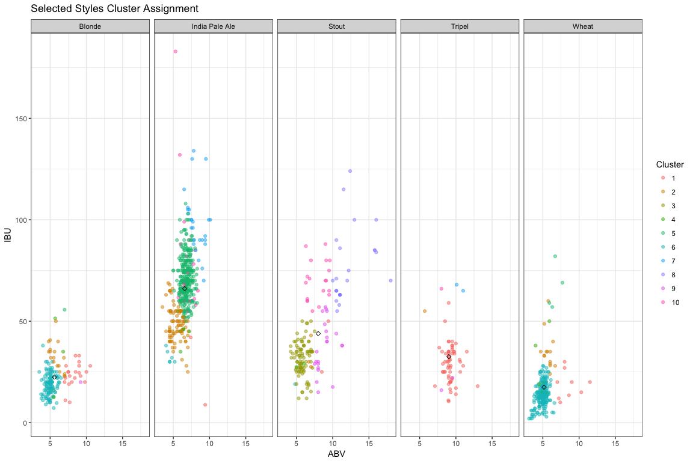
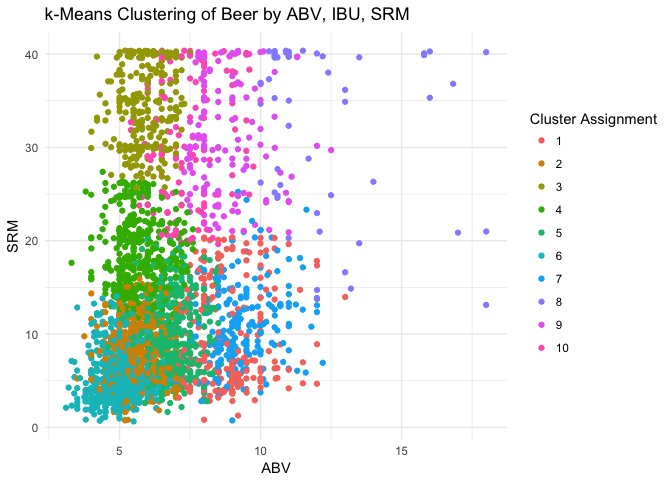
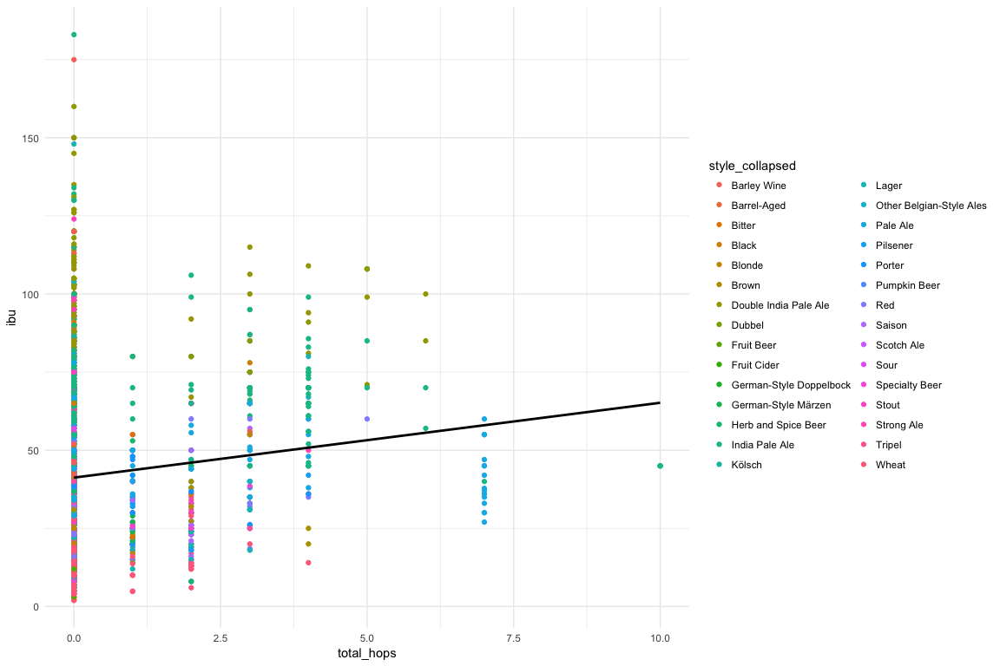
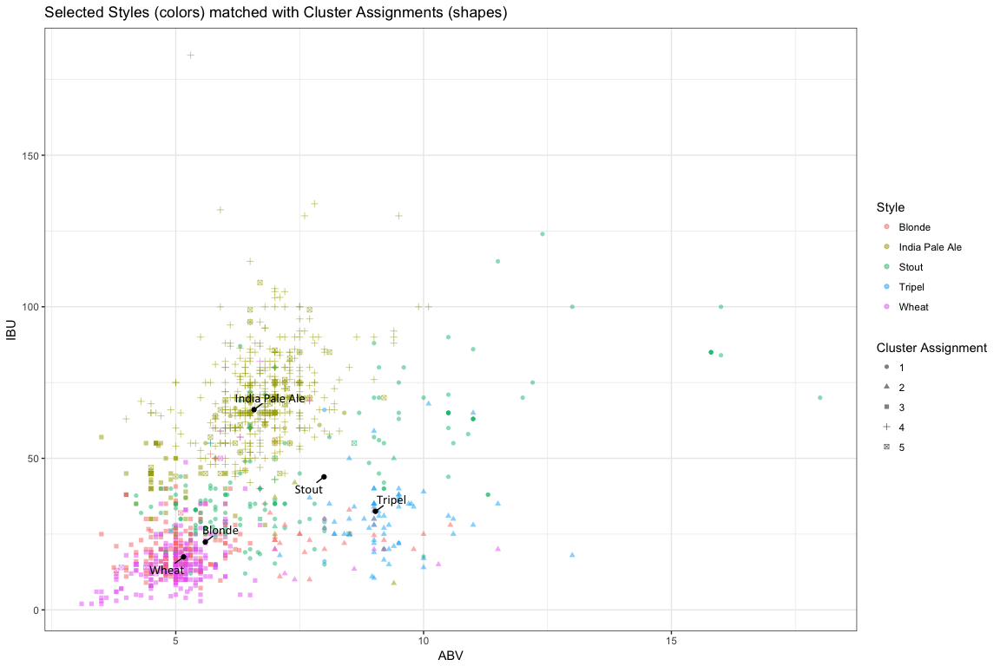
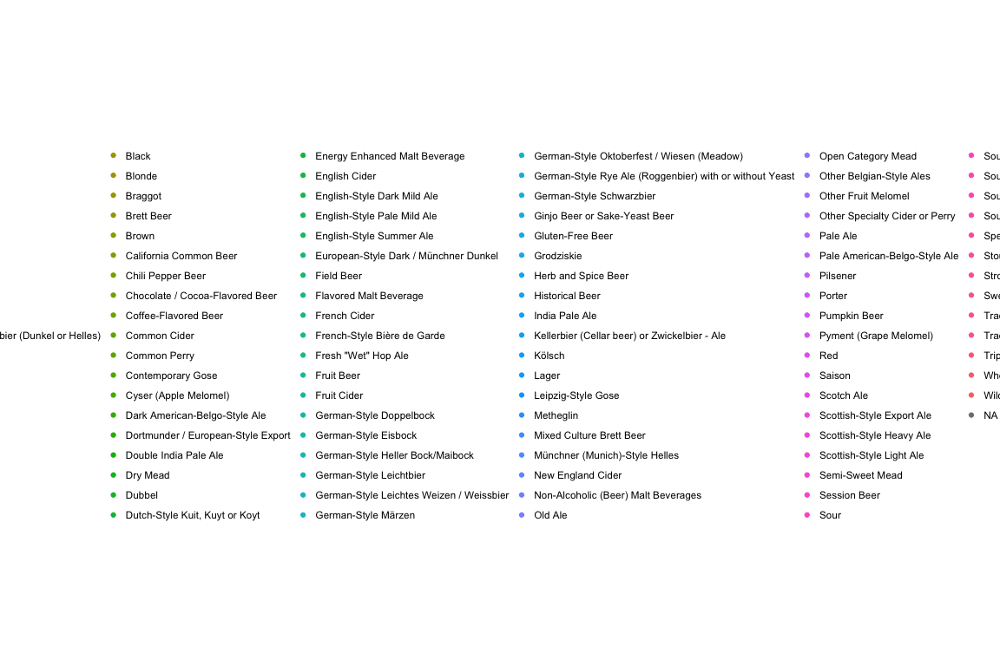
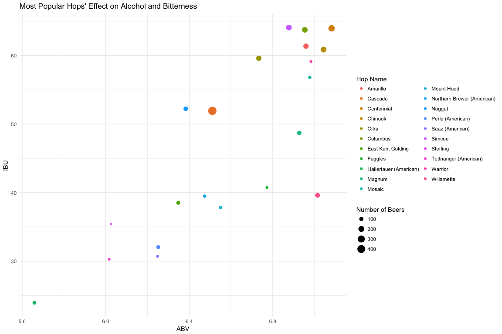

# Data Science Musings on Beer
`r format(Sys.time(), '%B %d, %Y')`  


* This is a first pass exploration of different aspects of beer 
    * ABV (alcohol by volume), IBU (international bitterness units), SRM (standard reference measure, a scale of beer color from light to dark)
        * Outputs of a beer that define it well
    * Ingredients in a beer such as hops and malts
    * Glass type
        * This is defined by style 
* The main question on the table:
    * Are beer styles actually indicative of shared attributes of the beers within that style? Or are style boundaries more or less arbitrary?
      * Two approaches: clustering and prediction 
      * Clustering: are there natural clusters across the spectum of beers that align well with the styles they're grouped into? 
          * Unsupervised (k-means) clustering based on 
              * ABV (alcohol by volume), IBU (international bitterness units), SRM (measure of color)
              * How well do these match up with various "style centers," defined by mean of ABV, IBU, and SRM per beer style
      * Prediction: can we predict a beer's style based on certain characteristics of the beer?
          * Neural net 
            
          * Random forest
      
* Answer thus far
    * Beer-intrinsic attributes aren't great predictors of style
    * Style-defined attributes are the best predictors
        * For instance, the glass a beer is served in (which is defined by its style) is a much better predictor of its style than actual characteristics of the beer like ABV and even the number of different types of hops it contains


### Workflow Overview

* Hit the BreweryDB API to iteratively pull in all beers and their ingredients along with other things we might want like breweries and glassware
* Unnest the JSON responses, including all the ingredients columns, and 
* Dump this all into a MySQL database 

* Create a `style_collapsed` column to reduce the number of levels of our outcome variable
    * `grep` through each beer's style to determine if that style contains a keyword that qualifies it to be rolled into a collapsed style
    * If it does, it gets that keyword in a `style_collapsed` column 
    * Further collpase styles that are similar like Hefeweizen and Wit into Wheat
    
* Unnest the ingredients `hops` and `malts` into a sparse matrix
    * Individual ingredients as columns, beers as rows; cell gets a 1 if ingredient is present and 0 otherwise 
    
* Cluster: unsupervised k-means clsutering based on ABV, IBU, and SRM

* Run a neural net
    * Predict either `style` or `style_collapsed` from all the predictors including the total number of hops and malts per beer

* Data courtesy of [BreweryDB](http://www.brewerydb.com/developers)
    * Special thanks to [Kris Kroski](https://kro.ski/) for data ideation and beer


**Getting Beer**
The age-old dilemma

* The BreweryDB API returns a certain number of results per page; if we want 
* So, we hit the BreweryDB API and ask for `1:number_of_pages`
    * We can change `number_of_pages` to, e.g., 3 if we only want the first 3 pages
    * If there's only one page (as is the case for the glassware endpoing), numberOfPages won't be returned, so in this case we set number_of_pages to 1
* The `addition` parameter can be an empty string if nothing else is needed


```r
base_url <- "http://api.brewerydb.com/v2"
key_preface <- "/?key="

paginated_request <- function(ep, addition) {    
  full_request <- NULL
  first_page <- fromJSON(paste0(base_url, "/", ep, "/", key_preface, key
                                , "&p=1"))
  number_of_pages <- ifelse(!(is.null(first_page$numberOfPages)), 
                            first_page$numberOfPages, 1)      

    for (page in 1:number_of_pages) {                               
    this_request <- fromJSON(paste0(base_url, "/", ep, "/", key_preface, key
                                    , "&p=", page, addition),
                             flatten = TRUE) 
    this_req_unnested <- unnest_it(this_request)    #  <- request unnested here
    print(this_req_unnested$currentPage)
    full_request <- bind_rows(full_request, this_req_unnested[["data"]])
  }
  full_request
} 

all_beer_raw <- paginated_request("beers", "&withIngredients=Y")
```


* Function for unnesting JSON used inside `paginated_request()` below
    + Takes the column named `name` nested within a column in the data portion of the response
        + If the `name` column doesn't exist, it takes the first nested column
* We use something similar to unnest ingredient like all of a beer's hops and malts into a long string contained in `hops_name` and `malt_name`


```r
unnest_it <- function(df) {
  unnested <- df
  for(col in seq_along(df[["data"]])) {
    if(! is.null(ncol(df[["data"]][[col]]))) {
      if(! is.null(df[["data"]][[col]][["name"]])) {
        unnested[["data"]][[col]] <- df[["data"]][[col]][["name"]]
      } else {
        unnested[["data"]][[col]] <- df[["data"]][[col]][[1]]
      }
    }
  }
  unnested
}
```


**Collapse Styles**

* Save the most popular styles in `keywords`
* Loop through each keyword
    * For each beer, `grep` through its style column to see if it contains any one of these keywords
    * If it does, give it that keyword in a new column `style_collapsed`
* If a beer's name matches multiple keywords, e.g., American Double India Pale Ale would match Double India Pale Ale, India Pale Ale, and Pale Ale, its `style_collapsed` is the **last** of those that appear in keywords 
    * This is why keywords are intentionally ordered from most general to most specific
    * So in the case of an case of American Double India Pale Ale: since Double India Pale Ale appears in `keywords` after India Pale Ale and Pale Ale, an American Double India Pale Ale would get a `style_collapsed` of Double India Pale Ale
* If no keyword is contained in `style`, `style_collapsed` is just whatever's in `style`; in other words, it doesn't get collpsed into a bigger bucket
    * This isn't a huge problem because we'll pare down to just the most popular styles later, however we could think about creating a catchall "Other" level for `style_collapsed`


```r
collapse_styles <- function(df) {
  keywords <- c("Lager", "Pale Ale", "India Pale Ale", "Double India Pale Ale", "India Pale Lager", "Hefeweizen", "Barrel-Aged","Wheat", "Pilsner", "Pilsener", "Amber", "Golden", "Blonde", "Brown", "Black", "Stout", "Porter", "Red", "Sour", "Kölsch", "Tripel", "Bitter", "Saison", "Strong Ale", "Barley Wine", "Dubbel", "Altbier")
  
  for (beer in 1:nrow(df)) {
    if (grepl(paste(keywords, collapse="|"), df$style[beer])) {    
      for (keyword in keywords) {         
        if(grepl(keyword, df$style[beer]) == TRUE) {
          df$style_collapsed[beer] <- keyword    
        }                         
      } 
    } else {
      df$style_collapsed[beer] <- as.character(df$style[beer])       
    }
    print(df$style_collapsed[beer])
  }
  return(df)
}
```

* Then we collapse further; right now we just combine all wheaty bears into Wheat by `fct_collapse`ing those levels


**Split out Ingredients**

* When we unnested ingredients, we just concatenated all of the ingredients for a given beer into a long string
* If we want, we can split out the ingredients that were concatenated in `<ingredient>_name` with this `split_ingredients` function
* This takes a vector of `ingredients_to_split`, so e.g. `c("hops_name", "malt_name")` and creates one column for each type of ingredient (`hops_name_1`, `hops_name_2`, etc.)

* We `str_split` on the ingredient and get a list back
* We find the max number of instances of an ingredient per beer, which will be the number of columns we're adding
* For each new column we need, we create it, initialize it with NAs, and name it
* Then for each element in our list of split up ingredients, if it exists, we add it to the correct column in our df


```r
split_ingredients <- function(df, ingredients_to_split) {
  
  ncol_df <- ncol(df)
  
  for (ingredient in ingredients_to_split) {

    ingredient_split <- str_split(df[[ingredient]], ", ")    
    num_new_cols <- max(lengths(ingredient_split))    
  
    for (num in 1:num_new_cols) {
      
      this_col <- ncol_df + 1         
      
      df[, this_col] <- NA
      names(df)[this_col] <- paste0(ingredient, "_", num)
      ncol_df <- ncol(df)             
      for (row in seq_along(ingredient_split)) {          
        if (!is.null(ingredient_split[[row]][num])) {        
          df[row, this_col] <- ingredient_split[[row]][num]
        }
      }
      df[[names(df)[this_col]]] <- factor(df[[names(df)[this_col]]])
    }
    
    ncol_df <- ncol(df)
  }
  return(df)
}
```


Head of the clustering data

|name                                                         |style                                              |styleId |style_collapsed       | abv|  ibu| srm|
|:------------------------------------------------------------|:--------------------------------------------------|:-------|:---------------------|---:|----:|---:|
|"Ah Me Joy" Porter                                           |Robust Porter                                      |19      |Porter                | 5.4| 51.0|  40|
|"Bison Eye Rye" Pale Ale &#124; 2 of 4 Part Pale Ale Series  |American-Style Pale Ale                            |25      |Pale Ale              | 5.8| 51.0|   8|
|"Dust Up" Cloudy Pale Ale &#124; 1 of 4 Part Pale Ale Series |American-Style Pale Ale                            |25      |Pale Ale              | 5.4| 54.0|  11|
|"God Country" Kolsch                                         |German-Style Kölsch / Köln-Style Kölsch            |45      |Kölsch                | 5.6| 28.2|   5|
|"Jemez Field Notes" Golden Lager                             |Golden or Blonde Ale                               |36      |Blonde                | 4.9| 20.0|   5|
|#10 Hefewiezen                                               |South German-Style Hefeweizen / Hefeweissbier      |48      |Wheat                 | 5.1| 11.0|   4|
|#9                                                           |American-Style Pale Ale                            |25      |Pale Ale              | 5.1| 20.0|   9|
|#KoLSCH                                                      |German-Style Kölsch / Köln-Style Kölsch            |45      |Kölsch                | 4.8| 27.0|   3|
|'Inappropriate' Cream Ale                                    |American-Style Cream Ale or Lager                  |109     |Lager                 | 5.3| 18.0|   5|
|'tis the Saison                                              |French & Belgian-Style Saison                      |72      |Saison                | 7.0| 30.0|   7|
|(306) URBAN WHEAT BEER                                       |Belgian-Style White (or Wit) / Belgian-Style Wheat |65      |Wheat                 | 5.0| 20.0|   9|
|(512) Bruin (A.K.A. Brown Bear)                              |American-Style Brown Ale                           |37      |Brown                 | 7.6| 30.0|  21|
|(512) FOUR                                                   |Strong Ale                                         |14      |Strong Ale            | 7.5| 35.0|   8|
|(512) IPA                                                    |American-Style India Pale Ale                      |30      |India Pale Ale        | 7.0| 65.0|   8|
|(512) Pale                                                   |American-Style Pale Ale                            |25      |Pale Ale              | 6.0| 30.0|   7|
|(512) SIX                                                    |Belgian-Style Dubbel                               |58      |Dubbel                | 7.5| 25.0|  28|
|(512) THREE                                                  |Belgian-Style Tripel                               |59      |Tripel                | 9.5| 22.0|  10|
|(512) THREE (Cabernet Barrel Aged)                           |Belgian-Style Tripel                               |59      |Tripel                | 9.5| 22.0|  40|
|(512) TWO                                                    |Imperial or Double India Pale Ale                  |31      |Double India Pale Ale | 9.0| 99.0|   9|
|(512) White IPA                                              |American-Style India Pale Ale                      |30      |India Pale Ale        | 5.3| 55.0|   4|


**Find the Most Popualar Styles**


```r
# Pare down to only cases where style is not NA
beer_dat_pared <- beer_dat[complete.cases(beer_dat$style), ]

# Arrange beer dat by style popularity
style_popularity <- beer_dat_pared %>% 
  group_by(style) %>% 
  count() %>% 
  arrange(desc(n))
style_popularity

# Add a column that scales popularity
style_popularity <- bind_cols(style_popularity, 
                               n_scaled = as.vector(scale(style_popularity$n)))

# Find styles that are above a z-score of 0
popular_styles <- style_popularity %>% 
  filter(n_scaled > 0)

# Pare dat down to only beers that fall into those styles
popular_beer_dat <- beer_dat_pared %>% 
  filter(
    style %in% popular_styles$style
  ) %>% 
  droplevels() %>% 
  as_tibble() 
nrow(popular_beer_dat)

# Find the centers (mean abv, ibu, srm) of the most popular styles
style_centers <- popular_beer_dat %>% 
  group_by(style_collapsed) %>% 
  add_count() %>% 
  summarise(
    mean_abv = mean(abv, na.rm = TRUE),
    mean_ibu = mean(ibu, na.rm = TRUE), 
    mean_srm = mean(srm, na.rm = TRUE),
    n = median(n, na.rm = TRUE)          # Median here only for summarise. Should be just the same as n
  ) %>% 
  arrange(desc(n)) %>% 
  drop_na() %>% 
  droplevels()
```


Compare popular styles      


|style_collapsed          |  mean_abv| mean_ibu|  mean_srm|    n|
|:------------------------|---------:|--------:|---------:|----:|
|India Pale Ale           |  6.578468| 66.04268|  9.989313| 6524|
|Pale Ale                 |  5.695480| 40.86930|  8.890306| 4280|
|Stout                    |  7.991841| 43.89729| 36.300000| 4238|
|Wheat                    |  5.158040| 17.47168|  5.861842| 3349|
|Double India Pale Ale    |  8.930599| 93.48142| 11.006873| 2525|
|Red                      |  5.742565| 33.81127| 16.178862| 2521|
|Lager                    |  5.453718| 30.64361|  8.457447| 2230|
|Saison                   |  6.400189| 27.25114|  7.053476| 2167|
|Blonde                   |  5.595298| 22.39432|  5.625000| 2044|
|Porter                   |  6.182049| 33.25369| 32.197605| 1973|
|Brown                    |  6.159212| 32.21577| 23.592000| 1462|
|Pilsener                 |  5.227593| 33.51346|  4.413462| 1268|
|Specialty Beer           |  6.446402| 33.77676| 15.520548| 1044|
|Bitter                   |  5.322364| 38.28175| 12.460526|  939|
|Fruit Beer               |  5.195222| 19.24049|  8.666667|  905|
|Herb and Spice Beer      |  6.621446| 27.77342| 18.166667|  872|
|Sour                     |  6.224316| 18.88869| 10.040816|  797|
|Strong Ale               |  8.826425| 36.74233| 22.547945|  767|
|Tripel                   |  9.029775| 32.51500|  7.680556|  734|
|Black                    |  6.958714| 65.50831| 31.080000|  622|
|Barley Wine              | 10.781600| 74.04843| 19.561404|  605|
|Kölsch                   |  4.982216| 23.37183|  4.371795|  593|
|Barrel-Aged              |  9.002506| 39.15789| 18.133333|  540|
|Other Belgian-Style Ales |  7.516318| 37.55812| 17.549020|  506|
|Pumpkin Beer             |  6.712839| 23.48359| 17.918033|  458|
|Dubbel                   |  7.509088| 25.05128| 22.940000|  399|
|Scotch Ale               |  7.620233| 26.36909| 24.222222|  393|
|German-Style Doppelbock  |  8.045762| 28.88692| 25.696970|  376|
|Fruit Cider              |  6.205786| 25.60000| 12.000000|  370|
|German-Style Märzen      |  5.746102| 25.63796| 14.322581|  370|


## Unsupervised Clustering 
* Pare down to beers that have ABV, IBU, and SRM
* K-means cluster beers based on these predictors


**Do Clustering**

* Use only the top beer styles
* Split off the predictors, ABV, IBU, and SRM
* Take out NAs, and scale the data
    * NB: There are not not very many beers have SRM so we may not want to omit based on it
* Take out some outliers
  * Beers have to have an ABV between 3 and 20 and an IBU less than 200
  

```r
beer_for_clustering <- popular_beer_dat %>% 
  select(name, style, styleId, style_collapsed,
         abv, ibu, srm) %>%       
  na.omit() %>% 
  filter(
    abv < 20 & abv > 3
  ) %>%
  filter(
    ibu < 200
  )

beer_for_clustering_predictors <- beer_for_clustering %>% 
  select(abv, ibu, srm) %>%
  rename(
    abv_scaled = abv,
    ibu_scaled = ibu,
    srm_scaled = srm
    ) %>% scale() %>% 
  as_tibble()
```

And do the clustering


```r
set.seed(9)
clustered_beer_out <- kmeans(x = beer_for_clustering_predictors, centers = 10, trace = TRUE)

clustered_beer <- as_tibble(data.frame(cluster_assignment = factor(clustered_beer_out$cluster), 
                            beer_for_clustering_outcome, beer_for_clustering_predictors,
                            beer_for_clustering %>% select(abv, ibu, srm)))
```


A table of cluster counts broken down by style

|                         |  1|   2|   3|   4|   5|   6|   7|  8|  9| 10|
|:------------------------|--:|---:|---:|---:|---:|---:|---:|--:|--:|--:|
|Barley Wine              |  7|   0|   0|   0|   2|   0|  19| 15|  2|  0|
|Barrel-Aged              |  5|   3|   2|   4|   1|   2|   1|  1|  4|  0|
|Bitter                   |  1|  28|   0|  25|   2|  13|   0|  0|  0|  1|
|Black                    |  0|   0|   4|   1|   0|   0|   0|  0|  2| 36|
|Blonde                   | 21|  18|   1|   3|   1| 115|   0|  0|  1|  0|
|Brown                    |  1|   1|  20|  68|   2|   7|   1|  1|  6|  3|
|Double India Pale Ale    |  5|   0|   0|   0|  38|   0| 174|  6|  0|  9|
|Dubbel                   |  8|   0|   1|  14|   1|   0|   0|  0| 16|  1|
|Fruit Beer               |  5|   2|   2|   6|   4|  36|   0|  1|  0|  0|
|Fruit Cider              |  0|   0|   0|   0|   0|   1|   0|  0|  0|  0|
|German-Style Doppelbock  |  7|   0|   1|   4|   0|   0|   0|  0| 16|  1|
|German-Style Märzen      |  0|   2|   1|  15|   0|  12|   0|  0|  0|  0|
|Herb and Spice Beer      |  5|   4|   8|  11|   6|  13|   0|  1|  6|  1|
|India Pale Ale           |  2|  93|   1|   6| 397|   6|  27|  0|  0| 26|
|Kölsch                   |  0|   3|   0|   1|   1|  67|   0|  0|  0|  0|
|Lager                    |  5|  21|   3|  17|  20|  90|   2|  0|  0|  4|
|Other Belgian-Style Ales |  6|   5|   4|   7|   8|   3|   1|  0|  4|  1|
|Pale Ale                 | 11| 221|   1|  30|  32|  50|   0|  0|  1|  3|
|Pilsener                 |  1|  39|   0|   1|   3|  46|   1|  0|  0|  1|
|Porter                   |  0|   1| 102|  29|   0|   0|   0|  0| 11|  3|
|Pumpkin Beer             |  9|   3|   5|  18|   0|   7|   0|  0|  4|  0|
|Red                      |  2|  36|  14| 127|  10|  29|   3|  0|  1|  6|
|Saison                   | 35|  44|   2|   6|   2|  48|   0|  0|  2|  0|
|Scotch Ale               |  7|   1|   4|   9|   0|   0|   0|  0| 12|  0|
|Sour                     |  1|   4|   1|   2|   1|  17|   0|  0|  2|  0|
|Specialty Beer           | 11|   5|   8|  13|   5|  15|   1|  0|  6|  1|
|Stout                    |  2|   3|  91|   2|   0|   1|   0| 24| 22| 19|
|Strong Ale               | 21|   0|   2|   2|   0|   0|   4|  4| 22|  2|
|Tripel                   | 59|   1|   0|   0|   0|   0|   2|  0|  2|  1|
|Wheat                    |  9|  14|   0|   6|   4| 228|   0|  0|  0|  0|


Plot the clusters. There are 3 axes: ABV, IBU, and SRM, so we choose two at a time. 


```r
clustered_beer_plot_abv_ibu <- ggplot(data = clustered_beer, aes(x = abv, y = ibu, colour = cluster_assignment)) + 
  geom_jitter() + theme_minimal()  +
  ggtitle("k-Means Clustering of Beer by ABV, IBU, SRM") +
  labs(x = "ABV", y = "IBU") +
  labs(colour = "Cluster Assignment")
clustered_beer_plot_abv_ibu
```

<!-- -->

```r
clustered_beer_plot_abv_srm <- ggplot(data = clustered_beer, aes(x = abv, y = srm, colour = cluster_assignment)) + 
  geom_jitter() + theme_minimal()  +
  ggtitle("k-Means Clustering of Beer by ABV, IBU, SRM") +
  labs(x = "ABV", y = "SRM") +
  labs(colour = "Cluster Assignment")
clustered_beer_plot_abv_srm
```

<!-- -->


### Certain selected styles


```r
styles_to_keep <- c("Blonde", "India Pale Ale", "Stout", "Tripel", "Wheat")
clustered_beer_certain_styles <- clustered_beer %>% 
  filter(
   style_collapsed %in% styles_to_keep 
  )

style_centers_certain_styles <- style_centers %>% 
  filter(
    style_collapsed %in% styles_to_keep 
  )

by_style_plot <- ggplot() +   
  geom_point(data = clustered_beer_certain_styles, 
             aes(x = abv, y = ibu,
                 colour = cluster_assignment), alpha = 0.5) +
  facet_grid(. ~ style_collapsed) +
  geom_point(data = style_centers_certain_styles,
           aes(mean_abv, mean_ibu), colour = "black", shape = 5) +
  ggtitle("Selected Styles Cluster Assignment") +
  labs(x = "ABV", y = "IBU") +
  labs(colour = "Cluster") +
  theme_bw()
by_style_plot
```

<!-- -->


### Now add in the style centers (means) for collapsed styles


```r
library(ggrepel)
abv_ibu_clusters_vs_style_centers <- ggplot() +   
  geom_point(data = clustered_beer, 
             aes(x = abv, y = ibu, colour = cluster_assignment), alpha = 0.5) +
  geom_point(data = style_centers,
             aes(mean_abv, mean_ibu), colour = "black") +
  geom_text_repel(data = style_centers, aes(mean_abv, mean_ibu, label = style_collapsed), 
                  box.padding = unit(0.45, "lines"),
                  family = "Calibri",
                  label.size = 0.3) +
  ggtitle("Popular Styles vs. k-Means Clustering of Beer by ABV, IBU, SRM") +
  labs(x = "ABV", y = "IBU") +
  labs(colour = "Cluster Assignment") +
  theme_bw()
abv_ibu_clusters_vs_style_centers
```

<!-- -->


### Ingredients


```r
clustered_beer_necessities <- clustered_beer %>% 
  inner_join(beer_necessities)
```

```
## Joining, by = c("name", "style", "styleId", "style_collapsed", "abv", "ibu", "srm")
```


* Parameters set at the outset
    * `ingredient_want`: this can be `hops`, `malt`, or other ingredients like `yeast` if we pull that in
    * `grouper`: can be a vector of one or more things to group by 

* Once ingredients have been split out from the concatenated string into columns like `malt_name_1`, `malt_name_2`, etc., we need to find the range of these columns; there will be a different number of malt columns than hops columns, for instance
    * The first one will be `<ingredient>_name_1` 
        * From this we can find the index of this column 
    * We get the name of last one with the `get_last_ing_name_col` function
* Then we save a vector of all the ingredient column names in `ingredient_colnames`
    * We make this a global variable because it will stay constant even if the indices change
    
* `to_keep_col_names` is a vector of all non-ingredient column names


* Inside `gather_ingredients` we:
    * Take out superflous column names that are not in `to_keep_col_names` or one of the ingredient columns
    * Find what the new ingredient column indices are, since they'll have changed after we pared down
    * Actually do the gathering: lump all of the ingredient columns (e.g., `hops_name_1`) into one long column, `ing_keys` and all the actual ingredient names (e.g., Cascade) into `ing_names`


* Next we get a vector of all ingredient levels and take out the one that's an empty string
* We'll use this vector of ingredient levels in `select_spread_cols()` below
    
* Then we spread the ingredient names 
* We take what was previously the `value` in our gathered dataframe, the actual ingredient names (Cascade, Centennial) and make that our `key`; it'll form the new column names
    * The new `value` is `value` is count; it'll populate the row cells
        * If a given row has a certain ingredient, it gets a 1 in the corresponding cell, an NA otherwise
* We add a unique idenfitier for each row with `row`, which we'll drop later (see [Hadley's SO comment](https://stackoverflow.com/questions/25960394/unexpected-behavior-with-tidyr))

* Then we do the final step and group by the groupers


```r
pick_ingredient_get_beer <- function (ingredient_want, df, grouper) {
  # ingredient_want <- ingredient_want
  
  # First ingredient
  first_ingredient_name <- paste(ingredient_want, "_name_1", sep="")
  first_ingredient_index <- which(colnames(clustered_beer_necessities)==first_ingredient_name)
  
  # Get the last ingredient
  get_last_ing_name_col <- function(df) {
    for (col in names(df)) {
      if (grepl(paste(ingredient_want, "_name_", sep = ""), col) == TRUE) {
        name_last_ing_col <- col
      }
    }
    return(name_last_ing_col)
  }
  
  # Last ingredient
  last_ingredient_name <- get_last_ing_name_col(clustered_beer_necessities)
  last_ingredient_index <- which(colnames(clustered_beer_necessities)==last_ingredient_name)
  
  # Vector of all the ingredient column names
  ingredient_colnames <- names(clustered_beer_necessities)[first_ingredient_index:last_ingredient_index]
  
  # Non-ingredient column names we want to keep
  to_keep_col_names <- c("cluster_assignment", "name", "abv", "ibu", "srm", "style", "style_collapsed")

  
  # ---- Gather columns ----
  gather_ingredients <- function(df, cols_to_gather) {
    to_keep_indices <- which(colnames(df) %in% to_keep_col_names)
    
    selected_df <- df[, c(to_keep_indices, first_ingredient_index:last_ingredient_index)]
    
    new_ing_indices <- which(colnames(selected_df) %in% cols_to_gather)    # indices will have changed since we pared down 
    
    df_gathered <- selected_df %>%
      gather_(
        key_col = "ing_keys",
        value_col = "ing_names",
        gather_cols = colnames(selected_df)[new_ing_indices]
      ) %>%
      mutate(
        count = 1
      )
    df_gathered
  }
  beer_gathered <- gather_ingredients(clustered_beer_necessities, ingredient_colnames)  # ingredient colnames defined above function
  
  # Get a vector of all ingredient levels
  beer_gathered$ing_names <- factor(beer_gathered$ing_names)
  ingredient_levels <- levels(beer_gathered$ing_names) 
  
  # Take out the level that's just an empty string
  to_keep_levels <- !(c(1:length(ingredient_levels)) %in% which(ingredient_levels == ""))
  ingredient_levels <- ingredient_levels[to_keep_levels]
  
  beer_gathered$ing_names <- as.character(beer_gathered$ing_names)
  
  # ------ Spread columns -------
  spread_ingredients <- function(df) {
    df_spread <- df %>% 
      mutate(
        row = 1:nrow(df)        # Add a unique idenfitier for each row which we'll need in order to spread; we'll drop this later
      ) %>%                                 
      spread(
        key = ing_names,
        value = count
      ) 
    return(df_spread)
  }
  beer_spread <- spread_ingredients(beer_gathered)
  
  # ------ Select only certain columns -------
  select_spread_cols <- function(df) {
    to_keep_col_indices <- which(colnames(df) %in% to_keep_col_names)
    to_keep_ingredient_indices <- which(colnames(df) %in% ingredient_levels)
    
    to_keep_inds_all <- c(to_keep_col_indices, to_keep_ingredient_indices)
    
    new_df <- df %>% 
      select_(
        .dots = to_keep_inds_all
      )
    return(new_df)
  }
  beer_spread_selected <- select_spread_cols(beer_spread)
  
  
  # Take out all rows that have no ingredients specified at all
  inds_to_remove <- apply(beer_spread_selected[, first_ingredient_index:last_ingredient_index], 
                          1, function(x) all(is.na(x)))
  beer_spread_no_na <- beer_spread_selected[ !inds_to_remove, ]
  
  
  # Group ingredients by the grouper specified 
  get_ingredients_per_grouper <- function(df, grouper = grouper) {
    df_grouped <- df %>%
      ungroup() %>% 
      group_by_(grouper)
    
    not_for_summing <- which(colnames(df_grouped) %in% to_keep_col_names)
    max_not_for_summing <- max(not_for_summing)
    
    per_grouper <- df_grouped %>% 
      select(-c(abv, ibu, srm)) %>%    # taking out temporarily
      summarise_if(
        is.numeric,              
        sum, na.rm = TRUE
        # -c(abv, ibu, srm)
      ) %>%
      mutate(
        total = rowSums(.[(max_not_for_summing + 1):ncol(.)], na.rm = TRUE)    
      )
    
    # Send total to the second position
    per_grouper <- per_grouper %>% 
      select(
        name, total, everything()
      )
    
    # Replace total column with more descriptive name: total_<ingredient>
    names(per_grouper)[which(names(per_grouper) == "total")] <- paste0("total_", ingredient_want)
    
    return(per_grouper)
  }
  
  ingredients_per_grouper <- get_ingredients_per_grouper(beer_spread_selected, grouper)
  return(ingredients_per_grouper)
}
```


* Now run the function with `ingredient_want` as first hops, then malt
* Then join the resulting dataframes and remove/reorder some columns


```r
# Run the entire function with ingredient_want set to hops, grouping by name
ingredients_per_beer_hops <- pick_ingredient_get_beer(ingredient_want = "hops", 
                                                      clustered_beer_necessities, 
                                                      grouper = c("name", "style_collapsed"))

# Same for malt
ingredients_per_beer_malt <- pick_ingredient_get_beer(ingredient_want = "malt", 
                                                      clustered_beer_necessities, 
                                                      grouper = c("name", "style_collapsed"))

# Join those on our original dataframe by name
beer_ingredients_join_first_ingredient <- left_join(clustered_beer_necessities, ingredients_per_beer_hops,
                                                    by = "name")
beer_ingredients_join <- left_join(beer_ingredients_join_first_ingredient, ingredients_per_beer_malt,
                                   by = "name")


# Take out some unnecessary columns
unnecessary_cols <- c("styleId", "abv_scaled", "ibu_scaled", "srm_scaled", 
                      "hops_id", "malt_id", "glasswareId", "style.categoryId")
beer_ingredients_join <- beer_ingredients_join[, (! names(beer_ingredients_join) %in% unnecessary_cols)]


# If we also want to take out any of the malt_name_1, malt_name_2, etc. columns we can do this with a grep
more_unnecessary <- c("hops_name_|malt_name_")
beer_ingredients_join <- 
  beer_ingredients_join[, (! grepl(more_unnecessary, names(beer_ingredients_join)) == TRUE)]

# Reorder columns a bit
beer_ingredients_join <- beer_ingredients_join %>% 
  select(
    id, name, total_hops, total_malt, everything(), -description
  )
```


Now we're left with something of a sparse matrix of all the ingredients compared to all the beers

|id     |name                                                         | total_hops| total_malt|cluster_assignment |style                                              |style_collapsed       | abv|  ibu| srm|glass   |hops_name                                      |malt_name                                                                      | Aged / Debittered Hops (Lambic)| Ahtanum| Alchemy| Amarillo| Apollo| Aramis| Azacca| Bravo| Brewer's Gold| Calypso| Cascade| Celeia| Centennial| Challenger| Chinook| Citra| Cluster| Columbus| Comet| Crystal| CTZ| East Kent Golding| El Dorado| Falconer's Flight| Fuggle (American)| Fuggle (English)| Fuggles| Galaxy| Galena| German Magnum| German Mandarina Bavaria| German Perle| German Polaris| German Tradition| Glacier| Golding (American)| Green Bullet| Hallertau Hallertauer Tradition| Hallertau Northern Brewer| Hallertauer (American)| Hallertauer Hersbrucker| Hops| Horizon| Jarrylo| Kent Goldings| Lemon Drop| Liberty| Magnum| Marynka| Mosaic| Motueka| Mount Hood| Nelson Sauvin| New Zealand Motueka| Northdown| Northern Brewer (American)| Nugget| Orbit| Pacific Jade| Pacifica| Palisades| Perle (American)| Phoenix| Saaz (American)| Saaz (Czech)| Saphir (German Organic)| Simcoe| Sorachi Ace| Southern Cross| Spalt| Spalt Select| Spalt Spalter| Sterling| Strisselspalt| Styrian Goldings| Summit| Target| Tettnang Tettnanger| Tettnanger (American)| Topaz| Tradition| Ultra| Warrior| Willamette| Zeus| Zythos| Abbey Malt| Acidulated Malt| Amber Malt| Aromatic Malt| Asheburne Mild Malt| Barley - Flaked| Barley - Malted| Barley - Roasted| Biscuit Malt| Black Malt| Black Malt - Debittered| Black Patent| Bonlander| Brown Malt| Brown Sugar| Cane Sugar| CaraAmber| Carafa I| Carafa II| Carafa III| CaraFoam| CaraHell| Caramel/Crystal Malt| Caramel/Crystal Malt - Dark| Caramel/Crystal Malt - Heritage| Caramel/Crystal Malt - Light| Caramel/Crystal Malt - Medium| Caramel/Crystal Malt - Organic| Caramel/Crystal Malt 10L| Caramel/Crystal Malt 120L| Caramel/Crystal Malt 150L| Caramel/Crystal Malt 15L| Caramel/Crystal Malt 20L| Caramel/Crystal Malt 300L| Caramel/Crystal Malt 30L| Caramel/Crystal Malt 40L| Caramel/Crystal Malt 45L| Caramel/Crystal Malt 50L| Caramel/Crystal Malt 55L| Caramel/Crystal Malt 60L| Caramel/Crystal Malt 75L| Caramel/Crystal Malt 80L| CaraMunich| CaraMunich II| CaraMunich III| CaraPils/Dextrin Malt| CaraRed| CaraStan| CaraVienne Malt| Carolina Rye Malt| Cherrywood Smoke Malt| Chocolate Malt| Corn - Flaked| Corn Grits| Crisp 77| Crystal 77| Extra Special Malt| Gladfield Pale| Golden Promise| Harrington 2-Row Base Malt| Honey| Honey Malt| Malted Rye| Maris Otter| Melanoidin Malt| Midnight Wheat| Mild Malt| Munich Malt| Munich Malt - Organic| Munich Malt - Type I| Munich Malt - Type II| Munich Malt 20L| Munich Malt 40L| Munich Wheat| Oats - Flaked| Oats - Malted| Oats - Rolled| Oats - Steel Cut (Pinhead Oats)| Pale Chocolate Malt| Pale Malt| Pale Malt - Organic| Palev| Pilsner Malt| Rahr 2-Row Malt| Rahr Special Pale| Rice - Hulls| Roast Malt| Rye - Flaked| Rye Malt| Samuel Adams two-row pale malt blend| Six-Row Pale Malt| Smoked Malt| Special B Malt| Special Roast| Sugar (Albion)| Two-Row Barley Malt| Two-Row Pale Malt| Two-Row Pale Malt - Organic| Two-Row Pale Malt - Toasted| Two-Row Pilsner Malt| Victory Malt| Vienna Malt| Wheat - Flaked| Wheat - Raw| Wheat - Red| Wheat - Torrified| Wheat Malt| Wheat Malt - White| White Wheat| Wyermann Vienna|
|:------|:------------------------------------------------------------|----------:|----------:|:------------------|:--------------------------------------------------|:---------------------|---:|----:|---:|:-------|:----------------------------------------------|:------------------------------------------------------------------------------|-------------------------------:|-------:|-------:|--------:|------:|------:|------:|-----:|-------------:|-------:|-------:|------:|----------:|----------:|-------:|-----:|-------:|--------:|-----:|-------:|---:|-----------------:|---------:|-----------------:|-----------------:|----------------:|-------:|------:|------:|-------------:|------------------------:|------------:|--------------:|----------------:|-------:|------------------:|------------:|-------------------------------:|-------------------------:|----------------------:|-----------------------:|----:|-------:|-------:|-------------:|----------:|-------:|------:|-------:|------:|-------:|----------:|-------------:|-------------------:|---------:|--------------------------:|------:|-----:|------------:|--------:|---------:|----------------:|-------:|---------------:|------------:|-----------------------:|------:|-----------:|--------------:|-----:|------------:|-------------:|--------:|-------------:|----------------:|------:|------:|-------------------:|---------------------:|-----:|---------:|-----:|-------:|----------:|----:|------:|----------:|---------------:|----------:|-------------:|-------------------:|---------------:|---------------:|----------------:|------------:|----------:|-----------------------:|------------:|---------:|----------:|-----------:|----------:|---------:|--------:|---------:|----------:|--------:|--------:|--------------------:|---------------------------:|-------------------------------:|----------------------------:|-----------------------------:|------------------------------:|------------------------:|-------------------------:|-------------------------:|------------------------:|------------------------:|-------------------------:|------------------------:|------------------------:|------------------------:|------------------------:|------------------------:|------------------------:|------------------------:|------------------------:|----------:|-------------:|--------------:|---------------------:|-------:|--------:|---------------:|-----------------:|---------------------:|--------------:|-------------:|----------:|--------:|----------:|------------------:|--------------:|--------------:|--------------------------:|-----:|----------:|----------:|-----------:|---------------:|--------------:|---------:|-----------:|---------------------:|--------------------:|---------------------:|---------------:|---------------:|------------:|-------------:|-------------:|-------------:|-------------------------------:|-------------------:|---------:|-------------------:|-----:|------------:|---------------:|-----------------:|------------:|----------:|------------:|--------:|------------------------------------:|-----------------:|-----------:|--------------:|-------------:|--------------:|-------------------:|-----------------:|---------------------------:|---------------------------:|--------------------:|------------:|-----------:|--------------:|-----------:|-----------:|-----------------:|----------:|------------------:|-----------:|---------------:|
|b7SfHG |"Ah Me Joy" Porter                                           |          0|          0|3                  |Robust Porter                                      |Porter                | 5.4| 51.0|  40|NA      |NA                                             |NA                                                                             |                               0|       0|       0|        0|      0|      0|      0|     0|             0|       0|       0|      0|          0|          0|       0|     0|       0|        0|     0|       0|   0|                 0|         0|                 0|                 0|                0|       0|      0|      0|             0|                        0|            0|              0|                0|       0|                  0|            0|                               0|                         0|                      0|                       0|    0|       0|       0|             0|          0|       0|      0|       0|      0|       0|          0|             0|                   0|         0|                          0|      0|     0|            0|        0|         0|                0|       0|               0|            0|                       0|      0|           0|              0|     0|            0|             0|        0|             0|                0|      0|      0|                   0|                     0|     0|         0|     0|       0|          0|    0|      0|          0|               0|          0|             0|                   0|               0|               0|                0|            0|          0|                       0|            0|         0|          0|           0|          0|         0|        0|         0|          0|        0|        0|                    0|                           0|                               0|                            0|                             0|                              0|                        0|                         0|                         0|                        0|                        0|                         0|                        0|                        0|                        0|                        0|                        0|                        0|                        0|                        0|          0|             0|              0|                     0|       0|        0|               0|                 0|                     0|              0|             0|          0|        0|          0|                  0|              0|              0|                          0|     0|          0|          0|           0|               0|              0|         0|           0|                     0|                    0|                     0|               0|               0|            0|             0|             0|             0|                               0|                   0|         0|                   0|     0|            0|               0|                 0|            0|          0|            0|        0|                                    0|                 0|           0|              0|             0|              0|                   0|                 0|                           0|                           0|                    0|            0|           0|              0|           0|           0|                 0|          0|                  0|           0|               0|
|PBEXhV |"Bison Eye Rye" Pale Ale &#124; 2 of 4 Part Pale Ale Series  |          0|          0|2                  |American-Style Pale Ale                            |Pale Ale              | 5.8| 51.0|   8|NA      |NA                                             |NA                                                                             |                               0|       0|       0|        0|      0|      0|      0|     0|             0|       0|       0|      0|          0|          0|       0|     0|       0|        0|     0|       0|   0|                 0|         0|                 0|                 0|                0|       0|      0|      0|             0|                        0|            0|              0|                0|       0|                  0|            0|                               0|                         0|                      0|                       0|    0|       0|       0|             0|          0|       0|      0|       0|      0|       0|          0|             0|                   0|         0|                          0|      0|     0|            0|        0|         0|                0|       0|               0|            0|                       0|      0|           0|              0|     0|            0|             0|        0|             0|                0|      0|      0|                   0|                     0|     0|         0|     0|       0|          0|    0|      0|          0|               0|          0|             0|                   0|               0|               0|                0|            0|          0|                       0|            0|         0|          0|           0|          0|         0|        0|         0|          0|        0|        0|                    0|                           0|                               0|                            0|                             0|                              0|                        0|                         0|                         0|                        0|                        0|                         0|                        0|                        0|                        0|                        0|                        0|                        0|                        0|                        0|          0|             0|              0|                     0|       0|        0|               0|                 0|                     0|              0|             0|          0|        0|          0|                  0|              0|              0|                          0|     0|          0|          0|           0|               0|              0|         0|           0|                     0|                    0|                     0|               0|               0|            0|             0|             0|             0|                               0|                   0|         0|                   0|     0|            0|               0|                 0|            0|          0|            0|        0|                                    0|                 0|           0|              0|             0|              0|                   0|                 0|                           0|                           0|                    0|            0|           0|              0|           0|           0|                 0|          0|                  0|           0|               0|
|AXmvOd |"Dust Up" Cloudy Pale Ale &#124; 1 of 4 Part Pale Ale Series |          0|          0|2                  |American-Style Pale Ale                            |Pale Ale              | 5.4| 54.0|  11|NA      |NA                                             |NA                                                                             |                               0|       0|       0|        0|      0|      0|      0|     0|             0|       0|       0|      0|          0|          0|       0|     0|       0|        0|     0|       0|   0|                 0|         0|                 0|                 0|                0|       0|      0|      0|             0|                        0|            0|              0|                0|       0|                  0|            0|                               0|                         0|                      0|                       0|    0|       0|       0|             0|          0|       0|      0|       0|      0|       0|          0|             0|                   0|         0|                          0|      0|     0|            0|        0|         0|                0|       0|               0|            0|                       0|      0|           0|              0|     0|            0|             0|        0|             0|                0|      0|      0|                   0|                     0|     0|         0|     0|       0|          0|    0|      0|          0|               0|          0|             0|                   0|               0|               0|                0|            0|          0|                       0|            0|         0|          0|           0|          0|         0|        0|         0|          0|        0|        0|                    0|                           0|                               0|                            0|                             0|                              0|                        0|                         0|                         0|                        0|                        0|                         0|                        0|                        0|                        0|                        0|                        0|                        0|                        0|                        0|          0|             0|              0|                     0|       0|        0|               0|                 0|                     0|              0|             0|          0|        0|          0|                  0|              0|              0|                          0|     0|          0|          0|           0|               0|              0|         0|           0|                     0|                    0|                     0|               0|               0|            0|             0|             0|             0|                               0|                   0|         0|                   0|     0|            0|               0|                 0|            0|          0|            0|        0|                                    0|                 0|           0|              0|             0|              0|                   0|                 0|                           0|                           0|                    0|            0|           0|              0|           0|           0|                 0|          0|                  0|           0|               0|
|Hr5A0t |"God Country" Kolsch                                         |          0|          0|6                  |German-Style Kölsch / Köln-Style Kölsch            |Kölsch                | 5.6| 28.2|   5|NA      |NA                                             |NA                                                                             |                               0|       0|       0|        0|      0|      0|      0|     0|             0|       0|       0|      0|          0|          0|       0|     0|       0|        0|     0|       0|   0|                 0|         0|                 0|                 0|                0|       0|      0|      0|             0|                        0|            0|              0|                0|       0|                  0|            0|                               0|                         0|                      0|                       0|    0|       0|       0|             0|          0|       0|      0|       0|      0|       0|          0|             0|                   0|         0|                          0|      0|     0|            0|        0|         0|                0|       0|               0|            0|                       0|      0|           0|              0|     0|            0|             0|        0|             0|                0|      0|      0|                   0|                     0|     0|         0|     0|       0|          0|    0|      0|          0|               0|          0|             0|                   0|               0|               0|                0|            0|          0|                       0|            0|         0|          0|           0|          0|         0|        0|         0|          0|        0|        0|                    0|                           0|                               0|                            0|                             0|                              0|                        0|                         0|                         0|                        0|                        0|                         0|                        0|                        0|                        0|                        0|                        0|                        0|                        0|                        0|          0|             0|              0|                     0|       0|        0|               0|                 0|                     0|              0|             0|          0|        0|          0|                  0|              0|              0|                          0|     0|          0|          0|           0|               0|              0|         0|           0|                     0|                    0|                     0|               0|               0|            0|             0|             0|             0|                               0|                   0|         0|                   0|     0|            0|               0|                 0|            0|          0|            0|        0|                                    0|                 0|           0|              0|             0|              0|                   0|                 0|                           0|                           0|                    0|            0|           0|              0|           0|           0|                 0|          0|                  0|           0|               0|
|mrVjY4 |"Jemez Field Notes" Golden Lager                             |          0|          0|6                  |Golden or Blonde Ale                               |Blonde                | 4.9| 20.0|   5|NA      |NA                                             |NA                                                                             |                               0|       0|       0|        0|      0|      0|      0|     0|             0|       0|       0|      0|          0|          0|       0|     0|       0|        0|     0|       0|   0|                 0|         0|                 0|                 0|                0|       0|      0|      0|             0|                        0|            0|              0|                0|       0|                  0|            0|                               0|                         0|                      0|                       0|    0|       0|       0|             0|          0|       0|      0|       0|      0|       0|          0|             0|                   0|         0|                          0|      0|     0|            0|        0|         0|                0|       0|               0|            0|                       0|      0|           0|              0|     0|            0|             0|        0|             0|                0|      0|      0|                   0|                     0|     0|         0|     0|       0|          0|    0|      0|          0|               0|          0|             0|                   0|               0|               0|                0|            0|          0|                       0|            0|         0|          0|           0|          0|         0|        0|         0|          0|        0|        0|                    0|                           0|                               0|                            0|                             0|                              0|                        0|                         0|                         0|                        0|                        0|                         0|                        0|                        0|                        0|                        0|                        0|                        0|                        0|                        0|          0|             0|              0|                     0|       0|        0|               0|                 0|                     0|              0|             0|          0|        0|          0|                  0|              0|              0|                          0|     0|          0|          0|           0|               0|              0|         0|           0|                     0|                    0|                     0|               0|               0|            0|             0|             0|             0|                               0|                   0|         0|                   0|     0|            0|               0|                 0|            0|          0|            0|        0|                                    0|                 0|           0|              0|             0|              0|                   0|                 0|                           0|                           0|                    0|            0|           0|              0|           0|           0|                 0|          0|                  0|           0|               0|
|xFM8w5 |#10 Hefewiezen                                               |          0|          0|6                  |South German-Style Hefeweizen / Hefeweissbier      |Wheat                 | 5.1| 11.0|   4|Pint    |NA                                             |NA                                                                             |                               0|       0|       0|        0|      0|      0|      0|     0|             0|       0|       0|      0|          0|          0|       0|     0|       0|        0|     0|       0|   0|                 0|         0|                 0|                 0|                0|       0|      0|      0|             0|                        0|            0|              0|                0|       0|                  0|            0|                               0|                         0|                      0|                       0|    0|       0|       0|             0|          0|       0|      0|       0|      0|       0|          0|             0|                   0|         0|                          0|      0|     0|            0|        0|         0|                0|       0|               0|            0|                       0|      0|           0|              0|     0|            0|             0|        0|             0|                0|      0|      0|                   0|                     0|     0|         0|     0|       0|          0|    0|      0|          0|               0|          0|             0|                   0|               0|               0|                0|            0|          0|                       0|            0|         0|          0|           0|          0|         0|        0|         0|          0|        0|        0|                    0|                           0|                               0|                            0|                             0|                              0|                        0|                         0|                         0|                        0|                        0|                         0|                        0|                        0|                        0|                        0|                        0|                        0|                        0|                        0|          0|             0|              0|                     0|       0|        0|               0|                 0|                     0|              0|             0|          0|        0|          0|                  0|              0|              0|                          0|     0|          0|          0|           0|               0|              0|         0|           0|                     0|                    0|                     0|               0|               0|            0|             0|             0|             0|                               0|                   0|         0|                   0|     0|            0|               0|                 0|            0|          0|            0|        0|                                    0|                 0|           0|              0|             0|              0|                   0|                 0|                           0|                           0|                    0|            0|           0|              0|           0|           0|                 0|          0|                  0|           0|               0|
|hB0QeO |#9                                                           |          1|          2|6                  |American-Style Pale Ale                            |Pale Ale              | 5.1| 20.0|   9|Pint    |Apollo, Cascade                                |Caramel/Crystal Malt, Pale Malt                                                |                               0|       0|       0|        0|      1|      0|      0|     0|             0|       0|       1|      0|          0|          0|       0|     0|       0|        0|     0|       0|   0|                 0|         0|                 0|                 0|                0|       0|      0|      0|             0|                        0|            0|              0|                0|       0|                  0|            0|                               0|                         0|                      0|                       0|    0|       0|       0|             0|          0|       0|      0|       0|      0|       0|          0|             0|                   0|         0|                          0|      0|     0|            0|        0|         0|                0|       0|               0|            0|                       0|      0|           0|              0|     0|            0|             0|        0|             0|                0|      0|      0|                   0|                     0|     0|         0|     0|       0|          0|    0|      0|          0|               0|          0|             0|                   0|               0|               0|                0|            0|          0|                       0|            0|         0|          0|           0|          0|         0|        0|         0|          0|        0|        0|                    1|                           0|                               0|                            0|                             0|                              0|                        0|                         0|                         0|                        0|                        0|                         0|                        0|                        0|                        0|                        0|                        0|                        0|                        0|                        0|          0|             0|              0|                     0|       0|        0|               0|                 0|                     0|              0|             0|          0|        0|          0|                  0|              0|              0|                          0|     0|          0|          0|           0|               0|              0|         0|           0|                     0|                    0|                     0|               0|               0|            0|             0|             0|             0|                               0|                   0|         1|                   0|     0|            0|               0|                 0|            0|          0|            0|        0|                                    0|                 0|           0|              0|             0|              0|                   0|                 0|                           0|                           0|                    0|            0|           0|              0|           0|           0|                 0|          0|                  0|           0|               0|
|m8f62Y |#KoLSCH                                                      |          0|          0|6                  |German-Style Kölsch / Köln-Style Kölsch            |Kölsch                | 4.8| 27.0|   3|Pilsner |NA                                             |NA                                                                             |                               0|       0|       0|        0|      0|      0|      0|     0|             0|       0|       0|      0|          0|          0|       0|     0|       0|        0|     0|       0|   0|                 0|         0|                 0|                 0|                0|       0|      0|      0|             0|                        0|            0|              0|                0|       0|                  0|            0|                               0|                         0|                      0|                       0|    0|       0|       0|             0|          0|       0|      0|       0|      0|       0|          0|             0|                   0|         0|                          0|      0|     0|            0|        0|         0|                0|       0|               0|            0|                       0|      0|           0|              0|     0|            0|             0|        0|             0|                0|      0|      0|                   0|                     0|     0|         0|     0|       0|          0|    0|      0|          0|               0|          0|             0|                   0|               0|               0|                0|            0|          0|                       0|            0|         0|          0|           0|          0|         0|        0|         0|          0|        0|        0|                    0|                           0|                               0|                            0|                             0|                              0|                        0|                         0|                         0|                        0|                        0|                         0|                        0|                        0|                        0|                        0|                        0|                        0|                        0|                        0|          0|             0|              0|                     0|       0|        0|               0|                 0|                     0|              0|             0|          0|        0|          0|                  0|              0|              0|                          0|     0|          0|          0|           0|               0|              0|         0|           0|                     0|                    0|                     0|               0|               0|            0|             0|             0|             0|                               0|                   0|         0|                   0|     0|            0|               0|                 0|            0|          0|            0|        0|                                    0|                 0|           0|              0|             0|              0|                   0|                 0|                           0|                           0|                    0|            0|           0|              0|           0|           0|                 0|          0|                  0|           0|               0|
|35lHUq |'Inappropriate' Cream Ale                                    |          0|          0|6                  |American-Style Cream Ale or Lager                  |Lager                 | 5.3| 18.0|   5|Pint    |NA                                             |NA                                                                             |                               0|       0|       0|        0|      0|      0|      0|     0|             0|       0|       0|      0|          0|          0|       0|     0|       0|        0|     0|       0|   0|                 0|         0|                 0|                 0|                0|       0|      0|      0|             0|                        0|            0|              0|                0|       0|                  0|            0|                               0|                         0|                      0|                       0|    0|       0|       0|             0|          0|       0|      0|       0|      0|       0|          0|             0|                   0|         0|                          0|      0|     0|            0|        0|         0|                0|       0|               0|            0|                       0|      0|           0|              0|     0|            0|             0|        0|             0|                0|      0|      0|                   0|                     0|     0|         0|     0|       0|          0|    0|      0|          0|               0|          0|             0|                   0|               0|               0|                0|            0|          0|                       0|            0|         0|          0|           0|          0|         0|        0|         0|          0|        0|        0|                    0|                           0|                               0|                            0|                             0|                              0|                        0|                         0|                         0|                        0|                        0|                         0|                        0|                        0|                        0|                        0|                        0|                        0|                        0|                        0|          0|             0|              0|                     0|       0|        0|               0|                 0|                     0|              0|             0|          0|        0|          0|                  0|              0|              0|                          0|     0|          0|          0|           0|               0|              0|         0|           0|                     0|                    0|                     0|               0|               0|            0|             0|             0|             0|                               0|                   0|         0|                   0|     0|            0|               0|                 0|            0|          0|            0|        0|                                    0|                 0|           0|              0|             0|              0|                   0|                 0|                           0|                           0|                    0|            0|           0|              0|           0|           0|                 0|          0|                  0|           0|               0|
|qbRV90 |'tis the Saison                                              |          0|          0|2                  |French & Belgian-Style Saison                      |Saison                | 7.0| 30.0|   7|Pint    |NA                                             |NA                                                                             |                               0|       0|       0|        0|      0|      0|      0|     0|             0|       0|       0|      0|          0|          0|       0|     0|       0|        0|     0|       0|   0|                 0|         0|                 0|                 0|                0|       0|      0|      0|             0|                        0|            0|              0|                0|       0|                  0|            0|                               0|                         0|                      0|                       0|    0|       0|       0|             0|          0|       0|      0|       0|      0|       0|          0|             0|                   0|         0|                          0|      0|     0|            0|        0|         0|                0|       0|               0|            0|                       0|      0|           0|              0|     0|            0|             0|        0|             0|                0|      0|      0|                   0|                     0|     0|         0|     0|       0|          0|    0|      0|          0|               0|          0|             0|                   0|               0|               0|                0|            0|          0|                       0|            0|         0|          0|           0|          0|         0|        0|         0|          0|        0|        0|                    0|                           0|                               0|                            0|                             0|                              0|                        0|                         0|                         0|                        0|                        0|                         0|                        0|                        0|                        0|                        0|                        0|                        0|                        0|                        0|          0|             0|              0|                     0|       0|        0|               0|                 0|                     0|              0|             0|          0|        0|          0|                  0|              0|              0|                          0|     0|          0|          0|           0|               0|              0|         0|           0|                     0|                    0|                     0|               0|               0|            0|             0|             0|             0|                               0|                   0|         0|                   0|     0|            0|               0|                 0|            0|          0|            0|        0|                                    0|                 0|           0|              0|             0|              0|                   0|                 0|                           0|                           0|                    0|            0|           0|              0|           0|           0|                 0|          0|                  0|           0|               0|
|qhaIVA |(306) URBAN WHEAT BEER                                       |          0|          0|6                  |Belgian-Style White (or Wit) / Belgian-Style Wheat |Wheat                 | 5.0| 20.0|   9|NA      |NA                                             |NA                                                                             |                               0|       0|       0|        0|      0|      0|      0|     0|             0|       0|       0|      0|          0|          0|       0|     0|       0|        0|     0|       0|   0|                 0|         0|                 0|                 0|                0|       0|      0|      0|             0|                        0|            0|              0|                0|       0|                  0|            0|                               0|                         0|                      0|                       0|    0|       0|       0|             0|          0|       0|      0|       0|      0|       0|          0|             0|                   0|         0|                          0|      0|     0|            0|        0|         0|                0|       0|               0|            0|                       0|      0|           0|              0|     0|            0|             0|        0|             0|                0|      0|      0|                   0|                     0|     0|         0|     0|       0|          0|    0|      0|          0|               0|          0|             0|                   0|               0|               0|                0|            0|          0|                       0|            0|         0|          0|           0|          0|         0|        0|         0|          0|        0|        0|                    0|                           0|                               0|                            0|                             0|                              0|                        0|                         0|                         0|                        0|                        0|                         0|                        0|                        0|                        0|                        0|                        0|                        0|                        0|                        0|          0|             0|              0|                     0|       0|        0|               0|                 0|                     0|              0|             0|          0|        0|          0|                  0|              0|              0|                          0|     0|          0|          0|           0|               0|              0|         0|           0|                     0|                    0|                     0|               0|               0|            0|             0|             0|             0|                               0|                   0|         0|                   0|     0|            0|               0|                 0|            0|          0|            0|        0|                                    0|                 0|           0|              0|             0|              0|                   0|                 0|                           0|                           0|                    0|            0|           0|              0|           0|           0|                 0|          0|                  0|           0|               0|
|VwR7Xg |(512) Bruin (A.K.A. Brown Bear)                              |          1|          4|4                  |American-Style Brown Ale                           |Brown                 | 7.6| 30.0|  21|Pint    |Fuggle (American)                              |Caramel/Crystal Malt, Chocolate Malt, Munich Malt, Two-Row Pale Malt - Organic |                               0|       0|       0|        0|      0|      0|      0|     0|             0|       0|       0|      0|          0|          0|       0|     0|       0|        0|     0|       0|   0|                 0|         0|                 0|                 1|                0|       0|      0|      0|             0|                        0|            0|              0|                0|       0|                  0|            0|                               0|                         0|                      0|                       0|    0|       0|       0|             0|          0|       0|      0|       0|      0|       0|          0|             0|                   0|         0|                          0|      0|     0|            0|        0|         0|                0|       0|               0|            0|                       0|      0|           0|              0|     0|            0|             0|        0|             0|                0|      0|      0|                   0|                     0|     0|         0|     0|       0|          0|    0|      0|          0|               0|          0|             0|                   0|               0|               0|                0|            0|          0|                       0|            0|         0|          0|           0|          0|         0|        0|         0|          0|        0|        0|                    1|                           0|                               0|                            0|                             0|                              0|                        0|                         0|                         0|                        0|                        0|                         0|                        0|                        0|                        0|                        0|                        0|                        0|                        0|                        0|          0|             0|              0|                     0|       0|        0|               0|                 0|                     0|              1|             0|          0|        0|          0|                  0|              0|              0|                          0|     0|          0|          0|           0|               0|              0|         0|           1|                     0|                    0|                     0|               0|               0|            0|             0|             0|             0|                               0|                   0|         0|                   0|     0|            0|               0|                 0|            0|          0|            0|        0|                                    0|                 0|           0|              0|             0|              0|                   0|                 0|                           1|                           0|                    0|            0|           0|              0|           0|           0|                 0|          0|                  0|           0|               0|
|oJFZwK |(512) FOUR                                                   |          3|          4|1                  |Strong Ale                                         |Strong Ale            | 7.5| 35.0|   8|Pint    |East Kent Golding, Fuggle (English), Northdown |Caramel/Crystal Malt, Chocolate Malt, Maris Otter, Wheat Malt                  |                               0|       0|       0|        0|      0|      0|      0|     0|             0|       0|       0|      0|          0|          0|       0|     0|       0|        0|     0|       0|   0|                 1|         0|                 0|                 0|                1|       0|      0|      0|             0|                        0|            0|              0|                0|       0|                  0|            0|                               0|                         0|                      0|                       0|    0|       0|       0|             0|          0|       0|      0|       0|      0|       0|          0|             0|                   0|         1|                          0|      0|     0|            0|        0|         0|                0|       0|               0|            0|                       0|      0|           0|              0|     0|            0|             0|        0|             0|                0|      0|      0|                   0|                     0|     0|         0|     0|       0|          0|    0|      0|          0|               0|          0|             0|                   0|               0|               0|                0|            0|          0|                       0|            0|         0|          0|           0|          0|         0|        0|         0|          0|        0|        0|                    1|                           0|                               0|                            0|                             0|                              0|                        0|                         0|                         0|                        0|                        0|                         0|                        0|                        0|                        0|                        0|                        0|                        0|                        0|                        0|          0|             0|              0|                     0|       0|        0|               0|                 0|                     0|              1|             0|          0|        0|          0|                  0|              0|              0|                          0|     0|          0|          0|           1|               0|              0|         0|           0|                     0|                    0|                     0|               0|               0|            0|             0|             0|             0|                               0|                   0|         0|                   0|     0|            0|               0|                 0|            0|          0|            0|        0|                                    0|                 0|           0|              0|             0|              0|                   0|                 0|                           0|                           0|                    0|            0|           0|              0|           0|           0|                 0|          1|                  0|           0|               0|
|ezGh5N |(512) IPA                                                    |          3|          3|5                  |American-Style India Pale Ale                      |India Pale Ale        | 7.0| 65.0|   8|Pint    |Columbus, Glacier, Simcoe                      |Caramel/Crystal Malt, Two-Row Pale Malt - Organic, Wheat Malt                  |                               0|       0|       0|        0|      0|      0|      0|     0|             0|       0|       0|      0|          0|          0|       0|     0|       0|        1|     0|       0|   0|                 0|         0|                 0|                 0|                0|       0|      0|      0|             0|                        0|            0|              0|                0|       1|                  0|            0|                               0|                         0|                      0|                       0|    0|       0|       0|             0|          0|       0|      0|       0|      0|       0|          0|             0|                   0|         0|                          0|      0|     0|            0|        0|         0|                0|       0|               0|            0|                       0|      1|           0|              0|     0|            0|             0|        0|             0|                0|      0|      0|                   0|                     0|     0|         0|     0|       0|          0|    0|      0|          0|               0|          0|             0|                   0|               0|               0|                0|            0|          0|                       0|            0|         0|          0|           0|          0|         0|        0|         0|          0|        0|        0|                    1|                           0|                               0|                            0|                             0|                              0|                        0|                         0|                         0|                        0|                        0|                         0|                        0|                        0|                        0|                        0|                        0|                        0|                        0|                        0|          0|             0|              0|                     0|       0|        0|               0|                 0|                     0|              0|             0|          0|        0|          0|                  0|              0|              0|                          0|     0|          0|          0|           0|               0|              0|         0|           0|                     0|                    0|                     0|               0|               0|            0|             0|             0|             0|                               0|                   0|         0|                   0|     0|            0|               0|                 0|            0|          0|            0|        0|                                    0|                 0|           0|              0|             0|              0|                   0|                 0|                           1|                           0|                    0|            0|           0|              0|           0|           0|                 0|          1|                  0|           0|               0|
|2fXsvw |(512) Pale                                                   |          2|          3|2                  |American-Style Pale Ale                            |Pale Ale              | 6.0| 30.0|   7|Pint    |Amarillo, Mosaic, Nugget                       |Caramel/Crystal Malt, Two-Row Pale Malt - Organic, Wheat Malt                  |                               0|       0|       0|        1|      0|      0|      0|     0|             0|       0|       0|      0|          0|          0|       0|     0|       0|        0|     0|       0|   0|                 0|         0|                 0|                 0|                0|       0|      0|      0|             0|                        0|            0|              0|                0|       0|                  0|            0|                               0|                         0|                      0|                       0|    0|       0|       0|             0|          0|       0|      0|       0|      1|       0|          0|             0|                   0|         0|                          0|      1|     0|            0|        0|         0|                0|       0|               0|            0|                       0|      0|           0|              0|     0|            0|             0|        0|             0|                0|      0|      0|                   0|                     0|     0|         0|     0|       0|          0|    0|      0|          0|               0|          0|             0|                   0|               0|               0|                0|            0|          0|                       0|            0|         0|          0|           0|          0|         0|        0|         0|          0|        0|        0|                    1|                           0|                               0|                            0|                             0|                              0|                        0|                         0|                         0|                        0|                        0|                         0|                        0|                        0|                        0|                        0|                        0|                        0|                        0|                        0|          0|             0|              0|                     0|       0|        0|               0|                 0|                     0|              0|             0|          0|        0|          0|                  0|              0|              0|                          0|     0|          0|          0|           0|               0|              0|         0|           0|                     0|                    0|                     0|               0|               0|            0|             0|             0|             0|                               0|                   0|         0|                   0|     0|            0|               0|                 0|            0|          0|            0|        0|                                    0|                 0|           0|              0|             0|              0|                   0|                 0|                           1|                           0|                    0|            0|           0|              0|           0|           0|                 0|          1|                  0|           0|               0|
|9O3QPg |(512) SIX                                                    |          2|          3|9                  |Belgian-Style Dubbel                               |Dubbel                | 7.5| 25.0|  28|Tulip   |Northdown, Saaz (American)                     |CaraMunich II, Pale Malt - Organic, Special B Malt                             |                               0|       0|       0|        0|      0|      0|      0|     0|             0|       0|       0|      0|          0|          0|       0|     0|       0|        0|     0|       0|   0|                 0|         0|                 0|                 0|                0|       0|      0|      0|             0|                        0|            0|              0|                0|       0|                  0|            0|                               0|                         0|                      0|                       0|    0|       0|       0|             0|          0|       0|      0|       0|      0|       0|          0|             0|                   0|         1|                          0|      0|     0|            0|        0|         0|                0|       0|               1|            0|                       0|      0|           0|              0|     0|            0|             0|        0|             0|                0|      0|      0|                   0|                     0|     0|         0|     0|       0|          0|    0|      0|          0|               0|          0|             0|                   0|               0|               0|                0|            0|          0|                       0|            0|         0|          0|           0|          0|         0|        0|         0|          0|        0|        0|                    0|                           0|                               0|                            0|                             0|                              0|                        0|                         0|                         0|                        0|                        0|                         0|                        0|                        0|                        0|                        0|                        0|                        0|                        0|                        0|          0|             1|              0|                     0|       0|        0|               0|                 0|                     0|              0|             0|          0|        0|          0|                  0|              0|              0|                          0|     0|          0|          0|           0|               0|              0|         0|           0|                     0|                    0|                     0|               0|               0|            0|             0|             0|             0|                               0|                   0|         0|                   1|     0|            0|               0|                 0|            0|          0|            0|        0|                                    0|                 0|           0|              1|             0|              0|                   0|                 0|                           0|                           0|                    0|            0|           0|              0|           0|           0|                 0|          0|                  0|           0|               0|
|A78JSF |(512) THREE                                                  |          1|          3|1                  |Belgian-Style Tripel                               |Tripel                | 9.5| 22.0|  10|Pint    |Golding (American)                             |Oats - Malted, Pilsner Malt, Wheat Malt                                        |                               0|       0|       0|        0|      0|      0|      0|     0|             0|       0|       0|      0|          0|          0|       0|     0|       0|        0|     0|       0|   0|                 0|         0|                 0|                 0|                0|       0|      0|      0|             0|                        0|            0|              0|                0|       0|                  1|            0|                               0|                         0|                      0|                       0|    0|       0|       0|             0|          0|       0|      0|       0|      0|       0|          0|             0|                   0|         0|                          0|      0|     0|            0|        0|         0|                0|       0|               0|            0|                       0|      0|           0|              0|     0|            0|             0|        0|             0|                0|      0|      0|                   0|                     0|     0|         0|     0|       0|          0|    0|      0|          0|               0|          0|             0|                   0|               0|               0|                0|            0|          0|                       0|            0|         0|          0|           0|          0|         0|        0|         0|          0|        0|        0|                    0|                           0|                               0|                            0|                             0|                              0|                        0|                         0|                         0|                        0|                        0|                         0|                        0|                        0|                        0|                        0|                        0|                        0|                        0|                        0|          0|             0|              0|                     0|       0|        0|               0|                 0|                     0|              0|             0|          0|        0|          0|                  0|              0|              0|                          0|     0|          0|          0|           0|               0|              0|         0|           0|                     0|                    0|                     0|               0|               0|            0|             0|             1|             0|                               0|                   0|         0|                   0|     0|            1|               0|                 0|            0|          0|            0|        0|                                    0|                 0|           0|              0|             0|              0|                   0|                 0|                           0|                           0|                    0|            0|           0|              0|           0|           0|                 0|          1|                  0|           0|               0|
|WKSYBT |(512) THREE (Cabernet Barrel Aged)                           |          0|          0|9                  |Belgian-Style Tripel                               |Tripel                | 9.5| 22.0|  40|NA      |NA                                             |NA                                                                             |                               0|       0|       0|        0|      0|      0|      0|     0|             0|       0|       0|      0|          0|          0|       0|     0|       0|        0|     0|       0|   0|                 0|         0|                 0|                 0|                0|       0|      0|      0|             0|                        0|            0|              0|                0|       0|                  0|            0|                               0|                         0|                      0|                       0|    0|       0|       0|             0|          0|       0|      0|       0|      0|       0|          0|             0|                   0|         0|                          0|      0|     0|            0|        0|         0|                0|       0|               0|            0|                       0|      0|           0|              0|     0|            0|             0|        0|             0|                0|      0|      0|                   0|                     0|     0|         0|     0|       0|          0|    0|      0|          0|               0|          0|             0|                   0|               0|               0|                0|            0|          0|                       0|            0|         0|          0|           0|          0|         0|        0|         0|          0|        0|        0|                    0|                           0|                               0|                            0|                             0|                              0|                        0|                         0|                         0|                        0|                        0|                         0|                        0|                        0|                        0|                        0|                        0|                        0|                        0|                        0|          0|             0|              0|                     0|       0|        0|               0|                 0|                     0|              0|             0|          0|        0|          0|                  0|              0|              0|                          0|     0|          0|          0|           0|               0|              0|         0|           0|                     0|                    0|                     0|               0|               0|            0|             0|             0|             0|                               0|                   0|         0|                   0|     0|            0|               0|                 0|            0|          0|            0|        0|                                    0|                 0|           0|              0|             0|              0|                   0|                 0|                           0|                           0|                    0|            0|           0|              0|           0|           0|                 0|          0|                  0|           0|               0|
|X4KcGF |(512) TWO                                                    |          5|          3|7                  |Imperial or Double India Pale Ale                  |Double India Pale Ale | 9.0| 99.0|   9|Pint    |Columbus, Glacier, Horizon, Nugget, Simcoe     |Caramel/Crystal Malt, Two-Row Pale Malt - Organic, Wheat Malt                  |                               0|       0|       0|        0|      0|      0|      0|     0|             0|       0|       0|      0|          0|          0|       0|     0|       0|        1|     0|       0|   0|                 0|         0|                 0|                 0|                0|       0|      0|      0|             0|                        0|            0|              0|                0|       1|                  0|            0|                               0|                         0|                      0|                       0|    0|       1|       0|             0|          0|       0|      0|       0|      0|       0|          0|             0|                   0|         0|                          0|      1|     0|            0|        0|         0|                0|       0|               0|            0|                       0|      1|           0|              0|     0|            0|             0|        0|             0|                0|      0|      0|                   0|                     0|     0|         0|     0|       0|          0|    0|      0|          0|               0|          0|             0|                   0|               0|               0|                0|            0|          0|                       0|            0|         0|          0|           0|          0|         0|        0|         0|          0|        0|        0|                    1|                           0|                               0|                            0|                             0|                              0|                        0|                         0|                         0|                        0|                        0|                         0|                        0|                        0|                        0|                        0|                        0|                        0|                        0|                        0|          0|             0|              0|                     0|       0|        0|               0|                 0|                     0|              0|             0|          0|        0|          0|                  0|              0|              0|                          0|     0|          0|          0|           0|               0|              0|         0|           0|                     0|                    0|                     0|               0|               0|            0|             0|             0|             0|                               0|                   0|         0|                   0|     0|            0|               0|                 0|            0|          0|            0|        0|                                    0|                 0|           0|              0|             0|              0|                   0|                 0|                           1|                           0|                    0|            0|           0|              0|           0|           0|                 0|          1|                  0|           0|               0|
|bXwskR |(512) White IPA                                              |          0|          0|2                  |American-Style India Pale Ale                      |India Pale Ale        | 5.3| 55.0|   4|Pint    |NA                                             |NA                                                                             |                               0|       0|       0|        0|      0|      0|      0|     0|             0|       0|       0|      0|          0|          0|       0|     0|       0|        0|     0|       0|   0|                 0|         0|                 0|                 0|                0|       0|      0|      0|             0|                        0|            0|              0|                0|       0|                  0|            0|                               0|                         0|                      0|                       0|    0|       0|       0|             0|          0|       0|      0|       0|      0|       0|          0|             0|                   0|         0|                          0|      0|     0|            0|        0|         0|                0|       0|               0|            0|                       0|      0|           0|              0|     0|            0|             0|        0|             0|                0|      0|      0|                   0|                     0|     0|         0|     0|       0|          0|    0|      0|          0|               0|          0|             0|                   0|               0|               0|                0|            0|          0|                       0|            0|         0|          0|           0|          0|         0|        0|         0|          0|        0|        0|                    0|                           0|                               0|                            0|                             0|                              0|                        0|                         0|                         0|                        0|                        0|                         0|                        0|                        0|                        0|                        0|                        0|                        0|                        0|                        0|          0|             0|              0|                     0|       0|        0|               0|                 0|                     0|              0|             0|          0|        0|          0|                  0|              0|              0|                          0|     0|          0|          0|           0|               0|              0|         0|           0|                     0|                    0|                     0|               0|               0|            0|             0|             0|             0|                               0|                   0|         0|                   0|     0|            0|               0|                 0|            0|          0|            0|        0|                                    0|                 0|           0|              0|             0|              0|                   0|                 0|                           0|                           0|                    0|            0|           0|              0|           0|           0|                 0|          0|                  0|           0|               0|

<!-- Per `style_collapsed` -->
<!-- ```{r} -->
<!-- kable(ingredients_per_style_collapsed[1:20, ]) -->
<!-- ``` -->


## Random asides into hops

**Do more hops always mean more bitterness?**

* It would appear so, from this graph and this regression (beta = 2.394418)

```r
ggplot(data = beer_ingredients_join, aes(total_hops, ibu)) +
  geom_point(aes(total_hops, ibu, colour = style_collapsed)) +
  geom_smooth(method = lm, se = FALSE, colour = "black") + 
  theme_minimal()
```

<!-- -->

```r
hops_ibu_lm <- lm(ibu ~ total_hops, data = beer_ingredients_join)
summary(hops_ibu_lm)
```

```
## 
## Call:
## lm(formula = ibu ~ total_hops, data = beer_ingredients_join)
## 
## Residuals:
##     Min      1Q  Median      3Q     Max 
## -40.024 -19.235  -7.235  18.765 141.765 
## 
## Coefficients:
##             Estimate Std. Error t value Pr(>|t|)    
## (Intercept)  41.2352     0.4619   89.28  < 2e-16 ***
## total_hops    2.3944     0.4526    5.29  1.3e-07 ***
## ---
## Signif. codes:  0 '***' 0.001 '**' 0.01 '*' 0.05 '.' 0.1 ' ' 1
## 
## Residual standard error: 26 on 3417 degrees of freedom
## Multiple R-squared:  0.008123,	Adjusted R-squared:  0.007833 
## F-statistic: 27.98 on 1 and 3417 DF,  p-value: 1.3e-07
```

* However, past a certain point (3 hops or more), there's no effect of number of hops on IBU

```r
ggplot(data = beer_ingredients_join[which(beer_ingredients_join$total_hops > 2
                                          & beer_ingredients_join$total_hops < 8), ], aes(total_hops, ibu)) +
  geom_point(aes(total_hops, ibu, colour = style_collapsed)) +
  geom_smooth(method = lm, se = FALSE, colour = "black") +
  theme_minimal()
```

<!-- -->


**Most popular hops**


```r
# Gather up all the hops columns into one called `hops_name`
beer_necessities_hops_gathered <- beer_necessities %>%
  gather(
    hop_key, hop_name, hops_name_1:hops_name_13
  ) %>% as_tibble()

# Filter to just those beers that have at least one hop
beer_necessities_w_hops <- beer_necessities_hops_gathered %>% 
  filter(!is.na(hop_name))

beer_necessities_w_hops$hop_name <- factor(beer_necessities_w_hops$hop_name)

# For all hops, find the number of beers they're in as well as those beers' mean IBU and ABV
hops_beer_stats <- beer_necessities_w_hops %>% 
  ungroup() %>% 
  group_by(hop_name) %>% 
  summarise(
    mean_ibu = mean(ibu, na.rm = TRUE), 
    mean_abv = mean(abv, na.rm = TRUE),
    n = n()
  )

# Pare to hops that are used in at least 50 beers
pop_hops_beer_stats <- hops_beer_stats[hops_beer_stats$n > 50, ]
kable(pop_hops_beer_stats)
```


|hop_name                   | mean_ibu| mean_abv|   n|
|:--------------------------|--------:|--------:|---:|
|                           | 42.41220| 6.472903|  70|
|Amarillo                   | 61.36053| 6.959264| 163|
|Cascade                    | 51.92405| 6.510729| 445|
|Centennial                 | 63.96526| 7.081883| 243|
|Chinook                    | 60.86871| 7.043439| 194|
|Citra                      | 59.60000| 6.733290| 157|
|Columbus                   | 63.74483| 6.953846| 183|
|East Kent Golding          | 38.51875| 6.347386|  89|
|Fuggles                    | 40.75581| 6.772143|  59|
|Hallertauer (American)     | 23.92388| 5.658537|  83|
|Magnum                     | 48.71596| 6.926852| 109|
|Mosaic                     | 56.81818| 6.977465|  71|
|Mount Hood                 | 37.83500| 6.550000|  68|
|Northern Brewer (American) | 39.48475| 6.473944|  71|
|Nugget                     | 52.23810| 6.383119| 114|
|Perle (American)           | 32.03947| 6.251744|  88|
|Saaz (American)            | 30.69778| 6.248333|  60|
|Simcoe                     | 64.07211| 6.877394| 191|
|Sterling                   | 35.41860| 6.024259|  55|
|Tettnanger (American)      | 30.27551| 6.016780|  59|
|Warrior                    | 59.13043| 6.983115|  62|
|Willamette                 | 39.61078| 7.014657| 133|

```r
# Keep just beers that contain these most popular hops
beer_necessities_w_popular_hops <- beer_necessities_w_hops %>% 
  filter(hop_name %in% pop_hops_beer_stats$hop_name) %>% 
  droplevels() 

ggplot(data = beer_necessities_w_popular_hops) + 
  geom_point(aes(abv, ibu, colour = hop_name)) +
  ggtitle("Beers Containing most Popular Hops") +
  labs(x = "ABV", y = "IBU") +
  theme_minimal()
```

<!-- -->

```r
ggplot(data = pop_hops_beer_stats) + 
  geom_point(aes(mean_abv, mean_ibu, colour = hop_name, size = n)) +
  ggtitle("Most Popular Hops' Effect on Alcohol and Bitterness") +
  labs(x = "ABV", y = "IBU") +
  theme_minimal()
```

<!-- -->


# Neural Net

* Can ABV, IBU, and SRM be used in a neural net to predict `style` or `style_collapsed`?
* In the function, specify the dataframe and the outcome, either `style` or `style_collapsed`; the one not specified as `outcome` will be dropped
* The predictor columns will be everything not specified in 


```r
library(nnet)
library(caret)

run_neural_net <- function(df, outcome, predictor_vars) {
  out <- list(outcome = outcome)
  
  # Create a new column outcome; it's style_collapsed if you set outcome to style_collapsed, and style otherwise
  if (outcome == "style_collapsed") {
    df[["outcome"]] <- df[["style_collapsed"]]
  } else {
    df[["outcome"]] <- df[["style"]]
  }
  # browser()
  df$outcome <- factor(df$outcome)
  
  cols_to_keep <- c("outcome", predictor_vars)
  
  df <- df %>%
    select_(.dots = cols_to_keep) %>%
    mutate(row = 1:nrow(df)) %>% 
    droplevels()

  # Select 80% of the data for training
  df_train <- sample_n(df, nrow(df)*(0.8))
  
  # The rest is for testing
  df_test <- df %>%
    filter(! (row %in% df_train$row)) %>%
    select(-row)
  
  df_train <- df_train %>%
    select(-row)
  
  # Build multinomail neural net
  nn <- multinom(outcome ~ .,
                 data = df_train, maxit=500, trace=T)

  # Which variables are the most important in the neural net?
  most_important_vars <- varImp(nn)

  # How accurate is the model? Compare predictions to outcomes from test data
  nn_preds <- predict(nn, type="class", newdata = df_test)
  nn_accuracy <- postResample(df_test$outcome, nn_preds)

  out <- list(out, nn = nn, most_important_vars = most_important_vars,
              df_test = df_test,
              nn_preds = nn_preds,
           nn_accuracy = nn_accuracy)

  return(out)
}
```

* Set the dataframe to be `beer_ingredients_join`, the predictor variables to be the vector contained in `p_vars`, the outcome to be `style_collapsed`


```r
p_vars <- c("total_hops", "total_malt", "abv", "ibu", "srm", "glass")

nn_collapsed_out <- run_neural_net(df = beer_ingredients_join, outcome = "style_collapsed", 
                         predictor_vars = p_vars)
```

```
## # weights:  522 (476 variable)
## initial  value 5286.654453 
## iter  10 value 4173.826077
## iter  20 value 3873.274885
## iter  30 value 3775.566990
## iter  40 value 3627.695855
## iter  50 value 3342.689388
## iter  60 value 3193.823856
## iter  70 value 3018.589837
## iter  80 value 2786.883065
## iter  90 value 2691.594604
## iter 100 value 2609.040597
## iter 110 value 2565.517972
## iter 120 value 2543.208533
## iter 130 value 2525.190347
## iter 140 value 2513.418421
## iter 150 value 2507.322540
## iter 160 value 2505.829225
## iter 170 value 2505.424524
## iter 180 value 2505.214867
## iter 190 value 2505.057369
## iter 200 value 2504.921574
## iter 210 value 2504.749854
## iter 220 value 2504.676258
## iter 230 value 2504.654166
## iter 240 value 2504.648259
## iter 250 value 2504.639769
## iter 260 value 2504.631627
## iter 270 value 2504.628817
## iter 280 value 2504.627495
## iter 290 value 2504.625422
## iter 300 value 2504.624947
## final  value 2504.624865 
## converged
```

```r
# How accurate was it?
nn_collapsed_out$nn_accuracy
```

```
##  Accuracy     Kappa 
## 0.4801061 0.4305531
```

```r
# What were the most important variables?
nn_collapsed_out$most_important_vars
```

```
##                              Overall
## total_hops                 54.667710
## total_malt                 54.440629
## abv                        37.319481
## ibu                         4.217497
## srm                         4.983142
## glassGoblet               356.833263
## glassMug                  321.495989
## glassOversized Wine Glass 141.130691
## glassPilsner              585.530578
## glassPint                 265.535109
## glassSnifter              320.053330
## glassStange               168.615480
## glassThistle              437.826113
## glassTulip                260.077073
## glassWeizen               156.934352
## glassWilli                234.239558
```

* What about predicing `style`?


```r
nn_notcollapsed_out <- run_neural_net(df = beer_ingredients_join, outcome = "style", 
                         predictor_vars = p_vars)
```

```
## # weights:  828 (765 variable)
## initial  value 5972.680579 
## iter  10 value 4849.639474
## iter  20 value 4546.217871
## iter  30 value 4401.880901
## iter  40 value 4290.597695
## iter  50 value 4164.919104
## iter  60 value 3955.690671
## iter  70 value 3847.282402
## iter  80 value 3728.455528
## iter  90 value 3599.092537
## iter 100 value 3443.638108
## iter 110 value 3229.289371
## iter 120 value 3072.820049
## iter 130 value 2971.656137
## iter 140 value 2875.904237
## iter 150 value 2845.291959
## iter 160 value 2824.312776
## iter 170 value 2814.439867
## iter 180 value 2806.766269
## iter 190 value 2800.627718
## iter 200 value 2795.899223
## iter 210 value 2793.011271
## iter 220 value 2791.238156
## iter 230 value 2790.138768
## iter 240 value 2788.939340
## iter 250 value 2788.307983
## iter 260 value 2787.972412
## iter 270 value 2787.750582
## iter 280 value 2787.682522
## iter 290 value 2787.663433
## iter 300 value 2787.657861
## iter 310 value 2787.649855
## iter 320 value 2787.640640
## iter 330 value 2787.636912
## iter 340 value 2787.633957
## iter 350 value 2787.630620
## iter 360 value 2787.623893
## iter 370 value 2787.620914
## iter 380 value 2787.620095
## iter 380 value 2787.620069
## iter 380 value 2787.620069
## final  value 2787.620069 
## converged
```

```r
nn_notcollapsed_out$nn_accuracy
```

```
##  Accuracy     Kappa 
## 0.4160207 0.3779684
```

```r
nn_notcollapsed_out$most_important_vars
```

```
##                              Overall
## total_hops                197.520033
## total_malt                 95.366107
## abv                        39.730450
## ibu                         4.635736
## srm                         8.578252
## glassGoblet               531.328426
## glassMug                  458.072478
## glassOversized Wine Glass 136.526962
## glassPilsner              462.525660
## glassPint                 265.032153
## glassSnifter              345.599612
## glassStange               144.970902
## glassThistle               50.962191
## glassTulip                315.708087
## glassWeizen               223.001823
## glassWilli                396.450821
```


### Random forest with all ingredients

* `glass` not included

```r
library(ranger)
library(stringr)

bi <- beer_ingredients_join %>% 
  select(-c(id, name, cluster_assignment, style, hops_name, malt_name,
            glass)) %>% 
  mutate(row = 1:nrow(.)) 

bi$style_collapsed <- factor(bi$style_collapsed)


# csrf complains about special characters and spaces in ingredient column names. take them out and replace with ""
names(bi) <- tolower(names(bi))
names(bi) <- str_replace_all(names(bi), " ", "")
names(bi) <- str_replace_all(names(bi), "([\\(\\)-\\/')]+)", "")

# Keep 80% for training
bi_train <- sample_n(bi, nrow(bi)*(0.8))

# The rest is for testing
bi_test <- bi %>%
  filter(! (row %in% bi_train$row)) %>%
  dplyr::select(-row)

bi_train <- bi_train %>%
  dplyr::select(-row)


bi_rf <- ranger(style_collapsed ~ ., data = bi_train, importance = "impurity")
bi_rf
```

```
## Ranger result
## 
## Call:
##  ranger(style_collapsed ~ ., data = bi_train, importance = "impurity") 
## 
## Type:                             Classification 
## Number of trees:                  500 
## Sample size:                      2735 
## Number of independent variables:  201 
## Mtry:                             14 
## Target node size:                 1 
## Variable importance mode:         impurity 
## OOB prediction error:             56.27 %
```

* Interestingly, ABV, IBU, and SRM are all much more important in the random forest than `total_hops` and `total_malt`

```r
importance(bi_rf)
```

```
##                     total_hops                     total_malt 
##                    10.21262964                     8.77339250 
##                            abv                            ibu 
##                   111.09209982                   169.93783668 
##                            srm       ageddebitteredhopslambic 
##                   100.33771744                     0.31591389 
##                        ahtanum                        alchemy 
##                     0.42708226                     2.05101182 
##                       amarillo                         apollo 
##                     2.62613862                     0.85241820 
##                         aramis                         azacca 
##                     0.10107776                     0.20622676 
##                          bravo                    brewersgold 
##                     0.62542529                     0.14611191 
##                        calypso                        cascade 
##                     0.06525449                     6.73377820 
##                         celeia                     centennial 
##                     0.17864549                     4.24408318 
##                     challenger                        chinook 
##                     0.63164378                     2.85431810 
##                          citra                        cluster 
##                     2.11262712                     0.21667162 
##                       columbus                          comet 
##                     3.02338142                     0.00000000 
##                        crystal                            ctz 
##                     0.49749080                     0.08961241 
##                eastkentgolding                       eldorado 
##                     1.33099930                     0.16612855 
##                falconersflight                 fuggleamerican 
##                     0.33259038                     0.35910080 
##                  fuggleenglish                        fuggles 
##                     0.14960843                     0.41189633 
##                         galaxy                         galena 
##                     0.36023988                     0.70534778 
##                   germanmagnum         germanmandarinabavaria 
##                     0.26488231                     0.00000000 
##                    germanperle                  germanpolaris 
##                     0.30243114                     0.05874809 
##                germantradition                        glacier 
##                     0.08820222                     0.38718780 
##                goldingamerican                    greenbullet 
##                     0.64295027                     0.17885204 
##  hallertauhallertauertradition        hallertaunorthernbrewer 
##                     0.10904365                     0.22673358 
##            hallertaueramerican         hallertauerhersbrucker 
##                     1.12241800                     0.44623521 
##                           hops                        horizon 
##                     0.66599892                     0.08596619 
##                        jarrylo                   kentgoldings 
##                     0.10730497                     0.25051568 
##                      lemondrop                        liberty 
##                     0.00000000                     1.01579287 
##                         magnum                        marynka 
##                     2.92834421                     0.00000000 
##                         mosaic                        motueka 
##                     0.80840007                     0.33806977 
##                      mounthood                   nelsonsauvin 
##                     2.39322748                     0.49399140 
##              newzealandmotueka                      northdown 
##                     0.07397432                     0.31619737 
##         northernbreweramerican                         nugget 
##                     1.31150263                     1.25548594 
##                          orbit                    pacificjade 
##                     0.14949240                     0.46128424 
##                       pacifica                      palisades 
##                     0.13418193                     1.49847972 
##                  perleamerican                        phoenix 
##                     0.64205619                     0.43066771 
##                   saazamerican                      saazczech 
##                     1.18697597                     1.08846222 
##            saphirgermanorganic                         simcoe 
##                     0.33366781                     2.82439449 
##                     sorachiace                  southerncross 
##                     0.32866317                     0.02610808 
##                          spalt                    spaltselect 
##                     0.20116804                     0.16128053 
##                   spaltspalter                       sterling 
##                     0.89819942                     1.22223641 
##                  strisselspalt                styriangoldings 
##                     0.34581820                     2.60400420 
##                         summit                         target 
##                     0.51288878                     0.29855188 
##             tettnangtettnanger             tettnangeramerican 
##                     0.43099137                     0.27273896 
##                          topaz                      tradition 
##                     0.29801592                     0.45989612 
##                          ultra                        warrior 
##                     0.17322342                     1.35056502 
##                     willamette                           zeus 
##                     2.24251588                     0.00000000 
##                         zythos                      abbeymalt 
##                     0.28107490                     0.19824972 
##                 acidulatedmalt                      ambermalt 
##                     0.43101336                     0.14311406 
##                   aromaticmalt              asheburnemildmalt 
##                     0.98641070                     0.11760817 
##                   barleyflaked                   barleymalted 
##                     0.36323398                     0.34949728 
##                  barleyroasted                    biscuitmalt 
##                     0.74156301                     1.22093201 
##                      blackmalt            blackmaltdebittered 
##                     1.67184957                     0.13305642 
##                    blackpatent                      bonlander 
##                     0.05994176                     0.04369974 
##                      brownmalt                     brownsugar 
##                     0.36199730                     0.00000000 
##                      canesugar                      caraamber 
##                     0.15632748                     0.14959745 
##                        carafai                       carafaii 
##                     0.12074847                     0.34099774 
##                      carafaiii                       carafoam 
##                     0.12509286                     0.24451230 
##                       carahell             caramelcrystalmalt 
##                     0.57625853                     2.79922802 
##         caramelcrystalmaltdark     caramelcrystalmaltheritage 
##                     0.29213761                     0.00000000 
##        caramelcrystalmaltlight       caramelcrystalmaltmedium 
##                     0.01635534                     0.01866371 
##      caramelcrystalmaltorganic          caramelcrystalmalt10l 
##                     0.16220700                     0.15453719 
##         caramelcrystalmalt120l         caramelcrystalmalt150l 
##                     1.89553832                     0.12486856 
##          caramelcrystalmalt15l          caramelcrystalmalt20l 
##                     0.01897550                     0.36335721 
##         caramelcrystalmalt300l          caramelcrystalmalt30l 
##                     0.09681559                     0.15635501 
##          caramelcrystalmalt40l          caramelcrystalmalt45l 
##                     1.44161443                     3.20453397 
##          caramelcrystalmalt50l          caramelcrystalmalt55l 
##                     2.03504993                     0.22109427 
##          caramelcrystalmalt60l          caramelcrystalmalt75l 
##                     0.37997856                     0.27851752 
##          caramelcrystalmalt80l                     caramunich 
##                     0.97814471                     0.54299600 
##                   caramunichii                  caramunichiii 
##                     0.17358451                     0.11784940 
##            carapilsdextrinmalt                        carared 
##                     1.92128583                     1.09136521 
##                       carastan                 caraviennemalt 
##                     0.00000000                     0.17363432 
##                carolinaryemalt            cherrywoodsmokemalt 
##                     0.00000000                     0.19481335 
##                  chocolatemalt                     cornflaked 
##                     2.78912950                     0.13913245 
##                      corngrits                        crisp77 
##                     0.15876501                     0.19693521 
##                      crystal77               extraspecialmalt 
##                     0.20702585                     0.13525616 
##                  gladfieldpale                  goldenpromise 
##                     0.03292936                     0.26691210 
##         harrington2rowbasemalt                          honey 
##                     2.91900217                     0.00000000 
##                      honeymalt                      maltedrye 
##                     0.37070733                     0.13470087 
##                     marisotter                 melanoidinmalt 
##                     0.88055041                     0.23131078 
##                  midnightwheat                       mildmalt 
##                     0.28012786                     0.14942903 
##                     munichmalt              munichmaltorganic 
##                     4.81712466                     0.15265263 
##                munichmalttypei               munichmalttypeii 
##                     0.16744266                     0.11958644 
##                  munichmalt20l                  munichmalt40l 
##                     0.38451555                     0.12448025 
##                    munichwheat                     oatsflaked 
##                     0.02719273                     0.45218236 
##                     oatsmalted                     oatsrolled 
##                     0.38509260                     0.07678695 
##        oatssteelcutpinheadoats              palechocolatemalt 
##                     0.00000000                     0.29375894 
##                       palemalt                palemaltorganic 
##                     1.86791678                     0.32758810 
##                          palev                    pilsnermalt 
##                     0.02616663                     2.63121675 
##                   rahr2rowmalt                rahrspecialpale 
##                     0.13833167                     0.21376470 
##                      ricehulls                      roastmalt 
##                     0.00000000                     0.31006957 
##                      ryeflaked                        ryemalt 
##                     0.18258550                     1.55177701 
## samueladamstworowpalemaltblend                 sixrowpalemalt 
##                     0.14894447                     0.22952871 
##                     smokedmalt                   specialbmalt 
##                     0.16811453                     0.48777430 
##                   specialroast                    sugaralbion 
##                     0.35765384                     0.00000000 
##               tworowbarleymalt                 tworowpalemalt 
##                     1.52422187                     3.39430570 
##          tworowpalemaltorganic          tworowpalemalttoasted 
##                     0.38325729                     0.17756112 
##              tworowpilsnermalt                    victorymalt 
##                     2.06801819                     0.81193297 
##                     viennamalt                    wheatflaked 
##                     1.71804002                     0.15031939 
##                       wheatraw                       wheatred 
##                     0.91079719                     0.12675509 
##                 wheattorrified                      wheatmalt 
##                     0.03794394                     2.89902386 
##                 wheatmaltwhite                     whitewheat 
##                     0.63181900                     0.12870589 
##                 wyermannvienna 
##                     0.19111733
```


```r
bi_csrf <- csrf(style_collapsed ~ ., training_data = bi_train, test_data = bi_test,
                params1 = list(num.trees = 5, mtry = 4),
                params2 = list(num.trees = 2))

csrf_acc <- postResample(bi_csrf, bi_test$style_collapsed)

csrf_acc
```

```
##  Accuracy     Kappa 
## 0.3464912 0.2731621
```


### Final Thoughts


*Style first, forgiveness later?*
* One reason  seems that beers are generally brewed with style in mind first ("let's make a pale ale") 
    * Even if the beer turns out more like a sour, and in a blind taste test might be classified as a sour more often than a pale ale, it still gets the label pale ale
    * This makes the style definitions broader and harder to predict
* The characteristics and idiosyncrasies 

*Future Work*
* Incorporating flavor profile

