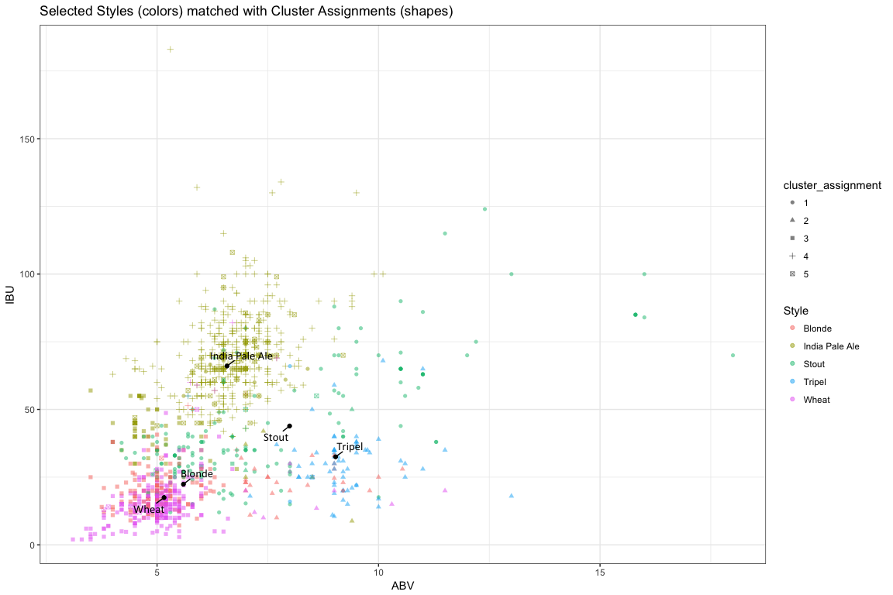
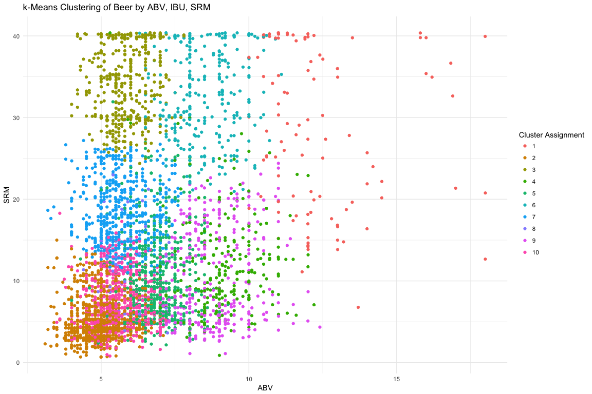
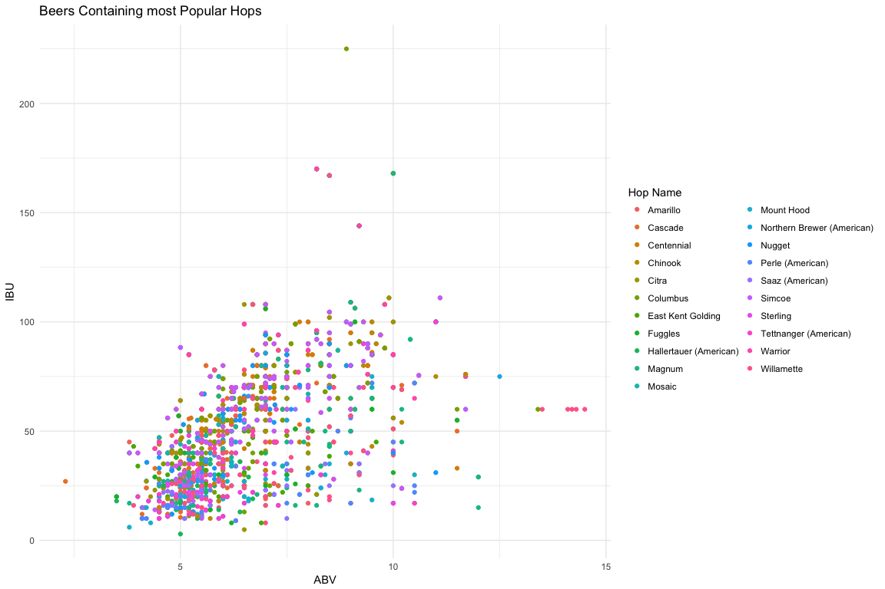

# Data Science Musings on Beer
`r format(Sys.time(), "%B %d, %Y")`  


```r
# If need to close all connections
lapply( dbListConnections( dbDriver( drv = "MySQL")), dbDisconnect)
```


This is a first pass exploration of different aspects of beer.

* Data courtesy of [BreweryDB](http://www.brewerydb.com/developers)
    * Special thanks to [Kris Kroski](https://kro.ski/) for data ideation and beer
    
    
*** 


* The main question on the table is this:
    * Are beer styles actually indicative of shared attributes of the beers within that style? Or are style boundaries more or less arbitrary?
      * Two approaches: clustering and prediction 
      * Clustering: are there natural clusters across the spectum of beers that align well with the styles they're grouped into? 
          * Unsupervised (k-means) clustering based on 
              * ABV (alcohol by volume), IBU (international bitterness units), SRM (measure of color)
              * How well do these match up with various "style centers," defined by mean of ABV, IBU, and SRM per beer style
      * Prediction: can we predict a beer's style based on certain characteristics of the beer?
          * Neural net 
          * Random forest
      
* Answer thus far
    * Beer-intrinsic attributes aren't great predictors of style
    * Style-defined attributes are the best predictors
        * For instance, the glass a beer is served in (which is defined by its style) is a much better predictor of its style than actual characteristics of the beer like ABV and even the number of different types of hops it contains


### Workflow Overview

* Hit the BreweryDB API to iteratively pull in all beers and their ingredients along with other things we might want like breweries and glassware
* Unnest the JSON responses, including all the ingredients columns, and 
* Dump this all into a MySQL database 

* Create a `style_collapsed` column to reduce the number of levels of our outcome variable
    * `grep` through each beer's style to determine if that style contains a keyword that qualifies it to be rolled into a collapsed style
    * If it does, it gets that keyword in a `style_collapsed` column 
    * Further collpase styles that are similar like Hefeweizen and Wit into Wheat
    
* Unnest the ingredients `hops` and `malts` into a sparse matrix
    * Individual ingredients as columns, beers as rows; cell gets a 1 if ingredient is present and 0 otherwise 
    
* Cluster: unsupervised k-means clsutering based on ABV, IBU, and SRM

* Run a neural net
    * Predict either `style` or `style_collapsed` from all the predictors including the total number of hops and malts per beer


**Short Aside**

The question of what should be a predictor variable for style is a bit murky here. What should be fair game for predicting style and what shouldn't? Characteristics of a beer that are defined *by* its style would seem to be "cheating" in a way. 

* Main candidates are:
    * ABV (alcohol by volume), IBU (international bitterness units), SRM (standard reference measure, a scale of beer color from light to dark)
        * These are outputs of a beer that meaningfully define the beer and are theoretically orthogonal to each other
    * Ingredients in a beer such as hops and malts
        * Inputs to a beer that have some effect on its flavor profile
        * Semi-cheating because if style is determined beforehand it likely determines at least in part which ingredients are added 
    * Glass type
        * This is defined entirely by style and is very predictive of it


**This document compiled by querying the beer database I built, specifically by sourcing the file read_from_db.R. This is done for expediency's sake, (the code below detailing how to get the beer, run in full in run_it.R, takes some time to execute).** 


### Get and Prepare Data

**Getting beer, the age-old dilemma**

* The BreweryDB API returns a certain number of results per page; if we want 
* So, we hit the BreweryDB API and ask for `1:number_of_pages`
    * We can change `number_of_pages` to, e.g., 3 if we only want the first 3 pages
    * If there's only one page (as is the case for the glassware endpoing), numberOfPages won't be returned, so in this case we set number_of_pages to 1
* The `addition` parameter can be an empty string if nothing else is needed


```r
base_url <- "http://api.brewerydb.com/v2"
key_preface <- "/?key="

paginated_request <- function(ep, addition) {    
  full_request <- NULL
  first_page <- fromJSON(paste0(base_url, "/", ep, "/", key_preface, key
                                , "&p=1"))
  number_of_pages <- ifelse(!(is.null(first_page$numberOfPages)), 
                            first_page$numberOfPages, 1)      

    for (page in 1:number_of_pages) {                               
    this_request <- fromJSON(paste0(base_url, "/", ep, "/", key_preface, key
                                    , "&p=", page, addition),
                             flatten = TRUE) 
    this_req_unnested <- unnest_it(this_request)    #  <- request unnested here
    print(this_req_unnested$currentPage)
    full_request <- bind_rows(full_request, this_req_unnested[["data"]])
  }
  full_request
} 

all_beer_raw <- paginated_request("beers", "&withIngredients=Y")
```


* Function for unnesting JSON used inside `paginated_request()` below
    + Takes the column named `name` nested within a column in the data portion of the response
        + If the `name` column doesn't exist, it takes the first nested column
* We use something similar to unnest ingredient like all of a beer's hops and malts into a long string contained in `hops_name` and `malt_name`


```r
unnest_it <- function(df) {
  unnested <- df
  for(col in seq_along(df[["data"]])) {
    if(! is.null(ncol(df[["data"]][[col]]))) {
      if(! is.null(df[["data"]][[col]][["name"]])) {
        unnested[["data"]][[col]] <- df[["data"]][[col]][["name"]]
      } else {
        unnested[["data"]][[col]] <- df[["data"]][[col]][[1]]
      }
    }
  }
  unnested
}
```


**Collapse Styles**

* Save the most popular styles in `keywords`
* Loop through each keyword
    * For each beer, `grep` through its style column to see if it contains any one of these keywords
    * If it does, give it that keyword in a new column `style_collapsed`
* If a beer's name matches multiple keywords, e.g., American Double India Pale Ale would match Double India Pale Ale, India Pale Ale, and Pale Ale, its `style_collapsed` is the **last** of those that appear in keywords 
    * This is why keywords are intentionally ordered from most general to most specific
    * So in the case of an case of American Double India Pale Ale: since Double India Pale Ale appears in `keywords` after India Pale Ale and Pale Ale, an American Double India Pale Ale would get a `style_collapsed` of Double India Pale Ale
* If no keyword is contained in `style`, `style_collapsed` is just whatever's in `style`; in other words, it doesn't get collpsed into a bigger bucket
    * This isn't a huge problem because we'll pare down to just the most popular styles later, however we could think about creating a catchall "Other" level for `style_collapsed`


```r
collapse_styles <- function(df) {
  keywords <- c("Lager", "Pale Ale", "India Pale Ale", "Double India Pale Ale", "India Pale Lager", "Hefeweizen", "Barrel-Aged","Wheat", "Pilsner", "Pilsener", "Amber", "Golden", "Blonde", "Brown", "Black", "Stout", "Porter", "Red", "Sour", "Kölsch", "Tripel", "Bitter", "Saison", "Strong Ale", "Barley Wine", "Dubbel", "Altbier")
  
  for (beer in 1:nrow(df)) {
    if (grepl(paste(keywords, collapse="|"), df$style[beer])) {    
      for (keyword in keywords) {         
        if(grepl(keyword, df$style[beer]) == TRUE) {
          df$style_collapsed[beer] <- keyword    
        }                         
      } 
    } else {
      df$style_collapsed[beer] <- as.character(df$style[beer])       
    }
    print(df$style_collapsed[beer])
  }
  return(df)
}
```

* Then we collapse further; right now we just combine all wheaty bears into Wheat and Pils-like beers into Pilsener (with two e's) by `fct_collapse`ing those levels


```r
collapse_further <- function(df) {
  df[["style_collapsed"]] <- df[["style_collapsed"]] %>%
    fct_collapse(
      "Wheat" = c("Hefeweizen", "Wheat"),
      "Pilsener" = c("Pilsner", "American-Style Pilsener") # pilsener == pilsner == pils
    )
  return(df)
}
```


**Split out Ingredients**

* When we unnested ingredients, we just concatenated all of the ingredients for a given beer into a long string
* If we want, we can split out the ingredients that were concatenated in `<ingredient>_name` with this `split_ingredients` function
* This takes a vector of `ingredients_to_split`, so e.g. `c("hops_name", "malt_name")` and creates one column for each type of ingredient (`hops_name_1`, `hops_name_2`, etc.)

* We `str_split` on the ingredient and get a list back
* We find the max number of instances of an ingredient per beer, which will be the number of columns we're adding
* For each new column we need, we create it, initialize it with NAs, and name it
* Then for each element in our list of split up ingredients, if it exists, we add it to the correct column in our df


```r
split_ingredients <- function(df, ingredients_to_split) {
  
  ncol_df <- ncol(df)
  
  for (ingredient in ingredients_to_split) {

    ingredient_split <- str_split(df[[ingredient]], ", ")    
    num_new_cols <- max(lengths(ingredient_split))    
  
    for (num in 1:num_new_cols) {
      
      this_col <- ncol_df + 1         
      
      df[, this_col] <- NA
      names(df)[this_col] <- paste0(ingredient, "_", num)
      ncol_df <- ncol(df)             
      for (row in seq_along(ingredient_split)) {          
        if (!is.null(ingredient_split[[row]][num])) {        
          df[row, this_col] <- ingredient_split[[row]][num]
        }
      }
      df[[names(df)[this_col]]] <- factor(df[[names(df)[this_col]]])
    }
    
    ncol_df <- ncol(df)
  }
  return(df)
}
```


**Find the Most Popualar Styles**

* Find mean ABV, IBU, and SRM per collapsed style
* Arrange collapsed styles by the number of beers that fall into them
    * This is of course dependent on how we collapse styles


```r
library(forcats)

# Pare down to only cases where style is not NA
beer_dat <- beer_necessities

beer_dat_pared <- beer_dat[complete.cases(beer_dat$style), ]

# Arrange beer dat by style popularity
style_popularity <- beer_dat_pared %>% 
  group_by(style) %>% 
  count() %>% 
  arrange(desc(n))
style_popularity

# Add a column that scales popularity
style_popularity <- bind_cols(style_popularity, 
                               n_scaled = as.vector(scale(style_popularity$n)))

# Find styles that are above a z-score of 0
popular_styles <- style_popularity %>% 
  filter(n_scaled > 0)

# Pare dat down to only beers that fall into those styles
popular_beer_dat <- beer_dat_pared %>% 
  filter(
    style %in% popular_styles$style
  ) %>% 
  droplevels() %>% 
  as_tibble() 
nrow(popular_beer_dat)

# Find the centers (mean abv, ibu, srm) of the most popular styles
style_centers <- popular_beer_dat %>% 
  group_by(style_collapsed) %>% 
  add_count() %>% 
  summarise(
    mean_abv = mean(abv, na.rm = TRUE),
    mean_ibu = mean(ibu, na.rm = TRUE), 
    mean_srm = mean(srm, na.rm = TRUE),
    n = median(n, na.rm = TRUE)          # Median here only for summarise. Should be just the same as n
  ) %>% 
  arrange(desc(n)) %>% 
  drop_na() %>% 
  droplevels()

# Give some nicer names
style_centers_rename <- style_centers %>% 
  rename(
    `Collapsed Style` = style_collapsed,
    `Mean ABV` = mean_abv,
    `Mean IBU` = mean_ibu,
    `Mean SRM` = mean_srm,
    `Numer of Beers` = n
  )
```


Take a look at the table      


|Collapsed Style          |  Mean ABV| Mean IBU|  Mean SRM| Numer of Beers|
|:------------------------|---------:|--------:|---------:|--------------:|
|India Pale Ale           |  6.578468| 66.04268|  9.989313|           6524|
|Pale Ale                 |  5.695480| 40.86930|  8.890306|           4280|
|Stout                    |  7.991841| 43.89729| 36.300000|           4238|
|Wheat                    |  5.158040| 17.47168|  5.861842|           3349|
|Double India Pale Ale    |  8.930599| 93.48142| 11.006873|           2525|
|Red                      |  5.742565| 33.81127| 16.178862|           2521|
|Lager                    |  5.453718| 30.64361|  8.457447|           2230|
|Saison                   |  6.400189| 27.25114|  7.053476|           2167|
|Blonde                   |  5.595298| 22.39432|  5.625000|           2044|
|Porter                   |  6.182049| 33.25369| 32.197605|           1973|
|Brown                    |  6.159212| 32.21577| 23.592000|           1462|
|Pilsener                 |  5.227593| 33.51346|  4.413462|           1268|
|Specialty Beer           |  6.446402| 33.77676| 15.520548|           1044|
|Bitter                   |  5.322364| 38.28175| 12.460526|            939|
|Fruit Beer               |  5.195222| 19.24049|  8.666667|            905|
|Herb and Spice Beer      |  6.621446| 27.77342| 18.166667|            872|
|Sour                     |  6.224316| 18.88869| 10.040816|            797|
|Strong Ale               |  8.826425| 36.74233| 22.547945|            767|
|Tripel                   |  9.029775| 32.51500|  7.680556|            734|
|Black                    |  6.958714| 65.50831| 31.080000|            622|
|Barley Wine              | 10.781600| 74.04843| 19.561404|            605|
|Kölsch                   |  4.982216| 23.37183|  4.371795|            593|
|Barrel-Aged              |  9.002506| 39.15789| 18.133333|            540|
|Other Belgian-Style Ales |  7.516318| 37.55812| 17.549020|            506|
|Pumpkin Beer             |  6.712839| 23.48359| 17.918033|            458|
|Dubbel                   |  7.509088| 25.05128| 22.940000|            399|
|Scotch Ale               |  7.620233| 26.36909| 24.222222|            393|
|German-Style Doppelbock  |  8.045762| 28.88692| 25.696970|            376|
|Fruit Cider              |  6.205786| 25.60000| 12.000000|            370|
|German-Style Märzen      |  5.746102| 25.63796| 14.322581|            370|


***

Now that the munging is done, onto the main question: do natural clusters in beer align with style boundaries?


***

### Ingredients

To get more granular with ingredients, we can split out each individual ingredient into its own column. If a beer or style contains that ingredient, its row gets a 1 in that ingredient column and a 0 otherwise.

From this, we can find the total number of hops and malts per grouper.

* The dataframe we'll use will be `beer_necessities`


<!-- ```{r, eval=TRUE, echo=TRUE} -->
<!-- clustered_beer_necessities <- clustered_beer %>% -->
<!--   inner_join(beer_necessities) -->

<!-- ``` -->

* This function takes a dataframe and two other parameters set at the outset:
    * `ingredient_want`: this can be `hops`, `malt`, or other ingredients like `yeast` if we pull that in
    * `grouper`: can be a vector of one or more things to group by, like beer `name` or `style`


```r
pick_ingredient_get_beer <- function (ingredient_want, df, grouper) {
  
  # ----------------------- Setup --------------------------- #
  # We've already split ingredient number names out from the concatenated string into columns like `malt_name_1`,
  # `malt_name_2`, etc. We need to find the range of these columns; there will be a different number of malt
  # columns than hops columns, for instance. The first one will be `<ingredient>_name_1` and from this we can find
  # the index of this column in our dataframe. We get the name of last one with the `get_last_ing_name_col()`
  # function. Then we save a vector of all the ingredient column names in `ingredient_colnames`. It will stay
  # constant even if the indices change when we select out certain columns. 
  
  # First ingredient
  first_ingredient_name <- paste(ingredient_want, "_name_1", sep="")
  first_ingredient_index <- which(colnames(df)==first_ingredient_name)
  
  # Get the last ingredient
  get_last_ing_name_col <- function(df) {
    for (col in names(df)) {
      if (grepl(paste(ingredient_want, "_name_", sep = ""), col) == TRUE) {
        name_last_ing_col <- col
      }
    }
    return(name_last_ing_col)
  }
  
  # Last ingredient
  last_ingredient_name <- get_last_ing_name_col(df)
  last_ingredient_index <- which(colnames(df)==last_ingredient_name)
  
  # Vector of all the ingredient column names
  ingredient_colnames <- names(df)[first_ingredient_index:last_ingredient_index]
  
  # Non-ingredient column names we want to keep
  to_keep_col_names <- c("cluster_assignment", "name", "abv", "ibu", "srm", "style", "style_collapsed")
  
  # -------------------------------------------------------------------------------# 
  
  # Inside `gather_ingredients()` we take out superflous column names that are not in `to_keep_col_names` or one 
  # of the ingredient columns, find what the new ingredient column indices are, since they'll have changed after 
  # we pared down and then gather all of the ingredient columns (e.g., `hops_name_1`) into one long column, 
  # `ing_keys` and all the actual ingredient names (e.g., Cascade) into `ing_names`.
  
  # ----------------------------- Gather columns --------------------------------- #
  gather_ingredients <- function(df, cols_to_gather) {
    to_keep_indices <- which(colnames(df) %in% to_keep_col_names)
    
    selected_df <- df[, c(to_keep_indices, first_ingredient_index:last_ingredient_index)]
    
    new_ing_indices <- which(colnames(selected_df) %in% cols_to_gather)    # indices will have changed since we pared down 
    
    df_gathered <- selected_df %>%
      gather_(
        key_col = "ing_keys",
        value_col = "ing_names",
        gather_cols = colnames(selected_df)[new_ing_indices]
      ) %>%
      mutate(
        count = 1
      )
    df_gathered
  }
  beer_gathered <- gather_ingredients(df, ingredient_colnames)  # ingredient colnames defined above function
  # ------------------------------------------------------------------------------- # 
  
  # Next we get a vector of all ingredient levels and take out the one that's an empty string and 
  # use this vector of ingredient levels in `select_spread_cols()` below

  # Get a vector of all ingredient levels
  beer_gathered$ing_names <- factor(beer_gathered$ing_names)
  ingredient_levels <- levels(beer_gathered$ing_names) 
  
  # Take out the level that's just an empty string
  to_keep_levels <- !(c(1:length(ingredient_levels)) %in% which(ingredient_levels == ""))
  ingredient_levels <- ingredient_levels[to_keep_levels]
  
  beer_gathered$ing_names <- as.character(beer_gathered$ing_names)
  
  # ----------------------------------------------------------------------------- # 
  
  # Then we spread the ingredient names: we take what was previously the `value` in our gathered dataframe, the
  # actual ingredient names (Cascade, Centennial) and make that our `key`; it'll form the new column names. The
  # new `value` is `value` is count; it'll populate the row cells. If a given row has a certain ingredient, it
  # gets a 1 in the corresponding cell, an NA otherwise. 
  # We add a unique idenfitier for each row with `row`, which we'll drop later (see [Hadley's SO
  # comment](https://stackoverflow.com/questions/25960394/unexpected-behavior-with-tidyr)).

  
  # ------------------------------- Spread columns -------------------------------- #
  spread_ingredients <- function(df) {
    df_spread <- df %>% 
      mutate(
        row = 1:nrow(df)        # Add a unique idenfitier for each row which we'll need in order to spread; we'll drop this later
      ) %>%                                 
      spread(
        key = ing_names,
        value = count
      ) 
    return(df_spread)
  }
  beer_spread <- spread_ingredients(beer_gathered)
  # ------------------------------------------------------------------------------- # 

  
  # ------------------------- Select only certain columns ------------------------- #
  select_spread_cols <- function(df) {
    to_keep_col_indices <- which(colnames(df) %in% to_keep_col_names)
    to_keep_ingredient_indices <- which(colnames(df) %in% ingredient_levels)
    
    to_keep_inds_all <- c(to_keep_col_indices, to_keep_ingredient_indices)
    
    new_df <- df %>% 
      select_(
        .dots = to_keep_inds_all
      )
    return(new_df)
  }
  beer_spread_selected <- select_spread_cols(beer_spread)
  # ------------------------------------------------------------------------------- # 

  # Take out all rows that have no ingredients specified at all
  inds_to_remove <- apply(beer_spread_selected[, first_ingredient_index:last_ingredient_index], 
                          1, function(x) all(is.na(x)))
  beer_spread_no_na <- beer_spread_selected[ !inds_to_remove, ]
  
  
  # ----------------- Group ingredients by the grouper specified ------------------- #
  # Then we do the final step and group by the groupers.
  
  get_ingredients_per_grouper <- function(df, grouper = grouper) {
    df_grouped <- df %>%
      ungroup() %>% 
      group_by_(grouper)
    
    not_for_summing <- which(colnames(df_grouped) %in% to_keep_col_names)
    max_not_for_summing <- max(not_for_summing)
    
    per_grouper <- df_grouped %>% 
      select(-c(abv, ibu, srm)) %>%    # taking out temporarily
      summarise_if(
        is.numeric,              
        sum, na.rm = TRUE
        # -c(abv, ibu, srm)
      ) %>%
      mutate(
        total = rowSums(.[(max_not_for_summing + 1):ncol(.)], na.rm = TRUE)    
      )
    
    # Send total to the second position
    per_grouper <- per_grouper %>% 
      select(
        name, total, everything()
      )
    
    # Replace total column with more descriptive name: total_<ingredient>
    names(per_grouper)[which(names(per_grouper) == "total")] <- paste0("total_", ingredient_want)
    
    return(per_grouper)
  }
  # ------------------------------------------------------------------------------- # 
  
  ingredients_per_grouper <- get_ingredients_per_grouper(beer_spread_selected, grouper)
  return(ingredients_per_grouper)
}
```


* Now run the function with `ingredient_want` as first hops, then malt
* Then join the resulting dataframes and remove/reorder some columns


```r
# Run the entire function with ingredient_want set to hops, grouping by name
ingredients_per_beer_hops <- pick_ingredient_get_beer(ingredient_want = "hops", 
                                                      beer_necessities, 
                                                      grouper = c("name", "style_collapsed"))

# Same for malt
ingredients_per_beer_malt <- pick_ingredient_get_beer(ingredient_want = "malt", 
                                                      beer_necessities, 
                                                      grouper = c("name", "style_collapsed"))

# Join those on our original dataframe by name
beer_ingredients_join_first_ingredient <- left_join(beer_necessities, ingredients_per_beer_hops,
                                                    by = "name")
beer_ingredients_join <- left_join(beer_ingredients_join_first_ingredient, ingredients_per_beer_malt,
                                   by = "name")


# Take out some unnecessary columns
unnecessary_cols <- c("styleId", "abv_scaled", "ibu_scaled", "srm_scaled", 
                      "hops_id", "malt_id", "glasswareId", "style.categoryId")
beer_ingredients_join <- beer_ingredients_join[, (! names(beer_ingredients_join) %in% unnecessary_cols)]


# If we also want to take out any of the malt_name_1, malt_name_2, etc. columns we can do this with a grep
more_unnecessary <- c("hops_name_|malt_name_")
beer_ingredients_join <- 
  beer_ingredients_join[, (! grepl(more_unnecessary, names(beer_ingredients_join)) == TRUE)]

# Reorder columns a bit
beer_ingredients_join_all <- beer_ingredients_join %>% 
  select(
    id, name, total_hops, total_malt, everything(), -description
  )

# Keep only beers that fall into a style_collapsed bucket
beer_ingredients_join <- beer_ingredients_join_all %>% 
  filter(
    style_collapsed %in% levels(beer_necessities$style_collapsed)
  ) %>% 
  droplevels()

# And get a df that includes total_hops and total_malt but not all the other ingredient columns
beer_totals_all <- beer_ingredients_join_all %>% 
  select(
    id, name, total_hops, total_malt, style, style_collapsed,
    abv, ibu, srm, glass, hops_name, malt_name
  )

# And just style_collapsed
beer_totals <- beer_ingredients_join %>% 
  filter(
    style_collapsed %in% levels(beer_necessities$style_collapsed)
  ) %>% 
  droplevels()
```


Now we're left with something of a sparse matrix of all the ingredients compared to all the beers

|id     |name                                                         | total_hops| total_malt|style                                   |   abv|  ibu| srm|glass |hops_name                         |malt_name                                                   |style_collapsed | #06300| Admiral| Aged / Debittered Hops (Lambic)| Ahtanum| Alchemy| Amarillo| Amarillo Gold| Apollo| Aquila| Aramis| Argentine Cascade| Athanum| Aurora| Australian Dr. Rudi| Azacca| Azzeca| Belma| Bobek| Bramling Cross| Bravo| Brewer's Gold| Brewer's Gold (American)| Calypso| Cascade| Celeia| Centennial| Challenger| Chinook| Citra| Cluster| Cobb| Columbus| Columbus (Tomahawk)| Comet| Crystal| CTZ| Delta| East Kent Golding| El Dorado| Ella| Enigma| Equinox| Eureka| Experimental 05256| Experimental 06277| Falconer's Flight| First Gold| French Strisserspalt| French Triskel| Fuggle (American)| Fuggle (English)| Fuggles| Galaxy| Galena| German Magnum| German Mandarina Bavaria| German Opal| German Perle| German Polaris| German Select| German Tradition| Glacier| Golding (American)| Green Bullet| Hallertau Hallertauer Mittelfrüher| Hallertau Hallertauer Tradition| Hallertau Northern Brewer| Hallertauer (American)| Hallertauer Herkules| Hallertauer Hersbrucker| Hallertauer Perle| Hallertauer Select| Helga| Hop Extract| Hops| Horizon| Huell Melon| Idaho 7| Jarrylo| Kent Goldings| Kohatu| Lemon Drop| Liberty| Magnum| Marynka| Meridian| Millenium| Mosaic| Motueka| Mount Hood| Mt. Rainier| Nelson Sauvin| New Zealand Hallertauer| New Zealand Motueka| New Zealand Sauvin| Newport| Noble| Northdown| Northern Brewer (American)| Nugget| Orbit| Pacific Gem| Pacific Jade| Pacifica| Palisades| Perle (American)| Phoenix| Pilgrim| Premiant| Pride of Ringwood| Rakau| Revolution| Saaz (American)| Saaz (Czech)| Santiam| Saphir (German Organic)| Simcoe| Sladek (Saaz)| Sorachi Ace| Southern Cross| Sovereign| Spalt| Spalt Select| Spalt Spalter| Sterling| Sticklebract| Strisselspalt| Styrian Aurora| Styrian Bobeks| Styrian Goldings| Summit| Super Galena| Target| Tettnang Tettnanger| Tettnanger (American)| Tomahawk| Topaz| Tradition| Ultra| Vanguard| Vic Secret| Waimea| Wakatu| Warrior| Willamette| Yakima Willamette| Zeus| Zythos| Abbey Malt| Acidulated Malt| Amber Malt| Aromatic Malt| Asheburne Mild Malt| Bamberg Smoked Malt| Barley - Black| Barley - Flaked| Barley - Lightly Roasted| Barley - Malted| Barley - Raw| Barley - Roasted| Barley - Roasted/De-husked| Beechwood Smoked| Belgian Pale| Belgian Pilsner| Biscuit Malt| Black Malt| Black Malt - Debittered| Black Malt - Organic| Black Patent| Black Roast| Blackprinz Malt| Blue Agave Nectar| Blue Corn| Bonlander| Briess 2-row Chocolate Malt| Briess Blackprinz Malt| British Pale Malt| Brown Malt| Brown Sugar| Buckwheat - Roasted| C-15| Canada 2-Row Silo| Cane Sugar| Cara Malt| CaraAmber| CaraAroma| CaraBrown| Carafa I| Carafa II| Carafa III| Carafa Special| CaraFoam| CaraHell| Caramel/Crystal Malt| Caramel/Crystal Malt - Dark| Caramel/Crystal Malt - Extra Dark| Caramel/Crystal Malt - Heritage| Caramel/Crystal Malt - Light| Caramel/Crystal Malt - Medium| Caramel/Crystal Malt - Organic| Caramel/Crystal Malt 10L| Caramel/Crystal Malt 120L| Caramel/Crystal Malt 150L| Caramel/Crystal Malt 15L| Caramel/Crystal Malt 20L| Caramel/Crystal Malt 300L| Caramel/Crystal Malt 30L| Caramel/Crystal Malt 40L| Caramel/Crystal Malt 45L| Caramel/Crystal Malt 50L| Caramel/Crystal Malt 55L| Caramel/Crystal Malt 60L| Caramel/Crystal Malt 70L| Caramel/Crystal Malt 75L| Caramel/Crystal Malt 80L| Caramel/Crystal Malt 85L| Caramel/Crystal Malt 8L| Caramel/Crystal Malt 90L| CaraMunich| CaraMunich 120L| CaraMunich 20L| CaraMunich 40L| CaraMunich 60L| CaraMunich I| CaraMunich II| CaraMunich III| CaraPils/Dextrin Malt| CaraRed| CaraRye| CaraStan| CaraVienne Malt| CaraWheat| Carolina Rye Malt| Cereal| Cherry Smoked| Cherrywood Smoke Malt| Chit Malt| Chocolate Malt| Chocolate Rye Malt| Chocolate Wheat Malt| Coffee Malt| Corn| Corn - Field| Corn - Flaked| Corn Grits| Crisp 120| Crisp 77| Crystal 77| Dark Chocolate| Dememera Sugar| Dextrin Malt| Dextrose Syrup| Extra Special Malt| Fawcett Crystal Rye| Fawcett Rye| German Cologne| Gladfield Pale| Glen Eagle Maris Otter| Golden Promise| Harrington 2-Row Base Malt| High Fructose Corn Syrup| Honey| Honey Malt| Hugh Baird Pale Ale Malt| Kiln Amber| Lactose| Lager Malt| Malt Extract| Malted Rye| Malto Franco-Belge Pils Malt| Maple Syrup| Maris Otter| Melanoidin Malt| Metcalfe| Midnight Wheat| Mild Malt| Millet| Munich Malt| Munich Malt - Dark| Munich Malt - Light| Munich Malt - Organic| Munich Malt - Smoked| Munich Malt - Type I| Munich Malt - Type II| Munich Malt 10L| Munich Malt 20L| Munich Malt 40L| Munich Wheat| Oats - Flaked| Oats - Golden Naked| Oats - Malted| Oats - Rolled| Oats - Steel Cut (Pinhead Oats)| Oats - Toasted| Pale Chocolate Malt| Pale Malt| Pale Malt - Halcyon| Pale Malt - Optic| Pale Malt - Organic| Pale Wheat| Palev| Pearl Malt| Peated Malt - Smoked| Piloncillo| Pilsner Malt| Pilsner Malt - Organic| Rahr 2-Row Malt| Rahr Special Pale| Rauchmalz| Rice| Rice - Flaked| Rice - Hulls| Rice - Red| Rice - White| Roast Malt| Rye - Flaked| Rye Malt| Samuel Adams two-row pale malt blend| Six-Row Pale Malt| Smoked Malt| Special B Malt| Special Roast| Special W Malt| Spelt Malt| Sugar (Albion)| Toasted Malt| Torrefied Wheat| Two-Row Barley Malt| Two-Row Pale Malt| Two-Row Pale Malt - Organic| Two-Row Pale Malt - Toasted| Two-Row Pilsner Malt| Two-Row Pilsner Malt - Belgian| Two-Row Pilsner Malt - Germany| Victory Malt| Vienna Malt| Weyermann Rye| Wheat - Flaked| Wheat - Raw| Wheat - Red| Wheat - Toasted| Wheat - Torrified| Wheat Malt| Wheat Malt - Dark| Wheat Malt - German| Wheat Malt - Light| Wheat Malt - Organic| Wheat Malt - Red| Wheat Malt - Smoked| Wheat Malt - White| White Wheat| Wyermann Vienna|
|:------|:------------------------------------------------------------|----------:|----------:|:---------------------------------------|-----:|----:|---:|:-----|:---------------------------------|:-----------------------------------------------------------|:---------------|------:|-------:|-------------------------------:|-------:|-------:|--------:|-------------:|------:|------:|------:|-----------------:|-------:|------:|-------------------:|------:|------:|-----:|-----:|--------------:|-----:|-------------:|------------------------:|-------:|-------:|------:|----------:|----------:|-------:|-----:|-------:|----:|--------:|-------------------:|-----:|-------:|---:|-----:|-----------------:|---------:|----:|------:|-------:|------:|------------------:|------------------:|-----------------:|----------:|--------------------:|--------------:|-----------------:|----------------:|-------:|------:|------:|-------------:|------------------------:|-----------:|------------:|--------------:|-------------:|----------------:|-------:|------------------:|------------:|----------------------------------:|-------------------------------:|-------------------------:|----------------------:|--------------------:|-----------------------:|-----------------:|------------------:|-----:|-----------:|----:|-------:|-----------:|-------:|-------:|-------------:|------:|----------:|-------:|------:|-------:|--------:|---------:|------:|-------:|----------:|-----------:|-------------:|-----------------------:|-------------------:|------------------:|-------:|-----:|---------:|--------------------------:|------:|-----:|-----------:|------------:|--------:|---------:|----------------:|-------:|-------:|--------:|-----------------:|-----:|----------:|---------------:|------------:|-------:|-----------------------:|------:|-------------:|-----------:|--------------:|---------:|-----:|------------:|-------------:|--------:|------------:|-------------:|--------------:|--------------:|----------------:|------:|------------:|------:|-------------------:|---------------------:|--------:|-----:|---------:|-----:|--------:|----------:|------:|------:|-------:|----------:|-----------------:|----:|------:|----------:|---------------:|----------:|-------------:|-------------------:|-------------------:|--------------:|---------------:|------------------------:|---------------:|------------:|----------------:|--------------------------:|----------------:|------------:|---------------:|------------:|----------:|-----------------------:|--------------------:|------------:|-----------:|---------------:|-----------------:|---------:|---------:|---------------------------:|----------------------:|-----------------:|----------:|-----------:|-------------------:|----:|-----------------:|----------:|---------:|---------:|---------:|---------:|--------:|---------:|----------:|--------------:|--------:|--------:|--------------------:|---------------------------:|---------------------------------:|-------------------------------:|----------------------------:|-----------------------------:|------------------------------:|------------------------:|-------------------------:|-------------------------:|------------------------:|------------------------:|-------------------------:|------------------------:|------------------------:|------------------------:|------------------------:|------------------------:|------------------------:|------------------------:|------------------------:|------------------------:|------------------------:|-----------------------:|------------------------:|----------:|---------------:|--------------:|--------------:|--------------:|------------:|-------------:|--------------:|---------------------:|-------:|-------:|--------:|---------------:|---------:|-----------------:|------:|-------------:|---------------------:|---------:|--------------:|------------------:|--------------------:|-----------:|----:|------------:|-------------:|----------:|---------:|--------:|----------:|--------------:|--------------:|------------:|--------------:|------------------:|-------------------:|-----------:|--------------:|--------------:|----------------------:|--------------:|--------------------------:|------------------------:|-----:|----------:|------------------------:|----------:|-------:|----------:|------------:|----------:|----------------------------:|-----------:|-----------:|---------------:|--------:|--------------:|---------:|------:|-----------:|------------------:|-------------------:|---------------------:|--------------------:|--------------------:|---------------------:|---------------:|---------------:|---------------:|------------:|-------------:|-------------------:|-------------:|-------------:|-------------------------------:|--------------:|-------------------:|---------:|-------------------:|-----------------:|-------------------:|----------:|-----:|----------:|--------------------:|----------:|------------:|----------------------:|---------------:|-----------------:|---------:|----:|-------------:|------------:|----------:|------------:|----------:|------------:|--------:|------------------------------------:|-----------------:|-----------:|--------------:|-------------:|--------------:|----------:|--------------:|------------:|---------------:|-------------------:|-----------------:|---------------------------:|---------------------------:|--------------------:|------------------------------:|------------------------------:|------------:|-----------:|-------------:|--------------:|-----------:|-----------:|---------------:|-----------------:|----------:|-----------------:|-------------------:|------------------:|--------------------:|----------------:|-------------------:|------------------:|-----------:|---------------:|
|cBLTUw |"18" Imperial IPA 2                                          |          0|          0|American-Style Imperial Stout           | 11.10|   NA|  33|Pint  |NA                                |NA                                                          |Stout           |      0|       0|                               0|       0|       0|        0|             0|      0|      0|      0|                 0|       0|      0|                   0|      0|      0|     0|     0|              0|     0|             0|                        0|       0|       0|      0|          0|          0|       0|     0|       0|    0|        0|                   0|     0|       0|   0|     0|                 0|         0|    0|      0|       0|      0|                  0|                  0|                 0|          0|                    0|              0|                 0|                0|       0|      0|      0|             0|                        0|           0|            0|              0|             0|                0|       0|                  0|            0|                                  0|                               0|                         0|                      0|                    0|                       0|                 0|                  0|     0|           0|    0|       0|           0|       0|       0|             0|      0|          0|       0|      0|       0|        0|         0|      0|       0|          0|           0|             0|                       0|                   0|                  0|       0|     0|         0|                          0|      0|     0|           0|            0|        0|         0|                0|       0|       0|        0|                 0|     0|          0|               0|            0|       0|                       0|      0|             0|           0|              0|         0|     0|            0|             0|        0|            0|             0|              0|              0|                0|      0|            0|      0|                   0|                     0|        0|     0|         0|     0|        0|          0|      0|      0|       0|          0|                 0|    0|      0|          0|               0|          0|             0|                   0|                   0|              0|               0|                        0|               0|            0|                0|                          0|                0|            0|               0|            0|          0|                       0|                    0|            0|           0|               0|                 0|         0|         0|                           0|                      0|                 0|          0|           0|                   0|    0|                 0|          0|         0|         0|         0|         0|        0|         0|          0|              0|        0|        0|                    0|                           0|                                 0|                               0|                            0|                             0|                              0|                        0|                         0|                         0|                        0|                        0|                         0|                        0|                        0|                        0|                        0|                        0|                        0|                        0|                        0|                        0|                        0|                       0|                        0|          0|               0|              0|              0|              0|            0|             0|              0|                     0|       0|       0|        0|               0|         0|                 0|      0|             0|                     0|         0|              0|                  0|                    0|           0|    0|            0|             0|          0|         0|        0|          0|              0|              0|            0|              0|                  0|                   0|           0|              0|              0|                      0|              0|                          0|                        0|     0|          0|                        0|          0|       0|          0|            0|          0|                            0|           0|           0|               0|        0|              0|         0|      0|           0|                  0|                   0|                     0|                    0|                    0|                     0|               0|               0|               0|            0|             0|                   0|             0|             0|                               0|              0|                   0|         0|                   0|                 0|                   0|          0|     0|          0|                    0|          0|            0|                      0|               0|                 0|         0|    0|             0|            0|          0|            0|          0|            0|        0|                                    0|                 0|           0|              0|             0|              0|          0|              0|            0|               0|                   0|                 0|                           0|                           0|                    0|                              0|                              0|            0|           0|             0|              0|           0|           0|               0|                 0|          0|                 0|                   0|                  0|                    0|                0|                   0|                  0|           0|               0|
|ZsQEJt |"633" American Pale Ale                                      |          0|          0|American-Style Pale Ale                 |  6.33| 25.0|  NA|NA    |NA                                |NA                                                          |Pale Ale        |      0|       0|                               0|       0|       0|        0|             0|      0|      0|      0|                 0|       0|      0|                   0|      0|      0|     0|     0|              0|     0|             0|                        0|       0|       0|      0|          0|          0|       0|     0|       0|    0|        0|                   0|     0|       0|   0|     0|                 0|         0|    0|      0|       0|      0|                  0|                  0|                 0|          0|                    0|              0|                 0|                0|       0|      0|      0|             0|                        0|           0|            0|              0|             0|                0|       0|                  0|            0|                                  0|                               0|                         0|                      0|                    0|                       0|                 0|                  0|     0|           0|    0|       0|           0|       0|       0|             0|      0|          0|       0|      0|       0|        0|         0|      0|       0|          0|           0|             0|                       0|                   0|                  0|       0|     0|         0|                          0|      0|     0|           0|            0|        0|         0|                0|       0|       0|        0|                 0|     0|          0|               0|            0|       0|                       0|      0|             0|           0|              0|         0|     0|            0|             0|        0|            0|             0|              0|              0|                0|      0|            0|      0|                   0|                     0|        0|     0|         0|     0|        0|          0|      0|      0|       0|          0|                 0|    0|      0|          0|               0|          0|             0|                   0|                   0|              0|               0|                        0|               0|            0|                0|                          0|                0|            0|               0|            0|          0|                       0|                    0|            0|           0|               0|                 0|         0|         0|                           0|                      0|                 0|          0|           0|                   0|    0|                 0|          0|         0|         0|         0|         0|        0|         0|          0|              0|        0|        0|                    0|                           0|                                 0|                               0|                            0|                             0|                              0|                        0|                         0|                         0|                        0|                        0|                         0|                        0|                        0|                        0|                        0|                        0|                        0|                        0|                        0|                        0|                        0|                       0|                        0|          0|               0|              0|              0|              0|            0|             0|              0|                     0|       0|       0|        0|               0|         0|                 0|      0|             0|                     0|         0|              0|                  0|                    0|           0|    0|            0|             0|          0|         0|        0|          0|              0|              0|            0|              0|                  0|                   0|           0|              0|              0|                      0|              0|                          0|                        0|     0|          0|                        0|          0|       0|          0|            0|          0|                            0|           0|           0|               0|        0|              0|         0|      0|           0|                  0|                   0|                     0|                    0|                    0|                     0|               0|               0|               0|            0|             0|                   0|             0|             0|                               0|              0|                   0|         0|                   0|                 0|                   0|          0|     0|          0|                    0|          0|            0|                      0|               0|                 0|         0|    0|             0|            0|          0|            0|          0|            0|        0|                                    0|                 0|           0|              0|             0|              0|          0|              0|            0|               0|                   0|                 0|                           0|                           0|                    0|                              0|                              0|            0|           0|             0|              0|           0|           0|               0|                 0|          0|                 0|                   0|                  0|                    0|                0|                   0|                  0|           0|               0|
|tmEthz |"Admiral" Stache                                             |          2|          4|Baltic-Style Porter                     |  7.00| 23.0|  37|Pint  |Perle (American), Saaz (American) |Barley - Malted, Chocolate Malt, Munich Malt, Oats - Flaked |Porter          |      0|       0|                               0|       0|       0|        0|             0|      0|      0|      0|                 0|       0|      0|                   0|      0|      0|     0|     0|              0|     0|             0|                        0|       0|       0|      0|          0|          0|       0|     0|       0|    0|        0|                   0|     0|       0|   0|     0|                 0|         0|    0|      0|       0|      0|                  0|                  0|                 0|          0|                    0|              0|                 0|                0|       0|      0|      0|             0|                        0|           0|            0|              0|             0|                0|       0|                  0|            0|                                  0|                               0|                         0|                      0|                    0|                       0|                 0|                  0|     0|           0|    0|       0|           0|       0|       0|             0|      0|          0|       0|      0|       0|        0|         0|      0|       0|          0|           0|             0|                       0|                   0|                  0|       0|     0|         0|                          0|      0|     0|           0|            0|        0|         0|                1|       0|       0|        0|                 0|     0|          0|               1|            0|       0|                       0|      0|             0|           0|              0|         0|     0|            0|             0|        0|            0|             0|              0|              0|                0|      0|            0|      0|                   0|                     0|        0|     0|         0|     0|        0|          0|      0|      0|       0|          0|                 0|    0|      0|          0|               0|          0|             0|                   0|                   0|              0|               0|                        0|               1|            0|                0|                          0|                0|            0|               0|            0|          0|                       0|                    0|            0|           0|               0|                 0|         0|         0|                           0|                      0|                 0|          0|           0|                   0|    0|                 0|          0|         0|         0|         0|         0|        0|         0|          0|              0|        0|        0|                    0|                           0|                                 0|                               0|                            0|                             0|                              0|                        0|                         0|                         0|                        0|                        0|                         0|                        0|                        0|                        0|                        0|                        0|                        0|                        0|                        0|                        0|                        0|                       0|                        0|          0|               0|              0|              0|              0|            0|             0|              0|                     0|       0|       0|        0|               0|         0|                 0|      0|             0|                     0|         0|              1|                  0|                    0|           0|    0|            0|             0|          0|         0|        0|          0|              0|              0|            0|              0|                  0|                   0|           0|              0|              0|                      0|              0|                          0|                        0|     0|          0|                        0|          0|       0|          0|            0|          0|                            0|           0|           0|               0|        0|              0|         0|      0|           1|                  0|                   0|                     0|                    0|                    0|                     0|               0|               0|               0|            0|             1|                   0|             0|             0|                               0|              0|                   0|         0|                   0|                 0|                   0|          0|     0|          0|                    0|          0|            0|                      0|               0|                 0|         0|    0|             0|            0|          0|            0|          0|            0|        0|                                    0|                 0|           0|              0|             0|              0|          0|              0|            0|               0|                   0|                 0|                           0|                           0|                    0|                              0|                              0|            0|           0|             0|              0|           0|           0|               0|                 0|          0|                 0|                   0|                  0|                    0|                0|                   0|                  0|           0|               0|
|b7SfHG |"Ah Me Joy" Porter                                           |          0|          0|Robust Porter                           |  5.40| 51.0|  40|NA    |NA                                |NA                                                          |Porter          |      0|       0|                               0|       0|       0|        0|             0|      0|      0|      0|                 0|       0|      0|                   0|      0|      0|     0|     0|              0|     0|             0|                        0|       0|       0|      0|          0|          0|       0|     0|       0|    0|        0|                   0|     0|       0|   0|     0|                 0|         0|    0|      0|       0|      0|                  0|                  0|                 0|          0|                    0|              0|                 0|                0|       0|      0|      0|             0|                        0|           0|            0|              0|             0|                0|       0|                  0|            0|                                  0|                               0|                         0|                      0|                    0|                       0|                 0|                  0|     0|           0|    0|       0|           0|       0|       0|             0|      0|          0|       0|      0|       0|        0|         0|      0|       0|          0|           0|             0|                       0|                   0|                  0|       0|     0|         0|                          0|      0|     0|           0|            0|        0|         0|                0|       0|       0|        0|                 0|     0|          0|               0|            0|       0|                       0|      0|             0|           0|              0|         0|     0|            0|             0|        0|            0|             0|              0|              0|                0|      0|            0|      0|                   0|                     0|        0|     0|         0|     0|        0|          0|      0|      0|       0|          0|                 0|    0|      0|          0|               0|          0|             0|                   0|                   0|              0|               0|                        0|               0|            0|                0|                          0|                0|            0|               0|            0|          0|                       0|                    0|            0|           0|               0|                 0|         0|         0|                           0|                      0|                 0|          0|           0|                   0|    0|                 0|          0|         0|         0|         0|         0|        0|         0|          0|              0|        0|        0|                    0|                           0|                                 0|                               0|                            0|                             0|                              0|                        0|                         0|                         0|                        0|                        0|                         0|                        0|                        0|                        0|                        0|                        0|                        0|                        0|                        0|                        0|                        0|                       0|                        0|          0|               0|              0|              0|              0|            0|             0|              0|                     0|       0|       0|        0|               0|         0|                 0|      0|             0|                     0|         0|              0|                  0|                    0|           0|    0|            0|             0|          0|         0|        0|          0|              0|              0|            0|              0|                  0|                   0|           0|              0|              0|                      0|              0|                          0|                        0|     0|          0|                        0|          0|       0|          0|            0|          0|                            0|           0|           0|               0|        0|              0|         0|      0|           0|                  0|                   0|                     0|                    0|                    0|                     0|               0|               0|               0|            0|             0|                   0|             0|             0|                               0|              0|                   0|         0|                   0|                 0|                   0|          0|     0|          0|                    0|          0|            0|                      0|               0|                 0|         0|    0|             0|            0|          0|            0|          0|            0|        0|                                    0|                 0|           0|              0|             0|              0|          0|              0|            0|               0|                   0|                 0|                           0|                           0|                    0|                              0|                              0|            0|           0|             0|              0|           0|           0|               0|                 0|          0|                 0|                   0|                  0|                    0|                0|                   0|                  0|           0|               0|
|zcJMId |"Alternating Currant" Sour                                   |          0|          0|American-Style Sour Ale                 |  4.80| 12.0|  NA|NA    |NA                                |NA                                                          |Sour            |      0|       0|                               0|       0|       0|        0|             0|      0|      0|      0|                 0|       0|      0|                   0|      0|      0|     0|     0|              0|     0|             0|                        0|       0|       0|      0|          0|          0|       0|     0|       0|    0|        0|                   0|     0|       0|   0|     0|                 0|         0|    0|      0|       0|      0|                  0|                  0|                 0|          0|                    0|              0|                 0|                0|       0|      0|      0|             0|                        0|           0|            0|              0|             0|                0|       0|                  0|            0|                                  0|                               0|                         0|                      0|                    0|                       0|                 0|                  0|     0|           0|    0|       0|           0|       0|       0|             0|      0|          0|       0|      0|       0|        0|         0|      0|       0|          0|           0|             0|                       0|                   0|                  0|       0|     0|         0|                          0|      0|     0|           0|            0|        0|         0|                0|       0|       0|        0|                 0|     0|          0|               0|            0|       0|                       0|      0|             0|           0|              0|         0|     0|            0|             0|        0|            0|             0|              0|              0|                0|      0|            0|      0|                   0|                     0|        0|     0|         0|     0|        0|          0|      0|      0|       0|          0|                 0|    0|      0|          0|               0|          0|             0|                   0|                   0|              0|               0|                        0|               0|            0|                0|                          0|                0|            0|               0|            0|          0|                       0|                    0|            0|           0|               0|                 0|         0|         0|                           0|                      0|                 0|          0|           0|                   0|    0|                 0|          0|         0|         0|         0|         0|        0|         0|          0|              0|        0|        0|                    0|                           0|                                 0|                               0|                            0|                             0|                              0|                        0|                         0|                         0|                        0|                        0|                         0|                        0|                        0|                        0|                        0|                        0|                        0|                        0|                        0|                        0|                        0|                       0|                        0|          0|               0|              0|              0|              0|            0|             0|              0|                     0|       0|       0|        0|               0|         0|                 0|      0|             0|                     0|         0|              0|                  0|                    0|           0|    0|            0|             0|          0|         0|        0|          0|              0|              0|            0|              0|                  0|                   0|           0|              0|              0|                      0|              0|                          0|                        0|     0|          0|                        0|          0|       0|          0|            0|          0|                            0|           0|           0|               0|        0|              0|         0|      0|           0|                  0|                   0|                     0|                    0|                    0|                     0|               0|               0|               0|            0|             0|                   0|             0|             0|                               0|              0|                   0|         0|                   0|                 0|                   0|          0|     0|          0|                    0|          0|            0|                      0|               0|                 0|         0|    0|             0|            0|          0|            0|          0|            0|        0|                                    0|                 0|           0|              0|             0|              0|          0|              0|            0|               0|                   0|                 0|                           0|                           0|                    0|                              0|                              0|            0|           0|             0|              0|           0|           0|               0|                 0|          0|                 0|                   0|                  0|                    0|                0|                   0|                  0|           0|               0|
|UM8GL6 |"B" Street Pineapple Blonde                                  |          0|          0|Golden or Blonde Ale                    |  4.60|   NA|   5|NA    |NA                                |NA                                                          |Blonde          |      0|       0|                               0|       0|       0|        0|             0|      0|      0|      0|                 0|       0|      0|                   0|      0|      0|     0|     0|              0|     0|             0|                        0|       0|       0|      0|          0|          0|       0|     0|       0|    0|        0|                   0|     0|       0|   0|     0|                 0|         0|    0|      0|       0|      0|                  0|                  0|                 0|          0|                    0|              0|                 0|                0|       0|      0|      0|             0|                        0|           0|            0|              0|             0|                0|       0|                  0|            0|                                  0|                               0|                         0|                      0|                    0|                       0|                 0|                  0|     0|           0|    0|       0|           0|       0|       0|             0|      0|          0|       0|      0|       0|        0|         0|      0|       0|          0|           0|             0|                       0|                   0|                  0|       0|     0|         0|                          0|      0|     0|           0|            0|        0|         0|                0|       0|       0|        0|                 0|     0|          0|               0|            0|       0|                       0|      0|             0|           0|              0|         0|     0|            0|             0|        0|            0|             0|              0|              0|                0|      0|            0|      0|                   0|                     0|        0|     0|         0|     0|        0|          0|      0|      0|       0|          0|                 0|    0|      0|          0|               0|          0|             0|                   0|                   0|              0|               0|                        0|               0|            0|                0|                          0|                0|            0|               0|            0|          0|                       0|                    0|            0|           0|               0|                 0|         0|         0|                           0|                      0|                 0|          0|           0|                   0|    0|                 0|          0|         0|         0|         0|         0|        0|         0|          0|              0|        0|        0|                    0|                           0|                                 0|                               0|                            0|                             0|                              0|                        0|                         0|                         0|                        0|                        0|                         0|                        0|                        0|                        0|                        0|                        0|                        0|                        0|                        0|                        0|                        0|                       0|                        0|          0|               0|              0|              0|              0|            0|             0|              0|                     0|       0|       0|        0|               0|         0|                 0|      0|             0|                     0|         0|              0|                  0|                    0|           0|    0|            0|             0|          0|         0|        0|          0|              0|              0|            0|              0|                  0|                   0|           0|              0|              0|                      0|              0|                          0|                        0|     0|          0|                        0|          0|       0|          0|            0|          0|                            0|           0|           0|               0|        0|              0|         0|      0|           0|                  0|                   0|                     0|                    0|                    0|                     0|               0|               0|               0|            0|             0|                   0|             0|             0|                               0|              0|                   0|         0|                   0|                 0|                   0|          0|     0|          0|                    0|          0|            0|                      0|               0|                 0|         0|    0|             0|            0|          0|            0|          0|            0|        0|                                    0|                 0|           0|              0|             0|              0|          0|              0|            0|               0|                   0|                 0|                           0|                           0|                    0|                              0|                              0|            0|           0|             0|              0|           0|           0|               0|                 0|          0|                 0|                   0|                  0|                    0|                0|                   0|                  0|           0|               0|
|NIaY9C |"B.B. Rodriguez" Double Brown                                |          0|          0|American-Style Brown Ale                |  8.50| 30.0|  NA|NA    |NA                                |NA                                                          |Brown           |      0|       0|                               0|       0|       0|        0|             0|      0|      0|      0|                 0|       0|      0|                   0|      0|      0|     0|     0|              0|     0|             0|                        0|       0|       0|      0|          0|          0|       0|     0|       0|    0|        0|                   0|     0|       0|   0|     0|                 0|         0|    0|      0|       0|      0|                  0|                  0|                 0|          0|                    0|              0|                 0|                0|       0|      0|      0|             0|                        0|           0|            0|              0|             0|                0|       0|                  0|            0|                                  0|                               0|                         0|                      0|                    0|                       0|                 0|                  0|     0|           0|    0|       0|           0|       0|       0|             0|      0|          0|       0|      0|       0|        0|         0|      0|       0|          0|           0|             0|                       0|                   0|                  0|       0|     0|         0|                          0|      0|     0|           0|            0|        0|         0|                0|       0|       0|        0|                 0|     0|          0|               0|            0|       0|                       0|      0|             0|           0|              0|         0|     0|            0|             0|        0|            0|             0|              0|              0|                0|      0|            0|      0|                   0|                     0|        0|     0|         0|     0|        0|          0|      0|      0|       0|          0|                 0|    0|      0|          0|               0|          0|             0|                   0|                   0|              0|               0|                        0|               0|            0|                0|                          0|                0|            0|               0|            0|          0|                       0|                    0|            0|           0|               0|                 0|         0|         0|                           0|                      0|                 0|          0|           0|                   0|    0|                 0|          0|         0|         0|         0|         0|        0|         0|          0|              0|        0|        0|                    0|                           0|                                 0|                               0|                            0|                             0|                              0|                        0|                         0|                         0|                        0|                        0|                         0|                        0|                        0|                        0|                        0|                        0|                        0|                        0|                        0|                        0|                        0|                       0|                        0|          0|               0|              0|              0|              0|            0|             0|              0|                     0|       0|       0|        0|               0|         0|                 0|      0|             0|                     0|         0|              0|                  0|                    0|           0|    0|            0|             0|          0|         0|        0|          0|              0|              0|            0|              0|                  0|                   0|           0|              0|              0|                      0|              0|                          0|                        0|     0|          0|                        0|          0|       0|          0|            0|          0|                            0|           0|           0|               0|        0|              0|         0|      0|           0|                  0|                   0|                     0|                    0|                    0|                     0|               0|               0|               0|            0|             0|                   0|             0|             0|                               0|              0|                   0|         0|                   0|                 0|                   0|          0|     0|          0|                    0|          0|            0|                      0|               0|                 0|         0|    0|             0|            0|          0|            0|          0|            0|        0|                                    0|                 0|           0|              0|             0|              0|          0|              0|            0|               0|                   0|                 0|                           0|                           0|                    0|                              0|                              0|            0|           0|             0|              0|           0|           0|               0|                 0|          0|                 0|                   0|                  0|                    0|                0|                   0|                  0|           0|               0|
|PBEXhV |"Bison Eye Rye" Pale Ale &#124; 2 of 4 Part Pale Ale Series  |          0|          0|American-Style Pale Ale                 |  5.80| 51.0|   8|NA    |NA                                |NA                                                          |Pale Ale        |      0|       0|                               0|       0|       0|        0|             0|      0|      0|      0|                 0|       0|      0|                   0|      0|      0|     0|     0|              0|     0|             0|                        0|       0|       0|      0|          0|          0|       0|     0|       0|    0|        0|                   0|     0|       0|   0|     0|                 0|         0|    0|      0|       0|      0|                  0|                  0|                 0|          0|                    0|              0|                 0|                0|       0|      0|      0|             0|                        0|           0|            0|              0|             0|                0|       0|                  0|            0|                                  0|                               0|                         0|                      0|                    0|                       0|                 0|                  0|     0|           0|    0|       0|           0|       0|       0|             0|      0|          0|       0|      0|       0|        0|         0|      0|       0|          0|           0|             0|                       0|                   0|                  0|       0|     0|         0|                          0|      0|     0|           0|            0|        0|         0|                0|       0|       0|        0|                 0|     0|          0|               0|            0|       0|                       0|      0|             0|           0|              0|         0|     0|            0|             0|        0|            0|             0|              0|              0|                0|      0|            0|      0|                   0|                     0|        0|     0|         0|     0|        0|          0|      0|      0|       0|          0|                 0|    0|      0|          0|               0|          0|             0|                   0|                   0|              0|               0|                        0|               0|            0|                0|                          0|                0|            0|               0|            0|          0|                       0|                    0|            0|           0|               0|                 0|         0|         0|                           0|                      0|                 0|          0|           0|                   0|    0|                 0|          0|         0|         0|         0|         0|        0|         0|          0|              0|        0|        0|                    0|                           0|                                 0|                               0|                            0|                             0|                              0|                        0|                         0|                         0|                        0|                        0|                         0|                        0|                        0|                        0|                        0|                        0|                        0|                        0|                        0|                        0|                        0|                       0|                        0|          0|               0|              0|              0|              0|            0|             0|              0|                     0|       0|       0|        0|               0|         0|                 0|      0|             0|                     0|         0|              0|                  0|                    0|           0|    0|            0|             0|          0|         0|        0|          0|              0|              0|            0|              0|                  0|                   0|           0|              0|              0|                      0|              0|                          0|                        0|     0|          0|                        0|          0|       0|          0|            0|          0|                            0|           0|           0|               0|        0|              0|         0|      0|           0|                  0|                   0|                     0|                    0|                    0|                     0|               0|               0|               0|            0|             0|                   0|             0|             0|                               0|              0|                   0|         0|                   0|                 0|                   0|          0|     0|          0|                    0|          0|            0|                      0|               0|                 0|         0|    0|             0|            0|          0|            0|          0|            0|        0|                                    0|                 0|           0|              0|             0|              0|          0|              0|            0|               0|                   0|                 0|                           0|                           0|                    0|                              0|                              0|            0|           0|             0|              0|           0|           0|               0|                 0|          0|                 0|                   0|                  0|                    0|                0|                   0|                  0|           0|               0|
|wRmmdv |"California Crude" Black IPA                                 |          0|          0|American-Style Black Ale                |  7.60| 80.0|  NA|NA    |NA                                |NA                                                          |Black           |      0|       0|                               0|       0|       0|        0|             0|      0|      0|      0|                 0|       0|      0|                   0|      0|      0|     0|     0|              0|     0|             0|                        0|       0|       0|      0|          0|          0|       0|     0|       0|    0|        0|                   0|     0|       0|   0|     0|                 0|         0|    0|      0|       0|      0|                  0|                  0|                 0|          0|                    0|              0|                 0|                0|       0|      0|      0|             0|                        0|           0|            0|              0|             0|                0|       0|                  0|            0|                                  0|                               0|                         0|                      0|                    0|                       0|                 0|                  0|     0|           0|    0|       0|           0|       0|       0|             0|      0|          0|       0|      0|       0|        0|         0|      0|       0|          0|           0|             0|                       0|                   0|                  0|       0|     0|         0|                          0|      0|     0|           0|            0|        0|         0|                0|       0|       0|        0|                 0|     0|          0|               0|            0|       0|                       0|      0|             0|           0|              0|         0|     0|            0|             0|        0|            0|             0|              0|              0|                0|      0|            0|      0|                   0|                     0|        0|     0|         0|     0|        0|          0|      0|      0|       0|          0|                 0|    0|      0|          0|               0|          0|             0|                   0|                   0|              0|               0|                        0|               0|            0|                0|                          0|                0|            0|               0|            0|          0|                       0|                    0|            0|           0|               0|                 0|         0|         0|                           0|                      0|                 0|          0|           0|                   0|    0|                 0|          0|         0|         0|         0|         0|        0|         0|          0|              0|        0|        0|                    0|                           0|                                 0|                               0|                            0|                             0|                              0|                        0|                         0|                         0|                        0|                        0|                         0|                        0|                        0|                        0|                        0|                        0|                        0|                        0|                        0|                        0|                        0|                       0|                        0|          0|               0|              0|              0|              0|            0|             0|              0|                     0|       0|       0|        0|               0|         0|                 0|      0|             0|                     0|         0|              0|                  0|                    0|           0|    0|            0|             0|          0|         0|        0|          0|              0|              0|            0|              0|                  0|                   0|           0|              0|              0|                      0|              0|                          0|                        0|     0|          0|                        0|          0|       0|          0|            0|          0|                            0|           0|           0|               0|        0|              0|         0|      0|           0|                  0|                   0|                     0|                    0|                    0|                     0|               0|               0|               0|            0|             0|                   0|             0|             0|                               0|              0|                   0|         0|                   0|                 0|                   0|          0|     0|          0|                    0|          0|            0|                      0|               0|                 0|         0|    0|             0|            0|          0|            0|          0|            0|        0|                                    0|                 0|           0|              0|             0|              0|          0|              0|            0|               0|                   0|                 0|                           0|                           0|                    0|                              0|                              0|            0|           0|             0|              0|           0|           0|               0|                 0|          0|                 0|                   0|                  0|                    0|                0|                   0|                  0|           0|               0|
|EPYNpW |"C’est Noir" Imperial Stout                                  |          0|          0|British-Style Imperial Stout            | 10.80| 70.0|  NA|NA    |NA                                |NA                                                          |Stout           |      0|       0|                               0|       0|       0|        0|             0|      0|      0|      0|                 0|       0|      0|                   0|      0|      0|     0|     0|              0|     0|             0|                        0|       0|       0|      0|          0|          0|       0|     0|       0|    0|        0|                   0|     0|       0|   0|     0|                 0|         0|    0|      0|       0|      0|                  0|                  0|                 0|          0|                    0|              0|                 0|                0|       0|      0|      0|             0|                        0|           0|            0|              0|             0|                0|       0|                  0|            0|                                  0|                               0|                         0|                      0|                    0|                       0|                 0|                  0|     0|           0|    0|       0|           0|       0|       0|             0|      0|          0|       0|      0|       0|        0|         0|      0|       0|          0|           0|             0|                       0|                   0|                  0|       0|     0|         0|                          0|      0|     0|           0|            0|        0|         0|                0|       0|       0|        0|                 0|     0|          0|               0|            0|       0|                       0|      0|             0|           0|              0|         0|     0|            0|             0|        0|            0|             0|              0|              0|                0|      0|            0|      0|                   0|                     0|        0|     0|         0|     0|        0|          0|      0|      0|       0|          0|                 0|    0|      0|          0|               0|          0|             0|                   0|                   0|              0|               0|                        0|               0|            0|                0|                          0|                0|            0|               0|            0|          0|                       0|                    0|            0|           0|               0|                 0|         0|         0|                           0|                      0|                 0|          0|           0|                   0|    0|                 0|          0|         0|         0|         0|         0|        0|         0|          0|              0|        0|        0|                    0|                           0|                                 0|                               0|                            0|                             0|                              0|                        0|                         0|                         0|                        0|                        0|                         0|                        0|                        0|                        0|                        0|                        0|                        0|                        0|                        0|                        0|                        0|                       0|                        0|          0|               0|              0|              0|              0|            0|             0|              0|                     0|       0|       0|        0|               0|         0|                 0|      0|             0|                     0|         0|              0|                  0|                    0|           0|    0|            0|             0|          0|         0|        0|          0|              0|              0|            0|              0|                  0|                   0|           0|              0|              0|                      0|              0|                          0|                        0|     0|          0|                        0|          0|       0|          0|            0|          0|                            0|           0|           0|               0|        0|              0|         0|      0|           0|                  0|                   0|                     0|                    0|                    0|                     0|               0|               0|               0|            0|             0|                   0|             0|             0|                               0|              0|                   0|         0|                   0|                 0|                   0|          0|     0|          0|                    0|          0|            0|                      0|               0|                 0|         0|    0|             0|            0|          0|            0|          0|            0|        0|                                    0|                 0|           0|              0|             0|              0|          0|              0|            0|               0|                   0|                 0|                           0|                           0|                    0|                              0|                              0|            0|           0|             0|              0|           0|           0|               0|                 0|          0|                 0|                   0|                  0|                    0|                0|                   0|                  0|           0|               0|
|AXmvOd |"Dust Up" Cloudy Pale Ale &#124; 1 of 4 Part Pale Ale Series |          0|          0|American-Style Pale Ale                 |  5.40| 54.0|  11|NA    |NA                                |NA                                                          |Pale Ale        |      0|       0|                               0|       0|       0|        0|             0|      0|      0|      0|                 0|       0|      0|                   0|      0|      0|     0|     0|              0|     0|             0|                        0|       0|       0|      0|          0|          0|       0|     0|       0|    0|        0|                   0|     0|       0|   0|     0|                 0|         0|    0|      0|       0|      0|                  0|                  0|                 0|          0|                    0|              0|                 0|                0|       0|      0|      0|             0|                        0|           0|            0|              0|             0|                0|       0|                  0|            0|                                  0|                               0|                         0|                      0|                    0|                       0|                 0|                  0|     0|           0|    0|       0|           0|       0|       0|             0|      0|          0|       0|      0|       0|        0|         0|      0|       0|          0|           0|             0|                       0|                   0|                  0|       0|     0|         0|                          0|      0|     0|           0|            0|        0|         0|                0|       0|       0|        0|                 0|     0|          0|               0|            0|       0|                       0|      0|             0|           0|              0|         0|     0|            0|             0|        0|            0|             0|              0|              0|                0|      0|            0|      0|                   0|                     0|        0|     0|         0|     0|        0|          0|      0|      0|       0|          0|                 0|    0|      0|          0|               0|          0|             0|                   0|                   0|              0|               0|                        0|               0|            0|                0|                          0|                0|            0|               0|            0|          0|                       0|                    0|            0|           0|               0|                 0|         0|         0|                           0|                      0|                 0|          0|           0|                   0|    0|                 0|          0|         0|         0|         0|         0|        0|         0|          0|              0|        0|        0|                    0|                           0|                                 0|                               0|                            0|                             0|                              0|                        0|                         0|                         0|                        0|                        0|                         0|                        0|                        0|                        0|                        0|                        0|                        0|                        0|                        0|                        0|                        0|                       0|                        0|          0|               0|              0|              0|              0|            0|             0|              0|                     0|       0|       0|        0|               0|         0|                 0|      0|             0|                     0|         0|              0|                  0|                    0|           0|    0|            0|             0|          0|         0|        0|          0|              0|              0|            0|              0|                  0|                   0|           0|              0|              0|                      0|              0|                          0|                        0|     0|          0|                        0|          0|       0|          0|            0|          0|                            0|           0|           0|               0|        0|              0|         0|      0|           0|                  0|                   0|                     0|                    0|                    0|                     0|               0|               0|               0|            0|             0|                   0|             0|             0|                               0|              0|                   0|         0|                   0|                 0|                   0|          0|     0|          0|                    0|          0|            0|                      0|               0|                 0|         0|    0|             0|            0|          0|            0|          0|            0|        0|                                    0|                 0|           0|              0|             0|              0|          0|              0|            0|               0|                   0|                 0|                           0|                           0|                    0|                              0|                              0|            0|           0|             0|              0|           0|           0|               0|                 0|          0|                 0|                   0|                  0|                    0|                0|                   0|                  0|           0|               0|
|c5pZg5 |"EVL1" Imperial Red Ale                                      |          0|          0|Imperial Red Ale                        | 10.40| 64.0|  NA|NA    |NA                                |NA                                                          |Red             |      0|       0|                               0|       0|       0|        0|             0|      0|      0|      0|                 0|       0|      0|                   0|      0|      0|     0|     0|              0|     0|             0|                        0|       0|       0|      0|          0|          0|       0|     0|       0|    0|        0|                   0|     0|       0|   0|     0|                 0|         0|    0|      0|       0|      0|                  0|                  0|                 0|          0|                    0|              0|                 0|                0|       0|      0|      0|             0|                        0|           0|            0|              0|             0|                0|       0|                  0|            0|                                  0|                               0|                         0|                      0|                    0|                       0|                 0|                  0|     0|           0|    0|       0|           0|       0|       0|             0|      0|          0|       0|      0|       0|        0|         0|      0|       0|          0|           0|             0|                       0|                   0|                  0|       0|     0|         0|                          0|      0|     0|           0|            0|        0|         0|                0|       0|       0|        0|                 0|     0|          0|               0|            0|       0|                       0|      0|             0|           0|              0|         0|     0|            0|             0|        0|            0|             0|              0|              0|                0|      0|            0|      0|                   0|                     0|        0|     0|         0|     0|        0|          0|      0|      0|       0|          0|                 0|    0|      0|          0|               0|          0|             0|                   0|                   0|              0|               0|                        0|               0|            0|                0|                          0|                0|            0|               0|            0|          0|                       0|                    0|            0|           0|               0|                 0|         0|         0|                           0|                      0|                 0|          0|           0|                   0|    0|                 0|          0|         0|         0|         0|         0|        0|         0|          0|              0|        0|        0|                    0|                           0|                                 0|                               0|                            0|                             0|                              0|                        0|                         0|                         0|                        0|                        0|                         0|                        0|                        0|                        0|                        0|                        0|                        0|                        0|                        0|                        0|                        0|                       0|                        0|          0|               0|              0|              0|              0|            0|             0|              0|                     0|       0|       0|        0|               0|         0|                 0|      0|             0|                     0|         0|              0|                  0|                    0|           0|    0|            0|             0|          0|         0|        0|          0|              0|              0|            0|              0|                  0|                   0|           0|              0|              0|                      0|              0|                          0|                        0|     0|          0|                        0|          0|       0|          0|            0|          0|                            0|           0|           0|               0|        0|              0|         0|      0|           0|                  0|                   0|                     0|                    0|                    0|                     0|               0|               0|               0|            0|             0|                   0|             0|             0|                               0|              0|                   0|         0|                   0|                 0|                   0|          0|     0|          0|                    0|          0|            0|                      0|               0|                 0|         0|    0|             0|            0|          0|            0|          0|            0|        0|                                    0|                 0|           0|              0|             0|              0|          0|              0|            0|               0|                   0|                 0|                           0|                           0|                    0|                              0|                              0|            0|           0|             0|              0|           0|           0|               0|                 0|          0|                 0|                   0|                  0|                    0|                0|                   0|                  0|           0|               0|
|xBKAka |"Galactic Wrath" IPA                                         |          0|          0|American-Style India Pale Ale           |  7.50| 75.0|  NA|NA    |NA                                |NA                                                          |India Pale Ale  |      0|       0|                               0|       0|       0|        0|             0|      0|      0|      0|                 0|       0|      0|                   0|      0|      0|     0|     0|              0|     0|             0|                        0|       0|       0|      0|          0|          0|       0|     0|       0|    0|        0|                   0|     0|       0|   0|     0|                 0|         0|    0|      0|       0|      0|                  0|                  0|                 0|          0|                    0|              0|                 0|                0|       0|      0|      0|             0|                        0|           0|            0|              0|             0|                0|       0|                  0|            0|                                  0|                               0|                         0|                      0|                    0|                       0|                 0|                  0|     0|           0|    0|       0|           0|       0|       0|             0|      0|          0|       0|      0|       0|        0|         0|      0|       0|          0|           0|             0|                       0|                   0|                  0|       0|     0|         0|                          0|      0|     0|           0|            0|        0|         0|                0|       0|       0|        0|                 0|     0|          0|               0|            0|       0|                       0|      0|             0|           0|              0|         0|     0|            0|             0|        0|            0|             0|              0|              0|                0|      0|            0|      0|                   0|                     0|        0|     0|         0|     0|        0|          0|      0|      0|       0|          0|                 0|    0|      0|          0|               0|          0|             0|                   0|                   0|              0|               0|                        0|               0|            0|                0|                          0|                0|            0|               0|            0|          0|                       0|                    0|            0|           0|               0|                 0|         0|         0|                           0|                      0|                 0|          0|           0|                   0|    0|                 0|          0|         0|         0|         0|         0|        0|         0|          0|              0|        0|        0|                    0|                           0|                                 0|                               0|                            0|                             0|                              0|                        0|                         0|                         0|                        0|                        0|                         0|                        0|                        0|                        0|                        0|                        0|                        0|                        0|                        0|                        0|                        0|                       0|                        0|          0|               0|              0|              0|              0|            0|             0|              0|                     0|       0|       0|        0|               0|         0|                 0|      0|             0|                     0|         0|              0|                  0|                    0|           0|    0|            0|             0|          0|         0|        0|          0|              0|              0|            0|              0|                  0|                   0|           0|              0|              0|                      0|              0|                          0|                        0|     0|          0|                        0|          0|       0|          0|            0|          0|                            0|           0|           0|               0|        0|              0|         0|      0|           0|                  0|                   0|                     0|                    0|                    0|                     0|               0|               0|               0|            0|             0|                   0|             0|             0|                               0|              0|                   0|         0|                   0|                 0|                   0|          0|     0|          0|                    0|          0|            0|                      0|               0|                 0|         0|    0|             0|            0|          0|            0|          0|            0|        0|                                    0|                 0|           0|              0|             0|              0|          0|              0|            0|               0|                   0|                 0|                           0|                           0|                    0|                              0|                              0|            0|           0|             0|              0|           0|           0|               0|                 0|          0|                 0|                   0|                  0|                    0|                0|                   0|                  0|           0|               0|
|Hr5A0t |"God Country" Kolsch                                         |          0|          0|German-Style Kölsch / Köln-Style Kölsch |  5.60| 28.2|   5|NA    |NA                                |NA                                                          |Kölsch          |      0|       0|                               0|       0|       0|        0|             0|      0|      0|      0|                 0|       0|      0|                   0|      0|      0|     0|     0|              0|     0|             0|                        0|       0|       0|      0|          0|          0|       0|     0|       0|    0|        0|                   0|     0|       0|   0|     0|                 0|         0|    0|      0|       0|      0|                  0|                  0|                 0|          0|                    0|              0|                 0|                0|       0|      0|      0|             0|                        0|           0|            0|              0|             0|                0|       0|                  0|            0|                                  0|                               0|                         0|                      0|                    0|                       0|                 0|                  0|     0|           0|    0|       0|           0|       0|       0|             0|      0|          0|       0|      0|       0|        0|         0|      0|       0|          0|           0|             0|                       0|                   0|                  0|       0|     0|         0|                          0|      0|     0|           0|            0|        0|         0|                0|       0|       0|        0|                 0|     0|          0|               0|            0|       0|                       0|      0|             0|           0|              0|         0|     0|            0|             0|        0|            0|             0|              0|              0|                0|      0|            0|      0|                   0|                     0|        0|     0|         0|     0|        0|          0|      0|      0|       0|          0|                 0|    0|      0|          0|               0|          0|             0|                   0|                   0|              0|               0|                        0|               0|            0|                0|                          0|                0|            0|               0|            0|          0|                       0|                    0|            0|           0|               0|                 0|         0|         0|                           0|                      0|                 0|          0|           0|                   0|    0|                 0|          0|         0|         0|         0|         0|        0|         0|          0|              0|        0|        0|                    0|                           0|                                 0|                               0|                            0|                             0|                              0|                        0|                         0|                         0|                        0|                        0|                         0|                        0|                        0|                        0|                        0|                        0|                        0|                        0|                        0|                        0|                        0|                       0|                        0|          0|               0|              0|              0|              0|            0|             0|              0|                     0|       0|       0|        0|               0|         0|                 0|      0|             0|                     0|         0|              0|                  0|                    0|           0|    0|            0|             0|          0|         0|        0|          0|              0|              0|            0|              0|                  0|                   0|           0|              0|              0|                      0|              0|                          0|                        0|     0|          0|                        0|          0|       0|          0|            0|          0|                            0|           0|           0|               0|        0|              0|         0|      0|           0|                  0|                   0|                     0|                    0|                    0|                     0|               0|               0|               0|            0|             0|                   0|             0|             0|                               0|              0|                   0|         0|                   0|                 0|                   0|          0|     0|          0|                    0|          0|            0|                      0|               0|                 0|         0|    0|             0|            0|          0|            0|          0|            0|        0|                                    0|                 0|           0|              0|             0|              0|          0|              0|            0|               0|                   0|                 0|                           0|                           0|                    0|                              0|                              0|            0|           0|             0|              0|           0|           0|               0|                 0|          0|                 0|                   0|                  0|                    0|                0|                   0|                  0|           0|               0|
|UjFyXJ |"Hey Victor" Smoked Porter                                   |          0|          0|Smoke Beer (Lager or Ale)               |  5.50|   NA|  NA|NA    |NA                                |NA                                                          |Lager           |      0|       0|                               0|       0|       0|        0|             0|      0|      0|      0|                 0|       0|      0|                   0|      0|      0|     0|     0|              0|     0|             0|                        0|       0|       0|      0|          0|          0|       0|     0|       0|    0|        0|                   0|     0|       0|   0|     0|                 0|         0|    0|      0|       0|      0|                  0|                  0|                 0|          0|                    0|              0|                 0|                0|       0|      0|      0|             0|                        0|           0|            0|              0|             0|                0|       0|                  0|            0|                                  0|                               0|                         0|                      0|                    0|                       0|                 0|                  0|     0|           0|    0|       0|           0|       0|       0|             0|      0|          0|       0|      0|       0|        0|         0|      0|       0|          0|           0|             0|                       0|                   0|                  0|       0|     0|         0|                          0|      0|     0|           0|            0|        0|         0|                0|       0|       0|        0|                 0|     0|          0|               0|            0|       0|                       0|      0|             0|           0|              0|         0|     0|            0|             0|        0|            0|             0|              0|              0|                0|      0|            0|      0|                   0|                     0|        0|     0|         0|     0|        0|          0|      0|      0|       0|          0|                 0|    0|      0|          0|               0|          0|             0|                   0|                   0|              0|               0|                        0|               0|            0|                0|                          0|                0|            0|               0|            0|          0|                       0|                    0|            0|           0|               0|                 0|         0|         0|                           0|                      0|                 0|          0|           0|                   0|    0|                 0|          0|         0|         0|         0|         0|        0|         0|          0|              0|        0|        0|                    0|                           0|                                 0|                               0|                            0|                             0|                              0|                        0|                         0|                         0|                        0|                        0|                         0|                        0|                        0|                        0|                        0|                        0|                        0|                        0|                        0|                        0|                        0|                       0|                        0|          0|               0|              0|              0|              0|            0|             0|              0|                     0|       0|       0|        0|               0|         0|                 0|      0|             0|                     0|         0|              0|                  0|                    0|           0|    0|            0|             0|          0|         0|        0|          0|              0|              0|            0|              0|                  0|                   0|           0|              0|              0|                      0|              0|                          0|                        0|     0|          0|                        0|          0|       0|          0|            0|          0|                            0|           0|           0|               0|        0|              0|         0|      0|           0|                  0|                   0|                     0|                    0|                    0|                     0|               0|               0|               0|            0|             0|                   0|             0|             0|                               0|              0|                   0|         0|                   0|                 0|                   0|          0|     0|          0|                    0|          0|            0|                      0|               0|                 0|         0|    0|             0|            0|          0|            0|          0|            0|        0|                                    0|                 0|           0|              0|             0|              0|          0|              0|            0|               0|                   0|                 0|                           0|                           0|                    0|                              0|                              0|            0|           0|             0|              0|           0|           0|               0|                 0|          0|                 0|                   0|                  0|                    0|                0|                   0|                  0|           0|               0|
|5UcMBc |"Ignition" IPA                                               |          0|          0|American-Style India Pale Ale           |  6.60| 45.0|  NA|Pint  |NA                                |NA                                                          |India Pale Ale  |      0|       0|                               0|       0|       0|        0|             0|      0|      0|      0|                 0|       0|      0|                   0|      0|      0|     0|     0|              0|     0|             0|                        0|       0|       0|      0|          0|          0|       0|     0|       0|    0|        0|                   0|     0|       0|   0|     0|                 0|         0|    0|      0|       0|      0|                  0|                  0|                 0|          0|                    0|              0|                 0|                0|       0|      0|      0|             0|                        0|           0|            0|              0|             0|                0|       0|                  0|            0|                                  0|                               0|                         0|                      0|                    0|                       0|                 0|                  0|     0|           0|    0|       0|           0|       0|       0|             0|      0|          0|       0|      0|       0|        0|         0|      0|       0|          0|           0|             0|                       0|                   0|                  0|       0|     0|         0|                          0|      0|     0|           0|            0|        0|         0|                0|       0|       0|        0|                 0|     0|          0|               0|            0|       0|                       0|      0|             0|           0|              0|         0|     0|            0|             0|        0|            0|             0|              0|              0|                0|      0|            0|      0|                   0|                     0|        0|     0|         0|     0|        0|          0|      0|      0|       0|          0|                 0|    0|      0|          0|               0|          0|             0|                   0|                   0|              0|               0|                        0|               0|            0|                0|                          0|                0|            0|               0|            0|          0|                       0|                    0|            0|           0|               0|                 0|         0|         0|                           0|                      0|                 0|          0|           0|                   0|    0|                 0|          0|         0|         0|         0|         0|        0|         0|          0|              0|        0|        0|                    0|                           0|                                 0|                               0|                            0|                             0|                              0|                        0|                         0|                         0|                        0|                        0|                         0|                        0|                        0|                        0|                        0|                        0|                        0|                        0|                        0|                        0|                        0|                       0|                        0|          0|               0|              0|              0|              0|            0|             0|              0|                     0|       0|       0|        0|               0|         0|                 0|      0|             0|                     0|         0|              0|                  0|                    0|           0|    0|            0|             0|          0|         0|        0|          0|              0|              0|            0|              0|                  0|                   0|           0|              0|              0|                      0|              0|                          0|                        0|     0|          0|                        0|          0|       0|          0|            0|          0|                            0|           0|           0|               0|        0|              0|         0|      0|           0|                  0|                   0|                     0|                    0|                    0|                     0|               0|               0|               0|            0|             0|                   0|             0|             0|                               0|              0|                   0|         0|                   0|                 0|                   0|          0|     0|          0|                    0|          0|            0|                      0|               0|                 0|         0|    0|             0|            0|          0|            0|          0|            0|        0|                                    0|                 0|           0|              0|             0|              0|          0|              0|            0|               0|                   0|                 0|                           0|                           0|                    0|                              0|                              0|            0|           0|             0|              0|           0|           0|               0|                 0|          0|                 0|                   0|                  0|                    0|                0|                   0|                  0|           0|               0|
|mrVjY4 |"Jemez Field Notes" Golden Lager                             |          0|          0|Golden or Blonde Ale                    |  4.90| 20.0|   5|NA    |NA                                |NA                                                          |Blonde          |      0|       0|                               0|       0|       0|        0|             0|      0|      0|      0|                 0|       0|      0|                   0|      0|      0|     0|     0|              0|     0|             0|                        0|       0|       0|      0|          0|          0|       0|     0|       0|    0|        0|                   0|     0|       0|   0|     0|                 0|         0|    0|      0|       0|      0|                  0|                  0|                 0|          0|                    0|              0|                 0|                0|       0|      0|      0|             0|                        0|           0|            0|              0|             0|                0|       0|                  0|            0|                                  0|                               0|                         0|                      0|                    0|                       0|                 0|                  0|     0|           0|    0|       0|           0|       0|       0|             0|      0|          0|       0|      0|       0|        0|         0|      0|       0|          0|           0|             0|                       0|                   0|                  0|       0|     0|         0|                          0|      0|     0|           0|            0|        0|         0|                0|       0|       0|        0|                 0|     0|          0|               0|            0|       0|                       0|      0|             0|           0|              0|         0|     0|            0|             0|        0|            0|             0|              0|              0|                0|      0|            0|      0|                   0|                     0|        0|     0|         0|     0|        0|          0|      0|      0|       0|          0|                 0|    0|      0|          0|               0|          0|             0|                   0|                   0|              0|               0|                        0|               0|            0|                0|                          0|                0|            0|               0|            0|          0|                       0|                    0|            0|           0|               0|                 0|         0|         0|                           0|                      0|                 0|          0|           0|                   0|    0|                 0|          0|         0|         0|         0|         0|        0|         0|          0|              0|        0|        0|                    0|                           0|                                 0|                               0|                            0|                             0|                              0|                        0|                         0|                         0|                        0|                        0|                         0|                        0|                        0|                        0|                        0|                        0|                        0|                        0|                        0|                        0|                        0|                       0|                        0|          0|               0|              0|              0|              0|            0|             0|              0|                     0|       0|       0|        0|               0|         0|                 0|      0|             0|                     0|         0|              0|                  0|                    0|           0|    0|            0|             0|          0|         0|        0|          0|              0|              0|            0|              0|                  0|                   0|           0|              0|              0|                      0|              0|                          0|                        0|     0|          0|                        0|          0|       0|          0|            0|          0|                            0|           0|           0|               0|        0|              0|         0|      0|           0|                  0|                   0|                     0|                    0|                    0|                     0|               0|               0|               0|            0|             0|                   0|             0|             0|                               0|              0|                   0|         0|                   0|                 0|                   0|          0|     0|          0|                    0|          0|            0|                      0|               0|                 0|         0|    0|             0|            0|          0|            0|          0|            0|        0|                                    0|                 0|           0|              0|             0|              0|          0|              0|            0|               0|                   0|                 0|                           0|                           0|                    0|                              0|                              0|            0|           0|             0|              0|           0|           0|               0|                 0|          0|                 0|                   0|                  0|                    0|                0|                   0|                  0|           0|               0|
|54rSgo |"Jemmy Dean" Breakfast Stout                                 |          0|          0|Sweet or Cream Stout                    |    NA|   NA|  NA|Pint  |NA                                |NA                                                          |Stout           |      0|       0|                               0|       0|       0|        0|             0|      0|      0|      0|                 0|       0|      0|                   0|      0|      0|     0|     0|              0|     0|             0|                        0|       0|       0|      0|          0|          0|       0|     0|       0|    0|        0|                   0|     0|       0|   0|     0|                 0|         0|    0|      0|       0|      0|                  0|                  0|                 0|          0|                    0|              0|                 0|                0|       0|      0|      0|             0|                        0|           0|            0|              0|             0|                0|       0|                  0|            0|                                  0|                               0|                         0|                      0|                    0|                       0|                 0|                  0|     0|           0|    0|       0|           0|       0|       0|             0|      0|          0|       0|      0|       0|        0|         0|      0|       0|          0|           0|             0|                       0|                   0|                  0|       0|     0|         0|                          0|      0|     0|           0|            0|        0|         0|                0|       0|       0|        0|                 0|     0|          0|               0|            0|       0|                       0|      0|             0|           0|              0|         0|     0|            0|             0|        0|            0|             0|              0|              0|                0|      0|            0|      0|                   0|                     0|        0|     0|         0|     0|        0|          0|      0|      0|       0|          0|                 0|    0|      0|          0|               0|          0|             0|                   0|                   0|              0|               0|                        0|               0|            0|                0|                          0|                0|            0|               0|            0|          0|                       0|                    0|            0|           0|               0|                 0|         0|         0|                           0|                      0|                 0|          0|           0|                   0|    0|                 0|          0|         0|         0|         0|         0|        0|         0|          0|              0|        0|        0|                    0|                           0|                                 0|                               0|                            0|                             0|                              0|                        0|                         0|                         0|                        0|                        0|                         0|                        0|                        0|                        0|                        0|                        0|                        0|                        0|                        0|                        0|                        0|                       0|                        0|          0|               0|              0|              0|              0|            0|             0|              0|                     0|       0|       0|        0|               0|         0|                 0|      0|             0|                     0|         0|              0|                  0|                    0|           0|    0|            0|             0|          0|         0|        0|          0|              0|              0|            0|              0|                  0|                   0|           0|              0|              0|                      0|              0|                          0|                        0|     0|          0|                        0|          0|       0|          0|            0|          0|                            0|           0|           0|               0|        0|              0|         0|      0|           0|                  0|                   0|                     0|                    0|                    0|                     0|               0|               0|               0|            0|             0|                   0|             0|             0|                               0|              0|                   0|         0|                   0|                 0|                   0|          0|     0|          0|                    0|          0|            0|                      0|               0|                 0|         0|    0|             0|            0|          0|            0|          0|            0|        0|                                    0|                 0|           0|              0|             0|              0|          0|              0|            0|               0|                   0|                 0|                           0|                           0|                    0|                              0|                              0|            0|           0|             0|              0|           0|           0|               0|                 0|          0|                 0|                   0|                  0|                    0|                0|                   0|                  0|           0|               0|
|JsKjkk |"Mauvaises Choses"                                           |          0|          0|Belgian-Style Pale Strong Ale           |  7.00| 30.0|  NA|Tulip |NA                                |NA                                                          |Strong Ale      |      0|       0|                               0|       0|       0|        0|             0|      0|      0|      0|                 0|       0|      0|                   0|      0|      0|     0|     0|              0|     0|             0|                        0|       0|       0|      0|          0|          0|       0|     0|       0|    0|        0|                   0|     0|       0|   0|     0|                 0|         0|    0|      0|       0|      0|                  0|                  0|                 0|          0|                    0|              0|                 0|                0|       0|      0|      0|             0|                        0|           0|            0|              0|             0|                0|       0|                  0|            0|                                  0|                               0|                         0|                      0|                    0|                       0|                 0|                  0|     0|           0|    0|       0|           0|       0|       0|             0|      0|          0|       0|      0|       0|        0|         0|      0|       0|          0|           0|             0|                       0|                   0|                  0|       0|     0|         0|                          0|      0|     0|           0|            0|        0|         0|                0|       0|       0|        0|                 0|     0|          0|               0|            0|       0|                       0|      0|             0|           0|              0|         0|     0|            0|             0|        0|            0|             0|              0|              0|                0|      0|            0|      0|                   0|                     0|        0|     0|         0|     0|        0|          0|      0|      0|       0|          0|                 0|    0|      0|          0|               0|          0|             0|                   0|                   0|              0|               0|                        0|               0|            0|                0|                          0|                0|            0|               0|            0|          0|                       0|                    0|            0|           0|               0|                 0|         0|         0|                           0|                      0|                 0|          0|           0|                   0|    0|                 0|          0|         0|         0|         0|         0|        0|         0|          0|              0|        0|        0|                    0|                           0|                                 0|                               0|                            0|                             0|                              0|                        0|                         0|                         0|                        0|                        0|                         0|                        0|                        0|                        0|                        0|                        0|                        0|                        0|                        0|                        0|                        0|                       0|                        0|          0|               0|              0|              0|              0|            0|             0|              0|                     0|       0|       0|        0|               0|         0|                 0|      0|             0|                     0|         0|              0|                  0|                    0|           0|    0|            0|             0|          0|         0|        0|          0|              0|              0|            0|              0|                  0|                   0|           0|              0|              0|                      0|              0|                          0|                        0|     0|          0|                        0|          0|       0|          0|            0|          0|                            0|           0|           0|               0|        0|              0|         0|      0|           0|                  0|                   0|                     0|                    0|                    0|                     0|               0|               0|               0|            0|             0|                   0|             0|             0|                               0|              0|                   0|         0|                   0|                 0|                   0|          0|     0|          0|                    0|          0|            0|                      0|               0|                 0|         0|    0|             0|            0|          0|            0|          0|            0|        0|                                    0|                 0|           0|              0|             0|              0|          0|              0|            0|               0|                   0|                 0|                           0|                           0|                    0|                              0|                              0|            0|           0|             0|              0|           0|           0|               0|                 0|          0|                 0|                   0|                  0|                    0|                0|                   0|                  0|           0|               0|
|b7WWL6 |"Mike Saw a Sasquatch" Session Ale                           |          2|          2|Golden or Blonde Ale                    |  4.70| 26.0|  NA|Pint  |Cascade, Sterling                 |Honey Malt, Two-Row Pale Malt                               |Blonde          |      0|       0|                               0|       0|       0|        0|             0|      0|      0|      0|                 0|       0|      0|                   0|      0|      0|     0|     0|              0|     0|             0|                        0|       0|       1|      0|          0|          0|       0|     0|       0|    0|        0|                   0|     0|       0|   0|     0|                 0|         0|    0|      0|       0|      0|                  0|                  0|                 0|          0|                    0|              0|                 0|                0|       0|      0|      0|             0|                        0|           0|            0|              0|             0|                0|       0|                  0|            0|                                  0|                               0|                         0|                      0|                    0|                       0|                 0|                  0|     0|           0|    0|       0|           0|       0|       0|             0|      0|          0|       0|      0|       0|        0|         0|      0|       0|          0|           0|             0|                       0|                   0|                  0|       0|     0|         0|                          0|      0|     0|           0|            0|        0|         0|                0|       0|       0|        0|                 0|     0|          0|               0|            0|       0|                       0|      0|             0|           0|              0|         0|     0|            0|             0|        1|            0|             0|              0|              0|                0|      0|            0|      0|                   0|                     0|        0|     0|         0|     0|        0|          0|      0|      0|       0|          0|                 0|    0|      0|          0|               0|          0|             0|                   0|                   0|              0|               0|                        0|               0|            0|                0|                          0|                0|            0|               0|            0|          0|                       0|                    0|            0|           0|               0|                 0|         0|         0|                           0|                      0|                 0|          0|           0|                   0|    0|                 0|          0|         0|         0|         0|         0|        0|         0|          0|              0|        0|        0|                    0|                           0|                                 0|                               0|                            0|                             0|                              0|                        0|                         0|                         0|                        0|                        0|                         0|                        0|                        0|                        0|                        0|                        0|                        0|                        0|                        0|                        0|                        0|                       0|                        0|          0|               0|              0|              0|              0|            0|             0|              0|                     0|       0|       0|        0|               0|         0|                 0|      0|             0|                     0|         0|              0|                  0|                    0|           0|    0|            0|             0|          0|         0|        0|          0|              0|              0|            0|              0|                  0|                   0|           0|              0|              0|                      0|              0|                          0|                        0|     0|          1|                        0|          0|       0|          0|            0|          0|                            0|           0|           0|               0|        0|              0|         0|      0|           0|                  0|                   0|                     0|                    0|                    0|                     0|               0|               0|               0|            0|             0|                   0|             0|             0|                               0|              0|                   0|         0|                   0|                 0|                   0|          0|     0|          0|                    0|          0|            0|                      0|               0|                 0|         0|    0|             0|            0|          0|            0|          0|            0|        0|                                    0|                 0|           0|              0|             0|              0|          0|              0|            0|               0|                   0|                 1|                           0|                           0|                    0|                              0|                              0|            0|           0|             0|              0|           0|           0|               0|                 0|          0|                 0|                   0|                  0|                    0|                0|                   0|                  0|           0|               0|


***

### Unsupervised Clustering 
We K-means cluster beers based on certain numeric predictor variables. 


**Prep**

* Write a funciton that takes a dataframe, a set of predictors, a response variable, and the number of cluster centers you want
    * NB: There are not not very many beers have SRM so we may not want to omit based on it

* Take out missing values, and scale the data
* Take out outliers, defined as beers have to have an ABV between 3 and 20 and an IBU less than 200
* Then cluster on just the predictors and compare to the response variable
  


```r
library(NbClust)

cluster_it <- function(df, preds, to_scale, resp, n_centers) {
  df_for_clustering <- df %>%
    select_(.dots = c(response_vars, cluster_on)) %>%
    na.omit() %>%
    filter(
      abv < 20 & abv > 3
    ) %>%
    filter(
      ibu < 200
    )

  df_all_preds <- df_for_clustering %>%
    select_(.dots = preds)

  df_preds_scale <- df_all_preds %>%
    select_(.dots = to_scale) %>%
    rename(
      abv_scaled = abv,
      ibu_scaled = ibu,
      srm_scaled = srm
    ) %>%
    scale() %>%
    as_tibble()

  df_preds <- bind_cols(df_preds_scale, df_all_preds[, (!names(df_all_preds) %in% to_scale)])

  df_outcome <- df_for_clustering %>%
    select_(.dots = resp) %>%
    na.omit()

  set.seed(9)
  clustered_df_out <- kmeans(x = df_preds, centers = n_centers, trace = TRUE)

  clustered_df <- as_tibble(data.frame(
    cluster_assignment = factor(clustered_df_out$cluster),
    df_outcome, df_preds,
    df_for_clustering %>% select(abv, ibu, srm)))

  return(clustered_df)
}
```


 
**Cluster**

First we'll run the fuction with 10 centers, and cluster on the predictors ABV, IBU, SRM, total_hops, and total_malt.


```r
cluster_on <- c("abv", "ibu", "srm", "total_hops", "total_malt")
to_scale <- c("abv", "ibu", "srm", "total_hops", "total_malt")
response_vars <- c("name", "style", "style_collapsed")

clustered_beer <- cluster_it(df = beer_totals,
                             preds = cluster_on,
                             to_scale = to_scale,
                             resp = response_vars,
                             n_centers = 10)
```

```
## KMNS(*, k=10): iter=  1, indx=5
##  QTRAN(): istep=4472, icoun=1
##  QTRAN(): istep=8944, icoun=84
##  QTRAN(): istep=13416, icoun=31
##  QTRAN(): istep=17888, icoun=310
##  QTRAN(): istep=22360, icoun=444
##  QTRAN(): istep=26832, icoun=3571
## KMNS(*, k=10): iter=  2, indx=28
##  QTRAN(): istep=4472, icoun=3
##  QTRAN(): istep=8944, icoun=26
##  QTRAN(): istep=13416, icoun=0
##  QTRAN(): istep=17888, icoun=45
##  QTRAN(): istep=22360, icoun=37
##  QTRAN(): istep=26832, icoun=170
##  QTRAN(): istep=31304, icoun=45
##  QTRAN(): istep=35776, icoun=64
##  QTRAN(): istep=40248, icoun=692
## KMNS(*, k=10): iter=  3, indx=6
##  QTRAN(): istep=4472, icoun=16
##  QTRAN(): istep=8944, icoun=36
##  QTRAN(): istep=13416, icoun=318
##  QTRAN(): istep=17888, icoun=1114
##  QTRAN(): istep=22360, icoun=1628
##  QTRAN(): istep=26832, icoun=1518
## KMNS(*, k=10): iter=  4, indx=227
##  QTRAN(): istep=4472, icoun=560
##  QTRAN(): istep=8944, icoun=1426
##  QTRAN(): istep=13416, icoun=401
## KMNS(*, k=10): iter=  5, indx=4472
```


Head of the clustering data

|cluster_assignment |name                                                         |style                                              |style_collapsed | abv_scaled| ibu_scaled| srm_scaled| total_hops| total_malt| abv|  ibu| srm|
|:------------------|:------------------------------------------------------------|:--------------------------------------------------|:---------------|----------:|----------:|----------:|----------:|----------:|---:|----:|---:|
|3                  |"Admiral" Stache                                             |Baltic-Style Porter                                |Porter          |  0.2915030| -0.6641211|  2.1990458|  0.4954773|  1.1342326| 7.0| 23.0|  37|
|3                  |"Ah Me Joy" Porter                                           |Robust Porter                                      |Porter          | -0.5813196|  0.4600343|  2.4832200| -0.1956564| -0.2062241| 5.4| 51.0|  40|
|10                 |"Bison Eye Rye" Pale Ale &#124; 2 of 4 Part Pale Ale Series  |American-Style Pale Ale                            |Pale Ale        | -0.3631139|  0.4600343| -0.5479716| -0.1956564| -0.2062241| 5.8| 51.0|   8|
|10                 |"Dust Up" Cloudy Pale Ale &#124; 1 of 4 Part Pale Ale Series |American-Style Pale Ale                            |Pale Ale        | -0.5813196|  0.5804795| -0.2637974| -0.1956564| -0.2062241| 5.4| 54.0|  11|
|2                  |"God Country" Kolsch                                         |German-Style Kölsch / Köln-Style Kölsch            |Kölsch          | -0.4722168| -0.4553494| -0.8321458| -0.1956564| -0.2062241| 5.6| 28.2|   5|
|2                  |"Jemez Field Notes" Golden Lager                             |Golden or Blonde Ale                               |Blonde          | -0.8540767| -0.7845663| -0.8321458| -0.1956564| -0.2062241| 4.9| 20.0|   5|
|2                  |#10 Hefewiezen                                               |South German-Style Hefeweizen / Hefeweissbier      |Wheat           | -0.7449738| -1.1459020| -0.9268705| -0.1956564| -0.2062241| 5.1| 11.0|   4|
|2                  |#9                                                           |American-Style Pale Ale                            |Pale Ale        | -0.7449738| -0.7845663| -0.4532468|  0.4954773|  0.4640043| 5.1| 20.0|   9|
|2                  |#KoLSCH                                                      |German-Style Kölsch / Köln-Style Kölsch            |Kölsch          | -0.9086281| -0.5035275| -1.0215953| -0.1956564| -0.2062241| 4.8| 27.0|   3|
|2                  |'Inappropriate' Cream Ale                                    |American-Style Cream Ale or Lager                  |Lager           | -0.6358710| -0.8648631| -0.8321458| -0.1956564| -0.2062241| 5.3| 18.0|   5|
|10                 |'tis the Saison                                              |French & Belgian-Style Saison                      |Saison          |  0.2915030| -0.3830822| -0.6426963| -0.1956564| -0.2062241| 7.0| 30.0|   7|
|2                  |(306) URBAN WHEAT BEER                                       |Belgian-Style White (or Wit) / Belgian-Style Wheat |Wheat           | -0.7995252| -0.7845663| -0.4532468| -0.1956564| -0.2062241| 5.0| 20.0|   9|
|7                  |(512) ALT                                                    |German-Style Altbier                               |Altbier         | -0.2540111| -0.1421918|  0.6834500|  0.1499105|  0.7991185| 6.0| 36.0|  21|
|7                  |(512) Bruin (A.K.A. Brown Bear)                              |American-Style Brown Ale                           |Brown           |  0.6188115| -0.3830822|  0.6834500|  0.1499105|  1.1342326| 7.6| 30.0|  21|
|9                  |(512) FOUR                                                   |Strong Ale                                         |Strong Ale      |  0.5642601| -0.1823402| -0.5479716|  0.8410441|  1.1342326| 7.5| 35.0|   8|
|5                  |(512) IPA                                                    |American-Style India Pale Ale                      |India Pale Ale  |  0.2915030|  1.0221120| -0.5479716|  0.8410441|  0.7991185| 7.0| 65.0|   8|
|9                  |(512) ONE                                                    |Belgian-Style Pale Strong Ale                      |Strong Ale      |  0.8370171| -0.7042695| -0.5479716| -0.1956564|  0.4640043| 8.0| 22.0|   8|
|10                 |(512) Pale                                                   |American-Style Pale Ale                            |Pale Ale        | -0.2540111| -0.3830822| -0.6426963|  0.8410441|  0.7991185| 6.0| 30.0|   7|
|6                  |(512) SIX                                                    |Belgian-Style Dubbel                               |Dubbel          |  0.5642601| -0.5838243|  1.3465231|  0.4954773|  0.7991185| 7.5| 25.0|  28|
|9                  |(512) THREE                                                  |Belgian-Style Tripel                               |Tripel          |  1.6552883| -0.7042695| -0.3585221|  0.1499105|  0.7991185| 9.5| 22.0|  10|

Join the clustered beer on `beer_ingredients_join`


A table of cluster counts broken down by style

|                                                         |  1|   2|   3|   4|   5|  6|   7|  8|  9|  10|
|:--------------------------------------------------------|--:|---:|---:|---:|---:|--:|---:|--:|--:|---:|
|Adambier                                                 |  0|   0|   0|   0|   0|  0|   0|  0|  0|   0|
|Altbier                                                  |  0|   0|   1|   0|   2|  1|  11|  0|  0|   7|
|Amber                                                    |  0|   9|   0|   0|   1|  0|   4|  0|  0|   3|
|American-Style Malt Liquor                               |  0|   1|   0|   0|   0|  0|   0|  0|  1|   0|
|American-Style Märzen / Oktoberfest                      |  0|   5|   0|   0|   0|  0|   6| 11|  1|   2|
|Apple Wine                                               |  0|   0|   0|   0|   0|  0|   0|  0|  0|   0|
|Bamberg-Style Bock Rauchbier                             |  0|   0|   0|   0|   0|  0|   1|  0|  0|   0|
|Bamberg-Style Helles Rauchbier                           |  0|   0|   0|   0|   0|  0|   0|  0|  0|   0|
|Bamberg-Style Märzen Rauchbier                           |  0|   0|   0|   0|   0|  0|   3|  0|  0|   0|
|Bamberg-Style Weiss (Smoke) Rauchbier (Dunkel or Helles) |  0|   2|   1|   0|   0|  0|   1|  0|  0|   1|
|Barley Wine                                              | 28|   0|   0|  19|   2|  2|   0|  0| 11|   0|
|Barrel-Aged                                              |  9|   2|   3|   2|   1|  8|   4|  0| 16|   3|
|Belgian-style Fruit Beer                                 |  0|   2|   0|   0|   0|  0|   0|  0|  0|   0|
|Belgian-Style Fruit Lambic                               |  0|   0|   0|   0|   1|  1|   2|  0|  0|   0|
|Belgian-Style Gueuze Lambic                              |  0|   0|   0|   0|   0|  0|   0|  0|  0|   0|
|Belgian-Style Lambic                                     |  0|   2|   0|   0|   0|  0|   0|  0|  0|   0|
|Belgian-Style Quadrupel                                  | 10|   0|   0|   0|   0|  9|   0|  0|  8|   0|
|Belgian-Style Table Beer                                 |  0|   5|   0|   0|   0|  0|   1|  0|  0|   0|
|Bitter                                                   |  1|  15|   0|   0|   2|  1|  22|  0|  1|  38|
|Black                                                    |  0|   0|   8|   4|   6| 24|   1|  0|  0|   0|
|Blonde                                                   |  0| 113|   1|   0|   1|  1|   4|  0| 19|  21|
|Braggot                                                  |  0|   1|   0|   0|   0|  1|   0|  0|  1|   0|
|Brett Beer                                               |  0|   1|   0|   1|   0|  1|   0|  0|  2|   2|
|Brown                                                    |  2|   8|  28|   1|   6| 11|  90|  0|  0|   2|
|California Common Beer                                   |  0|   1|   1|   0|   0|  0|   2|  0|  0|   8|
|Chili Pepper Beer                                        |  0|   5|   0|   0|   0|  0|   2|  0|  0|   3|
|Chocolate / Cocoa-Flavored Beer                          |  0|   1|   3|   0|   0|  0|   2|  0|  0|   2|
|Coffee-Flavored Beer                                     |  0|   0|   9|   0|   2|  8|   1|  0|  0|   0|
|Common Cider                                             |  0|   0|   0|   0|   0|  0|   0|  0|  0|   0|
|Common Perry                                             |  0|   0|   0|   0|   0|  0|   0|  0|  0|   0|
|Contemporary Gose                                        |  0|   9|   1|   0|   0|  0|   0|  0|  0|   0|
|Cyser (Apple Melomel)                                    |  0|   0|   0|   0|   0|  0|   0|  0|  0|   0|
|Dark American-Belgo-Style Ale                            |  0|   0|   0|   0|   0|  2|   1|  0|  0|   0|
|Dortmunder / European-Style Export                       |  0|   3|   0|   0|   0|  0|   1|  0|  0|   4|
|Double India Pale Ale                                    |  5|   0|   0| 179|  40|  3|   0|  0|  5|   0|
|Dry Mead                                                 |  0|   0|   0|   0|   0|  0|   0|  0|  0|   0|
|Dubbel                                                   |  0|   0|   2|   0|   1| 13|  15|  0| 10|   0|
|Dutch-Style Kuit, Kuyt or Koyt                           |  0|   0|   0|   0|   0|  0|   0|  0|  0|   1|
|Energy Enhanced Malt Beverage                            |  0|   0|   0|   0|   0|  0|   0|  0|  0|   0|
|English Cider                                            |  0|   0|   0|   0|   0|  0|   0|  0|  0|   0|
|English-Style Dark Mild Ale                              |  0|   1|   2|   0|   0|  1|   3|  0|  0|   0|
|English-Style Pale Mild Ale                              |  0|   6|   1|   0|   1|  0|   4|  0|  0|   2|
|English-Style Summer Ale                                 |  0|  11|   0|   0|   0|  0|   0|  0|  0|   1|
|European-Style Dark / Münchner Dunkel                    |  0|   0|   2|   0|   0|  0|   8|  0|  0|   0|
|Field Beer                                               |  0|   1|   0|   0|   1|  0|   4|  0|  0|   5|
|Flavored Malt Beverage                                   |  0|   3|   0|   0|   0|  0|   0|  0|  0|   0|
|French Cider                                             |  0|   0|   0|   0|   0|  0|   0|  0|  0|   0|
|French-Style Bière de Garde                              |  0|   1|   0|   0|   0|  0|   4|  0|  6|   3|
|Fresh "Wet" Hop Ale                                      |  0|   0|   0|   0|   8|  0|   0|  0|  0|   6|
|Fruit Beer                                               |  1|  36|   2|   0|   4|  0|   6|  0|  5|   2|
|Fruit Cider                                              |  0|   0|   0|   0|   0|  0|   1|  0|  0|   0|
|German-Style Doppelbock                                  |  0|   0|   2|   0|   0| 13|   5|  0|  9|   0|
|German-Style Eisbock                                     |  0|   0|   0|   0|   0|  0|   0|  0|  1|   0|
|German-Style Heller Bock/Maibock                         |  0|   1|   1|   0|   1|  0|   6|  0|  4|   9|
|German-Style Leichtbier                                  |  0|   1|   0|   0|   0|  0|   0|  0|  0|   0|
|German-Style Leichtes Weizen / Weissbier                 |  0|   4|   0|   0|   0|  0|   0|  0|  0|   0|
|German-Style Märzen                                      |  0|   8|   0|   0|   0|  0|  10| 11|  0|   1|
|German-Style Oktoberfest / Wiesen (Meadow)               |  0|   3|   0|   0|   0|  0|   2|  3|  1|   1|
|German-Style Rye Ale (Roggenbier) with or without Yeast  |  0|   1|   1|   0|   0|  1|   2|  0|  0|   0|
|German-Style Schwarzbier                                 |  0|   0|  14|   0|   0|  1|   3|  0|  0|   0|
|Ginjo Beer or Sake-Yeast Beer                            |  0|   0|   0|   0|   0|  0|   0|  0|  0|   0|
|Gluten-Free Beer                                         |  0|   1|   0|   0|   1|  0|   1|  0|  0|   0|
|Grodziskie                                               |  0|   2|   0|   0|   0|  0|   0|  0|  0|   0|
|Herb and Spice Beer                                      |  1|  12|   9|   0|   7|  6|  12|  0|  4|   4|
|Historical Beer                                          |  0|   6|   1|   0|   0|  0|   1|  0|  0|   1|
|India Pale Ale                                           |  0|   5|   3|  38| 402|  8|   5| 15|  2|  99|
|Kellerbier (Cellar beer) or Zwickelbier - Ale            |  0|   2|   0|   0|   0|  0|   0|  0|  0|   2|
|Kölsch                                                   |  0|  67|   0|   0|   1|  0|   1|  0|  0|   3|
|Lager                                                    |  1| 132|   6|   6|  24|  8|  51|  0|  9|  30|
|Leipzig-Style Gose                                       |  0|  12|   0|   0|   0|  0|   0|  0|  0|   1|
|Metheglin                                                |  0|   0|   0|   0|   0|  0|   0|  0|  0|   0|
|Mixed Culture Brett Beer                                 |  0|   0|   0|   0|   0|  0|   0|  0|  1|   0|
|Münchner (Munich)-Style Helles                           |  0|  32|   1|   0|   0|  0|   1|  0|  0|   0|
|New England Cider                                        |  0|   0|   0|   0|   0|  0|   0|  0|  0|   0|
|Non-Alcoholic (Beer) Malt Beverages                      |  0|   0|   0|   0|   0|  0|   0|  0|  0|   0|
|Old Ale                                                  |  7|   0|   0|   0|   1|  4|   2|  0|  5|   1|
|Open Category Mead                                       |  0|   0|   0|   0|   0|  0|   0|  0|  0|   0|
|Other Belgian-Style Ales                                 |  0|   3|   4|   1|   8|  5|   7|  0|  6|   5|
|Other Fruit Melomel                                      |  0|   0|   0|   0|   0|  0|   0|  0|  0|   0|
|Other Specialty Cider or Perry                           |  0|   0|   0|   0|   0|  0|   0|  0|  0|   0|
|Pale Ale                                                 |  1|  52|   1|   1|  51|  5|  28| 19| 11| 229|
|Pale American-Belgo-Style Ale                            |  0|   1|   0|   0|   3|  0|   1|  0|  1|   4|
|Pilsener                                                 |  0|  69|   0|   1|   4|  1|   1|  0|  1|  59|
|Porter                                                   |  1|   0| 121|   0|   0| 32|  28|  0|  1|   1|
|Pumpkin Beer                                             |  1|   7|   5|   0|   0|  4|  18|  0|  8|   3|
|Pyment (Grape Melomel)                                   |  0|   0|   0|   0|   0|  0|   0|  0|  0|   0|
|Red                                                      |  0|  25|  15|  13|  28| 13| 125|  7|  7|  40|
|Saison                                                   |  0|  53|   3|   0|   2|  1|   7|  0| 31|  42|
|Scotch Ale                                               |  0|   0|   4|   0|   0| 12|   9|  0|  7|   1|
|Scottish-Style Export Ale                                |  0|   1|   0|   0|   0|  0|   4|  0|  0|   0|
|Scottish-Style Heavy Ale                                 |  0|   0|   1|   0|   0|  7|   2|  0|  4|   0|
|Scottish-Style Light Ale                                 |  0|   1|   0|   0|   0|  0|   3|  0|  0|   0|
|Semi-Sweet Mead                                          |  0|   0|   0|   0|   0|  0|   0|  0|  0|   0|
|Session Beer                                             |  0|  17|   0|   0|   2|  0|   0|  0|  0|  18|
|Sour                                                     |  1|  19|   2|   0|   1|  4|   4|  0|  2|   4|
|South German-Style Bernsteinfarbenes Weizen / Weissbier  |  0|   1|   0|   0|   0|  0|   0|  0|  0|   0|
|South German-Style Dunkel Weizen / Dunkel Weissbier      |  0|   0|   0|   0|   0|  1|  13|  0|  1|   0|
|South German-Style Kristall Weizen / Kristall Weissbier  |  0|   1|   0|   0|   0|  0|   0|  0|  0|   0|
|South German-Style Weizenbock / Weissbock                |  0|   1|   0|   0|   0|  0|   0|  0|  4|   1|
|Specialty Beer                                           |  0|  15|   9|   1|   5|  5|  14|  0| 11|   5|
|Stout                                                    | 27|   2| 114|   0|   1| 50|   3|  0|  3|   3|
|Strong Ale                                               |  6|   0|   2|   4|   3| 16|   4|  0| 45|   2|
|Sweet Mead                                               |  0|   0|   0|   0|   0|  0|   0|  0|  0|   0|
|Traditional German-Style Bock                            |  0|   1|   4|   0|   0|  3|  11|  0|  2|   5|
|Traditional Perry                                        |  0|   0|   0|   0|   0|  0|   0|  0|  0|   0|
|Tripel                                                   |  1|   0|   0|   2|   0|  3|   0|  0| 58|   1|
|Wheat                                                    |  0| 266|   3|   0|   4|  1|  13|  0| 12|  18|
|Wild Beer                                                |  0|   3|   0|   0|   0|  0|   0|  0|  1|   1|


Plot the clusters. There are 3 axes: ABV, IBU, and SRM, so we choose two at a time. 


```r
clustered_beer_plot_abv_ibu <- ggplot(data = clustered_beer, aes(x = abv, y = ibu, colour = cluster_assignment)) + 
  geom_jitter() + theme_minimal()  +
  ggtitle("k-Means Clustering of Beer by ABV, IBU, SRM") +
  labs(x = "ABV", y = "IBU") +
  labs(colour = "Cluster Assignment")
clustered_beer_plot_abv_ibu
```

<!-- -->

```r
clustered_beer_plot_abv_srm <- ggplot(data = clustered_beer, aes(x = abv, y = srm, colour = cluster_assignment)) + 
  geom_jitter() + theme_minimal()  +
  ggtitle("k-Means Clustering of Beer by ABV, IBU, SRM") +
  labs(x = "ABV", y = "SRM") +
  labs(colour = "Cluster Assignment")
clustered_beer_plot_abv_srm
```

<!-- -->


Now we can add in the style centers (means) for each `style_collapsed` and label it.


```r
library(ggrepel)
abv_ibu_clusters_vs_style_centers <- ggplot() +   
  geom_point(data = clustered_beer, 
             aes(x = abv, y = ibu, colour = cluster_assignment), alpha = 0.5) +
  geom_point(data = style_centers,
             aes(mean_abv, mean_ibu), colour = "black") +
  geom_text_repel(data = style_centers, aes(mean_abv, mean_ibu, label = style_collapsed), 
                  box.padding = unit(0.45, "lines"),
                  family = "Calibri",
                  label.size = 0.3) +
  ggtitle("Popular Styles vs. k-Means Clustering of Beer by ABV, IBU, SRM") +
  labs(x = "ABV", y = "IBU") +
  labs(colour = "Cluster Assignment") +
  theme_bw()
abv_ibu_clusters_vs_style_centers
```

<!-- -->


The clustering above used a smaller number of clusters (10) than there are `styles_collapsed`. That makes it difficult to determine whether a given style fits snugly into a cluster or not.


**Cluster on just certain selected styles**

We'll take five very distinct collapsed styles and re-run the clustering on beers that fall into these categories. 
These styles were intentionally chosen because they are quite distinct: Blonde, IPA, Stout, Tripel, Wheat. Arguably, of these five styles Blondes and Wheats are the closest


```r
styles_to_keep <- c("Blonde", "India Pale Ale", "Stout", "Tripel", "Wheat")
bt_certain_styles <- beer_totals %>%
  filter(
    style_collapsed %in% styles_to_keep
  )


cluster_on <- c("abv", "ibu", "srm", "total_hops", "total_malt")
to_scale <- c("abv", "ibu", "srm", "total_hops", "total_malt")
response_vars <- c("name", "style", "style_collapsed")

certain_styles_clustered <- cluster_it(df = bt_certain_styles,
                                 preds = cluster_on,
                                 to_scale = to_scale,
                                 resp = response_vars,
                                 n_centers = 5)
```

```
## KMNS(*, k=5): iter=  1, indx=4
##  QTRAN(): istep=1322, icoun=2
##  QTRAN(): istep=2644, icoun=20
##  QTRAN(): istep=3966, icoun=96
##  QTRAN(): istep=5288, icoun=0
##  QTRAN(): istep=6610, icoun=13
##  QTRAN(): istep=7932, icoun=285
## KMNS(*, k=5): iter=  2, indx=13
##  QTRAN(): istep=1322, icoun=147
##  QTRAN(): istep=2644, icoun=138
##  QTRAN(): istep=3966, icoun=20
##  QTRAN(): istep=5288, icoun=599
## KMNS(*, k=5): iter=  3, indx=20
##  QTRAN(): istep=1322, icoun=146
##  QTRAN(): istep=2644, icoun=617
## KMNS(*, k=5): iter=  4, indx=1322
```

```r
style_centers_certain_styles <- style_centers %>% 
  filter(style_collapsed %in% styles_to_keep)
```


Table of style vs. cluster.

|                                                         |  1|   2|   3|  4|   5|
|:--------------------------------------------------------|--:|---:|---:|--:|---:|
|Adambier                                                 |  0|   0|   0|  0|   0|
|Altbier                                                  |  0|   0|   0|  0|   0|
|Amber                                                    |  0|   0|   0|  0|   0|
|American-Style Malt Liquor                               |  0|   0|   0|  0|   0|
|American-Style Märzen / Oktoberfest                      |  0|   0|   0|  0|   0|
|Apple Wine                                               |  0|   0|   0|  0|   0|
|Bamberg-Style Bock Rauchbier                             |  0|   0|   0|  0|   0|
|Bamberg-Style Helles Rauchbier                           |  0|   0|   0|  0|   0|
|Bamberg-Style Märzen Rauchbier                           |  0|   0|   0|  0|   0|
|Bamberg-Style Weiss (Smoke) Rauchbier (Dunkel or Helles) |  0|   0|   0|  0|   0|
|Barley Wine                                              |  0|   0|   0|  0|   0|
|Barrel-Aged                                              |  0|   0|   0|  0|   0|
|Belgian-style Fruit Beer                                 |  0|   0|   0|  0|   0|
|Belgian-Style Fruit Lambic                               |  0|   0|   0|  0|   0|
|Belgian-Style Gueuze Lambic                              |  0|   0|   0|  0|   0|
|Belgian-Style Lambic                                     |  0|   0|   0|  0|   0|
|Belgian-Style Quadrupel                                  |  0|   0|   0|  0|   0|
|Belgian-Style Table Beer                                 |  0|   0|   0|  0|   0|
|Bitter                                                   |  0|   0|   0|  0|   0|
|Black                                                    |  0|   0|   0|  0|   0|
|Blonde                                                   |  1| 142|   1|  0|  16|
|Braggot                                                  |  0|   0|   0|  0|   0|
|Brett Beer                                               |  0|   0|   0|  0|   0|
|Brown                                                    |  0|   0|   0|  0|   0|
|California Common Beer                                   |  0|   0|   0|  0|   0|
|Chili Pepper Beer                                        |  0|   0|   0|  0|   0|
|Chocolate / Cocoa-Flavored Beer                          |  0|   0|   0|  0|   0|
|Coffee-Flavored Beer                                     |  0|   0|   0|  0|   0|
|Common Cider                                             |  0|   0|   0|  0|   0|
|Common Perry                                             |  0|   0|   0|  0|   0|
|Contemporary Gose                                        |  0|   0|   0|  0|   0|
|Cyser (Apple Melomel)                                    |  0|   0|   0|  0|   0|
|Dark American-Belgo-Style Ale                            |  0|   0|   0|  0|   0|
|Dortmunder / European-Style Export                       |  0|   0|   0|  0|   0|
|Double India Pale Ale                                    |  0|   0|   0|  0|   0|
|Dry Mead                                                 |  0|   0|   0|  0|   0|
|Dubbel                                                   |  0|   0|   0|  0|   0|
|Dutch-Style Kuit, Kuyt or Koyt                           |  0|   0|   0|  0|   0|
|Energy Enhanced Malt Beverage                            |  0|   0|   0|  0|   0|
|English Cider                                            |  0|   0|   0|  0|   0|
|English-Style Dark Mild Ale                              |  0|   0|   0|  0|   0|
|English-Style Pale Mild Ale                              |  0|   0|   0|  0|   0|
|English-Style Summer Ale                                 |  0|   0|   0|  0|   0|
|European-Style Dark / Münchner Dunkel                    |  0|   0|   0|  0|   0|
|Field Beer                                               |  0|   0|   0|  0|   0|
|Flavored Malt Beverage                                   |  0|   0|   0|  0|   0|
|French Cider                                             |  0|   0|   0|  0|   0|
|French-Style Bière de Garde                              |  0|   0|   0|  0|   0|
|Fresh "Wet" Hop Ale                                      |  0|   0|   0|  0|   0|
|Fruit Beer                                               |  0|   0|   0|  0|   0|
|Fruit Cider                                              |  0|   0|   0|  0|   0|
|German-Style Doppelbock                                  |  0|   0|   0|  0|   0|
|German-Style Eisbock                                     |  0|   0|   0|  0|   0|
|German-Style Heller Bock/Maibock                         |  0|   0|   0|  0|   0|
|German-Style Leichtbier                                  |  0|   0|   0|  0|   0|
|German-Style Leichtes Weizen / Weissbier                 |  0|   0|   0|  0|   0|
|German-Style Märzen                                      |  0|   0|   0|  0|   0|
|German-Style Oktoberfest / Wiesen (Meadow)               |  0|   0|   0|  0|   0|
|German-Style Rye Ale (Roggenbier) with or without Yeast  |  0|   0|   0|  0|   0|
|German-Style Schwarzbier                                 |  0|   0|   0|  0|   0|
|Ginjo Beer or Sake-Yeast Beer                            |  0|   0|   0|  0|   0|
|Gluten-Free Beer                                         |  0|   0|   0|  0|   0|
|Grodziskie                                               |  0|   0|   0|  0|   0|
|Herb and Spice Beer                                      |  0|   0|   0|  0|   0|
|Historical Beer                                          |  0|   0|   0|  0|   0|
|India Pale Ale                                           |  2|  48|  10| 17| 500|
|Kellerbier (Cellar beer) or Zwickelbier - Ale            |  0|   0|   0|  0|   0|
|Kölsch                                                   |  0|   0|   0|  0|   0|
|Lager                                                    |  0|   0|   0|  0|   0|
|Leipzig-Style Gose                                       |  0|   0|   0|  0|   0|
|Metheglin                                                |  0|   0|   0|  0|   0|
|Mixed Culture Brett Beer                                 |  0|   0|   0|  0|   0|
|Münchner (Munich)-Style Helles                           |  0|   0|   0|  0|   0|
|New England Cider                                        |  0|   0|   0|  0|   0|
|Non-Alcoholic (Beer) Malt Beverages                      |  0|   0|   0|  0|   0|
|Old Ale                                                  |  0|   0|   0|  0|   0|
|Open Category Mead                                       |  0|   0|   0|  0|   0|
|Other Belgian-Style Ales                                 |  0|   0|   0|  0|   0|
|Other Fruit Melomel                                      |  0|   0|   0|  0|   0|
|Other Specialty Cider or Perry                           |  0|   0|   0|  0|   0|
|Pale Ale                                                 |  0|   0|   0|  0|   0|
|Pale American-Belgo-Style Ale                            |  0|   0|   0|  0|   0|
|Pilsener                                                 |  0|   0|   0|  0|   0|
|Porter                                                   |  0|   0|   0|  0|   0|
|Pumpkin Beer                                             |  0|   0|   0|  0|   0|
|Pyment (Grape Melomel)                                   |  0|   0|   0|  0|   0|
|Red                                                      |  0|   0|   0|  0|   0|
|Saison                                                   |  0|   0|   0|  0|   0|
|Scotch Ale                                               |  0|   0|   0|  0|   0|
|Scottish-Style Export Ale                                |  0|   0|   0|  0|   0|
|Scottish-Style Heavy Ale                                 |  0|   0|   0|  0|   0|
|Scottish-Style Light Ale                                 |  0|   0|   0|  0|   0|
|Semi-Sweet Mead                                          |  0|   0|   0|  0|   0|
|Session Beer                                             |  0|   0|   0|  0|   0|
|Sour                                                     |  0|   0|   0|  0|   0|
|South German-Style Bernsteinfarbenes Weizen / Weissbier  |  0|   0|   0|  0|   0|
|South German-Style Dunkel Weizen / Dunkel Weissbier      |  0|   0|   0|  0|   0|
|South German-Style Kristall Weizen / Kristall Weissbier  |  0|   0|   0|  0|   0|
|South German-Style Weizenbock / Weissbock                |  0|   0|   0|  0|   0|
|Specialty Beer                                           |  0|   0|   0|  0|   0|
|Stout                                                    | 58|   6| 135|  0|   4|
|Strong Ale                                               |  0|   0|   0|  0|   0|
|Sweet Mead                                               |  0|   0|   0|  0|   0|
|Traditional German-Style Bock                            |  0|   0|   0|  0|   0|
|Traditional Perry                                        |  0|   0|   0|  0|   0|
|Tripel                                                   |  3|   3|   1|  0|  58|
|Wheat                                                    |  3| 287|   5|  9|  13|
|Wild Beer                                                |  0|   0|   0|  0|   0|


Now that we have a manageable number of styles, we can see how well fit each cluster is to each style. If the features we clustered on perfectly predicted style, there would each color (cluster) would be unique to each facet of the plot. (E.g., left entirely blue, second from left entirely green, etc.)


```r
by_style_plot <- ggplot() +   
  geom_point(data = certain_styles_clustered, 
             aes(x = abv, y = ibu,
                 colour = cluster_assignment), alpha = 0.5) +
  facet_grid(. ~ style_collapsed) +
  geom_point(data = style_centers_certain_styles,
           aes(mean_abv, mean_ibu), colour = "black", shape = 5) +
  ggtitle("Selected Styles Cluster Assignment") +
  labs(x = "ABV", y = "IBU") +
  labs(colour = "Cluster") +
  theme_bw()
by_style_plot
```

<!-- -->


<!-- ### Back to clustering: cluster on only 5 styles -->

<!-- * We'll pare down the beer data to just beers in 5 selected styles; 
<!-- * We'll cluster these into 5 clusters -->
<!-- <!-- * This time we'll add in `total_hops` and `total_malt` as predictors  --> -->


<!-- ggplot() + -->
<!--   geom_point(data = certain_styles_clustered, -->
<!--              aes(x = abv, y = ibu, -->
<!--                  shape = cluster_assignment, -->
<!--                  colour = style_collapsed), alpha = 0.5) + -->
<!--   geom_point(data = style_centers_certain_styles, -->
<!--              aes(mean_abv, mean_ibu), colour = "black") + -->
<!--   geom_text_repel(data = style_centers_certain_styles, -->
<!--                   aes(mean_abv, mean_ibu, label = style_collapsed), -->
<!--                   box.padding = unit(0.45, "lines"), -->
<!--                   family = "Calibri", -->
<!--                   label.size = 0.3) + -->
<!--   ggtitle("Selected Styles (colors) matched with Cluster Assignments (shapes)") + -->
<!--   labs(x = "ABV", y = "IBU") + -->
<!--   labs(colour = "Style", shape = "Cluster Assignment") + -->
<!--   theme_bw() -->

<!-- ``` -->


## Random asides into hops

**Do more hops always mean more bitterness?**

* It would appear so, from this graph and this regression (beta = 2.394418)

```r
ggplot(data = beer_ingredients_join, aes(total_hops, ibu)) +
  geom_point(aes(total_hops, ibu, colour = style_collapsed)) +
  geom_smooth(method = lm, se = FALSE, colour = "black") + 
  ggtitle("Hops Per Beer vs. Bitterness") +
  labs(x = "Number of Hops", y = "IBU", colour = "Style Collapsed") +
  theme_minimal()
```

<!-- -->

```r
hops_ibu_lm <- lm(ibu ~ total_hops, data = beer_ingredients_join)
summary(hops_ibu_lm)
```

```
## 
## Call:
## lm(formula = ibu ~ total_hops, data = beer_ingredients_join)
## 
## Residuals:
##    Min     1Q Median     3Q    Max 
## -39.97 -18.97  -7.20  14.94 959.03 
## 
## Coefficients:
##             Estimate Std. Error t value Pr(>|t|)    
## (Intercept) 40.97419    0.18083 226.595  < 2e-16 ***
## total_hops   0.22694    0.06665   3.405 0.000663 ***
## ---
## Signif. codes:  0 '***' 0.001 '**' 0.01 '*' 0.05 '.' 0.1 ' ' 1
## 
## Residual standard error: 26.99 on 23037 degrees of freedom
##   (37779 observations deleted due to missingness)
## Multiple R-squared:  0.000503,	Adjusted R-squared:  0.0004597 
## F-statistic: 11.59 on 1 and 23037 DF,  p-value: 0.0006626
```

* However, past a certain point (3 hops or more), there's no effect of number of hops on IBU

```r
ggplot(data = beer_ingredients_join[which(beer_ingredients_join$total_hops > 2
                                          & beer_ingredients_join$total_hops < 8), ], aes(total_hops, ibu)) +
  geom_point(aes(total_hops, ibu, colour = style_collapsed)) +
  geom_smooth(method = lm, se = FALSE, colour = "black") +
  ggtitle("3+ Hops Per Beer vs. Bitterness") +
  labs(x = "Number of Hops", y = "IBU", colour = "Style Collapsed") +
  theme_minimal()
```

<!-- -->


**Most popular hops**


```r
# Gather up all the hops columns into one called `hop_name`
beer_necessities_hops_gathered <- beer_necessities %>%
  gather(
    hop_key, hop_name, hops_name_1:hops_name_13
  ) %>% as_tibble()

# Filter to just those beers that have at least one hop
beer_necessities_w_hops <- beer_necessities_hops_gathered %>% 
  filter(!is.na(hop_name)) %>% 
  filter(!hop_name == "")

beer_necessities_w_hops$hop_name <- factor(beer_necessities_w_hops$hop_name)

# For all hops, find the number of beers they're in as well as those beers' mean IBU and ABV
hops_beer_stats <- beer_necessities_w_hops %>% 
  ungroup() %>% 
  group_by(hop_name) %>% 
  summarise(
    mean_ibu = mean(ibu, na.rm = TRUE), 
    mean_abv = mean(abv, na.rm = TRUE),
    n = n()
  )

# Pare to hops that are used in at least 50 beers
pop_hops_beer_stats <- hops_beer_stats[hops_beer_stats$n > 50, ]
kable(pop_hops_beer_stats)
```


|hop_name                   | mean_ibu| mean_abv|   n|
|:--------------------------|--------:|--------:|---:|
|Amarillo                   | 61.36053| 6.959264| 163|
|Cascade                    | 51.92405| 6.510729| 445|
|Centennial                 | 63.96526| 7.081883| 243|
|Chinook                    | 60.86871| 7.043439| 194|
|Citra                      | 59.60000| 6.733290| 157|
|Columbus                   | 63.74483| 6.953846| 183|
|East Kent Golding          | 38.51875| 6.347386|  89|
|Fuggles                    | 40.75581| 6.772143|  59|
|Hallertauer (American)     | 23.92388| 5.658537|  83|
|Magnum                     | 48.71596| 6.926852| 109|
|Mosaic                     | 56.81818| 6.977465|  71|
|Mount Hood                 | 37.83500| 6.550000|  68|
|Northern Brewer (American) | 39.48475| 6.473944|  71|
|Nugget                     | 52.23810| 6.383119| 114|
|Perle (American)           | 32.03947| 6.251744|  88|
|Saaz (American)            | 30.69778| 6.248333|  60|
|Simcoe                     | 64.07211| 6.877394| 191|
|Sterling                   | 35.41860| 6.024259|  55|
|Tettnanger (American)      | 30.27551| 6.016780|  59|
|Warrior                    | 59.13043| 6.983115|  62|
|Willamette                 | 39.61078| 7.014657| 133|

```r
# Keep just beers that contain these most popular hops
beer_necessities_w_popular_hops <- beer_necessities_w_hops %>% 
  filter(hop_name %in% pop_hops_beer_stats$hop_name) %>% 
  droplevels() 
```

Are there certian hops that are used more often in very high IBU or ABV beers?
Hard to detect a pattern

```r
ggplot(data = beer_necessities_w_popular_hops) + 
  geom_point(aes(abv, ibu, colour = hop_name)) +
  ggtitle("Beers Containing most Popular Hops") +
  labs(x = "ABV", y = "IBU", colour = "Hop Name") +
  theme_minimal()
```

<!-- -->


```r
ggplot(data = pop_hops_beer_stats) + 
  geom_point(aes(mean_abv, mean_ibu, colour = hop_name, size = n)) +
  ggtitle("Most Popular Hops' Effect on Alcohol and Bitterness") +
  labs(x = "Mean ABV per Hop Type", y = "Mean IBU per Hop Type", colour = "Hop Name", 
       size = "Number of Beers") +
  theme_minimal()
```

<!-- -->


# Neural Net

* Can ABV, IBU, and SRM be used in a neural net to predict `style` or `style_collapsed`?
* In the function, specify the dataframe and the outcome, either `style` or `style_collapsed`; the one not specified as `outcome` will be dropped
* The predictor columns will be everything not specified in the vector `predictor_vars`
* The function returns the outcome variable sleected, neural net output, variable importance, the prediction dataframe, predictions, and accuracy


```r
library(nnet)
library(caret)

run_neural_net <- function(df, outcome, predictor_vars) {
  out <- list(outcome = outcome)
  
  # Create a new column outcome; it's style_collapsed if you set outcome to style_collapsed, and style otherwise
  if (outcome == "style_collapsed") {
    df[["outcome"]] <- df[["style_collapsed"]]
  } else {
    df[["outcome"]] <- df[["style"]]
  }

  df$outcome <- factor(df$outcome)
  
  cols_to_keep <- c("outcome", predictor_vars)
  
  df <- df %>%
    select_(.dots = cols_to_keep) %>%
    mutate(row = 1:nrow(df)) %>% 
    droplevels()

  # Select 80% of the data for training
  df_train <- sample_n(df, nrow(df)*(0.8))
  
  # The rest is for testing
  df_test <- df %>%
    filter(! (row %in% df_train$row)) %>%
    select(-row)
  
  df_train <- df_train %>%
    select(-row)
  
  # Build multinomail neural net
  nn <- multinom(outcome ~ .,
                 data = df_train, maxit=500, trace=T)

  # Which variables are the most important in the neural net?
  most_important_vars <- varImp(nn)

  # How accurate is the model? Compare predictions to outcomes from test data
  nn_preds <- predict(nn, type="class", newdata = df_test)
  nn_accuracy <- postResample(df_test$outcome, nn_preds)

  out <- list(out, nn = nn, most_important_vars = most_important_vars,
              df_test = df_test,
              nn_preds = nn_preds,
           nn_accuracy = nn_accuracy)

  return(out)
}
```

* Set the dataframe to be `beer_totals`, the predictor variables to be the vector contained in `p_vars`, the outcome to be `style_collapsed`


Take out NAs


```r
p_vars <- c("total_hops", "total_malt", "abv", "ibu", "srm")

nn_collapsed_out <- run_neural_net(df = bt_omit, outcome = "style_collapsed", 
                         predictor_vars = p_vars)
```

```
## # weights:  294 (246 variable)
## initial  value 822.287316 
## iter  10 value 623.355115
## iter  20 value 582.845775
## iter  30 value 559.536687
## iter  40 value 544.403158
## iter  50 value 524.724758
## iter  60 value 501.808851
## iter  70 value 442.855936
## iter  80 value 412.727867
## iter  90 value 386.837641
## iter 100 value 366.894171
## iter 110 value 339.925641
## iter 120 value 323.409818
## iter 130 value 313.136912
## iter 140 value 304.074270
## iter 150 value 296.466830
## iter 160 value 290.940877
## iter 170 value 286.735959
## iter 180 value 282.757412
## iter 190 value 278.647028
## iter 200 value 276.593551
## iter 210 value 275.046390
## iter 220 value 274.229137
## iter 230 value 273.104009
## iter 240 value 271.695862
## iter 250 value 270.962252
## iter 260 value 270.585409
## iter 270 value 270.124280
## iter 280 value 269.669738
## iter 290 value 269.202010
## iter 300 value 268.653758
## iter 310 value 268.146454
## iter 320 value 267.803129
## iter 330 value 267.531495
## iter 340 value 267.277081
## iter 350 value 266.665823
## iter 360 value 266.225507
## iter 370 value 265.787453
## iter 380 value 265.189994
## iter 390 value 264.869483
## iter 400 value 264.649929
## iter 410 value 264.309707
## iter 420 value 264.194056
## iter 430 value 264.183757
## iter 440 value 264.180408
## iter 450 value 264.178520
## iter 460 value 264.178134
## iter 470 value 264.178037
## final  value 264.178032 
## converged
```

```r
# How accurate was it?
nn_collapsed_out$nn_accuracy
```

```
##  Accuracy     Kappa 
## 0.3454545 0.3033075
```

```r
# What were the most important variables?
nn_collapsed_out$most_important_vars
```

```
##              Overall
## total_hops 11813.618
## total_malt 10331.065
## abv        15331.999
## ibu         1126.268
## srm         3473.219
```


* What if we predcit `style` instead of `style_collapsed`?


```r
nn_notcollapsed_out <- run_neural_net(df = bt_omit, outcome = "style", 
                         predictor_vars = p_vars)
```

```
## # weights:  476 (402 variable)
## initial  value 928.291695 
## iter  10 value 712.632908
## iter  20 value 641.252836
## iter  30 value 602.786152
## iter  40 value 579.643934
## iter  50 value 563.154766
## iter  60 value 543.297871
## iter  70 value 521.663750
## iter  80 value 495.088950
## iter  90 value 467.551267
## iter 100 value 422.245279
## iter 110 value 386.215766
## iter 120 value 359.180839
## iter 130 value 328.013830
## iter 140 value 301.425195
## iter 150 value 287.222719
## iter 160 value 274.753709
## iter 170 value 265.547782
## iter 180 value 258.377255
## iter 190 value 251.237492
## iter 200 value 245.745479
## iter 210 value 241.927238
## iter 220 value 239.263798
## iter 230 value 237.458174
## iter 240 value 235.917336
## iter 250 value 234.504986
## iter 260 value 233.110260
## iter 270 value 232.022047
## iter 280 value 231.156307
## iter 290 value 230.456862
## iter 300 value 229.881603
## iter 310 value 229.326906
## iter 320 value 228.759868
## iter 330 value 228.315645
## iter 340 value 227.825844
## iter 350 value 227.359514
## iter 360 value 226.894490
## iter 370 value 226.595858
## iter 380 value 226.426451
## iter 390 value 226.279488
## iter 400 value 226.151740
## iter 410 value 226.052559
## iter 420 value 225.994632
## iter 430 value 225.957861
## iter 440 value 225.901020
## iter 450 value 225.845185
## iter 460 value 225.803950
## iter 470 value 225.750993
## iter 480 value 225.692686
## iter 490 value 225.610367
## iter 500 value 225.525580
## final  value 225.525580 
## stopped after 500 iterations
```

```r
nn_notcollapsed_out$nn_accuracy
```

```
##  Accuracy     Kappa 
## 0.2200000 0.1536458
```

```r
nn_notcollapsed_out$most_important_vars
```

```
##              Overall
## total_hops 1553.4085
## total_malt  851.3612
## abv        1377.1472
## ibu         114.1868
## srm         290.3407
```


And now if we add `glass` as a predictor?

```r
p_vars_add_glass <- c("total_hops", "total_malt", "abv", "ibu", "srm", "glass")

nn_collapsed_out_add_glass <- run_neural_net(df = beer_ingredients_join, outcome = "style_collapsed", 
                         predictor_vars = p_vars_add_glass)
```

```
## Error in nnet.default(X, Y, w, mask = mask, size = 0, skip = TRUE, softmax = TRUE, : too many (1386) weights
```

```r
nn_collapsed_out_add_glass$nn_accuracy
```

```
## Error in eval(expr, envir, enclos): object 'nn_collapsed_out_add_glass' not found
```

```r
nn_collapsed_out_add_glass$most_important_vars
```

```
## Error in eval(expr, envir, enclos): object 'nn_collapsed_out_add_glass' not found
```


### Random forest with all ingredients

* We can use a random forest to get even more granular with ingredients
    * The sparse ingredient dataframe was too complex for the multinomial neural net but the `ranger` package is built to handle sparse data like this

* Here we don't include `glass` as a predictor


```r
library(ranger)
library(stringr)

bi <- beer_ingredients_join %>% 
  select(-c(id, name, style, hops_name, malt_name,
            # description,
            glass)) %>% 
  mutate(row = 1:nrow(.)) %>% 
  na.omit()

bi$style_collapsed <- factor(bi$style_collapsed)


# ranger complains about special characters and spaces in ingredient column names. Take them out and replace with empty string.
names(bi) <- tolower(names(bi))
names(bi) <- str_replace_all(names(bi), " ", "")
names(bi) <- str_replace_all(names(bi), "([\\(\\)-\\/')]+)", "")

# Keep 80% for training
bi_train <- sample_n(bi, nrow(bi)*(0.8))

# The rest is for testing
bi_test <- bi %>%
  filter(! (row %in% bi_train$row)) %>%
  dplyr::select(-row)

bi_train <- bi_train %>%
  dplyr::select(-row) %>% 
  select(-`#06300`)

bi_rf <- ranger(style_collapsed ~ ., data = bi_train, importance = "impurity", seed = 11)
```


OOB (out of bag) prediction error is around 58%
    * This calculated from tree samples constructed but not used in training set; these trees become effectively part of test set

```
## Ranger result
## 
## Call:
##  ranger(style_collapsed ~ ., data = bi_train, importance = "impurity",      seed = 11) 
## 
## Type:                             Classification 
## Number of trees:                  500 
## Sample size:                      3588 
## Number of independent variables:  356 
## Mtry:                             18 
## Target node size:                 1 
## Variable importance mode:         impurity 
## OOB prediction error:             64.99 %
```


We can compare predicted classification on the test set to their actual style classification.

```r
pred_bi_rf <- predict(bi_rf, dat = bi_test)
table(bi_test$style_collapsed, pred_bi_rf$predictions)
```

```
##                                                           
##                                                            Altbier Amber
##   Altbier                                                        0     0
##   Amber                                                          0     0
##   American-Style Malt Liquor                                     0     0
##   American-Style Märzen / Oktoberfest                            0     0
##   Bamberg-Style Bock Rauchbier                                   0     0
##   Bamberg-Style Märzen Rauchbier                                 0     0
##   Bamberg-Style Weiss (Smoke) Rauchbier (Dunkel or Helles)       0     0
##   Barley Wine                                                    0     0
##   Barrel-Aged                                                    0     0
##   Belgian-style Fruit Beer                                       0     0
##   Belgian-Style Fruit Lambic                                     0     0
##   Belgian-Style Lambic                                           0     0
##   Belgian-Style Quadrupel                                        0     0
##   Belgian-Style Table Beer                                       0     0
##   Bitter                                                         0     0
##   Black                                                          0     0
##   Blonde                                                         0     0
##   Braggot                                                        0     0
##   Brett Beer                                                     0     0
##   Brown                                                          0     0
##   California Common Beer                                         0     0
##   Chili Pepper Beer                                              0     0
##   Chocolate / Cocoa-Flavored Beer                                0     0
##   Coffee-Flavored Beer                                           0     0
##   Contemporary Gose                                              0     0
##   Dark American-Belgo-Style Ale                                  0     0
##   Dortmunder / European-Style Export                             0     0
##   Double India Pale Ale                                          0     0
##   Dubbel                                                         0     0
##   Dutch-Style Kuit, Kuyt or Koyt                                 0     0
##   English-Style Dark Mild Ale                                    0     0
##   English-Style Pale Mild Ale                                    0     0
##   English-Style Summer Ale                                       0     0
##   European-Style Dark / Münchner Dunkel                          0     0
##   Field Beer                                                     0     0
##   Flavored Malt Beverage                                         0     0
##   French-Style Bière de Garde                                    0     0
##   Fresh "Wet" Hop Ale                                            0     0
##   Fruit Beer                                                     0     0
##   Fruit Cider                                                    0     0
##   German-Style Doppelbock                                        0     0
##   German-Style Eisbock                                           0     0
##   German-Style Heller Bock/Maibock                               0     0
##   German-Style Leichtbier                                        0     0
##   German-Style Leichtes Weizen / Weissbier                       0     0
##   German-Style Märzen                                            0     0
##   German-Style Oktoberfest / Wiesen (Meadow)                     0     0
##   German-Style Rye Ale (Roggenbier) with or without Yeast        0     0
##   German-Style Schwarzbier                                       0     0
##   Gluten-Free Beer                                               0     0
##   Grodziskie                                                     0     0
##   Herb and Spice Beer                                            0     0
##   Historical Beer                                                0     0
##   India Pale Ale                                                 0     0
##   Kellerbier (Cellar beer) or Zwickelbier - Ale                  0     0
##   Kölsch                                                         0     0
##   Lager                                                          0     0
##   Leipzig-Style Gose                                             0     0
##   Mixed Culture Brett Beer                                       0     0
##   Münchner (Munich)-Style Helles                                 0     0
##   Old Ale                                                        0     0
##   Other Belgian-Style Ales                                       0     0
##   Pale Ale                                                       0     0
##   Pale American-Belgo-Style Ale                                  0     0
##   Pilsener                                                       0     0
##   Porter                                                         0     0
##   Pumpkin Beer                                                   0     0
##   Red                                                            0     0
##   Saison                                                         0     0
##   Scotch Ale                                                     0     0
##   Scottish-Style Export Ale                                      0     0
##   Scottish-Style Heavy Ale                                       0     0
##   Scottish-Style Light Ale                                       0     0
##   Session Beer                                                   0     0
##   Sour                                                           0     0
##   South German-Style Bernsteinfarbenes Weizen / Weissbier        0     0
##   South German-Style Dunkel Weizen / Dunkel Weissbier            0     0
##   South German-Style Kristall Weizen / Kristall Weissbier        0     0
##   South German-Style Weizenbock / Weissbock                      0     0
##   Specialty Beer                                                 0     0
##   Stout                                                          0     0
##   Strong Ale                                                     0     0
##   Traditional German-Style Bock                                  0     0
##   Tripel                                                         0     0
##   Wheat                                                          0     0
##   Wild Beer                                                      0     0
##                                                           
##                                                            American-Style Malt Liquor
##   Altbier                                                                           0
##   Amber                                                                             0
##   American-Style Malt Liquor                                                        0
##   American-Style Märzen / Oktoberfest                                               0
##   Bamberg-Style Bock Rauchbier                                                      0
##   Bamberg-Style Märzen Rauchbier                                                    0
##   Bamberg-Style Weiss (Smoke) Rauchbier (Dunkel or Helles)                          0
##   Barley Wine                                                                       0
##   Barrel-Aged                                                                       0
##   Belgian-style Fruit Beer                                                          0
##   Belgian-Style Fruit Lambic                                                        0
##   Belgian-Style Lambic                                                              0
##   Belgian-Style Quadrupel                                                           0
##   Belgian-Style Table Beer                                                          0
##   Bitter                                                                            0
##   Black                                                                             0
##   Blonde                                                                            0
##   Braggot                                                                           0
##   Brett Beer                                                                        0
##   Brown                                                                             0
##   California Common Beer                                                            0
##   Chili Pepper Beer                                                                 0
##   Chocolate / Cocoa-Flavored Beer                                                   0
##   Coffee-Flavored Beer                                                              0
##   Contemporary Gose                                                                 0
##   Dark American-Belgo-Style Ale                                                     0
##   Dortmunder / European-Style Export                                                0
##   Double India Pale Ale                                                             0
##   Dubbel                                                                            0
##   Dutch-Style Kuit, Kuyt or Koyt                                                    0
##   English-Style Dark Mild Ale                                                       0
##   English-Style Pale Mild Ale                                                       0
##   English-Style Summer Ale                                                          0
##   European-Style Dark / Münchner Dunkel                                             0
##   Field Beer                                                                        0
##   Flavored Malt Beverage                                                            0
##   French-Style Bière de Garde                                                       0
##   Fresh "Wet" Hop Ale                                                               0
##   Fruit Beer                                                                        0
##   Fruit Cider                                                                       0
##   German-Style Doppelbock                                                           0
##   German-Style Eisbock                                                              0
##   German-Style Heller Bock/Maibock                                                  0
##   German-Style Leichtbier                                                           0
##   German-Style Leichtes Weizen / Weissbier                                          0
##   German-Style Märzen                                                               0
##   German-Style Oktoberfest / Wiesen (Meadow)                                        0
##   German-Style Rye Ale (Roggenbier) with or without Yeast                           0
##   German-Style Schwarzbier                                                          0
##   Gluten-Free Beer                                                                  0
##   Grodziskie                                                                        0
##   Herb and Spice Beer                                                               0
##   Historical Beer                                                                   0
##   India Pale Ale                                                                    0
##   Kellerbier (Cellar beer) or Zwickelbier - Ale                                     0
##   Kölsch                                                                            0
##   Lager                                                                             0
##   Leipzig-Style Gose                                                                0
##   Mixed Culture Brett Beer                                                          0
##   Münchner (Munich)-Style Helles                                                    0
##   Old Ale                                                                           0
##   Other Belgian-Style Ales                                                          0
##   Pale Ale                                                                          0
##   Pale American-Belgo-Style Ale                                                     0
##   Pilsener                                                                          0
##   Porter                                                                            0
##   Pumpkin Beer                                                                      0
##   Red                                                                               0
##   Saison                                                                            0
##   Scotch Ale                                                                        0
##   Scottish-Style Export Ale                                                         0
##   Scottish-Style Heavy Ale                                                          0
##   Scottish-Style Light Ale                                                          0
##   Session Beer                                                                      0
##   Sour                                                                              0
##   South German-Style Bernsteinfarbenes Weizen / Weissbier                           0
##   South German-Style Dunkel Weizen / Dunkel Weissbier                               0
##   South German-Style Kristall Weizen / Kristall Weissbier                           0
##   South German-Style Weizenbock / Weissbock                                         0
##   Specialty Beer                                                                    0
##   Stout                                                                             0
##   Strong Ale                                                                        0
##   Traditional German-Style Bock                                                     0
##   Tripel                                                                            0
##   Wheat                                                                             0
##   Wild Beer                                                                         0
##                                                           
##                                                            American-Style Märzen / Oktoberfest
##   Altbier                                                                                    0
##   Amber                                                                                      0
##   American-Style Malt Liquor                                                                 0
##   American-Style Märzen / Oktoberfest                                                        2
##   Bamberg-Style Bock Rauchbier                                                               0
##   Bamberg-Style Märzen Rauchbier                                                             0
##   Bamberg-Style Weiss (Smoke) Rauchbier (Dunkel or Helles)                                   0
##   Barley Wine                                                                                0
##   Barrel-Aged                                                                                0
##   Belgian-style Fruit Beer                                                                   0
##   Belgian-Style Fruit Lambic                                                                 0
##   Belgian-Style Lambic                                                                       0
##   Belgian-Style Quadrupel                                                                    0
##   Belgian-Style Table Beer                                                                   0
##   Bitter                                                                                     0
##   Black                                                                                      0
##   Blonde                                                                                     0
##   Braggot                                                                                    0
##   Brett Beer                                                                                 0
##   Brown                                                                                      0
##   California Common Beer                                                                     0
##   Chili Pepper Beer                                                                          0
##   Chocolate / Cocoa-Flavored Beer                                                            0
##   Coffee-Flavored Beer                                                                       0
##   Contemporary Gose                                                                          0
##   Dark American-Belgo-Style Ale                                                              0
##   Dortmunder / European-Style Export                                                         0
##   Double India Pale Ale                                                                      0
##   Dubbel                                                                                     0
##   Dutch-Style Kuit, Kuyt or Koyt                                                             0
##   English-Style Dark Mild Ale                                                                0
##   English-Style Pale Mild Ale                                                                0
##   English-Style Summer Ale                                                                   0
##   European-Style Dark / Münchner Dunkel                                                      0
##   Field Beer                                                                                 0
##   Flavored Malt Beverage                                                                     0
##   French-Style Bière de Garde                                                                0
##   Fresh "Wet" Hop Ale                                                                        0
##   Fruit Beer                                                                                 0
##   Fruit Cider                                                                                0
##   German-Style Doppelbock                                                                    0
##   German-Style Eisbock                                                                       0
##   German-Style Heller Bock/Maibock                                                           0
##   German-Style Leichtbier                                                                    0
##   German-Style Leichtes Weizen / Weissbier                                                   0
##   German-Style Märzen                                                                        1
##   German-Style Oktoberfest / Wiesen (Meadow)                                                 1
##   German-Style Rye Ale (Roggenbier) with or without Yeast                                    0
##   German-Style Schwarzbier                                                                   0
##   Gluten-Free Beer                                                                           0
##   Grodziskie                                                                                 0
##   Herb and Spice Beer                                                                        0
##   Historical Beer                                                                            0
##   India Pale Ale                                                                             0
##   Kellerbier (Cellar beer) or Zwickelbier - Ale                                              0
##   Kölsch                                                                                     0
##   Lager                                                                                      0
##   Leipzig-Style Gose                                                                         0
##   Mixed Culture Brett Beer                                                                   0
##   Münchner (Munich)-Style Helles                                                             0
##   Old Ale                                                                                    0
##   Other Belgian-Style Ales                                                                   0
##   Pale Ale                                                                                   0
##   Pale American-Belgo-Style Ale                                                              0
##   Pilsener                                                                                   0
##   Porter                                                                                     0
##   Pumpkin Beer                                                                               0
##   Red                                                                                        0
##   Saison                                                                                     0
##   Scotch Ale                                                                                 0
##   Scottish-Style Export Ale                                                                  0
##   Scottish-Style Heavy Ale                                                                   0
##   Scottish-Style Light Ale                                                                   0
##   Session Beer                                                                               0
##   Sour                                                                                       0
##   South German-Style Bernsteinfarbenes Weizen / Weissbier                                    0
##   South German-Style Dunkel Weizen / Dunkel Weissbier                                        0
##   South German-Style Kristall Weizen / Kristall Weissbier                                    0
##   South German-Style Weizenbock / Weissbock                                                  0
##   Specialty Beer                                                                             0
##   Stout                                                                                      0
##   Strong Ale                                                                                 0
##   Traditional German-Style Bock                                                              0
##   Tripel                                                                                     0
##   Wheat                                                                                      0
##   Wild Beer                                                                                  0
##                                                           
##                                                            Bamberg-Style Bock Rauchbier
##   Altbier                                                                             0
##   Amber                                                                               0
##   American-Style Malt Liquor                                                          0
##   American-Style Märzen / Oktoberfest                                                 0
##   Bamberg-Style Bock Rauchbier                                                        0
##   Bamberg-Style Märzen Rauchbier                                                      0
##   Bamberg-Style Weiss (Smoke) Rauchbier (Dunkel or Helles)                            0
##   Barley Wine                                                                         0
##   Barrel-Aged                                                                         0
##   Belgian-style Fruit Beer                                                            0
##   Belgian-Style Fruit Lambic                                                          0
##   Belgian-Style Lambic                                                                0
##   Belgian-Style Quadrupel                                                             0
##   Belgian-Style Table Beer                                                            0
##   Bitter                                                                              0
##   Black                                                                               0
##   Blonde                                                                              0
##   Braggot                                                                             0
##   Brett Beer                                                                          0
##   Brown                                                                               0
##   California Common Beer                                                              0
##   Chili Pepper Beer                                                                   0
##   Chocolate / Cocoa-Flavored Beer                                                     0
##   Coffee-Flavored Beer                                                                0
##   Contemporary Gose                                                                   0
##   Dark American-Belgo-Style Ale                                                       0
##   Dortmunder / European-Style Export                                                  0
##   Double India Pale Ale                                                               0
##   Dubbel                                                                              0
##   Dutch-Style Kuit, Kuyt or Koyt                                                      0
##   English-Style Dark Mild Ale                                                         0
##   English-Style Pale Mild Ale                                                         0
##   English-Style Summer Ale                                                            0
##   European-Style Dark / Münchner Dunkel                                               0
##   Field Beer                                                                          0
##   Flavored Malt Beverage                                                              0
##   French-Style Bière de Garde                                                         0
##   Fresh "Wet" Hop Ale                                                                 0
##   Fruit Beer                                                                          0
##   Fruit Cider                                                                         0
##   German-Style Doppelbock                                                             0
##   German-Style Eisbock                                                                0
##   German-Style Heller Bock/Maibock                                                    0
##   German-Style Leichtbier                                                             0
##   German-Style Leichtes Weizen / Weissbier                                            0
##   German-Style Märzen                                                                 0
##   German-Style Oktoberfest / Wiesen (Meadow)                                          0
##   German-Style Rye Ale (Roggenbier) with or without Yeast                             0
##   German-Style Schwarzbier                                                            0
##   Gluten-Free Beer                                                                    0
##   Grodziskie                                                                          0
##   Herb and Spice Beer                                                                 0
##   Historical Beer                                                                     0
##   India Pale Ale                                                                      0
##   Kellerbier (Cellar beer) or Zwickelbier - Ale                                       0
##   Kölsch                                                                              0
##   Lager                                                                               0
##   Leipzig-Style Gose                                                                  0
##   Mixed Culture Brett Beer                                                            0
##   Münchner (Munich)-Style Helles                                                      0
##   Old Ale                                                                             0
##   Other Belgian-Style Ales                                                            0
##   Pale Ale                                                                            0
##   Pale American-Belgo-Style Ale                                                       0
##   Pilsener                                                                            0
##   Porter                                                                              0
##   Pumpkin Beer                                                                        0
##   Red                                                                                 0
##   Saison                                                                              0
##   Scotch Ale                                                                          0
##   Scottish-Style Export Ale                                                           0
##   Scottish-Style Heavy Ale                                                            0
##   Scottish-Style Light Ale                                                            0
##   Session Beer                                                                        0
##   Sour                                                                                0
##   South German-Style Bernsteinfarbenes Weizen / Weissbier                             0
##   South German-Style Dunkel Weizen / Dunkel Weissbier                                 0
##   South German-Style Kristall Weizen / Kristall Weissbier                             0
##   South German-Style Weizenbock / Weissbock                                           0
##   Specialty Beer                                                                      0
##   Stout                                                                               0
##   Strong Ale                                                                          0
##   Traditional German-Style Bock                                                       0
##   Tripel                                                                              0
##   Wheat                                                                               0
##   Wild Beer                                                                           0
##                                                           
##                                                            Bamberg-Style Märzen Rauchbier
##   Altbier                                                                               0
##   Amber                                                                                 0
##   American-Style Malt Liquor                                                            0
##   American-Style Märzen / Oktoberfest                                                   0
##   Bamberg-Style Bock Rauchbier                                                          0
##   Bamberg-Style Märzen Rauchbier                                                        0
##   Bamberg-Style Weiss (Smoke) Rauchbier (Dunkel or Helles)                              0
##   Barley Wine                                                                           0
##   Barrel-Aged                                                                           0
##   Belgian-style Fruit Beer                                                              0
##   Belgian-Style Fruit Lambic                                                            0
##   Belgian-Style Lambic                                                                  0
##   Belgian-Style Quadrupel                                                               0
##   Belgian-Style Table Beer                                                              0
##   Bitter                                                                                0
##   Black                                                                                 0
##   Blonde                                                                                0
##   Braggot                                                                               0
##   Brett Beer                                                                            0
##   Brown                                                                                 0
##   California Common Beer                                                                0
##   Chili Pepper Beer                                                                     0
##   Chocolate / Cocoa-Flavored Beer                                                       0
##   Coffee-Flavored Beer                                                                  0
##   Contemporary Gose                                                                     0
##   Dark American-Belgo-Style Ale                                                         0
##   Dortmunder / European-Style Export                                                    0
##   Double India Pale Ale                                                                 0
##   Dubbel                                                                                0
##   Dutch-Style Kuit, Kuyt or Koyt                                                        0
##   English-Style Dark Mild Ale                                                           0
##   English-Style Pale Mild Ale                                                           0
##   English-Style Summer Ale                                                              0
##   European-Style Dark / Münchner Dunkel                                                 0
##   Field Beer                                                                            0
##   Flavored Malt Beverage                                                                0
##   French-Style Bière de Garde                                                           0
##   Fresh "Wet" Hop Ale                                                                   0
##   Fruit Beer                                                                            0
##   Fruit Cider                                                                           0
##   German-Style Doppelbock                                                               0
##   German-Style Eisbock                                                                  0
##   German-Style Heller Bock/Maibock                                                      0
##   German-Style Leichtbier                                                               0
##   German-Style Leichtes Weizen / Weissbier                                              0
##   German-Style Märzen                                                                   0
##   German-Style Oktoberfest / Wiesen (Meadow)                                            0
##   German-Style Rye Ale (Roggenbier) with or without Yeast                               0
##   German-Style Schwarzbier                                                              0
##   Gluten-Free Beer                                                                      0
##   Grodziskie                                                                            0
##   Herb and Spice Beer                                                                   0
##   Historical Beer                                                                       0
##   India Pale Ale                                                                        0
##   Kellerbier (Cellar beer) or Zwickelbier - Ale                                         0
##   Kölsch                                                                                0
##   Lager                                                                                 0
##   Leipzig-Style Gose                                                                    0
##   Mixed Culture Brett Beer                                                              0
##   Münchner (Munich)-Style Helles                                                        0
##   Old Ale                                                                               0
##   Other Belgian-Style Ales                                                              0
##   Pale Ale                                                                              0
##   Pale American-Belgo-Style Ale                                                         0
##   Pilsener                                                                              0
##   Porter                                                                                0
##   Pumpkin Beer                                                                          0
##   Red                                                                                   0
##   Saison                                                                                0
##   Scotch Ale                                                                            0
##   Scottish-Style Export Ale                                                             0
##   Scottish-Style Heavy Ale                                                              0
##   Scottish-Style Light Ale                                                              0
##   Session Beer                                                                          0
##   Sour                                                                                  0
##   South German-Style Bernsteinfarbenes Weizen / Weissbier                               0
##   South German-Style Dunkel Weizen / Dunkel Weissbier                                   0
##   South German-Style Kristall Weizen / Kristall Weissbier                               0
##   South German-Style Weizenbock / Weissbock                                             0
##   Specialty Beer                                                                        0
##   Stout                                                                                 0
##   Strong Ale                                                                            0
##   Traditional German-Style Bock                                                         0
##   Tripel                                                                                0
##   Wheat                                                                                 0
##   Wild Beer                                                                             0
##                                                           
##                                                            Bamberg-Style Weiss (Smoke) Rauchbier (Dunkel or Helles)
##   Altbier                                                                                                         0
##   Amber                                                                                                           0
##   American-Style Malt Liquor                                                                                      0
##   American-Style Märzen / Oktoberfest                                                                             0
##   Bamberg-Style Bock Rauchbier                                                                                    0
##   Bamberg-Style Märzen Rauchbier                                                                                  0
##   Bamberg-Style Weiss (Smoke) Rauchbier (Dunkel or Helles)                                                        0
##   Barley Wine                                                                                                     0
##   Barrel-Aged                                                                                                     0
##   Belgian-style Fruit Beer                                                                                        0
##   Belgian-Style Fruit Lambic                                                                                      0
##   Belgian-Style Lambic                                                                                            0
##   Belgian-Style Quadrupel                                                                                         0
##   Belgian-Style Table Beer                                                                                        0
##   Bitter                                                                                                          0
##   Black                                                                                                           0
##   Blonde                                                                                                          0
##   Braggot                                                                                                         0
##   Brett Beer                                                                                                      0
##   Brown                                                                                                           0
##   California Common Beer                                                                                          0
##   Chili Pepper Beer                                                                                               0
##   Chocolate / Cocoa-Flavored Beer                                                                                 0
##   Coffee-Flavored Beer                                                                                            0
##   Contemporary Gose                                                                                               0
##   Dark American-Belgo-Style Ale                                                                                   0
##   Dortmunder / European-Style Export                                                                              0
##   Double India Pale Ale                                                                                           0
##   Dubbel                                                                                                          0
##   Dutch-Style Kuit, Kuyt or Koyt                                                                                  0
##   English-Style Dark Mild Ale                                                                                     0
##   English-Style Pale Mild Ale                                                                                     0
##   English-Style Summer Ale                                                                                        0
##   European-Style Dark / Münchner Dunkel                                                                           0
##   Field Beer                                                                                                      0
##   Flavored Malt Beverage                                                                                          0
##   French-Style Bière de Garde                                                                                     0
##   Fresh "Wet" Hop Ale                                                                                             0
##   Fruit Beer                                                                                                      0
##   Fruit Cider                                                                                                     0
##   German-Style Doppelbock                                                                                         0
##   German-Style Eisbock                                                                                            0
##   German-Style Heller Bock/Maibock                                                                                0
##   German-Style Leichtbier                                                                                         0
##   German-Style Leichtes Weizen / Weissbier                                                                        0
##   German-Style Märzen                                                                                             0
##   German-Style Oktoberfest / Wiesen (Meadow)                                                                      0
##   German-Style Rye Ale (Roggenbier) with or without Yeast                                                         0
##   German-Style Schwarzbier                                                                                        0
##   Gluten-Free Beer                                                                                                0
##   Grodziskie                                                                                                      0
##   Herb and Spice Beer                                                                                             0
##   Historical Beer                                                                                                 0
##   India Pale Ale                                                                                                  0
##   Kellerbier (Cellar beer) or Zwickelbier - Ale                                                                   0
##   Kölsch                                                                                                          0
##   Lager                                                                                                           0
##   Leipzig-Style Gose                                                                                              0
##   Mixed Culture Brett Beer                                                                                        0
##   Münchner (Munich)-Style Helles                                                                                  0
##   Old Ale                                                                                                         0
##   Other Belgian-Style Ales                                                                                        0
##   Pale Ale                                                                                                        0
##   Pale American-Belgo-Style Ale                                                                                   0
##   Pilsener                                                                                                        0
##   Porter                                                                                                          0
##   Pumpkin Beer                                                                                                    0
##   Red                                                                                                             0
##   Saison                                                                                                          0
##   Scotch Ale                                                                                                      0
##   Scottish-Style Export Ale                                                                                       0
##   Scottish-Style Heavy Ale                                                                                        0
##   Scottish-Style Light Ale                                                                                        0
##   Session Beer                                                                                                    0
##   Sour                                                                                                            0
##   South German-Style Bernsteinfarbenes Weizen / Weissbier                                                         0
##   South German-Style Dunkel Weizen / Dunkel Weissbier                                                             0
##   South German-Style Kristall Weizen / Kristall Weissbier                                                         0
##   South German-Style Weizenbock / Weissbock                                                                       0
##   Specialty Beer                                                                                                  0
##   Stout                                                                                                           0
##   Strong Ale                                                                                                      0
##   Traditional German-Style Bock                                                                                   0
##   Tripel                                                                                                          0
##   Wheat                                                                                                           0
##   Wild Beer                                                                                                       0
##                                                           
##                                                            Barley Wine
##   Altbier                                                            0
##   Amber                                                              0
##   American-Style Malt Liquor                                         0
##   American-Style Märzen / Oktoberfest                                0
##   Bamberg-Style Bock Rauchbier                                       0
##   Bamberg-Style Märzen Rauchbier                                     0
##   Bamberg-Style Weiss (Smoke) Rauchbier (Dunkel or Helles)           0
##   Barley Wine                                                        0
##   Barrel-Aged                                                        0
##   Belgian-style Fruit Beer                                           0
##   Belgian-Style Fruit Lambic                                         0
##   Belgian-Style Lambic                                               0
##   Belgian-Style Quadrupel                                            0
##   Belgian-Style Table Beer                                           0
##   Bitter                                                             0
##   Black                                                              0
##   Blonde                                                             0
##   Braggot                                                            0
##   Brett Beer                                                         0
##   Brown                                                              0
##   California Common Beer                                             0
##   Chili Pepper Beer                                                  0
##   Chocolate / Cocoa-Flavored Beer                                    0
##   Coffee-Flavored Beer                                               0
##   Contemporary Gose                                                  0
##   Dark American-Belgo-Style Ale                                      0
##   Dortmunder / European-Style Export                                 0
##   Double India Pale Ale                                              0
##   Dubbel                                                             0
##   Dutch-Style Kuit, Kuyt or Koyt                                     0
##   English-Style Dark Mild Ale                                        0
##   English-Style Pale Mild Ale                                        0
##   English-Style Summer Ale                                           0
##   European-Style Dark / Münchner Dunkel                              0
##   Field Beer                                                         0
##   Flavored Malt Beverage                                             0
##   French-Style Bière de Garde                                        0
##   Fresh "Wet" Hop Ale                                                0
##   Fruit Beer                                                         0
##   Fruit Cider                                                        0
##   German-Style Doppelbock                                            0
##   German-Style Eisbock                                               0
##   German-Style Heller Bock/Maibock                                   0
##   German-Style Leichtbier                                            0
##   German-Style Leichtes Weizen / Weissbier                           0
##   German-Style Märzen                                                0
##   German-Style Oktoberfest / Wiesen (Meadow)                         0
##   German-Style Rye Ale (Roggenbier) with or without Yeast            0
##   German-Style Schwarzbier                                           0
##   Gluten-Free Beer                                                   0
##   Grodziskie                                                         0
##   Herb and Spice Beer                                                0
##   Historical Beer                                                    0
##   India Pale Ale                                                     0
##   Kellerbier (Cellar beer) or Zwickelbier - Ale                      0
##   Kölsch                                                             0
##   Lager                                                              0
##   Leipzig-Style Gose                                                 0
##   Mixed Culture Brett Beer                                           0
##   Münchner (Munich)-Style Helles                                     0
##   Old Ale                                                            0
##   Other Belgian-Style Ales                                           0
##   Pale Ale                                                           0
##   Pale American-Belgo-Style Ale                                      0
##   Pilsener                                                           0
##   Porter                                                             0
##   Pumpkin Beer                                                       0
##   Red                                                                0
##   Saison                                                             0
##   Scotch Ale                                                         0
##   Scottish-Style Export Ale                                          0
##   Scottish-Style Heavy Ale                                           0
##   Scottish-Style Light Ale                                           0
##   Session Beer                                                       0
##   Sour                                                               0
##   South German-Style Bernsteinfarbenes Weizen / Weissbier            0
##   South German-Style Dunkel Weizen / Dunkel Weissbier                0
##   South German-Style Kristall Weizen / Kristall Weissbier            0
##   South German-Style Weizenbock / Weissbock                          0
##   Specialty Beer                                                     0
##   Stout                                                              0
##   Strong Ale                                                         0
##   Traditional German-Style Bock                                      0
##   Tripel                                                             0
##   Wheat                                                              0
##   Wild Beer                                                          0
##                                                           
##                                                            Barrel-Aged
##   Altbier                                                            0
##   Amber                                                              0
##   American-Style Malt Liquor                                         0
##   American-Style Märzen / Oktoberfest                                0
##   Bamberg-Style Bock Rauchbier                                       0
##   Bamberg-Style Märzen Rauchbier                                     0
##   Bamberg-Style Weiss (Smoke) Rauchbier (Dunkel or Helles)           0
##   Barley Wine                                                        0
##   Barrel-Aged                                                        0
##   Belgian-style Fruit Beer                                           0
##   Belgian-Style Fruit Lambic                                         0
##   Belgian-Style Lambic                                               0
##   Belgian-Style Quadrupel                                            0
##   Belgian-Style Table Beer                                           0
##   Bitter                                                             0
##   Black                                                              0
##   Blonde                                                             0
##   Braggot                                                            0
##   Brett Beer                                                         0
##   Brown                                                              0
##   California Common Beer                                             0
##   Chili Pepper Beer                                                  0
##   Chocolate / Cocoa-Flavored Beer                                    0
##   Coffee-Flavored Beer                                               0
##   Contemporary Gose                                                  0
##   Dark American-Belgo-Style Ale                                      0
##   Dortmunder / European-Style Export                                 0
##   Double India Pale Ale                                              0
##   Dubbel                                                             0
##   Dutch-Style Kuit, Kuyt or Koyt                                     0
##   English-Style Dark Mild Ale                                        0
##   English-Style Pale Mild Ale                                        0
##   English-Style Summer Ale                                           0
##   European-Style Dark / Münchner Dunkel                              0
##   Field Beer                                                         0
##   Flavored Malt Beverage                                             0
##   French-Style Bière de Garde                                        0
##   Fresh "Wet" Hop Ale                                                0
##   Fruit Beer                                                         0
##   Fruit Cider                                                        0
##   German-Style Doppelbock                                            0
##   German-Style Eisbock                                               0
##   German-Style Heller Bock/Maibock                                   0
##   German-Style Leichtbier                                            0
##   German-Style Leichtes Weizen / Weissbier                           0
##   German-Style Märzen                                                0
##   German-Style Oktoberfest / Wiesen (Meadow)                         0
##   German-Style Rye Ale (Roggenbier) with or without Yeast            0
##   German-Style Schwarzbier                                           0
##   Gluten-Free Beer                                                   0
##   Grodziskie                                                         0
##   Herb and Spice Beer                                                0
##   Historical Beer                                                    0
##   India Pale Ale                                                     0
##   Kellerbier (Cellar beer) or Zwickelbier - Ale                      0
##   Kölsch                                                             0
##   Lager                                                              0
##   Leipzig-Style Gose                                                 0
##   Mixed Culture Brett Beer                                           0
##   Münchner (Munich)-Style Helles                                     0
##   Old Ale                                                            0
##   Other Belgian-Style Ales                                           0
##   Pale Ale                                                           0
##   Pale American-Belgo-Style Ale                                      0
##   Pilsener                                                           0
##   Porter                                                             0
##   Pumpkin Beer                                                       0
##   Red                                                                0
##   Saison                                                             0
##   Scotch Ale                                                         0
##   Scottish-Style Export Ale                                          0
##   Scottish-Style Heavy Ale                                           0
##   Scottish-Style Light Ale                                           0
##   Session Beer                                                       0
##   Sour                                                               0
##   South German-Style Bernsteinfarbenes Weizen / Weissbier            0
##   South German-Style Dunkel Weizen / Dunkel Weissbier                0
##   South German-Style Kristall Weizen / Kristall Weissbier            0
##   South German-Style Weizenbock / Weissbock                          0
##   Specialty Beer                                                     0
##   Stout                                                              0
##   Strong Ale                                                         0
##   Traditional German-Style Bock                                      0
##   Tripel                                                             0
##   Wheat                                                              0
##   Wild Beer                                                          0
##                                                           
##                                                            Belgian-style Fruit Beer
##   Altbier                                                                         0
##   Amber                                                                           0
##   American-Style Malt Liquor                                                      0
##   American-Style Märzen / Oktoberfest                                             0
##   Bamberg-Style Bock Rauchbier                                                    0
##   Bamberg-Style Märzen Rauchbier                                                  0
##   Bamberg-Style Weiss (Smoke) Rauchbier (Dunkel or Helles)                        0
##   Barley Wine                                                                     0
##   Barrel-Aged                                                                     0
##   Belgian-style Fruit Beer                                                        0
##   Belgian-Style Fruit Lambic                                                      0
##   Belgian-Style Lambic                                                            0
##   Belgian-Style Quadrupel                                                         0
##   Belgian-Style Table Beer                                                        0
##   Bitter                                                                          0
##   Black                                                                           0
##   Blonde                                                                          0
##   Braggot                                                                         0
##   Brett Beer                                                                      0
##   Brown                                                                           0
##   California Common Beer                                                          0
##   Chili Pepper Beer                                                               0
##   Chocolate / Cocoa-Flavored Beer                                                 0
##   Coffee-Flavored Beer                                                            0
##   Contemporary Gose                                                               0
##   Dark American-Belgo-Style Ale                                                   0
##   Dortmunder / European-Style Export                                              0
##   Double India Pale Ale                                                           0
##   Dubbel                                                                          0
##   Dutch-Style Kuit, Kuyt or Koyt                                                  0
##   English-Style Dark Mild Ale                                                     0
##   English-Style Pale Mild Ale                                                     0
##   English-Style Summer Ale                                                        0
##   European-Style Dark / Münchner Dunkel                                           0
##   Field Beer                                                                      0
##   Flavored Malt Beverage                                                          0
##   French-Style Bière de Garde                                                     0
##   Fresh "Wet" Hop Ale                                                             0
##   Fruit Beer                                                                      0
##   Fruit Cider                                                                     0
##   German-Style Doppelbock                                                         0
##   German-Style Eisbock                                                            0
##   German-Style Heller Bock/Maibock                                                0
##   German-Style Leichtbier                                                         0
##   German-Style Leichtes Weizen / Weissbier                                        0
##   German-Style Märzen                                                             0
##   German-Style Oktoberfest / Wiesen (Meadow)                                      0
##   German-Style Rye Ale (Roggenbier) with or without Yeast                         0
##   German-Style Schwarzbier                                                        0
##   Gluten-Free Beer                                                                0
##   Grodziskie                                                                      0
##   Herb and Spice Beer                                                             0
##   Historical Beer                                                                 0
##   India Pale Ale                                                                  0
##   Kellerbier (Cellar beer) or Zwickelbier - Ale                                   0
##   Kölsch                                                                          0
##   Lager                                                                           0
##   Leipzig-Style Gose                                                              0
##   Mixed Culture Brett Beer                                                        0
##   Münchner (Munich)-Style Helles                                                  0
##   Old Ale                                                                         0
##   Other Belgian-Style Ales                                                        0
##   Pale Ale                                                                        0
##   Pale American-Belgo-Style Ale                                                   0
##   Pilsener                                                                        0
##   Porter                                                                          0
##   Pumpkin Beer                                                                    0
##   Red                                                                             0
##   Saison                                                                          0
##   Scotch Ale                                                                      0
##   Scottish-Style Export Ale                                                       0
##   Scottish-Style Heavy Ale                                                        0
##   Scottish-Style Light Ale                                                        0
##   Session Beer                                                                    0
##   Sour                                                                            0
##   South German-Style Bernsteinfarbenes Weizen / Weissbier                         0
##   South German-Style Dunkel Weizen / Dunkel Weissbier                             0
##   South German-Style Kristall Weizen / Kristall Weissbier                         0
##   South German-Style Weizenbock / Weissbock                                       0
##   Specialty Beer                                                                  0
##   Stout                                                                           0
##   Strong Ale                                                                      0
##   Traditional German-Style Bock                                                   0
##   Tripel                                                                          0
##   Wheat                                                                           0
##   Wild Beer                                                                       0
##                                                           
##                                                            Belgian-Style Fruit Lambic
##   Altbier                                                                           0
##   Amber                                                                             0
##   American-Style Malt Liquor                                                        0
##   American-Style Märzen / Oktoberfest                                               0
##   Bamberg-Style Bock Rauchbier                                                      0
##   Bamberg-Style Märzen Rauchbier                                                    0
##   Bamberg-Style Weiss (Smoke) Rauchbier (Dunkel or Helles)                          0
##   Barley Wine                                                                       0
##   Barrel-Aged                                                                       0
##   Belgian-style Fruit Beer                                                          0
##   Belgian-Style Fruit Lambic                                                        0
##   Belgian-Style Lambic                                                              0
##   Belgian-Style Quadrupel                                                           0
##   Belgian-Style Table Beer                                                          0
##   Bitter                                                                            0
##   Black                                                                             0
##   Blonde                                                                            0
##   Braggot                                                                           0
##   Brett Beer                                                                        0
##   Brown                                                                             0
##   California Common Beer                                                            0
##   Chili Pepper Beer                                                                 0
##   Chocolate / Cocoa-Flavored Beer                                                   0
##   Coffee-Flavored Beer                                                              0
##   Contemporary Gose                                                                 0
##   Dark American-Belgo-Style Ale                                                     0
##   Dortmunder / European-Style Export                                                0
##   Double India Pale Ale                                                             0
##   Dubbel                                                                            0
##   Dutch-Style Kuit, Kuyt or Koyt                                                    0
##   English-Style Dark Mild Ale                                                       0
##   English-Style Pale Mild Ale                                                       0
##   English-Style Summer Ale                                                          0
##   European-Style Dark / Münchner Dunkel                                             0
##   Field Beer                                                                        0
##   Flavored Malt Beverage                                                            0
##   French-Style Bière de Garde                                                       0
##   Fresh "Wet" Hop Ale                                                               0
##   Fruit Beer                                                                        0
##   Fruit Cider                                                                       0
##   German-Style Doppelbock                                                           0
##   German-Style Eisbock                                                              0
##   German-Style Heller Bock/Maibock                                                  0
##   German-Style Leichtbier                                                           0
##   German-Style Leichtes Weizen / Weissbier                                          0
##   German-Style Märzen                                                               0
##   German-Style Oktoberfest / Wiesen (Meadow)                                        0
##   German-Style Rye Ale (Roggenbier) with or without Yeast                           0
##   German-Style Schwarzbier                                                          0
##   Gluten-Free Beer                                                                  0
##   Grodziskie                                                                        0
##   Herb and Spice Beer                                                               0
##   Historical Beer                                                                   0
##   India Pale Ale                                                                    0
##   Kellerbier (Cellar beer) or Zwickelbier - Ale                                     0
##   Kölsch                                                                            0
##   Lager                                                                             0
##   Leipzig-Style Gose                                                                0
##   Mixed Culture Brett Beer                                                          0
##   Münchner (Munich)-Style Helles                                                    0
##   Old Ale                                                                           0
##   Other Belgian-Style Ales                                                          0
##   Pale Ale                                                                          0
##   Pale American-Belgo-Style Ale                                                     0
##   Pilsener                                                                          0
##   Porter                                                                            0
##   Pumpkin Beer                                                                      0
##   Red                                                                               0
##   Saison                                                                            0
##   Scotch Ale                                                                        0
##   Scottish-Style Export Ale                                                         0
##   Scottish-Style Heavy Ale                                                          0
##   Scottish-Style Light Ale                                                          0
##   Session Beer                                                                      0
##   Sour                                                                              0
##   South German-Style Bernsteinfarbenes Weizen / Weissbier                           0
##   South German-Style Dunkel Weizen / Dunkel Weissbier                               0
##   South German-Style Kristall Weizen / Kristall Weissbier                           0
##   South German-Style Weizenbock / Weissbock                                         0
##   Specialty Beer                                                                    0
##   Stout                                                                             0
##   Strong Ale                                                                        0
##   Traditional German-Style Bock                                                     0
##   Tripel                                                                            0
##   Wheat                                                                             0
##   Wild Beer                                                                         0
##                                                           
##                                                            Belgian-Style Lambic
##   Altbier                                                                     0
##   Amber                                                                       0
##   American-Style Malt Liquor                                                  0
##   American-Style Märzen / Oktoberfest                                         0
##   Bamberg-Style Bock Rauchbier                                                0
##   Bamberg-Style Märzen Rauchbier                                              0
##   Bamberg-Style Weiss (Smoke) Rauchbier (Dunkel or Helles)                    0
##   Barley Wine                                                                 0
##   Barrel-Aged                                                                 0
##   Belgian-style Fruit Beer                                                    0
##   Belgian-Style Fruit Lambic                                                  0
##   Belgian-Style Lambic                                                        0
##   Belgian-Style Quadrupel                                                     0
##   Belgian-Style Table Beer                                                    0
##   Bitter                                                                      0
##   Black                                                                       0
##   Blonde                                                                      0
##   Braggot                                                                     0
##   Brett Beer                                                                  0
##   Brown                                                                       0
##   California Common Beer                                                      0
##   Chili Pepper Beer                                                           0
##   Chocolate / Cocoa-Flavored Beer                                             0
##   Coffee-Flavored Beer                                                        0
##   Contemporary Gose                                                           0
##   Dark American-Belgo-Style Ale                                               0
##   Dortmunder / European-Style Export                                          0
##   Double India Pale Ale                                                       0
##   Dubbel                                                                      0
##   Dutch-Style Kuit, Kuyt or Koyt                                              0
##   English-Style Dark Mild Ale                                                 0
##   English-Style Pale Mild Ale                                                 0
##   English-Style Summer Ale                                                    0
##   European-Style Dark / Münchner Dunkel                                       0
##   Field Beer                                                                  0
##   Flavored Malt Beverage                                                      0
##   French-Style Bière de Garde                                                 0
##   Fresh "Wet" Hop Ale                                                         0
##   Fruit Beer                                                                  0
##   Fruit Cider                                                                 0
##   German-Style Doppelbock                                                     0
##   German-Style Eisbock                                                        0
##   German-Style Heller Bock/Maibock                                            0
##   German-Style Leichtbier                                                     0
##   German-Style Leichtes Weizen / Weissbier                                    0
##   German-Style Märzen                                                         0
##   German-Style Oktoberfest / Wiesen (Meadow)                                  0
##   German-Style Rye Ale (Roggenbier) with or without Yeast                     0
##   German-Style Schwarzbier                                                    0
##   Gluten-Free Beer                                                            0
##   Grodziskie                                                                  0
##   Herb and Spice Beer                                                         0
##   Historical Beer                                                             0
##   India Pale Ale                                                              0
##   Kellerbier (Cellar beer) or Zwickelbier - Ale                               0
##   Kölsch                                                                      0
##   Lager                                                                       0
##   Leipzig-Style Gose                                                          0
##   Mixed Culture Brett Beer                                                    0
##   Münchner (Munich)-Style Helles                                              0
##   Old Ale                                                                     0
##   Other Belgian-Style Ales                                                    0
##   Pale Ale                                                                    0
##   Pale American-Belgo-Style Ale                                               0
##   Pilsener                                                                    0
##   Porter                                                                      0
##   Pumpkin Beer                                                                0
##   Red                                                                         0
##   Saison                                                                      0
##   Scotch Ale                                                                  0
##   Scottish-Style Export Ale                                                   0
##   Scottish-Style Heavy Ale                                                    0
##   Scottish-Style Light Ale                                                    0
##   Session Beer                                                                0
##   Sour                                                                        0
##   South German-Style Bernsteinfarbenes Weizen / Weissbier                     0
##   South German-Style Dunkel Weizen / Dunkel Weissbier                         0
##   South German-Style Kristall Weizen / Kristall Weissbier                     0
##   South German-Style Weizenbock / Weissbock                                   0
##   Specialty Beer                                                              0
##   Stout                                                                       0
##   Strong Ale                                                                  0
##   Traditional German-Style Bock                                               0
##   Tripel                                                                      0
##   Wheat                                                                       0
##   Wild Beer                                                                   0
##                                                           
##                                                            Belgian-Style Quadrupel
##   Altbier                                                                        0
##   Amber                                                                          0
##   American-Style Malt Liquor                                                     0
##   American-Style Märzen / Oktoberfest                                            0
##   Bamberg-Style Bock Rauchbier                                                   0
##   Bamberg-Style Märzen Rauchbier                                                 0
##   Bamberg-Style Weiss (Smoke) Rauchbier (Dunkel or Helles)                       0
##   Barley Wine                                                                    0
##   Barrel-Aged                                                                    0
##   Belgian-style Fruit Beer                                                       0
##   Belgian-Style Fruit Lambic                                                     0
##   Belgian-Style Lambic                                                           0
##   Belgian-Style Quadrupel                                                        0
##   Belgian-Style Table Beer                                                       0
##   Bitter                                                                         0
##   Black                                                                          0
##   Blonde                                                                         0
##   Braggot                                                                        0
##   Brett Beer                                                                     0
##   Brown                                                                          0
##   California Common Beer                                                         0
##   Chili Pepper Beer                                                              0
##   Chocolate / Cocoa-Flavored Beer                                                0
##   Coffee-Flavored Beer                                                           0
##   Contemporary Gose                                                              0
##   Dark American-Belgo-Style Ale                                                  0
##   Dortmunder / European-Style Export                                             0
##   Double India Pale Ale                                                          0
##   Dubbel                                                                         0
##   Dutch-Style Kuit, Kuyt or Koyt                                                 0
##   English-Style Dark Mild Ale                                                    0
##   English-Style Pale Mild Ale                                                    0
##   English-Style Summer Ale                                                       0
##   European-Style Dark / Münchner Dunkel                                          0
##   Field Beer                                                                     0
##   Flavored Malt Beverage                                                         0
##   French-Style Bière de Garde                                                    0
##   Fresh "Wet" Hop Ale                                                            0
##   Fruit Beer                                                                     0
##   Fruit Cider                                                                    0
##   German-Style Doppelbock                                                        0
##   German-Style Eisbock                                                           0
##   German-Style Heller Bock/Maibock                                               0
##   German-Style Leichtbier                                                        0
##   German-Style Leichtes Weizen / Weissbier                                       0
##   German-Style Märzen                                                            0
##   German-Style Oktoberfest / Wiesen (Meadow)                                     0
##   German-Style Rye Ale (Roggenbier) with or without Yeast                        0
##   German-Style Schwarzbier                                                       0
##   Gluten-Free Beer                                                               0
##   Grodziskie                                                                     0
##   Herb and Spice Beer                                                            0
##   Historical Beer                                                                0
##   India Pale Ale                                                                 0
##   Kellerbier (Cellar beer) or Zwickelbier - Ale                                  0
##   Kölsch                                                                         0
##   Lager                                                                          0
##   Leipzig-Style Gose                                                             0
##   Mixed Culture Brett Beer                                                       0
##   Münchner (Munich)-Style Helles                                                 0
##   Old Ale                                                                        0
##   Other Belgian-Style Ales                                                       0
##   Pale Ale                                                                       0
##   Pale American-Belgo-Style Ale                                                  0
##   Pilsener                                                                       0
##   Porter                                                                         0
##   Pumpkin Beer                                                                   0
##   Red                                                                            0
##   Saison                                                                         0
##   Scotch Ale                                                                     0
##   Scottish-Style Export Ale                                                      0
##   Scottish-Style Heavy Ale                                                       0
##   Scottish-Style Light Ale                                                       0
##   Session Beer                                                                   0
##   Sour                                                                           0
##   South German-Style Bernsteinfarbenes Weizen / Weissbier                        0
##   South German-Style Dunkel Weizen / Dunkel Weissbier                            0
##   South German-Style Kristall Weizen / Kristall Weissbier                        0
##   South German-Style Weizenbock / Weissbock                                      0
##   Specialty Beer                                                                 0
##   Stout                                                                          0
##   Strong Ale                                                                     0
##   Traditional German-Style Bock                                                  0
##   Tripel                                                                         0
##   Wheat                                                                          0
##   Wild Beer                                                                      0
##                                                           
##                                                            Belgian-Style Table Beer
##   Altbier                                                                         0
##   Amber                                                                           0
##   American-Style Malt Liquor                                                      0
##   American-Style Märzen / Oktoberfest                                             0
##   Bamberg-Style Bock Rauchbier                                                    0
##   Bamberg-Style Märzen Rauchbier                                                  0
##   Bamberg-Style Weiss (Smoke) Rauchbier (Dunkel or Helles)                        0
##   Barley Wine                                                                     0
##   Barrel-Aged                                                                     0
##   Belgian-style Fruit Beer                                                        0
##   Belgian-Style Fruit Lambic                                                      0
##   Belgian-Style Lambic                                                            0
##   Belgian-Style Quadrupel                                                         0
##   Belgian-Style Table Beer                                                        0
##   Bitter                                                                          0
##   Black                                                                           0
##   Blonde                                                                          0
##   Braggot                                                                         0
##   Brett Beer                                                                      0
##   Brown                                                                           0
##   California Common Beer                                                          0
##   Chili Pepper Beer                                                               0
##   Chocolate / Cocoa-Flavored Beer                                                 0
##   Coffee-Flavored Beer                                                            0
##   Contemporary Gose                                                               0
##   Dark American-Belgo-Style Ale                                                   0
##   Dortmunder / European-Style Export                                              0
##   Double India Pale Ale                                                           0
##   Dubbel                                                                          0
##   Dutch-Style Kuit, Kuyt or Koyt                                                  0
##   English-Style Dark Mild Ale                                                     0
##   English-Style Pale Mild Ale                                                     0
##   English-Style Summer Ale                                                        0
##   European-Style Dark / Münchner Dunkel                                           0
##   Field Beer                                                                      0
##   Flavored Malt Beverage                                                          0
##   French-Style Bière de Garde                                                     0
##   Fresh "Wet" Hop Ale                                                             0
##   Fruit Beer                                                                      0
##   Fruit Cider                                                                     0
##   German-Style Doppelbock                                                         0
##   German-Style Eisbock                                                            0
##   German-Style Heller Bock/Maibock                                                0
##   German-Style Leichtbier                                                         0
##   German-Style Leichtes Weizen / Weissbier                                        0
##   German-Style Märzen                                                             0
##   German-Style Oktoberfest / Wiesen (Meadow)                                      0
##   German-Style Rye Ale (Roggenbier) with or without Yeast                         0
##   German-Style Schwarzbier                                                        0
##   Gluten-Free Beer                                                                0
##   Grodziskie                                                                      0
##   Herb and Spice Beer                                                             0
##   Historical Beer                                                                 0
##   India Pale Ale                                                                  0
##   Kellerbier (Cellar beer) or Zwickelbier - Ale                                   0
##   Kölsch                                                                          0
##   Lager                                                                           0
##   Leipzig-Style Gose                                                              0
##   Mixed Culture Brett Beer                                                        0
##   Münchner (Munich)-Style Helles                                                  0
##   Old Ale                                                                         0
##   Other Belgian-Style Ales                                                        0
##   Pale Ale                                                                        0
##   Pale American-Belgo-Style Ale                                                   0
##   Pilsener                                                                        0
##   Porter                                                                          0
##   Pumpkin Beer                                                                    0
##   Red                                                                             0
##   Saison                                                                          0
##   Scotch Ale                                                                      0
##   Scottish-Style Export Ale                                                       0
##   Scottish-Style Heavy Ale                                                        0
##   Scottish-Style Light Ale                                                        0
##   Session Beer                                                                    0
##   Sour                                                                            0
##   South German-Style Bernsteinfarbenes Weizen / Weissbier                         0
##   South German-Style Dunkel Weizen / Dunkel Weissbier                             0
##   South German-Style Kristall Weizen / Kristall Weissbier                         0
##   South German-Style Weizenbock / Weissbock                                       0
##   Specialty Beer                                                                  0
##   Stout                                                                           0
##   Strong Ale                                                                      0
##   Traditional German-Style Bock                                                   0
##   Tripel                                                                          0
##   Wheat                                                                           0
##   Wild Beer                                                                       0
##                                                           
##                                                            Bitter Black
##   Altbier                                                       0     0
##   Amber                                                         0     0
##   American-Style Malt Liquor                                    0     0
##   American-Style Märzen / Oktoberfest                           0     0
##   Bamberg-Style Bock Rauchbier                                  0     0
##   Bamberg-Style Märzen Rauchbier                                0     0
##   Bamberg-Style Weiss (Smoke) Rauchbier (Dunkel or Helles)      0     0
##   Barley Wine                                                   0     0
##   Barrel-Aged                                                   0     0
##   Belgian-style Fruit Beer                                      0     0
##   Belgian-Style Fruit Lambic                                    0     0
##   Belgian-Style Lambic                                          0     0
##   Belgian-Style Quadrupel                                       0     0
##   Belgian-Style Table Beer                                      0     0
##   Bitter                                                        0     0
##   Black                                                         0     0
##   Blonde                                                        0     0
##   Braggot                                                       0     0
##   Brett Beer                                                    0     0
##   Brown                                                         0     0
##   California Common Beer                                        0     0
##   Chili Pepper Beer                                             0     0
##   Chocolate / Cocoa-Flavored Beer                               0     0
##   Coffee-Flavored Beer                                          0     0
##   Contemporary Gose                                             0     0
##   Dark American-Belgo-Style Ale                                 0     0
##   Dortmunder / European-Style Export                            0     0
##   Double India Pale Ale                                         0     0
##   Dubbel                                                        0     0
##   Dutch-Style Kuit, Kuyt or Koyt                                0     0
##   English-Style Dark Mild Ale                                   0     0
##   English-Style Pale Mild Ale                                   0     0
##   English-Style Summer Ale                                      0     0
##   European-Style Dark / Münchner Dunkel                         0     0
##   Field Beer                                                    0     0
##   Flavored Malt Beverage                                        0     0
##   French-Style Bière de Garde                                   0     0
##   Fresh "Wet" Hop Ale                                           0     0
##   Fruit Beer                                                    0     0
##   Fruit Cider                                                   0     0
##   German-Style Doppelbock                                       0     0
##   German-Style Eisbock                                          0     0
##   German-Style Heller Bock/Maibock                              0     0
##   German-Style Leichtbier                                       0     0
##   German-Style Leichtes Weizen / Weissbier                      0     0
##   German-Style Märzen                                           0     0
##   German-Style Oktoberfest / Wiesen (Meadow)                    0     0
##   German-Style Rye Ale (Roggenbier) with or without Yeast       0     0
##   German-Style Schwarzbier                                      0     0
##   Gluten-Free Beer                                              0     0
##   Grodziskie                                                    0     0
##   Herb and Spice Beer                                           0     0
##   Historical Beer                                               0     0
##   India Pale Ale                                                0     0
##   Kellerbier (Cellar beer) or Zwickelbier - Ale                 0     0
##   Kölsch                                                        0     0
##   Lager                                                         0     0
##   Leipzig-Style Gose                                            0     0
##   Mixed Culture Brett Beer                                      0     0
##   Münchner (Munich)-Style Helles                                0     0
##   Old Ale                                                       0     0
##   Other Belgian-Style Ales                                      0     0
##   Pale Ale                                                      0     0
##   Pale American-Belgo-Style Ale                                 0     0
##   Pilsener                                                      0     0
##   Porter                                                        0     0
##   Pumpkin Beer                                                  0     0
##   Red                                                           0     0
##   Saison                                                        0     0
##   Scotch Ale                                                    0     0
##   Scottish-Style Export Ale                                     0     0
##   Scottish-Style Heavy Ale                                      0     0
##   Scottish-Style Light Ale                                      0     0
##   Session Beer                                                  0     0
##   Sour                                                          0     0
##   South German-Style Bernsteinfarbenes Weizen / Weissbier       0     0
##   South German-Style Dunkel Weizen / Dunkel Weissbier           0     0
##   South German-Style Kristall Weizen / Kristall Weissbier       0     0
##   South German-Style Weizenbock / Weissbock                     0     0
##   Specialty Beer                                                0     0
##   Stout                                                         0     0
##   Strong Ale                                                    0     0
##   Traditional German-Style Bock                                 0     0
##   Tripel                                                        0     0
##   Wheat                                                         0     0
##   Wild Beer                                                     0     0
##                                                           
##                                                            Blonde Braggot
##   Altbier                                                       0       0
##   Amber                                                         0       0
##   American-Style Malt Liquor                                    0       0
##   American-Style Märzen / Oktoberfest                           0       0
##   Bamberg-Style Bock Rauchbier                                  0       0
##   Bamberg-Style Märzen Rauchbier                                0       0
##   Bamberg-Style Weiss (Smoke) Rauchbier (Dunkel or Helles)      0       0
##   Barley Wine                                                   0       0
##   Barrel-Aged                                                   0       0
##   Belgian-style Fruit Beer                                      0       0
##   Belgian-Style Fruit Lambic                                    0       0
##   Belgian-Style Lambic                                          0       0
##   Belgian-Style Quadrupel                                       0       0
##   Belgian-Style Table Beer                                      0       0
##   Bitter                                                        0       0
##   Black                                                         0       0
##   Blonde                                                        0       0
##   Braggot                                                       0       0
##   Brett Beer                                                    0       0
##   Brown                                                         0       0
##   California Common Beer                                        0       0
##   Chili Pepper Beer                                             0       0
##   Chocolate / Cocoa-Flavored Beer                               0       0
##   Coffee-Flavored Beer                                          0       0
##   Contemporary Gose                                             0       0
##   Dark American-Belgo-Style Ale                                 0       0
##   Dortmunder / European-Style Export                            0       0
##   Double India Pale Ale                                         0       0
##   Dubbel                                                        0       0
##   Dutch-Style Kuit, Kuyt or Koyt                                0       0
##   English-Style Dark Mild Ale                                   0       0
##   English-Style Pale Mild Ale                                   0       0
##   English-Style Summer Ale                                      0       0
##   European-Style Dark / Münchner Dunkel                         0       0
##   Field Beer                                                    0       0
##   Flavored Malt Beverage                                        0       0
##   French-Style Bière de Garde                                   0       0
##   Fresh "Wet" Hop Ale                                           0       0
##   Fruit Beer                                                    0       0
##   Fruit Cider                                                   0       0
##   German-Style Doppelbock                                       0       0
##   German-Style Eisbock                                          0       0
##   German-Style Heller Bock/Maibock                              0       0
##   German-Style Leichtbier                                       0       0
##   German-Style Leichtes Weizen / Weissbier                      0       0
##   German-Style Märzen                                           0       0
##   German-Style Oktoberfest / Wiesen (Meadow)                    0       0
##   German-Style Rye Ale (Roggenbier) with or without Yeast       0       0
##   German-Style Schwarzbier                                      0       0
##   Gluten-Free Beer                                              0       0
##   Grodziskie                                                    0       0
##   Herb and Spice Beer                                           0       0
##   Historical Beer                                               0       0
##   India Pale Ale                                                0       0
##   Kellerbier (Cellar beer) or Zwickelbier - Ale                 0       0
##   Kölsch                                                        0       0
##   Lager                                                         0       0
##   Leipzig-Style Gose                                            0       0
##   Mixed Culture Brett Beer                                      0       0
##   Münchner (Munich)-Style Helles                                0       0
##   Old Ale                                                       0       0
##   Other Belgian-Style Ales                                      0       0
##   Pale Ale                                                      0       0
##   Pale American-Belgo-Style Ale                                 0       0
##   Pilsener                                                      0       0
##   Porter                                                        0       0
##   Pumpkin Beer                                                  0       0
##   Red                                                           0       0
##   Saison                                                        0       0
##   Scotch Ale                                                    0       0
##   Scottish-Style Export Ale                                     0       0
##   Scottish-Style Heavy Ale                                      0       0
##   Scottish-Style Light Ale                                      0       0
##   Session Beer                                                  0       0
##   Sour                                                          0       0
##   South German-Style Bernsteinfarbenes Weizen / Weissbier       0       0
##   South German-Style Dunkel Weizen / Dunkel Weissbier           0       0
##   South German-Style Kristall Weizen / Kristall Weissbier       0       0
##   South German-Style Weizenbock / Weissbock                     0       0
##   Specialty Beer                                                0       0
##   Stout                                                         0       0
##   Strong Ale                                                    0       0
##   Traditional German-Style Bock                                 0       0
##   Tripel                                                        0       0
##   Wheat                                                         0       0
##   Wild Beer                                                     0       0
##                                                           
##                                                            Brett Beer
##   Altbier                                                           0
##   Amber                                                             0
##   American-Style Malt Liquor                                        0
##   American-Style Märzen / Oktoberfest                               0
##   Bamberg-Style Bock Rauchbier                                      0
##   Bamberg-Style Märzen Rauchbier                                    0
##   Bamberg-Style Weiss (Smoke) Rauchbier (Dunkel or Helles)          0
##   Barley Wine                                                       0
##   Barrel-Aged                                                       0
##   Belgian-style Fruit Beer                                          0
##   Belgian-Style Fruit Lambic                                        0
##   Belgian-Style Lambic                                              0
##   Belgian-Style Quadrupel                                           0
##   Belgian-Style Table Beer                                          0
##   Bitter                                                            0
##   Black                                                             0
##   Blonde                                                            0
##   Braggot                                                           0
##   Brett Beer                                                        0
##   Brown                                                             0
##   California Common Beer                                            0
##   Chili Pepper Beer                                                 0
##   Chocolate / Cocoa-Flavored Beer                                   0
##   Coffee-Flavored Beer                                              0
##   Contemporary Gose                                                 0
##   Dark American-Belgo-Style Ale                                     0
##   Dortmunder / European-Style Export                                0
##   Double India Pale Ale                                             0
##   Dubbel                                                            0
##   Dutch-Style Kuit, Kuyt or Koyt                                    0
##   English-Style Dark Mild Ale                                       0
##   English-Style Pale Mild Ale                                       0
##   English-Style Summer Ale                                          0
##   European-Style Dark / Münchner Dunkel                             0
##   Field Beer                                                        0
##   Flavored Malt Beverage                                            0
##   French-Style Bière de Garde                                       0
##   Fresh "Wet" Hop Ale                                               0
##   Fruit Beer                                                        0
##   Fruit Cider                                                       0
##   German-Style Doppelbock                                           0
##   German-Style Eisbock                                              0
##   German-Style Heller Bock/Maibock                                  0
##   German-Style Leichtbier                                           0
##   German-Style Leichtes Weizen / Weissbier                          0
##   German-Style Märzen                                               0
##   German-Style Oktoberfest / Wiesen (Meadow)                        0
##   German-Style Rye Ale (Roggenbier) with or without Yeast           0
##   German-Style Schwarzbier                                          0
##   Gluten-Free Beer                                                  0
##   Grodziskie                                                        0
##   Herb and Spice Beer                                               0
##   Historical Beer                                                   0
##   India Pale Ale                                                    0
##   Kellerbier (Cellar beer) or Zwickelbier - Ale                     0
##   Kölsch                                                            0
##   Lager                                                             0
##   Leipzig-Style Gose                                                0
##   Mixed Culture Brett Beer                                          0
##   Münchner (Munich)-Style Helles                                    0
##   Old Ale                                                           0
##   Other Belgian-Style Ales                                          0
##   Pale Ale                                                          0
##   Pale American-Belgo-Style Ale                                     0
##   Pilsener                                                          0
##   Porter                                                            0
##   Pumpkin Beer                                                      0
##   Red                                                               0
##   Saison                                                            0
##   Scotch Ale                                                        0
##   Scottish-Style Export Ale                                         0
##   Scottish-Style Heavy Ale                                          0
##   Scottish-Style Light Ale                                          0
##   Session Beer                                                      0
##   Sour                                                              0
##   South German-Style Bernsteinfarbenes Weizen / Weissbier           0
##   South German-Style Dunkel Weizen / Dunkel Weissbier               0
##   South German-Style Kristall Weizen / Kristall Weissbier           0
##   South German-Style Weizenbock / Weissbock                         0
##   Specialty Beer                                                    0
##   Stout                                                             0
##   Strong Ale                                                        0
##   Traditional German-Style Bock                                     0
##   Tripel                                                            0
##   Wheat                                                             0
##   Wild Beer                                                         0
##                                                           
##                                                            Brown
##   Altbier                                                      0
##   Amber                                                        0
##   American-Style Malt Liquor                                   0
##   American-Style Märzen / Oktoberfest                          0
##   Bamberg-Style Bock Rauchbier                                 0
##   Bamberg-Style Märzen Rauchbier                               0
##   Bamberg-Style Weiss (Smoke) Rauchbier (Dunkel or Helles)     0
##   Barley Wine                                                  0
##   Barrel-Aged                                                  0
##   Belgian-style Fruit Beer                                     0
##   Belgian-Style Fruit Lambic                                   0
##   Belgian-Style Lambic                                         0
##   Belgian-Style Quadrupel                                      0
##   Belgian-Style Table Beer                                     0
##   Bitter                                                       0
##   Black                                                        0
##   Blonde                                                       0
##   Braggot                                                      0
##   Brett Beer                                                   0
##   Brown                                                        2
##   California Common Beer                                       0
##   Chili Pepper Beer                                            0
##   Chocolate / Cocoa-Flavored Beer                              0
##   Coffee-Flavored Beer                                         0
##   Contemporary Gose                                            0
##   Dark American-Belgo-Style Ale                                0
##   Dortmunder / European-Style Export                           0
##   Double India Pale Ale                                        0
##   Dubbel                                                       0
##   Dutch-Style Kuit, Kuyt or Koyt                               0
##   English-Style Dark Mild Ale                                  0
##   English-Style Pale Mild Ale                                  0
##   English-Style Summer Ale                                     0
##   European-Style Dark / Münchner Dunkel                        0
##   Field Beer                                                   0
##   Flavored Malt Beverage                                       0
##   French-Style Bière de Garde                                  0
##   Fresh "Wet" Hop Ale                                          0
##   Fruit Beer                                                   0
##   Fruit Cider                                                  0
##   German-Style Doppelbock                                      0
##   German-Style Eisbock                                         0
##   German-Style Heller Bock/Maibock                             0
##   German-Style Leichtbier                                      0
##   German-Style Leichtes Weizen / Weissbier                     0
##   German-Style Märzen                                          0
##   German-Style Oktoberfest / Wiesen (Meadow)                   0
##   German-Style Rye Ale (Roggenbier) with or without Yeast      0
##   German-Style Schwarzbier                                     0
##   Gluten-Free Beer                                             0
##   Grodziskie                                                   0
##   Herb and Spice Beer                                          0
##   Historical Beer                                              0
##   India Pale Ale                                               0
##   Kellerbier (Cellar beer) or Zwickelbier - Ale                0
##   Kölsch                                                       0
##   Lager                                                        0
##   Leipzig-Style Gose                                           0
##   Mixed Culture Brett Beer                                     0
##   Münchner (Munich)-Style Helles                               0
##   Old Ale                                                      0
##   Other Belgian-Style Ales                                     0
##   Pale Ale                                                     0
##   Pale American-Belgo-Style Ale                                0
##   Pilsener                                                     0
##   Porter                                                       1
##   Pumpkin Beer                                                 0
##   Red                                                          0
##   Saison                                                       0
##   Scotch Ale                                                   0
##   Scottish-Style Export Ale                                    0
##   Scottish-Style Heavy Ale                                     0
##   Scottish-Style Light Ale                                     0
##   Session Beer                                                 0
##   Sour                                                         0
##   South German-Style Bernsteinfarbenes Weizen / Weissbier      0
##   South German-Style Dunkel Weizen / Dunkel Weissbier          0
##   South German-Style Kristall Weizen / Kristall Weissbier      0
##   South German-Style Weizenbock / Weissbock                    0
##   Specialty Beer                                               0
##   Stout                                                        0
##   Strong Ale                                                   0
##   Traditional German-Style Bock                                0
##   Tripel                                                       0
##   Wheat                                                        0
##   Wild Beer                                                    0
##                                                           
##                                                            California Common Beer
##   Altbier                                                                       0
##   Amber                                                                         0
##   American-Style Malt Liquor                                                    0
##   American-Style Märzen / Oktoberfest                                           0
##   Bamberg-Style Bock Rauchbier                                                  0
##   Bamberg-Style Märzen Rauchbier                                                0
##   Bamberg-Style Weiss (Smoke) Rauchbier (Dunkel or Helles)                      0
##   Barley Wine                                                                   0
##   Barrel-Aged                                                                   0
##   Belgian-style Fruit Beer                                                      0
##   Belgian-Style Fruit Lambic                                                    0
##   Belgian-Style Lambic                                                          0
##   Belgian-Style Quadrupel                                                       0
##   Belgian-Style Table Beer                                                      0
##   Bitter                                                                        0
##   Black                                                                         0
##   Blonde                                                                        0
##   Braggot                                                                       0
##   Brett Beer                                                                    0
##   Brown                                                                         0
##   California Common Beer                                                        0
##   Chili Pepper Beer                                                             0
##   Chocolate / Cocoa-Flavored Beer                                               0
##   Coffee-Flavored Beer                                                          0
##   Contemporary Gose                                                             0
##   Dark American-Belgo-Style Ale                                                 0
##   Dortmunder / European-Style Export                                            0
##   Double India Pale Ale                                                         0
##   Dubbel                                                                        0
##   Dutch-Style Kuit, Kuyt or Koyt                                                0
##   English-Style Dark Mild Ale                                                   0
##   English-Style Pale Mild Ale                                                   0
##   English-Style Summer Ale                                                      0
##   European-Style Dark / Münchner Dunkel                                         0
##   Field Beer                                                                    0
##   Flavored Malt Beverage                                                        0
##   French-Style Bière de Garde                                                   0
##   Fresh "Wet" Hop Ale                                                           0
##   Fruit Beer                                                                    0
##   Fruit Cider                                                                   0
##   German-Style Doppelbock                                                       0
##   German-Style Eisbock                                                          0
##   German-Style Heller Bock/Maibock                                              0
##   German-Style Leichtbier                                                       0
##   German-Style Leichtes Weizen / Weissbier                                      0
##   German-Style Märzen                                                           0
##   German-Style Oktoberfest / Wiesen (Meadow)                                    0
##   German-Style Rye Ale (Roggenbier) with or without Yeast                       0
##   German-Style Schwarzbier                                                      0
##   Gluten-Free Beer                                                              0
##   Grodziskie                                                                    0
##   Herb and Spice Beer                                                           0
##   Historical Beer                                                               0
##   India Pale Ale                                                                0
##   Kellerbier (Cellar beer) or Zwickelbier - Ale                                 0
##   Kölsch                                                                        0
##   Lager                                                                         0
##   Leipzig-Style Gose                                                            0
##   Mixed Culture Brett Beer                                                      0
##   Münchner (Munich)-Style Helles                                                0
##   Old Ale                                                                       0
##   Other Belgian-Style Ales                                                      0
##   Pale Ale                                                                      0
##   Pale American-Belgo-Style Ale                                                 0
##   Pilsener                                                                      0
##   Porter                                                                        0
##   Pumpkin Beer                                                                  0
##   Red                                                                           0
##   Saison                                                                        0
##   Scotch Ale                                                                    0
##   Scottish-Style Export Ale                                                     0
##   Scottish-Style Heavy Ale                                                      0
##   Scottish-Style Light Ale                                                      0
##   Session Beer                                                                  0
##   Sour                                                                          0
##   South German-Style Bernsteinfarbenes Weizen / Weissbier                       0
##   South German-Style Dunkel Weizen / Dunkel Weissbier                           0
##   South German-Style Kristall Weizen / Kristall Weissbier                       0
##   South German-Style Weizenbock / Weissbock                                     0
##   Specialty Beer                                                                0
##   Stout                                                                         0
##   Strong Ale                                                                    0
##   Traditional German-Style Bock                                                 0
##   Tripel                                                                        0
##   Wheat                                                                         0
##   Wild Beer                                                                     0
##                                                           
##                                                            Chili Pepper Beer
##   Altbier                                                                  0
##   Amber                                                                    0
##   American-Style Malt Liquor                                               0
##   American-Style Märzen / Oktoberfest                                      0
##   Bamberg-Style Bock Rauchbier                                             0
##   Bamberg-Style Märzen Rauchbier                                           0
##   Bamberg-Style Weiss (Smoke) Rauchbier (Dunkel or Helles)                 0
##   Barley Wine                                                              0
##   Barrel-Aged                                                              0
##   Belgian-style Fruit Beer                                                 0
##   Belgian-Style Fruit Lambic                                               0
##   Belgian-Style Lambic                                                     0
##   Belgian-Style Quadrupel                                                  0
##   Belgian-Style Table Beer                                                 0
##   Bitter                                                                   0
##   Black                                                                    0
##   Blonde                                                                   0
##   Braggot                                                                  0
##   Brett Beer                                                               0
##   Brown                                                                    0
##   California Common Beer                                                   0
##   Chili Pepper Beer                                                        0
##   Chocolate / Cocoa-Flavored Beer                                          0
##   Coffee-Flavored Beer                                                     0
##   Contemporary Gose                                                        0
##   Dark American-Belgo-Style Ale                                            0
##   Dortmunder / European-Style Export                                       0
##   Double India Pale Ale                                                    0
##   Dubbel                                                                   0
##   Dutch-Style Kuit, Kuyt or Koyt                                           0
##   English-Style Dark Mild Ale                                              0
##   English-Style Pale Mild Ale                                              0
##   English-Style Summer Ale                                                 0
##   European-Style Dark / Münchner Dunkel                                    0
##   Field Beer                                                               0
##   Flavored Malt Beverage                                                   0
##   French-Style Bière de Garde                                              0
##   Fresh "Wet" Hop Ale                                                      0
##   Fruit Beer                                                               0
##   Fruit Cider                                                              0
##   German-Style Doppelbock                                                  0
##   German-Style Eisbock                                                     0
##   German-Style Heller Bock/Maibock                                         0
##   German-Style Leichtbier                                                  0
##   German-Style Leichtes Weizen / Weissbier                                 0
##   German-Style Märzen                                                      0
##   German-Style Oktoberfest / Wiesen (Meadow)                               0
##   German-Style Rye Ale (Roggenbier) with or without Yeast                  0
##   German-Style Schwarzbier                                                 0
##   Gluten-Free Beer                                                         0
##   Grodziskie                                                               0
##   Herb and Spice Beer                                                      0
##   Historical Beer                                                          0
##   India Pale Ale                                                           0
##   Kellerbier (Cellar beer) or Zwickelbier - Ale                            0
##   Kölsch                                                                   0
##   Lager                                                                    0
##   Leipzig-Style Gose                                                       0
##   Mixed Culture Brett Beer                                                 0
##   Münchner (Munich)-Style Helles                                           0
##   Old Ale                                                                  0
##   Other Belgian-Style Ales                                                 0
##   Pale Ale                                                                 0
##   Pale American-Belgo-Style Ale                                            0
##   Pilsener                                                                 0
##   Porter                                                                   0
##   Pumpkin Beer                                                             0
##   Red                                                                      0
##   Saison                                                                   0
##   Scotch Ale                                                               0
##   Scottish-Style Export Ale                                                0
##   Scottish-Style Heavy Ale                                                 0
##   Scottish-Style Light Ale                                                 0
##   Session Beer                                                             0
##   Sour                                                                     0
##   South German-Style Bernsteinfarbenes Weizen / Weissbier                  0
##   South German-Style Dunkel Weizen / Dunkel Weissbier                      0
##   South German-Style Kristall Weizen / Kristall Weissbier                  0
##   South German-Style Weizenbock / Weissbock                                0
##   Specialty Beer                                                           0
##   Stout                                                                    0
##   Strong Ale                                                               0
##   Traditional German-Style Bock                                            0
##   Tripel                                                                   0
##   Wheat                                                                    0
##   Wild Beer                                                                0
##                                                           
##                                                            Chocolate / Cocoa-Flavored Beer
##   Altbier                                                                                0
##   Amber                                                                                  0
##   American-Style Malt Liquor                                                             0
##   American-Style Märzen / Oktoberfest                                                    0
##   Bamberg-Style Bock Rauchbier                                                           0
##   Bamberg-Style Märzen Rauchbier                                                         0
##   Bamberg-Style Weiss (Smoke) Rauchbier (Dunkel or Helles)                               0
##   Barley Wine                                                                            0
##   Barrel-Aged                                                                            0
##   Belgian-style Fruit Beer                                                               0
##   Belgian-Style Fruit Lambic                                                             0
##   Belgian-Style Lambic                                                                   0
##   Belgian-Style Quadrupel                                                                0
##   Belgian-Style Table Beer                                                               0
##   Bitter                                                                                 0
##   Black                                                                                  0
##   Blonde                                                                                 0
##   Braggot                                                                                0
##   Brett Beer                                                                             0
##   Brown                                                                                  0
##   California Common Beer                                                                 0
##   Chili Pepper Beer                                                                      0
##   Chocolate / Cocoa-Flavored Beer                                                        0
##   Coffee-Flavored Beer                                                                   0
##   Contemporary Gose                                                                      0
##   Dark American-Belgo-Style Ale                                                          0
##   Dortmunder / European-Style Export                                                     0
##   Double India Pale Ale                                                                  0
##   Dubbel                                                                                 0
##   Dutch-Style Kuit, Kuyt or Koyt                                                         0
##   English-Style Dark Mild Ale                                                            0
##   English-Style Pale Mild Ale                                                            0
##   English-Style Summer Ale                                                               0
##   European-Style Dark / Münchner Dunkel                                                  0
##   Field Beer                                                                             0
##   Flavored Malt Beverage                                                                 0
##   French-Style Bière de Garde                                                            0
##   Fresh "Wet" Hop Ale                                                                    0
##   Fruit Beer                                                                             0
##   Fruit Cider                                                                            0
##   German-Style Doppelbock                                                                0
##   German-Style Eisbock                                                                   0
##   German-Style Heller Bock/Maibock                                                       0
##   German-Style Leichtbier                                                                0
##   German-Style Leichtes Weizen / Weissbier                                               0
##   German-Style Märzen                                                                    0
##   German-Style Oktoberfest / Wiesen (Meadow)                                             0
##   German-Style Rye Ale (Roggenbier) with or without Yeast                                0
##   German-Style Schwarzbier                                                               0
##   Gluten-Free Beer                                                                       0
##   Grodziskie                                                                             0
##   Herb and Spice Beer                                                                    0
##   Historical Beer                                                                        0
##   India Pale Ale                                                                         0
##   Kellerbier (Cellar beer) or Zwickelbier - Ale                                          0
##   Kölsch                                                                                 0
##   Lager                                                                                  0
##   Leipzig-Style Gose                                                                     0
##   Mixed Culture Brett Beer                                                               0
##   Münchner (Munich)-Style Helles                                                         0
##   Old Ale                                                                                0
##   Other Belgian-Style Ales                                                               0
##   Pale Ale                                                                               0
##   Pale American-Belgo-Style Ale                                                          0
##   Pilsener                                                                               0
##   Porter                                                                                 0
##   Pumpkin Beer                                                                           0
##   Red                                                                                    0
##   Saison                                                                                 0
##   Scotch Ale                                                                             0
##   Scottish-Style Export Ale                                                              0
##   Scottish-Style Heavy Ale                                                               0
##   Scottish-Style Light Ale                                                               0
##   Session Beer                                                                           0
##   Sour                                                                                   0
##   South German-Style Bernsteinfarbenes Weizen / Weissbier                                0
##   South German-Style Dunkel Weizen / Dunkel Weissbier                                    0
##   South German-Style Kristall Weizen / Kristall Weissbier                                0
##   South German-Style Weizenbock / Weissbock                                              0
##   Specialty Beer                                                                         0
##   Stout                                                                                  0
##   Strong Ale                                                                             0
##   Traditional German-Style Bock                                                          0
##   Tripel                                                                                 0
##   Wheat                                                                                  0
##   Wild Beer                                                                              0
##                                                           
##                                                            Coffee-Flavored Beer
##   Altbier                                                                     0
##   Amber                                                                       0
##   American-Style Malt Liquor                                                  0
##   American-Style Märzen / Oktoberfest                                         0
##   Bamberg-Style Bock Rauchbier                                                0
##   Bamberg-Style Märzen Rauchbier                                              0
##   Bamberg-Style Weiss (Smoke) Rauchbier (Dunkel or Helles)                    0
##   Barley Wine                                                                 0
##   Barrel-Aged                                                                 0
##   Belgian-style Fruit Beer                                                    0
##   Belgian-Style Fruit Lambic                                                  0
##   Belgian-Style Lambic                                                        0
##   Belgian-Style Quadrupel                                                     0
##   Belgian-Style Table Beer                                                    0
##   Bitter                                                                      0
##   Black                                                                       0
##   Blonde                                                                      0
##   Braggot                                                                     0
##   Brett Beer                                                                  0
##   Brown                                                                       0
##   California Common Beer                                                      0
##   Chili Pepper Beer                                                           0
##   Chocolate / Cocoa-Flavored Beer                                             0
##   Coffee-Flavored Beer                                                        0
##   Contemporary Gose                                                           0
##   Dark American-Belgo-Style Ale                                               0
##   Dortmunder / European-Style Export                                          0
##   Double India Pale Ale                                                       0
##   Dubbel                                                                      0
##   Dutch-Style Kuit, Kuyt or Koyt                                              0
##   English-Style Dark Mild Ale                                                 0
##   English-Style Pale Mild Ale                                                 0
##   English-Style Summer Ale                                                    0
##   European-Style Dark / Münchner Dunkel                                       0
##   Field Beer                                                                  0
##   Flavored Malt Beverage                                                      0
##   French-Style Bière de Garde                                                 0
##   Fresh "Wet" Hop Ale                                                         0
##   Fruit Beer                                                                  0
##   Fruit Cider                                                                 0
##   German-Style Doppelbock                                                     0
##   German-Style Eisbock                                                        0
##   German-Style Heller Bock/Maibock                                            0
##   German-Style Leichtbier                                                     0
##   German-Style Leichtes Weizen / Weissbier                                    0
##   German-Style Märzen                                                         0
##   German-Style Oktoberfest / Wiesen (Meadow)                                  0
##   German-Style Rye Ale (Roggenbier) with or without Yeast                     0
##   German-Style Schwarzbier                                                    0
##   Gluten-Free Beer                                                            0
##   Grodziskie                                                                  0
##   Herb and Spice Beer                                                         0
##   Historical Beer                                                             0
##   India Pale Ale                                                              0
##   Kellerbier (Cellar beer) or Zwickelbier - Ale                               0
##   Kölsch                                                                      0
##   Lager                                                                       0
##   Leipzig-Style Gose                                                          0
##   Mixed Culture Brett Beer                                                    0
##   Münchner (Munich)-Style Helles                                              0
##   Old Ale                                                                     0
##   Other Belgian-Style Ales                                                    0
##   Pale Ale                                                                    0
##   Pale American-Belgo-Style Ale                                               0
##   Pilsener                                                                    0
##   Porter                                                                      0
##   Pumpkin Beer                                                                0
##   Red                                                                         0
##   Saison                                                                      0
##   Scotch Ale                                                                  0
##   Scottish-Style Export Ale                                                   0
##   Scottish-Style Heavy Ale                                                    0
##   Scottish-Style Light Ale                                                    0
##   Session Beer                                                                0
##   Sour                                                                        0
##   South German-Style Bernsteinfarbenes Weizen / Weissbier                     0
##   South German-Style Dunkel Weizen / Dunkel Weissbier                         0
##   South German-Style Kristall Weizen / Kristall Weissbier                     0
##   South German-Style Weizenbock / Weissbock                                   0
##   Specialty Beer                                                              0
##   Stout                                                                       0
##   Strong Ale                                                                  0
##   Traditional German-Style Bock                                               0
##   Tripel                                                                      0
##   Wheat                                                                       0
##   Wild Beer                                                                   0
##                                                           
##                                                            Contemporary Gose
##   Altbier                                                                  0
##   Amber                                                                    0
##   American-Style Malt Liquor                                               0
##   American-Style Märzen / Oktoberfest                                      0
##   Bamberg-Style Bock Rauchbier                                             0
##   Bamberg-Style Märzen Rauchbier                                           0
##   Bamberg-Style Weiss (Smoke) Rauchbier (Dunkel or Helles)                 0
##   Barley Wine                                                              0
##   Barrel-Aged                                                              0
##   Belgian-style Fruit Beer                                                 0
##   Belgian-Style Fruit Lambic                                               0
##   Belgian-Style Lambic                                                     0
##   Belgian-Style Quadrupel                                                  0
##   Belgian-Style Table Beer                                                 0
##   Bitter                                                                   0
##   Black                                                                    0
##   Blonde                                                                   0
##   Braggot                                                                  0
##   Brett Beer                                                               0
##   Brown                                                                    0
##   California Common Beer                                                   0
##   Chili Pepper Beer                                                        0
##   Chocolate / Cocoa-Flavored Beer                                          0
##   Coffee-Flavored Beer                                                     0
##   Contemporary Gose                                                        0
##   Dark American-Belgo-Style Ale                                            0
##   Dortmunder / European-Style Export                                       0
##   Double India Pale Ale                                                    0
##   Dubbel                                                                   0
##   Dutch-Style Kuit, Kuyt or Koyt                                           0
##   English-Style Dark Mild Ale                                              0
##   English-Style Pale Mild Ale                                              0
##   English-Style Summer Ale                                                 0
##   European-Style Dark / Münchner Dunkel                                    0
##   Field Beer                                                               0
##   Flavored Malt Beverage                                                   0
##   French-Style Bière de Garde                                              0
##   Fresh "Wet" Hop Ale                                                      0
##   Fruit Beer                                                               0
##   Fruit Cider                                                              0
##   German-Style Doppelbock                                                  0
##   German-Style Eisbock                                                     0
##   German-Style Heller Bock/Maibock                                         0
##   German-Style Leichtbier                                                  0
##   German-Style Leichtes Weizen / Weissbier                                 0
##   German-Style Märzen                                                      0
##   German-Style Oktoberfest / Wiesen (Meadow)                               0
##   German-Style Rye Ale (Roggenbier) with or without Yeast                  0
##   German-Style Schwarzbier                                                 0
##   Gluten-Free Beer                                                         0
##   Grodziskie                                                               0
##   Herb and Spice Beer                                                      0
##   Historical Beer                                                          0
##   India Pale Ale                                                           0
##   Kellerbier (Cellar beer) or Zwickelbier - Ale                            0
##   Kölsch                                                                   0
##   Lager                                                                    0
##   Leipzig-Style Gose                                                       0
##   Mixed Culture Brett Beer                                                 0
##   Münchner (Munich)-Style Helles                                           0
##   Old Ale                                                                  0
##   Other Belgian-Style Ales                                                 0
##   Pale Ale                                                                 0
##   Pale American-Belgo-Style Ale                                            0
##   Pilsener                                                                 0
##   Porter                                                                   0
##   Pumpkin Beer                                                             0
##   Red                                                                      0
##   Saison                                                                   0
##   Scotch Ale                                                               0
##   Scottish-Style Export Ale                                                0
##   Scottish-Style Heavy Ale                                                 0
##   Scottish-Style Light Ale                                                 0
##   Session Beer                                                             0
##   Sour                                                                     0
##   South German-Style Bernsteinfarbenes Weizen / Weissbier                  0
##   South German-Style Dunkel Weizen / Dunkel Weissbier                      0
##   South German-Style Kristall Weizen / Kristall Weissbier                  0
##   South German-Style Weizenbock / Weissbock                                0
##   Specialty Beer                                                           0
##   Stout                                                                    0
##   Strong Ale                                                               0
##   Traditional German-Style Bock                                            0
##   Tripel                                                                   0
##   Wheat                                                                    0
##   Wild Beer                                                                0
##                                                           
##                                                            Dark American-Belgo-Style Ale
##   Altbier                                                                              0
##   Amber                                                                                0
##   American-Style Malt Liquor                                                           0
##   American-Style Märzen / Oktoberfest                                                  0
##   Bamberg-Style Bock Rauchbier                                                         0
##   Bamberg-Style Märzen Rauchbier                                                       0
##   Bamberg-Style Weiss (Smoke) Rauchbier (Dunkel or Helles)                             0
##   Barley Wine                                                                          0
##   Barrel-Aged                                                                          0
##   Belgian-style Fruit Beer                                                             0
##   Belgian-Style Fruit Lambic                                                           0
##   Belgian-Style Lambic                                                                 0
##   Belgian-Style Quadrupel                                                              0
##   Belgian-Style Table Beer                                                             0
##   Bitter                                                                               0
##   Black                                                                                0
##   Blonde                                                                               0
##   Braggot                                                                              0
##   Brett Beer                                                                           0
##   Brown                                                                                0
##   California Common Beer                                                               0
##   Chili Pepper Beer                                                                    0
##   Chocolate / Cocoa-Flavored Beer                                                      0
##   Coffee-Flavored Beer                                                                 0
##   Contemporary Gose                                                                    0
##   Dark American-Belgo-Style Ale                                                        0
##   Dortmunder / European-Style Export                                                   0
##   Double India Pale Ale                                                                0
##   Dubbel                                                                               0
##   Dutch-Style Kuit, Kuyt or Koyt                                                       0
##   English-Style Dark Mild Ale                                                          0
##   English-Style Pale Mild Ale                                                          0
##   English-Style Summer Ale                                                             0
##   European-Style Dark / Münchner Dunkel                                                0
##   Field Beer                                                                           0
##   Flavored Malt Beverage                                                               0
##   French-Style Bière de Garde                                                          0
##   Fresh "Wet" Hop Ale                                                                  0
##   Fruit Beer                                                                           0
##   Fruit Cider                                                                          0
##   German-Style Doppelbock                                                              0
##   German-Style Eisbock                                                                 0
##   German-Style Heller Bock/Maibock                                                     0
##   German-Style Leichtbier                                                              0
##   German-Style Leichtes Weizen / Weissbier                                             0
##   German-Style Märzen                                                                  0
##   German-Style Oktoberfest / Wiesen (Meadow)                                           0
##   German-Style Rye Ale (Roggenbier) with or without Yeast                              0
##   German-Style Schwarzbier                                                             0
##   Gluten-Free Beer                                                                     0
##   Grodziskie                                                                           0
##   Herb and Spice Beer                                                                  0
##   Historical Beer                                                                      0
##   India Pale Ale                                                                       0
##   Kellerbier (Cellar beer) or Zwickelbier - Ale                                        0
##   Kölsch                                                                               0
##   Lager                                                                                0
##   Leipzig-Style Gose                                                                   0
##   Mixed Culture Brett Beer                                                             0
##   Münchner (Munich)-Style Helles                                                       0
##   Old Ale                                                                              0
##   Other Belgian-Style Ales                                                             0
##   Pale Ale                                                                             0
##   Pale American-Belgo-Style Ale                                                        0
##   Pilsener                                                                             0
##   Porter                                                                               0
##   Pumpkin Beer                                                                         0
##   Red                                                                                  0
##   Saison                                                                               0
##   Scotch Ale                                                                           0
##   Scottish-Style Export Ale                                                            0
##   Scottish-Style Heavy Ale                                                             0
##   Scottish-Style Light Ale                                                             0
##   Session Beer                                                                         0
##   Sour                                                                                 0
##   South German-Style Bernsteinfarbenes Weizen / Weissbier                              0
##   South German-Style Dunkel Weizen / Dunkel Weissbier                                  0
##   South German-Style Kristall Weizen / Kristall Weissbier                              0
##   South German-Style Weizenbock / Weissbock                                            0
##   Specialty Beer                                                                       0
##   Stout                                                                                0
##   Strong Ale                                                                           0
##   Traditional German-Style Bock                                                        0
##   Tripel                                                                               0
##   Wheat                                                                                0
##   Wild Beer                                                                            0
##                                                           
##                                                            Dortmunder / European-Style Export
##   Altbier                                                                                   0
##   Amber                                                                                     0
##   American-Style Malt Liquor                                                                0
##   American-Style Märzen / Oktoberfest                                                       0
##   Bamberg-Style Bock Rauchbier                                                              0
##   Bamberg-Style Märzen Rauchbier                                                            0
##   Bamberg-Style Weiss (Smoke) Rauchbier (Dunkel or Helles)                                  0
##   Barley Wine                                                                               0
##   Barrel-Aged                                                                               0
##   Belgian-style Fruit Beer                                                                  0
##   Belgian-Style Fruit Lambic                                                                0
##   Belgian-Style Lambic                                                                      0
##   Belgian-Style Quadrupel                                                                   0
##   Belgian-Style Table Beer                                                                  0
##   Bitter                                                                                    0
##   Black                                                                                     0
##   Blonde                                                                                    0
##   Braggot                                                                                   0
##   Brett Beer                                                                                0
##   Brown                                                                                     0
##   California Common Beer                                                                    0
##   Chili Pepper Beer                                                                         0
##   Chocolate / Cocoa-Flavored Beer                                                           0
##   Coffee-Flavored Beer                                                                      0
##   Contemporary Gose                                                                         0
##   Dark American-Belgo-Style Ale                                                             0
##   Dortmunder / European-Style Export                                                        0
##   Double India Pale Ale                                                                     0
##   Dubbel                                                                                    0
##   Dutch-Style Kuit, Kuyt or Koyt                                                            0
##   English-Style Dark Mild Ale                                                               0
##   English-Style Pale Mild Ale                                                               0
##   English-Style Summer Ale                                                                  0
##   European-Style Dark / Münchner Dunkel                                                     0
##   Field Beer                                                                                0
##   Flavored Malt Beverage                                                                    0
##   French-Style Bière de Garde                                                               0
##   Fresh "Wet" Hop Ale                                                                       0
##   Fruit Beer                                                                                0
##   Fruit Cider                                                                               0
##   German-Style Doppelbock                                                                   0
##   German-Style Eisbock                                                                      0
##   German-Style Heller Bock/Maibock                                                          0
##   German-Style Leichtbier                                                                   0
##   German-Style Leichtes Weizen / Weissbier                                                  0
##   German-Style Märzen                                                                       0
##   German-Style Oktoberfest / Wiesen (Meadow)                                                0
##   German-Style Rye Ale (Roggenbier) with or without Yeast                                   0
##   German-Style Schwarzbier                                                                  0
##   Gluten-Free Beer                                                                          0
##   Grodziskie                                                                                0
##   Herb and Spice Beer                                                                       0
##   Historical Beer                                                                           0
##   India Pale Ale                                                                            0
##   Kellerbier (Cellar beer) or Zwickelbier - Ale                                             0
##   Kölsch                                                                                    0
##   Lager                                                                                     0
##   Leipzig-Style Gose                                                                        0
##   Mixed Culture Brett Beer                                                                  0
##   Münchner (Munich)-Style Helles                                                            0
##   Old Ale                                                                                   0
##   Other Belgian-Style Ales                                                                  0
##   Pale Ale                                                                                  0
##   Pale American-Belgo-Style Ale                                                             0
##   Pilsener                                                                                  0
##   Porter                                                                                    0
##   Pumpkin Beer                                                                              0
##   Red                                                                                       0
##   Saison                                                                                    0
##   Scotch Ale                                                                                0
##   Scottish-Style Export Ale                                                                 0
##   Scottish-Style Heavy Ale                                                                  0
##   Scottish-Style Light Ale                                                                  0
##   Session Beer                                                                              0
##   Sour                                                                                      0
##   South German-Style Bernsteinfarbenes Weizen / Weissbier                                   0
##   South German-Style Dunkel Weizen / Dunkel Weissbier                                       0
##   South German-Style Kristall Weizen / Kristall Weissbier                                   0
##   South German-Style Weizenbock / Weissbock                                                 0
##   Specialty Beer                                                                            0
##   Stout                                                                                     0
##   Strong Ale                                                                                0
##   Traditional German-Style Bock                                                             0
##   Tripel                                                                                    0
##   Wheat                                                                                     0
##   Wild Beer                                                                                 0
##                                                           
##                                                            Double India Pale Ale
##   Altbier                                                                      1
##   Amber                                                                        0
##   American-Style Malt Liquor                                                   0
##   American-Style Märzen / Oktoberfest                                          0
##   Bamberg-Style Bock Rauchbier                                                 0
##   Bamberg-Style Märzen Rauchbier                                               0
##   Bamberg-Style Weiss (Smoke) Rauchbier (Dunkel or Helles)                     0
##   Barley Wine                                                                  9
##   Barrel-Aged                                                                  2
##   Belgian-style Fruit Beer                                                     0
##   Belgian-Style Fruit Lambic                                                   0
##   Belgian-Style Lambic                                                         0
##   Belgian-Style Quadrupel                                                      3
##   Belgian-Style Table Beer                                                     0
##   Bitter                                                                       0
##   Black                                                                        0
##   Blonde                                                                       3
##   Braggot                                                                      1
##   Brett Beer                                                                   0
##   Brown                                                                        2
##   California Common Beer                                                       0
##   Chili Pepper Beer                                                            0
##   Chocolate / Cocoa-Flavored Beer                                              0
##   Coffee-Flavored Beer                                                         0
##   Contemporary Gose                                                            0
##   Dark American-Belgo-Style Ale                                                1
##   Dortmunder / European-Style Export                                           0
##   Double India Pale Ale                                                       37
##   Dubbel                                                                       1
##   Dutch-Style Kuit, Kuyt or Koyt                                               0
##   English-Style Dark Mild Ale                                                  0
##   English-Style Pale Mild Ale                                                  0
##   English-Style Summer Ale                                                     0
##   European-Style Dark / Münchner Dunkel                                        0
##   Field Beer                                                                   0
##   Flavored Malt Beverage                                                       0
##   French-Style Bière de Garde                                                  1
##   Fresh "Wet" Hop Ale                                                          0
##   Fruit Beer                                                                   0
##   Fruit Cider                                                                  0
##   German-Style Doppelbock                                                      1
##   German-Style Eisbock                                                         1
##   German-Style Heller Bock/Maibock                                             0
##   German-Style Leichtbier                                                      0
##   German-Style Leichtes Weizen / Weissbier                                     0
##   German-Style Märzen                                                          0
##   German-Style Oktoberfest / Wiesen (Meadow)                                   0
##   German-Style Rye Ale (Roggenbier) with or without Yeast                      0
##   German-Style Schwarzbier                                                     0
##   Gluten-Free Beer                                                             0
##   Grodziskie                                                                   0
##   Herb and Spice Beer                                                          2
##   Historical Beer                                                              0
##   India Pale Ale                                                               5
##   Kellerbier (Cellar beer) or Zwickelbier - Ale                                0
##   Kölsch                                                                       0
##   Lager                                                                        3
##   Leipzig-Style Gose                                                           0
##   Mixed Culture Brett Beer                                                     0
##   Münchner (Munich)-Style Helles                                               0
##   Old Ale                                                                      0
##   Other Belgian-Style Ales                                                     2
##   Pale Ale                                                                     4
##   Pale American-Belgo-Style Ale                                                0
##   Pilsener                                                                     0
##   Porter                                                                       0
##   Pumpkin Beer                                                                 2
##   Red                                                                          3
##   Saison                                                                       6
##   Scotch Ale                                                                   1
##   Scottish-Style Export Ale                                                    0
##   Scottish-Style Heavy Ale                                                     1
##   Scottish-Style Light Ale                                                     0
##   Session Beer                                                                 0
##   Sour                                                                         1
##   South German-Style Bernsteinfarbenes Weizen / Weissbier                      0
##   South German-Style Dunkel Weizen / Dunkel Weissbier                          0
##   South German-Style Kristall Weizen / Kristall Weissbier                      0
##   South German-Style Weizenbock / Weissbock                                    1
##   Specialty Beer                                                               1
##   Stout                                                                        0
##   Strong Ale                                                                  10
##   Traditional German-Style Bock                                                0
##   Tripel                                                                       7
##   Wheat                                                                        2
##   Wild Beer                                                                    0
##                                                           
##                                                            Dubbel
##   Altbier                                                       0
##   Amber                                                         0
##   American-Style Malt Liquor                                    0
##   American-Style Märzen / Oktoberfest                           0
##   Bamberg-Style Bock Rauchbier                                  0
##   Bamberg-Style Märzen Rauchbier                                0
##   Bamberg-Style Weiss (Smoke) Rauchbier (Dunkel or Helles)      0
##   Barley Wine                                                   0
##   Barrel-Aged                                                   0
##   Belgian-style Fruit Beer                                      0
##   Belgian-Style Fruit Lambic                                    0
##   Belgian-Style Lambic                                          0
##   Belgian-Style Quadrupel                                       0
##   Belgian-Style Table Beer                                      0
##   Bitter                                                        0
##   Black                                                         0
##   Blonde                                                        0
##   Braggot                                                       0
##   Brett Beer                                                    0
##   Brown                                                         0
##   California Common Beer                                        0
##   Chili Pepper Beer                                             0
##   Chocolate / Cocoa-Flavored Beer                               0
##   Coffee-Flavored Beer                                          0
##   Contemporary Gose                                             0
##   Dark American-Belgo-Style Ale                                 0
##   Dortmunder / European-Style Export                            0
##   Double India Pale Ale                                         0
##   Dubbel                                                        0
##   Dutch-Style Kuit, Kuyt or Koyt                                0
##   English-Style Dark Mild Ale                                   0
##   English-Style Pale Mild Ale                                   0
##   English-Style Summer Ale                                      0
##   European-Style Dark / Münchner Dunkel                         0
##   Field Beer                                                    0
##   Flavored Malt Beverage                                        0
##   French-Style Bière de Garde                                   0
##   Fresh "Wet" Hop Ale                                           0
##   Fruit Beer                                                    0
##   Fruit Cider                                                   0
##   German-Style Doppelbock                                       0
##   German-Style Eisbock                                          0
##   German-Style Heller Bock/Maibock                              0
##   German-Style Leichtbier                                       0
##   German-Style Leichtes Weizen / Weissbier                      0
##   German-Style Märzen                                           0
##   German-Style Oktoberfest / Wiesen (Meadow)                    0
##   German-Style Rye Ale (Roggenbier) with or without Yeast       0
##   German-Style Schwarzbier                                      0
##   Gluten-Free Beer                                              0
##   Grodziskie                                                    0
##   Herb and Spice Beer                                           0
##   Historical Beer                                               0
##   India Pale Ale                                                0
##   Kellerbier (Cellar beer) or Zwickelbier - Ale                 0
##   Kölsch                                                        0
##   Lager                                                         0
##   Leipzig-Style Gose                                            0
##   Mixed Culture Brett Beer                                      0
##   Münchner (Munich)-Style Helles                                0
##   Old Ale                                                       0
##   Other Belgian-Style Ales                                      0
##   Pale Ale                                                      0
##   Pale American-Belgo-Style Ale                                 0
##   Pilsener                                                      0
##   Porter                                                        0
##   Pumpkin Beer                                                  0
##   Red                                                           0
##   Saison                                                        0
##   Scotch Ale                                                    0
##   Scottish-Style Export Ale                                     0
##   Scottish-Style Heavy Ale                                      0
##   Scottish-Style Light Ale                                      0
##   Session Beer                                                  0
##   Sour                                                          0
##   South German-Style Bernsteinfarbenes Weizen / Weissbier       0
##   South German-Style Dunkel Weizen / Dunkel Weissbier           0
##   South German-Style Kristall Weizen / Kristall Weissbier       0
##   South German-Style Weizenbock / Weissbock                     0
##   Specialty Beer                                                0
##   Stout                                                         0
##   Strong Ale                                                    0
##   Traditional German-Style Bock                                 0
##   Tripel                                                        0
##   Wheat                                                         0
##   Wild Beer                                                     0
##                                                           
##                                                            English-Style Dark Mild Ale
##   Altbier                                                                            0
##   Amber                                                                              0
##   American-Style Malt Liquor                                                         0
##   American-Style Märzen / Oktoberfest                                                0
##   Bamberg-Style Bock Rauchbier                                                       0
##   Bamberg-Style Märzen Rauchbier                                                     0
##   Bamberg-Style Weiss (Smoke) Rauchbier (Dunkel or Helles)                           0
##   Barley Wine                                                                        0
##   Barrel-Aged                                                                        0
##   Belgian-style Fruit Beer                                                           0
##   Belgian-Style Fruit Lambic                                                         0
##   Belgian-Style Lambic                                                               0
##   Belgian-Style Quadrupel                                                            0
##   Belgian-Style Table Beer                                                           0
##   Bitter                                                                             0
##   Black                                                                              0
##   Blonde                                                                             0
##   Braggot                                                                            0
##   Brett Beer                                                                         0
##   Brown                                                                              0
##   California Common Beer                                                             0
##   Chili Pepper Beer                                                                  0
##   Chocolate / Cocoa-Flavored Beer                                                    0
##   Coffee-Flavored Beer                                                               0
##   Contemporary Gose                                                                  0
##   Dark American-Belgo-Style Ale                                                      0
##   Dortmunder / European-Style Export                                                 0
##   Double India Pale Ale                                                              0
##   Dubbel                                                                             0
##   Dutch-Style Kuit, Kuyt or Koyt                                                     0
##   English-Style Dark Mild Ale                                                        0
##   English-Style Pale Mild Ale                                                        0
##   English-Style Summer Ale                                                           0
##   European-Style Dark / Münchner Dunkel                                              0
##   Field Beer                                                                         0
##   Flavored Malt Beverage                                                             0
##   French-Style Bière de Garde                                                        0
##   Fresh "Wet" Hop Ale                                                                0
##   Fruit Beer                                                                         0
##   Fruit Cider                                                                        0
##   German-Style Doppelbock                                                            0
##   German-Style Eisbock                                                               0
##   German-Style Heller Bock/Maibock                                                   0
##   German-Style Leichtbier                                                            0
##   German-Style Leichtes Weizen / Weissbier                                           0
##   German-Style Märzen                                                                0
##   German-Style Oktoberfest / Wiesen (Meadow)                                         0
##   German-Style Rye Ale (Roggenbier) with or without Yeast                            0
##   German-Style Schwarzbier                                                           0
##   Gluten-Free Beer                                                                   0
##   Grodziskie                                                                         0
##   Herb and Spice Beer                                                                0
##   Historical Beer                                                                    0
##   India Pale Ale                                                                     0
##   Kellerbier (Cellar beer) or Zwickelbier - Ale                                      0
##   Kölsch                                                                             0
##   Lager                                                                              0
##   Leipzig-Style Gose                                                                 0
##   Mixed Culture Brett Beer                                                           0
##   Münchner (Munich)-Style Helles                                                     0
##   Old Ale                                                                            0
##   Other Belgian-Style Ales                                                           0
##   Pale Ale                                                                           0
##   Pale American-Belgo-Style Ale                                                      0
##   Pilsener                                                                           0
##   Porter                                                                             0
##   Pumpkin Beer                                                                       0
##   Red                                                                                0
##   Saison                                                                             0
##   Scotch Ale                                                                         0
##   Scottish-Style Export Ale                                                          0
##   Scottish-Style Heavy Ale                                                           0
##   Scottish-Style Light Ale                                                           0
##   Session Beer                                                                       0
##   Sour                                                                               0
##   South German-Style Bernsteinfarbenes Weizen / Weissbier                            0
##   South German-Style Dunkel Weizen / Dunkel Weissbier                                0
##   South German-Style Kristall Weizen / Kristall Weissbier                            0
##   South German-Style Weizenbock / Weissbock                                          0
##   Specialty Beer                                                                     0
##   Stout                                                                              0
##   Strong Ale                                                                         0
##   Traditional German-Style Bock                                                      0
##   Tripel                                                                             0
##   Wheat                                                                              0
##   Wild Beer                                                                          0
##                                                           
##                                                            English-Style Pale Mild Ale
##   Altbier                                                                            0
##   Amber                                                                              0
##   American-Style Malt Liquor                                                         0
##   American-Style Märzen / Oktoberfest                                                0
##   Bamberg-Style Bock Rauchbier                                                       0
##   Bamberg-Style Märzen Rauchbier                                                     0
##   Bamberg-Style Weiss (Smoke) Rauchbier (Dunkel or Helles)                           0
##   Barley Wine                                                                        0
##   Barrel-Aged                                                                        0
##   Belgian-style Fruit Beer                                                           0
##   Belgian-Style Fruit Lambic                                                         0
##   Belgian-Style Lambic                                                               0
##   Belgian-Style Quadrupel                                                            0
##   Belgian-Style Table Beer                                                           0
##   Bitter                                                                             0
##   Black                                                                              0
##   Blonde                                                                             0
##   Braggot                                                                            0
##   Brett Beer                                                                         0
##   Brown                                                                              0
##   California Common Beer                                                             0
##   Chili Pepper Beer                                                                  0
##   Chocolate / Cocoa-Flavored Beer                                                    0
##   Coffee-Flavored Beer                                                               0
##   Contemporary Gose                                                                  0
##   Dark American-Belgo-Style Ale                                                      0
##   Dortmunder / European-Style Export                                                 0
##   Double India Pale Ale                                                              0
##   Dubbel                                                                             0
##   Dutch-Style Kuit, Kuyt or Koyt                                                     0
##   English-Style Dark Mild Ale                                                        0
##   English-Style Pale Mild Ale                                                        0
##   English-Style Summer Ale                                                           0
##   European-Style Dark / Münchner Dunkel                                              0
##   Field Beer                                                                         0
##   Flavored Malt Beverage                                                             0
##   French-Style Bière de Garde                                                        0
##   Fresh "Wet" Hop Ale                                                                0
##   Fruit Beer                                                                         0
##   Fruit Cider                                                                        0
##   German-Style Doppelbock                                                            0
##   German-Style Eisbock                                                               0
##   German-Style Heller Bock/Maibock                                                   0
##   German-Style Leichtbier                                                            0
##   German-Style Leichtes Weizen / Weissbier                                           0
##   German-Style Märzen                                                                0
##   German-Style Oktoberfest / Wiesen (Meadow)                                         0
##   German-Style Rye Ale (Roggenbier) with or without Yeast                            0
##   German-Style Schwarzbier                                                           0
##   Gluten-Free Beer                                                                   0
##   Grodziskie                                                                         0
##   Herb and Spice Beer                                                                0
##   Historical Beer                                                                    0
##   India Pale Ale                                                                     0
##   Kellerbier (Cellar beer) or Zwickelbier - Ale                                      0
##   Kölsch                                                                             0
##   Lager                                                                              0
##   Leipzig-Style Gose                                                                 0
##   Mixed Culture Brett Beer                                                           0
##   Münchner (Munich)-Style Helles                                                     0
##   Old Ale                                                                            0
##   Other Belgian-Style Ales                                                           0
##   Pale Ale                                                                           0
##   Pale American-Belgo-Style Ale                                                      0
##   Pilsener                                                                           0
##   Porter                                                                             0
##   Pumpkin Beer                                                                       0
##   Red                                                                                0
##   Saison                                                                             0
##   Scotch Ale                                                                         0
##   Scottish-Style Export Ale                                                          0
##   Scottish-Style Heavy Ale                                                           0
##   Scottish-Style Light Ale                                                           0
##   Session Beer                                                                       0
##   Sour                                                                               0
##   South German-Style Bernsteinfarbenes Weizen / Weissbier                            0
##   South German-Style Dunkel Weizen / Dunkel Weissbier                                0
##   South German-Style Kristall Weizen / Kristall Weissbier                            0
##   South German-Style Weizenbock / Weissbock                                          0
##   Specialty Beer                                                                     0
##   Stout                                                                              0
##   Strong Ale                                                                         0
##   Traditional German-Style Bock                                                      0
##   Tripel                                                                             0
##   Wheat                                                                              0
##   Wild Beer                                                                          0
##                                                           
##                                                            English-Style Summer Ale
##   Altbier                                                                         0
##   Amber                                                                           0
##   American-Style Malt Liquor                                                      0
##   American-Style Märzen / Oktoberfest                                             0
##   Bamberg-Style Bock Rauchbier                                                    0
##   Bamberg-Style Märzen Rauchbier                                                  0
##   Bamberg-Style Weiss (Smoke) Rauchbier (Dunkel or Helles)                        0
##   Barley Wine                                                                     0
##   Barrel-Aged                                                                     0
##   Belgian-style Fruit Beer                                                        0
##   Belgian-Style Fruit Lambic                                                      0
##   Belgian-Style Lambic                                                            0
##   Belgian-Style Quadrupel                                                         0
##   Belgian-Style Table Beer                                                        0
##   Bitter                                                                          0
##   Black                                                                           0
##   Blonde                                                                          0
##   Braggot                                                                         0
##   Brett Beer                                                                      0
##   Brown                                                                           0
##   California Common Beer                                                          0
##   Chili Pepper Beer                                                               0
##   Chocolate / Cocoa-Flavored Beer                                                 0
##   Coffee-Flavored Beer                                                            0
##   Contemporary Gose                                                               0
##   Dark American-Belgo-Style Ale                                                   0
##   Dortmunder / European-Style Export                                              0
##   Double India Pale Ale                                                           0
##   Dubbel                                                                          0
##   Dutch-Style Kuit, Kuyt or Koyt                                                  0
##   English-Style Dark Mild Ale                                                     0
##   English-Style Pale Mild Ale                                                     0
##   English-Style Summer Ale                                                        0
##   European-Style Dark / Münchner Dunkel                                           0
##   Field Beer                                                                      0
##   Flavored Malt Beverage                                                          0
##   French-Style Bière de Garde                                                     0
##   Fresh "Wet" Hop Ale                                                             0
##   Fruit Beer                                                                      0
##   Fruit Cider                                                                     0
##   German-Style Doppelbock                                                         0
##   German-Style Eisbock                                                            0
##   German-Style Heller Bock/Maibock                                                0
##   German-Style Leichtbier                                                         0
##   German-Style Leichtes Weizen / Weissbier                                        0
##   German-Style Märzen                                                             0
##   German-Style Oktoberfest / Wiesen (Meadow)                                      0
##   German-Style Rye Ale (Roggenbier) with or without Yeast                         0
##   German-Style Schwarzbier                                                        0
##   Gluten-Free Beer                                                                0
##   Grodziskie                                                                      0
##   Herb and Spice Beer                                                             0
##   Historical Beer                                                                 0
##   India Pale Ale                                                                  0
##   Kellerbier (Cellar beer) or Zwickelbier - Ale                                   0
##   Kölsch                                                                          0
##   Lager                                                                           0
##   Leipzig-Style Gose                                                              0
##   Mixed Culture Brett Beer                                                        0
##   Münchner (Munich)-Style Helles                                                  0
##   Old Ale                                                                         0
##   Other Belgian-Style Ales                                                        0
##   Pale Ale                                                                        0
##   Pale American-Belgo-Style Ale                                                   0
##   Pilsener                                                                        0
##   Porter                                                                          0
##   Pumpkin Beer                                                                    0
##   Red                                                                             0
##   Saison                                                                          0
##   Scotch Ale                                                                      0
##   Scottish-Style Export Ale                                                       0
##   Scottish-Style Heavy Ale                                                        0
##   Scottish-Style Light Ale                                                        0
##   Session Beer                                                                    0
##   Sour                                                                            0
##   South German-Style Bernsteinfarbenes Weizen / Weissbier                         0
##   South German-Style Dunkel Weizen / Dunkel Weissbier                             0
##   South German-Style Kristall Weizen / Kristall Weissbier                         0
##   South German-Style Weizenbock / Weissbock                                       0
##   Specialty Beer                                                                  0
##   Stout                                                                           0
##   Strong Ale                                                                      0
##   Traditional German-Style Bock                                                   0
##   Tripel                                                                          0
##   Wheat                                                                           0
##   Wild Beer                                                                       0
##                                                           
##                                                            European-Style Dark / Münchner Dunkel
##   Altbier                                                                                      0
##   Amber                                                                                        0
##   American-Style Malt Liquor                                                                   0
##   American-Style Märzen / Oktoberfest                                                          0
##   Bamberg-Style Bock Rauchbier                                                                 0
##   Bamberg-Style Märzen Rauchbier                                                               0
##   Bamberg-Style Weiss (Smoke) Rauchbier (Dunkel or Helles)                                     0
##   Barley Wine                                                                                  0
##   Barrel-Aged                                                                                  0
##   Belgian-style Fruit Beer                                                                     0
##   Belgian-Style Fruit Lambic                                                                   0
##   Belgian-Style Lambic                                                                         0
##   Belgian-Style Quadrupel                                                                      0
##   Belgian-Style Table Beer                                                                     0
##   Bitter                                                                                       0
##   Black                                                                                        0
##   Blonde                                                                                       0
##   Braggot                                                                                      0
##   Brett Beer                                                                                   0
##   Brown                                                                                        0
##   California Common Beer                                                                       0
##   Chili Pepper Beer                                                                            0
##   Chocolate / Cocoa-Flavored Beer                                                              0
##   Coffee-Flavored Beer                                                                         0
##   Contemporary Gose                                                                            0
##   Dark American-Belgo-Style Ale                                                                0
##   Dortmunder / European-Style Export                                                           0
##   Double India Pale Ale                                                                        0
##   Dubbel                                                                                       0
##   Dutch-Style Kuit, Kuyt or Koyt                                                               0
##   English-Style Dark Mild Ale                                                                  0
##   English-Style Pale Mild Ale                                                                  0
##   English-Style Summer Ale                                                                     0
##   European-Style Dark / Münchner Dunkel                                                        0
##   Field Beer                                                                                   0
##   Flavored Malt Beverage                                                                       0
##   French-Style Bière de Garde                                                                  0
##   Fresh "Wet" Hop Ale                                                                          0
##   Fruit Beer                                                                                   0
##   Fruit Cider                                                                                  0
##   German-Style Doppelbock                                                                      0
##   German-Style Eisbock                                                                         0
##   German-Style Heller Bock/Maibock                                                             0
##   German-Style Leichtbier                                                                      0
##   German-Style Leichtes Weizen / Weissbier                                                     0
##   German-Style Märzen                                                                          0
##   German-Style Oktoberfest / Wiesen (Meadow)                                                   0
##   German-Style Rye Ale (Roggenbier) with or without Yeast                                      0
##   German-Style Schwarzbier                                                                     0
##   Gluten-Free Beer                                                                             0
##   Grodziskie                                                                                   0
##   Herb and Spice Beer                                                                          0
##   Historical Beer                                                                              0
##   India Pale Ale                                                                               0
##   Kellerbier (Cellar beer) or Zwickelbier - Ale                                                0
##   Kölsch                                                                                       0
##   Lager                                                                                        0
##   Leipzig-Style Gose                                                                           0
##   Mixed Culture Brett Beer                                                                     0
##   Münchner (Munich)-Style Helles                                                               0
##   Old Ale                                                                                      0
##   Other Belgian-Style Ales                                                                     0
##   Pale Ale                                                                                     0
##   Pale American-Belgo-Style Ale                                                                0
##   Pilsener                                                                                     0
##   Porter                                                                                       0
##   Pumpkin Beer                                                                                 0
##   Red                                                                                          0
##   Saison                                                                                       0
##   Scotch Ale                                                                                   0
##   Scottish-Style Export Ale                                                                    0
##   Scottish-Style Heavy Ale                                                                     0
##   Scottish-Style Light Ale                                                                     0
##   Session Beer                                                                                 0
##   Sour                                                                                         0
##   South German-Style Bernsteinfarbenes Weizen / Weissbier                                      0
##   South German-Style Dunkel Weizen / Dunkel Weissbier                                          0
##   South German-Style Kristall Weizen / Kristall Weissbier                                      0
##   South German-Style Weizenbock / Weissbock                                                    0
##   Specialty Beer                                                                               0
##   Stout                                                                                        0
##   Strong Ale                                                                                   0
##   Traditional German-Style Bock                                                                0
##   Tripel                                                                                       0
##   Wheat                                                                                        0
##   Wild Beer                                                                                    0
##                                                           
##                                                            Field Beer
##   Altbier                                                           0
##   Amber                                                             0
##   American-Style Malt Liquor                                        0
##   American-Style Märzen / Oktoberfest                               0
##   Bamberg-Style Bock Rauchbier                                      0
##   Bamberg-Style Märzen Rauchbier                                    0
##   Bamberg-Style Weiss (Smoke) Rauchbier (Dunkel or Helles)          0
##   Barley Wine                                                       0
##   Barrel-Aged                                                       0
##   Belgian-style Fruit Beer                                          0
##   Belgian-Style Fruit Lambic                                        0
##   Belgian-Style Lambic                                              0
##   Belgian-Style Quadrupel                                           0
##   Belgian-Style Table Beer                                          0
##   Bitter                                                            0
##   Black                                                             0
##   Blonde                                                            0
##   Braggot                                                           0
##   Brett Beer                                                        0
##   Brown                                                             0
##   California Common Beer                                            0
##   Chili Pepper Beer                                                 0
##   Chocolate / Cocoa-Flavored Beer                                   0
##   Coffee-Flavored Beer                                              0
##   Contemporary Gose                                                 0
##   Dark American-Belgo-Style Ale                                     0
##   Dortmunder / European-Style Export                                0
##   Double India Pale Ale                                             0
##   Dubbel                                                            0
##   Dutch-Style Kuit, Kuyt or Koyt                                    0
##   English-Style Dark Mild Ale                                       0
##   English-Style Pale Mild Ale                                       0
##   English-Style Summer Ale                                          0
##   European-Style Dark / Münchner Dunkel                             1
##   Field Beer                                                        0
##   Flavored Malt Beverage                                            0
##   French-Style Bière de Garde                                       0
##   Fresh "Wet" Hop Ale                                               0
##   Fruit Beer                                                        0
##   Fruit Cider                                                       0
##   German-Style Doppelbock                                           0
##   German-Style Eisbock                                              0
##   German-Style Heller Bock/Maibock                                  0
##   German-Style Leichtbier                                           0
##   German-Style Leichtes Weizen / Weissbier                          0
##   German-Style Märzen                                               0
##   German-Style Oktoberfest / Wiesen (Meadow)                        0
##   German-Style Rye Ale (Roggenbier) with or without Yeast           0
##   German-Style Schwarzbier                                          0
##   Gluten-Free Beer                                                  0
##   Grodziskie                                                        0
##   Herb and Spice Beer                                               0
##   Historical Beer                                                   0
##   India Pale Ale                                                    0
##   Kellerbier (Cellar beer) or Zwickelbier - Ale                     0
##   Kölsch                                                            0
##   Lager                                                             0
##   Leipzig-Style Gose                                                0
##   Mixed Culture Brett Beer                                          0
##   Münchner (Munich)-Style Helles                                    0
##   Old Ale                                                           0
##   Other Belgian-Style Ales                                          0
##   Pale Ale                                                          0
##   Pale American-Belgo-Style Ale                                     0
##   Pilsener                                                          0
##   Porter                                                            0
##   Pumpkin Beer                                                      0
##   Red                                                               0
##   Saison                                                            0
##   Scotch Ale                                                        0
##   Scottish-Style Export Ale                                         0
##   Scottish-Style Heavy Ale                                          0
##   Scottish-Style Light Ale                                          0
##   Session Beer                                                      0
##   Sour                                                              0
##   South German-Style Bernsteinfarbenes Weizen / Weissbier           0
##   South German-Style Dunkel Weizen / Dunkel Weissbier               0
##   South German-Style Kristall Weizen / Kristall Weissbier           0
##   South German-Style Weizenbock / Weissbock                         0
##   Specialty Beer                                                    0
##   Stout                                                             0
##   Strong Ale                                                        0
##   Traditional German-Style Bock                                     0
##   Tripel                                                            0
##   Wheat                                                             0
##   Wild Beer                                                         0
##                                                           
##                                                            Flavored Malt Beverage
##   Altbier                                                                       0
##   Amber                                                                         0
##   American-Style Malt Liquor                                                    0
##   American-Style Märzen / Oktoberfest                                           0
##   Bamberg-Style Bock Rauchbier                                                  0
##   Bamberg-Style Märzen Rauchbier                                                0
##   Bamberg-Style Weiss (Smoke) Rauchbier (Dunkel or Helles)                      0
##   Barley Wine                                                                   0
##   Barrel-Aged                                                                   0
##   Belgian-style Fruit Beer                                                      0
##   Belgian-Style Fruit Lambic                                                    0
##   Belgian-Style Lambic                                                          0
##   Belgian-Style Quadrupel                                                       0
##   Belgian-Style Table Beer                                                      0
##   Bitter                                                                        0
##   Black                                                                         0
##   Blonde                                                                        0
##   Braggot                                                                       0
##   Brett Beer                                                                    0
##   Brown                                                                         0
##   California Common Beer                                                        0
##   Chili Pepper Beer                                                             0
##   Chocolate / Cocoa-Flavored Beer                                               0
##   Coffee-Flavored Beer                                                          0
##   Contemporary Gose                                                             0
##   Dark American-Belgo-Style Ale                                                 0
##   Dortmunder / European-Style Export                                            0
##   Double India Pale Ale                                                         0
##   Dubbel                                                                        0
##   Dutch-Style Kuit, Kuyt or Koyt                                                0
##   English-Style Dark Mild Ale                                                   0
##   English-Style Pale Mild Ale                                                   0
##   English-Style Summer Ale                                                      0
##   European-Style Dark / Münchner Dunkel                                         0
##   Field Beer                                                                    0
##   Flavored Malt Beverage                                                        0
##   French-Style Bière de Garde                                                   0
##   Fresh "Wet" Hop Ale                                                           0
##   Fruit Beer                                                                    0
##   Fruit Cider                                                                   0
##   German-Style Doppelbock                                                       0
##   German-Style Eisbock                                                          0
##   German-Style Heller Bock/Maibock                                              0
##   German-Style Leichtbier                                                       0
##   German-Style Leichtes Weizen / Weissbier                                      0
##   German-Style Märzen                                                           0
##   German-Style Oktoberfest / Wiesen (Meadow)                                    0
##   German-Style Rye Ale (Roggenbier) with or without Yeast                       0
##   German-Style Schwarzbier                                                      0
##   Gluten-Free Beer                                                              0
##   Grodziskie                                                                    0
##   Herb and Spice Beer                                                           0
##   Historical Beer                                                               0
##   India Pale Ale                                                                0
##   Kellerbier (Cellar beer) or Zwickelbier - Ale                                 0
##   Kölsch                                                                        0
##   Lager                                                                         0
##   Leipzig-Style Gose                                                            0
##   Mixed Culture Brett Beer                                                      0
##   Münchner (Munich)-Style Helles                                                0
##   Old Ale                                                                       0
##   Other Belgian-Style Ales                                                      0
##   Pale Ale                                                                      0
##   Pale American-Belgo-Style Ale                                                 0
##   Pilsener                                                                      0
##   Porter                                                                        0
##   Pumpkin Beer                                                                  0
##   Red                                                                           0
##   Saison                                                                        0
##   Scotch Ale                                                                    0
##   Scottish-Style Export Ale                                                     0
##   Scottish-Style Heavy Ale                                                      0
##   Scottish-Style Light Ale                                                      0
##   Session Beer                                                                  0
##   Sour                                                                          0
##   South German-Style Bernsteinfarbenes Weizen / Weissbier                       0
##   South German-Style Dunkel Weizen / Dunkel Weissbier                           0
##   South German-Style Kristall Weizen / Kristall Weissbier                       0
##   South German-Style Weizenbock / Weissbock                                     0
##   Specialty Beer                                                                0
##   Stout                                                                         0
##   Strong Ale                                                                    0
##   Traditional German-Style Bock                                                 0
##   Tripel                                                                        0
##   Wheat                                                                         0
##   Wild Beer                                                                     0
##                                                           
##                                                            French-Style Bière de Garde
##   Altbier                                                                            0
##   Amber                                                                              0
##   American-Style Malt Liquor                                                         0
##   American-Style Märzen / Oktoberfest                                                0
##   Bamberg-Style Bock Rauchbier                                                       0
##   Bamberg-Style Märzen Rauchbier                                                     0
##   Bamberg-Style Weiss (Smoke) Rauchbier (Dunkel or Helles)                           0
##   Barley Wine                                                                        0
##   Barrel-Aged                                                                        0
##   Belgian-style Fruit Beer                                                           0
##   Belgian-Style Fruit Lambic                                                         0
##   Belgian-Style Lambic                                                               0
##   Belgian-Style Quadrupel                                                            0
##   Belgian-Style Table Beer                                                           0
##   Bitter                                                                             0
##   Black                                                                              0
##   Blonde                                                                             0
##   Braggot                                                                            0
##   Brett Beer                                                                         0
##   Brown                                                                              0
##   California Common Beer                                                             0
##   Chili Pepper Beer                                                                  0
##   Chocolate / Cocoa-Flavored Beer                                                    0
##   Coffee-Flavored Beer                                                               0
##   Contemporary Gose                                                                  0
##   Dark American-Belgo-Style Ale                                                      0
##   Dortmunder / European-Style Export                                                 0
##   Double India Pale Ale                                                              0
##   Dubbel                                                                             0
##   Dutch-Style Kuit, Kuyt or Koyt                                                     0
##   English-Style Dark Mild Ale                                                        0
##   English-Style Pale Mild Ale                                                        0
##   English-Style Summer Ale                                                           0
##   European-Style Dark / Münchner Dunkel                                              0
##   Field Beer                                                                         0
##   Flavored Malt Beverage                                                             0
##   French-Style Bière de Garde                                                        0
##   Fresh "Wet" Hop Ale                                                                0
##   Fruit Beer                                                                         0
##   Fruit Cider                                                                        0
##   German-Style Doppelbock                                                            0
##   German-Style Eisbock                                                               0
##   German-Style Heller Bock/Maibock                                                   0
##   German-Style Leichtbier                                                            0
##   German-Style Leichtes Weizen / Weissbier                                           0
##   German-Style Märzen                                                                0
##   German-Style Oktoberfest / Wiesen (Meadow)                                         0
##   German-Style Rye Ale (Roggenbier) with or without Yeast                            0
##   German-Style Schwarzbier                                                           0
##   Gluten-Free Beer                                                                   0
##   Grodziskie                                                                         0
##   Herb and Spice Beer                                                                0
##   Historical Beer                                                                    0
##   India Pale Ale                                                                     0
##   Kellerbier (Cellar beer) or Zwickelbier - Ale                                      0
##   Kölsch                                                                             0
##   Lager                                                                              0
##   Leipzig-Style Gose                                                                 0
##   Mixed Culture Brett Beer                                                           0
##   Münchner (Munich)-Style Helles                                                     0
##   Old Ale                                                                            0
##   Other Belgian-Style Ales                                                           0
##   Pale Ale                                                                           0
##   Pale American-Belgo-Style Ale                                                      0
##   Pilsener                                                                           0
##   Porter                                                                             0
##   Pumpkin Beer                                                                       0
##   Red                                                                                0
##   Saison                                                                             0
##   Scotch Ale                                                                         0
##   Scottish-Style Export Ale                                                          0
##   Scottish-Style Heavy Ale                                                           0
##   Scottish-Style Light Ale                                                           0
##   Session Beer                                                                       0
##   Sour                                                                               0
##   South German-Style Bernsteinfarbenes Weizen / Weissbier                            0
##   South German-Style Dunkel Weizen / Dunkel Weissbier                                0
##   South German-Style Kristall Weizen / Kristall Weissbier                            0
##   South German-Style Weizenbock / Weissbock                                          0
##   Specialty Beer                                                                     0
##   Stout                                                                              0
##   Strong Ale                                                                         0
##   Traditional German-Style Bock                                                      0
##   Tripel                                                                             0
##   Wheat                                                                              0
##   Wild Beer                                                                          0
##                                                           
##                                                            Fresh "Wet" Hop Ale
##   Altbier                                                                    0
##   Amber                                                                      0
##   American-Style Malt Liquor                                                 0
##   American-Style Märzen / Oktoberfest                                        0
##   Bamberg-Style Bock Rauchbier                                               0
##   Bamberg-Style Märzen Rauchbier                                             0
##   Bamberg-Style Weiss (Smoke) Rauchbier (Dunkel or Helles)                   0
##   Barley Wine                                                                0
##   Barrel-Aged                                                                0
##   Belgian-style Fruit Beer                                                   0
##   Belgian-Style Fruit Lambic                                                 0
##   Belgian-Style Lambic                                                       0
##   Belgian-Style Quadrupel                                                    0
##   Belgian-Style Table Beer                                                   0
##   Bitter                                                                     0
##   Black                                                                      0
##   Blonde                                                                     0
##   Braggot                                                                    0
##   Brett Beer                                                                 0
##   Brown                                                                      0
##   California Common Beer                                                     0
##   Chili Pepper Beer                                                          0
##   Chocolate / Cocoa-Flavored Beer                                            0
##   Coffee-Flavored Beer                                                       0
##   Contemporary Gose                                                          0
##   Dark American-Belgo-Style Ale                                              0
##   Dortmunder / European-Style Export                                         0
##   Double India Pale Ale                                                      0
##   Dubbel                                                                     0
##   Dutch-Style Kuit, Kuyt or Koyt                                             0
##   English-Style Dark Mild Ale                                                0
##   English-Style Pale Mild Ale                                                0
##   English-Style Summer Ale                                                   0
##   European-Style Dark / Münchner Dunkel                                      0
##   Field Beer                                                                 0
##   Flavored Malt Beverage                                                     0
##   French-Style Bière de Garde                                                0
##   Fresh "Wet" Hop Ale                                                        0
##   Fruit Beer                                                                 0
##   Fruit Cider                                                                0
##   German-Style Doppelbock                                                    0
##   German-Style Eisbock                                                       0
##   German-Style Heller Bock/Maibock                                           0
##   German-Style Leichtbier                                                    0
##   German-Style Leichtes Weizen / Weissbier                                   0
##   German-Style Märzen                                                        0
##   German-Style Oktoberfest / Wiesen (Meadow)                                 0
##   German-Style Rye Ale (Roggenbier) with or without Yeast                    0
##   German-Style Schwarzbier                                                   0
##   Gluten-Free Beer                                                           0
##   Grodziskie                                                                 0
##   Herb and Spice Beer                                                        0
##   Historical Beer                                                            0
##   India Pale Ale                                                             0
##   Kellerbier (Cellar beer) or Zwickelbier - Ale                              0
##   Kölsch                                                                     0
##   Lager                                                                      0
##   Leipzig-Style Gose                                                         0
##   Mixed Culture Brett Beer                                                   0
##   Münchner (Munich)-Style Helles                                             0
##   Old Ale                                                                    0
##   Other Belgian-Style Ales                                                   0
##   Pale Ale                                                                   0
##   Pale American-Belgo-Style Ale                                              0
##   Pilsener                                                                   0
##   Porter                                                                     0
##   Pumpkin Beer                                                               0
##   Red                                                                        0
##   Saison                                                                     0
##   Scotch Ale                                                                 0
##   Scottish-Style Export Ale                                                  0
##   Scottish-Style Heavy Ale                                                   0
##   Scottish-Style Light Ale                                                   0
##   Session Beer                                                               0
##   Sour                                                                       0
##   South German-Style Bernsteinfarbenes Weizen / Weissbier                    0
##   South German-Style Dunkel Weizen / Dunkel Weissbier                        0
##   South German-Style Kristall Weizen / Kristall Weissbier                    0
##   South German-Style Weizenbock / Weissbock                                  0
##   Specialty Beer                                                             0
##   Stout                                                                      0
##   Strong Ale                                                                 0
##   Traditional German-Style Bock                                              0
##   Tripel                                                                     0
##   Wheat                                                                      0
##   Wild Beer                                                                  0
##                                                           
##                                                            Fruit Beer
##   Altbier                                                           0
##   Amber                                                             0
##   American-Style Malt Liquor                                        0
##   American-Style Märzen / Oktoberfest                               0
##   Bamberg-Style Bock Rauchbier                                      0
##   Bamberg-Style Märzen Rauchbier                                    0
##   Bamberg-Style Weiss (Smoke) Rauchbier (Dunkel or Helles)          0
##   Barley Wine                                                       0
##   Barrel-Aged                                                       0
##   Belgian-style Fruit Beer                                          0
##   Belgian-Style Fruit Lambic                                        0
##   Belgian-Style Lambic                                              0
##   Belgian-Style Quadrupel                                           0
##   Belgian-Style Table Beer                                          0
##   Bitter                                                            0
##   Black                                                             0
##   Blonde                                                            0
##   Braggot                                                           0
##   Brett Beer                                                        0
##   Brown                                                             0
##   California Common Beer                                            0
##   Chili Pepper Beer                                                 0
##   Chocolate / Cocoa-Flavored Beer                                   0
##   Coffee-Flavored Beer                                              0
##   Contemporary Gose                                                 0
##   Dark American-Belgo-Style Ale                                     0
##   Dortmunder / European-Style Export                                0
##   Double India Pale Ale                                             0
##   Dubbel                                                            0
##   Dutch-Style Kuit, Kuyt or Koyt                                    0
##   English-Style Dark Mild Ale                                       0
##   English-Style Pale Mild Ale                                       0
##   English-Style Summer Ale                                          0
##   European-Style Dark / Münchner Dunkel                             0
##   Field Beer                                                        0
##   Flavored Malt Beverage                                            0
##   French-Style Bière de Garde                                       0
##   Fresh "Wet" Hop Ale                                               0
##   Fruit Beer                                                        0
##   Fruit Cider                                                       0
##   German-Style Doppelbock                                           0
##   German-Style Eisbock                                              0
##   German-Style Heller Bock/Maibock                                  0
##   German-Style Leichtbier                                           0
##   German-Style Leichtes Weizen / Weissbier                          0
##   German-Style Märzen                                               0
##   German-Style Oktoberfest / Wiesen (Meadow)                        0
##   German-Style Rye Ale (Roggenbier) with or without Yeast           0
##   German-Style Schwarzbier                                          0
##   Gluten-Free Beer                                                  0
##   Grodziskie                                                        0
##   Herb and Spice Beer                                               0
##   Historical Beer                                                   0
##   India Pale Ale                                                    0
##   Kellerbier (Cellar beer) or Zwickelbier - Ale                     0
##   Kölsch                                                            0
##   Lager                                                             0
##   Leipzig-Style Gose                                                0
##   Mixed Culture Brett Beer                                          0
##   Münchner (Munich)-Style Helles                                    0
##   Old Ale                                                           0
##   Other Belgian-Style Ales                                          0
##   Pale Ale                                                          0
##   Pale American-Belgo-Style Ale                                     0
##   Pilsener                                                          0
##   Porter                                                            0
##   Pumpkin Beer                                                      0
##   Red                                                               0
##   Saison                                                            0
##   Scotch Ale                                                        0
##   Scottish-Style Export Ale                                         0
##   Scottish-Style Heavy Ale                                          0
##   Scottish-Style Light Ale                                          0
##   Session Beer                                                      0
##   Sour                                                              0
##   South German-Style Bernsteinfarbenes Weizen / Weissbier           0
##   South German-Style Dunkel Weizen / Dunkel Weissbier               0
##   South German-Style Kristall Weizen / Kristall Weissbier           0
##   South German-Style Weizenbock / Weissbock                         0
##   Specialty Beer                                                    0
##   Stout                                                             0
##   Strong Ale                                                        0
##   Traditional German-Style Bock                                     0
##   Tripel                                                            0
##   Wheat                                                             0
##   Wild Beer                                                         0
##                                                           
##                                                            Fruit Cider
##   Altbier                                                            0
##   Amber                                                              0
##   American-Style Malt Liquor                                         0
##   American-Style Märzen / Oktoberfest                                0
##   Bamberg-Style Bock Rauchbier                                       0
##   Bamberg-Style Märzen Rauchbier                                     0
##   Bamberg-Style Weiss (Smoke) Rauchbier (Dunkel or Helles)           0
##   Barley Wine                                                        0
##   Barrel-Aged                                                        0
##   Belgian-style Fruit Beer                                           0
##   Belgian-Style Fruit Lambic                                         0
##   Belgian-Style Lambic                                               0
##   Belgian-Style Quadrupel                                            0
##   Belgian-Style Table Beer                                           0
##   Bitter                                                             0
##   Black                                                              0
##   Blonde                                                             0
##   Braggot                                                            0
##   Brett Beer                                                         0
##   Brown                                                              0
##   California Common Beer                                             0
##   Chili Pepper Beer                                                  0
##   Chocolate / Cocoa-Flavored Beer                                    0
##   Coffee-Flavored Beer                                               0
##   Contemporary Gose                                                  0
##   Dark American-Belgo-Style Ale                                      0
##   Dortmunder / European-Style Export                                 0
##   Double India Pale Ale                                              0
##   Dubbel                                                             0
##   Dutch-Style Kuit, Kuyt or Koyt                                     0
##   English-Style Dark Mild Ale                                        0
##   English-Style Pale Mild Ale                                        0
##   English-Style Summer Ale                                           0
##   European-Style Dark / Münchner Dunkel                              0
##   Field Beer                                                         0
##   Flavored Malt Beverage                                             0
##   French-Style Bière de Garde                                        0
##   Fresh "Wet" Hop Ale                                                0
##   Fruit Beer                                                         0
##   Fruit Cider                                                        0
##   German-Style Doppelbock                                            0
##   German-Style Eisbock                                               0
##   German-Style Heller Bock/Maibock                                   0
##   German-Style Leichtbier                                            0
##   German-Style Leichtes Weizen / Weissbier                           0
##   German-Style Märzen                                                0
##   German-Style Oktoberfest / Wiesen (Meadow)                         0
##   German-Style Rye Ale (Roggenbier) with or without Yeast            0
##   German-Style Schwarzbier                                           0
##   Gluten-Free Beer                                                   0
##   Grodziskie                                                         0
##   Herb and Spice Beer                                                0
##   Historical Beer                                                    0
##   India Pale Ale                                                     0
##   Kellerbier (Cellar beer) or Zwickelbier - Ale                      0
##   Kölsch                                                             0
##   Lager                                                              0
##   Leipzig-Style Gose                                                 0
##   Mixed Culture Brett Beer                                           0
##   Münchner (Munich)-Style Helles                                     0
##   Old Ale                                                            0
##   Other Belgian-Style Ales                                           0
##   Pale Ale                                                           0
##   Pale American-Belgo-Style Ale                                      0
##   Pilsener                                                           0
##   Porter                                                             0
##   Pumpkin Beer                                                       0
##   Red                                                                0
##   Saison                                                             0
##   Scotch Ale                                                         0
##   Scottish-Style Export Ale                                          0
##   Scottish-Style Heavy Ale                                           0
##   Scottish-Style Light Ale                                           0
##   Session Beer                                                       0
##   Sour                                                               0
##   South German-Style Bernsteinfarbenes Weizen / Weissbier            0
##   South German-Style Dunkel Weizen / Dunkel Weissbier                0
##   South German-Style Kristall Weizen / Kristall Weissbier            0
##   South German-Style Weizenbock / Weissbock                          0
##   Specialty Beer                                                     0
##   Stout                                                              0
##   Strong Ale                                                         0
##   Traditional German-Style Bock                                      0
##   Tripel                                                             0
##   Wheat                                                              0
##   Wild Beer                                                          0
##                                                           
##                                                            German-Style Doppelbock
##   Altbier                                                                        0
##   Amber                                                                          0
##   American-Style Malt Liquor                                                     0
##   American-Style Märzen / Oktoberfest                                            0
##   Bamberg-Style Bock Rauchbier                                                   0
##   Bamberg-Style Märzen Rauchbier                                                 0
##   Bamberg-Style Weiss (Smoke) Rauchbier (Dunkel or Helles)                       0
##   Barley Wine                                                                    0
##   Barrel-Aged                                                                    0
##   Belgian-style Fruit Beer                                                       0
##   Belgian-Style Fruit Lambic                                                     0
##   Belgian-Style Lambic                                                           0
##   Belgian-Style Quadrupel                                                        0
##   Belgian-Style Table Beer                                                       0
##   Bitter                                                                         0
##   Black                                                                          0
##   Blonde                                                                         0
##   Braggot                                                                        0
##   Brett Beer                                                                     0
##   Brown                                                                          0
##   California Common Beer                                                         0
##   Chili Pepper Beer                                                              0
##   Chocolate / Cocoa-Flavored Beer                                                0
##   Coffee-Flavored Beer                                                           0
##   Contemporary Gose                                                              0
##   Dark American-Belgo-Style Ale                                                  0
##   Dortmunder / European-Style Export                                             0
##   Double India Pale Ale                                                          0
##   Dubbel                                                                         0
##   Dutch-Style Kuit, Kuyt or Koyt                                                 0
##   English-Style Dark Mild Ale                                                    0
##   English-Style Pale Mild Ale                                                    0
##   English-Style Summer Ale                                                       0
##   European-Style Dark / Münchner Dunkel                                          0
##   Field Beer                                                                     0
##   Flavored Malt Beverage                                                         0
##   French-Style Bière de Garde                                                    0
##   Fresh "Wet" Hop Ale                                                            0
##   Fruit Beer                                                                     0
##   Fruit Cider                                                                    0
##   German-Style Doppelbock                                                        0
##   German-Style Eisbock                                                           0
##   German-Style Heller Bock/Maibock                                               0
##   German-Style Leichtbier                                                        0
##   German-Style Leichtes Weizen / Weissbier                                       0
##   German-Style Märzen                                                            0
##   German-Style Oktoberfest / Wiesen (Meadow)                                     0
##   German-Style Rye Ale (Roggenbier) with or without Yeast                        0
##   German-Style Schwarzbier                                                       0
##   Gluten-Free Beer                                                               0
##   Grodziskie                                                                     0
##   Herb and Spice Beer                                                            0
##   Historical Beer                                                                0
##   India Pale Ale                                                                 0
##   Kellerbier (Cellar beer) or Zwickelbier - Ale                                  0
##   Kölsch                                                                         0
##   Lager                                                                          0
##   Leipzig-Style Gose                                                             0
##   Mixed Culture Brett Beer                                                       0
##   Münchner (Munich)-Style Helles                                                 0
##   Old Ale                                                                        0
##   Other Belgian-Style Ales                                                       0
##   Pale Ale                                                                       0
##   Pale American-Belgo-Style Ale                                                  0
##   Pilsener                                                                       0
##   Porter                                                                         0
##   Pumpkin Beer                                                                   0
##   Red                                                                            0
##   Saison                                                                         0
##   Scotch Ale                                                                     0
##   Scottish-Style Export Ale                                                      0
##   Scottish-Style Heavy Ale                                                       0
##   Scottish-Style Light Ale                                                       0
##   Session Beer                                                                   0
##   Sour                                                                           0
##   South German-Style Bernsteinfarbenes Weizen / Weissbier                        0
##   South German-Style Dunkel Weizen / Dunkel Weissbier                            0
##   South German-Style Kristall Weizen / Kristall Weissbier                        0
##   South German-Style Weizenbock / Weissbock                                      0
##   Specialty Beer                                                                 0
##   Stout                                                                          0
##   Strong Ale                                                                     0
##   Traditional German-Style Bock                                                  0
##   Tripel                                                                         0
##   Wheat                                                                          0
##   Wild Beer                                                                      0
##                                                           
##                                                            German-Style Heller Bock/Maibock
##   Altbier                                                                                 0
##   Amber                                                                                   0
##   American-Style Malt Liquor                                                              0
##   American-Style Märzen / Oktoberfest                                                     0
##   Bamberg-Style Bock Rauchbier                                                            0
##   Bamberg-Style Märzen Rauchbier                                                          0
##   Bamberg-Style Weiss (Smoke) Rauchbier (Dunkel or Helles)                                0
##   Barley Wine                                                                             0
##   Barrel-Aged                                                                             0
##   Belgian-style Fruit Beer                                                                0
##   Belgian-Style Fruit Lambic                                                              0
##   Belgian-Style Lambic                                                                    0
##   Belgian-Style Quadrupel                                                                 0
##   Belgian-Style Table Beer                                                                0
##   Bitter                                                                                  0
##   Black                                                                                   0
##   Blonde                                                                                  0
##   Braggot                                                                                 0
##   Brett Beer                                                                              0
##   Brown                                                                                   0
##   California Common Beer                                                                  0
##   Chili Pepper Beer                                                                       0
##   Chocolate / Cocoa-Flavored Beer                                                         0
##   Coffee-Flavored Beer                                                                    0
##   Contemporary Gose                                                                       0
##   Dark American-Belgo-Style Ale                                                           0
##   Dortmunder / European-Style Export                                                      0
##   Double India Pale Ale                                                                   0
##   Dubbel                                                                                  0
##   Dutch-Style Kuit, Kuyt or Koyt                                                          0
##   English-Style Dark Mild Ale                                                             0
##   English-Style Pale Mild Ale                                                             0
##   English-Style Summer Ale                                                                0
##   European-Style Dark / Münchner Dunkel                                                   0
##   Field Beer                                                                              0
##   Flavored Malt Beverage                                                                  0
##   French-Style Bière de Garde                                                             0
##   Fresh "Wet" Hop Ale                                                                     0
##   Fruit Beer                                                                              0
##   Fruit Cider                                                                             0
##   German-Style Doppelbock                                                                 0
##   German-Style Eisbock                                                                    0
##   German-Style Heller Bock/Maibock                                                        0
##   German-Style Leichtbier                                                                 0
##   German-Style Leichtes Weizen / Weissbier                                                0
##   German-Style Märzen                                                                     0
##   German-Style Oktoberfest / Wiesen (Meadow)                                              0
##   German-Style Rye Ale (Roggenbier) with or without Yeast                                 0
##   German-Style Schwarzbier                                                                0
##   Gluten-Free Beer                                                                        0
##   Grodziskie                                                                              0
##   Herb and Spice Beer                                                                     0
##   Historical Beer                                                                         0
##   India Pale Ale                                                                          0
##   Kellerbier (Cellar beer) or Zwickelbier - Ale                                           0
##   Kölsch                                                                                  0
##   Lager                                                                                   0
##   Leipzig-Style Gose                                                                      0
##   Mixed Culture Brett Beer                                                                0
##   Münchner (Munich)-Style Helles                                                          0
##   Old Ale                                                                                 0
##   Other Belgian-Style Ales                                                                0
##   Pale Ale                                                                                0
##   Pale American-Belgo-Style Ale                                                           0
##   Pilsener                                                                                0
##   Porter                                                                                  0
##   Pumpkin Beer                                                                            0
##   Red                                                                                     0
##   Saison                                                                                  0
##   Scotch Ale                                                                              0
##   Scottish-Style Export Ale                                                               0
##   Scottish-Style Heavy Ale                                                                0
##   Scottish-Style Light Ale                                                                0
##   Session Beer                                                                            0
##   Sour                                                                                    0
##   South German-Style Bernsteinfarbenes Weizen / Weissbier                                 0
##   South German-Style Dunkel Weizen / Dunkel Weissbier                                     0
##   South German-Style Kristall Weizen / Kristall Weissbier                                 0
##   South German-Style Weizenbock / Weissbock                                               0
##   Specialty Beer                                                                          0
##   Stout                                                                                   0
##   Strong Ale                                                                              0
##   Traditional German-Style Bock                                                           0
##   Tripel                                                                                  0
##   Wheat                                                                                   0
##   Wild Beer                                                                               0
##                                                           
##                                                            German-Style Leichtbier
##   Altbier                                                                        0
##   Amber                                                                          0
##   American-Style Malt Liquor                                                     0
##   American-Style Märzen / Oktoberfest                                            0
##   Bamberg-Style Bock Rauchbier                                                   0
##   Bamberg-Style Märzen Rauchbier                                                 0
##   Bamberg-Style Weiss (Smoke) Rauchbier (Dunkel or Helles)                       0
##   Barley Wine                                                                    0
##   Barrel-Aged                                                                    0
##   Belgian-style Fruit Beer                                                       0
##   Belgian-Style Fruit Lambic                                                     0
##   Belgian-Style Lambic                                                           0
##   Belgian-Style Quadrupel                                                        0
##   Belgian-Style Table Beer                                                       0
##   Bitter                                                                         0
##   Black                                                                          0
##   Blonde                                                                         0
##   Braggot                                                                        0
##   Brett Beer                                                                     0
##   Brown                                                                          0
##   California Common Beer                                                         0
##   Chili Pepper Beer                                                              0
##   Chocolate / Cocoa-Flavored Beer                                                0
##   Coffee-Flavored Beer                                                           0
##   Contemporary Gose                                                              0
##   Dark American-Belgo-Style Ale                                                  0
##   Dortmunder / European-Style Export                                             0
##   Double India Pale Ale                                                          0
##   Dubbel                                                                         0
##   Dutch-Style Kuit, Kuyt or Koyt                                                 0
##   English-Style Dark Mild Ale                                                    0
##   English-Style Pale Mild Ale                                                    0
##   English-Style Summer Ale                                                       0
##   European-Style Dark / Münchner Dunkel                                          0
##   Field Beer                                                                     0
##   Flavored Malt Beverage                                                         0
##   French-Style Bière de Garde                                                    0
##   Fresh "Wet" Hop Ale                                                            0
##   Fruit Beer                                                                     0
##   Fruit Cider                                                                    0
##   German-Style Doppelbock                                                        0
##   German-Style Eisbock                                                           0
##   German-Style Heller Bock/Maibock                                               0
##   German-Style Leichtbier                                                        0
##   German-Style Leichtes Weizen / Weissbier                                       0
##   German-Style Märzen                                                            0
##   German-Style Oktoberfest / Wiesen (Meadow)                                     0
##   German-Style Rye Ale (Roggenbier) with or without Yeast                        0
##   German-Style Schwarzbier                                                       0
##   Gluten-Free Beer                                                               0
##   Grodziskie                                                                     0
##   Herb and Spice Beer                                                            0
##   Historical Beer                                                                0
##   India Pale Ale                                                                 0
##   Kellerbier (Cellar beer) or Zwickelbier - Ale                                  0
##   Kölsch                                                                         0
##   Lager                                                                          0
##   Leipzig-Style Gose                                                             0
##   Mixed Culture Brett Beer                                                       0
##   Münchner (Munich)-Style Helles                                                 0
##   Old Ale                                                                        0
##   Other Belgian-Style Ales                                                       0
##   Pale Ale                                                                       0
##   Pale American-Belgo-Style Ale                                                  0
##   Pilsener                                                                       0
##   Porter                                                                         0
##   Pumpkin Beer                                                                   0
##   Red                                                                            0
##   Saison                                                                         0
##   Scotch Ale                                                                     0
##   Scottish-Style Export Ale                                                      0
##   Scottish-Style Heavy Ale                                                       0
##   Scottish-Style Light Ale                                                       0
##   Session Beer                                                                   0
##   Sour                                                                           0
##   South German-Style Bernsteinfarbenes Weizen / Weissbier                        0
##   South German-Style Dunkel Weizen / Dunkel Weissbier                            0
##   South German-Style Kristall Weizen / Kristall Weissbier                        0
##   South German-Style Weizenbock / Weissbock                                      0
##   Specialty Beer                                                                 0
##   Stout                                                                          0
##   Strong Ale                                                                     0
##   Traditional German-Style Bock                                                  0
##   Tripel                                                                         0
##   Wheat                                                                          0
##   Wild Beer                                                                      0
##                                                           
##                                                            German-Style Leichtes Weizen / Weissbier
##   Altbier                                                                                         0
##   Amber                                                                                           0
##   American-Style Malt Liquor                                                                      0
##   American-Style Märzen / Oktoberfest                                                             0
##   Bamberg-Style Bock Rauchbier                                                                    0
##   Bamberg-Style Märzen Rauchbier                                                                  0
##   Bamberg-Style Weiss (Smoke) Rauchbier (Dunkel or Helles)                                        0
##   Barley Wine                                                                                     0
##   Barrel-Aged                                                                                     0
##   Belgian-style Fruit Beer                                                                        0
##   Belgian-Style Fruit Lambic                                                                      0
##   Belgian-Style Lambic                                                                            0
##   Belgian-Style Quadrupel                                                                         0
##   Belgian-Style Table Beer                                                                        0
##   Bitter                                                                                          0
##   Black                                                                                           0
##   Blonde                                                                                          0
##   Braggot                                                                                         0
##   Brett Beer                                                                                      0
##   Brown                                                                                           0
##   California Common Beer                                                                          0
##   Chili Pepper Beer                                                                               0
##   Chocolate / Cocoa-Flavored Beer                                                                 0
##   Coffee-Flavored Beer                                                                            0
##   Contemporary Gose                                                                               0
##   Dark American-Belgo-Style Ale                                                                   0
##   Dortmunder / European-Style Export                                                              0
##   Double India Pale Ale                                                                           0
##   Dubbel                                                                                          0
##   Dutch-Style Kuit, Kuyt or Koyt                                                                  0
##   English-Style Dark Mild Ale                                                                     0
##   English-Style Pale Mild Ale                                                                     0
##   English-Style Summer Ale                                                                        0
##   European-Style Dark / Münchner Dunkel                                                           0
##   Field Beer                                                                                      0
##   Flavored Malt Beverage                                                                          0
##   French-Style Bière de Garde                                                                     0
##   Fresh "Wet" Hop Ale                                                                             0
##   Fruit Beer                                                                                      0
##   Fruit Cider                                                                                     0
##   German-Style Doppelbock                                                                         0
##   German-Style Eisbock                                                                            0
##   German-Style Heller Bock/Maibock                                                                1
##   German-Style Leichtbier                                                                         0
##   German-Style Leichtes Weizen / Weissbier                                                        0
##   German-Style Märzen                                                                             0
##   German-Style Oktoberfest / Wiesen (Meadow)                                                      0
##   German-Style Rye Ale (Roggenbier) with or without Yeast                                         0
##   German-Style Schwarzbier                                                                        0
##   Gluten-Free Beer                                                                                0
##   Grodziskie                                                                                      0
##   Herb and Spice Beer                                                                             0
##   Historical Beer                                                                                 0
##   India Pale Ale                                                                                  0
##   Kellerbier (Cellar beer) or Zwickelbier - Ale                                                   0
##   Kölsch                                                                                          0
##   Lager                                                                                           0
##   Leipzig-Style Gose                                                                              0
##   Mixed Culture Brett Beer                                                                        0
##   Münchner (Munich)-Style Helles                                                                  0
##   Old Ale                                                                                         0
##   Other Belgian-Style Ales                                                                        0
##   Pale Ale                                                                                        0
##   Pale American-Belgo-Style Ale                                                                   0
##   Pilsener                                                                                        0
##   Porter                                                                                          0
##   Pumpkin Beer                                                                                    0
##   Red                                                                                             0
##   Saison                                                                                          0
##   Scotch Ale                                                                                      0
##   Scottish-Style Export Ale                                                                       0
##   Scottish-Style Heavy Ale                                                                        0
##   Scottish-Style Light Ale                                                                        0
##   Session Beer                                                                                    0
##   Sour                                                                                            0
##   South German-Style Bernsteinfarbenes Weizen / Weissbier                                         0
##   South German-Style Dunkel Weizen / Dunkel Weissbier                                             0
##   South German-Style Kristall Weizen / Kristall Weissbier                                         0
##   South German-Style Weizenbock / Weissbock                                                       0
##   Specialty Beer                                                                                  0
##   Stout                                                                                           0
##   Strong Ale                                                                                      0
##   Traditional German-Style Bock                                                                   0
##   Tripel                                                                                          0
##   Wheat                                                                                           0
##   Wild Beer                                                                                       0
##                                                           
##                                                            German-Style Märzen
##   Altbier                                                                    0
##   Amber                                                                      0
##   American-Style Malt Liquor                                                 0
##   American-Style Märzen / Oktoberfest                                        0
##   Bamberg-Style Bock Rauchbier                                               0
##   Bamberg-Style Märzen Rauchbier                                             0
##   Bamberg-Style Weiss (Smoke) Rauchbier (Dunkel or Helles)                   0
##   Barley Wine                                                                0
##   Barrel-Aged                                                                0
##   Belgian-style Fruit Beer                                                   0
##   Belgian-Style Fruit Lambic                                                 0
##   Belgian-Style Lambic                                                       0
##   Belgian-Style Quadrupel                                                    0
##   Belgian-Style Table Beer                                                   0
##   Bitter                                                                     0
##   Black                                                                      0
##   Blonde                                                                     0
##   Braggot                                                                    0
##   Brett Beer                                                                 0
##   Brown                                                                      0
##   California Common Beer                                                     0
##   Chili Pepper Beer                                                          0
##   Chocolate / Cocoa-Flavored Beer                                            0
##   Coffee-Flavored Beer                                                       0
##   Contemporary Gose                                                          0
##   Dark American-Belgo-Style Ale                                              0
##   Dortmunder / European-Style Export                                         0
##   Double India Pale Ale                                                      0
##   Dubbel                                                                     0
##   Dutch-Style Kuit, Kuyt or Koyt                                             0
##   English-Style Dark Mild Ale                                                0
##   English-Style Pale Mild Ale                                                0
##   English-Style Summer Ale                                                   0
##   European-Style Dark / Münchner Dunkel                                      0
##   Field Beer                                                                 0
##   Flavored Malt Beverage                                                     0
##   French-Style Bière de Garde                                                0
##   Fresh "Wet" Hop Ale                                                        0
##   Fruit Beer                                                                 0
##   Fruit Cider                                                                0
##   German-Style Doppelbock                                                    0
##   German-Style Eisbock                                                       0
##   German-Style Heller Bock/Maibock                                           0
##   German-Style Leichtbier                                                    0
##   German-Style Leichtes Weizen / Weissbier                                   0
##   German-Style Märzen                                                        0
##   German-Style Oktoberfest / Wiesen (Meadow)                                 0
##   German-Style Rye Ale (Roggenbier) with or without Yeast                    0
##   German-Style Schwarzbier                                                   0
##   Gluten-Free Beer                                                           0
##   Grodziskie                                                                 0
##   Herb and Spice Beer                                                        0
##   Historical Beer                                                            0
##   India Pale Ale                                                             0
##   Kellerbier (Cellar beer) or Zwickelbier - Ale                              0
##   Kölsch                                                                     0
##   Lager                                                                      0
##   Leipzig-Style Gose                                                         0
##   Mixed Culture Brett Beer                                                   0
##   Münchner (Munich)-Style Helles                                             0
##   Old Ale                                                                    0
##   Other Belgian-Style Ales                                                   0
##   Pale Ale                                                                   0
##   Pale American-Belgo-Style Ale                                              0
##   Pilsener                                                                   0
##   Porter                                                                     0
##   Pumpkin Beer                                                               0
##   Red                                                                        0
##   Saison                                                                     0
##   Scotch Ale                                                                 0
##   Scottish-Style Export Ale                                                  0
##   Scottish-Style Heavy Ale                                                   0
##   Scottish-Style Light Ale                                                   0
##   Session Beer                                                               0
##   Sour                                                                       0
##   South German-Style Bernsteinfarbenes Weizen / Weissbier                    0
##   South German-Style Dunkel Weizen / Dunkel Weissbier                        0
##   South German-Style Kristall Weizen / Kristall Weissbier                    0
##   South German-Style Weizenbock / Weissbock                                  0
##   Specialty Beer                                                             0
##   Stout                                                                      0
##   Strong Ale                                                                 0
##   Traditional German-Style Bock                                              0
##   Tripel                                                                     0
##   Wheat                                                                      0
##   Wild Beer                                                                  0
##                                                           
##                                                            German-Style Oktoberfest / Wiesen (Meadow)
##   Altbier                                                                                           0
##   Amber                                                                                             0
##   American-Style Malt Liquor                                                                        0
##   American-Style Märzen / Oktoberfest                                                               0
##   Bamberg-Style Bock Rauchbier                                                                      0
##   Bamberg-Style Märzen Rauchbier                                                                    0
##   Bamberg-Style Weiss (Smoke) Rauchbier (Dunkel or Helles)                                          0
##   Barley Wine                                                                                       0
##   Barrel-Aged                                                                                       0
##   Belgian-style Fruit Beer                                                                          0
##   Belgian-Style Fruit Lambic                                                                        0
##   Belgian-Style Lambic                                                                              0
##   Belgian-Style Quadrupel                                                                           0
##   Belgian-Style Table Beer                                                                          0
##   Bitter                                                                                            0
##   Black                                                                                             0
##   Blonde                                                                                            0
##   Braggot                                                                                           0
##   Brett Beer                                                                                        0
##   Brown                                                                                             0
##   California Common Beer                                                                            0
##   Chili Pepper Beer                                                                                 0
##   Chocolate / Cocoa-Flavored Beer                                                                   0
##   Coffee-Flavored Beer                                                                              0
##   Contemporary Gose                                                                                 0
##   Dark American-Belgo-Style Ale                                                                     0
##   Dortmunder / European-Style Export                                                                0
##   Double India Pale Ale                                                                             0
##   Dubbel                                                                                            0
##   Dutch-Style Kuit, Kuyt or Koyt                                                                    0
##   English-Style Dark Mild Ale                                                                       0
##   English-Style Pale Mild Ale                                                                       0
##   English-Style Summer Ale                                                                          0
##   European-Style Dark / Münchner Dunkel                                                             0
##   Field Beer                                                                                        0
##   Flavored Malt Beverage                                                                            0
##   French-Style Bière de Garde                                                                       0
##   Fresh "Wet" Hop Ale                                                                               0
##   Fruit Beer                                                                                        0
##   Fruit Cider                                                                                       0
##   German-Style Doppelbock                                                                           0
##   German-Style Eisbock                                                                              0
##   German-Style Heller Bock/Maibock                                                                  0
##   German-Style Leichtbier                                                                           0
##   German-Style Leichtes Weizen / Weissbier                                                          0
##   German-Style Märzen                                                                               0
##   German-Style Oktoberfest / Wiesen (Meadow)                                                        0
##   German-Style Rye Ale (Roggenbier) with or without Yeast                                           0
##   German-Style Schwarzbier                                                                          0
##   Gluten-Free Beer                                                                                  0
##   Grodziskie                                                                                        0
##   Herb and Spice Beer                                                                               0
##   Historical Beer                                                                                   0
##   India Pale Ale                                                                                    0
##   Kellerbier (Cellar beer) or Zwickelbier - Ale                                                     0
##   Kölsch                                                                                            0
##   Lager                                                                                             0
##   Leipzig-Style Gose                                                                                0
##   Mixed Culture Brett Beer                                                                          0
##   Münchner (Munich)-Style Helles                                                                    0
##   Old Ale                                                                                           0
##   Other Belgian-Style Ales                                                                          0
##   Pale Ale                                                                                          0
##   Pale American-Belgo-Style Ale                                                                     0
##   Pilsener                                                                                          0
##   Porter                                                                                            0
##   Pumpkin Beer                                                                                      0
##   Red                                                                                               0
##   Saison                                                                                            0
##   Scotch Ale                                                                                        0
##   Scottish-Style Export Ale                                                                         0
##   Scottish-Style Heavy Ale                                                                          0
##   Scottish-Style Light Ale                                                                          0
##   Session Beer                                                                                      0
##   Sour                                                                                              0
##   South German-Style Bernsteinfarbenes Weizen / Weissbier                                           0
##   South German-Style Dunkel Weizen / Dunkel Weissbier                                               0
##   South German-Style Kristall Weizen / Kristall Weissbier                                           0
##   South German-Style Weizenbock / Weissbock                                                         0
##   Specialty Beer                                                                                    0
##   Stout                                                                                             0
##   Strong Ale                                                                                        0
##   Traditional German-Style Bock                                                                     0
##   Tripel                                                                                            0
##   Wheat                                                                                             0
##   Wild Beer                                                                                         0
##                                                           
##                                                            German-Style Rye Ale (Roggenbier) with or without Yeast
##   Altbier                                                                                                        0
##   Amber                                                                                                          0
##   American-Style Malt Liquor                                                                                     0
##   American-Style Märzen / Oktoberfest                                                                            0
##   Bamberg-Style Bock Rauchbier                                                                                   0
##   Bamberg-Style Märzen Rauchbier                                                                                 0
##   Bamberg-Style Weiss (Smoke) Rauchbier (Dunkel or Helles)                                                       0
##   Barley Wine                                                                                                    0
##   Barrel-Aged                                                                                                    0
##   Belgian-style Fruit Beer                                                                                       0
##   Belgian-Style Fruit Lambic                                                                                     0
##   Belgian-Style Lambic                                                                                           0
##   Belgian-Style Quadrupel                                                                                        0
##   Belgian-Style Table Beer                                                                                       0
##   Bitter                                                                                                         0
##   Black                                                                                                          0
##   Blonde                                                                                                         0
##   Braggot                                                                                                        0
##   Brett Beer                                                                                                     0
##   Brown                                                                                                          0
##   California Common Beer                                                                                         0
##   Chili Pepper Beer                                                                                              0
##   Chocolate / Cocoa-Flavored Beer                                                                                0
##   Coffee-Flavored Beer                                                                                           0
##   Contemporary Gose                                                                                              0
##   Dark American-Belgo-Style Ale                                                                                  0
##   Dortmunder / European-Style Export                                                                             0
##   Double India Pale Ale                                                                                          0
##   Dubbel                                                                                                         0
##   Dutch-Style Kuit, Kuyt or Koyt                                                                                 0
##   English-Style Dark Mild Ale                                                                                    0
##   English-Style Pale Mild Ale                                                                                    0
##   English-Style Summer Ale                                                                                       0
##   European-Style Dark / Münchner Dunkel                                                                          0
##   Field Beer                                                                                                     0
##   Flavored Malt Beverage                                                                                         0
##   French-Style Bière de Garde                                                                                    0
##   Fresh "Wet" Hop Ale                                                                                            0
##   Fruit Beer                                                                                                     0
##   Fruit Cider                                                                                                    0
##   German-Style Doppelbock                                                                                        0
##   German-Style Eisbock                                                                                           0
##   German-Style Heller Bock/Maibock                                                                               0
##   German-Style Leichtbier                                                                                        0
##   German-Style Leichtes Weizen / Weissbier                                                                       0
##   German-Style Märzen                                                                                            1
##   German-Style Oktoberfest / Wiesen (Meadow)                                                                     1
##   German-Style Rye Ale (Roggenbier) with or without Yeast                                                        0
##   German-Style Schwarzbier                                                                                       0
##   Gluten-Free Beer                                                                                               0
##   Grodziskie                                                                                                     0
##   Herb and Spice Beer                                                                                            0
##   Historical Beer                                                                                                0
##   India Pale Ale                                                                                                 0
##   Kellerbier (Cellar beer) or Zwickelbier - Ale                                                                  0
##   Kölsch                                                                                                         0
##   Lager                                                                                                          0
##   Leipzig-Style Gose                                                                                             0
##   Mixed Culture Brett Beer                                                                                       0
##   Münchner (Munich)-Style Helles                                                                                 0
##   Old Ale                                                                                                        0
##   Other Belgian-Style Ales                                                                                       0
##   Pale Ale                                                                                                       0
##   Pale American-Belgo-Style Ale                                                                                  0
##   Pilsener                                                                                                       0
##   Porter                                                                                                         0
##   Pumpkin Beer                                                                                                   0
##   Red                                                                                                            0
##   Saison                                                                                                         0
##   Scotch Ale                                                                                                     0
##   Scottish-Style Export Ale                                                                                      0
##   Scottish-Style Heavy Ale                                                                                       0
##   Scottish-Style Light Ale                                                                                       0
##   Session Beer                                                                                                   0
##   Sour                                                                                                           0
##   South German-Style Bernsteinfarbenes Weizen / Weissbier                                                        0
##   South German-Style Dunkel Weizen / Dunkel Weissbier                                                            0
##   South German-Style Kristall Weizen / Kristall Weissbier                                                        0
##   South German-Style Weizenbock / Weissbock                                                                      0
##   Specialty Beer                                                                                                 0
##   Stout                                                                                                          0
##   Strong Ale                                                                                                     0
##   Traditional German-Style Bock                                                                                  0
##   Tripel                                                                                                         0
##   Wheat                                                                                                          0
##   Wild Beer                                                                                                      0
##                                                           
##                                                            German-Style Schwarzbier
##   Altbier                                                                         0
##   Amber                                                                           0
##   American-Style Malt Liquor                                                      0
##   American-Style Märzen / Oktoberfest                                             0
##   Bamberg-Style Bock Rauchbier                                                    0
##   Bamberg-Style Märzen Rauchbier                                                  0
##   Bamberg-Style Weiss (Smoke) Rauchbier (Dunkel or Helles)                        0
##   Barley Wine                                                                     0
##   Barrel-Aged                                                                     0
##   Belgian-style Fruit Beer                                                        0
##   Belgian-Style Fruit Lambic                                                      0
##   Belgian-Style Lambic                                                            0
##   Belgian-Style Quadrupel                                                         0
##   Belgian-Style Table Beer                                                        0
##   Bitter                                                                          0
##   Black                                                                           0
##   Blonde                                                                          0
##   Braggot                                                                         0
##   Brett Beer                                                                      0
##   Brown                                                                           0
##   California Common Beer                                                          0
##   Chili Pepper Beer                                                               0
##   Chocolate / Cocoa-Flavored Beer                                                 0
##   Coffee-Flavored Beer                                                            0
##   Contemporary Gose                                                               0
##   Dark American-Belgo-Style Ale                                                   0
##   Dortmunder / European-Style Export                                              0
##   Double India Pale Ale                                                           0
##   Dubbel                                                                          0
##   Dutch-Style Kuit, Kuyt or Koyt                                                  0
##   English-Style Dark Mild Ale                                                     0
##   English-Style Pale Mild Ale                                                     0
##   English-Style Summer Ale                                                        0
##   European-Style Dark / Münchner Dunkel                                           0
##   Field Beer                                                                      0
##   Flavored Malt Beverage                                                          0
##   French-Style Bière de Garde                                                     0
##   Fresh "Wet" Hop Ale                                                             0
##   Fruit Beer                                                                      0
##   Fruit Cider                                                                     0
##   German-Style Doppelbock                                                         0
##   German-Style Eisbock                                                            0
##   German-Style Heller Bock/Maibock                                                0
##   German-Style Leichtbier                                                         0
##   German-Style Leichtes Weizen / Weissbier                                        0
##   German-Style Märzen                                                             0
##   German-Style Oktoberfest / Wiesen (Meadow)                                      0
##   German-Style Rye Ale (Roggenbier) with or without Yeast                         0
##   German-Style Schwarzbier                                                        0
##   Gluten-Free Beer                                                                0
##   Grodziskie                                                                      0
##   Herb and Spice Beer                                                             0
##   Historical Beer                                                                 0
##   India Pale Ale                                                                  0
##   Kellerbier (Cellar beer) or Zwickelbier - Ale                                   0
##   Kölsch                                                                          0
##   Lager                                                                           0
##   Leipzig-Style Gose                                                              0
##   Mixed Culture Brett Beer                                                        0
##   Münchner (Munich)-Style Helles                                                  0
##   Old Ale                                                                         0
##   Other Belgian-Style Ales                                                        0
##   Pale Ale                                                                        0
##   Pale American-Belgo-Style Ale                                                   0
##   Pilsener                                                                        0
##   Porter                                                                          0
##   Pumpkin Beer                                                                    0
##   Red                                                                             0
##   Saison                                                                          0
##   Scotch Ale                                                                      0
##   Scottish-Style Export Ale                                                       0
##   Scottish-Style Heavy Ale                                                        0
##   Scottish-Style Light Ale                                                        0
##   Session Beer                                                                    0
##   Sour                                                                            0
##   South German-Style Bernsteinfarbenes Weizen / Weissbier                         0
##   South German-Style Dunkel Weizen / Dunkel Weissbier                             0
##   South German-Style Kristall Weizen / Kristall Weissbier                         0
##   South German-Style Weizenbock / Weissbock                                       0
##   Specialty Beer                                                                  0
##   Stout                                                                           0
##   Strong Ale                                                                      0
##   Traditional German-Style Bock                                                   0
##   Tripel                                                                          0
##   Wheat                                                                           0
##   Wild Beer                                                                       0
##                                                           
##                                                            Gluten-Free Beer
##   Altbier                                                                 0
##   Amber                                                                   0
##   American-Style Malt Liquor                                              0
##   American-Style Märzen / Oktoberfest                                     0
##   Bamberg-Style Bock Rauchbier                                            0
##   Bamberg-Style Märzen Rauchbier                                          0
##   Bamberg-Style Weiss (Smoke) Rauchbier (Dunkel or Helles)                0
##   Barley Wine                                                             0
##   Barrel-Aged                                                             0
##   Belgian-style Fruit Beer                                                0
##   Belgian-Style Fruit Lambic                                              0
##   Belgian-Style Lambic                                                    0
##   Belgian-Style Quadrupel                                                 0
##   Belgian-Style Table Beer                                                0
##   Bitter                                                                  0
##   Black                                                                   0
##   Blonde                                                                  0
##   Braggot                                                                 0
##   Brett Beer                                                              0
##   Brown                                                                   0
##   California Common Beer                                                  0
##   Chili Pepper Beer                                                       0
##   Chocolate / Cocoa-Flavored Beer                                         0
##   Coffee-Flavored Beer                                                    0
##   Contemporary Gose                                                       0
##   Dark American-Belgo-Style Ale                                           0
##   Dortmunder / European-Style Export                                      0
##   Double India Pale Ale                                                   0
##   Dubbel                                                                  0
##   Dutch-Style Kuit, Kuyt or Koyt                                          0
##   English-Style Dark Mild Ale                                             0
##   English-Style Pale Mild Ale                                             0
##   English-Style Summer Ale                                                0
##   European-Style Dark / Münchner Dunkel                                   0
##   Field Beer                                                              0
##   Flavored Malt Beverage                                                  0
##   French-Style Bière de Garde                                             0
##   Fresh "Wet" Hop Ale                                                     0
##   Fruit Beer                                                              0
##   Fruit Cider                                                             0
##   German-Style Doppelbock                                                 0
##   German-Style Eisbock                                                    0
##   German-Style Heller Bock/Maibock                                        0
##   German-Style Leichtbier                                                 0
##   German-Style Leichtes Weizen / Weissbier                                0
##   German-Style Märzen                                                     0
##   German-Style Oktoberfest / Wiesen (Meadow)                              0
##   German-Style Rye Ale (Roggenbier) with or without Yeast                 0
##   German-Style Schwarzbier                                                0
##   Gluten-Free Beer                                                        0
##   Grodziskie                                                              0
##   Herb and Spice Beer                                                     0
##   Historical Beer                                                         0
##   India Pale Ale                                                          0
##   Kellerbier (Cellar beer) or Zwickelbier - Ale                           0
##   Kölsch                                                                  0
##   Lager                                                                   0
##   Leipzig-Style Gose                                                      0
##   Mixed Culture Brett Beer                                                0
##   Münchner (Munich)-Style Helles                                          0
##   Old Ale                                                                 0
##   Other Belgian-Style Ales                                                0
##   Pale Ale                                                                0
##   Pale American-Belgo-Style Ale                                           0
##   Pilsener                                                                0
##   Porter                                                                  0
##   Pumpkin Beer                                                            0
##   Red                                                                     0
##   Saison                                                                  0
##   Scotch Ale                                                              0
##   Scottish-Style Export Ale                                               0
##   Scottish-Style Heavy Ale                                                0
##   Scottish-Style Light Ale                                                0
##   Session Beer                                                            0
##   Sour                                                                    0
##   South German-Style Bernsteinfarbenes Weizen / Weissbier                 0
##   South German-Style Dunkel Weizen / Dunkel Weissbier                     0
##   South German-Style Kristall Weizen / Kristall Weissbier                 0
##   South German-Style Weizenbock / Weissbock                               0
##   Specialty Beer                                                          0
##   Stout                                                                   0
##   Strong Ale                                                              0
##   Traditional German-Style Bock                                           0
##   Tripel                                                                  0
##   Wheat                                                                   0
##   Wild Beer                                                               0
##                                                           
##                                                            Grodziskie
##   Altbier                                                           0
##   Amber                                                             0
##   American-Style Malt Liquor                                        0
##   American-Style Märzen / Oktoberfest                               0
##   Bamberg-Style Bock Rauchbier                                      0
##   Bamberg-Style Märzen Rauchbier                                    0
##   Bamberg-Style Weiss (Smoke) Rauchbier (Dunkel or Helles)          0
##   Barley Wine                                                       0
##   Barrel-Aged                                                       0
##   Belgian-style Fruit Beer                                          0
##   Belgian-Style Fruit Lambic                                        0
##   Belgian-Style Lambic                                              0
##   Belgian-Style Quadrupel                                           0
##   Belgian-Style Table Beer                                          0
##   Bitter                                                            0
##   Black                                                             0
##   Blonde                                                            0
##   Braggot                                                           0
##   Brett Beer                                                        0
##   Brown                                                             0
##   California Common Beer                                            0
##   Chili Pepper Beer                                                 0
##   Chocolate / Cocoa-Flavored Beer                                   0
##   Coffee-Flavored Beer                                              0
##   Contemporary Gose                                                 0
##   Dark American-Belgo-Style Ale                                     0
##   Dortmunder / European-Style Export                                0
##   Double India Pale Ale                                             0
##   Dubbel                                                            0
##   Dutch-Style Kuit, Kuyt or Koyt                                    0
##   English-Style Dark Mild Ale                                       0
##   English-Style Pale Mild Ale                                       0
##   English-Style Summer Ale                                          0
##   European-Style Dark / Münchner Dunkel                             0
##   Field Beer                                                        0
##   Flavored Malt Beverage                                            0
##   French-Style Bière de Garde                                       0
##   Fresh "Wet" Hop Ale                                               0
##   Fruit Beer                                                        0
##   Fruit Cider                                                       0
##   German-Style Doppelbock                                           0
##   German-Style Eisbock                                              0
##   German-Style Heller Bock/Maibock                                  0
##   German-Style Leichtbier                                           0
##   German-Style Leichtes Weizen / Weissbier                          0
##   German-Style Märzen                                               0
##   German-Style Oktoberfest / Wiesen (Meadow)                        0
##   German-Style Rye Ale (Roggenbier) with or without Yeast           0
##   German-Style Schwarzbier                                          0
##   Gluten-Free Beer                                                  0
##   Grodziskie                                                        0
##   Herb and Spice Beer                                               0
##   Historical Beer                                                   0
##   India Pale Ale                                                    0
##   Kellerbier (Cellar beer) or Zwickelbier - Ale                     0
##   Kölsch                                                            0
##   Lager                                                             0
##   Leipzig-Style Gose                                                0
##   Mixed Culture Brett Beer                                          0
##   Münchner (Munich)-Style Helles                                    0
##   Old Ale                                                           0
##   Other Belgian-Style Ales                                          0
##   Pale Ale                                                          0
##   Pale American-Belgo-Style Ale                                     0
##   Pilsener                                                          0
##   Porter                                                            0
##   Pumpkin Beer                                                      0
##   Red                                                               0
##   Saison                                                            0
##   Scotch Ale                                                        0
##   Scottish-Style Export Ale                                         0
##   Scottish-Style Heavy Ale                                          0
##   Scottish-Style Light Ale                                          0
##   Session Beer                                                      0
##   Sour                                                              0
##   South German-Style Bernsteinfarbenes Weizen / Weissbier           0
##   South German-Style Dunkel Weizen / Dunkel Weissbier               0
##   South German-Style Kristall Weizen / Kristall Weissbier           0
##   South German-Style Weizenbock / Weissbock                         0
##   Specialty Beer                                                    0
##   Stout                                                             0
##   Strong Ale                                                        0
##   Traditional German-Style Bock                                     0
##   Tripel                                                            0
##   Wheat                                                             0
##   Wild Beer                                                         0
##                                                           
##                                                            Herb and Spice Beer
##   Altbier                                                                    0
##   Amber                                                                      0
##   American-Style Malt Liquor                                                 0
##   American-Style Märzen / Oktoberfest                                        0
##   Bamberg-Style Bock Rauchbier                                               0
##   Bamberg-Style Märzen Rauchbier                                             0
##   Bamberg-Style Weiss (Smoke) Rauchbier (Dunkel or Helles)                   0
##   Barley Wine                                                                0
##   Barrel-Aged                                                                0
##   Belgian-style Fruit Beer                                                   0
##   Belgian-Style Fruit Lambic                                                 0
##   Belgian-Style Lambic                                                       0
##   Belgian-Style Quadrupel                                                    0
##   Belgian-Style Table Beer                                                   0
##   Bitter                                                                     0
##   Black                                                                      0
##   Blonde                                                                     0
##   Braggot                                                                    0
##   Brett Beer                                                                 0
##   Brown                                                                      0
##   California Common Beer                                                     0
##   Chili Pepper Beer                                                          0
##   Chocolate / Cocoa-Flavored Beer                                            0
##   Coffee-Flavored Beer                                                       0
##   Contemporary Gose                                                          0
##   Dark American-Belgo-Style Ale                                              0
##   Dortmunder / European-Style Export                                         0
##   Double India Pale Ale                                                      0
##   Dubbel                                                                     0
##   Dutch-Style Kuit, Kuyt or Koyt                                             0
##   English-Style Dark Mild Ale                                                0
##   English-Style Pale Mild Ale                                                0
##   English-Style Summer Ale                                                   0
##   European-Style Dark / Münchner Dunkel                                      0
##   Field Beer                                                                 0
##   Flavored Malt Beverage                                                     0
##   French-Style Bière de Garde                                                0
##   Fresh "Wet" Hop Ale                                                        0
##   Fruit Beer                                                                 0
##   Fruit Cider                                                                0
##   German-Style Doppelbock                                                    0
##   German-Style Eisbock                                                       0
##   German-Style Heller Bock/Maibock                                           0
##   German-Style Leichtbier                                                    0
##   German-Style Leichtes Weizen / Weissbier                                   0
##   German-Style Märzen                                                        0
##   German-Style Oktoberfest / Wiesen (Meadow)                                 0
##   German-Style Rye Ale (Roggenbier) with or without Yeast                    0
##   German-Style Schwarzbier                                                   0
##   Gluten-Free Beer                                                           0
##   Grodziskie                                                                 0
##   Herb and Spice Beer                                                        0
##   Historical Beer                                                            0
##   India Pale Ale                                                             0
##   Kellerbier (Cellar beer) or Zwickelbier - Ale                              0
##   Kölsch                                                                     0
##   Lager                                                                      0
##   Leipzig-Style Gose                                                         0
##   Mixed Culture Brett Beer                                                   0
##   Münchner (Munich)-Style Helles                                             0
##   Old Ale                                                                    0
##   Other Belgian-Style Ales                                                   0
##   Pale Ale                                                                   0
##   Pale American-Belgo-Style Ale                                              0
##   Pilsener                                                                   0
##   Porter                                                                     0
##   Pumpkin Beer                                                               0
##   Red                                                                        0
##   Saison                                                                     0
##   Scotch Ale                                                                 0
##   Scottish-Style Export Ale                                                  0
##   Scottish-Style Heavy Ale                                                   0
##   Scottish-Style Light Ale                                                   0
##   Session Beer                                                               0
##   Sour                                                                       0
##   South German-Style Bernsteinfarbenes Weizen / Weissbier                    0
##   South German-Style Dunkel Weizen / Dunkel Weissbier                        0
##   South German-Style Kristall Weizen / Kristall Weissbier                    0
##   South German-Style Weizenbock / Weissbock                                  0
##   Specialty Beer                                                             0
##   Stout                                                                      0
##   Strong Ale                                                                 0
##   Traditional German-Style Bock                                              0
##   Tripel                                                                     0
##   Wheat                                                                      0
##   Wild Beer                                                                  0
##                                                           
##                                                            Historical Beer
##   Altbier                                                                0
##   Amber                                                                  0
##   American-Style Malt Liquor                                             0
##   American-Style Märzen / Oktoberfest                                    0
##   Bamberg-Style Bock Rauchbier                                           0
##   Bamberg-Style Märzen Rauchbier                                         0
##   Bamberg-Style Weiss (Smoke) Rauchbier (Dunkel or Helles)               0
##   Barley Wine                                                            0
##   Barrel-Aged                                                            0
##   Belgian-style Fruit Beer                                               0
##   Belgian-Style Fruit Lambic                                             0
##   Belgian-Style Lambic                                                   0
##   Belgian-Style Quadrupel                                                0
##   Belgian-Style Table Beer                                               0
##   Bitter                                                                 0
##   Black                                                                  0
##   Blonde                                                                 0
##   Braggot                                                                0
##   Brett Beer                                                             0
##   Brown                                                                  0
##   California Common Beer                                                 0
##   Chili Pepper Beer                                                      0
##   Chocolate / Cocoa-Flavored Beer                                        0
##   Coffee-Flavored Beer                                                   0
##   Contemporary Gose                                                      0
##   Dark American-Belgo-Style Ale                                          0
##   Dortmunder / European-Style Export                                     0
##   Double India Pale Ale                                                  0
##   Dubbel                                                                 0
##   Dutch-Style Kuit, Kuyt or Koyt                                         0
##   English-Style Dark Mild Ale                                            0
##   English-Style Pale Mild Ale                                            0
##   English-Style Summer Ale                                               0
##   European-Style Dark / Münchner Dunkel                                  0
##   Field Beer                                                             0
##   Flavored Malt Beverage                                                 0
##   French-Style Bière de Garde                                            0
##   Fresh "Wet" Hop Ale                                                    0
##   Fruit Beer                                                             0
##   Fruit Cider                                                            0
##   German-Style Doppelbock                                                0
##   German-Style Eisbock                                                   0
##   German-Style Heller Bock/Maibock                                       0
##   German-Style Leichtbier                                                0
##   German-Style Leichtes Weizen / Weissbier                               0
##   German-Style Märzen                                                    0
##   German-Style Oktoberfest / Wiesen (Meadow)                             0
##   German-Style Rye Ale (Roggenbier) with or without Yeast                0
##   German-Style Schwarzbier                                               0
##   Gluten-Free Beer                                                       0
##   Grodziskie                                                             0
##   Herb and Spice Beer                                                    0
##   Historical Beer                                                        0
##   India Pale Ale                                                         0
##   Kellerbier (Cellar beer) or Zwickelbier - Ale                          0
##   Kölsch                                                                 0
##   Lager                                                                  0
##   Leipzig-Style Gose                                                     0
##   Mixed Culture Brett Beer                                               0
##   Münchner (Munich)-Style Helles                                         0
##   Old Ale                                                                0
##   Other Belgian-Style Ales                                               0
##   Pale Ale                                                               0
##   Pale American-Belgo-Style Ale                                          0
##   Pilsener                                                               0
##   Porter                                                                 0
##   Pumpkin Beer                                                           0
##   Red                                                                    0
##   Saison                                                                 0
##   Scotch Ale                                                             0
##   Scottish-Style Export Ale                                              0
##   Scottish-Style Heavy Ale                                               0
##   Scottish-Style Light Ale                                               0
##   Session Beer                                                           0
##   Sour                                                                   0
##   South German-Style Bernsteinfarbenes Weizen / Weissbier                0
##   South German-Style Dunkel Weizen / Dunkel Weissbier                    0
##   South German-Style Kristall Weizen / Kristall Weissbier                0
##   South German-Style Weizenbock / Weissbock                              0
##   Specialty Beer                                                         0
##   Stout                                                                  0
##   Strong Ale                                                             0
##   Traditional German-Style Bock                                          0
##   Tripel                                                                 0
##   Wheat                                                                  0
##   Wild Beer                                                              0
##                                                           
##                                                            India Pale Ale
##   Altbier                                                               0
##   Amber                                                                 0
##   American-Style Malt Liquor                                            0
##   American-Style Märzen / Oktoberfest                                   0
##   Bamberg-Style Bock Rauchbier                                          0
##   Bamberg-Style Märzen Rauchbier                                        0
##   Bamberg-Style Weiss (Smoke) Rauchbier (Dunkel or Helles)              0
##   Barley Wine                                                           0
##   Barrel-Aged                                                           0
##   Belgian-style Fruit Beer                                              0
##   Belgian-Style Fruit Lambic                                            0
##   Belgian-Style Lambic                                                  0
##   Belgian-Style Quadrupel                                               0
##   Belgian-Style Table Beer                                              0
##   Bitter                                                                0
##   Black                                                                 0
##   Blonde                                                                0
##   Braggot                                                               0
##   Brett Beer                                                            0
##   Brown                                                                 0
##   California Common Beer                                                0
##   Chili Pepper Beer                                                     0
##   Chocolate / Cocoa-Flavored Beer                                       0
##   Coffee-Flavored Beer                                                  0
##   Contemporary Gose                                                     0
##   Dark American-Belgo-Style Ale                                         0
##   Dortmunder / European-Style Export                                    0
##   Double India Pale Ale                                                 0
##   Dubbel                                                                0
##   Dutch-Style Kuit, Kuyt or Koyt                                        0
##   English-Style Dark Mild Ale                                           0
##   English-Style Pale Mild Ale                                           0
##   English-Style Summer Ale                                              0
##   European-Style Dark / Münchner Dunkel                                 0
##   Field Beer                                                            0
##   Flavored Malt Beverage                                                0
##   French-Style Bière de Garde                                           0
##   Fresh "Wet" Hop Ale                                                   0
##   Fruit Beer                                                            0
##   Fruit Cider                                                           0
##   German-Style Doppelbock                                               0
##   German-Style Eisbock                                                  0
##   German-Style Heller Bock/Maibock                                      0
##   German-Style Leichtbier                                               0
##   German-Style Leichtes Weizen / Weissbier                              0
##   German-Style Märzen                                                   0
##   German-Style Oktoberfest / Wiesen (Meadow)                            0
##   German-Style Rye Ale (Roggenbier) with or without Yeast               0
##   German-Style Schwarzbier                                              0
##   Gluten-Free Beer                                                      0
##   Grodziskie                                                            0
##   Herb and Spice Beer                                                   0
##   Historical Beer                                                       0
##   India Pale Ale                                                        0
##   Kellerbier (Cellar beer) or Zwickelbier - Ale                         0
##   Kölsch                                                                0
##   Lager                                                                 0
##   Leipzig-Style Gose                                                    0
##   Mixed Culture Brett Beer                                              0
##   Münchner (Munich)-Style Helles                                        0
##   Old Ale                                                               0
##   Other Belgian-Style Ales                                              0
##   Pale Ale                                                              0
##   Pale American-Belgo-Style Ale                                         0
##   Pilsener                                                              0
##   Porter                                                                0
##   Pumpkin Beer                                                          0
##   Red                                                                   0
##   Saison                                                                0
##   Scotch Ale                                                            0
##   Scottish-Style Export Ale                                             0
##   Scottish-Style Heavy Ale                                              0
##   Scottish-Style Light Ale                                              0
##   Session Beer                                                          0
##   Sour                                                                  0
##   South German-Style Bernsteinfarbenes Weizen / Weissbier               0
##   South German-Style Dunkel Weizen / Dunkel Weissbier                   0
##   South German-Style Kristall Weizen / Kristall Weissbier               0
##   South German-Style Weizenbock / Weissbock                             0
##   Specialty Beer                                                        0
##   Stout                                                                 0
##   Strong Ale                                                            0
##   Traditional German-Style Bock                                         0
##   Tripel                                                                0
##   Wheat                                                                 0
##   Wild Beer                                                             0
##                                                           
##                                                            Kellerbier (Cellar beer) or Zwickelbier - Ale
##   Altbier                                                                                              0
##   Amber                                                                                                0
##   American-Style Malt Liquor                                                                           0
##   American-Style Märzen / Oktoberfest                                                                  0
##   Bamberg-Style Bock Rauchbier                                                                         0
##   Bamberg-Style Märzen Rauchbier                                                                       0
##   Bamberg-Style Weiss (Smoke) Rauchbier (Dunkel or Helles)                                             0
##   Barley Wine                                                                                          0
##   Barrel-Aged                                                                                          0
##   Belgian-style Fruit Beer                                                                             0
##   Belgian-Style Fruit Lambic                                                                           0
##   Belgian-Style Lambic                                                                                 0
##   Belgian-Style Quadrupel                                                                              0
##   Belgian-Style Table Beer                                                                             0
##   Bitter                                                                                               0
##   Black                                                                                                0
##   Blonde                                                                                               0
##   Braggot                                                                                              0
##   Brett Beer                                                                                           0
##   Brown                                                                                                0
##   California Common Beer                                                                               0
##   Chili Pepper Beer                                                                                    0
##   Chocolate / Cocoa-Flavored Beer                                                                      0
##   Coffee-Flavored Beer                                                                                 0
##   Contemporary Gose                                                                                    0
##   Dark American-Belgo-Style Ale                                                                        0
##   Dortmunder / European-Style Export                                                                   0
##   Double India Pale Ale                                                                                0
##   Dubbel                                                                                               0
##   Dutch-Style Kuit, Kuyt or Koyt                                                                       0
##   English-Style Dark Mild Ale                                                                          0
##   English-Style Pale Mild Ale                                                                          0
##   English-Style Summer Ale                                                                             0
##   European-Style Dark / Münchner Dunkel                                                                0
##   Field Beer                                                                                           0
##   Flavored Malt Beverage                                                                               0
##   French-Style Bière de Garde                                                                          0
##   Fresh "Wet" Hop Ale                                                                                  0
##   Fruit Beer                                                                                           0
##   Fruit Cider                                                                                          0
##   German-Style Doppelbock                                                                              0
##   German-Style Eisbock                                                                                 0
##   German-Style Heller Bock/Maibock                                                                     0
##   German-Style Leichtbier                                                                              0
##   German-Style Leichtes Weizen / Weissbier                                                             0
##   German-Style Märzen                                                                                  0
##   German-Style Oktoberfest / Wiesen (Meadow)                                                           0
##   German-Style Rye Ale (Roggenbier) with or without Yeast                                              0
##   German-Style Schwarzbier                                                                             0
##   Gluten-Free Beer                                                                                     0
##   Grodziskie                                                                                           0
##   Herb and Spice Beer                                                                                  0
##   Historical Beer                                                                                      0
##   India Pale Ale                                                                                       0
##   Kellerbier (Cellar beer) or Zwickelbier - Ale                                                        0
##   Kölsch                                                                                               0
##   Lager                                                                                                0
##   Leipzig-Style Gose                                                                                   0
##   Mixed Culture Brett Beer                                                                             0
##   Münchner (Munich)-Style Helles                                                                       0
##   Old Ale                                                                                              0
##   Other Belgian-Style Ales                                                                             0
##   Pale Ale                                                                                             0
##   Pale American-Belgo-Style Ale                                                                        0
##   Pilsener                                                                                             0
##   Porter                                                                                               0
##   Pumpkin Beer                                                                                         0
##   Red                                                                                                  0
##   Saison                                                                                               0
##   Scotch Ale                                                                                           0
##   Scottish-Style Export Ale                                                                            0
##   Scottish-Style Heavy Ale                                                                             0
##   Scottish-Style Light Ale                                                                             0
##   Session Beer                                                                                         0
##   Sour                                                                                                 0
##   South German-Style Bernsteinfarbenes Weizen / Weissbier                                              0
##   South German-Style Dunkel Weizen / Dunkel Weissbier                                                  0
##   South German-Style Kristall Weizen / Kristall Weissbier                                              0
##   South German-Style Weizenbock / Weissbock                                                            0
##   Specialty Beer                                                                                       0
##   Stout                                                                                                0
##   Strong Ale                                                                                           0
##   Traditional German-Style Bock                                                                        0
##   Tripel                                                                                               0
##   Wheat                                                                                                0
##   Wild Beer                                                                                            0
##                                                           
##                                                            Kölsch Lager
##   Altbier                                                       1     0
##   Amber                                                         1     0
##   American-Style Malt Liquor                                    0     0
##   American-Style Märzen / Oktoberfest                           1     0
##   Bamberg-Style Bock Rauchbier                                  0     0
##   Bamberg-Style Märzen Rauchbier                                0     0
##   Bamberg-Style Weiss (Smoke) Rauchbier (Dunkel or Helles)      0     0
##   Barley Wine                                                   0     0
##   Barrel-Aged                                                   0     0
##   Belgian-style Fruit Beer                                      0     0
##   Belgian-Style Fruit Lambic                                    1     0
##   Belgian-Style Lambic                                          0     0
##   Belgian-Style Quadrupel                                       0     0
##   Belgian-Style Table Beer                                      0     0
##   Bitter                                                        0     0
##   Black                                                         4     0
##   Blonde                                                        4     0
##   Braggot                                                       0     0
##   Brett Beer                                                    0     0
##   Brown                                                         2     0
##   California Common Beer                                        0     0
##   Chili Pepper Beer                                             0     0
##   Chocolate / Cocoa-Flavored Beer                               0     0
##   Coffee-Flavored Beer                                          0     0
##   Contemporary Gose                                             0     0
##   Dark American-Belgo-Style Ale                                 1     0
##   Dortmunder / European-Style Export                            0     0
##   Double India Pale Ale                                         2     0
##   Dubbel                                                        3     0
##   Dutch-Style Kuit, Kuyt or Koyt                                0     0
##   English-Style Dark Mild Ale                                   0     0
##   English-Style Pale Mild Ale                                   0     0
##   English-Style Summer Ale                                      0     0
##   European-Style Dark / Münchner Dunkel                         0     0
##   Field Beer                                                    1     0
##   Flavored Malt Beverage                                        0     0
##   French-Style Bière de Garde                                   2     0
##   Fresh "Wet" Hop Ale                                           1     0
##   Fruit Beer                                                    0     0
##   Fruit Cider                                                   0     0
##   German-Style Doppelbock                                       0     0
##   German-Style Eisbock                                          0     0
##   German-Style Heller Bock/Maibock                              1     0
##   German-Style Leichtbier                                       0     0
##   German-Style Leichtes Weizen / Weissbier                      0     0
##   German-Style Märzen                                           0     0
##   German-Style Oktoberfest / Wiesen (Meadow)                    0     0
##   German-Style Rye Ale (Roggenbier) with or without Yeast       0     0
##   German-Style Schwarzbier                                      0     0
##   Gluten-Free Beer                                              0     0
##   Grodziskie                                                    0     0
##   Herb and Spice Beer                                           4     0
##   Historical Beer                                               0     0
##   India Pale Ale                                              105     0
##   Kellerbier (Cellar beer) or Zwickelbier - Ale                 0     0
##   Kölsch                                                        1     0
##   Lager                                                         4     0
##   Leipzig-Style Gose                                            0     0
##   Mixed Culture Brett Beer                                      0     0
##   Münchner (Munich)-Style Helles                                0     0
##   Old Ale                                                       1     0
##   Other Belgian-Style Ales                                      2     0
##   Pale Ale                                                     11     0
##   Pale American-Belgo-Style Ale                                 4     0
##   Pilsener                                                      0     0
##   Porter                                                        1     0
##   Pumpkin Beer                                                  2     0
##   Red                                                           9     0
##   Saison                                                        6     0
##   Scotch Ale                                                    1     0
##   Scottish-Style Export Ale                                     0     0
##   Scottish-Style Heavy Ale                                      0     0
##   Scottish-Style Light Ale                                      0     0
##   Session Beer                                                  0     0
##   Sour                                                          1     0
##   South German-Style Bernsteinfarbenes Weizen / Weissbier       0     0
##   South German-Style Dunkel Weizen / Dunkel Weissbier           0     0
##   South German-Style Kristall Weizen / Kristall Weissbier       0     0
##   South German-Style Weizenbock / Weissbock                     0     0
##   Specialty Beer                                                1     0
##   Stout                                                         0     0
##   Strong Ale                                                    3     0
##   Traditional German-Style Bock                                 4     0
##   Tripel                                                        0     0
##   Wheat                                                         2     0
##   Wild Beer                                                     0     0
##                                                           
##                                                            Leipzig-Style Gose
##   Altbier                                                                   0
##   Amber                                                                     0
##   American-Style Malt Liquor                                                0
##   American-Style Märzen / Oktoberfest                                       0
##   Bamberg-Style Bock Rauchbier                                              0
##   Bamberg-Style Märzen Rauchbier                                            0
##   Bamberg-Style Weiss (Smoke) Rauchbier (Dunkel or Helles)                  0
##   Barley Wine                                                               0
##   Barrel-Aged                                                               0
##   Belgian-style Fruit Beer                                                  0
##   Belgian-Style Fruit Lambic                                                0
##   Belgian-Style Lambic                                                      0
##   Belgian-Style Quadrupel                                                   0
##   Belgian-Style Table Beer                                                  0
##   Bitter                                                                    0
##   Black                                                                     0
##   Blonde                                                                    0
##   Braggot                                                                   0
##   Brett Beer                                                                0
##   Brown                                                                     0
##   California Common Beer                                                    0
##   Chili Pepper Beer                                                         0
##   Chocolate / Cocoa-Flavored Beer                                           0
##   Coffee-Flavored Beer                                                      0
##   Contemporary Gose                                                         0
##   Dark American-Belgo-Style Ale                                             0
##   Dortmunder / European-Style Export                                        0
##   Double India Pale Ale                                                     0
##   Dubbel                                                                    0
##   Dutch-Style Kuit, Kuyt or Koyt                                            0
##   English-Style Dark Mild Ale                                               0
##   English-Style Pale Mild Ale                                               0
##   English-Style Summer Ale                                                  0
##   European-Style Dark / Münchner Dunkel                                     0
##   Field Beer                                                                0
##   Flavored Malt Beverage                                                    0
##   French-Style Bière de Garde                                               0
##   Fresh "Wet" Hop Ale                                                       0
##   Fruit Beer                                                                0
##   Fruit Cider                                                               0
##   German-Style Doppelbock                                                   0
##   German-Style Eisbock                                                      0
##   German-Style Heller Bock/Maibock                                          0
##   German-Style Leichtbier                                                   0
##   German-Style Leichtes Weizen / Weissbier                                  0
##   German-Style Märzen                                                       0
##   German-Style Oktoberfest / Wiesen (Meadow)                                0
##   German-Style Rye Ale (Roggenbier) with or without Yeast                   0
##   German-Style Schwarzbier                                                  0
##   Gluten-Free Beer                                                          0
##   Grodziskie                                                                0
##   Herb and Spice Beer                                                       0
##   Historical Beer                                                           0
##   India Pale Ale                                                            0
##   Kellerbier (Cellar beer) or Zwickelbier - Ale                             0
##   Kölsch                                                                    1
##   Lager                                                                     0
##   Leipzig-Style Gose                                                        0
##   Mixed Culture Brett Beer                                                  0
##   Münchner (Munich)-Style Helles                                            0
##   Old Ale                                                                   0
##   Other Belgian-Style Ales                                                  0
##   Pale Ale                                                                  0
##   Pale American-Belgo-Style Ale                                             0
##   Pilsener                                                                  0
##   Porter                                                                    0
##   Pumpkin Beer                                                              0
##   Red                                                                       0
##   Saison                                                                    0
##   Scotch Ale                                                                0
##   Scottish-Style Export Ale                                                 0
##   Scottish-Style Heavy Ale                                                  0
##   Scottish-Style Light Ale                                                  0
##   Session Beer                                                              0
##   Sour                                                                      0
##   South German-Style Bernsteinfarbenes Weizen / Weissbier                   0
##   South German-Style Dunkel Weizen / Dunkel Weissbier                       0
##   South German-Style Kristall Weizen / Kristall Weissbier                   0
##   South German-Style Weizenbock / Weissbock                                 0
##   Specialty Beer                                                            0
##   Stout                                                                     0
##   Strong Ale                                                                0
##   Traditional German-Style Bock                                             0
##   Tripel                                                                    0
##   Wheat                                                                     0
##   Wild Beer                                                                 0
##                                                           
##                                                            Mixed Culture Brett Beer
##   Altbier                                                                         0
##   Amber                                                                           0
##   American-Style Malt Liquor                                                      0
##   American-Style Märzen / Oktoberfest                                             0
##   Bamberg-Style Bock Rauchbier                                                    0
##   Bamberg-Style Märzen Rauchbier                                                  0
##   Bamberg-Style Weiss (Smoke) Rauchbier (Dunkel or Helles)                        0
##   Barley Wine                                                                     0
##   Barrel-Aged                                                                     0
##   Belgian-style Fruit Beer                                                        0
##   Belgian-Style Fruit Lambic                                                      0
##   Belgian-Style Lambic                                                            0
##   Belgian-Style Quadrupel                                                         0
##   Belgian-Style Table Beer                                                        0
##   Bitter                                                                          0
##   Black                                                                           0
##   Blonde                                                                          0
##   Braggot                                                                         0
##   Brett Beer                                                                      0
##   Brown                                                                           0
##   California Common Beer                                                          0
##   Chili Pepper Beer                                                               0
##   Chocolate / Cocoa-Flavored Beer                                                 0
##   Coffee-Flavored Beer                                                            0
##   Contemporary Gose                                                               0
##   Dark American-Belgo-Style Ale                                                   0
##   Dortmunder / European-Style Export                                              0
##   Double India Pale Ale                                                           0
##   Dubbel                                                                          0
##   Dutch-Style Kuit, Kuyt or Koyt                                                  0
##   English-Style Dark Mild Ale                                                     0
##   English-Style Pale Mild Ale                                                     0
##   English-Style Summer Ale                                                        0
##   European-Style Dark / Münchner Dunkel                                           0
##   Field Beer                                                                      0
##   Flavored Malt Beverage                                                          0
##   French-Style Bière de Garde                                                     0
##   Fresh "Wet" Hop Ale                                                             0
##   Fruit Beer                                                                      0
##   Fruit Cider                                                                     0
##   German-Style Doppelbock                                                         0
##   German-Style Eisbock                                                            0
##   German-Style Heller Bock/Maibock                                                0
##   German-Style Leichtbier                                                         0
##   German-Style Leichtes Weizen / Weissbier                                        0
##   German-Style Märzen                                                             0
##   German-Style Oktoberfest / Wiesen (Meadow)                                      0
##   German-Style Rye Ale (Roggenbier) with or without Yeast                         0
##   German-Style Schwarzbier                                                        0
##   Gluten-Free Beer                                                                0
##   Grodziskie                                                                      0
##   Herb and Spice Beer                                                             0
##   Historical Beer                                                                 0
##   India Pale Ale                                                                  0
##   Kellerbier (Cellar beer) or Zwickelbier - Ale                                   0
##   Kölsch                                                                          0
##   Lager                                                                           2
##   Leipzig-Style Gose                                                              0
##   Mixed Culture Brett Beer                                                        0
##   Münchner (Munich)-Style Helles                                                  0
##   Old Ale                                                                         0
##   Other Belgian-Style Ales                                                        0
##   Pale Ale                                                                        0
##   Pale American-Belgo-Style Ale                                                   0
##   Pilsener                                                                        0
##   Porter                                                                          0
##   Pumpkin Beer                                                                    0
##   Red                                                                             0
##   Saison                                                                          0
##   Scotch Ale                                                                      0
##   Scottish-Style Export Ale                                                       0
##   Scottish-Style Heavy Ale                                                        0
##   Scottish-Style Light Ale                                                        0
##   Session Beer                                                                    0
##   Sour                                                                            0
##   South German-Style Bernsteinfarbenes Weizen / Weissbier                         0
##   South German-Style Dunkel Weizen / Dunkel Weissbier                             0
##   South German-Style Kristall Weizen / Kristall Weissbier                         0
##   South German-Style Weizenbock / Weissbock                                       0
##   Specialty Beer                                                                  0
##   Stout                                                                           0
##   Strong Ale                                                                      0
##   Traditional German-Style Bock                                                   0
##   Tripel                                                                          0
##   Wheat                                                                           0
##   Wild Beer                                                                       0
##                                                           
##                                                            Münchner (Munich)-Style Helles
##   Altbier                                                                               0
##   Amber                                                                                 0
##   American-Style Malt Liquor                                                            0
##   American-Style Märzen / Oktoberfest                                                   0
##   Bamberg-Style Bock Rauchbier                                                          0
##   Bamberg-Style Märzen Rauchbier                                                        0
##   Bamberg-Style Weiss (Smoke) Rauchbier (Dunkel or Helles)                              0
##   Barley Wine                                                                           0
##   Barrel-Aged                                                                           0
##   Belgian-style Fruit Beer                                                              0
##   Belgian-Style Fruit Lambic                                                            0
##   Belgian-Style Lambic                                                                  0
##   Belgian-Style Quadrupel                                                               0
##   Belgian-Style Table Beer                                                              0
##   Bitter                                                                                0
##   Black                                                                                 0
##   Blonde                                                                                0
##   Braggot                                                                               0
##   Brett Beer                                                                            0
##   Brown                                                                                 0
##   California Common Beer                                                                0
##   Chili Pepper Beer                                                                     0
##   Chocolate / Cocoa-Flavored Beer                                                       0
##   Coffee-Flavored Beer                                                                  0
##   Contemporary Gose                                                                     0
##   Dark American-Belgo-Style Ale                                                         0
##   Dortmunder / European-Style Export                                                    0
##   Double India Pale Ale                                                                 0
##   Dubbel                                                                                0
##   Dutch-Style Kuit, Kuyt or Koyt                                                        0
##   English-Style Dark Mild Ale                                                           0
##   English-Style Pale Mild Ale                                                           0
##   English-Style Summer Ale                                                              0
##   European-Style Dark / Münchner Dunkel                                                 0
##   Field Beer                                                                            0
##   Flavored Malt Beverage                                                                0
##   French-Style Bière de Garde                                                           0
##   Fresh "Wet" Hop Ale                                                                   0
##   Fruit Beer                                                                            0
##   Fruit Cider                                                                           0
##   German-Style Doppelbock                                                               0
##   German-Style Eisbock                                                                  0
##   German-Style Heller Bock/Maibock                                                      0
##   German-Style Leichtbier                                                               0
##   German-Style Leichtes Weizen / Weissbier                                              0
##   German-Style Märzen                                                                   0
##   German-Style Oktoberfest / Wiesen (Meadow)                                            0
##   German-Style Rye Ale (Roggenbier) with or without Yeast                               0
##   German-Style Schwarzbier                                                              0
##   Gluten-Free Beer                                                                      0
##   Grodziskie                                                                            0
##   Herb and Spice Beer                                                                   0
##   Historical Beer                                                                       0
##   India Pale Ale                                                                        0
##   Kellerbier (Cellar beer) or Zwickelbier - Ale                                         0
##   Kölsch                                                                                0
##   Lager                                                                                 0
##   Leipzig-Style Gose                                                                    0
##   Mixed Culture Brett Beer                                                              0
##   Münchner (Munich)-Style Helles                                                        0
##   Old Ale                                                                               0
##   Other Belgian-Style Ales                                                              0
##   Pale Ale                                                                              0
##   Pale American-Belgo-Style Ale                                                         0
##   Pilsener                                                                              0
##   Porter                                                                                0
##   Pumpkin Beer                                                                          0
##   Red                                                                                   0
##   Saison                                                                                0
##   Scotch Ale                                                                            0
##   Scottish-Style Export Ale                                                             0
##   Scottish-Style Heavy Ale                                                              0
##   Scottish-Style Light Ale                                                              0
##   Session Beer                                                                          0
##   Sour                                                                                  0
##   South German-Style Bernsteinfarbenes Weizen / Weissbier                               0
##   South German-Style Dunkel Weizen / Dunkel Weissbier                                   0
##   South German-Style Kristall Weizen / Kristall Weissbier                               0
##   South German-Style Weizenbock / Weissbock                                             0
##   Specialty Beer                                                                        0
##   Stout                                                                                 0
##   Strong Ale                                                                            0
##   Traditional German-Style Bock                                                         0
##   Tripel                                                                                0
##   Wheat                                                                                 0
##   Wild Beer                                                                             0
##                                                           
##                                                            Old Ale
##   Altbier                                                        0
##   Amber                                                          0
##   American-Style Malt Liquor                                     0
##   American-Style Märzen / Oktoberfest                            0
##   Bamberg-Style Bock Rauchbier                                   0
##   Bamberg-Style Märzen Rauchbier                                 0
##   Bamberg-Style Weiss (Smoke) Rauchbier (Dunkel or Helles)       0
##   Barley Wine                                                    0
##   Barrel-Aged                                                    0
##   Belgian-style Fruit Beer                                       0
##   Belgian-Style Fruit Lambic                                     0
##   Belgian-Style Lambic                                           0
##   Belgian-Style Quadrupel                                        0
##   Belgian-Style Table Beer                                       0
##   Bitter                                                         0
##   Black                                                          0
##   Blonde                                                         0
##   Braggot                                                        0
##   Brett Beer                                                     0
##   Brown                                                          0
##   California Common Beer                                         0
##   Chili Pepper Beer                                              0
##   Chocolate / Cocoa-Flavored Beer                                0
##   Coffee-Flavored Beer                                           0
##   Contemporary Gose                                              0
##   Dark American-Belgo-Style Ale                                  0
##   Dortmunder / European-Style Export                             0
##   Double India Pale Ale                                          0
##   Dubbel                                                         0
##   Dutch-Style Kuit, Kuyt or Koyt                                 0
##   English-Style Dark Mild Ale                                    0
##   English-Style Pale Mild Ale                                    0
##   English-Style Summer Ale                                       0
##   European-Style Dark / Münchner Dunkel                          0
##   Field Beer                                                     0
##   Flavored Malt Beverage                                         0
##   French-Style Bière de Garde                                    0
##   Fresh "Wet" Hop Ale                                            0
##   Fruit Beer                                                     0
##   Fruit Cider                                                    0
##   German-Style Doppelbock                                        0
##   German-Style Eisbock                                           0
##   German-Style Heller Bock/Maibock                               0
##   German-Style Leichtbier                                        0
##   German-Style Leichtes Weizen / Weissbier                       0
##   German-Style Märzen                                            0
##   German-Style Oktoberfest / Wiesen (Meadow)                     0
##   German-Style Rye Ale (Roggenbier) with or without Yeast        0
##   German-Style Schwarzbier                                       0
##   Gluten-Free Beer                                               0
##   Grodziskie                                                     0
##   Herb and Spice Beer                                            0
##   Historical Beer                                                0
##   India Pale Ale                                                 0
##   Kellerbier (Cellar beer) or Zwickelbier - Ale                  0
##   Kölsch                                                         0
##   Lager                                                          0
##   Leipzig-Style Gose                                             0
##   Mixed Culture Brett Beer                                       0
##   Münchner (Munich)-Style Helles                                 0
##   Old Ale                                                        0
##   Other Belgian-Style Ales                                       0
##   Pale Ale                                                       0
##   Pale American-Belgo-Style Ale                                  0
##   Pilsener                                                       0
##   Porter                                                         0
##   Pumpkin Beer                                                   0
##   Red                                                            0
##   Saison                                                         0
##   Scotch Ale                                                     0
##   Scottish-Style Export Ale                                      0
##   Scottish-Style Heavy Ale                                       0
##   Scottish-Style Light Ale                                       0
##   Session Beer                                                   0
##   Sour                                                           0
##   South German-Style Bernsteinfarbenes Weizen / Weissbier        0
##   South German-Style Dunkel Weizen / Dunkel Weissbier            0
##   South German-Style Kristall Weizen / Kristall Weissbier        0
##   South German-Style Weizenbock / Weissbock                      0
##   Specialty Beer                                                 0
##   Stout                                                          0
##   Strong Ale                                                     0
##   Traditional German-Style Bock                                  0
##   Tripel                                                         0
##   Wheat                                                          0
##   Wild Beer                                                      0
##                                                           
##                                                            Other Belgian-Style Ales
##   Altbier                                                                         0
##   Amber                                                                           0
##   American-Style Malt Liquor                                                      0
##   American-Style Märzen / Oktoberfest                                             0
##   Bamberg-Style Bock Rauchbier                                                    0
##   Bamberg-Style Märzen Rauchbier                                                  0
##   Bamberg-Style Weiss (Smoke) Rauchbier (Dunkel or Helles)                        0
##   Barley Wine                                                                     0
##   Barrel-Aged                                                                     0
##   Belgian-style Fruit Beer                                                        0
##   Belgian-Style Fruit Lambic                                                      0
##   Belgian-Style Lambic                                                            0
##   Belgian-Style Quadrupel                                                         0
##   Belgian-Style Table Beer                                                        0
##   Bitter                                                                          0
##   Black                                                                           0
##   Blonde                                                                          0
##   Braggot                                                                         0
##   Brett Beer                                                                      0
##   Brown                                                                           0
##   California Common Beer                                                          0
##   Chili Pepper Beer                                                               0
##   Chocolate / Cocoa-Flavored Beer                                                 0
##   Coffee-Flavored Beer                                                            0
##   Contemporary Gose                                                               0
##   Dark American-Belgo-Style Ale                                                   0
##   Dortmunder / European-Style Export                                              0
##   Double India Pale Ale                                                           0
##   Dubbel                                                                          0
##   Dutch-Style Kuit, Kuyt or Koyt                                                  0
##   English-Style Dark Mild Ale                                                     0
##   English-Style Pale Mild Ale                                                     0
##   English-Style Summer Ale                                                        0
##   European-Style Dark / Münchner Dunkel                                           0
##   Field Beer                                                                      0
##   Flavored Malt Beverage                                                          0
##   French-Style Bière de Garde                                                     0
##   Fresh "Wet" Hop Ale                                                             0
##   Fruit Beer                                                                      0
##   Fruit Cider                                                                     0
##   German-Style Doppelbock                                                         0
##   German-Style Eisbock                                                            0
##   German-Style Heller Bock/Maibock                                                0
##   German-Style Leichtbier                                                         0
##   German-Style Leichtes Weizen / Weissbier                                        0
##   German-Style Märzen                                                             0
##   German-Style Oktoberfest / Wiesen (Meadow)                                      0
##   German-Style Rye Ale (Roggenbier) with or without Yeast                         0
##   German-Style Schwarzbier                                                        0
##   Gluten-Free Beer                                                                0
##   Grodziskie                                                                      0
##   Herb and Spice Beer                                                             0
##   Historical Beer                                                                 0
##   India Pale Ale                                                                  0
##   Kellerbier (Cellar beer) or Zwickelbier - Ale                                   0
##   Kölsch                                                                          0
##   Lager                                                                           0
##   Leipzig-Style Gose                                                              0
##   Mixed Culture Brett Beer                                                        0
##   Münchner (Munich)-Style Helles                                                  0
##   Old Ale                                                                         0
##   Other Belgian-Style Ales                                                        0
##   Pale Ale                                                                        0
##   Pale American-Belgo-Style Ale                                                   0
##   Pilsener                                                                        0
##   Porter                                                                          0
##   Pumpkin Beer                                                                    0
##   Red                                                                             0
##   Saison                                                                          0
##   Scotch Ale                                                                      0
##   Scottish-Style Export Ale                                                       0
##   Scottish-Style Heavy Ale                                                        0
##   Scottish-Style Light Ale                                                        0
##   Session Beer                                                                    0
##   Sour                                                                            0
##   South German-Style Bernsteinfarbenes Weizen / Weissbier                         0
##   South German-Style Dunkel Weizen / Dunkel Weissbier                             0
##   South German-Style Kristall Weizen / Kristall Weissbier                         0
##   South German-Style Weizenbock / Weissbock                                       0
##   Specialty Beer                                                                  0
##   Stout                                                                           0
##   Strong Ale                                                                      0
##   Traditional German-Style Bock                                                   0
##   Tripel                                                                          0
##   Wheat                                                                           0
##   Wild Beer                                                                       0
##                                                           
##                                                            Pale Ale
##   Altbier                                                         0
##   Amber                                                           0
##   American-Style Malt Liquor                                      0
##   American-Style Märzen / Oktoberfest                             0
##   Bamberg-Style Bock Rauchbier                                    0
##   Bamberg-Style Märzen Rauchbier                                  0
##   Bamberg-Style Weiss (Smoke) Rauchbier (Dunkel or Helles)        0
##   Barley Wine                                                     0
##   Barrel-Aged                                                     0
##   Belgian-style Fruit Beer                                        0
##   Belgian-Style Fruit Lambic                                      0
##   Belgian-Style Lambic                                            0
##   Belgian-Style Quadrupel                                         0
##   Belgian-Style Table Beer                                        0
##   Bitter                                                          0
##   Black                                                           0
##   Blonde                                                          0
##   Braggot                                                         0
##   Brett Beer                                                      0
##   Brown                                                           0
##   California Common Beer                                          0
##   Chili Pepper Beer                                               0
##   Chocolate / Cocoa-Flavored Beer                                 0
##   Coffee-Flavored Beer                                            0
##   Contemporary Gose                                               0
##   Dark American-Belgo-Style Ale                                   0
##   Dortmunder / European-Style Export                              0
##   Double India Pale Ale                                           0
##   Dubbel                                                          0
##   Dutch-Style Kuit, Kuyt or Koyt                                  0
##   English-Style Dark Mild Ale                                     0
##   English-Style Pale Mild Ale                                     0
##   English-Style Summer Ale                                        0
##   European-Style Dark / Münchner Dunkel                           0
##   Field Beer                                                      0
##   Flavored Malt Beverage                                          0
##   French-Style Bière de Garde                                     0
##   Fresh "Wet" Hop Ale                                             0
##   Fruit Beer                                                      0
##   Fruit Cider                                                     0
##   German-Style Doppelbock                                         0
##   German-Style Eisbock                                            0
##   German-Style Heller Bock/Maibock                                0
##   German-Style Leichtbier                                         0
##   German-Style Leichtes Weizen / Weissbier                        0
##   German-Style Märzen                                             0
##   German-Style Oktoberfest / Wiesen (Meadow)                      0
##   German-Style Rye Ale (Roggenbier) with or without Yeast         0
##   German-Style Schwarzbier                                        0
##   Gluten-Free Beer                                                0
##   Grodziskie                                                      0
##   Herb and Spice Beer                                             0
##   Historical Beer                                                 0
##   India Pale Ale                                                  0
##   Kellerbier (Cellar beer) or Zwickelbier - Ale                   0
##   Kölsch                                                          0
##   Lager                                                           0
##   Leipzig-Style Gose                                              0
##   Mixed Culture Brett Beer                                        0
##   Münchner (Munich)-Style Helles                                  0
##   Old Ale                                                         0
##   Other Belgian-Style Ales                                        0
##   Pale Ale                                                        0
##   Pale American-Belgo-Style Ale                                   0
##   Pilsener                                                        0
##   Porter                                                          0
##   Pumpkin Beer                                                    0
##   Red                                                             0
##   Saison                                                          0
##   Scotch Ale                                                      0
##   Scottish-Style Export Ale                                       0
##   Scottish-Style Heavy Ale                                        0
##   Scottish-Style Light Ale                                        0
##   Session Beer                                                    0
##   Sour                                                            0
##   South German-Style Bernsteinfarbenes Weizen / Weissbier         0
##   South German-Style Dunkel Weizen / Dunkel Weissbier             0
##   South German-Style Kristall Weizen / Kristall Weissbier         0
##   South German-Style Weizenbock / Weissbock                       0
##   Specialty Beer                                                  0
##   Stout                                                           0
##   Strong Ale                                                      0
##   Traditional German-Style Bock                                   0
##   Tripel                                                          0
##   Wheat                                                           0
##   Wild Beer                                                       0
##                                                           
##                                                            Pale American-Belgo-Style Ale
##   Altbier                                                                              0
##   Amber                                                                                0
##   American-Style Malt Liquor                                                           0
##   American-Style Märzen / Oktoberfest                                                  0
##   Bamberg-Style Bock Rauchbier                                                         0
##   Bamberg-Style Märzen Rauchbier                                                       0
##   Bamberg-Style Weiss (Smoke) Rauchbier (Dunkel or Helles)                             0
##   Barley Wine                                                                          0
##   Barrel-Aged                                                                          0
##   Belgian-style Fruit Beer                                                             0
##   Belgian-Style Fruit Lambic                                                           0
##   Belgian-Style Lambic                                                                 0
##   Belgian-Style Quadrupel                                                              0
##   Belgian-Style Table Beer                                                             0
##   Bitter                                                                               0
##   Black                                                                                0
##   Blonde                                                                               0
##   Braggot                                                                              0
##   Brett Beer                                                                           0
##   Brown                                                                                0
##   California Common Beer                                                               0
##   Chili Pepper Beer                                                                    0
##   Chocolate / Cocoa-Flavored Beer                                                      0
##   Coffee-Flavored Beer                                                                 0
##   Contemporary Gose                                                                    0
##   Dark American-Belgo-Style Ale                                                        0
##   Dortmunder / European-Style Export                                                   0
##   Double India Pale Ale                                                                0
##   Dubbel                                                                               0
##   Dutch-Style Kuit, Kuyt or Koyt                                                       0
##   English-Style Dark Mild Ale                                                          0
##   English-Style Pale Mild Ale                                                          0
##   English-Style Summer Ale                                                             0
##   European-Style Dark / Münchner Dunkel                                                0
##   Field Beer                                                                           0
##   Flavored Malt Beverage                                                               0
##   French-Style Bière de Garde                                                          0
##   Fresh "Wet" Hop Ale                                                                  0
##   Fruit Beer                                                                           0
##   Fruit Cider                                                                          0
##   German-Style Doppelbock                                                              0
##   German-Style Eisbock                                                                 0
##   German-Style Heller Bock/Maibock                                                     0
##   German-Style Leichtbier                                                              0
##   German-Style Leichtes Weizen / Weissbier                                             0
##   German-Style Märzen                                                                  0
##   German-Style Oktoberfest / Wiesen (Meadow)                                           0
##   German-Style Rye Ale (Roggenbier) with or without Yeast                              0
##   German-Style Schwarzbier                                                             0
##   Gluten-Free Beer                                                                     0
##   Grodziskie                                                                           0
##   Herb and Spice Beer                                                                  0
##   Historical Beer                                                                      0
##   India Pale Ale                                                                       0
##   Kellerbier (Cellar beer) or Zwickelbier - Ale                                        0
##   Kölsch                                                                               0
##   Lager                                                                                0
##   Leipzig-Style Gose                                                                   0
##   Mixed Culture Brett Beer                                                             0
##   Münchner (Munich)-Style Helles                                                       0
##   Old Ale                                                                              0
##   Other Belgian-Style Ales                                                             0
##   Pale Ale                                                                             0
##   Pale American-Belgo-Style Ale                                                        0
##   Pilsener                                                                             0
##   Porter                                                                               0
##   Pumpkin Beer                                                                         0
##   Red                                                                                  0
##   Saison                                                                               0
##   Scotch Ale                                                                           0
##   Scottish-Style Export Ale                                                            0
##   Scottish-Style Heavy Ale                                                             0
##   Scottish-Style Light Ale                                                             0
##   Session Beer                                                                         0
##   Sour                                                                                 0
##   South German-Style Bernsteinfarbenes Weizen / Weissbier                              0
##   South German-Style Dunkel Weizen / Dunkel Weissbier                                  0
##   South German-Style Kristall Weizen / Kristall Weissbier                              0
##   South German-Style Weizenbock / Weissbock                                            0
##   Specialty Beer                                                                       0
##   Stout                                                                                0
##   Strong Ale                                                                           0
##   Traditional German-Style Bock                                                        0
##   Tripel                                                                               0
##   Wheat                                                                                0
##   Wild Beer                                                                            0
##                                                           
##                                                            Pilsener Porter
##   Altbier                                                         5      0
##   Amber                                                           1      0
##   American-Style Malt Liquor                                      0      0
##   American-Style Märzen / Oktoberfest                             2      0
##   Bamberg-Style Bock Rauchbier                                    0      0
##   Bamberg-Style Märzen Rauchbier                                  0      0
##   Bamberg-Style Weiss (Smoke) Rauchbier (Dunkel or Helles)        0      0
##   Barley Wine                                                     0      0
##   Barrel-Aged                                                     0      0
##   Belgian-style Fruit Beer                                        0      0
##   Belgian-Style Fruit Lambic                                      0      0
##   Belgian-Style Lambic                                            0      0
##   Belgian-Style Quadrupel                                         0      0
##   Belgian-Style Table Beer                                        0      0
##   Bitter                                                         16      0
##   Black                                                           0      0
##   Blonde                                                          7      0
##   Braggot                                                         0      0
##   Brett Beer                                                      0      0
##   Brown                                                          11      0
##   California Common Beer                                          1      0
##   Chili Pepper Beer                                               3      0
##   Chocolate / Cocoa-Flavored Beer                                 1      0
##   Coffee-Flavored Beer                                            0      0
##   Contemporary Gose                                               0      0
##   Dark American-Belgo-Style Ale                                   0      0
##   Dortmunder / European-Style Export                              1      0
##   Double India Pale Ale                                           0      0
##   Dubbel                                                          0      0
##   Dutch-Style Kuit, Kuyt or Koyt                                  1      0
##   English-Style Dark Mild Ale                                     0      0
##   English-Style Pale Mild Ale                                     1      0
##   English-Style Summer Ale                                        0      0
##   European-Style Dark / Münchner Dunkel                           1      0
##   Field Beer                                                      1      0
##   Flavored Malt Beverage                                          0      0
##   French-Style Bière de Garde                                     0      0
##   Fresh "Wet" Hop Ale                                             1      0
##   Fruit Beer                                                      3      0
##   Fruit Cider                                                     0      0
##   German-Style Doppelbock                                         0      0
##   German-Style Eisbock                                            0      0
##   German-Style Heller Bock/Maibock                                1      0
##   German-Style Leichtbier                                         0      0
##   German-Style Leichtes Weizen / Weissbier                        0      0
##   German-Style Märzen                                             1      0
##   German-Style Oktoberfest / Wiesen (Meadow)                      1      0
##   German-Style Rye Ale (Roggenbier) with or without Yeast         1      0
##   German-Style Schwarzbier                                        0      0
##   Gluten-Free Beer                                                0      0
##   Grodziskie                                                      0      0
##   Herb and Spice Beer                                             0      0
##   Historical Beer                                                 0      0
##   India Pale Ale                                                 17      0
##   Kellerbier (Cellar beer) or Zwickelbier - Ale                   0      0
##   Kölsch                                                          3      0
##   Lager                                                          14      0
##   Leipzig-Style Gose                                              0      0
##   Mixed Culture Brett Beer                                        0      0
##   Münchner (Munich)-Style Helles                                  2      0
##   Old Ale                                                         0      0
##   Other Belgian-Style Ales                                        1      0
##   Pale Ale                                                       43      0
##   Pale American-Belgo-Style Ale                                   1      0
##   Pilsener                                                       10      0
##   Porter                                                          5      0
##   Pumpkin Beer                                                    2      0
##   Red                                                            23      0
##   Saison                                                          7      0
##   Scotch Ale                                                      0      0
##   Scottish-Style Export Ale                                       0      0
##   Scottish-Style Heavy Ale                                        0      0
##   Scottish-Style Light Ale                                        0      0
##   Session Beer                                                    6      0
##   Sour                                                            0      0
##   South German-Style Bernsteinfarbenes Weizen / Weissbier         0      0
##   South German-Style Dunkel Weizen / Dunkel Weissbier             0      0
##   South German-Style Kristall Weizen / Kristall Weissbier         0      0
##   South German-Style Weizenbock / Weissbock                       0      0
##   Specialty Beer                                                  0      0
##   Stout                                                           0      0
##   Strong Ale                                                      0      0
##   Traditional German-Style Bock                                   0      0
##   Tripel                                                          0      0
##   Wheat                                                          10      0
##   Wild Beer                                                       0      0
##                                                           
##                                                            Pumpkin Beer
##   Altbier                                                             0
##   Amber                                                               0
##   American-Style Malt Liquor                                          0
##   American-Style Märzen / Oktoberfest                                 0
##   Bamberg-Style Bock Rauchbier                                        0
##   Bamberg-Style Märzen Rauchbier                                      0
##   Bamberg-Style Weiss (Smoke) Rauchbier (Dunkel or Helles)            0
##   Barley Wine                                                         0
##   Barrel-Aged                                                         0
##   Belgian-style Fruit Beer                                            0
##   Belgian-Style Fruit Lambic                                          0
##   Belgian-Style Lambic                                                0
##   Belgian-Style Quadrupel                                             0
##   Belgian-Style Table Beer                                            0
##   Bitter                                                              0
##   Black                                                               0
##   Blonde                                                              0
##   Braggot                                                             0
##   Brett Beer                                                          0
##   Brown                                                               0
##   California Common Beer                                              0
##   Chili Pepper Beer                                                   0
##   Chocolate / Cocoa-Flavored Beer                                     0
##   Coffee-Flavored Beer                                                0
##   Contemporary Gose                                                   0
##   Dark American-Belgo-Style Ale                                       0
##   Dortmunder / European-Style Export                                  0
##   Double India Pale Ale                                               0
##   Dubbel                                                              0
##   Dutch-Style Kuit, Kuyt or Koyt                                      0
##   English-Style Dark Mild Ale                                         0
##   English-Style Pale Mild Ale                                         0
##   English-Style Summer Ale                                            0
##   European-Style Dark / Münchner Dunkel                               0
##   Field Beer                                                          0
##   Flavored Malt Beverage                                              0
##   French-Style Bière de Garde                                         0
##   Fresh "Wet" Hop Ale                                                 0
##   Fruit Beer                                                          0
##   Fruit Cider                                                         0
##   German-Style Doppelbock                                             0
##   German-Style Eisbock                                                0
##   German-Style Heller Bock/Maibock                                    0
##   German-Style Leichtbier                                             0
##   German-Style Leichtes Weizen / Weissbier                            0
##   German-Style Märzen                                                 0
##   German-Style Oktoberfest / Wiesen (Meadow)                          0
##   German-Style Rye Ale (Roggenbier) with or without Yeast             0
##   German-Style Schwarzbier                                            0
##   Gluten-Free Beer                                                    0
##   Grodziskie                                                          0
##   Herb and Spice Beer                                                 0
##   Historical Beer                                                     0
##   India Pale Ale                                                      0
##   Kellerbier (Cellar beer) or Zwickelbier - Ale                       0
##   Kölsch                                                              0
##   Lager                                                               0
##   Leipzig-Style Gose                                                  0
##   Mixed Culture Brett Beer                                            0
##   Münchner (Munich)-Style Helles                                      0
##   Old Ale                                                             0
##   Other Belgian-Style Ales                                            0
##   Pale Ale                                                            0
##   Pale American-Belgo-Style Ale                                       0
##   Pilsener                                                            2
##   Porter                                                              0
##   Pumpkin Beer                                                        0
##   Red                                                                 0
##   Saison                                                              0
##   Scotch Ale                                                          0
##   Scottish-Style Export Ale                                           0
##   Scottish-Style Heavy Ale                                            0
##   Scottish-Style Light Ale                                            0
##   Session Beer                                                        0
##   Sour                                                                0
##   South German-Style Bernsteinfarbenes Weizen / Weissbier             0
##   South German-Style Dunkel Weizen / Dunkel Weissbier                 0
##   South German-Style Kristall Weizen / Kristall Weissbier             0
##   South German-Style Weizenbock / Weissbock                           0
##   Specialty Beer                                                      0
##   Stout                                                               0
##   Strong Ale                                                          0
##   Traditional German-Style Bock                                       0
##   Tripel                                                              0
##   Wheat                                                               0
##   Wild Beer                                                           0
##                                                           
##                                                            Red Saison
##   Altbier                                                    0      0
##   Amber                                                      0      0
##   American-Style Malt Liquor                                 0      0
##   American-Style Märzen / Oktoberfest                        0      0
##   Bamberg-Style Bock Rauchbier                               0      0
##   Bamberg-Style Märzen Rauchbier                             0      0
##   Bamberg-Style Weiss (Smoke) Rauchbier (Dunkel or Helles)   0      0
##   Barley Wine                                                0      0
##   Barrel-Aged                                                1      0
##   Belgian-style Fruit Beer                                   0      0
##   Belgian-Style Fruit Lambic                                 1      0
##   Belgian-Style Lambic                                       0      0
##   Belgian-Style Quadrupel                                    0      0
##   Belgian-Style Table Beer                                   0      0
##   Bitter                                                     0      0
##   Black                                                      0      0
##   Blonde                                                     0      0
##   Braggot                                                    0      0
##   Brett Beer                                                 1      0
##   Brown                                                      8      0
##   California Common Beer                                     1      0
##   Chili Pepper Beer                                          0      0
##   Chocolate / Cocoa-Flavored Beer                            1      0
##   Coffee-Flavored Beer                                       2      0
##   Contemporary Gose                                          0      0
##   Dark American-Belgo-Style Ale                              0      0
##   Dortmunder / European-Style Export                         0      0
##   Double India Pale Ale                                      0      0
##   Dubbel                                                     1      0
##   Dutch-Style Kuit, Kuyt or Koyt                             0      0
##   English-Style Dark Mild Ale                                2      0
##   English-Style Pale Mild Ale                                0      0
##   English-Style Summer Ale                                   0      0
##   European-Style Dark / Münchner Dunkel                      0      0
##   Field Beer                                                 0      0
##   Flavored Malt Beverage                                     0      0
##   French-Style Bière de Garde                                0      0
##   Fresh "Wet" Hop Ale                                        0      0
##   Fruit Beer                                                 0      0
##   Fruit Cider                                                0      0
##   German-Style Doppelbock                                    1      0
##   German-Style Eisbock                                       0      0
##   German-Style Heller Bock/Maibock                           0      0
##   German-Style Leichtbier                                    0      0
##   German-Style Leichtes Weizen / Weissbier                   0      0
##   German-Style Märzen                                        0      0
##   German-Style Oktoberfest / Wiesen (Meadow)                 0      0
##   German-Style Rye Ale (Roggenbier) with or without Yeast    0      0
##   German-Style Schwarzbier                                   3      0
##   Gluten-Free Beer                                           0      0
##   Grodziskie                                                 0      0
##   Herb and Spice Beer                                        0      0
##   Historical Beer                                            0      0
##   India Pale Ale                                             0      0
##   Kellerbier (Cellar beer) or Zwickelbier - Ale              0      0
##   Kölsch                                                     0      0
##   Lager                                                      1      0
##   Leipzig-Style Gose                                         0      0
##   Mixed Culture Brett Beer                                   0      0
##   Münchner (Munich)-Style Helles                             0      0
##   Old Ale                                                    0      0
##   Other Belgian-Style Ales                                   0      0
##   Pale Ale                                                   1      0
##   Pale American-Belgo-Style Ale                              0      0
##   Pilsener                                                   0      0
##   Porter                                                    18      0
##   Pumpkin Beer                                               2      0
##   Red                                                        3      0
##   Saison                                                     0      0
##   Scotch Ale                                                 1      0
##   Scottish-Style Export Ale                                  0      0
##   Scottish-Style Heavy Ale                                   1      0
##   Scottish-Style Light Ale                                   0      0
##   Session Beer                                               0      0
##   Sour                                                       1      0
##   South German-Style Bernsteinfarbenes Weizen / Weissbier    0      0
##   South German-Style Dunkel Weizen / Dunkel Weissbier        1      0
##   South German-Style Kristall Weizen / Kristall Weissbier    0      0
##   South German-Style Weizenbock / Weissbock                  0      0
##   Specialty Beer                                             0      0
##   Stout                                                      7      0
##   Strong Ale                                                 0      0
##   Traditional German-Style Bock                              0      0
##   Tripel                                                     0      0
##   Wheat                                                      1      0
##   Wild Beer                                                  0      0
##                                                           
##                                                            Scotch Ale
##   Altbier                                                           0
##   Amber                                                             0
##   American-Style Malt Liquor                                        0
##   American-Style Märzen / Oktoberfest                               0
##   Bamberg-Style Bock Rauchbier                                      0
##   Bamberg-Style Märzen Rauchbier                                    1
##   Bamberg-Style Weiss (Smoke) Rauchbier (Dunkel or Helles)          1
##   Barley Wine                                                       0
##   Barrel-Aged                                                       0
##   Belgian-style Fruit Beer                                          0
##   Belgian-Style Fruit Lambic                                        0
##   Belgian-Style Lambic                                              0
##   Belgian-Style Quadrupel                                           0
##   Belgian-Style Table Beer                                          0
##   Bitter                                                            2
##   Black                                                             0
##   Blonde                                                            0
##   Braggot                                                           0
##   Brett Beer                                                        0
##   Brown                                                            10
##   California Common Beer                                            0
##   Chili Pepper Beer                                                 1
##   Chocolate / Cocoa-Flavored Beer                                   0
##   Coffee-Flavored Beer                                              0
##   Contemporary Gose                                                 0
##   Dark American-Belgo-Style Ale                                     0
##   Dortmunder / European-Style Export                                0
##   Double India Pale Ale                                             0
##   Dubbel                                                            5
##   Dutch-Style Kuit, Kuyt or Koyt                                    0
##   English-Style Dark Mild Ale                                       0
##   English-Style Pale Mild Ale                                       0
##   English-Style Summer Ale                                          0
##   European-Style Dark / Münchner Dunkel                             1
##   Field Beer                                                        0
##   Flavored Malt Beverage                                            0
##   French-Style Bière de Garde                                       0
##   Fresh "Wet" Hop Ale                                               0
##   Fruit Beer                                                        0
##   Fruit Cider                                                       0
##   German-Style Doppelbock                                           1
##   German-Style Eisbock                                              0
##   German-Style Heller Bock/Maibock                                  0
##   German-Style Leichtbier                                           0
##   German-Style Leichtes Weizen / Weissbier                          0
##   German-Style Märzen                                               0
##   German-Style Oktoberfest / Wiesen (Meadow)                        0
##   German-Style Rye Ale (Roggenbier) with or without Yeast           0
##   German-Style Schwarzbier                                          0
##   Gluten-Free Beer                                                  0
##   Grodziskie                                                        0
##   Herb and Spice Beer                                               1
##   Historical Beer                                                   0
##   India Pale Ale                                                    0
##   Kellerbier (Cellar beer) or Zwickelbier - Ale                     0
##   Kölsch                                                            0
##   Lager                                                             5
##   Leipzig-Style Gose                                                0
##   Mixed Culture Brett Beer                                          0
##   Münchner (Munich)-Style Helles                                    0
##   Old Ale                                                           0
##   Other Belgian-Style Ales                                          3
##   Pale Ale                                                          1
##   Pale American-Belgo-Style Ale                                     0
##   Pilsener                                                          0
##   Porter                                                            2
##   Pumpkin Beer                                                      1
##   Red                                                               6
##   Saison                                                            0
##   Scotch Ale                                                        3
##   Scottish-Style Export Ale                                         1
##   Scottish-Style Heavy Ale                                          0
##   Scottish-Style Light Ale                                          0
##   Session Beer                                                      0
##   Sour                                                              1
##   South German-Style Bernsteinfarbenes Weizen / Weissbier           0
##   South German-Style Dunkel Weizen / Dunkel Weissbier               2
##   South German-Style Kristall Weizen / Kristall Weissbier           0
##   South German-Style Weizenbock / Weissbock                         0
##   Specialty Beer                                                    2
##   Stout                                                             1
##   Strong Ale                                                        2
##   Traditional German-Style Bock                                     1
##   Tripel                                                            0
##   Wheat                                                             1
##   Wild Beer                                                         0
##                                                           
##                                                            Scottish-Style Export Ale
##   Altbier                                                                          0
##   Amber                                                                            0
##   American-Style Malt Liquor                                                       0
##   American-Style Märzen / Oktoberfest                                              0
##   Bamberg-Style Bock Rauchbier                                                     0
##   Bamberg-Style Märzen Rauchbier                                                   0
##   Bamberg-Style Weiss (Smoke) Rauchbier (Dunkel or Helles)                         0
##   Barley Wine                                                                      0
##   Barrel-Aged                                                                      0
##   Belgian-style Fruit Beer                                                         0
##   Belgian-Style Fruit Lambic                                                       0
##   Belgian-Style Lambic                                                             0
##   Belgian-Style Quadrupel                                                          0
##   Belgian-Style Table Beer                                                         0
##   Bitter                                                                           0
##   Black                                                                            0
##   Blonde                                                                           0
##   Braggot                                                                          0
##   Brett Beer                                                                       0
##   Brown                                                                            0
##   California Common Beer                                                           0
##   Chili Pepper Beer                                                                0
##   Chocolate / Cocoa-Flavored Beer                                                  0
##   Coffee-Flavored Beer                                                             0
##   Contemporary Gose                                                                0
##   Dark American-Belgo-Style Ale                                                    0
##   Dortmunder / European-Style Export                                               0
##   Double India Pale Ale                                                            0
##   Dubbel                                                                           0
##   Dutch-Style Kuit, Kuyt or Koyt                                                   0
##   English-Style Dark Mild Ale                                                      0
##   English-Style Pale Mild Ale                                                      0
##   English-Style Summer Ale                                                         0
##   European-Style Dark / Münchner Dunkel                                            0
##   Field Beer                                                                       0
##   Flavored Malt Beverage                                                           0
##   French-Style Bière de Garde                                                      0
##   Fresh "Wet" Hop Ale                                                              0
##   Fruit Beer                                                                       0
##   Fruit Cider                                                                      0
##   German-Style Doppelbock                                                          0
##   German-Style Eisbock                                                             0
##   German-Style Heller Bock/Maibock                                                 0
##   German-Style Leichtbier                                                          0
##   German-Style Leichtes Weizen / Weissbier                                         0
##   German-Style Märzen                                                              0
##   German-Style Oktoberfest / Wiesen (Meadow)                                       0
##   German-Style Rye Ale (Roggenbier) with or without Yeast                          0
##   German-Style Schwarzbier                                                         0
##   Gluten-Free Beer                                                                 0
##   Grodziskie                                                                       0
##   Herb and Spice Beer                                                              0
##   Historical Beer                                                                  0
##   India Pale Ale                                                                   0
##   Kellerbier (Cellar beer) or Zwickelbier - Ale                                    0
##   Kölsch                                                                           0
##   Lager                                                                            0
##   Leipzig-Style Gose                                                               0
##   Mixed Culture Brett Beer                                                         0
##   Münchner (Munich)-Style Helles                                                   0
##   Old Ale                                                                          0
##   Other Belgian-Style Ales                                                         0
##   Pale Ale                                                                         0
##   Pale American-Belgo-Style Ale                                                    0
##   Pilsener                                                                         0
##   Porter                                                                           0
##   Pumpkin Beer                                                                     0
##   Red                                                                              0
##   Saison                                                                           3
##   Scotch Ale                                                                       0
##   Scottish-Style Export Ale                                                        0
##   Scottish-Style Heavy Ale                                                         0
##   Scottish-Style Light Ale                                                         0
##   Session Beer                                                                     0
##   Sour                                                                             0
##   South German-Style Bernsteinfarbenes Weizen / Weissbier                          0
##   South German-Style Dunkel Weizen / Dunkel Weissbier                              0
##   South German-Style Kristall Weizen / Kristall Weissbier                          0
##   South German-Style Weizenbock / Weissbock                                        0
##   Specialty Beer                                                                   0
##   Stout                                                                            0
##   Strong Ale                                                                       0
##   Traditional German-Style Bock                                                    0
##   Tripel                                                                           0
##   Wheat                                                                            0
##   Wild Beer                                                                        0
##                                                           
##                                                            Scottish-Style Heavy Ale
##   Altbier                                                                         0
##   Amber                                                                           0
##   American-Style Malt Liquor                                                      0
##   American-Style Märzen / Oktoberfest                                             0
##   Bamberg-Style Bock Rauchbier                                                    0
##   Bamberg-Style Märzen Rauchbier                                                  0
##   Bamberg-Style Weiss (Smoke) Rauchbier (Dunkel or Helles)                        0
##   Barley Wine                                                                     0
##   Barrel-Aged                                                                     0
##   Belgian-style Fruit Beer                                                        0
##   Belgian-Style Fruit Lambic                                                      0
##   Belgian-Style Lambic                                                            0
##   Belgian-Style Quadrupel                                                         0
##   Belgian-Style Table Beer                                                        0
##   Bitter                                                                          0
##   Black                                                                           0
##   Blonde                                                                          0
##   Braggot                                                                         0
##   Brett Beer                                                                      0
##   Brown                                                                           0
##   California Common Beer                                                          0
##   Chili Pepper Beer                                                               0
##   Chocolate / Cocoa-Flavored Beer                                                 0
##   Coffee-Flavored Beer                                                            0
##   Contemporary Gose                                                               0
##   Dark American-Belgo-Style Ale                                                   0
##   Dortmunder / European-Style Export                                              0
##   Double India Pale Ale                                                           0
##   Dubbel                                                                          0
##   Dutch-Style Kuit, Kuyt or Koyt                                                  0
##   English-Style Dark Mild Ale                                                     0
##   English-Style Pale Mild Ale                                                     0
##   English-Style Summer Ale                                                        0
##   European-Style Dark / Münchner Dunkel                                           0
##   Field Beer                                                                      0
##   Flavored Malt Beverage                                                          0
##   French-Style Bière de Garde                                                     0
##   Fresh "Wet" Hop Ale                                                             0
##   Fruit Beer                                                                      0
##   Fruit Cider                                                                     0
##   German-Style Doppelbock                                                         0
##   German-Style Eisbock                                                            0
##   German-Style Heller Bock/Maibock                                                0
##   German-Style Leichtbier                                                         0
##   German-Style Leichtes Weizen / Weissbier                                        0
##   German-Style Märzen                                                             0
##   German-Style Oktoberfest / Wiesen (Meadow)                                      0
##   German-Style Rye Ale (Roggenbier) with or without Yeast                         0
##   German-Style Schwarzbier                                                        0
##   Gluten-Free Beer                                                                0
##   Grodziskie                                                                      0
##   Herb and Spice Beer                                                             0
##   Historical Beer                                                                 0
##   India Pale Ale                                                                  0
##   Kellerbier (Cellar beer) or Zwickelbier - Ale                                   0
##   Kölsch                                                                          0
##   Lager                                                                           0
##   Leipzig-Style Gose                                                              0
##   Mixed Culture Brett Beer                                                        0
##   Münchner (Munich)-Style Helles                                                  0
##   Old Ale                                                                         0
##   Other Belgian-Style Ales                                                        0
##   Pale Ale                                                                        0
##   Pale American-Belgo-Style Ale                                                   0
##   Pilsener                                                                        0
##   Porter                                                                          0
##   Pumpkin Beer                                                                    0
##   Red                                                                             0
##   Saison                                                                          0
##   Scotch Ale                                                                      0
##   Scottish-Style Export Ale                                                       0
##   Scottish-Style Heavy Ale                                                        0
##   Scottish-Style Light Ale                                                        0
##   Session Beer                                                                    0
##   Sour                                                                            0
##   South German-Style Bernsteinfarbenes Weizen / Weissbier                         0
##   South German-Style Dunkel Weizen / Dunkel Weissbier                             0
##   South German-Style Kristall Weizen / Kristall Weissbier                         0
##   South German-Style Weizenbock / Weissbock                                       0
##   Specialty Beer                                                                  0
##   Stout                                                                           0
##   Strong Ale                                                                      0
##   Traditional German-Style Bock                                                   0
##   Tripel                                                                          0
##   Wheat                                                                           0
##   Wild Beer                                                                       0
##                                                           
##                                                            Scottish-Style Light Ale
##   Altbier                                                                         0
##   Amber                                                                           0
##   American-Style Malt Liquor                                                      0
##   American-Style Märzen / Oktoberfest                                             0
##   Bamberg-Style Bock Rauchbier                                                    0
##   Bamberg-Style Märzen Rauchbier                                                  0
##   Bamberg-Style Weiss (Smoke) Rauchbier (Dunkel or Helles)                        0
##   Barley Wine                                                                     0
##   Barrel-Aged                                                                     0
##   Belgian-style Fruit Beer                                                        0
##   Belgian-Style Fruit Lambic                                                      0
##   Belgian-Style Lambic                                                            0
##   Belgian-Style Quadrupel                                                         0
##   Belgian-Style Table Beer                                                        0
##   Bitter                                                                          0
##   Black                                                                           0
##   Blonde                                                                          0
##   Braggot                                                                         0
##   Brett Beer                                                                      0
##   Brown                                                                           0
##   California Common Beer                                                          0
##   Chili Pepper Beer                                                               0
##   Chocolate / Cocoa-Flavored Beer                                                 0
##   Coffee-Flavored Beer                                                            0
##   Contemporary Gose                                                               0
##   Dark American-Belgo-Style Ale                                                   0
##   Dortmunder / European-Style Export                                              0
##   Double India Pale Ale                                                           0
##   Dubbel                                                                          0
##   Dutch-Style Kuit, Kuyt or Koyt                                                  0
##   English-Style Dark Mild Ale                                                     0
##   English-Style Pale Mild Ale                                                     0
##   English-Style Summer Ale                                                        0
##   European-Style Dark / Münchner Dunkel                                           0
##   Field Beer                                                                      0
##   Flavored Malt Beverage                                                          0
##   French-Style Bière de Garde                                                     0
##   Fresh "Wet" Hop Ale                                                             0
##   Fruit Beer                                                                      0
##   Fruit Cider                                                                     0
##   German-Style Doppelbock                                                         0
##   German-Style Eisbock                                                            0
##   German-Style Heller Bock/Maibock                                                0
##   German-Style Leichtbier                                                         0
##   German-Style Leichtes Weizen / Weissbier                                        0
##   German-Style Märzen                                                             0
##   German-Style Oktoberfest / Wiesen (Meadow)                                      0
##   German-Style Rye Ale (Roggenbier) with or without Yeast                         0
##   German-Style Schwarzbier                                                        0
##   Gluten-Free Beer                                                                0
##   Grodziskie                                                                      0
##   Herb and Spice Beer                                                             0
##   Historical Beer                                                                 0
##   India Pale Ale                                                                  0
##   Kellerbier (Cellar beer) or Zwickelbier - Ale                                   0
##   Kölsch                                                                          0
##   Lager                                                                           0
##   Leipzig-Style Gose                                                              0
##   Mixed Culture Brett Beer                                                        0
##   Münchner (Munich)-Style Helles                                                  0
##   Old Ale                                                                         0
##   Other Belgian-Style Ales                                                        0
##   Pale Ale                                                                        0
##   Pale American-Belgo-Style Ale                                                   0
##   Pilsener                                                                        0
##   Porter                                                                          0
##   Pumpkin Beer                                                                    0
##   Red                                                                             0
##   Saison                                                                          0
##   Scotch Ale                                                                      0
##   Scottish-Style Export Ale                                                       0
##   Scottish-Style Heavy Ale                                                        0
##   Scottish-Style Light Ale                                                        0
##   Session Beer                                                                    0
##   Sour                                                                            0
##   South German-Style Bernsteinfarbenes Weizen / Weissbier                         0
##   South German-Style Dunkel Weizen / Dunkel Weissbier                             0
##   South German-Style Kristall Weizen / Kristall Weissbier                         0
##   South German-Style Weizenbock / Weissbock                                       0
##   Specialty Beer                                                                  0
##   Stout                                                                           0
##   Strong Ale                                                                      0
##   Traditional German-Style Bock                                                   0
##   Tripel                                                                          0
##   Wheat                                                                           0
##   Wild Beer                                                                       0
##                                                           
##                                                            Session Beer
##   Altbier                                                             0
##   Amber                                                               0
##   American-Style Malt Liquor                                          0
##   American-Style Märzen / Oktoberfest                                 0
##   Bamberg-Style Bock Rauchbier                                        0
##   Bamberg-Style Märzen Rauchbier                                      0
##   Bamberg-Style Weiss (Smoke) Rauchbier (Dunkel or Helles)            0
##   Barley Wine                                                         0
##   Barrel-Aged                                                         0
##   Belgian-style Fruit Beer                                            0
##   Belgian-Style Fruit Lambic                                          0
##   Belgian-Style Lambic                                                0
##   Belgian-Style Quadrupel                                             0
##   Belgian-Style Table Beer                                            0
##   Bitter                                                              0
##   Black                                                               0
##   Blonde                                                              0
##   Braggot                                                             0
##   Brett Beer                                                          0
##   Brown                                                               0
##   California Common Beer                                              0
##   Chili Pepper Beer                                                   0
##   Chocolate / Cocoa-Flavored Beer                                     0
##   Coffee-Flavored Beer                                                0
##   Contemporary Gose                                                   0
##   Dark American-Belgo-Style Ale                                       0
##   Dortmunder / European-Style Export                                  0
##   Double India Pale Ale                                               0
##   Dubbel                                                              0
##   Dutch-Style Kuit, Kuyt or Koyt                                      0
##   English-Style Dark Mild Ale                                         0
##   English-Style Pale Mild Ale                                         0
##   English-Style Summer Ale                                            0
##   European-Style Dark / Münchner Dunkel                               0
##   Field Beer                                                          0
##   Flavored Malt Beverage                                              0
##   French-Style Bière de Garde                                         0
##   Fresh "Wet" Hop Ale                                                 0
##   Fruit Beer                                                          0
##   Fruit Cider                                                         0
##   German-Style Doppelbock                                             0
##   German-Style Eisbock                                                0
##   German-Style Heller Bock/Maibock                                    0
##   German-Style Leichtbier                                             0
##   German-Style Leichtes Weizen / Weissbier                            0
##   German-Style Märzen                                                 0
##   German-Style Oktoberfest / Wiesen (Meadow)                          0
##   German-Style Rye Ale (Roggenbier) with or without Yeast             0
##   German-Style Schwarzbier                                            0
##   Gluten-Free Beer                                                    0
##   Grodziskie                                                          0
##   Herb and Spice Beer                                                 0
##   Historical Beer                                                     0
##   India Pale Ale                                                      0
##   Kellerbier (Cellar beer) or Zwickelbier - Ale                       0
##   Kölsch                                                              0
##   Lager                                                               0
##   Leipzig-Style Gose                                                  0
##   Mixed Culture Brett Beer                                            0
##   Münchner (Munich)-Style Helles                                      0
##   Old Ale                                                             0
##   Other Belgian-Style Ales                                            0
##   Pale Ale                                                            0
##   Pale American-Belgo-Style Ale                                       0
##   Pilsener                                                            0
##   Porter                                                              0
##   Pumpkin Beer                                                        0
##   Red                                                                 0
##   Saison                                                              0
##   Scotch Ale                                                          0
##   Scottish-Style Export Ale                                           0
##   Scottish-Style Heavy Ale                                            0
##   Scottish-Style Light Ale                                            0
##   Session Beer                                                        0
##   Sour                                                                0
##   South German-Style Bernsteinfarbenes Weizen / Weissbier             0
##   South German-Style Dunkel Weizen / Dunkel Weissbier                 0
##   South German-Style Kristall Weizen / Kristall Weissbier             0
##   South German-Style Weizenbock / Weissbock                           0
##   Specialty Beer                                                      0
##   Stout                                                               0
##   Strong Ale                                                          0
##   Traditional German-Style Bock                                       0
##   Tripel                                                              0
##   Wheat                                                               0
##   Wild Beer                                                           0
##                                                           
##                                                            Sour
##   Altbier                                                     0
##   Amber                                                       0
##   American-Style Malt Liquor                                  0
##   American-Style Märzen / Oktoberfest                         0
##   Bamberg-Style Bock Rauchbier                                0
##   Bamberg-Style Märzen Rauchbier                              0
##   Bamberg-Style Weiss (Smoke) Rauchbier (Dunkel or Helles)    0
##   Barley Wine                                                 0
##   Barrel-Aged                                                 0
##   Belgian-style Fruit Beer                                    0
##   Belgian-Style Fruit Lambic                                  0
##   Belgian-Style Lambic                                        0
##   Belgian-Style Quadrupel                                     0
##   Belgian-Style Table Beer                                    0
##   Bitter                                                      0
##   Black                                                       0
##   Blonde                                                      0
##   Braggot                                                     0
##   Brett Beer                                                  0
##   Brown                                                       0
##   California Common Beer                                      0
##   Chili Pepper Beer                                           0
##   Chocolate / Cocoa-Flavored Beer                             0
##   Coffee-Flavored Beer                                        0
##   Contemporary Gose                                           0
##   Dark American-Belgo-Style Ale                               0
##   Dortmunder / European-Style Export                          0
##   Double India Pale Ale                                       0
##   Dubbel                                                      0
##   Dutch-Style Kuit, Kuyt or Koyt                              0
##   English-Style Dark Mild Ale                                 0
##   English-Style Pale Mild Ale                                 0
##   English-Style Summer Ale                                    0
##   European-Style Dark / Münchner Dunkel                       0
##   Field Beer                                                  0
##   Flavored Malt Beverage                                      0
##   French-Style Bière de Garde                                 0
##   Fresh "Wet" Hop Ale                                         0
##   Fruit Beer                                                  0
##   Fruit Cider                                                 0
##   German-Style Doppelbock                                     0
##   German-Style Eisbock                                        0
##   German-Style Heller Bock/Maibock                            0
##   German-Style Leichtbier                                     0
##   German-Style Leichtes Weizen / Weissbier                    0
##   German-Style Märzen                                         0
##   German-Style Oktoberfest / Wiesen (Meadow)                  0
##   German-Style Rye Ale (Roggenbier) with or without Yeast     0
##   German-Style Schwarzbier                                    0
##   Gluten-Free Beer                                            0
##   Grodziskie                                                  0
##   Herb and Spice Beer                                         0
##   Historical Beer                                             0
##   India Pale Ale                                              0
##   Kellerbier (Cellar beer) or Zwickelbier - Ale               0
##   Kölsch                                                      0
##   Lager                                                       0
##   Leipzig-Style Gose                                          0
##   Mixed Culture Brett Beer                                    0
##   Münchner (Munich)-Style Helles                              0
##   Old Ale                                                     0
##   Other Belgian-Style Ales                                    0
##   Pale Ale                                                    0
##   Pale American-Belgo-Style Ale                               0
##   Pilsener                                                    0
##   Porter                                                      0
##   Pumpkin Beer                                                0
##   Red                                                         0
##   Saison                                                      0
##   Scotch Ale                                                  0
##   Scottish-Style Export Ale                                   0
##   Scottish-Style Heavy Ale                                    0
##   Scottish-Style Light Ale                                    0
##   Session Beer                                                0
##   Sour                                                        0
##   South German-Style Bernsteinfarbenes Weizen / Weissbier     0
##   South German-Style Dunkel Weizen / Dunkel Weissbier         0
##   South German-Style Kristall Weizen / Kristall Weissbier     0
##   South German-Style Weizenbock / Weissbock                   0
##   Specialty Beer                                              0
##   Stout                                                       0
##   Strong Ale                                                  0
##   Traditional German-Style Bock                               0
##   Tripel                                                      0
##   Wheat                                                       0
##   Wild Beer                                                   0
##                                                           
##                                                            South German-Style Bernsteinfarbenes Weizen / Weissbier
##   Altbier                                                                                                        0
##   Amber                                                                                                          0
##   American-Style Malt Liquor                                                                                     0
##   American-Style Märzen / Oktoberfest                                                                            0
##   Bamberg-Style Bock Rauchbier                                                                                   0
##   Bamberg-Style Märzen Rauchbier                                                                                 0
##   Bamberg-Style Weiss (Smoke) Rauchbier (Dunkel or Helles)                                                       0
##   Barley Wine                                                                                                    0
##   Barrel-Aged                                                                                                    0
##   Belgian-style Fruit Beer                                                                                       0
##   Belgian-Style Fruit Lambic                                                                                     0
##   Belgian-Style Lambic                                                                                           0
##   Belgian-Style Quadrupel                                                                                        0
##   Belgian-Style Table Beer                                                                                       0
##   Bitter                                                                                                         0
##   Black                                                                                                          0
##   Blonde                                                                                                         0
##   Braggot                                                                                                        0
##   Brett Beer                                                                                                     0
##   Brown                                                                                                          0
##   California Common Beer                                                                                         0
##   Chili Pepper Beer                                                                                              0
##   Chocolate / Cocoa-Flavored Beer                                                                                0
##   Coffee-Flavored Beer                                                                                           0
##   Contemporary Gose                                                                                              0
##   Dark American-Belgo-Style Ale                                                                                  0
##   Dortmunder / European-Style Export                                                                             0
##   Double India Pale Ale                                                                                          0
##   Dubbel                                                                                                         0
##   Dutch-Style Kuit, Kuyt or Koyt                                                                                 0
##   English-Style Dark Mild Ale                                                                                    0
##   English-Style Pale Mild Ale                                                                                    0
##   English-Style Summer Ale                                                                                       0
##   European-Style Dark / Münchner Dunkel                                                                          0
##   Field Beer                                                                                                     0
##   Flavored Malt Beverage                                                                                         0
##   French-Style Bière de Garde                                                                                    0
##   Fresh "Wet" Hop Ale                                                                                            0
##   Fruit Beer                                                                                                     0
##   Fruit Cider                                                                                                    0
##   German-Style Doppelbock                                                                                        0
##   German-Style Eisbock                                                                                           0
##   German-Style Heller Bock/Maibock                                                                               0
##   German-Style Leichtbier                                                                                        0
##   German-Style Leichtes Weizen / Weissbier                                                                       0
##   German-Style Märzen                                                                                            0
##   German-Style Oktoberfest / Wiesen (Meadow)                                                                     0
##   German-Style Rye Ale (Roggenbier) with or without Yeast                                                        0
##   German-Style Schwarzbier                                                                                       0
##   Gluten-Free Beer                                                                                               0
##   Grodziskie                                                                                                     0
##   Herb and Spice Beer                                                                                            0
##   Historical Beer                                                                                                0
##   India Pale Ale                                                                                                 0
##   Kellerbier (Cellar beer) or Zwickelbier - Ale                                                                  0
##   Kölsch                                                                                                         0
##   Lager                                                                                                          0
##   Leipzig-Style Gose                                                                                             0
##   Mixed Culture Brett Beer                                                                                       0
##   Münchner (Munich)-Style Helles                                                                                 0
##   Old Ale                                                                                                        0
##   Other Belgian-Style Ales                                                                                       0
##   Pale Ale                                                                                                       0
##   Pale American-Belgo-Style Ale                                                                                  0
##   Pilsener                                                                                                       0
##   Porter                                                                                                         0
##   Pumpkin Beer                                                                                                   0
##   Red                                                                                                            0
##   Saison                                                                                                         0
##   Scotch Ale                                                                                                     0
##   Scottish-Style Export Ale                                                                                      0
##   Scottish-Style Heavy Ale                                                                                       0
##   Scottish-Style Light Ale                                                                                       0
##   Session Beer                                                                                                   0
##   Sour                                                                                                           0
##   South German-Style Bernsteinfarbenes Weizen / Weissbier                                                        0
##   South German-Style Dunkel Weizen / Dunkel Weissbier                                                            0
##   South German-Style Kristall Weizen / Kristall Weissbier                                                        0
##   South German-Style Weizenbock / Weissbock                                                                      0
##   Specialty Beer                                                                                                 0
##   Stout                                                                                                          0
##   Strong Ale                                                                                                     0
##   Traditional German-Style Bock                                                                                  0
##   Tripel                                                                                                         0
##   Wheat                                                                                                          0
##   Wild Beer                                                                                                      0
##                                                           
##                                                            South German-Style Dunkel Weizen / Dunkel Weissbier
##   Altbier                                                                                                    0
##   Amber                                                                                                      0
##   American-Style Malt Liquor                                                                                 0
##   American-Style Märzen / Oktoberfest                                                                        0
##   Bamberg-Style Bock Rauchbier                                                                               0
##   Bamberg-Style Märzen Rauchbier                                                                             0
##   Bamberg-Style Weiss (Smoke) Rauchbier (Dunkel or Helles)                                                   0
##   Barley Wine                                                                                                0
##   Barrel-Aged                                                                                                0
##   Belgian-style Fruit Beer                                                                                   0
##   Belgian-Style Fruit Lambic                                                                                 0
##   Belgian-Style Lambic                                                                                       0
##   Belgian-Style Quadrupel                                                                                    0
##   Belgian-Style Table Beer                                                                                   0
##   Bitter                                                                                                     0
##   Black                                                                                                      0
##   Blonde                                                                                                     0
##   Braggot                                                                                                    0
##   Brett Beer                                                                                                 0
##   Brown                                                                                                      0
##   California Common Beer                                                                                     0
##   Chili Pepper Beer                                                                                          0
##   Chocolate / Cocoa-Flavored Beer                                                                            0
##   Coffee-Flavored Beer                                                                                       0
##   Contemporary Gose                                                                                          0
##   Dark American-Belgo-Style Ale                                                                              0
##   Dortmunder / European-Style Export                                                                         0
##   Double India Pale Ale                                                                                      0
##   Dubbel                                                                                                     0
##   Dutch-Style Kuit, Kuyt or Koyt                                                                             0
##   English-Style Dark Mild Ale                                                                                0
##   English-Style Pale Mild Ale                                                                                0
##   English-Style Summer Ale                                                                                   0
##   European-Style Dark / Münchner Dunkel                                                                      0
##   Field Beer                                                                                                 0
##   Flavored Malt Beverage                                                                                     0
##   French-Style Bière de Garde                                                                                0
##   Fresh "Wet" Hop Ale                                                                                        0
##   Fruit Beer                                                                                                 0
##   Fruit Cider                                                                                                0
##   German-Style Doppelbock                                                                                    0
##   German-Style Eisbock                                                                                       0
##   German-Style Heller Bock/Maibock                                                                           0
##   German-Style Leichtbier                                                                                    0
##   German-Style Leichtes Weizen / Weissbier                                                                   0
##   German-Style Märzen                                                                                        0
##   German-Style Oktoberfest / Wiesen (Meadow)                                                                 0
##   German-Style Rye Ale (Roggenbier) with or without Yeast                                                    0
##   German-Style Schwarzbier                                                                                   0
##   Gluten-Free Beer                                                                                           0
##   Grodziskie                                                                                                 0
##   Herb and Spice Beer                                                                                        0
##   Historical Beer                                                                                            0
##   India Pale Ale                                                                                             0
##   Kellerbier (Cellar beer) or Zwickelbier - Ale                                                              0
##   Kölsch                                                                                                     0
##   Lager                                                                                                      0
##   Leipzig-Style Gose                                                                                         0
##   Mixed Culture Brett Beer                                                                                   0
##   Münchner (Munich)-Style Helles                                                                             0
##   Old Ale                                                                                                    0
##   Other Belgian-Style Ales                                                                                   0
##   Pale Ale                                                                                                   0
##   Pale American-Belgo-Style Ale                                                                              0
##   Pilsener                                                                                                   0
##   Porter                                                                                                     0
##   Pumpkin Beer                                                                                               0
##   Red                                                                                                        0
##   Saison                                                                                                     0
##   Scotch Ale                                                                                                 0
##   Scottish-Style Export Ale                                                                                  0
##   Scottish-Style Heavy Ale                                                                                   0
##   Scottish-Style Light Ale                                                                                   0
##   Session Beer                                                                                               0
##   Sour                                                                                                       0
##   South German-Style Bernsteinfarbenes Weizen / Weissbier                                                    0
##   South German-Style Dunkel Weizen / Dunkel Weissbier                                                        0
##   South German-Style Kristall Weizen / Kristall Weissbier                                                    0
##   South German-Style Weizenbock / Weissbock                                                                  0
##   Specialty Beer                                                                                             0
##   Stout                                                                                                      0
##   Strong Ale                                                                                                 0
##   Traditional German-Style Bock                                                                              0
##   Tripel                                                                                                     0
##   Wheat                                                                                                      0
##   Wild Beer                                                                                                  0
##                                                           
##                                                            South German-Style Kristall Weizen / Kristall Weissbier
##   Altbier                                                                                                        0
##   Amber                                                                                                          0
##   American-Style Malt Liquor                                                                                     0
##   American-Style Märzen / Oktoberfest                                                                            0
##   Bamberg-Style Bock Rauchbier                                                                                   0
##   Bamberg-Style Märzen Rauchbier                                                                                 0
##   Bamberg-Style Weiss (Smoke) Rauchbier (Dunkel or Helles)                                                       0
##   Barley Wine                                                                                                    0
##   Barrel-Aged                                                                                                    0
##   Belgian-style Fruit Beer                                                                                       0
##   Belgian-Style Fruit Lambic                                                                                     0
##   Belgian-Style Lambic                                                                                           0
##   Belgian-Style Quadrupel                                                                                        0
##   Belgian-Style Table Beer                                                                                       0
##   Bitter                                                                                                         0
##   Black                                                                                                          0
##   Blonde                                                                                                         0
##   Braggot                                                                                                        0
##   Brett Beer                                                                                                     0
##   Brown                                                                                                          0
##   California Common Beer                                                                                         0
##   Chili Pepper Beer                                                                                              0
##   Chocolate / Cocoa-Flavored Beer                                                                                0
##   Coffee-Flavored Beer                                                                                           0
##   Contemporary Gose                                                                                              0
##   Dark American-Belgo-Style Ale                                                                                  0
##   Dortmunder / European-Style Export                                                                             0
##   Double India Pale Ale                                                                                          0
##   Dubbel                                                                                                         0
##   Dutch-Style Kuit, Kuyt or Koyt                                                                                 0
##   English-Style Dark Mild Ale                                                                                    0
##   English-Style Pale Mild Ale                                                                                    0
##   English-Style Summer Ale                                                                                       0
##   European-Style Dark / Münchner Dunkel                                                                          0
##   Field Beer                                                                                                     0
##   Flavored Malt Beverage                                                                                         0
##   French-Style Bière de Garde                                                                                    0
##   Fresh "Wet" Hop Ale                                                                                            0
##   Fruit Beer                                                                                                     0
##   Fruit Cider                                                                                                    0
##   German-Style Doppelbock                                                                                        0
##   German-Style Eisbock                                                                                           0
##   German-Style Heller Bock/Maibock                                                                               0
##   German-Style Leichtbier                                                                                        0
##   German-Style Leichtes Weizen / Weissbier                                                                       0
##   German-Style Märzen                                                                                            0
##   German-Style Oktoberfest / Wiesen (Meadow)                                                                     0
##   German-Style Rye Ale (Roggenbier) with or without Yeast                                                        0
##   German-Style Schwarzbier                                                                                       0
##   Gluten-Free Beer                                                                                               0
##   Grodziskie                                                                                                     0
##   Herb and Spice Beer                                                                                            0
##   Historical Beer                                                                                                0
##   India Pale Ale                                                                                                 0
##   Kellerbier (Cellar beer) or Zwickelbier - Ale                                                                  0
##   Kölsch                                                                                                         0
##   Lager                                                                                                          0
##   Leipzig-Style Gose                                                                                             0
##   Mixed Culture Brett Beer                                                                                       0
##   Münchner (Munich)-Style Helles                                                                                 0
##   Old Ale                                                                                                        0
##   Other Belgian-Style Ales                                                                                       0
##   Pale Ale                                                                                                       0
##   Pale American-Belgo-Style Ale                                                                                  0
##   Pilsener                                                                                                       0
##   Porter                                                                                                         0
##   Pumpkin Beer                                                                                                   0
##   Red                                                                                                            0
##   Saison                                                                                                         0
##   Scotch Ale                                                                                                     0
##   Scottish-Style Export Ale                                                                                      0
##   Scottish-Style Heavy Ale                                                                                       0
##   Scottish-Style Light Ale                                                                                       0
##   Session Beer                                                                                                   0
##   Sour                                                                                                           0
##   South German-Style Bernsteinfarbenes Weizen / Weissbier                                                        0
##   South German-Style Dunkel Weizen / Dunkel Weissbier                                                            0
##   South German-Style Kristall Weizen / Kristall Weissbier                                                        0
##   South German-Style Weizenbock / Weissbock                                                                      0
##   Specialty Beer                                                                                                 0
##   Stout                                                                                                          0
##   Strong Ale                                                                                                     0
##   Traditional German-Style Bock                                                                                  0
##   Tripel                                                                                                         0
##   Wheat                                                                                                          0
##   Wild Beer                                                                                                      0
##                                                           
##                                                            South German-Style Weizenbock / Weissbock
##   Altbier                                                                                          0
##   Amber                                                                                            0
##   American-Style Malt Liquor                                                                       0
##   American-Style Märzen / Oktoberfest                                                              0
##   Bamberg-Style Bock Rauchbier                                                                     0
##   Bamberg-Style Märzen Rauchbier                                                                   0
##   Bamberg-Style Weiss (Smoke) Rauchbier (Dunkel or Helles)                                         0
##   Barley Wine                                                                                      0
##   Barrel-Aged                                                                                      0
##   Belgian-style Fruit Beer                                                                         0
##   Belgian-Style Fruit Lambic                                                                       0
##   Belgian-Style Lambic                                                                             0
##   Belgian-Style Quadrupel                                                                          0
##   Belgian-Style Table Beer                                                                         0
##   Bitter                                                                                           0
##   Black                                                                                            0
##   Blonde                                                                                           0
##   Braggot                                                                                          0
##   Brett Beer                                                                                       0
##   Brown                                                                                            0
##   California Common Beer                                                                           0
##   Chili Pepper Beer                                                                                0
##   Chocolate / Cocoa-Flavored Beer                                                                  0
##   Coffee-Flavored Beer                                                                             0
##   Contemporary Gose                                                                                0
##   Dark American-Belgo-Style Ale                                                                    0
##   Dortmunder / European-Style Export                                                               0
##   Double India Pale Ale                                                                            0
##   Dubbel                                                                                           0
##   Dutch-Style Kuit, Kuyt or Koyt                                                                   0
##   English-Style Dark Mild Ale                                                                      0
##   English-Style Pale Mild Ale                                                                      0
##   English-Style Summer Ale                                                                         0
##   European-Style Dark / Münchner Dunkel                                                            0
##   Field Beer                                                                                       0
##   Flavored Malt Beverage                                                                           0
##   French-Style Bière de Garde                                                                      0
##   Fresh "Wet" Hop Ale                                                                              0
##   Fruit Beer                                                                                       0
##   Fruit Cider                                                                                      0
##   German-Style Doppelbock                                                                          0
##   German-Style Eisbock                                                                             0
##   German-Style Heller Bock/Maibock                                                                 0
##   German-Style Leichtbier                                                                          0
##   German-Style Leichtes Weizen / Weissbier                                                         0
##   German-Style Märzen                                                                              0
##   German-Style Oktoberfest / Wiesen (Meadow)                                                       0
##   German-Style Rye Ale (Roggenbier) with or without Yeast                                          0
##   German-Style Schwarzbier                                                                         0
##   Gluten-Free Beer                                                                                 0
##   Grodziskie                                                                                       0
##   Herb and Spice Beer                                                                              0
##   Historical Beer                                                                                  0
##   India Pale Ale                                                                                   0
##   Kellerbier (Cellar beer) or Zwickelbier - Ale                                                    0
##   Kölsch                                                                                           0
##   Lager                                                                                            0
##   Leipzig-Style Gose                                                                               0
##   Mixed Culture Brett Beer                                                                         0
##   Münchner (Munich)-Style Helles                                                                   0
##   Old Ale                                                                                          0
##   Other Belgian-Style Ales                                                                         0
##   Pale Ale                                                                                         0
##   Pale American-Belgo-Style Ale                                                                    0
##   Pilsener                                                                                         0
##   Porter                                                                                           0
##   Pumpkin Beer                                                                                     0
##   Red                                                                                              0
##   Saison                                                                                           0
##   Scotch Ale                                                                                       0
##   Scottish-Style Export Ale                                                                        0
##   Scottish-Style Heavy Ale                                                                         0
##   Scottish-Style Light Ale                                                                         0
##   Session Beer                                                                                     0
##   Sour                                                                                             0
##   South German-Style Bernsteinfarbenes Weizen / Weissbier                                          0
##   South German-Style Dunkel Weizen / Dunkel Weissbier                                              0
##   South German-Style Kristall Weizen / Kristall Weissbier                                          0
##   South German-Style Weizenbock / Weissbock                                                        0
##   Specialty Beer                                                                                   0
##   Stout                                                                                            0
##   Strong Ale                                                                                       0
##   Traditional German-Style Bock                                                                    0
##   Tripel                                                                                           0
##   Wheat                                                                                            0
##   Wild Beer                                                                                        0
##                                                           
##                                                            Specialty Beer
##   Altbier                                                               0
##   Amber                                                                 0
##   American-Style Malt Liquor                                            0
##   American-Style Märzen / Oktoberfest                                   0
##   Bamberg-Style Bock Rauchbier                                          0
##   Bamberg-Style Märzen Rauchbier                                        0
##   Bamberg-Style Weiss (Smoke) Rauchbier (Dunkel or Helles)              0
##   Barley Wine                                                           0
##   Barrel-Aged                                                           0
##   Belgian-style Fruit Beer                                              0
##   Belgian-Style Fruit Lambic                                            0
##   Belgian-Style Lambic                                                  0
##   Belgian-Style Quadrupel                                               0
##   Belgian-Style Table Beer                                              0
##   Bitter                                                                0
##   Black                                                                 0
##   Blonde                                                                0
##   Braggot                                                               0
##   Brett Beer                                                            0
##   Brown                                                                 0
##   California Common Beer                                                0
##   Chili Pepper Beer                                                     0
##   Chocolate / Cocoa-Flavored Beer                                       0
##   Coffee-Flavored Beer                                                  0
##   Contemporary Gose                                                     0
##   Dark American-Belgo-Style Ale                                         0
##   Dortmunder / European-Style Export                                    0
##   Double India Pale Ale                                                 0
##   Dubbel                                                                0
##   Dutch-Style Kuit, Kuyt or Koyt                                        0
##   English-Style Dark Mild Ale                                           0
##   English-Style Pale Mild Ale                                           0
##   English-Style Summer Ale                                              0
##   European-Style Dark / Münchner Dunkel                                 0
##   Field Beer                                                            0
##   Flavored Malt Beverage                                                0
##   French-Style Bière de Garde                                           0
##   Fresh "Wet" Hop Ale                                                   0
##   Fruit Beer                                                            0
##   Fruit Cider                                                           0
##   German-Style Doppelbock                                               0
##   German-Style Eisbock                                                  0
##   German-Style Heller Bock/Maibock                                      0
##   German-Style Leichtbier                                               0
##   German-Style Leichtes Weizen / Weissbier                              0
##   German-Style Märzen                                                   0
##   German-Style Oktoberfest / Wiesen (Meadow)                            0
##   German-Style Rye Ale (Roggenbier) with or without Yeast               0
##   German-Style Schwarzbier                                              0
##   Gluten-Free Beer                                                      0
##   Grodziskie                                                            0
##   Herb and Spice Beer                                                   0
##   Historical Beer                                                       0
##   India Pale Ale                                                        0
##   Kellerbier (Cellar beer) or Zwickelbier - Ale                         0
##   Kölsch                                                                0
##   Lager                                                                 0
##   Leipzig-Style Gose                                                    0
##   Mixed Culture Brett Beer                                              0
##   Münchner (Munich)-Style Helles                                        0
##   Old Ale                                                               0
##   Other Belgian-Style Ales                                              0
##   Pale Ale                                                              0
##   Pale American-Belgo-Style Ale                                         0
##   Pilsener                                                              0
##   Porter                                                                0
##   Pumpkin Beer                                                          0
##   Red                                                                   0
##   Saison                                                                0
##   Scotch Ale                                                            0
##   Scottish-Style Export Ale                                             0
##   Scottish-Style Heavy Ale                                              0
##   Scottish-Style Light Ale                                              0
##   Session Beer                                                          0
##   Sour                                                                  0
##   South German-Style Bernsteinfarbenes Weizen / Weissbier               0
##   South German-Style Dunkel Weizen / Dunkel Weissbier                   0
##   South German-Style Kristall Weizen / Kristall Weissbier               0
##   South German-Style Weizenbock / Weissbock                             0
##   Specialty Beer                                                        0
##   Stout                                                                 0
##   Strong Ale                                                            0
##   Traditional German-Style Bock                                         0
##   Tripel                                                                0
##   Wheat                                                                 0
##   Wild Beer                                                             0
##                                                           
##                                                            Stout
##   Altbier                                                      0
##   Amber                                                        0
##   American-Style Malt Liquor                                   0
##   American-Style Märzen / Oktoberfest                          0
##   Bamberg-Style Bock Rauchbier                                 0
##   Bamberg-Style Märzen Rauchbier                               0
##   Bamberg-Style Weiss (Smoke) Rauchbier (Dunkel or Helles)     0
##   Barley Wine                                                  0
##   Barrel-Aged                                                  0
##   Belgian-style Fruit Beer                                     0
##   Belgian-Style Fruit Lambic                                   0
##   Belgian-Style Lambic                                         0
##   Belgian-Style Quadrupel                                      0
##   Belgian-Style Table Beer                                     0
##   Bitter                                                       0
##   Black                                                        0
##   Blonde                                                       0
##   Braggot                                                      0
##   Brett Beer                                                   0
##   Brown                                                        0
##   California Common Beer                                       0
##   Chili Pepper Beer                                            0
##   Chocolate / Cocoa-Flavored Beer                              0
##   Coffee-Flavored Beer                                         0
##   Contemporary Gose                                            0
##   Dark American-Belgo-Style Ale                                0
##   Dortmunder / European-Style Export                           0
##   Double India Pale Ale                                        0
##   Dubbel                                                       0
##   Dutch-Style Kuit, Kuyt or Koyt                               0
##   English-Style Dark Mild Ale                                  0
##   English-Style Pale Mild Ale                                  0
##   English-Style Summer Ale                                     0
##   European-Style Dark / Münchner Dunkel                        0
##   Field Beer                                                   0
##   Flavored Malt Beverage                                       0
##   French-Style Bière de Garde                                  0
##   Fresh "Wet" Hop Ale                                          0
##   Fruit Beer                                                   0
##   Fruit Cider                                                  0
##   German-Style Doppelbock                                      0
##   German-Style Eisbock                                         0
##   German-Style Heller Bock/Maibock                             0
##   German-Style Leichtbier                                      0
##   German-Style Leichtes Weizen / Weissbier                     0
##   German-Style Märzen                                          0
##   German-Style Oktoberfest / Wiesen (Meadow)                   0
##   German-Style Rye Ale (Roggenbier) with or without Yeast      0
##   German-Style Schwarzbier                                     0
##   Gluten-Free Beer                                             0
##   Grodziskie                                                   0
##   Herb and Spice Beer                                          0
##   Historical Beer                                              0
##   India Pale Ale                                               0
##   Kellerbier (Cellar beer) or Zwickelbier - Ale                0
##   Kölsch                                                       0
##   Lager                                                        0
##   Leipzig-Style Gose                                           0
##   Mixed Culture Brett Beer                                     0
##   Münchner (Munich)-Style Helles                               0
##   Old Ale                                                      0
##   Other Belgian-Style Ales                                     0
##   Pale Ale                                                     0
##   Pale American-Belgo-Style Ale                                0
##   Pilsener                                                     0
##   Porter                                                       0
##   Pumpkin Beer                                                 0
##   Red                                                          0
##   Saison                                                       0
##   Scotch Ale                                                   0
##   Scottish-Style Export Ale                                    0
##   Scottish-Style Heavy Ale                                     0
##   Scottish-Style Light Ale                                     0
##   Session Beer                                                 0
##   Sour                                                         0
##   South German-Style Bernsteinfarbenes Weizen / Weissbier      0
##   South German-Style Dunkel Weizen / Dunkel Weissbier          0
##   South German-Style Kristall Weizen / Kristall Weissbier      0
##   South German-Style Weizenbock / Weissbock                    0
##   Specialty Beer                                               0
##   Stout                                                        0
##   Strong Ale                                                   0
##   Traditional German-Style Bock                                0
##   Tripel                                                       0
##   Wheat                                                        0
##   Wild Beer                                                    0
##                                                           
##                                                            Strong Ale
##   Altbier                                                           0
##   Amber                                                             0
##   American-Style Malt Liquor                                        0
##   American-Style Märzen / Oktoberfest                               0
##   Bamberg-Style Bock Rauchbier                                      0
##   Bamberg-Style Märzen Rauchbier                                    0
##   Bamberg-Style Weiss (Smoke) Rauchbier (Dunkel or Helles)          0
##   Barley Wine                                                       0
##   Barrel-Aged                                                       0
##   Belgian-style Fruit Beer                                          0
##   Belgian-Style Fruit Lambic                                        0
##   Belgian-Style Lambic                                              0
##   Belgian-Style Quadrupel                                           0
##   Belgian-Style Table Beer                                          0
##   Bitter                                                            0
##   Black                                                             0
##   Blonde                                                            0
##   Braggot                                                           0
##   Brett Beer                                                        0
##   Brown                                                             0
##   California Common Beer                                            0
##   Chili Pepper Beer                                                 0
##   Chocolate / Cocoa-Flavored Beer                                   0
##   Coffee-Flavored Beer                                              0
##   Contemporary Gose                                                 0
##   Dark American-Belgo-Style Ale                                     0
##   Dortmunder / European-Style Export                                0
##   Double India Pale Ale                                             0
##   Dubbel                                                            0
##   Dutch-Style Kuit, Kuyt or Koyt                                    0
##   English-Style Dark Mild Ale                                       0
##   English-Style Pale Mild Ale                                       0
##   English-Style Summer Ale                                          0
##   European-Style Dark / Münchner Dunkel                             0
##   Field Beer                                                        0
##   Flavored Malt Beverage                                            0
##   French-Style Bière de Garde                                       0
##   Fresh "Wet" Hop Ale                                               0
##   Fruit Beer                                                        0
##   Fruit Cider                                                       0
##   German-Style Doppelbock                                           0
##   German-Style Eisbock                                              0
##   German-Style Heller Bock/Maibock                                  0
##   German-Style Leichtbier                                           0
##   German-Style Leichtes Weizen / Weissbier                          0
##   German-Style Märzen                                               0
##   German-Style Oktoberfest / Wiesen (Meadow)                        0
##   German-Style Rye Ale (Roggenbier) with or without Yeast           0
##   German-Style Schwarzbier                                          0
##   Gluten-Free Beer                                                  0
##   Grodziskie                                                        0
##   Herb and Spice Beer                                               0
##   Historical Beer                                                   0
##   India Pale Ale                                                    0
##   Kellerbier (Cellar beer) or Zwickelbier - Ale                     0
##   Kölsch                                                            0
##   Lager                                                             0
##   Leipzig-Style Gose                                                0
##   Mixed Culture Brett Beer                                          0
##   Münchner (Munich)-Style Helles                                    0
##   Old Ale                                                           0
##   Other Belgian-Style Ales                                          0
##   Pale Ale                                                          0
##   Pale American-Belgo-Style Ale                                     0
##   Pilsener                                                          0
##   Porter                                                            0
##   Pumpkin Beer                                                      0
##   Red                                                               0
##   Saison                                                            0
##   Scotch Ale                                                        0
##   Scottish-Style Export Ale                                         0
##   Scottish-Style Heavy Ale                                          0
##   Scottish-Style Light Ale                                          0
##   Session Beer                                                      0
##   Sour                                                              0
##   South German-Style Bernsteinfarbenes Weizen / Weissbier           0
##   South German-Style Dunkel Weizen / Dunkel Weissbier               0
##   South German-Style Kristall Weizen / Kristall Weissbier           0
##   South German-Style Weizenbock / Weissbock                         0
##   Specialty Beer                                                    0
##   Stout                                                             0
##   Strong Ale                                                        0
##   Traditional German-Style Bock                                     0
##   Tripel                                                            0
##   Wheat                                                             0
##   Wild Beer                                                         0
##                                                           
##                                                            Traditional German-Style Bock
##   Altbier                                                                              0
##   Amber                                                                                0
##   American-Style Malt Liquor                                                           0
##   American-Style Märzen / Oktoberfest                                                  0
##   Bamberg-Style Bock Rauchbier                                                         0
##   Bamberg-Style Märzen Rauchbier                                                       0
##   Bamberg-Style Weiss (Smoke) Rauchbier (Dunkel or Helles)                             0
##   Barley Wine                                                                          2
##   Barrel-Aged                                                                          2
##   Belgian-style Fruit Beer                                                             0
##   Belgian-Style Fruit Lambic                                                           0
##   Belgian-Style Lambic                                                                 0
##   Belgian-Style Quadrupel                                                              1
##   Belgian-Style Table Beer                                                             0
##   Bitter                                                                               0
##   Black                                                                                1
##   Blonde                                                                               0
##   Braggot                                                                              1
##   Brett Beer                                                                           0
##   Brown                                                                                3
##   California Common Beer                                                               0
##   Chili Pepper Beer                                                                    0
##   Chocolate / Cocoa-Flavored Beer                                                      0
##   Coffee-Flavored Beer                                                                 1
##   Contemporary Gose                                                                    0
##   Dark American-Belgo-Style Ale                                                        0
##   Dortmunder / European-Style Export                                                   0
##   Double India Pale Ale                                                                0
##   Dubbel                                                                               1
##   Dutch-Style Kuit, Kuyt or Koyt                                                       0
##   English-Style Dark Mild Ale                                                          0
##   English-Style Pale Mild Ale                                                          0
##   English-Style Summer Ale                                                             0
##   European-Style Dark / Münchner Dunkel                                                0
##   Field Beer                                                                           0
##   Flavored Malt Beverage                                                               0
##   French-Style Bière de Garde                                                          0
##   Fresh "Wet" Hop Ale                                                                  0
##   Fruit Beer                                                                           0
##   Fruit Cider                                                                          0
##   German-Style Doppelbock                                                              1
##   German-Style Eisbock                                                                 0
##   German-Style Heller Bock/Maibock                                                     0
##   German-Style Leichtbier                                                              0
##   German-Style Leichtes Weizen / Weissbier                                             0
##   German-Style Märzen                                                                  0
##   German-Style Oktoberfest / Wiesen (Meadow)                                           0
##   German-Style Rye Ale (Roggenbier) with or without Yeast                              0
##   German-Style Schwarzbier                                                             0
##   Gluten-Free Beer                                                                     0
##   Grodziskie                                                                           0
##   Herb and Spice Beer                                                                  0
##   Historical Beer                                                                      0
##   India Pale Ale                                                                       0
##   Kellerbier (Cellar beer) or Zwickelbier - Ale                                        0
##   Kölsch                                                                               0
##   Lager                                                                                1
##   Leipzig-Style Gose                                                                   0
##   Mixed Culture Brett Beer                                                             0
##   Münchner (Munich)-Style Helles                                                       0
##   Old Ale                                                                              1
##   Other Belgian-Style Ales                                                             1
##   Pale Ale                                                                             1
##   Pale American-Belgo-Style Ale                                                        0
##   Pilsener                                                                             0
##   Porter                                                                              14
##   Pumpkin Beer                                                                         2
##   Red                                                                                  2
##   Saison                                                                               1
##   Scotch Ale                                                                           3
##   Scottish-Style Export Ale                                                            0
##   Scottish-Style Heavy Ale                                                             2
##   Scottish-Style Light Ale                                                             0
##   Session Beer                                                                         0
##   Sour                                                                                 0
##   South German-Style Bernsteinfarbenes Weizen / Weissbier                              0
##   South German-Style Dunkel Weizen / Dunkel Weissbier                                  0
##   South German-Style Kristall Weizen / Kristall Weissbier                              0
##   South German-Style Weizenbock / Weissbock                                            0
##   Specialty Beer                                                                       0
##   Stout                                                                               20
##   Strong Ale                                                                           4
##   Traditional German-Style Bock                                                        0
##   Tripel                                                                               0
##   Wheat                                                                                0
##   Wild Beer                                                                            0
##                                                           
##                                                            Tripel Wheat
##   Altbier                                                       0     0
##   Amber                                                         0     0
##   American-Style Malt Liquor                                    0     0
##   American-Style Märzen / Oktoberfest                           0     0
##   Bamberg-Style Bock Rauchbier                                  0     0
##   Bamberg-Style Märzen Rauchbier                                0     0
##   Bamberg-Style Weiss (Smoke) Rauchbier (Dunkel or Helles)      0     0
##   Barley Wine                                                   0     0
##   Barrel-Aged                                                   0     0
##   Belgian-style Fruit Beer                                      0     0
##   Belgian-Style Fruit Lambic                                    0     0
##   Belgian-Style Lambic                                          0     0
##   Belgian-Style Quadrupel                                       0     0
##   Belgian-Style Table Beer                                      0     0
##   Bitter                                                        0     0
##   Black                                                         0     0
##   Blonde                                                        0     0
##   Braggot                                                       0     0
##   Brett Beer                                                    0     0
##   Brown                                                         0     0
##   California Common Beer                                        0     0
##   Chili Pepper Beer                                             0     0
##   Chocolate / Cocoa-Flavored Beer                               0     0
##   Coffee-Flavored Beer                                          0     0
##   Contemporary Gose                                             0     0
##   Dark American-Belgo-Style Ale                                 0     0
##   Dortmunder / European-Style Export                            0     0
##   Double India Pale Ale                                         0     0
##   Dubbel                                                        0     0
##   Dutch-Style Kuit, Kuyt or Koyt                                0     0
##   English-Style Dark Mild Ale                                   0     0
##   English-Style Pale Mild Ale                                   0     0
##   English-Style Summer Ale                                      0     0
##   European-Style Dark / Münchner Dunkel                         0     0
##   Field Beer                                                    0     0
##   Flavored Malt Beverage                                        0     0
##   French-Style Bière de Garde                                   0     0
##   Fresh "Wet" Hop Ale                                           0     0
##   Fruit Beer                                                    0     0
##   Fruit Cider                                                   0     0
##   German-Style Doppelbock                                       0     0
##   German-Style Eisbock                                          0     0
##   German-Style Heller Bock/Maibock                              0     0
##   German-Style Leichtbier                                       0     0
##   German-Style Leichtes Weizen / Weissbier                      0     0
##   German-Style Märzen                                           0     0
##   German-Style Oktoberfest / Wiesen (Meadow)                    0     0
##   German-Style Rye Ale (Roggenbier) with or without Yeast       0     0
##   German-Style Schwarzbier                                      0     0
##   Gluten-Free Beer                                              0     0
##   Grodziskie                                                    0     0
##   Herb and Spice Beer                                           0     0
##   Historical Beer                                               0     0
##   India Pale Ale                                                0     0
##   Kellerbier (Cellar beer) or Zwickelbier - Ale                 0     0
##   Kölsch                                                        0     0
##   Lager                                                         0     0
##   Leipzig-Style Gose                                            0     0
##   Mixed Culture Brett Beer                                      0     0
##   Münchner (Munich)-Style Helles                                0     0
##   Old Ale                                                       0     0
##   Other Belgian-Style Ales                                      0     0
##   Pale Ale                                                      0     0
##   Pale American-Belgo-Style Ale                                 0     0
##   Pilsener                                                      0     0
##   Porter                                                        0     0
##   Pumpkin Beer                                                  0     0
##   Red                                                           0     0
##   Saison                                                        0     0
##   Scotch Ale                                                    0     0
##   Scottish-Style Export Ale                                     0     0
##   Scottish-Style Heavy Ale                                      0     0
##   Scottish-Style Light Ale                                      0     0
##   Session Beer                                                  0     0
##   Sour                                                          0     0
##   South German-Style Bernsteinfarbenes Weizen / Weissbier       0     0
##   South German-Style Dunkel Weizen / Dunkel Weissbier           0     0
##   South German-Style Kristall Weizen / Kristall Weissbier       0     0
##   South German-Style Weizenbock / Weissbock                     0     0
##   Specialty Beer                                                0     0
##   Stout                                                         0     0
##   Strong Ale                                                    0     0
##   Traditional German-Style Bock                                 0     0
##   Tripel                                                        0     0
##   Wheat                                                         0     0
##   Wild Beer                                                     0     0
##                                                           
##                                                            Wild Beer
##   Altbier                                                          0
##   Amber                                                            0
##   American-Style Malt Liquor                                       0
##   American-Style Märzen / Oktoberfest                              0
##   Bamberg-Style Bock Rauchbier                                     0
##   Bamberg-Style Märzen Rauchbier                                   0
##   Bamberg-Style Weiss (Smoke) Rauchbier (Dunkel or Helles)         0
##   Barley Wine                                                      0
##   Barrel-Aged                                                      0
##   Belgian-style Fruit Beer                                         0
##   Belgian-Style Fruit Lambic                                       0
##   Belgian-Style Lambic                                             0
##   Belgian-Style Quadrupel                                          0
##   Belgian-Style Table Beer                                         0
##   Bitter                                                           0
##   Black                                                            0
##   Blonde                                                           0
##   Braggot                                                          0
##   Brett Beer                                                       0
##   Brown                                                            0
##   California Common Beer                                           0
##   Chili Pepper Beer                                                0
##   Chocolate / Cocoa-Flavored Beer                                  0
##   Coffee-Flavored Beer                                             0
##   Contemporary Gose                                                0
##   Dark American-Belgo-Style Ale                                    0
##   Dortmunder / European-Style Export                               0
##   Double India Pale Ale                                            0
##   Dubbel                                                           0
##   Dutch-Style Kuit, Kuyt or Koyt                                   0
##   English-Style Dark Mild Ale                                      0
##   English-Style Pale Mild Ale                                      0
##   English-Style Summer Ale                                         0
##   European-Style Dark / Münchner Dunkel                            0
##   Field Beer                                                       0
##   Flavored Malt Beverage                                           0
##   French-Style Bière de Garde                                      0
##   Fresh "Wet" Hop Ale                                              0
##   Fruit Beer                                                       0
##   Fruit Cider                                                      0
##   German-Style Doppelbock                                          0
##   German-Style Eisbock                                             0
##   German-Style Heller Bock/Maibock                                 0
##   German-Style Leichtbier                                          0
##   German-Style Leichtes Weizen / Weissbier                         0
##   German-Style Märzen                                              0
##   German-Style Oktoberfest / Wiesen (Meadow)                       0
##   German-Style Rye Ale (Roggenbier) with or without Yeast          0
##   German-Style Schwarzbier                                         0
##   Gluten-Free Beer                                                 0
##   Grodziskie                                                       0
##   Herb and Spice Beer                                              0
##   Historical Beer                                                  0
##   India Pale Ale                                                   0
##   Kellerbier (Cellar beer) or Zwickelbier - Ale                    0
##   Kölsch                                                           0
##   Lager                                                            0
##   Leipzig-Style Gose                                               0
##   Mixed Culture Brett Beer                                         0
##   Münchner (Munich)-Style Helles                                   0
##   Old Ale                                                          0
##   Other Belgian-Style Ales                                         0
##   Pale Ale                                                         0
##   Pale American-Belgo-Style Ale                                    0
##   Pilsener                                                         0
##   Porter                                                           0
##   Pumpkin Beer                                                     0
##   Red                                                              0
##   Saison                                                           0
##   Scotch Ale                                                       0
##   Scottish-Style Export Ale                                        0
##   Scottish-Style Heavy Ale                                         0
##   Scottish-Style Light Ale                                         0
##   Session Beer                                                     0
##   Sour                                                             0
##   South German-Style Bernsteinfarbenes Weizen / Weissbier          0
##   South German-Style Dunkel Weizen / Dunkel Weissbier              0
##   South German-Style Kristall Weizen / Kristall Weissbier          0
##   South German-Style Weizenbock / Weissbock                        0
##   Specialty Beer                                                   0
##   Stout                                                            0
##   Strong Ale                                                       0
##   Traditional German-Style Bock                                    0
##   Tripel                                                           1
##   Wheat                                                            0
##   Wild Beer                                                        0
```


Variable importance
* Interestingly, ABV, IBU, and SRM are all much more important in the random forest than `total_hops` and `total_malt`

```r
importance(bi_rf)[1:10]
```

```
##               total_hops               total_malt                      abv 
##                9.7372337                9.8806359               96.8501725 
##                      ibu                      srm                  admiral 
##              157.1416687               93.6315854                0.0000000 
## ageddebitteredhopslambic                  ahtanum                  alchemy 
##                0.2755000                0.3768692                0.5827744 
##                 amarillo 
##                3.0307594
```


How does a CSRF (case-specific random forest) fare?


```r
bi_csrf <- csrf(style_collapsed ~ ., training_data = bi_train, test_data = bi_test,
                params1 = list(num.trees = 5, mtry = 4),
                params2 = list(num.trees = 2))

csrf_acc <- postResample(bi_csrf, bi_test$style_collapsed)

csrf_acc
```

```
##   Accuracy      Kappa 
## 0.05602241 0.03645847
```


### Final Thoughts


*Style first, forgiveness later?*

* One reason  seems that beers are generally brewed with style in mind first ("let's make a pale ale") rather than deciding the beer's style after determining its characteristics and idiosyncrasies 
    * Even if the beer turns out more like a sour, and in a blind taste test might be classified as a sour more often than a pale ale, it still gets the label pale ale
    * This makes the style definitions broader and harder to predict


*Future Directions*

* Incorporate flavor profiles for beers sourced/scraped from somewhere
* Implement a GAN to come up with beer names
* More on the hops deep dive: which hops are used most often in which styles?


