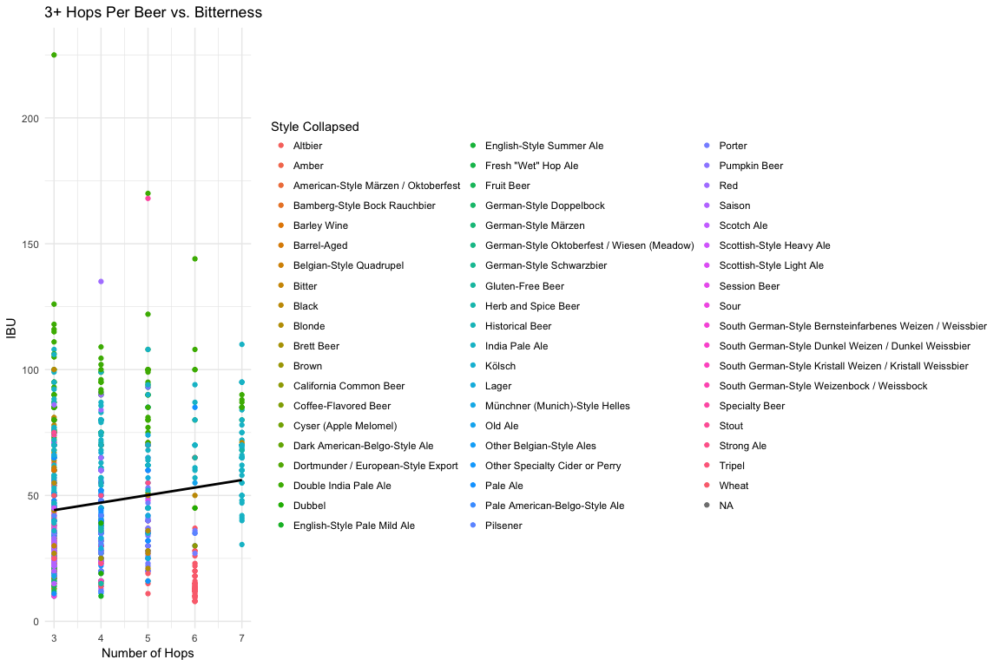
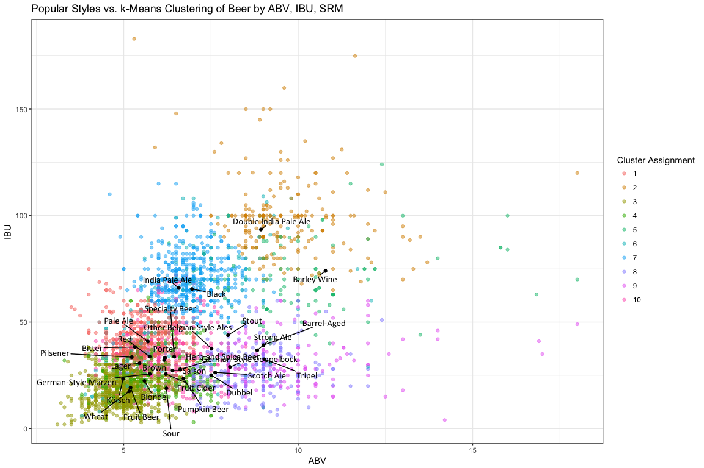
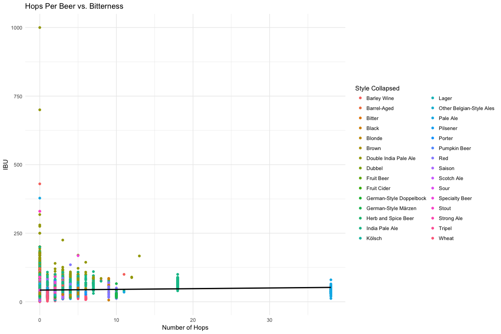
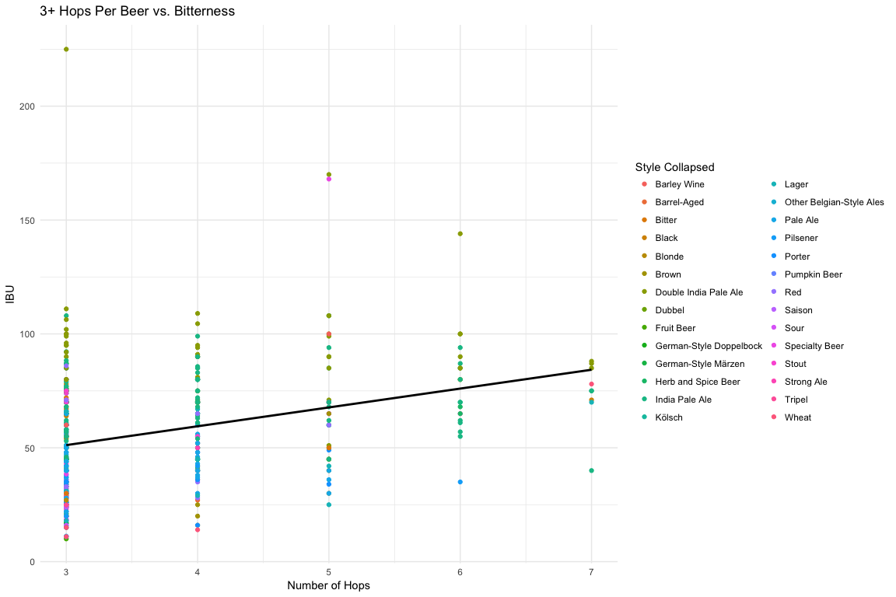
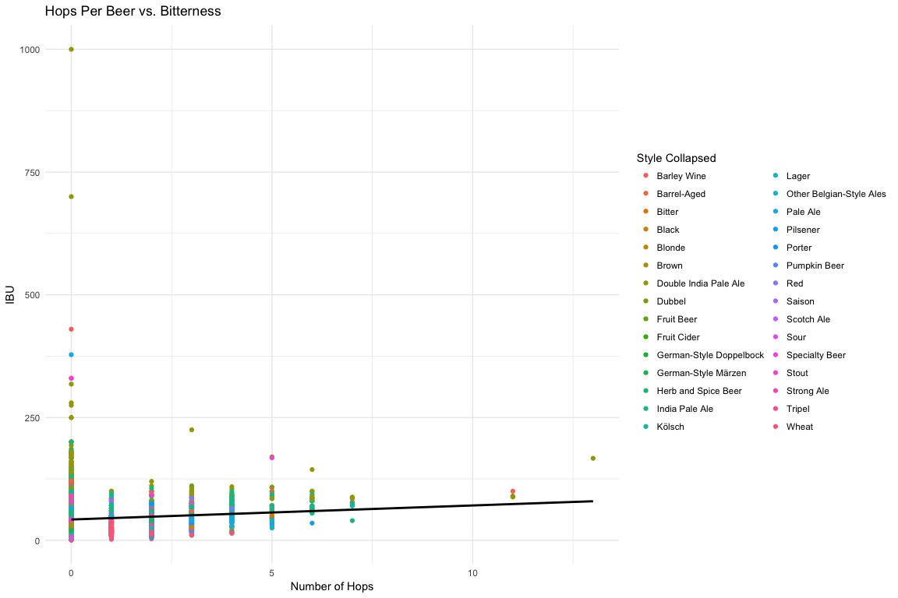

# Data Science Musings on Beer
`r format(Sys.time(), "%B %d, %Y")`  


```r
source("./read_from_db.R")
```


This is a first pass exploration of different aspects of beer. The data was collected via the [BreweryDB](http://www.brewerydb.com/developers) API. Special thanks to [Kris Kroski](https://kro.ski/) for data ideation and co-membership in the honourable workplace beer consortium.

The main question this analysis is meant to tackle is: Are beer styles actually indicative of shared attributes of the beers within that style? Or are style boundaries more or less arbitrary? I took two approaches to this: unsupervised clustering and supervised prediction. 

Clusters defined by the algorithm were compared to the style "centers" as defined by the mean ABV, IBU, and SRM. On the prediction side, predictor variables for include ABV (alcohol by volume), IBU (international bitterness units), SRM ([a measure of color](http://www.twobeerdudes.com/beer/srm)) as well as ingredients like hops and malts. The outcome variable is the style that beer was assigned.

This document starts off with an explanation of how I sourced beer data from BreweryDB, cleaned that data, and stuck the parts of it I wanted in a database. (These are just the highlights; the code actually executed in this document queries that database, specifically by sourcing the file `read_from_db.R`, also in this repo, rather than hitting the BreweryDB API. This is done for expediency's sake as the code below detailing how to actually get the beer data, run in full in `run_it.R`, takes some time to execute.)

It then moves into clustering (k-means) and prediction (neural net, random forest).
        
The answer thus far seems to be that the beer landscape is more of a spectrum than a collection of neatly differentiated styles. Beer-intrinsic attributes like bitterness aren't great predictors of style. The relative importance of different variables depeends on the prediction method used. However, one style-defined attribute, the glass a beer is served in, increased the accuracy of prediction substantially.

Of course, other important aspects of the flavor, body, smell, etc. of the beers could not be considered because this data is not available from BreweryDB.


### Workflow Overview

**Get and Prepare**

When we first hit the BreweryDB API to iteratively pull in all beers and their ingredients along with other things we might want like breweries and glassware. Then we unnest the JSON responses, including all the ingredients columns, and dump this all into a MySQL database.

Next, we create a `style_collapsed` column to reduce the number of levels of our outcome variable. We do this by `grep`ing through each beer's style to determine if that style contains a keyword that qualifies it to be rolled into a collapsed style; if it does, it gets that keyword in a `style_collapsed` column.

Finally we unnest the ingredients `hops` and `malts` into a wide, sparse dataframe. Individual ingredients are now columns, with each beer still in its own rows; a cell gets a 1 if ingredient is present and 0 otherwise. This allows more granual inference into ingredients' effects on both style and bitterness (occasioning a short foray into hops).

**Short foray into hops**

A quick look at the most popular hops and an exploration of the relationship between hops and bitterness.


**Infer**

Cluster: unsupervised k-means clustering partitioning the entire dataset into ten clusters. Next, we cluster on a dataset composed of just five selected styles into five clusters. 

We then attempt to predict predict either `style` or `style_collapsed` using a neural net and a random forest. The main predictors are ABV, IBU, SRM, total number of hops, and total number of malts. The glass a beer is served in is also considered. Finally, 

***

**Short Aside**

The question of what should be a predictor variable for style is a bit murky here. What should be fair game for predicting style and what shouldn't? Characteristics of a beer that are defined *by* its style would seem to be "cheating" in a way. The only "inputs" to a beer we have in our dataset are its ingredients, primarly hops and malts. While these certainly have an effect on its flavor profile, I consider them semi-cheating because if style is determined beforehand it likely determines at least in part which ingredients are added. The main candidates in my mind are ABV, IBU, and SRM. These are "outputs" of a beer (in the sense that they can only be exactly determined once a beer is brewered) that meaningfully define it. While correlated ABV is correlated with both IBU and SRM, the three are theoretically orthogonal to each other. A style-defined attribute like glass type is a bad candidate for a predictor variable because it is completely decoupled from the beer itself and determined entirely by the style the beer has been assigned to.


### Get and Prepare Data

**Getting beer, the age-old dilemma**

* The BreweryDB API returns a certain number of results per page; if we want 
* So, we hit the BreweryDB API and ask for `1:number_of_pages`
    * We can change `number_of_pages` to, e.g., 3 if we only want the first 3 pages
    * If there's only one page (as is the case for the glassware endpoint), numberOfPages won't be returned, so in this case we set number_of_pages to 1
* The `addition` parameter can be an empty string if nothing else is needed


```r
base_url <- "http://api.brewerydb.com/v2"
key_preface <- "/?key="

paginated_request <- function(ep, addition, trace_progress = TRUE) {    
  full_request <- NULL
  first_page <- fromJSON(paste0(base_url, "/", ep, "/", key_preface, key
                                , "&p=1"))
  number_of_pages <- ifelse(!(is.null(first_page$numberOfPages)), 
                            first_page$numberOfPages, 1)      

    for (page in 1:number_of_pages) {                               
    this_request <- fromJSON(paste0(base_url, "/", ep, "/", key_preface, key
                                    , "&p=", page, addition),
                             flatten = TRUE) 
    this_req_unnested <- unnest_it(this_request)    #  <- request unnested here
    if(trace_progress == TRUE) {message(paste0("Page ", this_req_unnested$currentPage))}
    full_request <- bind_rows(full_request, this_req_unnested[["data"]])
  }
  return(full_request)
} 

all_beer_raw <- paginated_request("beers", "&withIngredients=Y")
```


* Function for unnesting JSON used inside `paginated_request()` below
    + Takes the column named `name` nested within a column in the data portion of the response
        + If the `name` column doesn't exist, it takes the first nested column
* We use something similar to unnest ingredient like all of a beer's hops and malts into a long string contained in `hops_name` and `malt_name`


```r
unnest_it <- function(df) {
  unnested <- df
  for(col in seq_along(df[["data"]])) {
    if(! is.null(ncol(df[["data"]][[col]]))) {
      if(! is.null(df[["data"]][[col]][["name"]])) {
        unnested[["data"]][[col]] <- df[["data"]][[col]][["name"]]
      } else {
        unnested[["data"]][[col]] <- df[["data"]][[col]][[1]]
      }
    }
  }
  return(unnested)
}
```


**Collapse Styles**

* Save the most popular styles in `keywords`
* Loop through each keyword
    * For each beer, `grep` through its style column to see if it contains any one of these keywords
    * If it does, give it that keyword in a new column `style_collapsed`
* If a beer's name matches multiple keywords, e.g., American Double India Pale Ale would match Double India Pale Ale, India Pale Ale, and Pale Ale, its `style_collapsed` is the **last** of those that appear in keywords 
    * This is why keywords are intentionally ordered from most general to most specific
    * So in the case of an case of American Double India Pale Ale: since Double India Pale Ale appears in `keywords` after India Pale Ale and Pale Ale, an American Double India Pale Ale would get a `style_collapsed` of Double India Pale Ale
* If no keyword is contained in `style`, `style_collapsed` is just whatever's in `style`; in other words, it doesn't get collpsed into a bigger bucket
    * This isn't a huge problem because we'll pare down to just the most popular styles later, however we could think about creating a catchall "Other" level for `style_collapsed`


```r
keywords <- c("Lager", "Pale Ale", "India Pale Ale", "Double India Pale Ale", "India Pale Lager", "Hefeweizen", "Barrel-Aged","Wheat", "Pilsner", "Pilsener", "Amber", "Golden", "Blonde", "Brown", "Black", "Stout", "Porter", "Red", "Sour", "Kölsch", "Tripel", "Bitter", "Saison", "Strong Ale", "Barley Wine", "Dubbel", "Altbier")

collapse_styles <- function(df, trace_progress = TRUE) {
  
  df[["style_collapsed"]] <- vector(length = nrow(df))
  
  for (beer in 1:nrow(df)) {
    if (grepl(paste(keywords, collapse="|"), df$style[beer])) {    
      for (keyword in keywords) {         
        if(grepl(keyword, df$style[beer]) == TRUE) {
          df$style_collapsed[beer] <- keyword    
        }                         
      } 
    } else {
      df$style_collapsed[beer] <- as.character(df$style[beer])       
    }
    if(trace_progress == TRUE) {message(paste0("Collapsing this ", df$style[beer], " to: ", df$style_collapsed[beer]))}
  }
  return(df)
}
```

* Then we collapse further; right now we just combine all wheaty bears into Wheat and Pils-like beers into Pilsener (with two e's) by `fct_collapse`ing those levels


```r
collapse_further <- function(df) {
  df[["style_collapsed"]] <- df[["style_collapsed"]] %>%
    fct_collapse(
      "Wheat" = c("Hefeweizen", "Wheat"),
      "Pilsener" = c("Pilsner", "American-Style Pilsener") # pilsener == pilsner == pils
    )
  return(df)
}
```


**Split out Ingredients**

When we unnested ingredients, we just concatenated all of the ingredients for a given beer into a long string. If we want, we can split out the ingredients that were concatenated in `<ingredient>_name` with this `split_ingredients` function.

This takes a vector of `ingredients_to_split`, so e.g. `c("hops_name", "malt_name")` and creates one column for each type of ingredient (`hops_name_1`, `hops_name_2`, etc.). It's flexible enough to adapt if data in BreweryDB changes and a beer now has 15 hops where before the maximum number of hops a beer had was 10.


```r
split_ingredients <- function(df, ingredients_to_split) {
  
  ncol_df <- ncol(df)
  
  for (ingredient in ingredients_to_split) {

    ingredient_split <- str_split(df[[ingredient]], ", ")    
    num_new_cols <- max(lengths(ingredient_split))    
  
    for (num in 1:num_new_cols) {
      
      this_col <- ncol_df + 1         
      
      df[, this_col] <- NA
      names(df)[this_col] <- paste0(ingredient, "_", num)
      ncol_df <- ncol(df)             
      for (row in seq_along(ingredient_split)) {          
        if (!is.null(ingredient_split[[row]][num])) {        
          df[row, this_col] <- ingredient_split[[row]][num]
        }
      }
      df[[names(df)[this_col]]] <- factor(df[[names(df)[this_col]]])
    }
    
    ncol_df <- ncol(df)
  }
  return(df)
}
```


Some quick summary stats on our main dataframe called `beer_necessities`:

```r
dim(beer_necessities)
```

```
## [1] 63495    39
```

```r
str(beer_necessities)
```

```
## 'data.frame':	63495 obs. of  39 variables:
##  $ id              : chr  "cBLTUw" "ZsQEJt" "tmEthz" "b7SfHG" ...
##  $ name            : chr  "\"18\" Imperial IPA 2" "\"633\" American Pale Ale" "\"Admiral\" Stache" "\"Ah Me Joy\" Porter" ...
##  $ description     : chr  "Hop Heads this one's for you!  Checking in with 143 IBU's this ale punches you in the mouth with extreme bitterness then rounds"| __truncated__ "Our first beer has been aptly named \"633\" after the Regions telephone exchange for starters.  \"If I could call a beer home, "| __truncated__ "Milwaukee Brewing Co’s take on a classic European style. Baltic Porters are the stronger lager fermented cousin of the classic "| __truncated__ "A robust porter style ale with a twist. This beer has moderate roastiness with a bitter finish, complemented by the sweetness o"| __truncated__ ...
##  $ style           : Factor w/ 170 levels "Adambier","Aged Beer (Ale or Lager)",..: 13 20 30 139 23 108 8 20 7 54 ...
##  $ abv             : num  11.1 6.33 7 5.4 4.8 4.6 8.5 5.8 7.6 10.8 ...
##  $ ibu             : num  NA 25 23 51 12 NA 30 51 80 70 ...
##  $ srm             : num  33 NA 37 40 NA 5 NA 8 NA NA ...
##  $ glass           : Factor w/ 12 levels "Flute","Goblet",..: 6 NA 6 NA NA NA NA NA NA NA ...
##  $ hops_name       : Factor w/ 969 levels "","#06300","Admiral, Aurora, Challenger, Fuggle (American), Target",..: NA NA 902 NA NA NA NA NA NA NA ...
##  $ hops_id         : Factor w/ 969 levels "","1, 22, 23, 25, 146",..: NA NA 955 NA NA NA NA NA NA NA ...
##  $ malt_name       : Factor w/ 923 levels "","Abbey Malt",..: NA NA 143 NA NA NA NA NA NA NA ...
##  $ malt_id         : Factor w/ 923 levels "","165","165, 1947, 633, 1922",..: NA NA 124 NA NA NA NA NA NA NA ...
##  $ glasswareId     : num  5 NA 5 NA NA NA NA NA NA NA ...
##  $ styleId         : Factor w/ 170 levels "1","10","100",..: 109 89 7 82 106 101 102 89 107 68 ...
##  $ style.categoryId: num  3 3 9 1 3 3 3 3 3 1 ...
##  $ style_collapsed : Factor w/ 108 levels "Adambier","Altbier",..: 101 81 84 84 95 21 24 81 20 101 ...
##  $ hops_name_1     : Factor w/ 113 levels "","#06300","Admiral",..: NA NA 90 NA NA NA NA NA NA NA ...
##  $ hops_name_2     : Factor w/ 98 levels "Amarillo","Apollo",..: NA NA 70 NA NA NA NA NA NA NA ...
##  $ hops_name_3     : Factor w/ 90 levels "Amarillo","Aramis",..: NA NA NA NA NA NA NA NA NA NA ...
##  $ hops_name_4     : Factor w/ 63 levels "Amarillo","Apollo",..: NA NA NA NA NA NA NA NA NA NA ...
##  $ hops_name_5     : Factor w/ 50 levels "Australian Dr. Rudi",..: NA NA NA NA NA NA NA NA NA NA ...
##  $ hops_name_6     : Factor w/ 29 levels "Cascade","Columbus",..: NA NA NA NA NA NA NA NA NA NA ...
##  $ hops_name_7     : Factor w/ 20 levels "Azzeca","Crystal",..: NA NA NA NA NA NA NA NA NA NA ...
##  $ hops_name_8     : Factor w/ 10 levels "Equinox","Experimental 06277",..: NA NA NA NA NA NA NA NA NA NA ...
##  $ hops_name_9     : Factor w/ 4 levels "Motueka","Nugget",..: NA NA NA NA NA NA NA NA NA NA ...
##  $ hops_name_10    : Factor w/ 4 levels "Nelson Sauvin",..: NA NA NA NA NA NA NA NA NA NA ...
##  $ hops_name_11    : Factor w/ 4 levels "Simcoe","Styrian Bobeks",..: NA NA NA NA NA NA NA NA NA NA ...
##  $ hops_name_12    : Factor w/ 3 levels "Summit","Super Galena",..: NA NA NA NA NA NA NA NA NA NA ...
##  $ hops_name_13    : Factor w/ 2 levels "Target","Willamette": NA NA NA NA NA NA NA NA NA NA ...
##  $ malt_name_1     : Factor w/ 128 levels "","Abbey Malt",..: NA NA 9 NA NA NA NA NA NA NA ...
##  $ malt_name_2     : Factor w/ 134 levels "Amber Malt","Barley - Flaked",..: NA NA 64 NA NA NA NA NA NA NA ...
##  $ malt_name_3     : Factor w/ 122 levels "Acidulated Malt",..: NA NA 73 NA NA NA NA NA NA NA ...
##  $ malt_name_4     : Factor w/ 94 levels "Bamberg Smoked Malt",..: NA NA 52 NA NA NA NA NA NA NA ...
##  $ malt_name_5     : Factor w/ 62 levels "Asheburne Mild Malt",..: NA NA NA NA NA NA NA NA NA NA ...
##  $ malt_name_6     : Factor w/ 41 levels "Aromatic Malt",..: NA NA NA NA NA NA NA NA NA NA ...
##  $ malt_name_7     : Factor w/ 19 levels "Barley - Roasted",..: NA NA NA NA NA NA NA NA NA NA ...
##  $ malt_name_8     : Factor w/ 15 levels "Crisp 120","Crisp 77",..: NA NA NA NA NA NA NA NA NA NA ...
##  $ malt_name_9     : Factor w/ 6 levels "Rye Malt","Smoked Malt",..: NA NA NA NA NA NA NA NA NA NA ...
##  $ malt_name_10    : Factor w/ 1 level "Victory Malt": NA NA NA NA NA NA NA NA NA NA ...
```


**Find the Most Popualar Styles**

We find mean ABV, IBU, and SRM per collapsed style and arrange collapsed styles by the number of beers that fall into them. (This is of course dependent on how we collapse styles; if we looped all Double IPAs in with IPAs then the category IPA would be much bigger than it is if we keep the two separate.)


```r
library(forcats)

# Pare down to only cases where style is not NA
beer_dat_pared <- beer_necessities[complete.cases(beer_necessities$style), ]

# Arrange beer dat by style popularity
style_popularity <- beer_dat_pared %>% 
  group_by(style) %>% 
  count() %>% 
  arrange(desc(n))

# Add a column that scales popularity
style_popularity <- bind_cols(style_popularity, 
                               n_scaled = as.vector(scale(style_popularity$n)))

# Find styles that are above a z-score of 0
popular_styles <- style_popularity %>% 
  filter(n_scaled > 0)

# Pare dat down to only beers that fall into those styles
popular_beer_dat <- beer_dat_pared %>% 
  filter(
    style %in% popular_styles$style
  ) %>% 
  droplevels() %>% 
  as_tibble() 
```


How many rows do we have in our dataset of just beers that fall into the popular styles?

```r
nrow(popular_beer_dat)
```

```
## [1] 45871
```


Now we find the style centers.

```r
# Find the centers (mean abv, ibu, srm) of the most popular styles
style_centers <- popular_beer_dat %>% 
  group_by(style_collapsed) %>% 
  add_count() %>% 
  summarise(
    mean_abv = mean(abv, na.rm = TRUE),
    mean_ibu = mean(ibu, na.rm = TRUE), 
    mean_srm = mean(srm, na.rm = TRUE),
    n = median(n, na.rm = TRUE)          # Median here only for summarise. Should be just the same as n
  ) %>% 
  arrange(desc(n)) %>% 
  drop_na() %>% 
  droplevels()

# Give some nicer names
style_centers_rename <- style_centers %>% 
  rename(
    `Collapsed Style` = style_collapsed,
    `Mean ABV` = mean_abv,
    `Mean IBU` = mean_ibu,
    `Mean SRM` = mean_srm,
    `Numer of Beers` = n
  )
```


Take a look at the table, ordered by number of beers in that style, descending.      


|Collapsed Style          |  Mean ABV| Mean IBU|  Mean SRM| Numer of Beers|
|:------------------------|---------:|--------:|---------:|--------------:|
|India Pale Ale           |  6.578468| 66.04268|  9.989313|           6524|
|Pale Ale                 |  5.695480| 40.86930|  8.890306|           4280|
|Stout                    |  7.991841| 43.89729| 36.300000|           4238|
|Wheat                    |  5.158040| 17.47168|  5.861842|           3349|
|Double India Pale Ale    |  8.930599| 93.48142| 11.006873|           2525|
|Red                      |  5.742565| 33.81127| 16.178862|           2521|
|Lager                    |  5.453718| 30.64361|  8.457447|           2230|
|Saison                   |  6.400189| 27.25114|  7.053476|           2167|
|Blonde                   |  5.595298| 22.39432|  5.625000|           2044|
|Porter                   |  6.182049| 33.25369| 32.197605|           1973|
|Brown                    |  6.159212| 32.21577| 23.592000|           1462|
|Pilsener                 |  5.227593| 33.51346|  4.413462|           1268|
|Specialty Beer           |  6.446402| 33.77676| 15.520548|           1044|
|Bitter                   |  5.322364| 38.28175| 12.460526|            939|
|Fruit Beer               |  5.195222| 19.24049|  8.666667|            905|
|Herb and Spice Beer      |  6.621446| 27.77342| 18.166667|            872|
|Sour                     |  6.224316| 18.88869| 10.040816|            797|
|Strong Ale               |  8.826425| 36.74233| 22.547945|            767|
|Tripel                   |  9.029775| 32.51500|  7.680556|            734|
|Black                    |  6.958714| 65.50831| 31.080000|            622|
|Barley Wine              | 10.781600| 74.04843| 19.561404|            605|
|Kölsch                   |  4.982216| 23.37183|  4.371795|            593|
|Barrel-Aged              |  9.002506| 39.15789| 18.133333|            540|
|Other Belgian-Style Ales |  7.516318| 37.55812| 17.549020|            506|
|Pumpkin Beer             |  6.712839| 23.48359| 17.918033|            458|
|Dubbel                   |  7.509088| 25.05128| 22.940000|            399|
|Scotch Ale               |  7.620233| 26.36909| 24.222222|            393|
|German-Style Doppelbock  |  8.045762| 28.88692| 25.696970|            376|
|Fruit Cider              |  6.205786| 25.60000| 12.000000|            370|
|German-Style Märzen      |  5.746102| 25.63796| 14.322581|            370|


***

### Ingredients

To get more granular with ingredients, we can split out each individual ingredient into its own column. If a beer or style contains that ingredient, its row gets a 1 in that ingredient column and a 0 otherwise.

From this, we can find the total number of hops and malts per grouper.

* The dataframe we'll use will be `beer_necessities`


* This function takes a dataframe and two other parameters set at the outset:
    * `ingredient_want`: this can be `hops`, `malt`, or other ingredients like `yeast` if we pull that in
    * `grouper`: can be a vector of one or more things to group by, like beer `name` or `style`


```r
pick_ingredient_get_beer <- function (ingredient_want, df, grouper) {
  
  # ----------------------- Setup --------------------------- #
  # We've already split ingredient number names out from the concatenated string into columns like `malt_name_1`,
  # `malt_name_2`, etc. We need to find the range of these columns; there will be a different number of malt
  # columns than hops columns, for instance. The first one will be `<ingredient>_name_1` and from this we can find
  # the index of this column in our dataframe. We get the name of last one with the `get_last_ing_name_col()`
  # function. Then we save a vector of all the ingredient column names in `ingredient_colnames`. It will stay
  # constant even if the indices change when we select out certain columns. 
  
  # First ingredient
  first_ingredient_name <- paste(ingredient_want, "_name_1", sep="")
  first_ingredient_index <- which(colnames(df)==first_ingredient_name)
  
  # Get the last ingredient
  get_last_ing_name_col <- function(df) {
    for (col in names(df)) {
      if (grepl(paste(ingredient_want, "_name_", sep = ""), col) == TRUE) {
        name_last_ing_col <- col
      }
    }
    return(name_last_ing_col)
  }
  
  # Last ingredient
  last_ingredient_name <- get_last_ing_name_col(df)
  last_ingredient_index <- which(colnames(df)==last_ingredient_name)
  
  # Vector of all the ingredient column names
  ingredient_colnames <- names(df)[first_ingredient_index:last_ingredient_index]
  
  # Non-ingredient column names we want to keep
  to_keep_col_names <- c("id", "cluster_assignment", "name", "abv", "ibu", "srm", "style", "style_collapsed")
  
  # -------------------------------------------------------------------------------# 
  
  # Inside `gather_ingredients()` we take out superflous column names that are not in `to_keep_col_names` or one 
  # of the ingredient columns, find what the new ingredient column indices are, since they'll have changed after 
  # we pared down and then gather all of the ingredient columns (e.g., `hops_name_1`) into one long column, 
  # `ing_keys` and all the actual ingredient names (e.g., Cascade) into `ing_names`.
  
  # ----------------------------- Gather columns --------------------------------- #
  gather_ingredients <- function(df, cols_to_gather) {
    to_keep_indices <- which(colnames(df) %in% to_keep_col_names)
    
    selected_df <- df[, c(to_keep_indices, first_ingredient_index:last_ingredient_index)]
    
    new_ing_indices <- which(colnames(selected_df) %in% cols_to_gather)    # indices will have changed since we pared down 
    
    df_gathered <- selected_df %>%
      gather_(
        key_col = "ing_keys",
        value_col = "ing_names",
        gather_cols = colnames(selected_df)[new_ing_indices]
      ) %>%
      mutate(
        count = 1
      )
    return(df_gathered)
  }
  beer_gathered <- gather_ingredients(df, ingredient_colnames)  # ingredient colnames defined above function
  # ------------------------------------------------------------------------------- # 
  
  # Next we get a vector of all ingredient levels and take out the one that's an empty string and 
  # use this vector of ingredient levels in `select_spread_cols()` below

  # Get a vector of all ingredient levels
  beer_gathered$ing_names <- factor(beer_gathered$ing_names)
  ingredient_levels <- levels(beer_gathered$ing_names) 
  
  # Take out the level that's just an empty string
  to_keep_levels <- !(c(1:length(ingredient_levels)) %in% which(ingredient_levels == ""))
  ingredient_levels <- ingredient_levels[to_keep_levels]
  
  beer_gathered$ing_names <- as.character(beer_gathered$ing_names)
  
  # ----------------------------------------------------------------------------- # 
  
  # Then we spread the ingredient names: we take what was previously the `value` in our gathered dataframe, the
  # actual ingredient names (Cascade, Centennial) and make that our `key`; it'll form the new column names. The
  # new `value` is `value` is count; it'll populate the row cells. If a given row has a certain ingredient, it
  # gets a 1 in the corresponding cell, an NA otherwise. 
  # We add a unique idenfitier for each row with `row`, which we'll drop later (see [Hadley's SO
  # comment](https://stackoverflow.com/questions/25960394/unexpected-behavior-with-tidyr)).

  
  # ------------------------------- Spread columns -------------------------------- #
  spread_ingredients <- function(df) {
    df_spread <- df %>% 
      mutate(
        row = 1:nrow(df)        # Add a unique idenfitier for each row which we'll need in order to spread; we'll drop this later
      ) %>%                                 
      spread(
        key = ing_names,
        value = count
      ) 
    return(df_spread)
  }
  beer_spread <- spread_ingredients(beer_gathered)
  # ------------------------------------------------------------------------------- # 

  
  # ------------------------- Select only certain columns ------------------------- #
  select_spread_cols <- function(df) {
    to_keep_col_indices <- which(colnames(df) %in% to_keep_col_names)
    to_keep_ingredient_indices <- which(colnames(df) %in% ingredient_levels)
    
    to_keep_inds_all <- c(to_keep_col_indices, to_keep_ingredient_indices)
    
    new_df <- df %>% 
      select_(
        .dots = to_keep_inds_all
      )
    return(new_df)
  }
  beer_spread_selected <- select_spread_cols(beer_spread)
  # ------------------------------------------------------------------------------- # 

  # Take out all rows that have no ingredients specified at all
  inds_to_remove <- apply(beer_spread_selected[, first_ingredient_index:last_ingredient_index], 
                          1, function(x) all(is.na(x)))
  beer_spread_no_na <- beer_spread_selected[ !inds_to_remove, ]
  
  
  # ----------------- Group ingredients by the grouper specified ------------------- #
  # Then we do the final step and group by the groupers.
  
  get_ingredients_per_grouper <- function(df, grouper = grouper) {
    df_grouped <- df %>%
      ungroup() %>% 
      group_by_(grouper)
    
    not_for_summing <- which(colnames(df_grouped) %in% to_keep_col_names)
    max_not_for_summing <- max(not_for_summing)
    
    browser()
    per_grouper <- df_grouped %>% 
      select(-c(abv, ibu, srm)) %>%    # taking out temporarily
      summarise_if(
        is.numeric,              
        sum, na.rm = TRUE
        # -c(abv, ibu, srm)
      ) %>%
      mutate(
        total = rowSums(.[(max_not_for_summing + 1):ncol(.)], na.rm = TRUE)    
      )
    
    # Send total to the second position
    per_grouper <- per_grouper %>% 
      select(
        id, total, everything()
      )
    
    # Replace total column with more descriptive name: total_<ingredient>
    names(per_grouper)[which(names(per_grouper) == "total")] <- paste0("total_", ingredient_want)
    
    return(per_grouper)
  }
  # ------------------------------------------------------------------------------- # 
  
  ingredients_per_grouper <- get_ingredients_per_grouper(beer_spread_selected, grouper)
  return(ingredients_per_grouper)
}
```


* Now run the function with `ingredient_want` as first hops, then malt
* Then join the resulting dataframes and remove/reorder some columns


```r
# Run the entire function with ingredient_want set to hops, grouping by name
ingredients_per_beer_hops <- pick_ingredient_get_beer(ingredient_want = "hops", 
                                                      beer_necessities, 
                                                      grouper = c("id"))
```

```
## Called from: get_ingredients_per_grouper(beer_spread_selected, grouper)
## debug at <text>#138: per_grouper <- df_grouped %>% select(-c(abv, ibu, srm)) %>% summarise_if(is.numeric, 
##     sum, na.rm = TRUE) %>% mutate(total = rowSums(.[(max_not_for_summing + 
##     1):ncol(.)], na.rm = TRUE))
## debug at <text>#150: per_grouper <- per_grouper %>% select(id, total, everything())
## debug at <text>#156: names(per_grouper)[which(names(per_grouper) == "total")] <- paste0("total_", 
##     ingredient_want)
## debug at <text>#158: return(per_grouper)
```

```r
# Same for malt
ingredients_per_beer_malt <- pick_ingredient_get_beer(ingredient_want = "malt", 
                                                      beer_necessities, 
                                                      grouper = c("id"))
```

```
## Called from: get_ingredients_per_grouper(beer_spread_selected, grouper)
## debug at <text>#138: per_grouper <- df_grouped %>% select(-c(abv, ibu, srm)) %>% summarise_if(is.numeric, 
##     sum, na.rm = TRUE) %>% mutate(total = rowSums(.[(max_not_for_summing + 
##     1):ncol(.)], na.rm = TRUE))
## debug at <text>#150: per_grouper <- per_grouper %>% select(id, total, everything())
## debug at <text>#156: names(per_grouper)[which(names(per_grouper) == "total")] <- paste0("total_", 
##     ingredient_want)
## debug at <text>#158: return(per_grouper)
```

```r
# Join those on our original dataframe by name
beer_ingredients_join_first_ingredient <- left_join(beer_necessities, ingredients_per_beer_hops,
                                                    by = "id")
beer_ingredients_join <- left_join(beer_ingredients_join_first_ingredient, ingredients_per_beer_malt,
                                   by = "id")


# Take out some unnecessary columns
unnecessary_cols <- c("styleId", "abv_scaled", "ibu_scaled", "srm_scaled", 
                      "hops_id", "malt_id", "glasswareId", "style.categoryId")
beer_ingredients_join <- beer_ingredients_join[, (! names(beer_ingredients_join) %in% unnecessary_cols)]


# If we also want to take out any of the malt_name_1, malt_name_2, etc. columns we can do this with a grep
more_unnecessary <- c("hops_name_|malt_name_")
beer_ingredients_join <- 
  beer_ingredients_join[, (! grepl(more_unnecessary, names(beer_ingredients_join)) == TRUE)]

# Reorder columns a bit
beer_ingredients_join_all <- beer_ingredients_join %>% 
  select(
    id, name, total_hops, total_malt, everything(), -description
  )

# Keep only beers that fall into a style_collapsed bucket
# Not filtering by levels in beer_necessities$style_collapsed because those levels contain more than what's in just the keywords of collapse_styles()
beer_ingredients_join <- beer_ingredients_join_all %>% 
  filter(
    style_collapsed %in% levels(style_centers$style_collapsed)
  ) %>% 
  droplevels()

# And get a df that includes total_hops and total_malt but not all the other ingredient columns
beer_totals_all <- beer_ingredients_join_all %>% 
  select(
    id, name, total_hops, total_malt, style, style_collapsed,
    abv, ibu, srm, glass, hops_name, malt_name
  )

# And just style_collapsed
beer_totals <- beer_ingredients_join %>% 
  filter(
    style_collapsed %in% levels(style_centers$style_collapsed)
  ) %>% 
  droplevels()
```


Now we're left with something of a sparse matrix of all the ingredients compared to all the beers

|id     |name                                                         | total_hops| total_malt|style                                   |   abv|  ibu| srm|glass |hops_name                         |malt_name                                                   |style_collapsed | #06300| Admiral| Aged / Debittered Hops (Lambic)| Ahtanum| Alchemy| Amarillo| Amarillo Gold| Apollo| Aquila| Aramis| Argentine Cascade| Athanum| Aurora| Australian Dr. Rudi| Azacca| Azzeca| Belma| Bobek| Bramling Cross| Bravo| Brewer's Gold| Brewer's Gold (American)| Calypso| Cascade| Celeia| Centennial| Challenger| Chinook| Citra| Cluster| Cobb| Columbus| Columbus (Tomahawk)| Comet| Crystal| CTZ| Delta| East Kent Golding| El Dorado| Ella| Enigma| Equinox| Eureka| Experimental 05256| Experimental 06277| Falconer's Flight| First Gold| French Strisserspalt| French Triskel| Fuggle (American)| Fuggle (English)| Fuggles| Galaxy| Galena| German Magnum| German Mandarina Bavaria| German Opal| German Perle| German Polaris| German Select| German Tradition| Glacier| Golding (American)| Green Bullet| Hallertau Hallertauer Mittelfrüher| Hallertau Hallertauer Tradition| Hallertau Northern Brewer| Hallertauer (American)| Hallertauer Herkules| Hallertauer Hersbrucker| Hallertauer Perle| Hallertauer Select| Helga| Hop Extract| Hops| Horizon| Huell Melon| Idaho 7| Jarrylo| Kent Goldings| Kohatu| Lemon Drop| Liberty| Magnum| Marynka| Meridian| Millenium| Mosaic| Motueka| Mount Hood| Mt. Rainier| Nelson Sauvin| New Zealand Hallertauer| New Zealand Motueka| New Zealand Sauvin| Newport| Noble| Northdown| Northern Brewer (American)| Nugget| Orbit| Pacific Gem| Pacific Jade| Pacifica| Palisades| Perle (American)| Phoenix| Pilgrim| Premiant| Pride of Ringwood| Rakau| Revolution| Saaz (American)| Saaz (Czech)| Santiam| Saphir (German Organic)| Simcoe| Sladek (Saaz)| Sorachi Ace| Southern Cross| Sovereign| Spalt| Spalt Select| Spalt Spalter| Sterling| Sticklebract| Strisselspalt| Styrian Aurora| Styrian Bobeks| Styrian Goldings| Summit| Super Galena| Target| Tettnang Tettnanger| Tettnanger (American)| Tomahawk| Topaz| Tradition| Ultra| Vanguard| Vic Secret| Waimea| Wakatu| Warrior| Willamette| Yakima Willamette| Zeus| Zythos| Abbey Malt| Acidulated Malt| Amber Malt| Aromatic Malt| Asheburne Mild Malt| Bamberg Smoked Malt| Barley - Black| Barley - Flaked| Barley - Lightly Roasted| Barley - Malted| Barley - Raw| Barley - Roasted| Barley - Roasted/De-husked| Beechwood Smoked| Belgian Pale| Belgian Pilsner| Biscuit Malt| Black Malt| Black Malt - Debittered| Black Malt - Organic| Black Patent| Black Roast| Blackprinz Malt| Blue Agave Nectar| Blue Corn| Bonlander| Briess 2-row Chocolate Malt| Briess Blackprinz Malt| British Pale Malt| Brown Malt| Brown Sugar| Buckwheat - Roasted| C-15| Canada 2-Row Silo| Cane Sugar| Cara Malt| CaraAmber| CaraAroma| CaraBrown| Carafa I| Carafa II| Carafa III| Carafa Special| CaraFoam| CaraHell| Caramel/Crystal Malt| Caramel/Crystal Malt - Dark| Caramel/Crystal Malt - Extra Dark| Caramel/Crystal Malt - Heritage| Caramel/Crystal Malt - Light| Caramel/Crystal Malt - Medium| Caramel/Crystal Malt - Organic| Caramel/Crystal Malt 10L| Caramel/Crystal Malt 120L| Caramel/Crystal Malt 150L| Caramel/Crystal Malt 15L| Caramel/Crystal Malt 20L| Caramel/Crystal Malt 300L| Caramel/Crystal Malt 30L| Caramel/Crystal Malt 40L| Caramel/Crystal Malt 45L| Caramel/Crystal Malt 50L| Caramel/Crystal Malt 55L| Caramel/Crystal Malt 60L| Caramel/Crystal Malt 70L| Caramel/Crystal Malt 75L| Caramel/Crystal Malt 80L| Caramel/Crystal Malt 85L| Caramel/Crystal Malt 8L| Caramel/Crystal Malt 90L| CaraMunich| CaraMunich 120L| CaraMunich 20L| CaraMunich 40L| CaraMunich 60L| CaraMunich I| CaraMunich II| CaraMunich III| CaraPils/Dextrin Malt| CaraRed| CaraRye| CaraStan| CaraVienne Malt| CaraWheat| Carolina Rye Malt| Cereal| Cherry Smoked| Cherrywood Smoke Malt| Chit Malt| Chocolate Malt| Chocolate Rye Malt| Chocolate Wheat Malt| Coffee Malt| Corn| Corn - Field| Corn - Flaked| Corn Grits| Crisp 120| Crisp 77| Crystal 77| Dark Chocolate| Dememera Sugar| Dextrin Malt| Dextrose Syrup| Extra Special Malt| Fawcett Crystal Rye| Fawcett Rye| German Cologne| Gladfield Pale| Glen Eagle Maris Otter| Golden Promise| Harrington 2-Row Base Malt| High Fructose Corn Syrup| Honey| Honey Malt| Hugh Baird Pale Ale Malt| Kiln Amber| Lactose| Lager Malt| Malt Extract| Malted Rye| Malto Franco-Belge Pils Malt| Maple Syrup| Maris Otter| Melanoidin Malt| Metcalfe| Midnight Wheat| Mild Malt| Millet| Munich Malt| Munich Malt - Dark| Munich Malt - Light| Munich Malt - Organic| Munich Malt - Smoked| Munich Malt - Type I| Munich Malt - Type II| Munich Malt 10L| Munich Malt 20L| Munich Malt 40L| Munich Wheat| Oats - Flaked| Oats - Golden Naked| Oats - Malted| Oats - Rolled| Oats - Steel Cut (Pinhead Oats)| Oats - Toasted| Pale Chocolate Malt| Pale Malt| Pale Malt - Halcyon| Pale Malt - Optic| Pale Malt - Organic| Pale Wheat| Palev| Pearl Malt| Peated Malt - Smoked| Piloncillo| Pilsner Malt| Pilsner Malt - Organic| Rahr 2-Row Malt| Rahr Special Pale| Rauchmalz| Rice| Rice - Flaked| Rice - Hulls| Rice - Red| Rice - White| Roast Malt| Rye - Flaked| Rye Malt| Samuel Adams two-row pale malt blend| Six-Row Pale Malt| Smoked Malt| Special B Malt| Special Roast| Special W Malt| Spelt Malt| Sugar (Albion)| Toasted Malt| Torrefied Wheat| Two-Row Barley Malt| Two-Row Pale Malt| Two-Row Pale Malt - Organic| Two-Row Pale Malt - Toasted| Two-Row Pilsner Malt| Two-Row Pilsner Malt - Belgian| Two-Row Pilsner Malt - Germany| Victory Malt| Vienna Malt| Weyermann Rye| Wheat - Flaked| Wheat - Raw| Wheat - Red| Wheat - Toasted| Wheat - Torrified| Wheat Malt| Wheat Malt - Dark| Wheat Malt - German| Wheat Malt - Light| Wheat Malt - Organic| Wheat Malt - Red| Wheat Malt - Smoked| Wheat Malt - White| White Wheat| Wyermann Vienna|
|:------|:------------------------------------------------------------|----------:|----------:|:---------------------------------------|-----:|----:|---:|:-----|:---------------------------------|:-----------------------------------------------------------|:---------------|------:|-------:|-------------------------------:|-------:|-------:|--------:|-------------:|------:|------:|------:|-----------------:|-------:|------:|-------------------:|------:|------:|-----:|-----:|--------------:|-----:|-------------:|------------------------:|-------:|-------:|------:|----------:|----------:|-------:|-----:|-------:|----:|--------:|-------------------:|-----:|-------:|---:|-----:|-----------------:|---------:|----:|------:|-------:|------:|------------------:|------------------:|-----------------:|----------:|--------------------:|--------------:|-----------------:|----------------:|-------:|------:|------:|-------------:|------------------------:|-----------:|------------:|--------------:|-------------:|----------------:|-------:|------------------:|------------:|----------------------------------:|-------------------------------:|-------------------------:|----------------------:|--------------------:|-----------------------:|-----------------:|------------------:|-----:|-----------:|----:|-------:|-----------:|-------:|-------:|-------------:|------:|----------:|-------:|------:|-------:|--------:|---------:|------:|-------:|----------:|-----------:|-------------:|-----------------------:|-------------------:|------------------:|-------:|-----:|---------:|--------------------------:|------:|-----:|-----------:|------------:|--------:|---------:|----------------:|-------:|-------:|--------:|-----------------:|-----:|----------:|---------------:|------------:|-------:|-----------------------:|------:|-------------:|-----------:|--------------:|---------:|-----:|------------:|-------------:|--------:|------------:|-------------:|--------------:|--------------:|----------------:|------:|------------:|------:|-------------------:|---------------------:|--------:|-----:|---------:|-----:|--------:|----------:|------:|------:|-------:|----------:|-----------------:|----:|------:|----------:|---------------:|----------:|-------------:|-------------------:|-------------------:|--------------:|---------------:|------------------------:|---------------:|------------:|----------------:|--------------------------:|----------------:|------------:|---------------:|------------:|----------:|-----------------------:|--------------------:|------------:|-----------:|---------------:|-----------------:|---------:|---------:|---------------------------:|----------------------:|-----------------:|----------:|-----------:|-------------------:|----:|-----------------:|----------:|---------:|---------:|---------:|---------:|--------:|---------:|----------:|--------------:|--------:|--------:|--------------------:|---------------------------:|---------------------------------:|-------------------------------:|----------------------------:|-----------------------------:|------------------------------:|------------------------:|-------------------------:|-------------------------:|------------------------:|------------------------:|-------------------------:|------------------------:|------------------------:|------------------------:|------------------------:|------------------------:|------------------------:|------------------------:|------------------------:|------------------------:|------------------------:|-----------------------:|------------------------:|----------:|---------------:|--------------:|--------------:|--------------:|------------:|-------------:|--------------:|---------------------:|-------:|-------:|--------:|---------------:|---------:|-----------------:|------:|-------------:|---------------------:|---------:|--------------:|------------------:|--------------------:|-----------:|----:|------------:|-------------:|----------:|---------:|--------:|----------:|--------------:|--------------:|------------:|--------------:|------------------:|-------------------:|-----------:|--------------:|--------------:|----------------------:|--------------:|--------------------------:|------------------------:|-----:|----------:|------------------------:|----------:|-------:|----------:|------------:|----------:|----------------------------:|-----------:|-----------:|---------------:|--------:|--------------:|---------:|------:|-----------:|------------------:|-------------------:|---------------------:|--------------------:|--------------------:|---------------------:|---------------:|---------------:|---------------:|------------:|-------------:|-------------------:|-------------:|-------------:|-------------------------------:|--------------:|-------------------:|---------:|-------------------:|-----------------:|-------------------:|----------:|-----:|----------:|--------------------:|----------:|------------:|----------------------:|---------------:|-----------------:|---------:|----:|-------------:|------------:|----------:|------------:|----------:|------------:|--------:|------------------------------------:|-----------------:|-----------:|--------------:|-------------:|--------------:|----------:|--------------:|------------:|---------------:|-------------------:|-----------------:|---------------------------:|---------------------------:|--------------------:|------------------------------:|------------------------------:|------------:|-----------:|-------------:|--------------:|-----------:|-----------:|---------------:|-----------------:|----------:|-----------------:|-------------------:|------------------:|--------------------:|----------------:|-------------------:|------------------:|-----------:|---------------:|
|cBLTUw |"18" Imperial IPA 2                                          |          0|          0|American-Style Imperial Stout           | 11.10|   NA|  33|Pint  |NA                                |NA                                                          |Stout           |      0|       0|                               0|       0|       0|        0|             0|      0|      0|      0|                 0|       0|      0|                   0|      0|      0|     0|     0|              0|     0|             0|                        0|       0|       0|      0|          0|          0|       0|     0|       0|    0|        0|                   0|     0|       0|   0|     0|                 0|         0|    0|      0|       0|      0|                  0|                  0|                 0|          0|                    0|              0|                 0|                0|       0|      0|      0|             0|                        0|           0|            0|              0|             0|                0|       0|                  0|            0|                                  0|                               0|                         0|                      0|                    0|                       0|                 0|                  0|     0|           0|    0|       0|           0|       0|       0|             0|      0|          0|       0|      0|       0|        0|         0|      0|       0|          0|           0|             0|                       0|                   0|                  0|       0|     0|         0|                          0|      0|     0|           0|            0|        0|         0|                0|       0|       0|        0|                 0|     0|          0|               0|            0|       0|                       0|      0|             0|           0|              0|         0|     0|            0|             0|        0|            0|             0|              0|              0|                0|      0|            0|      0|                   0|                     0|        0|     0|         0|     0|        0|          0|      0|      0|       0|          0|                 0|    0|      0|          0|               0|          0|             0|                   0|                   0|              0|               0|                        0|               0|            0|                0|                          0|                0|            0|               0|            0|          0|                       0|                    0|            0|           0|               0|                 0|         0|         0|                           0|                      0|                 0|          0|           0|                   0|    0|                 0|          0|         0|         0|         0|         0|        0|         0|          0|              0|        0|        0|                    0|                           0|                                 0|                               0|                            0|                             0|                              0|                        0|                         0|                         0|                        0|                        0|                         0|                        0|                        0|                        0|                        0|                        0|                        0|                        0|                        0|                        0|                        0|                       0|                        0|          0|               0|              0|              0|              0|            0|             0|              0|                     0|       0|       0|        0|               0|         0|                 0|      0|             0|                     0|         0|              0|                  0|                    0|           0|    0|            0|             0|          0|         0|        0|          0|              0|              0|            0|              0|                  0|                   0|           0|              0|              0|                      0|              0|                          0|                        0|     0|          0|                        0|          0|       0|          0|            0|          0|                            0|           0|           0|               0|        0|              0|         0|      0|           0|                  0|                   0|                     0|                    0|                    0|                     0|               0|               0|               0|            0|             0|                   0|             0|             0|                               0|              0|                   0|         0|                   0|                 0|                   0|          0|     0|          0|                    0|          0|            0|                      0|               0|                 0|         0|    0|             0|            0|          0|            0|          0|            0|        0|                                    0|                 0|           0|              0|             0|              0|          0|              0|            0|               0|                   0|                 0|                           0|                           0|                    0|                              0|                              0|            0|           0|             0|              0|           0|           0|               0|                 0|          0|                 0|                   0|                  0|                    0|                0|                   0|                  0|           0|               0|
|ZsQEJt |"633" American Pale Ale                                      |          0|          0|American-Style Pale Ale                 |  6.33| 25.0|  NA|NA    |NA                                |NA                                                          |Pale Ale        |      0|       0|                               0|       0|       0|        0|             0|      0|      0|      0|                 0|       0|      0|                   0|      0|      0|     0|     0|              0|     0|             0|                        0|       0|       0|      0|          0|          0|       0|     0|       0|    0|        0|                   0|     0|       0|   0|     0|                 0|         0|    0|      0|       0|      0|                  0|                  0|                 0|          0|                    0|              0|                 0|                0|       0|      0|      0|             0|                        0|           0|            0|              0|             0|                0|       0|                  0|            0|                                  0|                               0|                         0|                      0|                    0|                       0|                 0|                  0|     0|           0|    0|       0|           0|       0|       0|             0|      0|          0|       0|      0|       0|        0|         0|      0|       0|          0|           0|             0|                       0|                   0|                  0|       0|     0|         0|                          0|      0|     0|           0|            0|        0|         0|                0|       0|       0|        0|                 0|     0|          0|               0|            0|       0|                       0|      0|             0|           0|              0|         0|     0|            0|             0|        0|            0|             0|              0|              0|                0|      0|            0|      0|                   0|                     0|        0|     0|         0|     0|        0|          0|      0|      0|       0|          0|                 0|    0|      0|          0|               0|          0|             0|                   0|                   0|              0|               0|                        0|               0|            0|                0|                          0|                0|            0|               0|            0|          0|                       0|                    0|            0|           0|               0|                 0|         0|         0|                           0|                      0|                 0|          0|           0|                   0|    0|                 0|          0|         0|         0|         0|         0|        0|         0|          0|              0|        0|        0|                    0|                           0|                                 0|                               0|                            0|                             0|                              0|                        0|                         0|                         0|                        0|                        0|                         0|                        0|                        0|                        0|                        0|                        0|                        0|                        0|                        0|                        0|                        0|                       0|                        0|          0|               0|              0|              0|              0|            0|             0|              0|                     0|       0|       0|        0|               0|         0|                 0|      0|             0|                     0|         0|              0|                  0|                    0|           0|    0|            0|             0|          0|         0|        0|          0|              0|              0|            0|              0|                  0|                   0|           0|              0|              0|                      0|              0|                          0|                        0|     0|          0|                        0|          0|       0|          0|            0|          0|                            0|           0|           0|               0|        0|              0|         0|      0|           0|                  0|                   0|                     0|                    0|                    0|                     0|               0|               0|               0|            0|             0|                   0|             0|             0|                               0|              0|                   0|         0|                   0|                 0|                   0|          0|     0|          0|                    0|          0|            0|                      0|               0|                 0|         0|    0|             0|            0|          0|            0|          0|            0|        0|                                    0|                 0|           0|              0|             0|              0|          0|              0|            0|               0|                   0|                 0|                           0|                           0|                    0|                              0|                              0|            0|           0|             0|              0|           0|           0|               0|                 0|          0|                 0|                   0|                  0|                    0|                0|                   0|                  0|           0|               0|
|tmEthz |"Admiral" Stache                                             |          2|          4|Baltic-Style Porter                     |  7.00| 23.0|  37|Pint  |Perle (American), Saaz (American) |Barley - Malted, Chocolate Malt, Munich Malt, Oats - Flaked |Porter          |      0|       0|                               0|       0|       0|        0|             0|      0|      0|      0|                 0|       0|      0|                   0|      0|      0|     0|     0|              0|     0|             0|                        0|       0|       0|      0|          0|          0|       0|     0|       0|    0|        0|                   0|     0|       0|   0|     0|                 0|         0|    0|      0|       0|      0|                  0|                  0|                 0|          0|                    0|              0|                 0|                0|       0|      0|      0|             0|                        0|           0|            0|              0|             0|                0|       0|                  0|            0|                                  0|                               0|                         0|                      0|                    0|                       0|                 0|                  0|     0|           0|    0|       0|           0|       0|       0|             0|      0|          0|       0|      0|       0|        0|         0|      0|       0|          0|           0|             0|                       0|                   0|                  0|       0|     0|         0|                          0|      0|     0|           0|            0|        0|         0|                1|       0|       0|        0|                 0|     0|          0|               1|            0|       0|                       0|      0|             0|           0|              0|         0|     0|            0|             0|        0|            0|             0|              0|              0|                0|      0|            0|      0|                   0|                     0|        0|     0|         0|     0|        0|          0|      0|      0|       0|          0|                 0|    0|      0|          0|               0|          0|             0|                   0|                   0|              0|               0|                        0|               1|            0|                0|                          0|                0|            0|               0|            0|          0|                       0|                    0|            0|           0|               0|                 0|         0|         0|                           0|                      0|                 0|          0|           0|                   0|    0|                 0|          0|         0|         0|         0|         0|        0|         0|          0|              0|        0|        0|                    0|                           0|                                 0|                               0|                            0|                             0|                              0|                        0|                         0|                         0|                        0|                        0|                         0|                        0|                        0|                        0|                        0|                        0|                        0|                        0|                        0|                        0|                        0|                       0|                        0|          0|               0|              0|              0|              0|            0|             0|              0|                     0|       0|       0|        0|               0|         0|                 0|      0|             0|                     0|         0|              1|                  0|                    0|           0|    0|            0|             0|          0|         0|        0|          0|              0|              0|            0|              0|                  0|                   0|           0|              0|              0|                      0|              0|                          0|                        0|     0|          0|                        0|          0|       0|          0|            0|          0|                            0|           0|           0|               0|        0|              0|         0|      0|           1|                  0|                   0|                     0|                    0|                    0|                     0|               0|               0|               0|            0|             1|                   0|             0|             0|                               0|              0|                   0|         0|                   0|                 0|                   0|          0|     0|          0|                    0|          0|            0|                      0|               0|                 0|         0|    0|             0|            0|          0|            0|          0|            0|        0|                                    0|                 0|           0|              0|             0|              0|          0|              0|            0|               0|                   0|                 0|                           0|                           0|                    0|                              0|                              0|            0|           0|             0|              0|           0|           0|               0|                 0|          0|                 0|                   0|                  0|                    0|                0|                   0|                  0|           0|               0|
|b7SfHG |"Ah Me Joy" Porter                                           |          0|          0|Robust Porter                           |  5.40| 51.0|  40|NA    |NA                                |NA                                                          |Porter          |      0|       0|                               0|       0|       0|        0|             0|      0|      0|      0|                 0|       0|      0|                   0|      0|      0|     0|     0|              0|     0|             0|                        0|       0|       0|      0|          0|          0|       0|     0|       0|    0|        0|                   0|     0|       0|   0|     0|                 0|         0|    0|      0|       0|      0|                  0|                  0|                 0|          0|                    0|              0|                 0|                0|       0|      0|      0|             0|                        0|           0|            0|              0|             0|                0|       0|                  0|            0|                                  0|                               0|                         0|                      0|                    0|                       0|                 0|                  0|     0|           0|    0|       0|           0|       0|       0|             0|      0|          0|       0|      0|       0|        0|         0|      0|       0|          0|           0|             0|                       0|                   0|                  0|       0|     0|         0|                          0|      0|     0|           0|            0|        0|         0|                0|       0|       0|        0|                 0|     0|          0|               0|            0|       0|                       0|      0|             0|           0|              0|         0|     0|            0|             0|        0|            0|             0|              0|              0|                0|      0|            0|      0|                   0|                     0|        0|     0|         0|     0|        0|          0|      0|      0|       0|          0|                 0|    0|      0|          0|               0|          0|             0|                   0|                   0|              0|               0|                        0|               0|            0|                0|                          0|                0|            0|               0|            0|          0|                       0|                    0|            0|           0|               0|                 0|         0|         0|                           0|                      0|                 0|          0|           0|                   0|    0|                 0|          0|         0|         0|         0|         0|        0|         0|          0|              0|        0|        0|                    0|                           0|                                 0|                               0|                            0|                             0|                              0|                        0|                         0|                         0|                        0|                        0|                         0|                        0|                        0|                        0|                        0|                        0|                        0|                        0|                        0|                        0|                        0|                       0|                        0|          0|               0|              0|              0|              0|            0|             0|              0|                     0|       0|       0|        0|               0|         0|                 0|      0|             0|                     0|         0|              0|                  0|                    0|           0|    0|            0|             0|          0|         0|        0|          0|              0|              0|            0|              0|                  0|                   0|           0|              0|              0|                      0|              0|                          0|                        0|     0|          0|                        0|          0|       0|          0|            0|          0|                            0|           0|           0|               0|        0|              0|         0|      0|           0|                  0|                   0|                     0|                    0|                    0|                     0|               0|               0|               0|            0|             0|                   0|             0|             0|                               0|              0|                   0|         0|                   0|                 0|                   0|          0|     0|          0|                    0|          0|            0|                      0|               0|                 0|         0|    0|             0|            0|          0|            0|          0|            0|        0|                                    0|                 0|           0|              0|             0|              0|          0|              0|            0|               0|                   0|                 0|                           0|                           0|                    0|                              0|                              0|            0|           0|             0|              0|           0|           0|               0|                 0|          0|                 0|                   0|                  0|                    0|                0|                   0|                  0|           0|               0|
|zcJMId |"Alternating Currant" Sour                                   |          0|          0|American-Style Sour Ale                 |  4.80| 12.0|  NA|NA    |NA                                |NA                                                          |Sour            |      0|       0|                               0|       0|       0|        0|             0|      0|      0|      0|                 0|       0|      0|                   0|      0|      0|     0|     0|              0|     0|             0|                        0|       0|       0|      0|          0|          0|       0|     0|       0|    0|        0|                   0|     0|       0|   0|     0|                 0|         0|    0|      0|       0|      0|                  0|                  0|                 0|          0|                    0|              0|                 0|                0|       0|      0|      0|             0|                        0|           0|            0|              0|             0|                0|       0|                  0|            0|                                  0|                               0|                         0|                      0|                    0|                       0|                 0|                  0|     0|           0|    0|       0|           0|       0|       0|             0|      0|          0|       0|      0|       0|        0|         0|      0|       0|          0|           0|             0|                       0|                   0|                  0|       0|     0|         0|                          0|      0|     0|           0|            0|        0|         0|                0|       0|       0|        0|                 0|     0|          0|               0|            0|       0|                       0|      0|             0|           0|              0|         0|     0|            0|             0|        0|            0|             0|              0|              0|                0|      0|            0|      0|                   0|                     0|        0|     0|         0|     0|        0|          0|      0|      0|       0|          0|                 0|    0|      0|          0|               0|          0|             0|                   0|                   0|              0|               0|                        0|               0|            0|                0|                          0|                0|            0|               0|            0|          0|                       0|                    0|            0|           0|               0|                 0|         0|         0|                           0|                      0|                 0|          0|           0|                   0|    0|                 0|          0|         0|         0|         0|         0|        0|         0|          0|              0|        0|        0|                    0|                           0|                                 0|                               0|                            0|                             0|                              0|                        0|                         0|                         0|                        0|                        0|                         0|                        0|                        0|                        0|                        0|                        0|                        0|                        0|                        0|                        0|                        0|                       0|                        0|          0|               0|              0|              0|              0|            0|             0|              0|                     0|       0|       0|        0|               0|         0|                 0|      0|             0|                     0|         0|              0|                  0|                    0|           0|    0|            0|             0|          0|         0|        0|          0|              0|              0|            0|              0|                  0|                   0|           0|              0|              0|                      0|              0|                          0|                        0|     0|          0|                        0|          0|       0|          0|            0|          0|                            0|           0|           0|               0|        0|              0|         0|      0|           0|                  0|                   0|                     0|                    0|                    0|                     0|               0|               0|               0|            0|             0|                   0|             0|             0|                               0|              0|                   0|         0|                   0|                 0|                   0|          0|     0|          0|                    0|          0|            0|                      0|               0|                 0|         0|    0|             0|            0|          0|            0|          0|            0|        0|                                    0|                 0|           0|              0|             0|              0|          0|              0|            0|               0|                   0|                 0|                           0|                           0|                    0|                              0|                              0|            0|           0|             0|              0|           0|           0|               0|                 0|          0|                 0|                   0|                  0|                    0|                0|                   0|                  0|           0|               0|
|UM8GL6 |"B" Street Pineapple Blonde                                  |          0|          0|Golden or Blonde Ale                    |  4.60|   NA|   5|NA    |NA                                |NA                                                          |Blonde          |      0|       0|                               0|       0|       0|        0|             0|      0|      0|      0|                 0|       0|      0|                   0|      0|      0|     0|     0|              0|     0|             0|                        0|       0|       0|      0|          0|          0|       0|     0|       0|    0|        0|                   0|     0|       0|   0|     0|                 0|         0|    0|      0|       0|      0|                  0|                  0|                 0|          0|                    0|              0|                 0|                0|       0|      0|      0|             0|                        0|           0|            0|              0|             0|                0|       0|                  0|            0|                                  0|                               0|                         0|                      0|                    0|                       0|                 0|                  0|     0|           0|    0|       0|           0|       0|       0|             0|      0|          0|       0|      0|       0|        0|         0|      0|       0|          0|           0|             0|                       0|                   0|                  0|       0|     0|         0|                          0|      0|     0|           0|            0|        0|         0|                0|       0|       0|        0|                 0|     0|          0|               0|            0|       0|                       0|      0|             0|           0|              0|         0|     0|            0|             0|        0|            0|             0|              0|              0|                0|      0|            0|      0|                   0|                     0|        0|     0|         0|     0|        0|          0|      0|      0|       0|          0|                 0|    0|      0|          0|               0|          0|             0|                   0|                   0|              0|               0|                        0|               0|            0|                0|                          0|                0|            0|               0|            0|          0|                       0|                    0|            0|           0|               0|                 0|         0|         0|                           0|                      0|                 0|          0|           0|                   0|    0|                 0|          0|         0|         0|         0|         0|        0|         0|          0|              0|        0|        0|                    0|                           0|                                 0|                               0|                            0|                             0|                              0|                        0|                         0|                         0|                        0|                        0|                         0|                        0|                        0|                        0|                        0|                        0|                        0|                        0|                        0|                        0|                        0|                       0|                        0|          0|               0|              0|              0|              0|            0|             0|              0|                     0|       0|       0|        0|               0|         0|                 0|      0|             0|                     0|         0|              0|                  0|                    0|           0|    0|            0|             0|          0|         0|        0|          0|              0|              0|            0|              0|                  0|                   0|           0|              0|              0|                      0|              0|                          0|                        0|     0|          0|                        0|          0|       0|          0|            0|          0|                            0|           0|           0|               0|        0|              0|         0|      0|           0|                  0|                   0|                     0|                    0|                    0|                     0|               0|               0|               0|            0|             0|                   0|             0|             0|                               0|              0|                   0|         0|                   0|                 0|                   0|          0|     0|          0|                    0|          0|            0|                      0|               0|                 0|         0|    0|             0|            0|          0|            0|          0|            0|        0|                                    0|                 0|           0|              0|             0|              0|          0|              0|            0|               0|                   0|                 0|                           0|                           0|                    0|                              0|                              0|            0|           0|             0|              0|           0|           0|               0|                 0|          0|                 0|                   0|                  0|                    0|                0|                   0|                  0|           0|               0|
|NIaY9C |"B.B. Rodriguez" Double Brown                                |          0|          0|American-Style Brown Ale                |  8.50| 30.0|  NA|NA    |NA                                |NA                                                          |Brown           |      0|       0|                               0|       0|       0|        0|             0|      0|      0|      0|                 0|       0|      0|                   0|      0|      0|     0|     0|              0|     0|             0|                        0|       0|       0|      0|          0|          0|       0|     0|       0|    0|        0|                   0|     0|       0|   0|     0|                 0|         0|    0|      0|       0|      0|                  0|                  0|                 0|          0|                    0|              0|                 0|                0|       0|      0|      0|             0|                        0|           0|            0|              0|             0|                0|       0|                  0|            0|                                  0|                               0|                         0|                      0|                    0|                       0|                 0|                  0|     0|           0|    0|       0|           0|       0|       0|             0|      0|          0|       0|      0|       0|        0|         0|      0|       0|          0|           0|             0|                       0|                   0|                  0|       0|     0|         0|                          0|      0|     0|           0|            0|        0|         0|                0|       0|       0|        0|                 0|     0|          0|               0|            0|       0|                       0|      0|             0|           0|              0|         0|     0|            0|             0|        0|            0|             0|              0|              0|                0|      0|            0|      0|                   0|                     0|        0|     0|         0|     0|        0|          0|      0|      0|       0|          0|                 0|    0|      0|          0|               0|          0|             0|                   0|                   0|              0|               0|                        0|               0|            0|                0|                          0|                0|            0|               0|            0|          0|                       0|                    0|            0|           0|               0|                 0|         0|         0|                           0|                      0|                 0|          0|           0|                   0|    0|                 0|          0|         0|         0|         0|         0|        0|         0|          0|              0|        0|        0|                    0|                           0|                                 0|                               0|                            0|                             0|                              0|                        0|                         0|                         0|                        0|                        0|                         0|                        0|                        0|                        0|                        0|                        0|                        0|                        0|                        0|                        0|                        0|                       0|                        0|          0|               0|              0|              0|              0|            0|             0|              0|                     0|       0|       0|        0|               0|         0|                 0|      0|             0|                     0|         0|              0|                  0|                    0|           0|    0|            0|             0|          0|         0|        0|          0|              0|              0|            0|              0|                  0|                   0|           0|              0|              0|                      0|              0|                          0|                        0|     0|          0|                        0|          0|       0|          0|            0|          0|                            0|           0|           0|               0|        0|              0|         0|      0|           0|                  0|                   0|                     0|                    0|                    0|                     0|               0|               0|               0|            0|             0|                   0|             0|             0|                               0|              0|                   0|         0|                   0|                 0|                   0|          0|     0|          0|                    0|          0|            0|                      0|               0|                 0|         0|    0|             0|            0|          0|            0|          0|            0|        0|                                    0|                 0|           0|              0|             0|              0|          0|              0|            0|               0|                   0|                 0|                           0|                           0|                    0|                              0|                              0|            0|           0|             0|              0|           0|           0|               0|                 0|          0|                 0|                   0|                  0|                    0|                0|                   0|                  0|           0|               0|
|PBEXhV |"Bison Eye Rye" Pale Ale &#124; 2 of 4 Part Pale Ale Series  |          0|          0|American-Style Pale Ale                 |  5.80| 51.0|   8|NA    |NA                                |NA                                                          |Pale Ale        |      0|       0|                               0|       0|       0|        0|             0|      0|      0|      0|                 0|       0|      0|                   0|      0|      0|     0|     0|              0|     0|             0|                        0|       0|       0|      0|          0|          0|       0|     0|       0|    0|        0|                   0|     0|       0|   0|     0|                 0|         0|    0|      0|       0|      0|                  0|                  0|                 0|          0|                    0|              0|                 0|                0|       0|      0|      0|             0|                        0|           0|            0|              0|             0|                0|       0|                  0|            0|                                  0|                               0|                         0|                      0|                    0|                       0|                 0|                  0|     0|           0|    0|       0|           0|       0|       0|             0|      0|          0|       0|      0|       0|        0|         0|      0|       0|          0|           0|             0|                       0|                   0|                  0|       0|     0|         0|                          0|      0|     0|           0|            0|        0|         0|                0|       0|       0|        0|                 0|     0|          0|               0|            0|       0|                       0|      0|             0|           0|              0|         0|     0|            0|             0|        0|            0|             0|              0|              0|                0|      0|            0|      0|                   0|                     0|        0|     0|         0|     0|        0|          0|      0|      0|       0|          0|                 0|    0|      0|          0|               0|          0|             0|                   0|                   0|              0|               0|                        0|               0|            0|                0|                          0|                0|            0|               0|            0|          0|                       0|                    0|            0|           0|               0|                 0|         0|         0|                           0|                      0|                 0|          0|           0|                   0|    0|                 0|          0|         0|         0|         0|         0|        0|         0|          0|              0|        0|        0|                    0|                           0|                                 0|                               0|                            0|                             0|                              0|                        0|                         0|                         0|                        0|                        0|                         0|                        0|                        0|                        0|                        0|                        0|                        0|                        0|                        0|                        0|                        0|                       0|                        0|          0|               0|              0|              0|              0|            0|             0|              0|                     0|       0|       0|        0|               0|         0|                 0|      0|             0|                     0|         0|              0|                  0|                    0|           0|    0|            0|             0|          0|         0|        0|          0|              0|              0|            0|              0|                  0|                   0|           0|              0|              0|                      0|              0|                          0|                        0|     0|          0|                        0|          0|       0|          0|            0|          0|                            0|           0|           0|               0|        0|              0|         0|      0|           0|                  0|                   0|                     0|                    0|                    0|                     0|               0|               0|               0|            0|             0|                   0|             0|             0|                               0|              0|                   0|         0|                   0|                 0|                   0|          0|     0|          0|                    0|          0|            0|                      0|               0|                 0|         0|    0|             0|            0|          0|            0|          0|            0|        0|                                    0|                 0|           0|              0|             0|              0|          0|              0|            0|               0|                   0|                 0|                           0|                           0|                    0|                              0|                              0|            0|           0|             0|              0|           0|           0|               0|                 0|          0|                 0|                   0|                  0|                    0|                0|                   0|                  0|           0|               0|
|wRmmdv |"California Crude" Black IPA                                 |          0|          0|American-Style Black Ale                |  7.60| 80.0|  NA|NA    |NA                                |NA                                                          |Black           |      0|       0|                               0|       0|       0|        0|             0|      0|      0|      0|                 0|       0|      0|                   0|      0|      0|     0|     0|              0|     0|             0|                        0|       0|       0|      0|          0|          0|       0|     0|       0|    0|        0|                   0|     0|       0|   0|     0|                 0|         0|    0|      0|       0|      0|                  0|                  0|                 0|          0|                    0|              0|                 0|                0|       0|      0|      0|             0|                        0|           0|            0|              0|             0|                0|       0|                  0|            0|                                  0|                               0|                         0|                      0|                    0|                       0|                 0|                  0|     0|           0|    0|       0|           0|       0|       0|             0|      0|          0|       0|      0|       0|        0|         0|      0|       0|          0|           0|             0|                       0|                   0|                  0|       0|     0|         0|                          0|      0|     0|           0|            0|        0|         0|                0|       0|       0|        0|                 0|     0|          0|               0|            0|       0|                       0|      0|             0|           0|              0|         0|     0|            0|             0|        0|            0|             0|              0|              0|                0|      0|            0|      0|                   0|                     0|        0|     0|         0|     0|        0|          0|      0|      0|       0|          0|                 0|    0|      0|          0|               0|          0|             0|                   0|                   0|              0|               0|                        0|               0|            0|                0|                          0|                0|            0|               0|            0|          0|                       0|                    0|            0|           0|               0|                 0|         0|         0|                           0|                      0|                 0|          0|           0|                   0|    0|                 0|          0|         0|         0|         0|         0|        0|         0|          0|              0|        0|        0|                    0|                           0|                                 0|                               0|                            0|                             0|                              0|                        0|                         0|                         0|                        0|                        0|                         0|                        0|                        0|                        0|                        0|                        0|                        0|                        0|                        0|                        0|                        0|                       0|                        0|          0|               0|              0|              0|              0|            0|             0|              0|                     0|       0|       0|        0|               0|         0|                 0|      0|             0|                     0|         0|              0|                  0|                    0|           0|    0|            0|             0|          0|         0|        0|          0|              0|              0|            0|              0|                  0|                   0|           0|              0|              0|                      0|              0|                          0|                        0|     0|          0|                        0|          0|       0|          0|            0|          0|                            0|           0|           0|               0|        0|              0|         0|      0|           0|                  0|                   0|                     0|                    0|                    0|                     0|               0|               0|               0|            0|             0|                   0|             0|             0|                               0|              0|                   0|         0|                   0|                 0|                   0|          0|     0|          0|                    0|          0|            0|                      0|               0|                 0|         0|    0|             0|            0|          0|            0|          0|            0|        0|                                    0|                 0|           0|              0|             0|              0|          0|              0|            0|               0|                   0|                 0|                           0|                           0|                    0|                              0|                              0|            0|           0|             0|              0|           0|           0|               0|                 0|          0|                 0|                   0|                  0|                    0|                0|                   0|                  0|           0|               0|
|EPYNpW |"C’est Noir" Imperial Stout                                  |          0|          0|British-Style Imperial Stout            | 10.80| 70.0|  NA|NA    |NA                                |NA                                                          |Stout           |      0|       0|                               0|       0|       0|        0|             0|      0|      0|      0|                 0|       0|      0|                   0|      0|      0|     0|     0|              0|     0|             0|                        0|       0|       0|      0|          0|          0|       0|     0|       0|    0|        0|                   0|     0|       0|   0|     0|                 0|         0|    0|      0|       0|      0|                  0|                  0|                 0|          0|                    0|              0|                 0|                0|       0|      0|      0|             0|                        0|           0|            0|              0|             0|                0|       0|                  0|            0|                                  0|                               0|                         0|                      0|                    0|                       0|                 0|                  0|     0|           0|    0|       0|           0|       0|       0|             0|      0|          0|       0|      0|       0|        0|         0|      0|       0|          0|           0|             0|                       0|                   0|                  0|       0|     0|         0|                          0|      0|     0|           0|            0|        0|         0|                0|       0|       0|        0|                 0|     0|          0|               0|            0|       0|                       0|      0|             0|           0|              0|         0|     0|            0|             0|        0|            0|             0|              0|              0|                0|      0|            0|      0|                   0|                     0|        0|     0|         0|     0|        0|          0|      0|      0|       0|          0|                 0|    0|      0|          0|               0|          0|             0|                   0|                   0|              0|               0|                        0|               0|            0|                0|                          0|                0|            0|               0|            0|          0|                       0|                    0|            0|           0|               0|                 0|         0|         0|                           0|                      0|                 0|          0|           0|                   0|    0|                 0|          0|         0|         0|         0|         0|        0|         0|          0|              0|        0|        0|                    0|                           0|                                 0|                               0|                            0|                             0|                              0|                        0|                         0|                         0|                        0|                        0|                         0|                        0|                        0|                        0|                        0|                        0|                        0|                        0|                        0|                        0|                        0|                       0|                        0|          0|               0|              0|              0|              0|            0|             0|              0|                     0|       0|       0|        0|               0|         0|                 0|      0|             0|                     0|         0|              0|                  0|                    0|           0|    0|            0|             0|          0|         0|        0|          0|              0|              0|            0|              0|                  0|                   0|           0|              0|              0|                      0|              0|                          0|                        0|     0|          0|                        0|          0|       0|          0|            0|          0|                            0|           0|           0|               0|        0|              0|         0|      0|           0|                  0|                   0|                     0|                    0|                    0|                     0|               0|               0|               0|            0|             0|                   0|             0|             0|                               0|              0|                   0|         0|                   0|                 0|                   0|          0|     0|          0|                    0|          0|            0|                      0|               0|                 0|         0|    0|             0|            0|          0|            0|          0|            0|        0|                                    0|                 0|           0|              0|             0|              0|          0|              0|            0|               0|                   0|                 0|                           0|                           0|                    0|                              0|                              0|            0|           0|             0|              0|           0|           0|               0|                 0|          0|                 0|                   0|                  0|                    0|                0|                   0|                  0|           0|               0|
|AXmvOd |"Dust Up" Cloudy Pale Ale &#124; 1 of 4 Part Pale Ale Series |          0|          0|American-Style Pale Ale                 |  5.40| 54.0|  11|NA    |NA                                |NA                                                          |Pale Ale        |      0|       0|                               0|       0|       0|        0|             0|      0|      0|      0|                 0|       0|      0|                   0|      0|      0|     0|     0|              0|     0|             0|                        0|       0|       0|      0|          0|          0|       0|     0|       0|    0|        0|                   0|     0|       0|   0|     0|                 0|         0|    0|      0|       0|      0|                  0|                  0|                 0|          0|                    0|              0|                 0|                0|       0|      0|      0|             0|                        0|           0|            0|              0|             0|                0|       0|                  0|            0|                                  0|                               0|                         0|                      0|                    0|                       0|                 0|                  0|     0|           0|    0|       0|           0|       0|       0|             0|      0|          0|       0|      0|       0|        0|         0|      0|       0|          0|           0|             0|                       0|                   0|                  0|       0|     0|         0|                          0|      0|     0|           0|            0|        0|         0|                0|       0|       0|        0|                 0|     0|          0|               0|            0|       0|                       0|      0|             0|           0|              0|         0|     0|            0|             0|        0|            0|             0|              0|              0|                0|      0|            0|      0|                   0|                     0|        0|     0|         0|     0|        0|          0|      0|      0|       0|          0|                 0|    0|      0|          0|               0|          0|             0|                   0|                   0|              0|               0|                        0|               0|            0|                0|                          0|                0|            0|               0|            0|          0|                       0|                    0|            0|           0|               0|                 0|         0|         0|                           0|                      0|                 0|          0|           0|                   0|    0|                 0|          0|         0|         0|         0|         0|        0|         0|          0|              0|        0|        0|                    0|                           0|                                 0|                               0|                            0|                             0|                              0|                        0|                         0|                         0|                        0|                        0|                         0|                        0|                        0|                        0|                        0|                        0|                        0|                        0|                        0|                        0|                        0|                       0|                        0|          0|               0|              0|              0|              0|            0|             0|              0|                     0|       0|       0|        0|               0|         0|                 0|      0|             0|                     0|         0|              0|                  0|                    0|           0|    0|            0|             0|          0|         0|        0|          0|              0|              0|            0|              0|                  0|                   0|           0|              0|              0|                      0|              0|                          0|                        0|     0|          0|                        0|          0|       0|          0|            0|          0|                            0|           0|           0|               0|        0|              0|         0|      0|           0|                  0|                   0|                     0|                    0|                    0|                     0|               0|               0|               0|            0|             0|                   0|             0|             0|                               0|              0|                   0|         0|                   0|                 0|                   0|          0|     0|          0|                    0|          0|            0|                      0|               0|                 0|         0|    0|             0|            0|          0|            0|          0|            0|        0|                                    0|                 0|           0|              0|             0|              0|          0|              0|            0|               0|                   0|                 0|                           0|                           0|                    0|                              0|                              0|            0|           0|             0|              0|           0|           0|               0|                 0|          0|                 0|                   0|                  0|                    0|                0|                   0|                  0|           0|               0|
|c5pZg5 |"EVL1" Imperial Red Ale                                      |          0|          0|Imperial Red Ale                        | 10.40| 64.0|  NA|NA    |NA                                |NA                                                          |Red             |      0|       0|                               0|       0|       0|        0|             0|      0|      0|      0|                 0|       0|      0|                   0|      0|      0|     0|     0|              0|     0|             0|                        0|       0|       0|      0|          0|          0|       0|     0|       0|    0|        0|                   0|     0|       0|   0|     0|                 0|         0|    0|      0|       0|      0|                  0|                  0|                 0|          0|                    0|              0|                 0|                0|       0|      0|      0|             0|                        0|           0|            0|              0|             0|                0|       0|                  0|            0|                                  0|                               0|                         0|                      0|                    0|                       0|                 0|                  0|     0|           0|    0|       0|           0|       0|       0|             0|      0|          0|       0|      0|       0|        0|         0|      0|       0|          0|           0|             0|                       0|                   0|                  0|       0|     0|         0|                          0|      0|     0|           0|            0|        0|         0|                0|       0|       0|        0|                 0|     0|          0|               0|            0|       0|                       0|      0|             0|           0|              0|         0|     0|            0|             0|        0|            0|             0|              0|              0|                0|      0|            0|      0|                   0|                     0|        0|     0|         0|     0|        0|          0|      0|      0|       0|          0|                 0|    0|      0|          0|               0|          0|             0|                   0|                   0|              0|               0|                        0|               0|            0|                0|                          0|                0|            0|               0|            0|          0|                       0|                    0|            0|           0|               0|                 0|         0|         0|                           0|                      0|                 0|          0|           0|                   0|    0|                 0|          0|         0|         0|         0|         0|        0|         0|          0|              0|        0|        0|                    0|                           0|                                 0|                               0|                            0|                             0|                              0|                        0|                         0|                         0|                        0|                        0|                         0|                        0|                        0|                        0|                        0|                        0|                        0|                        0|                        0|                        0|                        0|                       0|                        0|          0|               0|              0|              0|              0|            0|             0|              0|                     0|       0|       0|        0|               0|         0|                 0|      0|             0|                     0|         0|              0|                  0|                    0|           0|    0|            0|             0|          0|         0|        0|          0|              0|              0|            0|              0|                  0|                   0|           0|              0|              0|                      0|              0|                          0|                        0|     0|          0|                        0|          0|       0|          0|            0|          0|                            0|           0|           0|               0|        0|              0|         0|      0|           0|                  0|                   0|                     0|                    0|                    0|                     0|               0|               0|               0|            0|             0|                   0|             0|             0|                               0|              0|                   0|         0|                   0|                 0|                   0|          0|     0|          0|                    0|          0|            0|                      0|               0|                 0|         0|    0|             0|            0|          0|            0|          0|            0|        0|                                    0|                 0|           0|              0|             0|              0|          0|              0|            0|               0|                   0|                 0|                           0|                           0|                    0|                              0|                              0|            0|           0|             0|              0|           0|           0|               0|                 0|          0|                 0|                   0|                  0|                    0|                0|                   0|                  0|           0|               0|
|xBKAka |"Galactic Wrath" IPA                                         |          0|          0|American-Style India Pale Ale           |  7.50| 75.0|  NA|NA    |NA                                |NA                                                          |India Pale Ale  |      0|       0|                               0|       0|       0|        0|             0|      0|      0|      0|                 0|       0|      0|                   0|      0|      0|     0|     0|              0|     0|             0|                        0|       0|       0|      0|          0|          0|       0|     0|       0|    0|        0|                   0|     0|       0|   0|     0|                 0|         0|    0|      0|       0|      0|                  0|                  0|                 0|          0|                    0|              0|                 0|                0|       0|      0|      0|             0|                        0|           0|            0|              0|             0|                0|       0|                  0|            0|                                  0|                               0|                         0|                      0|                    0|                       0|                 0|                  0|     0|           0|    0|       0|           0|       0|       0|             0|      0|          0|       0|      0|       0|        0|         0|      0|       0|          0|           0|             0|                       0|                   0|                  0|       0|     0|         0|                          0|      0|     0|           0|            0|        0|         0|                0|       0|       0|        0|                 0|     0|          0|               0|            0|       0|                       0|      0|             0|           0|              0|         0|     0|            0|             0|        0|            0|             0|              0|              0|                0|      0|            0|      0|                   0|                     0|        0|     0|         0|     0|        0|          0|      0|      0|       0|          0|                 0|    0|      0|          0|               0|          0|             0|                   0|                   0|              0|               0|                        0|               0|            0|                0|                          0|                0|            0|               0|            0|          0|                       0|                    0|            0|           0|               0|                 0|         0|         0|                           0|                      0|                 0|          0|           0|                   0|    0|                 0|          0|         0|         0|         0|         0|        0|         0|          0|              0|        0|        0|                    0|                           0|                                 0|                               0|                            0|                             0|                              0|                        0|                         0|                         0|                        0|                        0|                         0|                        0|                        0|                        0|                        0|                        0|                        0|                        0|                        0|                        0|                        0|                       0|                        0|          0|               0|              0|              0|              0|            0|             0|              0|                     0|       0|       0|        0|               0|         0|                 0|      0|             0|                     0|         0|              0|                  0|                    0|           0|    0|            0|             0|          0|         0|        0|          0|              0|              0|            0|              0|                  0|                   0|           0|              0|              0|                      0|              0|                          0|                        0|     0|          0|                        0|          0|       0|          0|            0|          0|                            0|           0|           0|               0|        0|              0|         0|      0|           0|                  0|                   0|                     0|                    0|                    0|                     0|               0|               0|               0|            0|             0|                   0|             0|             0|                               0|              0|                   0|         0|                   0|                 0|                   0|          0|     0|          0|                    0|          0|            0|                      0|               0|                 0|         0|    0|             0|            0|          0|            0|          0|            0|        0|                                    0|                 0|           0|              0|             0|              0|          0|              0|            0|               0|                   0|                 0|                           0|                           0|                    0|                              0|                              0|            0|           0|             0|              0|           0|           0|               0|                 0|          0|                 0|                   0|                  0|                    0|                0|                   0|                  0|           0|               0|
|Hr5A0t |"God Country" Kolsch                                         |          0|          0|German-Style Kölsch / Köln-Style Kölsch |  5.60| 28.2|   5|NA    |NA                                |NA                                                          |Kölsch          |      0|       0|                               0|       0|       0|        0|             0|      0|      0|      0|                 0|       0|      0|                   0|      0|      0|     0|     0|              0|     0|             0|                        0|       0|       0|      0|          0|          0|       0|     0|       0|    0|        0|                   0|     0|       0|   0|     0|                 0|         0|    0|      0|       0|      0|                  0|                  0|                 0|          0|                    0|              0|                 0|                0|       0|      0|      0|             0|                        0|           0|            0|              0|             0|                0|       0|                  0|            0|                                  0|                               0|                         0|                      0|                    0|                       0|                 0|                  0|     0|           0|    0|       0|           0|       0|       0|             0|      0|          0|       0|      0|       0|        0|         0|      0|       0|          0|           0|             0|                       0|                   0|                  0|       0|     0|         0|                          0|      0|     0|           0|            0|        0|         0|                0|       0|       0|        0|                 0|     0|          0|               0|            0|       0|                       0|      0|             0|           0|              0|         0|     0|            0|             0|        0|            0|             0|              0|              0|                0|      0|            0|      0|                   0|                     0|        0|     0|         0|     0|        0|          0|      0|      0|       0|          0|                 0|    0|      0|          0|               0|          0|             0|                   0|                   0|              0|               0|                        0|               0|            0|                0|                          0|                0|            0|               0|            0|          0|                       0|                    0|            0|           0|               0|                 0|         0|         0|                           0|                      0|                 0|          0|           0|                   0|    0|                 0|          0|         0|         0|         0|         0|        0|         0|          0|              0|        0|        0|                    0|                           0|                                 0|                               0|                            0|                             0|                              0|                        0|                         0|                         0|                        0|                        0|                         0|                        0|                        0|                        0|                        0|                        0|                        0|                        0|                        0|                        0|                        0|                       0|                        0|          0|               0|              0|              0|              0|            0|             0|              0|                     0|       0|       0|        0|               0|         0|                 0|      0|             0|                     0|         0|              0|                  0|                    0|           0|    0|            0|             0|          0|         0|        0|          0|              0|              0|            0|              0|                  0|                   0|           0|              0|              0|                      0|              0|                          0|                        0|     0|          0|                        0|          0|       0|          0|            0|          0|                            0|           0|           0|               0|        0|              0|         0|      0|           0|                  0|                   0|                     0|                    0|                    0|                     0|               0|               0|               0|            0|             0|                   0|             0|             0|                               0|              0|                   0|         0|                   0|                 0|                   0|          0|     0|          0|                    0|          0|            0|                      0|               0|                 0|         0|    0|             0|            0|          0|            0|          0|            0|        0|                                    0|                 0|           0|              0|             0|              0|          0|              0|            0|               0|                   0|                 0|                           0|                           0|                    0|                              0|                              0|            0|           0|             0|              0|           0|           0|               0|                 0|          0|                 0|                   0|                  0|                    0|                0|                   0|                  0|           0|               0|
|UjFyXJ |"Hey Victor" Smoked Porter                                   |          0|          0|Smoke Beer (Lager or Ale)               |  5.50|   NA|  NA|NA    |NA                                |NA                                                          |Lager           |      0|       0|                               0|       0|       0|        0|             0|      0|      0|      0|                 0|       0|      0|                   0|      0|      0|     0|     0|              0|     0|             0|                        0|       0|       0|      0|          0|          0|       0|     0|       0|    0|        0|                   0|     0|       0|   0|     0|                 0|         0|    0|      0|       0|      0|                  0|                  0|                 0|          0|                    0|              0|                 0|                0|       0|      0|      0|             0|                        0|           0|            0|              0|             0|                0|       0|                  0|            0|                                  0|                               0|                         0|                      0|                    0|                       0|                 0|                  0|     0|           0|    0|       0|           0|       0|       0|             0|      0|          0|       0|      0|       0|        0|         0|      0|       0|          0|           0|             0|                       0|                   0|                  0|       0|     0|         0|                          0|      0|     0|           0|            0|        0|         0|                0|       0|       0|        0|                 0|     0|          0|               0|            0|       0|                       0|      0|             0|           0|              0|         0|     0|            0|             0|        0|            0|             0|              0|              0|                0|      0|            0|      0|                   0|                     0|        0|     0|         0|     0|        0|          0|      0|      0|       0|          0|                 0|    0|      0|          0|               0|          0|             0|                   0|                   0|              0|               0|                        0|               0|            0|                0|                          0|                0|            0|               0|            0|          0|                       0|                    0|            0|           0|               0|                 0|         0|         0|                           0|                      0|                 0|          0|           0|                   0|    0|                 0|          0|         0|         0|         0|         0|        0|         0|          0|              0|        0|        0|                    0|                           0|                                 0|                               0|                            0|                             0|                              0|                        0|                         0|                         0|                        0|                        0|                         0|                        0|                        0|                        0|                        0|                        0|                        0|                        0|                        0|                        0|                        0|                       0|                        0|          0|               0|              0|              0|              0|            0|             0|              0|                     0|       0|       0|        0|               0|         0|                 0|      0|             0|                     0|         0|              0|                  0|                    0|           0|    0|            0|             0|          0|         0|        0|          0|              0|              0|            0|              0|                  0|                   0|           0|              0|              0|                      0|              0|                          0|                        0|     0|          0|                        0|          0|       0|          0|            0|          0|                            0|           0|           0|               0|        0|              0|         0|      0|           0|                  0|                   0|                     0|                    0|                    0|                     0|               0|               0|               0|            0|             0|                   0|             0|             0|                               0|              0|                   0|         0|                   0|                 0|                   0|          0|     0|          0|                    0|          0|            0|                      0|               0|                 0|         0|    0|             0|            0|          0|            0|          0|            0|        0|                                    0|                 0|           0|              0|             0|              0|          0|              0|            0|               0|                   0|                 0|                           0|                           0|                    0|                              0|                              0|            0|           0|             0|              0|           0|           0|               0|                 0|          0|                 0|                   0|                  0|                    0|                0|                   0|                  0|           0|               0|
|5UcMBc |"Ignition" IPA                                               |          0|          0|American-Style India Pale Ale           |  6.60| 45.0|  NA|Pint  |NA                                |NA                                                          |India Pale Ale  |      0|       0|                               0|       0|       0|        0|             0|      0|      0|      0|                 0|       0|      0|                   0|      0|      0|     0|     0|              0|     0|             0|                        0|       0|       0|      0|          0|          0|       0|     0|       0|    0|        0|                   0|     0|       0|   0|     0|                 0|         0|    0|      0|       0|      0|                  0|                  0|                 0|          0|                    0|              0|                 0|                0|       0|      0|      0|             0|                        0|           0|            0|              0|             0|                0|       0|                  0|            0|                                  0|                               0|                         0|                      0|                    0|                       0|                 0|                  0|     0|           0|    0|       0|           0|       0|       0|             0|      0|          0|       0|      0|       0|        0|         0|      0|       0|          0|           0|             0|                       0|                   0|                  0|       0|     0|         0|                          0|      0|     0|           0|            0|        0|         0|                0|       0|       0|        0|                 0|     0|          0|               0|            0|       0|                       0|      0|             0|           0|              0|         0|     0|            0|             0|        0|            0|             0|              0|              0|                0|      0|            0|      0|                   0|                     0|        0|     0|         0|     0|        0|          0|      0|      0|       0|          0|                 0|    0|      0|          0|               0|          0|             0|                   0|                   0|              0|               0|                        0|               0|            0|                0|                          0|                0|            0|               0|            0|          0|                       0|                    0|            0|           0|               0|                 0|         0|         0|                           0|                      0|                 0|          0|           0|                   0|    0|                 0|          0|         0|         0|         0|         0|        0|         0|          0|              0|        0|        0|                    0|                           0|                                 0|                               0|                            0|                             0|                              0|                        0|                         0|                         0|                        0|                        0|                         0|                        0|                        0|                        0|                        0|                        0|                        0|                        0|                        0|                        0|                        0|                       0|                        0|          0|               0|              0|              0|              0|            0|             0|              0|                     0|       0|       0|        0|               0|         0|                 0|      0|             0|                     0|         0|              0|                  0|                    0|           0|    0|            0|             0|          0|         0|        0|          0|              0|              0|            0|              0|                  0|                   0|           0|              0|              0|                      0|              0|                          0|                        0|     0|          0|                        0|          0|       0|          0|            0|          0|                            0|           0|           0|               0|        0|              0|         0|      0|           0|                  0|                   0|                     0|                    0|                    0|                     0|               0|               0|               0|            0|             0|                   0|             0|             0|                               0|              0|                   0|         0|                   0|                 0|                   0|          0|     0|          0|                    0|          0|            0|                      0|               0|                 0|         0|    0|             0|            0|          0|            0|          0|            0|        0|                                    0|                 0|           0|              0|             0|              0|          0|              0|            0|               0|                   0|                 0|                           0|                           0|                    0|                              0|                              0|            0|           0|             0|              0|           0|           0|               0|                 0|          0|                 0|                   0|                  0|                    0|                0|                   0|                  0|           0|               0|
|mrVjY4 |"Jemez Field Notes" Golden Lager                             |          0|          0|Golden or Blonde Ale                    |  4.90| 20.0|   5|NA    |NA                                |NA                                                          |Blonde          |      0|       0|                               0|       0|       0|        0|             0|      0|      0|      0|                 0|       0|      0|                   0|      0|      0|     0|     0|              0|     0|             0|                        0|       0|       0|      0|          0|          0|       0|     0|       0|    0|        0|                   0|     0|       0|   0|     0|                 0|         0|    0|      0|       0|      0|                  0|                  0|                 0|          0|                    0|              0|                 0|                0|       0|      0|      0|             0|                        0|           0|            0|              0|             0|                0|       0|                  0|            0|                                  0|                               0|                         0|                      0|                    0|                       0|                 0|                  0|     0|           0|    0|       0|           0|       0|       0|             0|      0|          0|       0|      0|       0|        0|         0|      0|       0|          0|           0|             0|                       0|                   0|                  0|       0|     0|         0|                          0|      0|     0|           0|            0|        0|         0|                0|       0|       0|        0|                 0|     0|          0|               0|            0|       0|                       0|      0|             0|           0|              0|         0|     0|            0|             0|        0|            0|             0|              0|              0|                0|      0|            0|      0|                   0|                     0|        0|     0|         0|     0|        0|          0|      0|      0|       0|          0|                 0|    0|      0|          0|               0|          0|             0|                   0|                   0|              0|               0|                        0|               0|            0|                0|                          0|                0|            0|               0|            0|          0|                       0|                    0|            0|           0|               0|                 0|         0|         0|                           0|                      0|                 0|          0|           0|                   0|    0|                 0|          0|         0|         0|         0|         0|        0|         0|          0|              0|        0|        0|                    0|                           0|                                 0|                               0|                            0|                             0|                              0|                        0|                         0|                         0|                        0|                        0|                         0|                        0|                        0|                        0|                        0|                        0|                        0|                        0|                        0|                        0|                        0|                       0|                        0|          0|               0|              0|              0|              0|            0|             0|              0|                     0|       0|       0|        0|               0|         0|                 0|      0|             0|                     0|         0|              0|                  0|                    0|           0|    0|            0|             0|          0|         0|        0|          0|              0|              0|            0|              0|                  0|                   0|           0|              0|              0|                      0|              0|                          0|                        0|     0|          0|                        0|          0|       0|          0|            0|          0|                            0|           0|           0|               0|        0|              0|         0|      0|           0|                  0|                   0|                     0|                    0|                    0|                     0|               0|               0|               0|            0|             0|                   0|             0|             0|                               0|              0|                   0|         0|                   0|                 0|                   0|          0|     0|          0|                    0|          0|            0|                      0|               0|                 0|         0|    0|             0|            0|          0|            0|          0|            0|        0|                                    0|                 0|           0|              0|             0|              0|          0|              0|            0|               0|                   0|                 0|                           0|                           0|                    0|                              0|                              0|            0|           0|             0|              0|           0|           0|               0|                 0|          0|                 0|                   0|                  0|                    0|                0|                   0|                  0|           0|               0|
|54rSgo |"Jemmy Dean" Breakfast Stout                                 |          0|          0|Sweet or Cream Stout                    |    NA|   NA|  NA|Pint  |NA                                |NA                                                          |Stout           |      0|       0|                               0|       0|       0|        0|             0|      0|      0|      0|                 0|       0|      0|                   0|      0|      0|     0|     0|              0|     0|             0|                        0|       0|       0|      0|          0|          0|       0|     0|       0|    0|        0|                   0|     0|       0|   0|     0|                 0|         0|    0|      0|       0|      0|                  0|                  0|                 0|          0|                    0|              0|                 0|                0|       0|      0|      0|             0|                        0|           0|            0|              0|             0|                0|       0|                  0|            0|                                  0|                               0|                         0|                      0|                    0|                       0|                 0|                  0|     0|           0|    0|       0|           0|       0|       0|             0|      0|          0|       0|      0|       0|        0|         0|      0|       0|          0|           0|             0|                       0|                   0|                  0|       0|     0|         0|                          0|      0|     0|           0|            0|        0|         0|                0|       0|       0|        0|                 0|     0|          0|               0|            0|       0|                       0|      0|             0|           0|              0|         0|     0|            0|             0|        0|            0|             0|              0|              0|                0|      0|            0|      0|                   0|                     0|        0|     0|         0|     0|        0|          0|      0|      0|       0|          0|                 0|    0|      0|          0|               0|          0|             0|                   0|                   0|              0|               0|                        0|               0|            0|                0|                          0|                0|            0|               0|            0|          0|                       0|                    0|            0|           0|               0|                 0|         0|         0|                           0|                      0|                 0|          0|           0|                   0|    0|                 0|          0|         0|         0|         0|         0|        0|         0|          0|              0|        0|        0|                    0|                           0|                                 0|                               0|                            0|                             0|                              0|                        0|                         0|                         0|                        0|                        0|                         0|                        0|                        0|                        0|                        0|                        0|                        0|                        0|                        0|                        0|                        0|                       0|                        0|          0|               0|              0|              0|              0|            0|             0|              0|                     0|       0|       0|        0|               0|         0|                 0|      0|             0|                     0|         0|              0|                  0|                    0|           0|    0|            0|             0|          0|         0|        0|          0|              0|              0|            0|              0|                  0|                   0|           0|              0|              0|                      0|              0|                          0|                        0|     0|          0|                        0|          0|       0|          0|            0|          0|                            0|           0|           0|               0|        0|              0|         0|      0|           0|                  0|                   0|                     0|                    0|                    0|                     0|               0|               0|               0|            0|             0|                   0|             0|             0|                               0|              0|                   0|         0|                   0|                 0|                   0|          0|     0|          0|                    0|          0|            0|                      0|               0|                 0|         0|    0|             0|            0|          0|            0|          0|            0|        0|                                    0|                 0|           0|              0|             0|              0|          0|              0|            0|               0|                   0|                 0|                           0|                           0|                    0|                              0|                              0|            0|           0|             0|              0|           0|           0|               0|                 0|          0|                 0|                   0|                  0|                    0|                0|                   0|                  0|           0|               0|
|JsKjkk |"Mauvaises Choses"                                           |          0|          0|Belgian-Style Pale Strong Ale           |  7.00| 30.0|  NA|Tulip |NA                                |NA                                                          |Strong Ale      |      0|       0|                               0|       0|       0|        0|             0|      0|      0|      0|                 0|       0|      0|                   0|      0|      0|     0|     0|              0|     0|             0|                        0|       0|       0|      0|          0|          0|       0|     0|       0|    0|        0|                   0|     0|       0|   0|     0|                 0|         0|    0|      0|       0|      0|                  0|                  0|                 0|          0|                    0|              0|                 0|                0|       0|      0|      0|             0|                        0|           0|            0|              0|             0|                0|       0|                  0|            0|                                  0|                               0|                         0|                      0|                    0|                       0|                 0|                  0|     0|           0|    0|       0|           0|       0|       0|             0|      0|          0|       0|      0|       0|        0|         0|      0|       0|          0|           0|             0|                       0|                   0|                  0|       0|     0|         0|                          0|      0|     0|           0|            0|        0|         0|                0|       0|       0|        0|                 0|     0|          0|               0|            0|       0|                       0|      0|             0|           0|              0|         0|     0|            0|             0|        0|            0|             0|              0|              0|                0|      0|            0|      0|                   0|                     0|        0|     0|         0|     0|        0|          0|      0|      0|       0|          0|                 0|    0|      0|          0|               0|          0|             0|                   0|                   0|              0|               0|                        0|               0|            0|                0|                          0|                0|            0|               0|            0|          0|                       0|                    0|            0|           0|               0|                 0|         0|         0|                           0|                      0|                 0|          0|           0|                   0|    0|                 0|          0|         0|         0|         0|         0|        0|         0|          0|              0|        0|        0|                    0|                           0|                                 0|                               0|                            0|                             0|                              0|                        0|                         0|                         0|                        0|                        0|                         0|                        0|                        0|                        0|                        0|                        0|                        0|                        0|                        0|                        0|                        0|                       0|                        0|          0|               0|              0|              0|              0|            0|             0|              0|                     0|       0|       0|        0|               0|         0|                 0|      0|             0|                     0|         0|              0|                  0|                    0|           0|    0|            0|             0|          0|         0|        0|          0|              0|              0|            0|              0|                  0|                   0|           0|              0|              0|                      0|              0|                          0|                        0|     0|          0|                        0|          0|       0|          0|            0|          0|                            0|           0|           0|               0|        0|              0|         0|      0|           0|                  0|                   0|                     0|                    0|                    0|                     0|               0|               0|               0|            0|             0|                   0|             0|             0|                               0|              0|                   0|         0|                   0|                 0|                   0|          0|     0|          0|                    0|          0|            0|                      0|               0|                 0|         0|    0|             0|            0|          0|            0|          0|            0|        0|                                    0|                 0|           0|              0|             0|              0|          0|              0|            0|               0|                   0|                 0|                           0|                           0|                    0|                              0|                              0|            0|           0|             0|              0|           0|           0|               0|                 0|          0|                 0|                   0|                  0|                    0|                0|                   0|                  0|           0|               0|
|b7WWL6 |"Mike Saw a Sasquatch" Session Ale                           |          2|          2|Golden or Blonde Ale                    |  4.70| 26.0|  NA|Pint  |Cascade, Sterling                 |Honey Malt, Two-Row Pale Malt                               |Blonde          |      0|       0|                               0|       0|       0|        0|             0|      0|      0|      0|                 0|       0|      0|                   0|      0|      0|     0|     0|              0|     0|             0|                        0|       0|       1|      0|          0|          0|       0|     0|       0|    0|        0|                   0|     0|       0|   0|     0|                 0|         0|    0|      0|       0|      0|                  0|                  0|                 0|          0|                    0|              0|                 0|                0|       0|      0|      0|             0|                        0|           0|            0|              0|             0|                0|       0|                  0|            0|                                  0|                               0|                         0|                      0|                    0|                       0|                 0|                  0|     0|           0|    0|       0|           0|       0|       0|             0|      0|          0|       0|      0|       0|        0|         0|      0|       0|          0|           0|             0|                       0|                   0|                  0|       0|     0|         0|                          0|      0|     0|           0|            0|        0|         0|                0|       0|       0|        0|                 0|     0|          0|               0|            0|       0|                       0|      0|             0|           0|              0|         0|     0|            0|             0|        1|            0|             0|              0|              0|                0|      0|            0|      0|                   0|                     0|        0|     0|         0|     0|        0|          0|      0|      0|       0|          0|                 0|    0|      0|          0|               0|          0|             0|                   0|                   0|              0|               0|                        0|               0|            0|                0|                          0|                0|            0|               0|            0|          0|                       0|                    0|            0|           0|               0|                 0|         0|         0|                           0|                      0|                 0|          0|           0|                   0|    0|                 0|          0|         0|         0|         0|         0|        0|         0|          0|              0|        0|        0|                    0|                           0|                                 0|                               0|                            0|                             0|                              0|                        0|                         0|                         0|                        0|                        0|                         0|                        0|                        0|                        0|                        0|                        0|                        0|                        0|                        0|                        0|                        0|                       0|                        0|          0|               0|              0|              0|              0|            0|             0|              0|                     0|       0|       0|        0|               0|         0|                 0|      0|             0|                     0|         0|              0|                  0|                    0|           0|    0|            0|             0|          0|         0|        0|          0|              0|              0|            0|              0|                  0|                   0|           0|              0|              0|                      0|              0|                          0|                        0|     0|          1|                        0|          0|       0|          0|            0|          0|                            0|           0|           0|               0|        0|              0|         0|      0|           0|                  0|                   0|                     0|                    0|                    0|                     0|               0|               0|               0|            0|             0|                   0|             0|             0|                               0|              0|                   0|         0|                   0|                 0|                   0|          0|     0|          0|                    0|          0|            0|                      0|               0|                 0|         0|    0|             0|            0|          0|            0|          0|            0|        0|                                    0|                 0|           0|              0|             0|              0|          0|              0|            0|               0|                   0|                 1|                           0|                           0|                    0|                              0|                              0|            0|           0|             0|              0|           0|           0|               0|                 0|          0|                 0|                   0|                  0|                    0|                0|                   0|                  0|           0|               0|


***

Now that the munging is done, onto the main question: do natural clusters in beer align with style boundaries?


***

### Unsupervised Clustering 
We K-means cluster beers based on certain numeric predictor variables. 


**Prep**

* Write a funciton that takes a dataframe, a set of predictors, a response variable, and the number of cluster centers you want
    * NB: There are not not very many beers have SRM so we may not want to omit based on it

* Take out missing values, and scale the data
* Take out outliers, defined as beers have to have an ABV between 3 and 20 and an IBU less than 200
* Then cluster on just the predictors and compare to the response variable
  


```r
library(NbClust)

cluster_it <- function(df, preds, to_scale, resp, n_centers) {
  df_for_clustering <- df %>%
    select_(.dots = c(response_vars, cluster_on)) %>%
    na.omit() %>%
    filter(
      abv < 20 & abv > 3
    ) %>%
    filter(
      ibu < 200
    )

  df_all_preds <- df_for_clustering %>%
    select_(.dots = preds)

  df_preds_scale <- df_all_preds %>%
    select_(.dots = to_scale) %>%
    rename(
      abv_scaled = abv,
      ibu_scaled = ibu,
      srm_scaled = srm
    ) %>%
    scale() %>%
    as_tibble()

  df_preds <- bind_cols(df_preds_scale, df_all_preds[, (!names(df_all_preds) %in% to_scale)])

  df_outcome <- df_for_clustering %>%
    select_(.dots = resp) %>%
    na.omit()

  set.seed(9)
  clustered_df_out <- kmeans(x = df_preds, centers = n_centers, trace = FALSE)

  clustered_df <- as_tibble(data.frame(
    cluster_assignment = factor(clustered_df_out$cluster),
    df_outcome, df_preds,
    df_for_clustering %>% select(abv, ibu, srm)))

  return(clustered_df)
}
```


 
**Cluster**

First we'll run the fuction with 10 centers, and cluster on the predictors ABV, IBU, SRM, total_hops, and total_malt.


```r
cluster_on <- c("abv", "ibu", "srm", "total_hops", "total_malt")
to_scale <- c("abv", "ibu", "srm", "total_hops", "total_malt")
response_vars <- c("name", "style", "style_collapsed")

clustered_beer <- cluster_it(df = beer_totals,
                             preds = cluster_on,
                             to_scale = to_scale,
                             resp = response_vars,
                             n_centers = 10)
```


Head of the resulting clustered data. Cluster assignment column on the far left.

```r
kable(clustered_beer[1:20, ])
```


|cluster_assignment |name                                                         |style                                              |style_collapsed | abv_scaled| ibu_scaled| srm_scaled| total_hops| total_malt| abv|  ibu| srm|
|:------------------|:------------------------------------------------------------|:--------------------------------------------------|:---------------|----------:|----------:|----------:|----------:|----------:|---:|----:|---:|
|6                  |"Admiral" Stache                                             |Baltic-Style Porter                                |Porter          |  0.2700989| -0.7075654|  2.1858706|  2.5475341|  4.6826819| 7.0| 23.0|  37|
|10                 |"Ah Me Joy" Porter                                           |Robust Porter                                      |Porter          | -0.6074754|  0.3844558|  2.4677869| -0.2502903| -0.2274607| 5.4| 51.0|  40|
|1                  |"Bison Eye Rye" Pale Ale &#124; 2 of 4 Part Pale Ale Series  |American-Style Pale Ale                            |Pale Ale        | -0.3880818|  0.3844558| -0.5393202| -0.2502903| -0.2274607| 5.8| 51.0|   8|
|1                  |"Dust Up" Cloudy Pale Ale &#124; 1 of 4 Part Pale Ale Series |American-Style Pale Ale                            |Pale Ale        | -0.6074754|  0.5014580| -0.2574039| -0.2502903| -0.2274607| 5.4| 54.0|  11|
|3                  |"God Country" Kolsch                                         |German-Style Kölsch / Köln-Style Kölsch            |Kölsch          | -0.4977786| -0.5047614| -0.8212365| -0.2502903| -0.2274607| 5.6| 28.2|   5|
|3                  |"Jemez Field Notes" Golden Lager                             |Golden or Blonde Ale                               |Blonde          | -0.8817174| -0.8245676| -0.8212365| -0.2502903| -0.2274607| 4.9| 20.0|   5|
|3                  |#10 Hefewiezen                                               |South German-Style Hefeweizen / Hefeweissbier      |Wheat           | -0.7720206| -1.1755744| -0.9152086| -0.2502903| -0.2274607| 5.1| 11.0|   4|
|6                  |#9                                                           |American-Style Pale Ale                            |Pale Ale        | -0.7720206| -0.8245676| -0.4453481|  2.5475341|  2.2276106| 5.1| 20.0|   9|
|3                  |#KoLSCH                                                      |German-Style Kölsch / Köln-Style Kölsch            |Kölsch          | -0.9365658| -0.5515624| -1.0091807| -0.2502903| -0.2274607| 4.8| 27.0|   3|
|3                  |'Inappropriate' Cream Ale                                    |American-Style Cream Ale or Lager                  |Lager           | -0.6623238| -0.9025691| -0.8212365| -0.2502903| -0.2274607| 5.3| 18.0|   5|
|8                  |'tis the Saison                                              |French & Belgian-Style Saison                      |Saison          |  0.2700989| -0.4345601| -0.6332923| -0.2502903| -0.2274607| 7.0| 30.0|   7|
|3                  |(306) URBAN WHEAT BEER                                       |Belgian-Style White (or Wit) / Belgian-Style Wheat |Wheat           | -0.8268690| -0.8245676| -0.4453481| -0.2502903| -0.2274607| 5.0| 20.0|   9|
|6                  |(512) Bruin (A.K.A. Brown Bear)                              |American-Style Brown Ale                           |Brown           |  0.5991893| -0.4345601|  0.6823171|  1.1486219|  4.6826819| 7.6| 30.0|  21|
|6                  |(512) FOUR                                                   |Strong Ale                                         |Strong Ale      |  0.5443409| -0.2395563| -0.5393202|  3.9464463|  4.6826819| 7.5| 35.0|   8|
|6                  |(512) IPA                                                    |American-Style India Pale Ale                      |India Pale Ale  |  0.2700989|  0.9304663| -0.5393202|  3.9464463|  3.4551463| 7.0| 65.0|   8|
|8                  |(512) ONE                                                    |Belgian-Style Pale Strong Ale                      |Strong Ale      |  0.8185829| -0.7465661| -0.5393202| -0.2502903|  2.2276106| 8.0| 22.0|   8|
|6                  |(512) Pale                                                   |American-Style Pale Ale                            |Pale Ale        | -0.2783850| -0.4345601| -0.6332923|  2.5475341|  3.4551463| 6.0| 30.0|   7|
|6                  |(512) SIX                                                    |Belgian-Style Dubbel                               |Dubbel          |  0.5443409| -0.6295639|  1.3401218|  2.5475341|  3.4551463| 7.5| 25.0|  28|
|6                  |(512) THREE                                                  |Belgian-Style Tripel                               |Tripel          |  1.6413088| -0.7465661| -0.3513760|  1.1486219|  3.4551463| 9.5| 22.0|  10|
|9                  |(512) THREE (Cabernet Barrel Aged)                           |Belgian-Style Tripel                               |Tripel          |  1.6413088| -0.7465661|  2.4677869| -0.2502903| -0.2274607| 9.5| 22.0|  40|

```r
# How many rows do we have?
nrow(clustered_beer)
```

```
## [1] 3918
```

Join the clustered beer on `beer_ingredients_join`


A table of cluster counts broken down by style

|                         |   1|   2|   3|   4|  5|  6|   7|  8|  9|  10|
|:------------------------|---:|---:|---:|---:|--:|--:|---:|--:|--:|---:|
|Barley Wine              |   0|  27|   0|   0| 11|  4|   2|  5| 13|   0|
|Barrel-Aged              |   3|   3|   2|   4|  8|  1|   1| 10| 14|   2|
|Bitter                   |  37|   0|  15|  19|  0|  5|   2|  1|  0|   1|
|Black                    |   0|   0|   0|   1| 12|  2|  11|  0|  0|  17|
|Blonde                   |  14|   0| 112|   2|  0|  6|   1| 23|  1|   1|
|Brown                    |   2|   1|   7|  90|  4| 10|   5|  0|  4|  25|
|Double India Pale Ale    |   0| 157|   0|   0|  7| 19|  44|  4|  1|   0|
|Dubbel                   |   0|   0|   0|  16|  1|  1|   1|  7|  5|  10|
|Fruit Beer               |   2|   0|  36|   7|  0|  1|   3|  4|  2|   1|
|Fruit Cider              |   0|   0|   1|   0|  0|  0|   0|  0|  0|   0|
|German-Style Doppelbock  |   0|   0|   0|   5|  0|  1|   0|  5| 13|   5|
|German-Style Märzen      |   2|   0|  11|  13|  0|  3|   0|  0|  0|   1|
|Herb and Spice Beer      |   4|   0|  12|  11|  0|  5|   7|  2|  5|   9|
|India Pale Ale           |  92|  18|   6|   7|  5| 53| 387|  3|  0|   6|
|Kölsch                   |   3|   0|  65|   1|  0|  2|   1|  0|  0|   0|
|Lager                    |  24|   2| 128|  48|  3| 17|  25| 10|  3|   7|
|Other Belgian-Style Ales |   4|   0|   4|   7|  1|  0|   9|  4|  5|   5|
|Pale Ale                 | 231|   2|  53|  25|  2| 25|  46| 11|  2|   1|
|Pilsener                 |  52|   1|  70|   0|  0|  6|   3|  3|  0|   1|
|Porter                   |   1|   0|   0|  34|  8|  8|   0|  1| 12| 120|
|Pumpkin Beer             |   3|   0|   6|  17|  0|  3|   0|  8|  5|   4|
|Red                      |  44|   9|  31| 118|  5| 18|  21|  6|  5|  16|
|Saison                   |  33|   0|  50|   6|  1|  6|   0| 41|  0|   2|
|Scotch Ale               |   1|   0|   0|   9|  1|  2|   0|  4|  7|   9|
|Sour                     |   3|   0|  18|   4|  0|  1|   1|  4|  4|   2|
|Specialty Beer           |   5|   1|  14|  13|  0|  1|   5| 10|  6|  10|
|Stout                    |   2|   0|   2|   5| 51|  5|   1|  3|  9| 125|
|Strong Ale               |   2|   4|   0|   5|  2|  4|   4| 26| 32|   3|
|Tripel                   |   1|   2|   0|   0|  1|  3|   1| 53|  4|   0|
|Wheat                    |  16|   0| 257|  11|  0| 13|   4| 11|  2|   3|


Plot the clusters. There are 3 axes: ABV, IBU, and SRM, so we choose two at a time. 


```r
clustered_beer_plot_abv_ibu <- ggplot(data = clustered_beer, aes(x = abv, y = ibu, colour = cluster_assignment)) + 
  geom_jitter() + theme_minimal()  +
  ggtitle("k-Means Clustering of Beer by ABV, IBU, SRM") +
  labs(x = "ABV", y = "IBU") +
  labs(colour = "Cluster Assignment")
clustered_beer_plot_abv_ibu
```

<!-- -->

```r
clustered_beer_plot_abv_srm <- ggplot(data = clustered_beer, aes(x = abv, y = srm, colour = cluster_assignment)) + 
  geom_jitter() + theme_minimal()  +
  ggtitle("k-Means Clustering of Beer by ABV, IBU, SRM") +
  labs(x = "ABV", y = "SRM") +
  labs(colour = "Cluster Assignment")
clustered_beer_plot_abv_srm
```

<!-- -->


Now we can add in the style centers (means) for each `style_collapsed` and label it.


```r
library(ggrepel)
abv_ibu_clusters_vs_style_centers <- ggplot() +   
  geom_point(data = clustered_beer, 
             aes(x = abv, y = ibu, colour = cluster_assignment), alpha = 0.5) +
  geom_point(data = style_centers,
             aes(mean_abv, mean_ibu), colour = "black") +
  geom_text_repel(data = style_centers, aes(mean_abv, mean_ibu, label = style_collapsed), 
                  box.padding = unit(0.45, "lines"),
                  family = "Calibri",
                  label.size = 0.3) +
  ggtitle("Popular Styles vs. k-Means Clustering of Beer by ABV, IBU, SRM") +
  labs(x = "ABV", y = "IBU") +
  labs(colour = "Cluster Assignment") +
  theme_bw()
abv_ibu_clusters_vs_style_centers
```

<!-- -->


The clustering above used a smaller number of clusters (10) than there are `styles_collapsed`. That makes it difficult to determine whether a given style fits snugly into a cluster or not.


**Cluster on just certain selected styles**

We'll take five very distinct collapsed styles and re-run the clustering on beers that fall into these categories. 
These styles were intentionally chosen because they are quite distinct: Blonde, IPA, Stout, Tripel, Wheat. Arguably, of these five styles Blondes and Wheats are the closest


```r
styles_to_keep <- c("Blonde", "India Pale Ale", "Stout", "Tripel", "Wheat")
bt_certain_styles <- beer_totals %>%
  filter(
    style_collapsed %in% styles_to_keep
  ) %>% 
  droplevels()


cluster_on <- c("abv", "ibu", "srm", "total_hops", "total_malt")
to_scale <- c("abv", "ibu", "srm", "total_hops", "total_malt")
response_vars <- c("name", "style", "style_collapsed")

certain_styles_clustered <- cluster_it(df = bt_certain_styles,
                                 preds = cluster_on,
                                 to_scale = to_scale,
                                 resp = response_vars,
                                 n_centers = 5)

style_centers_certain_styles <- style_centers %>% 
  filter(style_collapsed %in% styles_to_keep)
```


Table of style vs. cluster.

```r
kable(table(style = certain_styles_clustered$style_collapsed, cluster = certain_styles_clustered$cluster_assignment))
```


|               |  1|   2|   3|   4|  5|
|:--------------|--:|---:|---:|---:|--:|
|Blonde         |  1| 136|   1|  15|  7|
|India Pale Ale |  2|  44|  11| 466| 54|
|Stout          | 55|   5| 133|   5|  5|
|Tripel         |  3|   3|   1|  54|  4|
|Wheat          |  3| 284|   5|  13| 12|


Now that we have a manageable number of styles, we can see how well fit each cluster is to each style. If the features we clustered on perfectly predicted style, there would each color (cluster) would be unique to each facet of the plot. (E.g., left entirely blue, second from left entirely green, etc.)


```r
by_style_plot <- ggplot() +   
  geom_point(data = certain_styles_clustered, 
             aes(x = abv, y = ibu,
                 colour = cluster_assignment), alpha = 0.5) +
  facet_grid(. ~ style_collapsed) +
  geom_point(data = style_centers_certain_styles,
           aes(mean_abv, mean_ibu), colour = "black", shape = 5) +
  ggtitle("Selected Styles Cluster Assignment") +
  labs(x = "ABV", y = "IBU") +
  labs(colour = "Cluster") +
  theme_bw()
by_style_plot
```

<!-- -->


<!-- ### Back to clustering: cluster on only 5 styles -->

<!-- * We'll pare down the beer data to just beers in 5 selected styles; 
<!-- * We'll cluster these into 5 clusters -->
<!-- <!-- * This time we'll add in `total_hops` and `total_malt` as predictors  --> -->


<!-- ggplot() + -->
<!--   geom_point(data = certain_styles_clustered, -->
<!--              aes(x = abv, y = ibu, -->
<!--                  shape = cluster_assignment, -->
<!--                  colour = style_collapsed), alpha = 0.5) + -->
<!--   geom_point(data = style_centers_certain_styles, -->
<!--              aes(mean_abv, mean_ibu), colour = "black") + -->
<!--   geom_text_repel(data = style_centers_certain_styles, -->
<!--                   aes(mean_abv, mean_ibu, label = style_collapsed), -->
<!--                   box.padding = unit(0.45, "lines"), -->
<!--                   family = "Calibri", -->
<!--                   label.size = 0.3) + -->
<!--   ggtitle("Selected Styles (colors) matched with Cluster Assignments (shapes)") + -->
<!--   labs(x = "ABV", y = "IBU") + -->
<!--   labs(colour = "Style", shape = "Cluster Assignment") + -->
<!--   theme_bw() -->

<!-- ``` -->


## Random asides into hops

**Do more hops always mean more bitterness?**

* It would appear so, from this graph (considering only beer in the most popular styles) and this regression (beta = 2.394418)

```r
ggplot(data = beer_ingredients_join, aes(total_hops, ibu)) +
  geom_point(aes(total_hops, ibu, colour = style_collapsed)) +
  geom_smooth(method = lm, se = FALSE, colour = "black") + 
  ggtitle("Hops Per Beer vs. Bitterness") +
  labs(x = "Number of Hops", y = "IBU", colour = "Style Collapsed") +
  theme_minimal()
```

<!-- -->


Regressing total number of hops on bitterness (IBU):

```r
hops_ibu_lm <- lm(ibu ~ total_hops, data = beer_ingredients_join)
summary(hops_ibu_lm)
```

```
## 
## Call:
## lm(formula = ibu ~ total_hops, data = beer_ingredients_join)
## 
## Residuals:
##    Min     1Q Median     3Q    Max 
## -45.14 -20.32  -7.32  17.68 957.68 
## 
## Coefficients:
##             Estimate Std. Error t value Pr(>|t|)    
## (Intercept)  42.3232     0.1966 215.276   <2e-16 ***
## total_hops    2.8599     0.3045   9.393   <2e-16 ***
## ---
## Signif. codes:  0 '***' 0.001 '**' 0.01 '*' 0.05 '.' 0.1 ' ' 1
## 
## Residual standard error: 27.62 on 20569 degrees of freedom
##   (32047 observations deleted due to missingness)
## Multiple R-squared:  0.004271,	Adjusted R-squared:  0.004223 
## F-statistic: 88.23 on 1 and 20569 DF,  p-value: < 2.2e-16
```


* However, past a certain point (3 hops or more), there's no effect of number of hops on IBU

```r
ggplot(data = beer_ingredients_join[which(beer_ingredients_join$total_hops > 2
                                          & beer_ingredients_join$total_hops < 8), ], aes(total_hops, ibu)) +
  geom_point(aes(total_hops, ibu, colour = style_collapsed)) +
  geom_smooth(method = lm, se = FALSE, colour = "black") +
  ggtitle("3+ Hops Per Beer vs. Bitterness") +
  labs(x = "Number of Hops", y = "IBU", colour = "Style Collapsed") +
  theme_minimal()
```

<!-- -->


**Most popular hops**


```r
# Gather up all the hops columns into one called `hop_name`
beer_necessities_hops_gathered <- beer_necessities %>%
  gather(
    hop_key, hop_name, hops_name_1:hops_name_13
  ) %>% as_tibble()

# Filter to just those beers that have at least one hop
beer_necessities_w_hops <- beer_necessities_hops_gathered %>% 
  filter(!is.na(hop_name)) %>% 
  filter(!hop_name == "")

beer_necessities_w_hops$hop_name <- factor(beer_necessities_w_hops$hop_name)

# For all hops, find the number of beers they're in as well as those beers' mean IBU and ABV
hops_beer_stats <- beer_necessities_w_hops %>% 
  ungroup() %>% 
  group_by(hop_name) %>% 
  summarise(
    mean_ibu = mean(ibu, na.rm = TRUE), 
    mean_abv = mean(abv, na.rm = TRUE),
    n = n()
  )

# Pare to hops that are used in at least 50 beers
pop_hops_beer_stats <- hops_beer_stats[hops_beer_stats$n > 50, ]
kable(pop_hops_beer_stats)
```


|hop_name                   | mean_ibu| mean_abv|   n|
|:--------------------------|--------:|--------:|---:|
|Amarillo                   | 61.36053| 6.959264| 163|
|Cascade                    | 51.92405| 6.510729| 445|
|Centennial                 | 63.96526| 7.081883| 243|
|Chinook                    | 60.86871| 7.043439| 194|
|Citra                      | 59.60000| 6.733290| 157|
|Columbus                   | 63.74483| 6.953846| 183|
|East Kent Golding          | 38.51875| 6.347386|  89|
|Fuggles                    | 40.75581| 6.772143|  59|
|Hallertauer (American)     | 23.92388| 5.658537|  83|
|Magnum                     | 48.71596| 6.926852| 109|
|Mosaic                     | 56.81818| 6.977465|  71|
|Mount Hood                 | 37.83500| 6.550000|  68|
|Northern Brewer (American) | 39.48475| 6.473944|  71|
|Nugget                     | 52.23810| 6.383119| 114|
|Perle (American)           | 32.03947| 6.251744|  88|
|Saaz (American)            | 30.69778| 6.248333|  60|
|Simcoe                     | 64.07211| 6.877394| 191|
|Sterling                   | 35.41860| 6.024259|  55|
|Tettnanger (American)      | 30.27551| 6.016780|  59|
|Warrior                    | 59.13043| 6.983115|  62|
|Willamette                 | 39.61078| 7.014657| 133|

```r
# Keep just beers that contain these most popular hops
beer_necessities_w_popular_hops <- beer_necessities_w_hops %>% 
  filter(hop_name %in% pop_hops_beer_stats$hop_name) %>% 
  droplevels() 
```

Are there certian hops that are used more often in very high IBU or ABV beers?
Hard to detect a pattern

```r
ggplot(data = beer_necessities_w_popular_hops) + 
  geom_point(aes(abv, ibu, colour = hop_name)) +
  ggtitle("Beers Containing most Popular Hops") +
  labs(x = "ABV", y = "IBU", colour = "Hop Name") +
  theme_minimal()
```

<!-- -->


```r
ggplot(data = pop_hops_beer_stats) + 
  geom_point(aes(mean_abv, mean_ibu, colour = hop_name, size = n)) +
  ggtitle("Most Popular Hops' Effect on Alcohol and Bitterness") +
  labs(x = "Mean ABV per Hop Type", y = "Mean IBU per Hop Type", colour = "Hop Name", 
       size = "Number of Beers") +
  theme_minimal()
```

<!-- -->


# Neural Net

* Can ABV, IBU, and SRM be used in a neural net to predict `style` or `style_collapsed`?
* In the function, specify the dataframe and the outcome, either `style` or `style_collapsed`; the one not specified as `outcome` will be dropped
* The predictor columns will be everything not specified in the vector `predictor_vars`
* The function returns the outcome variable sleected, neural net output, variable importance, the prediction dataframe, predictions, and accuracy


```r
library(nnet)
library(caret)

run_neural_net <- function(df, outcome, predictor_vars) {
  out <- list(outcome = outcome)
  
  # Create a new column outcome; it's style_collapsed if you set outcome to style_collapsed, and style otherwise
  if (outcome == "style_collapsed") {
    df[["outcome"]] <- df[["style_collapsed"]]
  } else {
    df[["outcome"]] <- df[["style"]]
  }

  df$outcome <- factor(df$outcome)
  
  cols_to_keep <- c("outcome", predictor_vars)
  
  df <- df %>%
    select_(.dots = cols_to_keep) %>%
    mutate(row = 1:nrow(df)) %>% 
    droplevels()

  # Select 80% of the data for training
  df_train <- sample_n(df, nrow(df)*(0.8))
  
  # The rest is for testing
  df_test <- df %>%
    filter(! (row %in% df_train$row)) %>%
    select(-row)
  
  df_train <- df_train %>%
    select(-row)
  
  # Build multinomail neural net
  nn <- multinom(outcome ~ .,
                 data = df_train, maxit=500, trace=FALSE)

  # Which variables are the most important in the neural net?
  most_important_vars <- varImp(nn)

  # How accurate is the model? Compare predictions to outcomes from test data
  nn_preds <- predict(nn, type="class", newdata = df_test)
  nn_accuracy <- postResample(df_test$outcome, nn_preds)

  out <- list(out, nn = nn, most_important_vars = most_important_vars,
              df_test = df_test,
              nn_preds = nn_preds,
           nn_accuracy = nn_accuracy)

  return(out)
}
```

* Set the dataframe to be `beer_totals`, the predictor variables to be the vector contained in `p_vars`, the outcome to be `style_collapsed`


Take out NAs

```r
bt_omit <- beer_totals %>% na.omit()
```


```r
p_vars <- c("total_hops", "total_malt", "abv", "ibu", "srm")

nn_collapsed_out <- run_neural_net(df = bt_omit, outcome = "style_collapsed", 
                         predictor_vars = p_vars)


# How accurate was it?
nn_collapsed_out$nn_accuracy
```

```
##  Accuracy     Kappa 
## 0.5000000 0.4333636
```

```r
# What were the most important variables?
nn_collapsed_out$most_important_vars
```

```
##             Overall
## total_hops 79.46037
## total_malt 43.28298
## abv        77.78209
## ibu        12.14150
## srm        12.35745
```


* What if we predcit `style` instead of `style_collapsed`?


```r
nn_notcollapsed_out <- run_neural_net(df = bt_omit, outcome = "style", 
                         predictor_vars = p_vars)

nn_notcollapsed_out$nn_accuracy
```

```
##  Accuracy     Kappa 
## 0.4468085 0.3351469
```

```r
nn_notcollapsed_out$most_important_vars
```

```
##              Overall
## total_hops 749.05284
## total_malt 289.73030
## abv        758.23105
## ibu         46.66839
## srm        162.57572
```


And now if we add `glass` as a predictor?

```r
p_vars_add_glass <- c("total_hops", "total_malt", "abv", "ibu", "srm", "glass")

nn_collapsed_out_add_glass <- run_neural_net(df = beer_ingredients_join, outcome = "style_collapsed", 
                         predictor_vars = p_vars_add_glass)

nn_collapsed_out_add_glass$nn_accuracy
```

```
##  Accuracy     Kappa 
## 0.4516129 0.4083468
```

```r
nn_collapsed_out_add_glass$most_important_vars
```

```
##                               Overall
## total_hops                 107.313429
## total_malt                  74.822230
## abv                         24.013061
## ibu                          4.335098
## srm                          4.172626
## glassGoblet                808.203181
## glassMug                   821.031767
## glassOversized Wine Glass  288.551752
## glassPilsner               594.616580
## glassPint                  701.466856
## glassSnifter               818.352890
## glassStange               1227.496011
## glassThistle               321.108367
## glassTulip                 796.630457
## glassWeizen                303.466753
## glassWilli                 621.770176
```


### Random forest with all ingredients

* We can use a random forest to get even more granular with ingredients
    * The sparse ingredient dataframe was too complex for the multinomial neural net but the `ranger` can handle sparse data like this

* Here we don't include `glass` as a predictor


```r
library(ranger)
library(stringr)

bi <- beer_ingredients_join %>% 
  select(-c(id, name, style, hops_name, malt_name,
            # description,
            glass)) %>% 
  mutate(row = 1:nrow(.)) %>% 
  na.omit()

bi$style_collapsed <- factor(bi$style_collapsed)


# ranger complains about special characters and spaces in ingredient column names. Take them out and replace with empty string.
names(bi) <- tolower(names(bi))
names(bi) <- str_replace_all(names(bi), " ", "")
names(bi) <- str_replace_all(names(bi), "([\\(\\)-\\/')]+)", "")

# Keep 80% for training
bi_train <- sample_n(bi, nrow(bi)*(0.8))

# The rest is for testing
bi_test <- bi %>%
  filter(! (row %in% bi_train$row)) %>%
  dplyr::select(-row)

bi_train <- bi_train %>%
  dplyr::select(-row) %>% 
  select(-`#06300`)

bi_rf <- ranger(style_collapsed ~ ., data = bi_train, importance = "impurity", seed = 11)
```


OOB (out of bag) prediction error is around 58%
    * This calculated from tree samples constructed but not used in training set; these trees become effectively part of test set

```
## Ranger result
## 
## Call:
##  ranger(style_collapsed ~ ., data = bi_train, importance = "impurity",      seed = 11) 
## 
## Type:                             Classification 
## Number of trees:                  500 
## Sample size:                      3144 
## Number of independent variables:  356 
## Mtry:                             18 
## Target node size:                 1 
## Variable importance mode:         impurity 
## OOB prediction error:             68.67 %
```


We can compare predicted classification on the test set to their actual style classification.

```r
pred_bi_rf <- predict(bi_rf, dat = bi_test)
# kable(table(bi_test$style_collapsed, pred_bi_rf$predictions))
```


Variable importance

* Interestingly, ABV, IBU, and SRM are all much more important in the random forest than `total_hops` and `total_malt`

```r
importance(bi_rf)[1:10]
```

```
##               total_hops               total_malt                      abv 
##                5.3089324                4.5666358               75.4660697 
##                      ibu                      srm                  admiral 
##              131.8145224               77.5369714                0.0000000 
## ageddebitteredhopslambic                  ahtanum                  alchemy 
##                0.2928408                0.5363817                0.1255118 
##                 amarillo 
##                1.7584761
```


How does a CSRF (case-specific random forest) fare?


```r
bi_csrf <- csrf(style_collapsed ~ ., training_data = bi_train, test_data = bi_test,
                params1 = list(num.trees = 5, mtry = 4),
                params2 = list(num.trees = 2))

csrf_acc <- postResample(bi_csrf, bi_test$style_collapsed)

csrf_acc
```

```
##  Accuracy     Kappa 
## 0.2668361 0.1851716
```


### Final Thoughts


*Style first, forgiveness later?*

* One reason  seems that beers are generally brewed with style in mind first ("let's make a pale ale") rather than deciding the beer's style after determining its characteristics and idiosyncrasies 
    * Even if the beer turns out more like a sour, and in a blind taste test might be classified as a sour more often than a pale ale, it still gets the label pale ale
    * This makes the style definitions broader and harder to predict


*Future Directions*

* Hierarchical clustering
* Incorporate flavor profiles for beers sourced/scraped from somewhere
* Implement a GAN to come up with beer names
* More on the hops deep dive: which hops are used most often in which styles?


```r
sessionInfo()
```

```
## R version 3.3.3 (2017-03-06)
## Platform: x86_64-apple-darwin13.4.0 (64-bit)
## Running under: macOS Sierra 10.12.4
## 
## locale:
## [1] en_US.UTF-8/en_US.UTF-8/en_US.UTF-8/C/en_US.UTF-8/en_US.UTF-8
## 
## attached base packages:
## [1] stats     graphics  grDevices utils     datasets  methods   base     
## 
## other attached packages:
##  [1] stringr_1.1.0   ranger_0.7.0    caret_6.0-73    lattice_0.20-34
##  [5] nnet_7.3-12     ggrepel_0.6.5   NbClust_3.0     bindrcpp_0.1   
##  [9] forcats_0.1.1   dplyr_0.7.0     purrr_0.2.2     readr_1.1.0    
## [13] tidyr_0.6.1     tibble_1.3.3    ggplot2_2.2.1   tidyverse_1.0.0
## [17] RMySQL_0.10.11  DBI_0.6-1       knitr_1.15.1   
## 
## loaded via a namespace (and not attached):
##  [1] reshape2_1.4.2     splines_3.3.3      colorspace_1.3-2  
##  [4] stats4_3.3.3       htmltools_0.3.6    mgcv_1.8-17       
##  [7] yaml_2.1.14        rlang_0.1.1        e1071_1.6-7       
## [10] ModelMetrics_1.1.0 nloptr_1.0.4       glue_1.0.0        
## [13] foreach_1.4.3      bindr_0.1          plyr_1.8.4        
## [16] MatrixModels_0.4-1 munsell_0.4.3      gtable_0.2.0      
## [19] codetools_0.2-15   evaluate_0.10      labeling_0.3      
## [22] SparseM_1.74       class_7.3-14       quantreg_5.29     
## [25] parallel_3.3.3     pbkrtest_0.4-6     highr_0.6         
## [28] Rcpp_0.12.11       scales_0.4.1       backports_1.0.5   
## [31] lme4_1.1-12        hms_0.3            digest_0.6.12     
## [34] stringi_1.1.2      grid_3.3.3         rprojroot_1.2     
## [37] tools_3.3.3        magrittr_1.5       lazyeval_0.2.0    
## [40] car_2.1-4          pkgconfig_2.0.1    MASS_7.3-45       
## [43] Matrix_1.2-8       assertthat_0.2.0   minqa_1.2.4       
## [46] rmarkdown_1.3      iterators_1.0.8    R6_2.2.1          
## [49] nlme_3.1-131
```


