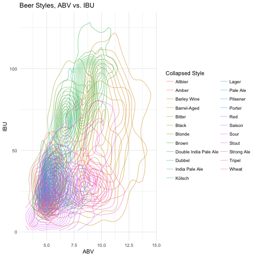

Beer-in-Hand Data Science
========================================================
author: Amanda Dobbyn
date: 
autosize: true


Motivation
========================================================


### Are beer styles just a social construct?

Code at: <https://github.com/aedobbyn/beer-data-science>


========================================================


```r
summary(cars)
```

```
     speed           dist       
 Min.   : 4.0   Min.   :  2.00  
 1st Qu.:12.0   1st Qu.: 26.00  
 Median :15.0   Median : 36.00  
 Mean   :15.4   Mean   : 42.98  
 3rd Qu.:19.0   3rd Qu.: 56.00  
 Max.   :25.0   Max.   :120.00  
```

The beer landscape
========================================================




Step 1: GET Beer
========================================================


```
processing file: present.Rpres
Quitting from lines 58-83 (present.Rpres) 
Error: could not find function "unnest_it"
Execution halted
```
