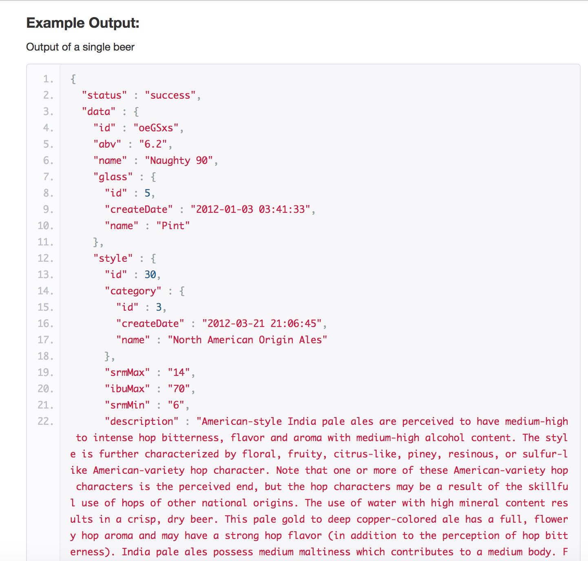
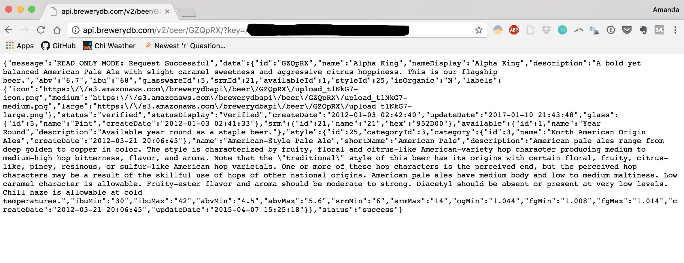
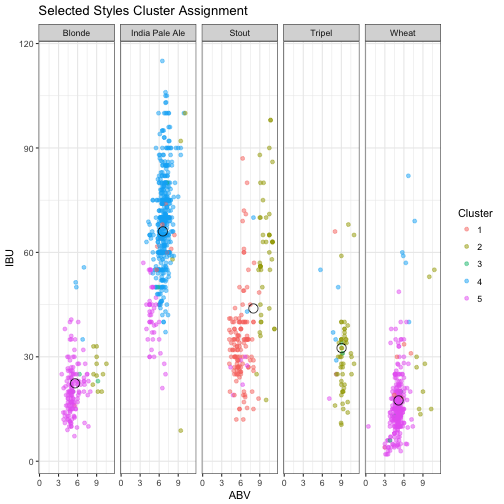
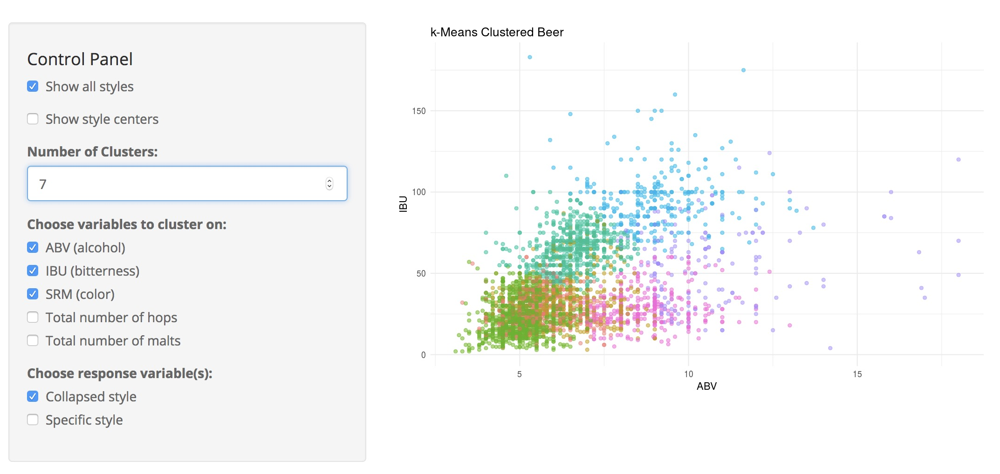
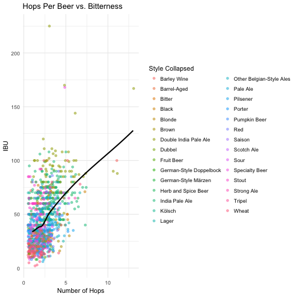
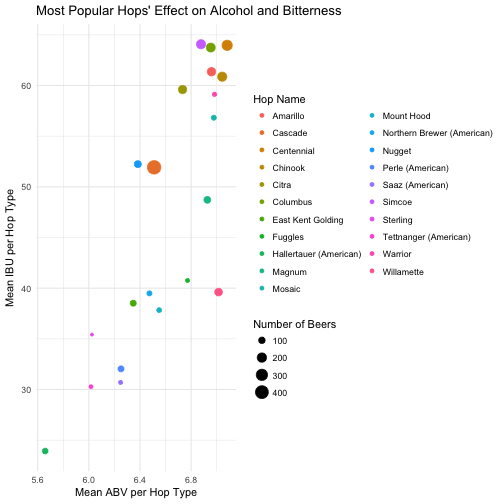
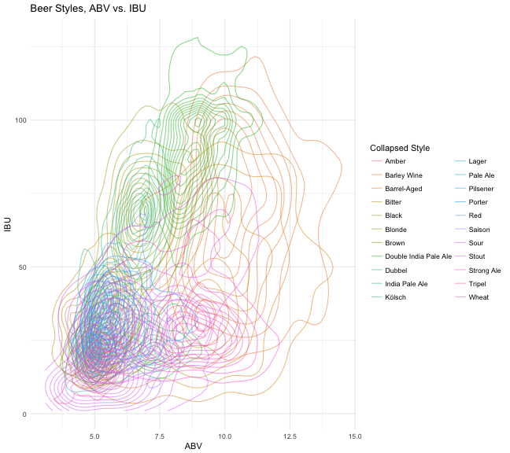

Beer-in-Hand Data Science
========================================================
author: Amanda Dobbyn
date: 
autosize: true

<style>
  .title-slide {
     background-image: url(http://bitpine.com/av/storage/d6883b03/avfb6baf1401d03eb2b7d.jpg);
      background-position: center center;
      background-attachment: fixed;
      background-repeat: no-repeat;
      background-size: 100% 100%;
   }
  
  body {
    overflow: scroll;
    border-style: solid;
  }
  
  strong { 
    font-weight: bold;
    color: black;
  }

  .cheers {
      background-image: url(https://static.independent.co.uk/s3fs-public/styles/article_small/public/thumbnails/image/2016/12/30/17/beer-istock-izusek.jpg);
      background-position: center center;
      background-attachment: fixed;
      background-repeat: no-repeat;
      background-size: 100% 100%;
      color: white;
      background:transparent;
    }
    
  .cheers .reveal .state-background {
      background-image: url(http://bitpine.com/av/storage/d6883b03/avfb6baf1401d03eb2b7d.jpg);
      background-position: center center;
      background-attachment: fixed;
      background-repeat: no-repeat;
      background-size: 100% 100%;
      color: white;
    }
    
  .section .reveal .state-background {
      background-image: url(http://bitpine.com/av/storage/d6883b03/avfb6baf1401d03eb2b7d.jpg);
      background-position: center center;
      background-attachment: fixed;
      background-repeat: no-repeat;
      background-size: 100% 100%;
  }

  table, td, th {
    border: 1px solid black;
    font-size: 1pt;
    padding: 5px;
    cellpadding="0";
    cellspacing="0";
    text-align: right;
    font-size: 1pt;
  }
  th {
    background-color: #e1e3e8;
  }
  
  table { 
    border-spacing: 5px;
    overflow: scroll;
  }
  
  .small-code pre code {
    font-size: 1em;
  }
  
  .very-small-code pre code {
    font-size: .7em;
  }
  
  .very-small-code-transparent {
    background-image: url(http://bitpine.com/av/storage/d6883b03/avfb6baf1401d03eb2b7d.jpg);
    background-position: center center;
    background-attachment: fixed;
    background-repeat: no-repeat;
    background-size: 100% 100%;
    color: white;
    border-style: none;
    background-size: 100% auto;
  }
  
  .very-small-code-transparent .reveal .state-background {
    background-image: url(http://bitpine.com/av/storage/d6883b03/avfb6baf1401d03eb2b7d.jpg);
    background-position: center center;
    background-attachment: fixed;
    background-repeat: no-repeat;
    background-size: 100% 100%;
    color: white;
    border-style: none;
    background-size: 100% auto;
  }
  
  .very-small-code-transparent pre code {
    font-size: .7em;
    background: transparent;
    border-style: none;
  }
  
  .footer {
    color: black; 
    position: fixed; top: 90%;
    margin: top: 20%;
    text-align:center; width:100%;
}

  .midcenter {
      position: fixed;
      top: 50%;
      left: 50%;
      background-color:transparent;
  }
  
  .leftcenter {
      position: fixed;
      top: 15%;
      left: 5%;
      right: 1%; 
      background-color:transparent;
  }
</style>


First things first
========================================================
incremental:true
*Who am I?*

UChicago '15

<small> ^ Angela not yet pictured </small>


***
<br> 

Now at [Earlybird Software](http://earlybird.co/)


First things first
========================================================
incremental:false

<br>

*Where's the code?*

<https://github.com/aedobbyn/beer-data-science>
- Markdown writeup in `/compile`
- Shiny app in `/clusterfun`
- Step-by-step scripts for getting and munging data in `/run_it`
- This presentation in `/present`

***

<br>


How did this come about?
========================================================
- Typical Friday afternoon office conversation
    - How do you architect the ideal beer flavor profile visualizer?
        - In particular, how do you represent *"hoppy, for a Kölsch"*?
  
<br>    
    
- Does the style Kölsch even describe a well-defined beer sub-group?
    - Would it be reliably distinguishable from non-Kölschs in a blind taste test?
    
    
How did this come about?
========================================================
`Beer   ==   water + malted barley + hops + yeast + sometimes other stuff like fruit`
- We categorize it into different styles based on 
  - Type and ratio of ingredients
  - How the beer is made (e.g., how long and at what temperature it's brewed)
  - Regional/historical differences 
  

How did this come about?
========================================================

BUT
- *How well do styles actually demarcate the beer landscape?*
  - Is there actually more inter-style variation than intra-style variation?
  - Is there a more empiricially accurate way to categorize beers into super-groups?

In other words, we're asking: are beer styles just a social construct?


The Order of Things, theoretically
========================================================

<center><center>


Implications
========================================================


* If styles do demarcate the beer landscape well, we should expect to see distinct **clusters** dominated mostly by beers classified into a *single* style

* It should also be easy to <strong>predict</strong> style from the other variables

This all assumes the variables we have (more on those in a sec) can account for most of the variance between styles.


*The stakes could not be higher*.


Step 1: GET Beer
========================================================
### The age-old dilemma


From where?
[BreweryDB](http://www.brewerydb.com/developers/docs), an online database of beers with a public API.


***




Step 1: GET one Beer
========================================================

Once we've got a key, we can use a beer's unique BreweryDB ID and our key to tet data on that beer.

<small>`http://api.brewerydb.com/v2/beer/<BEER_ID_HERE>/?key=/<YOUR_KEY_HERE>` </small>

In the browser, that looks like:

<center></center>


Step 1: GET one Beer
========================================================
class: small-code


```r
base_url <- "http://api.brewerydb.com/v2"
key_preface <- "/?key="

get_beer <- function(id) {
  fromJSON(paste0(base_url, "/beer/", id, "/", key_preface, key))
}
```


We can make a little function from this that'll take a single ID and use `fromJSON` to convert from, well, JSON into a nested list starting with our 200 success message.


```r
get_beer("GZQpRX")
```

```
$message
[1] "READ ONLY MODE: Request Successful"

$data
$data$id
[1] "GZQpRX"

$data$name
[1] "Alpha King"

$data$nameDisplay
[1] "Alpha King"

$data$description
[1] "A bold yet balanced American Pale Ale with slight caramel sweetness and aggressive citrus hoppiness. This is our flagship beer."

$data$abv
[1] "6.7"

$data$ibu
[1] "68"

$data$glasswareId
[1] 5

$data$srmId
[1] 21

$data$availableId
[1] 1

$data$styleId
[1] 25

$data$isOrganic
[1] "N"

$data$labels
$data$labels$icon
[1] "https://s3.amazonaws.com/brewerydbapi/beer/GZQpRX/upload_t1NkG7-icon.png"

$data$labels$medium
[1] "https://s3.amazonaws.com/brewerydbapi/beer/GZQpRX/upload_t1NkG7-medium.png"

$data$labels$large
[1] "https://s3.amazonaws.com/brewerydbapi/beer/GZQpRX/upload_t1NkG7-large.png"


$data$status
[1] "verified"

$data$statusDisplay
[1] "Verified"

$data$createDate
[1] "2012-01-03 02:42:40"

$data$updateDate
[1] "2017-01-10 21:43:48"

$data$glass
$data$glass$id
[1] 5

$data$glass$name
[1] "Pint"

$data$glass$createDate
[1] "2012-01-03 02:41:33"


$data$srm
$data$srm$id
[1] 21

$data$srm$name
[1] "21"

$data$srm$hex
[1] "952D00"


$data$available
$data$available$id
[1] 1

$data$available$name
[1] "Year Round"

$data$available$description
[1] "Available year round as a staple beer."


$data$style
$data$style$id
[1] 25

$data$style$categoryId
[1] 3

$data$style$category
$data$style$category$id
[1] 3

$data$style$category$name
[1] "North American Origin Ales"

$data$style$category$createDate
[1] "2012-03-21 20:06:45"


$data$style$name
[1] "American-Style Pale Ale"

$data$style$shortName
[1] "American Pale"

$data$style$description
[1] "American pale ales range from deep golden to copper in color. The style is characterized by fruity, floral and citrus-like American-variety hop character producing medium to medium-high hop bitterness, flavor, and aroma. Note that the \"traditional\" style of this beer has its origins with certain floral, fruity, citrus-like, piney, resinous, or sulfur-like American hop varietals. One or more of these hop characters is the perceived end, but the perceived hop characters may be a result of the skillful use of hops of other national origins. American pale ales have medium body and low to medium maltiness. Low caramel character is allowable. Fruity-ester flavor and aroma should be moderate to strong. Diacetyl should be absent or present at very low levels. Chill haze is allowable at cold temperatures."

$data$style$ibuMin
[1] "30"

$data$style$ibuMax
[1] "42"

$data$style$abvMin
[1] "4.5"

$data$style$abvMax
[1] "5.6"

$data$style$srmMin
[1] "6"

$data$style$srmMax
[1] "14"

$data$style$ogMin
[1] "1.044"

$data$style$fgMin
[1] "1.008"

$data$style$fgMax
[1] "1.014"

$data$style$createDate
[1] "2012-03-21 20:06:45"

$data$style$updateDate
[1] "2015-04-07 15:25:18"


$status
[1] "success"
```


<!-- Quick funciton factory -->
<!-- ======================================================== -->
<!-- class:small-code -->

<!-- Using `purrr::walk()` and `assign()` we can create functions to GET any beer, brewery, category, etc. if we know its ID. -->

<!-- ```{r func_fac, eval = TRUE, echo=TRUE} -->
<!-- endpoints <- c("beer", "brewery", "category", "event", "feature", "glass", "guild", "hop", "ingredient", "location", "socialsite", "style", "menu") -->

<!-- # Base function -->
<!-- get_ <- function(id, ep) { -->
<!--   jsonlite::fromJSON(paste0(base_url, "/", ep, "/", id, "/", key_preface, key)) -->
<!-- } -->

<!-- # Create new get_<ep> functions -->
<!-- endpoints %>% walk(~ assign(x = paste0("get_", .x), -->
<!--                              value = partial(get_, ep = .x), -->
<!--                              envir = .GlobalEnv)) -->
<!-- ``` -->

<!-- Now we have the functions `get_beer()`, `get_brewery()`, `get_category()`, etc. in our global environment. -->

<!-- Testing testing -->
<!-- ======================================================== -->
<!-- class:small-code -->


<!-- ```{r, eval=TRUE, echo=TRUE} -->
<!-- get_hop("3") -->
<!-- ``` -->


Digging In
========================================================
class:very-small-code

What are the parts of the data that we want and where do they live? 


```r
get_beer("GZQpRX")
```

```
$message
[1] "READ ONLY MODE: Request Successful"

$data
$data$id
[1] "GZQpRX"

$data$name
[1] "Alpha King"

$data$nameDisplay
[1] "Alpha King"

$data$description
[1] "A bold yet balanced American Pale Ale with slight caramel sweetness and aggressive citrus hoppiness. This is our flagship beer."

$data$abv
[1] "6.7"

$data$ibu
[1] "68"

$data$glasswareId
[1] 5

$data$srmId
[1] 21

$data$availableId
[1] 1

$data$styleId
[1] 25

$data$isOrganic
[1] "N"

$data$labels
$data$labels$icon
[1] "https://s3.amazonaws.com/brewerydbapi/beer/GZQpRX/upload_t1NkG7-icon.png"

$data$labels$medium
[1] "https://s3.amazonaws.com/brewerydbapi/beer/GZQpRX/upload_t1NkG7-medium.png"

$data$labels$large
[1] "https://s3.amazonaws.com/brewerydbapi/beer/GZQpRX/upload_t1NkG7-large.png"


$data$status
[1] "verified"

$data$statusDisplay
[1] "Verified"

$data$createDate
[1] "2012-01-03 02:42:40"

$data$updateDate
[1] "2017-01-10 21:43:48"

$data$glass
$data$glass$id
[1] 5

$data$glass$name
[1] "Pint"

$data$glass$createDate
[1] "2012-01-03 02:41:33"


$data$srm
$data$srm$id
[1] 21

$data$srm$name
[1] "21"

$data$srm$hex
[1] "952D00"


$data$available
$data$available$id
[1] 1

$data$available$name
[1] "Year Round"

$data$available$description
[1] "Available year round as a staple beer."


$data$style
$data$style$id
[1] 25

$data$style$categoryId
[1] 3

$data$style$category
$data$style$category$id
[1] 3

$data$style$category$name
[1] "North American Origin Ales"

$data$style$category$createDate
[1] "2012-03-21 20:06:45"


$data$style$name
[1] "American-Style Pale Ale"

$data$style$shortName
[1] "American Pale"

$data$style$description
[1] "American pale ales range from deep golden to copper in color. The style is characterized by fruity, floral and citrus-like American-variety hop character producing medium to medium-high hop bitterness, flavor, and aroma. Note that the \"traditional\" style of this beer has its origins with certain floral, fruity, citrus-like, piney, resinous, or sulfur-like American hop varietals. One or more of these hop characters is the perceived end, but the perceived hop characters may be a result of the skillful use of hops of other national origins. American pale ales have medium body and low to medium maltiness. Low caramel character is allowable. Fruity-ester flavor and aroma should be moderate to strong. Diacetyl should be absent or present at very low levels. Chill haze is allowable at cold temperatures."

$data$style$ibuMin
[1] "30"

$data$style$ibuMax
[1] "42"

$data$style$abvMin
[1] "4.5"

$data$style$abvMax
[1] "5.6"

$data$style$srmMin
[1] "6"

$data$style$srmMax
[1] "14"

$data$style$ogMin
[1] "1.044"

$data$style$fgMin
[1] "1.008"

$data$style$fgMax
[1] "1.014"

$data$style$createDate
[1] "2012-03-21 20:06:45"

$data$style$updateDate
[1] "2015-04-07 15:25:18"


$status
[1] "success"
```

***

We can grab just the fourth element of the `data` part of the response, the beer's `description` in a couple ways:

```r
get_beer("GZQpRX")$data$description
```

```
[1] "A bold yet balanced American Pale Ale with slight caramel sweetness and aggressive citrus hoppiness. This is our flagship beer."
```

Or in other words:

```r
get_beer("GZQpRX")[["data"]][4][[1]]
```

```
[1] "A bold yet balanced American Pale Ale with slight caramel sweetness and aggressive citrus hoppiness. This is our flagship beer."
```


Digging In
========================================================
class:very-small-code

Other things are more deeply nested. 


```r
get_beer("GZQpRX")$data$style
```

```
$id
[1] 25

$categoryId
[1] 3

$category
$category$id
[1] 3

$category$name
[1] "North American Origin Ales"

$category$createDate
[1] "2012-03-21 20:06:45"


$name
[1] "American-Style Pale Ale"

$shortName
[1] "American Pale"

$description
[1] "American pale ales range from deep golden to copper in color. The style is characterized by fruity, floral and citrus-like American-variety hop character producing medium to medium-high hop bitterness, flavor, and aroma. Note that the \"traditional\" style of this beer has its origins with certain floral, fruity, citrus-like, piney, resinous, or sulfur-like American hop varietals. One or more of these hop characters is the perceived end, but the perceived hop characters may be a result of the skillful use of hops of other national origins. American pale ales have medium body and low to medium maltiness. Low caramel character is allowable. Fruity-ester flavor and aroma should be moderate to strong. Diacetyl should be absent or present at very low levels. Chill haze is allowable at cold temperatures."

$ibuMin
[1] "30"

$ibuMax
[1] "42"

$abvMin
[1] "4.5"

$abvMax
[1] "5.6"

$srmMin
[1] "6"

$srmMax
[1] "14"

$ogMin
[1] "1.044"

$fgMin
[1] "1.008"

$fgMax
[1] "1.014"

$createDate
[1] "2012-03-21 20:06:45"

$updateDate
[1] "2015-04-07 15:25:18"
```

***

In these cases, we really only care about the `name` portion.


```r
get_beer("GZQpRX")$data$style$name
```

```
[1] "American-Style Pale Ale"
```


Unnesting
========================================================
class:small-code

So, we'll unravel the `data` part of the response, grab whatever we want there, and glue it together into a dataframe. 

If the particular list item we're unnesting has a `name` portion (like `$style$name`), great, we'll grab that for the column. Otherwise, we'll take whatever's first.


```r
unnest_it <- function(df) {
  unnested <- df
  for(col in seq_along(df[["data"]])) {
    if(! is.null(ncol(df[["data"]][[col]]))) {
      if(! is.null(df[["data"]][[col]][["name"]])) {
        unnested[["data"]][[col]] <- df[["data"]][[col]][["name"]]
      } else {
        unnested[["data"]][[col]] <- df[["data"]][[col]][[1]]
      }
    }
  }
  return(unnested)
}
```

<small>Note that this is a `for` loop so it's pretty slow 😔. Optimizing it is on the docket.</small>

Grabbing all Beers
========================================================
Instead of `/beer/<BEER_ID>` we're now asking for `/beers`

<center></center>


Paginating the Request
========================================================
class: small-code

We find out how many pages there are total and then send requests and unnest each until we hit `number_of_pages`.


```r
paginated_request <- function(ep, addition, trace_progress = TRUE) {    
  full_request <- NULL
  first_page <- fromJSON(paste0(base_url, "/", ep, "/", key_preface, key
                                , "&p=1"))
  number_of_pages <- ifelse(!(is.null(first_page$numberOfPages)), 
                            first_page$numberOfPages, 1)      

    for (page in 1:number_of_pages) {                               
    this_request <- fromJSON(paste0(base_url, "/", ep, "/", key_preface, key
                                    , "&p=", page, addition),
                             flatten = TRUE) 
    this_req_unnested <- unnest_it(this_request)    #  <- request unnested here
    
    if(trace_progress == TRUE) {message(paste0("Page ", this_req_unnested$currentPage))} # if TRUE, print the page we're on
    
    full_request <- bind_rows(full_request, this_req_unnested[["data"]])
  }
  return(full_request)
} 
```


<!-- Quick note on Ingredients -->
<!-- ======================================================== -->
<!-- class:small-code -->
<!-- A few apporaches I used: -->

<!-- * Concatenated into a single string during the unnesting process -->
<!--   * `hop_name` and `malt_name` using this function  👉 -->
<!-- * Split out into one hop per column and one malt per column -->
<!--   * `hops_name_1`, `hops_name_2`, etc. -->
<!-- * Sparse dataframe with each type of hop (like Cascade, Citra, etc.) as its own column  -->
<!--   * Value is either 1 or 0  -->

<!-- <small> (Another would have been a nested list-col) </small> -->

<!-- *** -->

<!-- <br> -->

<!-- ```{r, eval=FALSE, echo=TRUE} -->
<!-- unnest_ingredients <- function(df) { -->
<!--   df$hops_name <- NA -->
<!--   df$malt_name <- NA -->

<!--   for (row in 1:nrow(df)) { -->
<!--     if (!is.null(df[["ingredients.hops"]][[row]][["name"]]) | -->
<!--         !is.null(df[["ingredients.malt"]][[row]][["name"]])) { -->

<!--       df[["hops_name"]][[row]] <- paste(df[["ingredients.hops"]][[row]][["name"]], collapse = ", ") -->

<!--       df[["malt_name"]][[row]] <- paste(df[["ingredients.malt"]][[row]][["name"]], collapse = ", ") -->
<!--     } -->
<!--   } -->
<!--   return(df) -->
<!-- } -->
<!-- ``` -->


What have we got?
========================================================
class: small-code


```r
beer_necessities <- paginated_request(ep = "beers", addition = "&withIngredients=Y")
```


|id     |name                                     |style                                              |style_collapsed       |glass | abv| ibu| srm|hops_name                                  |malt_name                                                                     |
|:------|:----------------------------------------|:--------------------------------------------------|:---------------------|:-----|---:|---:|---:|:------------------------------------------|:-----------------------------------------------------------------------------|
|X4KcGF |(512) TWO                                |Imperial or Double India Pale Ale                  |Double India Pale Ale |Pint  | 9.0|  99|   9|Columbus, Glacier, Horizon, Nugget, Simcoe |Caramel/Crystal Malt, Two-Row Pale Malt - Organic, Wheat Malt                 |
|USaRyl |(512) Whiskey Barrel Double Pecan Porter |Wood- and Barrel-Aged Strong Beer                  |Barrel-Aged           |Pint  | 9.5|  30|  NA|Glacier                                    |Black Malt, Caramel/Crystal Malt, Chocolate Malt, Two-Row Pale Malt - Organic |
|bXwskR |(512) White IPA                          |American-Style India Pale Ale                      |India Pale Ale        |Pint  | 5.3|  55|   4|NA                                         |NA                                                                            |
|XnPVIo |(512) Wild Bear                          |Specialty Beer                                     |Specialty Beer        |Tulip | 8.5|   9|  NA|NA                                         |NA                                                                            |
|QLp4mV |(512) Wit                                |Belgian-Style White (or Wit) / Belgian-Style Wheat |Wheat                 |Pint  | 5.1|  10|   5|Golding (American)                         |Oats - Malted, Two-Row Pale Malt - Organic, Wheat Malt - White                |
|tWuIyV |(714): Blond Ale                         |Golden or Blonde Ale                               |Blonde                |NA    | 4.8|  NA|  NA|NA                                         |NA                                                                            |


What have we got?
========================================================

<div class="footer" style="font-size:80%; margin-bottom:0%">
What we have <em>not</em> got: flavor profiles (fruity, hoppy, piney) and ratings.</div>

<br> 
* 63,495 distinct beers
* Info about the beer:
  * ABV: alcohol by volume
  * IBU: International Biterness Units (really)
  * SRM: [a measure of color](http://www.twobeerdudes.com/beer/srm)
  * Ingredients
      * Hops, malts
      
***


Where to put it?
========================================================

<br>


***

<br>

I threw it into MySQL

* This allows us to
   * Easily update the data if anything changes
   * Others easy access to the data if they want to build an app using it
   

A look at our outcome variable
========================================================
class:small-code

We have 170 styles of beer.


```r
levels(beer_necessities$style)
```

```
  [1] "Adambier"                                                  
  [2] "Aged Beer (Ale or Lager)"                                  
  [3] "American-Style Amber (Low Calorie) Lager"                  
  [4] "American-Style Amber Lager"                                
  [5] "American-Style Amber/Red Ale"                              
  [6] "American-Style Barley Wine Ale"                            
  [7] "American-Style Black Ale"                                  
  [8] "American-Style Brown Ale"                                  
  [9] "American-Style Cream Ale or Lager"                         
 [10] "American-Style Dark Lager"                                 
 [11] "American-Style Ice Lager"                                  
 [12] "American-Style Imperial Porter"                            
 [13] "American-Style Imperial Stout"                             
 [14] "American-Style India Pale Ale"                             
 [15] "American-Style Lager"                                      
 [16] "American-Style Light (Low Calorie) Lager"                  
 [17] "American-Style Low-Carbohydrate Light Lager"               
 [18] "American-Style Malt Liquor"                                
 [19] "American-Style Märzen / Oktoberfest"                       
 [20] "American-Style Pale Ale"                                   
 [21] "American-Style Pilsener"                                   
 [22] "American-Style Premium Lager"                              
 [23] "American-Style Sour Ale"                                   
 [24] "American-Style Stout"                                      
 [25] "American-Style Strong Pale Ale"                            
 [26] "American-Style Wheat Wine Ale"                             
 [27] "Apple Wine"                                                
 [28] "Australasian, Latin American or Tropical-Style Light Lager"
 [29] "Australian-Style Pale Ale"                                 
 [30] "Baltic-Style Porter"                                       
 [31] "Bamberg-Style Bock Rauchbier"                              
 [32] "Bamberg-Style Helles Rauchbier"                            
 [33] "Bamberg-Style Märzen Rauchbier"                            
 [34] "Bamberg-Style Weiss (Smoke) Rauchbier (Dunkel or Helles)"  
 [35] "Belgian-Style Blonde Ale"                                  
 [36] "Belgian-Style Dark Strong Ale"                             
 [37] "Belgian-Style Dubbel"                                      
 [38] "Belgian-Style Flanders Oud Bruin or Oud Red Ales"          
 [39] "Belgian-style Fruit Beer"                                  
 [40] "Belgian-Style Fruit Lambic"                                
 [41] "Belgian-Style Gueuze Lambic"                               
 [42] "Belgian-Style Lambic"                                      
 [43] "Belgian-Style Pale Ale"                                    
 [44] "Belgian-Style Pale Strong Ale"                             
 [45] "Belgian-Style Quadrupel"                                   
 [46] "Belgian-Style Table Beer"                                  
 [47] "Belgian-Style Tripel"                                      
 [48] "Belgian-Style White (or Wit) / Belgian-Style Wheat"        
 [49] "Berliner-Style Weisse (Wheat)"                             
 [50] "Bohemian-Style Pilsener"                                   
 [51] "Braggot"                                                   
 [52] "Brett Beer"                                                
 [53] "British-Style Barley Wine Ale"                             
 [54] "British-Style Imperial Stout"                              
 [55] "Brown Porter"                                              
 [56] "California Common Beer"                                    
 [57] "Chili Pepper Beer"                                         
 [58] "Chocolate / Cocoa-Flavored Beer"                           
 [59] "Classic English-Style Pale Ale"                            
 [60] "Classic Irish-Style Dry Stout"                             
 [61] "Coffee-Flavored Beer"                                      
 [62] "Common Cider"                                              
 [63] "Common Perry"                                              
 [64] "Contemporary Gose"                                         
 [65] "Cyser (Apple Melomel)"                                     
 [66] "Dark American Wheat Ale or Lager with Yeast"               
 [67] "Dark American Wheat Ale or Lager without Yeast"            
 [68] "Dark American-Belgo-Style Ale"                             
 [69] "Dortmunder / European-Style Export"                        
 [70] "Double Red Ale"                                            
 [71] "Dry Lager"                                                 
 [72] "Dry Mead"                                                  
 [73] "Dutch-Style Kuit, Kuyt or Koyt"                            
 [74] "Energy Enhanced Malt Beverage"                             
 [75] "English Cider"                                             
 [76] "English-Style Brown Ale"                                   
 [77] "English-Style Dark Mild Ale"                               
 [78] "English-Style India Pale Ale"                              
 [79] "English-Style Pale Mild Ale"                               
 [80] "English-Style Summer Ale"                                  
 [81] "European-Style Dark / Münchner Dunkel"                     
 [82] "Experimental Beer (Lager or Ale)"                          
 [83] "Extra Special Bitter"                                      
 [84] "Field Beer"                                                
 [85] "Flavored Malt Beverage"                                    
 [86] "Foreign (Export)-Style Stout"                              
 [87] "French & Belgian-Style Saison"                             
 [88] "French Cider"                                              
 [89] "French-Style Bière de Garde"                               
 [90] "Fresh \"Wet\" Hop Ale"                                     
 [91] "Fruit Beer"                                                
 [92] "Fruit Cider"                                               
 [93] "Fruit Wheat Ale or Lager with or without Yeast"            
 [94] "German-Style Altbier"                                      
 [95] "German-Style Doppelbock"                                   
 [96] "German-Style Eisbock"                                      
 [97] "German-Style Heller Bock/Maibock"                          
 [98] "German-Style Kölsch / Köln-Style Kölsch"                   
 [99] "German-Style Leichtbier"                                   
[100] "German-Style Leichtes Weizen / Weissbier"                  
[101] "German-Style Märzen"                                       
[102] "German-Style Oktoberfest / Wiesen (Meadow)"                
[103] "German-Style Pilsener"                                     
[104] "German-Style Rye Ale (Roggenbier) with or without Yeast"   
[105] "German-Style Schwarzbier"                                  
[106] "Ginjo Beer or Sake-Yeast Beer"                             
[107] "Gluten-Free Beer"                                          
[108] "Golden or Blonde Ale"                                      
[109] "Grodziskie"                                                
[110] "Herb and Spice Beer"                                       
[111] "Historical Beer"                                           
[112] "Imperial or Double India Pale Ale"                         
[113] "Imperial Red Ale"                                          
[114] "Indigenous Beer (Lager or Ale)"                            
[115] "International-Style Pale Ale"                              
[116] "International-Style Pilsener"                              
[117] "Irish-Style Red Ale"                                       
[118] "Kellerbier (Cellar beer) or Zwickelbier - Ale"             
[119] "Kellerbier (Cellar beer) or Zwickelbier - Lager"           
[120] "Leipzig-Style Gose"                                        
[121] "Light American Wheat Ale or Lager with Yeast"              
[122] "Light American Wheat Ale or Lager without Yeast"           
[123] "Metheglin"                                                 
[124] "Mixed Culture Brett Beer"                                  
[125] "Münchner (Munich)-Style Helles"                            
[126] "New England Cider"                                         
[127] "Non-Alcoholic (Beer) Malt Beverages"                       
[128] "Oatmeal Stout"                                             
[129] "Old Ale"                                                   
[130] "Open Category Mead"                                        
[131] "Ordinary Bitter"                                           
[132] "Other Belgian-Style Ales"                                  
[133] "Other Fruit Melomel"                                       
[134] "Other Specialty Cider or Perry"                            
[135] "Other Strong Ale or Lager"                                 
[136] "Pale American-Belgo-Style Ale"                             
[137] "Pumpkin Beer"                                              
[138] "Pyment (Grape Melomel)"                                    
[139] "Robust Porter"                                             
[140] "Rye Ale or Lager with or without Yeast"                    
[141] "Scotch Ale"                                                
[142] "Scottish-Style Export Ale"                                 
[143] "Scottish-Style Heavy Ale"                                  
[144] "Scottish-Style Light Ale"                                  
[145] "Semi-Sweet Mead"                                           
[146] "Session Beer"                                              
[147] "Session India Pale Ale"                                    
[148] "Smoke Beer (Lager or Ale)"                                 
[149] "Smoke Porter"                                              
[150] "South German-Style Bernsteinfarbenes Weizen / Weissbier"   
[151] "South German-Style Dunkel Weizen / Dunkel Weissbier"       
[152] "South German-Style Hefeweizen / Hefeweissbier"             
[153] "South German-Style Kristall Weizen / Kristall Weissbier"   
[154] "South German-Style Weizenbock / Weissbock"                 
[155] "Special Bitter or Best Bitter"                             
[156] "Specialty Beer"                                            
[157] "Specialty Honey Lager or Ale"                              
[158] "Specialty Stouts"                                          
[159] "Strong Ale"                                                
[160] "Sweet Mead"                                                
[161] "Sweet or Cream Stout"                                      
[162] "Traditional German-Style Bock"                             
[163] "Traditional Perry"                                         
[164] "Vienna-Style Lager"                                        
[165] "Wild Beer"                                                 
[166] "Wood- and Barrel-Aged Beer"                                
[167] "Wood- and Barrel-Aged Dark Beer"                           
[168] "Wood- and Barrel-Aged Pale to Amber Beer"                  
[169] "Wood- and Barrel-Aged Sour Beer"                           
[170] "Wood- and Barrel-Aged Strong Beer"                         
```

***

<br> 

What's the best way to condense these?

I want to e.g., lump American-Style India Pale Ale in with English-Style India Pale Ale.

Step 2: Breathe sigh of relief, Collapse
========================================================
class: small-code


```r
keywords <- c("Pale Ale", "India Pale Ale", "Double India Pale Ale", "Lager", "India Pale Lager", "Hefeweizen", "Barrel-Aged","Wheat", "Pilsner", "Pilsener", "Amber", "Golden", "Blonde", "Brown", "Black", "Stout", "Imperial Stout", "Fruit", "Porter", "Red", "Sour", "Kölsch", "Tripel", "Bitter", "Saison", "Strong Ale", "Barley Wine", "Dubbel")
```


```r
collapse_styles <- function(df, trace_progress = TRUE) {
  
  df[["style_collapsed"]] <- vector(length = nrow(df))
  
  for (beer in 1:nrow(df)) {
    if (grepl(paste(keywords, collapse="|"), df$style[beer])) {    
      for (keyword in keywords) {         
        if(grepl(keyword, df$style[beer]) == TRUE) {
          df$style_collapsed[beer] <- keyword    
        }                         
      } 
    } else {
      df$style_collapsed[beer] <- as.character(df$style[beer])       
    }
    if(trace_progress == TRUE) {message(paste0("Collapsing this ", df$style[beer], " to: ", df$style_collapsed[beer]))}
  }
  return(df)
}
```

Collapsing in Action
========================================================

Setting `trace_progress = TRUE`:


***
* `keywords` are ordered from most general to most specific
  * If a beer's name matches multiple keywords, its `style_collapsed` is the **last** of those that appear in `keywords`
    
    
`American-Style Pale Ale`  ➡  `Pale Ale`

`American-Style India Pale Ale`  ➡  `India Pale Ale`


Popular Styles
========================================================

Let's see where most of the data is concentrated. 

* Popular defined as
   * Styles with above the mean number of beers per style (z-score > 0)
       * <small> Of course, this isn't a measure of popular consumption; just a reflection of the number of different beers we get from BreweryDB that are classified into that style </small>
   
<br>

* And then get a sense of where those styles fall in relation to one another
    * Style "centers" = mean ABV, IBU, and SRM of each style


Popular Styles
========================================================


|Collapsed Style          | Mean ABV| Mean IBU| Mean SRM| Numer of Beers|
|:------------------------|--------:|--------:|--------:|--------------:|
|India Pale Ale           |     6.58|    66.04|     9.99|           6524|
|Pale Ale                 |     5.70|    40.87|     8.89|           4280|
|Stout                    |     7.99|    43.90|    36.30|           4238|
|Wheat                    |     5.16|    17.47|     5.86|           3349|
|Double India Pale Ale    |     8.93|    93.48|    11.01|           2525|
|Red                      |     5.74|    33.81|    16.18|           2521|
|Lager                    |     5.45|    30.64|     8.46|           2230|
|Saison                   |     6.40|    27.25|     7.05|           2167|
|Blonde                   |     5.60|    22.39|     5.62|           2044|
|Porter                   |     6.18|    33.25|    32.20|           1973|
|Brown                    |     6.16|    32.22|    23.59|           1462|
|Pilsener                 |     5.23|    33.51|     4.41|           1268|
|Specialty Beer           |     6.45|    33.78|    15.52|           1044|
|Bitter                   |     5.32|    38.28|    12.46|            939|
|Fruit Beer               |     5.20|    19.24|     8.67|            905|
|Herb and Spice Beer      |     6.62|    27.77|    18.17|            872|
|Sour                     |     6.22|    18.89|    10.04|            797|
|Strong Ale               |     8.83|    36.74|    22.55|            767|
|Tripel                   |     9.03|    32.52|     7.68|            734|
|Black                    |     6.96|    65.51|    31.08|            622|
|Barley Wine              |    10.78|    74.05|    19.56|            605|
|Kölsch                   |     4.98|    23.37|     4.37|            593|
|Barrel-Aged              |     9.00|    39.16|    18.13|            540|
|Other Belgian-Style Ales |     7.52|    37.56|    17.55|            506|
|Pumpkin Beer             |     6.71|    23.48|    17.92|            458|
|Dubbel                   |     7.51|    25.05|    22.94|            399|
|Scotch Ale               |     7.62|    26.37|    24.22|            393|
|German-Style Doppelbock  |     8.05|    28.89|    25.70|            376|
|Fruit Cider              |     6.21|    25.60|    12.00|            370|
|German-Style Märzen      |     5.75|    25.64|    14.32|            370|


To the main question
========================================================


<!-- From this we can plot the centers of each style. -->

<!-- ```{r, echo=FALSE, eval=TRUE} -->
<!-- ggplot(data = style_centers %>% filter(style_collapsed %in% keywords)) +  -->
<!--   geom_point(aes(mean_abv, mean_ibu, colour = style_collapsed, size = n)) + -->
<!--   ggtitle("Style Centers and their Popularity") + -->
<!--   labs(x = "Mean ABV", y = "Mean IBU", colour = "Collapsed Styles",  -->
<!--        size = "Number of Beers") + -->
<!--   theme_minimal() -->
<!-- ``` -->


<!-- *** -->

*Do styles truly define distinct pockets of beer?*

If they do, we could expect styles to align with **clusters** generated using an unsupervised learning algorithm. 

* k-means
    * Splits observations into `k` clusters (we choose `k`)
    * Try to minimize the sum of squares between each datapoint and its assigned cluster center

<small>Note that we'll have to throw away rows that contain `NA` values in any of the variables we're using.</small>

What variables should we include?


What's in a Predictor?
========================================================
incremental:false

*A heuristic I used*:

##### Outputs
* Only measured **after** a beer been brewed
    * ABV, IBU, SRM
    
##### Style-Defined
* Dependent entirely on style
  * Serving glass

##### Inputs
* Only directly controlled by a brewer **before** a beer is brewed
    * Hops, malts


***

<br> 
<br> 

👍  predictor  

<br> 
<br> 
<br> 

👎   predictor  

<br> 

🤷🏼‍♀️  predictor because chicken and egg problem  
    <small> Do brewers assign style first and then choose which ingredients to add, or vice versa? 🐣 </small>


Clustering: Let's have a function
========================================================
class: small-code


```r
do_cluster <- function (df, vars, to_cluster_on, n_centers = 5) {
  df_for_clustering <- df %>% select(!!vars) %>% na.omit()

  # Scale the ones to be scaled and append _scaled to their names
  df_vars_scale <- df_for_clustering %>% select(!!to_cluster_on) %>%
    scale() %>% as_tibble()
  names(df_vars_scale) <- names(df_vars_scale) %>% stringr::str_c("_scaled")

  # Do the clustering on the scaled data
  clusters_out <- kmeans(x = df_vars_scale, centers = n_centers, trace = FALSE)

  # Combine cluster assignment, scaled data, and unscaled rest of data
  clustered_df <- bind_cols(
    cluster_assignment = factor(clusters_out$cluster),   # Cluster assignment
    df_vars_scale,
    df_for_clustering
  )

  return(clustered_df)
}
```

<br>

<small> We don't need to specify an outcome variable because this is unsupervised. </small>


Clustering: Run It
========================================================
class: small-code

We'll cluster the beers on the scaled versions of ABV, IBU, and SRM 


```r
to_include <- c("id", "name", "style", "style_collapsed", "abv", "ibu", "srm")

to_cluster_on <- c("abv", "ibu", "srm")
```

<br>

and stitch together the cluster assignments, scaled columns, and the original data.


```r
clustered_beer <- do_cluster(beer_dat, to_include, to_cluster_on)
```


Clustering: Output
========================================================


|Cluster Assignment | ABV Scaled| IBU Scaled| SRM Scaled|ID     |Name                                                         |Style                                              |Style Collapsed       | ABV|  IBU| SRM|
|:------------------|----------:|----------:|----------:|:------|:------------------------------------------------------------|:--------------------------------------------------|:---------------------|---:|----:|---:|
|4                  |  0.2428039| -0.6803269|  2.1840186|tmEthz |"Admiral" Stache                                             |Baltic-Style Porter                                |Porter                | 7.0| 23.0|  37|
|4                  | -0.5689624|  0.3608647|  2.4657681|b7SfHG |"Ah Me Joy" Porter                                           |Robust Porter                                      |Porter                | 5.4| 51.0|  40|
|1                  | -0.3660208|  0.3608647| -0.5395600|PBEXhV |"Bison Eye Rye" Pale Ale &#124; 2 of 4 Part Pale Ale Series  |American-Style Pale Ale                            |Pale Ale              | 5.8| 51.0|   8|
|1                  | -0.5689624|  0.4724210| -0.2578105|AXmvOd |"Dust Up" Cloudy Pale Ale &#124; 1 of 4 Part Pale Ale Series |American-Style Pale Ale                            |Pale Ale              | 5.4| 54.0|  11|
|3                  | -0.4674916| -0.4869627| -0.8213095|Hr5A0t |"God Country" Kolsch                                         |German-Style Kölsch / Köln-Style Kölsch            |Kölsch                | 5.6| 28.2|   5|
|3                  | -0.8226393| -0.7918831| -0.8213095|mrVjY4 |"Jemez Field Notes" Golden Lager                             |Golden or Blonde Ale                               |Blonde                | 4.9| 20.0|   5|
|3                  | -0.7211685| -1.1265519| -0.9152260|xFM8w5 |#10 Hefewiezen                                               |South German-Style Hefeweizen / Hefeweissbier      |Wheat                 | 5.1| 11.0|   4|
|3                  | -0.7211685| -0.7918831| -0.4456435|hB0QeO |#9                                                           |American-Style Pale Ale                            |Pale Ale              | 5.1| 20.0|   9|
|3                  | -0.8733747| -0.5315852| -1.0091425|m8f62Y |#KoLSCH                                                      |German-Style Kölsch / Köln-Style Kölsch            |Kölsch                | 4.8| 27.0|   3|
|3                  | -0.6196977| -0.8662540| -0.8213095|35lHUq |'Inappropriate' Cream Ale                                    |American-Style Cream Ale or Lager                  |Lager                 | 5.3| 18.0|   5|
|1                  |  0.2428039| -0.4200290| -0.6334765|qbRV90 |'tis the Saison                                              |French & Belgian-Style Saison                      |Saison                | 7.0| 30.0|   7|
|3                  | -0.7719039| -0.7918831| -0.4456435|qhaIVA |(306) URBAN WHEAT BEER                                       |Belgian-Style White (or Wit) / Belgian-Style Wheat |Wheat                 | 5.0| 20.0|   9|
|4                  |  0.5472162| -0.4200290|  0.6813546|VwR7Xg |(512) Bruin (A.K.A. Brown Bear)                              |American-Style Brown Ale                           |Brown                 | 7.6| 30.0|  21|
|1                  |  0.4964808| -0.2341019| -0.5395600|oJFZwK |(512) FOUR                                                   |Strong Ale                                         |Strong Ale            | 7.5| 35.0|   8|
|1                  |  0.2428039|  0.8814606| -0.5395600|ezGh5N |(512) IPA                                                    |American-Style India Pale Ale                      |India Pale Ale        | 7.0| 65.0|   8|
|1                  |  0.7501578| -0.7175123| -0.5395600|s8rdpK |(512) ONE                                                    |Belgian-Style Pale Strong Ale                      |Strong Ale            | 8.0| 22.0|   8|
|3                  | -0.2645500| -0.4200290| -0.6334765|2fXsvw |(512) Pale                                                   |American-Style Pale Ale                            |Pale Ale              | 6.0| 30.0|   7|
|4                  |  0.4964808| -0.6059561|  1.3387701|9O3QPg |(512) SIX                                                    |Belgian-Style Dubbel                               |Dubbel                | 7.5| 25.0|  28|
|1                  |  1.5111886| -0.7175123| -0.3517270|A78JSF |(512) THREE                                                  |Belgian-Style Tripel                               |Tripel                | 9.5| 22.0|  10|
|5                  |  1.5111886| -0.7175123|  2.4657681|WKSYBT |(512) THREE (Cabernet Barrel Aged)                           |Belgian-Style Tripel                               |Tripel                | 9.5| 22.0|  40|
|2                  |  1.2575117|  2.1457647| -0.4456435|X4KcGF |(512) TWO                                                    |Imperial or Double India Pale Ale                  |Double India Pale Ale | 9.0| 99.0|   9|
|1                  | -0.6196977|  0.5096064| -0.9152260|bXwskR |(512) White IPA                                              |American-Style India Pale Ale                      |India Pale Ale        | 5.3| 55.0|   4|
|3                  | -0.7211685| -1.1637373| -0.8213095|QLp4mV |(512) Wit                                                    |Belgian-Style White (or Wit) / Belgian-Style Wheat |Wheat                 | 5.1| 10.0|   5|
|3                  | -1.0763162| -0.8290686| -0.9152260|thTbY7 |(904) Weissguy                                               |South German-Style Hefeweizen / Hefeweissbier      |Wheat                 | 4.4| 19.0|   4|
|3                  | -0.6704331| -0.2341019| -0.5395600|EPnv3B |(916)                                                        |American-Style Pale Ale                            |Pale Ale              | 5.2| 35.0|   8|
|3                  | -0.1123438| -0.6431415| -0.0699775|QT9hB8 |+1 Pumpkin                                                   |Pumpkin Beer                                       |Pumpkin Beer          | 6.3| 24.0|  13|
|2                  |  0.6486870|  1.4392418| -0.8213095|btwcy1 |077XX India Pale Ale                                         |Imperial or Double India Pale Ale                  |Double India Pale Ale | 7.8| 80.0|   5|
|1                  |  1.2067763|  0.1377522| -0.8213095|FWiYZi |08.08.08 Vertical Epic Ale                                   |Belgian-Style Pale Ale                             |Pale Ale              | 8.9| 45.0|   5|
|1                  | -0.5182270|  0.5467918| -0.4456435|M6vu9P |10 Blocks South                                              |American-Style Pale Ale                            |Pale Ale              | 5.5| 56.0|   9|
|4                  |  0.2428039| -0.4200290|  1.9022691|y6LrZ3 |10 Ton                                                       |Oatmeal Stout                                      |Stout                 | 7.0| 30.0|  34|


Clustering: Plot
========================================================
class:very-small-code

<small> Color vs. bitterness with style centers overlaid: </small>


***

<br>

<small>Here I've trimmed outliers using this function with a `cutoff = 2.5`.</small>


```r
trim_outliers <- function(df, cutoff = 1.96, exclude = NULL, keep_scaled = TRUE){

  to_scale <- names(df)[!names(df) %in% exclude]

  df_scaled <- df %>%
    select(!!to_scale) %>%
    transmute_if(
      is.numeric, scale
    )
  names(df_scaled) <- names(df_scaled) %>% stringr::str_c("_scaled")

  df_out <- bind_cols(df_scaled, df)

  df_out_trimmed <- df_out %>%
    filter_at(
      .vars = vars(contains("_scaled")),
      .vars_predicate = all_vars(. < abs(cutoff))
    )

  if(keep_scaled == FALSE) {
    df_out_trimmed <- df_out_trimmed %>% select(!!names(df))
  }

  return(df_out_trimmed)
}
```

<small> (You can grab it from my [`dobtools`](https://github.com/aedobbyn/dobtools) package on GitHub if you like.) </small>


Narrowing In
========================================================
incremental:false


<br>

<small> If we focus in on 5 distinct styles and cluster them into 5 clusters, will each style be siphoned off into its own cluster? </small>


|               |   1|  2|   3|   4|  5|
|:--------------|---:|--:|---:|---:|--:|
|Blonde         | 131| 17|   4|   1|  7|
|India Pale Ale |  43|  1| 468|  11| 54|
|Stout          |   6| 10|   3| 180|  5|
|Tripel         |   1| 57|   1|   3|  3|
|Wheat          | 289|  9|   6|   5| 12|


    
***




<!-- Not bad; without some taste data or other ingredients, it would be difficult to distinguish wheat beers and blonde ales. -->


Clusterfun with Shiny: UI
========================================================
class: small-code 

Snapshot of what we're including on the frontend:


```r
sidebarLayout(
    sidebarPanel(
      h4("Control Panel"),

      checkboxInput("show_all", "Show all styles", TRUE),      
      checkboxInput("show_centers", "Show style centers", FALSE),
      numericInput("num_clusters", "Number of Clusters:", starting_n_clusters),
      
      checkboxGroupInput("cluster_on", "Choose variables to cluster on: ",
                         c("ABV (alcohol)" = "abv", 
                           "IBU (bitterness)" = "ibu", 
                           "SRM (color)" ="srm", 
                           "Total number of hops" = "total_hops", 
                           "Total number of malts" = "total_malt"),
                         selected = c("abv", "ibu", "srm")),
      
      checkboxGroupInput("response_vars", "Choose response variable(s): ",
                         c("Collapsed style" = "style_collapsed",
                           "Specific style" = "style"
                         ),
                         selected = c("style_collapsed")),
      
      conditionalPanel(
        condition = "input.show_all == false",
        selectInput("style_collapsed", "Collapsed Style:",
                    style_names)
        )
    ),
```


Clusterfun with Shiny: Server
========================================================
class: small-code 

And how the backend is serving up that data, conditional on what the user asks it to display.


```r
  output$cluster_plot <- renderPlot({
  
    # If our checkbox is checked saying we do want style centers, show them. Else, don't.
    if (input$show_all == FALSE & input$show_centers == TRUE) {
      
      this_style_center <- reactive({style_centers %>% filter(style_collapsed == input$style_collapsed)})
      
      ggplot() +
        geom_point(data = this_style_data(),
                   aes(x = abv, y = ibu, colour = cluster_assignment), alpha = 0.5) +
        geom_point(data = this_style_center(),
                   aes(mean_abv, mean_ibu), colour = "black") +
        geom_text_repel(data = this_style_center(),
                        aes(mean_abv, mean_ibu, label = input$style_collapsed),
                        box.padding = unit(0.45, "lines"),
                        family = "Calibri") +
        ggtitle("k-Means Clustered Beer") +
        labs(x = "ABV", y = "IBU") +
        labs(colour = "Cluster Assignment") +
        theme_minimal() +
        theme(legend.position="none")
    } else if  # ....... etc., etc.
```


Clusterfun with Shiny
========================================================

<small><https://amandadobbyn.shinyapps.io/clusterfun/></small></center>

<center>


And now for something completely different
========================================================
<div class="midcenter" style="width:90%; height:90%; margin-right:30%"> </img></div>

...a quick dive into hops


Hops
========================================================
incremental:true


<div class="midcenter" style="margin-left:-300px; margin-top:-300px;">
</img>
</div>


Hops
========================================================
incremental:true

No, not those hops!


These hops ☝️

*** 

Hops `\häps\`, *n*: 1. It's what makes beer bitter and flavorful.

<br>

One question: do more *kinds* of hops generally make a beer more bitter?

<small>(This is different than the total *quantity* of hops used during brewing.)</small>


Hops Munge
========================================================
class: small-code

Let's munge a bit. We'll need to split out ingredients from one column into many.

<small>This is the second approach in our ingredients discussion earlier.</small>


```r
split_ingredients <- function(df, ingredients_to_split) {
  ncol_df <- ncol(df)
  
  for (ingredient in ingredients_to_split) {
    ingredient_split <- str_split(df[[ingredient]], ", ")    
    num_new_cols <- max(lengths(ingredient_split))    
    
    for (num in 1:num_new_cols) {
      this_col <- ncol_df + 1         
      df[, this_col] <- NA
      names(df)[this_col] <- paste0(ingredient, "_", num)
      ncol_df <- ncol(df)             
      
      for (row in seq_along(ingredient_split)) {          
        if (!is.null(ingredient_split[[row]][num])) {        
          df[row, this_col] <- ingredient_split[[row]][num]
        }
      }
      df[[names(df)[this_col]]] <- factor(df[[names(df)[this_col]]])
    }
    ncol_df <- ncol(df)
  }
  return(df)
}
```


```r
beer_dat <- split_ingredients(beer_dat, 
                              ingredients_to_split = c("hops", "malt"))
```


Hops Munge
========================================================
class: small-code


```r
# Gather up all the hops columns into one called `hop_name`
beer_necessities_hops_gathered <- beer_necessities %>%
  gather(
    hop_key, hop_name, hops_name_1:hops_name_13
  ) %>% as_tibble()

# Filter to just those beers that have at least one hop
beer_necessities_w_hops <- beer_necessities_hops_gathered %>% 
  filter(!is.na(hop_name)) %>% 
  filter(!hop_name == "")

beer_necessities_w_hops$hop_name <- factor(beer_necessities_w_hops$hop_name)

# For all hops, find the number of beers they're in as well as those beers' mean IBU and ABV
hops_beer_stats <- beer_necessities_w_hops %>% 
  ungroup() %>% 
  group_by(hop_name) %>% 
  summarise(
    mean_ibu = mean(ibu, na.rm = TRUE) %>% round(digits=2), 
    mean_abv = mean(abv, na.rm = TRUE) %>% round(digits=2),
    n = n()
  ) %>% 
  arrange(desc(n))

# Pare to hops that are used in at least 50 beers
pop_hops_beer_stats <- hops_beer_stats[hops_beer_stats$n > 50, ] 

pop_hops_display <- pop_hops_beer_stats %>% 
    rename(
    `Hop` = hop_name,
    `Mean IBU` = mean_ibu,
    `Mean ABV` = mean_abv,
    `N Beers` = n
  )
```


What's the hop landscape look like?
========================================================

Hops contained in >50 beers:


|Hop               | Mean IBU| Mean ABV| N Beers|
|:-----------------|--------:|--------:|-------:|
|Cascade           |    51.92|     6.51|     445|
|Centennial        |    63.97|     7.08|     243|
|Chinook           |    60.87|     7.04|     194|
|Simcoe            |    64.07|     6.88|     191|
|Columbus          |    63.74|     6.95|     183|
|Amarillo          |    61.36|     6.96|     163|
|Citra             |    59.60|     6.73|     157|
|Willamette        |    39.61|     7.01|     133|
|Nugget            |    52.24|     6.38|     114|
|Magnum            |    48.72|     6.93|     109|
|East Kent Golding |    38.52|     6.35|      89|

***

<br>


|Hop                        | Mean IBU| Mean ABV| N Beers|
|:--------------------------|--------:|--------:|-------:|
|Perle (American)           |    32.04|     6.25|      88|
|Hallertauer (American)     |    23.92|     5.66|      83|
|Mosaic                     |    56.82|     6.98|      71|
|Northern Brewer (American) |    39.48|     6.47|      71|
|Mount Hood                 |    37.84|     6.55|      68|
|Warrior                    |    59.13|     6.98|      62|
|Saaz (American)            |    30.70|     6.25|      60|
|Fuggles                    |    40.76|     6.77|      59|
|Tettnanger (American)      |    30.28|     6.02|      59|


Hop Landscape
========================================================
incremental: false
class: small-code

<br>

Per hop, number beers containing that hop and their average ABV and IBU.

<br>

Note that there is actually, irl, a strain of hops called Fuggles.

<br>

Q: Do more *kinds* of hops generally make a beer more bitter?

***

<br>




How do hops affect bitterness?
========================================================
class:small-code
incremental:true



Is the relationship significant?

***


```r
hops_ibu_lm <- lm(ibu ~ total_hops, 
  data = beer_dat %>% filter(total_hops > 0)) %>% 
  broom::tidy() %>% dobtools::style_lm() 
```


```
    Variable Estimate Std Error P Value
1 Total Hops    8.635     0.488       0
```

<small>We can expect an increase in around 9 IBU for every 1 extra hop.</small>

Okay back on track!


Prediction
========================================================
* The other side of the coin: supervised learning classification problem
    * Random forest
    * Neural network
    
We'll go through the neural net.

<br> 

A <em>low prediction error rate</em> should indicate that styles are well-defined, at least by the variables that we have. 


Prediction: Neural Net
========================================================

* Package: `nnet`
* Outcome variable: `style` or `style_collapsed`

**What we'll do**
* Feed it a dataframe, an outcome variable, and a set of predictor variables
* It will train it 80%, test on 20%
    * From this, we can get a measure of accuracy
    
    
Neural Net: the Function
========================================================
class: small-code


```r
run_neural_net <- function(df, multinom = TRUE, outcome, predictor_vars,
                           maxit = 500, size = 5, trace = FALSE, seed = NULL) {
  out <- list(outcome = outcome)
  
  # Create a new column outcome; it's style_collapsed if you set outcome to style_collapsed, and style otherwise
  if (outcome == "style_collapsed") {
    df[["outcome"]] <- df[["style_collapsed"]]
  } else {
    df[["outcome"]] <- df[["style"]]
  }
    
  cols_to_keep <- c("outcome", predictor_vars)
  
  df <- df %>%
    select_(.dots = cols_to_keep) %>%
    mutate(row = 1:nrow(df)) %>% 
    droplevels()
  
  # Select 80% of the data for training
  df_train <- sample_n(df, nrow(df)*(0.8)) %>% droplevels()
  
  # The rest is for testing
  df_test <- df %>%
    filter(! (row %in% df_train$row)) %>%
    select(-row)
  
  df_train <- df_train %>%
    select(-row)
```

***


```r
  if(multinom==TRUE) {
    nn <- multinom(outcome ~ .,
                   data = df_train, maxit=maxit, trace=trace)
    
    # Which variables are the most important in the neural net?
    most_important_vars <- varImp(nn)
    
  } else if (multinom==FALSE) {
    nn <- nnet(outcome ~ ., size = size,
                   data = df_train, maxit=maxit, trace=trace)
    most_important_vars <- NULL

  }
  
  # How accurate is the model? Compare predictions to outcomes from test data
  nn_preds <- predict(nn, type="class", newdata = df_test) %>% factor()
  nn_accuracy <- postResample(df_test$outcome, nn_preds)
  
  out <- list(out, nn = nn, 
              most_important_vars = most_important_vars,
              df_test = df_test,
              nn_preds = nn_preds,
              nn_accuracy = nn_accuracy)
  
  return(out)
}
```


Neural Net: Run It
========================================================
class: small-code

Our predictors will include the total number of hops and malts in the beer, plus our usual ABV, IBU, SRM.


```r
p_vars <- c("total_hops", "total_malt", "abv", "ibu", "srm")
```

We'll use data filtered to just the most popular styles and run it. 


```r
nn_collapsed_out <- run_neural_net(df = beer_dat %>% drop_na(!!p_vars), outcome = "style_collapsed", predictor_vars = p_vars, size = 10, trace = TRUE, multinom = FALSE, seed = 9)
```

```
# weights:  379
initial  value 12671.710386 
iter  10 value 8852.454547
iter  20 value 8330.444290
iter  30 value 8022.367811
iter  40 value 7690.050305
iter  50 value 7426.537616
iter  60 value 7136.939031
iter  70 value 6941.070550
iter  80 value 6650.527339
iter  90 value 6484.024279
iter 100 value 6251.726635
iter 110 value 6151.316864
iter 120 value 6054.067797
iter 130 value 5928.756321
iter 140 value 5866.960200
iter 150 value 5830.132567
iter 160 value 5805.548164
iter 170 value 5792.047662
iter 180 value 5786.967344
iter 190 value 5783.937058
iter 200 value 5780.752235
iter 210 value 5771.709115
iter 220 value 5757.418148
iter 230 value 5745.412760
iter 240 value 5737.414828
iter 250 value 5733.175411
iter 260 value 5729.750039
iter 270 value 5727.505435
iter 280 value 5724.679021
iter 290 value 5722.687159
iter 300 value 5721.413677
iter 310 value 5720.333103
iter 320 value 5719.452310
iter 330 value 5718.813302
iter 340 value 5718.244388
iter 350 value 5717.786992
iter 360 value 5717.346364
iter 370 value 5716.925022
iter 380 value 5716.466009
iter 390 value 5716.072555
iter 400 value 5715.745053
iter 410 value 5715.259823
iter 420 value 5714.886930
iter 430 value 5714.408302
iter 440 value 5713.300458
iter 450 value 5712.727905
iter 460 value 5712.489987
final  value 5712.489501 
converged
```


Neural Net: Visual
========================================================
class: small-code

We can check out the structure of the neural net using the `NeuralNetTools` package.

We can see we've got one hidden layer and two bias nodes.


```r
par(mar=c(4.1, 0.1, 4.1, 7.1))
NeuralNetTools::plotnet(nn_collapsed_out$nn, line_stag = 0.01, max_sp = TRUE)
```


Neural Net: Evaluate
========================================================
class: small-code

<br> 

How'd we do? 


```r
nn_collapsed_out$nn_accuracy[1]
```

```
 Accuracy 
0.5057803 
```

<br> 

50.6% isn't terrible given we've got 30 collapsed styles; chance would be 3.3%.


***

<br> 

Which variables are most important?

<small> `caret::varImp` will give us an importance measure using combinations of the absolute values of the weights </small>


|Variable   |Importance Percent |
|:----------|:------------------|
|total_hops |58.8%              |
|total_malt |19.1%              |
|abv        |17.7%              |
|ibu        |2.5%               |
|srm        |1.8%               |


Neural Net: Glass
========================================================
class:small-code

What happens if we add in glass, a style-dependent attribute, as a predictor?


```r
p_vars_add_glass <- c("total_hops", "total_malt", "abv", "ibu", "srm", "glass")
```


```r
nn_collapsed_out_add_glass <- run_neural_net(df = beer_dat %>% drop_na(!!p_vars_add_glass), outcome = "style_collapsed", predictor_vars = p_vars_add_glass, trace = FALSE, multinom = FALSE)
```


```
 Accuracy 
0.5436409 
```

<br> 

That's 3.79 percentage points more accurate than the model without glass included.


***


Here summing up the contributions from all glasses.


|Variable   |Importance Percent |
|:----------|:------------------|
|glass      |46.3%              |
|total_hops |15.6%              |
|total_malt |12.0%              |
|abv        |9.1%               |
|ibu        |8.6%               |
|srm        |8.5%               |


So what's the answer?
========================================================
*Are beer styles a useful construct to use as a proxy for natural clusters in beer?*

I'd give it a fuzzy yes.

Fuzzy because:
* We couldn't do better than ~51% accuracy
* We had a lot of rows with missing predictors

Unknowns:
* Was our style collapsing scheme successful in putting beers in the "right" buckets?
* Would taste-related information have accounted for much of the remaining variance we couldn't explain?


So what's the answer?
========================================================

<br>



***

<br>

Plotting the landscape directly on our two main dimensions,

* Syles are very overlapping, especially among lower-alcohol and -bitterness styles
* But, no clear super-groups that are independent of style


Future Directions
========================================================
In no particular order, some thoughts I've had plus suggestions from others:

* Join on other data
  * e.g., Untappd or something scraped from the interwebs
* Beer consumption: how is this trending over time, for each style?
    * What drives the trend? Supply or demand?
        * <small> Do brewers brew more sours causing people buy more of them or do people start liking sours and cause brewers to brew more? </small>
* Shiny app features:
    * Beer searchability, tooltips over each point on hover
* Some funky algorithm to generate new beer names


Cheers, all!
========================================================
class: very-small-code-transparent  


```
R version 3.3.3 (2017-03-06)
Platform: x86_64-apple-darwin13.4.0 (64-bit)
Running under: macOS Sierra 10.12.6

locale:
[1] en_US.UTF-8/en_US.UTF-8/en_US.UTF-8/C/en_US.UTF-8/en_US.UTF-8

attached base packages:
[1] stats     graphics  grDevices utils     datasets  methods   base     

other attached packages:
 [1] bindrcpp_0.2         NeuralNetTools_1.5.0 emo_0.0.0.9000      
 [4] caret_6.0-76         lattice_0.20-35      nnet_7.3-12         
 [7] feather_0.3.1        forcats_0.2.0        dplyr_0.7.4.9000    
[10] purrr_0.2.4          readr_1.1.1          tidyr_0.7.2         
[13] tibble_1.3.4         tidyverse_1.1.1      dobtools_0.1.0      
[16] ggrepel_0.6.5        ggplot2_2.2.1        jsonlite_1.5        
[19] broom_0.4.2          knitr_1.17          

loaded via a namespace (and not attached):
 [1] nlme_3.1-131          pbkrtest_0.4-7        lubridate_1.6.0      
 [4] RColorBrewer_1.1-2    httr_1.3.1            tools_3.3.3          
 [7] backports_1.1.0       R6_2.2.2              rpart_4.1-11         
[10] Hmisc_4.0-3           lazyeval_0.2.0        mgcv_1.8-17          
[13] colorspace_1.3-2      tidyselect_0.2.2      gridExtra_2.2.1      
[16] mnormt_1.5-5          rvest_0.3.2           quantreg_5.29        
[19] htmlTable_1.9         SparseM_1.74          xml2_1.1.1           
[22] labeling_0.3          scales_0.5.0          checkmate_1.8.3      
[25] psych_1.7.5           stringr_1.2.0         digest_0.6.12        
[28] foreign_0.8-69        minqa_1.2.4           base64enc_0.1-3      
[31] pkgconfig_2.0.1       htmltools_0.3.6       lme4_1.1-13          
[34] highr_0.6             htmlwidgets_0.9       rlang_0.1.2.9000     
[37] readxl_1.0.0          rstudioapi_0.7.0-9000 shiny_1.0.5.9000     
[40] bindr_0.1             acepack_1.4.1         ModelMetrics_1.1.0   
[43] car_2.1-5             magrittr_1.5          Formula_1.2-2        
[46] Matrix_1.2-8          Rcpp_0.12.13          munsell_0.4.3        
[49] stringi_1.1.5         MASS_7.3-47           plyr_1.8.4           
[52] grid_3.3.3            parallel_3.3.3        crayon_1.3.4         
[55] miniUI_0.1.1          haven_1.1.0           splines_3.3.3        
[58] hms_0.3               ranger_0.8.0          reshape2_1.4.2       
[61] codetools_0.2-15      stats4_3.3.3          glue_1.1.1           
[64] evaluate_0.10.1       latticeExtra_0.6-28   data.table_1.10.4    
[67] modelr_0.1.1          nloptr_1.0.4          httpuv_1.3.5.9000    
[70] foreach_1.4.3         MatrixModels_0.4-1    cellranger_1.1.0     
[73] gtable_0.2.0          assertthat_0.2.0      mime_0.5             
[76] xtable_1.8-2          e1071_1.6-8           class_7.3-14         
[79] survival_2.41-3       iterators_1.0.8       cluster_2.0.5        
```


