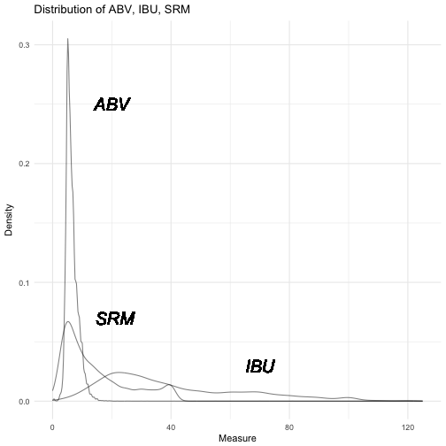
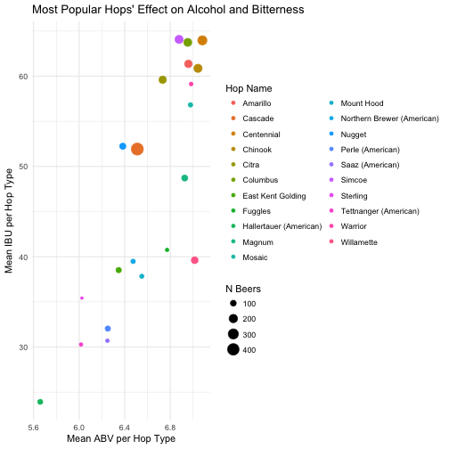

Beer-in-Hand Data Science
========================================================
author: Amanda Dobbyn
date: 
autosize: true

<style>
  .title-slide {
     background-image: url(http://bitpine.com/av/storage/d6883b03/avfb6baf1401d03eb2b7d.jpg);
      background-position: center center;
      background-attachment: fixed;
      background-repeat: no-repeat;
      background-size: 100% 100%;
   }
  
  body {
    overflow: scroll;
  }

  .cheers {
      background-image: url(https://static.independent.co.uk/s3fs-public/styles/article_small/public/thumbnails/image/2016/12/30/17/beer-istock-izusek.jpg);
      background-position: center center;
      background-attachment: fixed;
      background-repeat: no-repeat;
      background-size: 100% 100%;
      color: white;
      background:transparent;
    }
    
  .cheers .reveal .state-background {
      background-image: url(http://bitpine.com/av/storage/d6883b03/avfb6baf1401d03eb2b7d.jpg);
      background-position: center center;
      background-attachment: fixed;
      background-repeat: no-repeat;
      background-size: 100% 100%;
      color: white;
      <!-- background:transparent; -->
    }
    
  .section .reveal .state-background {
      background-image: url(http://bitpine.com/av/storage/d6883b03/avfb6baf1401d03eb2b7d.jpg);
      background-position: center center;
      background-attachment: fixed;
      background-repeat: no-repeat;
      background-size: 100% 100%;
  }

  td{
    font-size: 1pt;
    padding: 0px;
    cellpadding="0";
    cellspacing="0"
  }
  th {
    font-size: 1pt;
    height: 10px;
    font-weight: bold;
    text-align: right;
    background-color: #e1e3e8;
  }
  table { 
    border-spacing: 5px;
    border-collapse: collapse;
  }
  
  .small-code pre code {
    font-size: 1em;
  }
  
  .very-small-code pre code {
    font-size: .7em;
  }
  
  .very-small-code-transparent {
    background-image: url(http://bitpine.com/av/storage/d6883b03/avfb6baf1401d03eb2b7d.jpg);
    background-position: center center;
    background-attachment: fixed;
    background-repeat: no-repeat;
    background-size: 100% 100%;
    color: white;
    border-style: none;
    background-size: 100% auto;
  }
  
  .very-small-code-transparent .reveal .state-background {
    background-image: url(http://bitpine.com/av/storage/d6883b03/avfb6baf1401d03eb2b7d.jpg);
    background-position: center center;
    background-attachment: fixed;
    background-repeat: no-repeat;
    background-size: 100% 100%;
    color: white;
    border-style: none;
    background-size: 100% auto;
  }
  
  .very-small-code-transparent pre code {
    font-size: .7em;
    background: transparent;
    border-style: none;
  }
  
  .footer {
    color: black; 
    position: fixed; top: 90%;
    margin: top: 20%;
    text-align:center; width:100%;
}

  .midcenter {
      position: fixed;
      top: 50%;
      left: 50%;
      background-color:transparent;
  }
  
  .leftcenter {
      position: fixed;
      top: 15%;
      left: 5%;
      right: 1%; 
      background-color:transparent;
  }
</style>


First things first
========================================================
incremental:true
*Who am I?*

UChicago '15

<small> ^ Angela not yet pictured </small>


***
<br> 

Now at [Earlybird Software](http://earlybird.co/)

<!--  -->

First things first
========================================================
incremental:false

*Where's the code at?*

Code at: <https://github.com/aedobbyn/beer-data-science>
- Markdown writeup in `/compile`
- Shiny app in `/clusterfun`
- Step-by-step scripts for getting and munging data in `/run_it`

***


How did this come about?
========================================================
- Typical Friday afternoon office conversation
    - How do you architect the ideal beer flavor profile visualizer?
        - In particular, how do you represent *"hoppy, for a Kölsch"*?
  
<br>    
    
- Does the style Kölsch even describe a well-defined beer sub-group?
    - Would it be reliably distinguishable from non-Kölschs in a blind taste test?
    
<!--  -->

    
How did this come about?
========================================================
`Beer = water + malt + hops + yeast + sometimes other stuff like fruit`
- We categorize it into different styles based on 
  - Type and ratio of ingredients
  - How the beer is made (e.g., how long and at what temperature it's brewed)
  - Regional/historical differences 
  

How did this come about?
========================================================

BUT
- *How well do styles actually demarcate the beer landscape?*
  - Is there actually more inter-style variation than intra-style variation?
  - Is there a more empiricially accurate way to categorize beers into super-groups?

In other words, we're asking: are beer styles just a social construct?


The Order of Things, theoretically
========================================================

<center><center>


Implications
========================================================


* If styles do demarcate the beer landscape well, we should expect to see distinct **clusters** dominated mostly by beers classified into a *single* style

* It should also be easy to **predict** style from the other variables

This all assumes the variables we have (more on those in a sec) can account for most of the variance between styles.


*The stakes could not be higher*.


Step 1: GET Beer
========================================================
### The age-old dilemma


From where?
[BreweryDB](http://www.brewerydb.com/developers/docs), an online database of beers with a public API.


***


Quick funciton factory
========================================================
class:small-code

Using `purrr::walk()` and `assign()` we can create functions to GET any beer, brewery, category, etc. if we know its ID.


```r
base_url <- "http://api.brewerydb.com/v2"
key_preface <- "/?key="

endpoints <- c("beer", "brewery", "category", "event", "feature", "glass", "guild", "hop", "ingredient", "location", "socialsite", "style", "menu")

# Base function
get_ <- function(id, ep) {
  jsonlite::fromJSON(paste0(base_url, "/", ep, "/", id, "/", key_preface, key))
}

# Create new get_<ep> functions
endpoints %>% walk(~ assign(x = paste0("get_", .x),
                             value = partial(get_, ep = .x),
                             envir = .GlobalEnv))
```

Now we have the functions `get_beer()`, `get_brewery()`, `get_category()`, etc. in our global environment.

Testing testing
========================================================
class:small-code

We get a 200 success response and a nested list of all the data associated with this hop that `fromJSON` converted from, well, JSON into a nested list.


```r
get_hop("3")
```

```
$message
[1] "READ ONLY MODE: Request Successful"

$data
$data$id
[1] 3

$data$name
[1] "Ahtanum"

$data$description
[1] "An open-pollinated aroma variety developed in Washington, Ahtanum is used for its distinctive, somewhat Cascade-like aroma and for moderate bittering."

$data$countryOfOrigin
[1] "US"

$data$alphaAcidMin
[1] 5.7

$data$betaAcidMin
[1] 5

$data$betaAcidMax
[1] 6.5

$data$humuleneMin
[1] 16

$data$humuleneMax
[1] 20

$data$caryophylleneMin
[1] 9

$data$caryophylleneMax
[1] 12

$data$cohumuloneMin
[1] 30

$data$cohumuloneMax
[1] 35

$data$myrceneMin
[1] 50

$data$myrceneMax
[1] 55

$data$farneseneMax
[1] 1

$data$category
[1] "hop"

$data$categoryDisplay
[1] "Hops"

$data$createDate
[1] "2013-06-24 16:07:26"

$data$updateDate
[1] "2013-06-24 16:10:37"

$data$country
$data$country$isoCode
[1] "US"

$data$country$name
[1] "UNITED STATES"

$data$country$displayName
[1] "United States"

$data$country$isoThree
[1] "USA"

$data$country$numberCode
[1] 840

$data$country$createDate
[1] "2012-01-03 02:41:33"


$status
[1] "success"
```


Now with beer
========================================================
class:very-small-code

What does the data look like when we request a certain beer?


```r
get_beer("GZQpRX")
```

```
$message
[1] "READ ONLY MODE: Request Successful"

$data
$data$id
[1] "GZQpRX"

$data$name
[1] "Alpha King"

$data$nameDisplay
[1] "Alpha King"

$data$description
[1] "A bold yet balanced American Pale Ale with slight caramel sweetness and aggressive citrus hoppiness. This is our flagship beer."

$data$abv
[1] "6.7"

$data$ibu
[1] "68"

$data$glasswareId
[1] 5

$data$srmId
[1] 21

$data$availableId
[1] 1

$data$styleId
[1] 25

$data$isOrganic
[1] "N"

$data$labels
$data$labels$icon
[1] "https://s3.amazonaws.com/brewerydbapi/beer/GZQpRX/upload_t1NkG7-icon.png"

$data$labels$medium
[1] "https://s3.amazonaws.com/brewerydbapi/beer/GZQpRX/upload_t1NkG7-medium.png"

$data$labels$large
[1] "https://s3.amazonaws.com/brewerydbapi/beer/GZQpRX/upload_t1NkG7-large.png"


$data$status
[1] "verified"

$data$statusDisplay
[1] "Verified"

$data$createDate
[1] "2012-01-03 02:42:40"

$data$updateDate
[1] "2017-01-10 21:43:48"

$data$glass
$data$glass$id
[1] 5

$data$glass$name
[1] "Pint"

$data$glass$createDate
[1] "2012-01-03 02:41:33"


$data$srm
$data$srm$id
[1] 21

$data$srm$name
[1] "21"

$data$srm$hex
[1] "952D00"


$data$available
$data$available$id
[1] 1

$data$available$name
[1] "Year Round"

$data$available$description
[1] "Available year round as a staple beer."


$data$style
$data$style$id
[1] 25

$data$style$categoryId
[1] 3

$data$style$category
$data$style$category$id
[1] 3

$data$style$category$name
[1] "North American Origin Ales"

$data$style$category$createDate
[1] "2012-03-21 20:06:45"


$data$style$name
[1] "American-Style Pale Ale"

$data$style$shortName
[1] "American Pale"

$data$style$description
[1] "American pale ales range from deep golden to copper in color. The style is characterized by fruity, floral and citrus-like American-variety hop character producing medium to medium-high hop bitterness, flavor, and aroma. Note that the \"traditional\" style of this beer has its origins with certain floral, fruity, citrus-like, piney, resinous, or sulfur-like American hop varietals. One or more of these hop characters is the perceived end, but the perceived hop characters may be a result of the skillful use of hops of other national origins. American pale ales have medium body and low to medium maltiness. Low caramel character is allowable. Fruity-ester flavor and aroma should be moderate to strong. Diacetyl should be absent or present at very low levels. Chill haze is allowable at cold temperatures."

$data$style$ibuMin
[1] "30"

$data$style$ibuMax
[1] "42"

$data$style$abvMin
[1] "4.5"

$data$style$abvMax
[1] "5.6"

$data$style$srmMin
[1] "6"

$data$style$srmMax
[1] "14"

$data$style$ogMin
[1] "1.044"

$data$style$fgMin
[1] "1.008"

$data$style$fgMax
[1] "1.014"

$data$style$createDate
[1] "2012-03-21 20:06:45"

$data$style$updateDate
[1] "2015-04-07 15:25:18"


$status
[1] "success"
```

***

Let's unnest just the fourth element of the `data` part of the response. This is the beer's `description`. 

```r
get_beer("GZQpRX")$data$description
```

```
[1] "A bold yet balanced American Pale Ale with slight caramel sweetness and aggressive citrus hoppiness. This is our flagship beer."
```

Or in other words:

```r
get_beer("GZQpRX")[["data"]][4][[1]]
```

```
[1] "A bold yet balanced American Pale Ale with slight caramel sweetness and aggressive citrus hoppiness. This is our flagship beer."
```


Now with beer
========================================================
class:very-small-code

Other things are more deeply nested. In these cases, we really only care about the name portion.


```r
get_beer("GZQpRX")$data$style$name
```

```
[1] "American-Style Pale Ale"
```


***

Rather than the entire response:


```r
get_beer("GZQpRX")$data$style
```

```
$id
[1] 25

$categoryId
[1] 3

$category
$category$id
[1] 3

$category$name
[1] "North American Origin Ales"

$category$createDate
[1] "2012-03-21 20:06:45"


$name
[1] "American-Style Pale Ale"

$shortName
[1] "American Pale"

$description
[1] "American pale ales range from deep golden to copper in color. The style is characterized by fruity, floral and citrus-like American-variety hop character producing medium to medium-high hop bitterness, flavor, and aroma. Note that the \"traditional\" style of this beer has its origins with certain floral, fruity, citrus-like, piney, resinous, or sulfur-like American hop varietals. One or more of these hop characters is the perceived end, but the perceived hop characters may be a result of the skillful use of hops of other national origins. American pale ales have medium body and low to medium maltiness. Low caramel character is allowable. Fruity-ester flavor and aroma should be moderate to strong. Diacetyl should be absent or present at very low levels. Chill haze is allowable at cold temperatures."

$ibuMin
[1] "30"

$ibuMax
[1] "42"

$abvMin
[1] "4.5"

$abvMax
[1] "5.6"

$srmMin
[1] "6"

$srmMax
[1] "14"

$ogMin
[1] "1.044"

$fgMin
[1] "1.008"

$fgMax
[1] "1.014"

$createDate
[1] "2012-03-21 20:06:45"

$updateDate
[1] "2015-04-07 15:25:18"
```


Unnesting
========================================================
class:small-code

So, we'll unravel the `data` part of the response, grab whatever we want there, and glue it together into a dataframe. 

If the particular list item we're unnesting has a `name` portion (like `$style$name`), great, we'll grab that for the column. Otherwise, we'll take whatever's first.


```r
unnest_it <- function(df) {
  unnested <- df
  for(col in seq_along(df[["data"]])) {
    if(! is.null(ncol(df[["data"]][[col]]))) {
      if(! is.null(df[["data"]][[col]][["name"]])) {
        unnested[["data"]][[col]] <- df[["data"]][[col]][["name"]]
      } else {
        unnested[["data"]][[col]] <- df[["data"]][[col]][[1]]
      }
    }
  }
  return(unnested)
}
```

Note that this is a `for` loop so it's pretty slow 😔.

Paginating the Request
========================================================
class: small-code

We find out how many pages there are total and then send requests and unnest each until we hit `number_of_pages`.


```r
paginated_request <- function(ep, addition, trace_progress = TRUE) {    
  full_request <- NULL
  first_page <- fromJSON(paste0(base_url, "/", ep, "/", key_preface, key
                                , "&p=1"))
  number_of_pages <- ifelse(!(is.null(first_page$numberOfPages)), 
                            first_page$numberOfPages, 1)      

    for (page in 1:number_of_pages) {                               
    this_request <- fromJSON(paste0(base_url, "/", ep, "/", key_preface, key
                                    , "&p=", page, addition),
                             flatten = TRUE) 
    this_req_unnested <- unnest_it(this_request)    #  <- request unnested here
    
    if(trace_progress == TRUE) {message(paste0("Page ", this_req_unnested$currentPage))} # if TRUE, print the page we're on
    
    full_request <- bind_rows(full_request, this_req_unnested[["data"]])
  }
  return(full_request)
} 

beer_necessities <- paginated_request("beers", "&withIngredients=Y")
```


Quick note on Ingredients
========================================================
class:small-code
A few apporaches I used:

* Concatenated into a single string during the unnesting process
  * `hop_name` and `malt_name` using this function  👉
* Split out into one hop per column and one malt per column
  * `hops_name_1`, `hops_name_2`, etc.
* Sparse dataframe with each type of hop (like Cascade, Citra, etc.) as its own column 
  * Value is either 1 or 0 

<small> (Another would have been a nested list-col) </small>

***

<br>


```r
unnest_ingredients <- function(df) {
  df$hops_name <- NA
  df$malt_name <- NA

  for (row in 1:nrow(df)) {
    if (!is.null(df[["ingredients.hops"]][[row]][["name"]]) |
        !is.null(df[["ingredients.malt"]][[row]][["name"]])) {
      
      df[["hops_name"]][[row]] <- paste(df[["ingredients.hops"]][[row]][["name"]], collapse = ", ")
      
      df[["malt_name"]][[row]] <- paste(df[["ingredients.malt"]][[row]][["name"]], collapse = ", ")
    }
  }
  return(df)
}
```

What have we got?
========================================================


|id     |name                                     |style                                              |style_collapsed       |glass | abv| ibu| srm|hops_name                                  |malt_name                                                                     |
|:------|:----------------------------------------|:--------------------------------------------------|:---------------------|:-----|---:|---:|---:|:------------------------------------------|:-----------------------------------------------------------------------------|
|X4KcGF |(512) TWO                                |Imperial or Double India Pale Ale                  |Double India Pale Ale |Pint  | 9.0|  99|   9|Columbus, Glacier, Horizon, Nugget, Simcoe |Caramel/Crystal Malt, Two-Row Pale Malt - Organic, Wheat Malt                 |
|USaRyl |(512) Whiskey Barrel Double Pecan Porter |Wood- and Barrel-Aged Strong Beer                  |Barrel-Aged           |Pint  | 9.5|  30|  NA|Glacier                                    |Black Malt, Caramel/Crystal Malt, Chocolate Malt, Two-Row Pale Malt - Organic |
|bXwskR |(512) White IPA                          |American-Style India Pale Ale                      |India Pale Ale        |Pint  | 5.3|  55|   4|NA                                         |NA                                                                            |
|XnPVIo |(512) Wild Bear                          |Specialty Beer                                     |Specialty Beer        |Tulip | 8.5|   9|  NA|NA                                         |NA                                                                            |
|QLp4mV |(512) Wit                                |Belgian-Style White (or Wit) / Belgian-Style Wheat |Wheat                 |Pint  | 5.1|  10|   5|Golding (American)                         |Oats - Malted, Two-Row Pale Malt - Organic, Wheat Malt - White                |
|tWuIyV |(714): Blond Ale                         |Golden or Blonde Ale                               |Blonde                |NA    | 4.8|  NA|  NA|NA                                         |NA                                                                            |


What have we got?
========================================================

<div class="footer" style="font-size:80%; margin-bottom:0%">
What we have <em>not</em> got: flavor profiles (fruity, hoppy, piney) and ratings.</div>

<br> 
* 63,495 distinct beers
* Info about the beer:
  * ABV: alcohol by volume
  * IBU: International Biterness Units (really)
  * SRM: [a measure of color](http://www.twobeerdudes.com/beer/srm)
  * Ingredients
      * Hops, malts
      
***




Where to put it?
========================================================


***

MySQL. 

* This allows us to
   * Easily update the data if anything changes
   * Others easy access to the data if they want to build an app using it


Step 2: Breathe sigh of relief, Collapse
========================================================
class: small-code


```r
keywords <- c("Lager", "Pale Ale", "India Pale Ale", "Double India Pale Ale", "India Pale Lager", "Hefeweizen", "Barrel-Aged","Wheat", "Pilsner", "Pilsener", "Amber", "Golden", "Blonde", "Brown", "Black", "Stout", "Imperial Stout", "Fruit", "Porter", "Red", "Sour", "Kölsch", "Tripel", "Bitter", "Saison", "Strong Ale", "Barley Wine", "Dubbel")
```


```r
collapse_styles <- function(df, trace_progress = TRUE) {
  
  df[["style_collapsed"]] <- vector(length = nrow(df))
  
  for (beer in 1:nrow(df)) {
    if (grepl(paste(keywords, collapse="|"), df$style[beer])) {    
      for (keyword in keywords) {         
        if(grepl(keyword, df$style[beer]) == TRUE) {
          df$style_collapsed[beer] <- keyword    
        }                         
      } 
    } else {
      df$style_collapsed[beer] <- as.character(df$style[beer])       
    }
    if(trace_progress == TRUE) {message(paste0("Collapsing this ", df$style[beer], " to: ", df$style_collapsed[beer]))}
  }
  return(df)
}
```

Collapsing in Action
========================================================

Setting `trace_progress = TRUE`:


***
* Keywords are ordered from most general to most specific
  * If a beer's name matches multiple keywords, its `style_collapsed` is the **last** of those that appear in keyword 
    
    
`American-Style Pale Ale`  ➡  `Pale Ale`

`American-Style India Pale Ale`  ➡  `India Pale Ale`


Popular Styles
========================================================
* Let's further reduce the levels in our outcome variable by focusing on only popular styles
   * Those with above the mean number of beers in their style (z-score > 0)
   * <small> (Of course, this is just a reflection of the number of different beers we get from BreweryDB that are classified into that style, not a measure of popular consumption) </small>
   
* And then get a sense of where those styles fall in relation to one another
    * Style "centers" = mean ABV, IBU, and SRM of each style


Popular Styles
========================================================
class: small-code


|Collapsed Style          | Mean ABV| Mean IBU| Mean SRM| Numer of Beers|
|:------------------------|--------:|--------:|--------:|--------------:|
|India Pale Ale           |     6.58|    66.04|     9.99|           6524|
|Pale Ale                 |     5.70|    40.87|     8.89|           4280|
|Stout                    |     7.99|    43.90|    36.30|           4238|
|Wheat                    |     5.16|    17.47|     5.86|           3349|
|Double India Pale Ale    |     8.93|    93.48|    11.01|           2525|
|Red                      |     5.74|    33.81|    16.18|           2521|
|Lager                    |     5.45|    30.64|     8.46|           2230|
|Saison                   |     6.40|    27.25|     7.05|           2167|
|Blonde                   |     5.60|    22.39|     5.62|           2044|
|Porter                   |     6.18|    33.25|    32.20|           1973|
|Brown                    |     6.16|    32.22|    23.59|           1462|
|Pilsener                 |     5.23|    33.51|     4.41|           1268|
|Specialty Beer           |     6.45|    33.78|    15.52|           1044|
|Bitter                   |     5.32|    38.28|    12.46|            939|
|Fruit Beer               |     5.20|    19.24|     8.67|            905|
|Herb and Spice Beer      |     6.62|    27.77|    18.17|            872|
|Sour                     |     6.22|    18.89|    10.04|            797|
|Strong Ale               |     8.83|    36.74|    22.55|            767|
|Tripel                   |     9.03|    32.52|     7.68|            734|
|Black                    |     6.96|    65.51|    31.08|            622|
|Barley Wine              |    10.78|    74.05|    19.56|            605|
|Kölsch                   |     4.98|    23.37|     4.37|            593|
|Barrel-Aged              |     9.00|    39.16|    18.13|            540|
|Other Belgian-Style Ales |     7.52|    37.56|    17.55|            506|
|Pumpkin Beer             |     6.71|    23.48|    17.92|            458|
|Dubbel                   |     7.51|    25.05|    22.94|            399|
|Scotch Ale               |     7.62|    26.37|    24.22|            393|
|German-Style Doppelbock  |     8.05|    28.89|    25.70|            376|
|Fruit Cider              |     6.21|    25.60|    12.00|            370|
|German-Style Märzen      |     5.75|    25.64|    14.32|            370|

***

From this we can plot the centers of each style.


To the main question
========================================================
*Do styles truly define distinct pockets of beer?*

If they do, we could expect styles to align with **clusters** generated using an unsupervised learning algorithm. 

* k-means
    * Takes numeric inputs splits for each observation and splits those observations into `k` clusters (we choose `k`)
    * Goal is to minimize the sum of squares between each datapoint and its assigned cluster center

<small>Note that we'll have to throw away rows that contain `NA` values in any of the variables we're using.</small>

What variables should we include?


What's in a Predictor?
========================================================
incremental:false

*A heuristic I used*:

##### Outputs
* Only measured **after** a beer been brewed
    * ABV, IBU, SRM
    
##### Style-Defined
* Dependent entirely on style
  * Serving glass

##### Inputs
* Only directly controlled by a brewer **before** a beer is brewed
    * Hops, malts


***

<br> 
<br> 

👍  predictor  

<br> 
<br> 
<br> 

👎   predictor  

<br> 

🤷🏻‍♂️  predictor because chicken and egg problem  
    <small> Do brewers assign style first and then choose which ingredients to add, or vice versa? 🐣 </small>


Clustering: Let's have a function
========================================================
class: small-code


```r
do_cluster <- function (df, vars, to_cluster_on, n_centers = 5) {
  df_for_clustering <- df %>% select(!!vars) %>% na.omit()

  # Scale the ones to be scaled and append _scaled to their names
  df_vars_scale <- df_for_clustering %>% select(!!to_scale) %>%
    scale() %>% as_tibble()
  names(df_vars_scale) <- names(df_vars_scale) %>% stringr::str_c("_scaled")

  # Do the clustering on the scaled data
  clusters_out <- kmeans(x = df_vars_scale, centers = n_centers, trace = FALSE)

  # Combine cluster assignment, scaled data, and unscaled rest of data
  clustered_df <- bind_cols(
    cluster_assignment = factor(clusters_out$cluster),   # Cluster assignment
    df_vars_scale,
    df_for_clustering
  )

  return(clustered_df)
}
```

We don't need to specify an outcome variable because this is unsupervised.


Clustering: Run It
========================================================
class: small-code

Cluster the beers and stitch together the cluster assignments with the original data


```r
to_include <- c("id", "name", "style", "style_collapsed", "abv", "ibu", "srm")

to_cluster_on <- c("abv", "ibu", "srm")

clustered_beer <- do_cluster(beer_necessities, to_include, to_cluster_on)
```


Clustering: Output
========================================================


|Cluster Assignment | ABV Scaled| IBU Scaled| SRM Scaled|ID     |Name                                                         |Style                                              |Style Collapsed       | ABV|  IBU| SRM|
|:------------------|----------:|----------:|----------:|:------|:------------------------------------------------------------|:--------------------------------------------------|:---------------------|---:|----:|---:|
|4                  |  0.2659786| -0.6403452|  2.1973592|tmEthz |"Admiral" Stache                                             |Baltic-Style Porter                                |Porter                | 7.0| 23.0|  37|
|4                  | -0.5491578|  0.4345392|  2.4813777|b7SfHG |"Ah Me Joy" Porter                                           |Robust Porter                                      |Porter                | 5.4| 51.0|  40|
|5                  | -0.3453737|  0.4345392| -0.5481524|PBEXhV |"Bison Eye Rye" Pale Ale &#124; 2 of 4 Part Pale Ale Series  |American-Style Pale Ale                            |Pale Ale              | 5.8| 51.0|   8|
|5                  | -0.5491578|  0.5497053| -0.2641340|AXmvOd |"Dust Up" Cloudy Pale Ale &#124; 1 of 4 Part Pale Ale Series |American-Style Pale Ale                            |Pale Ale              | 5.4| 54.0|  11|
|1                  | -0.4472658| -0.4407238| -0.8321709|Hr5A0t |"God Country" Kolsch                                         |German-Style Kölsch / Köln-Style Kölsch            |Kölsch                | 5.6| 28.2|   5|
|1                  | -0.8038879| -0.7555114| -0.8321709|mrVjY4 |"Jemez Field Notes" Golden Lager                             |Golden or Blonde Ale                               |Blonde                | 4.9| 20.0|   5|
|1                  | -0.7019959| -1.1010099| -0.9268437|xFM8w5 |#10 Hefewiezen                                               |South German-Style Hefeweizen / Hefeweissbier      |Wheat                 | 5.1| 11.0|   4|
|1                  | -0.7019959| -0.7555114| -0.4534796|hB0QeO |#9                                                           |American-Style Pale Ale                            |Pale Ale              | 5.1| 20.0|   9|
|1                  | -0.8548340| -0.4867903| -1.0215165|m8f62Y |#KoLSCH                                                      |German-Style Kölsch / Köln-Style Kölsch            |Kölsch                | 4.8| 27.0|   3|
|1                  | -0.6001038| -0.8322888| -0.8321709|35lHUq |'Inappropriate' Cream Ale                                    |American-Style Cream Ale or Lager                  |Lager                 | 5.3| 18.0|   5|
|5                  |  0.2659786| -0.3716241| -0.6428253|qbRV90 |'tis the Saison                                              |French & Belgian-Style Saison                      |Saison                | 7.0| 30.0|   7|
|1                  | -0.7529419| -0.7555114| -0.4534796|qhaIVA |(306) URBAN WHEAT BEER                                       |Belgian-Style White (or Wit) / Belgian-Style Wheat |Wheat                 | 5.0| 20.0|   9|
|4                  | -0.2434817| -0.1412917|  0.6825942|tciJOF |(512) ALT                                                    |German-Style Altbier                               |Altbier               | 6.0| 36.0|  21|
|5                  |  0.5716547| -0.3716241|  0.6825942|VwR7Xg |(512) Bruin (A.K.A. Brown Bear)                              |American-Style Brown Ale                           |Brown                 | 7.6| 30.0|  21|
|5                  |  0.5207087| -0.1796805| -0.5481524|oJFZwK |(512) FOUR                                                   |Strong Ale                                         |Strong Ale            | 7.5| 35.0|   8|
|2                  |  0.2659786|  0.9719813| -0.5481524|ezGh5N |(512) IPA                                                    |American-Style India Pale Ale                      |India Pale Ale        | 7.0| 65.0|   8|
|5                  |  0.7754388| -0.6787339| -0.5481524|s8rdpK |(512) ONE                                                    |Belgian-Style Pale Strong Ale                      |Strong Ale            | 8.0| 22.0|   8|
|1                  | -0.2434817| -0.3716241| -0.6428253|2fXsvw |(512) Pale                                                   |American-Style Pale Ale                            |Pale Ale              | 6.0| 30.0|   7|
|4                  |  0.5207087| -0.5635677|  1.3453039|9O3QPg |(512) SIX                                                    |Belgian-Style Dubbel                               |Dubbel                | 7.5| 25.0|  28|
|5                  |  1.5396292| -0.6787339| -0.3588068|A78JSF |(512) THREE                                                  |Belgian-Style Tripel                               |Tripel                | 9.5| 22.0|  10|
|3                  |  1.5396292| -0.6787339|  2.4813777|WKSYBT |(512) THREE (Cabernet Barrel Aged)                           |Belgian-Style Tripel                               |Tripel                | 9.5| 22.0|  40|
|2                  |  1.2848991|  2.2771980| -0.4534796|X4KcGF |(512) TWO                                                    |Imperial or Double India Pale Ale                  |Double India Pale Ale | 9.0| 99.0|   9|
|1                  | -0.6001038|  0.5880941| -0.9268437|bXwskR |(512) White IPA                                              |American-Style India Pale Ale                      |India Pale Ale        | 5.3| 55.0|   4|
|1                  | -0.7019959| -1.1393986| -0.8321709|QLp4mV |(512) Wit                                                    |Belgian-Style White (or Wit) / Belgian-Style Wheat |Wheat                 | 5.1| 10.0|   5|
|1                  | -1.0586181| -0.7939001| -0.9268437|thTbY7 |(904) Weissguy                                               |South German-Style Hefeweizen / Hefeweissbier      |Wheat                 | 4.4| 19.0|   4|
|1                  | -0.6510499| -0.1796805| -0.5481524|EPnv3B |(916)                                                        |American-Style Pale Ale                            |Pale Ale              | 5.2| 35.0|   8|
|5                  | -0.0906436| -0.6019565| -0.0747884|QT9hB8 |+1 Pumpkin                                                   |Pumpkin Beer                                       |Pumpkin Beer          | 6.3| 24.0|  13|
|2                  |  0.6735468|  1.5478122| -0.8321709|btwcy1 |077XX India Pale Ale                                         |Imperial or Double India Pale Ale                  |Double India Pale Ale | 7.8| 80.0|   5|
|5                  |  1.2339530|  0.2042068| -0.8321709|FWiYZi |08.08.08 Vertical Epic Ale                                   |Belgian-Style Pale Ale                             |Pale Ale              | 8.9| 45.0|   5|
|5                  | -0.4982118|  0.6264828| -0.4534796|M6vu9P |10 Blocks South                                              |American-Style Pale Ale                            |Pale Ale              | 5.5| 56.0|   9|


Clustering: Plot
========================================================
class:very-small-code

We've got three main dimensions: ABV, IBU, and SRM. 

We'll plot two.


***

<small>Here I've trimmed outliers with this function (you can grab it from my [`dobtools`](https://github.com/aedobbyn/dobtools) package on GitHub.)</small>


```r
trim_outliers <- function(df, cutoff = 1.96, exclude = NULL, keep_scaled = TRUE){

  to_scale <- names(df)[!names(df) %in% exclude]

  df_scaled <- df %>%
    select(!!to_scale) %>%
    transmute_if(
      is.numeric, scale
    )
  names(df_scaled) <- names(df_scaled) %>% stringr::str_c("_scaled")

  df_out <- bind_cols(df_scaled, df)

  df_out_trimmed <- df_out %>%
    filter_at(
      .vars = vars(contains("_scaled")),
      .vars_predicate = all_vars(. < abs(cutoff))
    )

  if(keep_scaled == FALSE) {
    df_out_trimmed <- df_out_trimmed %>% select(!!names(df))
  }

  return(df_out_trimmed)
}
```


<!-- Clusterfun with Shiny Embed -->
<!-- ======================================================== -->
<!-- ```{r, echo = FALSE, eval=TRUE} -->
<!-- shinyAppDir( -->
<!--   system.file("/Users/amanda/Desktop/Projects/beer_data_science/present/clusterfun", package="shiny"), -->
<!--   options=list( -->
<!--     width="100%", height="100%" -->
<!--   ) -->
<!-- ) -->


<!-- ``` -->

Clusterfun with Shiny: UI
========================================================
class: small-code 


```r
sidebarLayout(
    sidebarPanel(
      h4("Control Panel"),

      checkboxInput("show_all", "Show all styles", TRUE),      
      checkboxInput("show_centers", "Show style centers", FALSE),
      numericInput("num_clusters", "Number of Clusters:", starting_n_clusters),
      
      checkboxGroupInput("cluster_on", "Choose variables to cluster on: ",
                         c("ABV (alcohol)" = "abv", 
                           "IBU (bitterness)" = "ibu", 
                           "SRM (color)" ="srm", 
                           "Total number of hops" = "total_hops", 
                           "Total number of malts" = "total_malt"),
                         selected = c("abv", "ibu", "srm")),
      
      checkboxGroupInput("response_vars", "Choose response variable(s): ",
                         c("Collapsed style" = "style_collapsed",
                           "Specific style" = "style"
                         ),
                         selected = c("style_collapsed")),
      
      conditionalPanel(
        condition = "input.show_all == false",
        selectInput("style_collapsed", "Collapsed Style:",
                    style_names)
        )
    ),
```


Clusterfun with Shiny: Server
========================================================
class: small-code 


```r
  output$cluster_plot <- renderPlot({
  
    # If our checkbox is checked saying we do want style centers, show them. Else, don't.
    if (input$show_centers == TRUE & input$show_all == FALSE) {
      
      this_style_center <- reactive({style_centers %>% filter(style_collapsed == input$style_collapsed)})
      
      ggplot() +
        geom_point(data = this_style_data(),
                   aes(x = abv, y = ibu, colour = cluster_assignment), alpha = 0.5) +
        geom_point(data = this_style_center(),
                   aes(mean_abv, mean_ibu), colour = "black") +
        geom_text_repel(data = this_style_center(),
                        aes(mean_abv, mean_ibu, label = input$style_collapsed),
                        box.padding = unit(0.45, "lines"),
                        family = "Calibri") +
        ggtitle("k-Means Clustered Beer") +
        labs(x = "ABV", y = "IBU") +
        labs(colour = "Cluster Assignment") +
        theme_minimal() +
        theme(legend.position="none")
    } else if  # ....... etc., etc.
```


Clusterfun with Shiny
========================================================

<small><https://amandadobbyn.shinyapps.io/clusterfun/></small></center>

<center>


Narrowing In
========================================================


<br>

<small> If we focus in on 5 distinct styles and cluster them into 5 clusters, will each style be siphoned off into its own cluster? </small>


|               |   1|  2|  3|   4|   5|
|:--------------|---:|--:|--:|---:|---:|
|Blonde         | 132|  7|  0|   2|  19|
|India Pale Ale |  45| 54|  3|  11| 464|
|Stout          |   5|  5| 56| 133|   5|
|Tripel         |   1|  4|  3|   1|  56|
|Wheat          | 287| 12|  2|   6|  14|


    
***

<br>


<!-- Not bad; without some taste data or other ingredients, it would be difficult to distinguish wheat beers and blonde ales. -->


And now for something completely different
========================================================
<div class="midcenter" style="width:90%; height:90%; margin-right:30%"> </img></div>

...a quick dive into hops


Hops
========================================================
incremental:true

<!--  -->

<div class="midcenter" style="margin-left:-300px; margin-top:-300px;">
</img>
</div>


Hops
========================================================
incremental:true

No, not those hops!


These hops ☝️

*** 

Hops `\häps\`, *n*: 1. It's what makes beer bitter and flavorful.

<br>

Our question: do more *kinds* of hops generally make a beer more bitter?

<small>(This is different than the total *quantity* of hops used during brewing.)</small>


Hops Munge
========================================================
class: small-code

Let's munge a bit. We'll need to split out ingredients from one column into many. 


```r
split_ingredients <- function(df, ingredients_to_split) {
  ncol_df <- ncol(df)
  
  for (ingredient in ingredients_to_split) {
    ingredient_split <- str_split(df[[ingredient]], ", ")    
    num_new_cols <- max(lengths(ingredient_split))    
    
    for (num in 1:num_new_cols) {
      this_col <- ncol_df + 1         
      df[, this_col] <- NA
      names(df)[this_col] <- paste0(ingredient, "_", num)
      ncol_df <- ncol(df)             
      
      for (row in seq_along(ingredient_split)) {          
        if (!is.null(ingredient_split[[row]][num])) {        
          df[row, this_col] <- ingredient_split[[row]][num]
        }
      }
      df[[names(df)[this_col]]] <- factor(df[[names(df)[this_col]]])
    }
    ncol_df <- ncol(df)
  }
  return(df)
}
```


Hops Munge
========================================================
class: very-small-code

```r
# Gather up all the hops columns into one called `hop_name`
beer_necessities_hops_gathered <- beer_necessities %>%
  gather(
    hop_key, hop_name, hops_name_1:hops_name_13
  ) %>% as_tibble()

# Filter to just those beers that have at least one hop
beer_necessities_w_hops <- beer_necessities_hops_gathered %>% 
  filter(!is.na(hop_name)) %>% 
  filter(!hop_name == "")

beer_necessities_w_hops$hop_name <- factor(beer_necessities_w_hops$hop_name)

# For all hops, find the number of beers they're in as well as those beers' mean IBU and ABV
hops_beer_stats <- beer_necessities_w_hops %>% 
  ungroup() %>% 
  group_by(hop_name) %>% 
  summarise(
    mean_ibu = mean(ibu, na.rm = TRUE), 
    mean_abv = mean(abv, na.rm = TRUE),
    n = n()
  ) %>% 
  arrange(desc(n))

# Pare to hops that are used in at least 50 beers
pop_hops_beer_stats <- hops_beer_stats[hops_beer_stats$n > 50, ] 

# Keep just beers that contain these most popular hops
beer_necessities_w_popular_hops <- beer_necessities_w_hops %>% 
  filter(hop_name %in% pop_hops_beer_stats$hop_name) %>% 
  droplevels()

pop_hops_display <- pop_hops_beer_stats %>% 
    rename(
    `Hop` = hop_name,
    `Mean IBU` = mean_ibu,
    `Mean ABV` = mean_abv,
    `N Beers` = n
  )
```


What's the hop landscape look like?
========================================================

|Hop               | Mean IBU| Mean ABV| N Beers|
|:-----------------|--------:|--------:|-------:|
|Cascade           | 51.92405| 6.510729|     445|
|Centennial        | 63.96526| 7.081883|     243|
|Chinook           | 60.86871| 7.043439|     194|
|Simcoe            | 64.07211| 6.877394|     191|
|Columbus          | 63.74483| 6.953846|     183|
|Amarillo          | 61.36053| 6.959264|     163|
|Citra             | 59.60000| 6.733290|     157|
|Willamette        | 39.61078| 7.014657|     133|
|Nugget            | 52.23810| 6.383119|     114|
|Magnum            | 48.71596| 6.926852|     109|
|East Kent Golding | 38.51875| 6.347386|      89|

***


|Hop                        | Mean IBU| Mean ABV| N Beers|
|:--------------------------|--------:|--------:|-------:|
|Perle (American)           | 32.03947| 6.251744|      88|
|Hallertauer (American)     | 23.92388| 5.658537|      83|
|Mosaic                     | 56.81818| 6.977465|      71|
|Northern Brewer (American) | 39.48475| 6.473944|      71|
|Mount Hood                 | 37.83500| 6.550000|      68|
|Warrior                    | 59.13043| 6.983115|      62|
|Saaz (American)            | 30.69778| 6.248333|      60|
|Fuggles                    | 40.75581| 6.772143|      59|
|Tettnanger (American)      | 30.27551| 6.016780|      59|


Alcohol, bitterness, and popularity per Hop
========================================================
incremental: true
class: small-code


^ Note that there is actually, irl, a strain of hops called Fuggles.


How do hops affect bitterness?
========================================================
class:small-code
incremental:true



Is the relationship significant?

***


```r
hops_ibu_lm <- lm(ibu ~ total_hops, data = beer_dat %>% filter(total_hops > 0)) %>% broom::tidy() %>% dobtools::style_lm()
```


```
    Variable Estimate Std.Error P.Value
1 Total Hops    8.635     0.488       0
```

<small>We can expect an increase in around 9 IBU for every 1 extra hop.</small>

Okay back on track!


Prediction
========================================================
* The other side of the coin: supervised learning
    * Random forest
    * Multinomial neural network. We'll go through the neural net.

A low prediction error rate should indicate that styles are well-defined, at least by the variables that we have. 


Prediction: Neural Net
========================================================

* Package: `nnet`
* Outcome variable: `style` or `style_collapsed`

**What we'll do**
* Feed it a dataframe, an outcome variable, and a set of predictor variables
* It will train it 80%, test on 20%
    * From this, we can get a measure of accuracy
    
    
Neural Net: the Function
========================================================
class: small-code


```r
run_neural_net <- function(df, outcome, predictor_vars) {
  out <- list(outcome = outcome)
  
  # Create a new column outcome; default to style
  if (outcome == "style_collapsed") {
    df[["outcome"]] <- df[["style_collapsed"]]
  } else {
    df[["outcome"]] <- df[["style"]]
  }

  cols_to_keep <- c("outcome", predictor_vars)
  
  df <- df %>%
    select_(.dots = cols_to_keep) %>%
    mutate(row = 1:nrow(df)) %>% 
    droplevels()

  # Select 80% of the data for training
  df_train <- sample_n(df, nrow(df)*(0.8))
  
  # The rest is for testing
  df_test <- df %>%
    filter(! (row %in% df_train$row)) %>%
    select(-row)
```

***


```r
  df_train <- df_train %>%
    select(-row)
  
  # Build multinomail neural net
  nn <- multinom(outcome ~ .,
                 data = df_train, maxit=500, trace=TRUE)

  # Which variables are the most important in the neural net?
  most_important_vars <- varImp(nn)

  # How accurate is the model? 
  nn_preds <- predict(nn, type="class", newdata = df_test)
  nn_accuracy <- postResample(df_test$outcome, nn_preds)

  out <- list(out, nn = nn, 
              most_important_vars = most_important_vars,
              df_test = df_test,
              nn_preds = nn_preds,
              nn_accuracy = nn_accuracy)

  return(out)
}
```


Neural Net: Run It
========================================================
class: small-code


```r
p_vars <- c("total_hops", "total_malt", "abv", "ibu", "srm")

nn_collapsed_out <- run_neural_net(df = beer_dat %>% drop_na(!!p_vars), outcome = "style_collapsed", 
                         predictor_vars = p_vars, trace=TRUE)
```

```
# weights:  210 (174 variable)
initial  value 10693.364568 
iter  10 value 9007.861736
iter  20 value 8383.735156
iter  30 value 8154.843641
iter  40 value 8017.693678
iter  50 value 7670.274347
iter  60 value 7507.313838
iter  70 value 7307.286325
iter  80 value 7103.609163
iter  90 value 6802.044987
iter 100 value 6634.900333
iter 110 value 6543.160440
iter 120 value 6441.293317
iter 130 value 6404.665876
iter 140 value 6384.745396
iter 150 value 6379.883760
iter 160 value 6379.179600
iter 170 value 6378.814775
iter 180 value 6378.691773
iter 190 value 6378.660759
iter 200 value 6378.646203
iter 210 value 6378.605387
final  value 6378.598978 
converged
```


Neural Net: Evaluate
========================================================
How'd we do? 


```r
nn_collapsed_out$nn_accuracy[1]
```

```
 Accuracy 
0.4002541 
```

Not terrible given we've got 30 collapsed styles; chance would be 3.3%.

***

Which variables are most important?


|Variable   |Importance Percent |
|:----------|:------------------|
|total_hops |43.1%              |
|total_malt |26.2%              |
|abv        |25.3%              |
|ibu        |3.0%               |
|srm        |2.5%               |

Neural Net: Glass
========================================================
class:small-code
What happens if we add in glass, a style-dependent attribute, as a predictor?


```r
p_vars_add_glass <- c("total_hops", "total_malt", "abv", "ibu", "srm", "glass")

nn_collapsed_out_add_glass <- run_neural_net(df = beer_dat %>% drop_na(!!p_vars_add_glass), outcome = "style_collapsed", predictor_vars = p_vars_add_glass, trace=FALSE)
```


```
 Accuracy 
0.4298441 
```

***


|Variable                  |Importance Percent |
|:-------------------------|:------------------|
|total_hops                |11.5%              |
|total_malt                |11.1%              |
|abv                       |10.2%              |
|ibu                       |10.1%              |
|srm                       |10.1%              |
|glassGoblet               |9.2%               |
|glassMug                  |8.8%               |
|glassOversized Wine Glass |8.6%               |
|glassPilsner              |5.8%               |
|glassPint                 |5.7%               |
|glassSnifter              |4.3%               |
|glassStange               |2.0%               |
|glassThistle              |1.7%               |
|glassTulip                |0.8%               |
|glassWeizen               |0.1%               |
|glassWilli                |0.1%               |


So what's the answer?
========================================================
*Are beer styles a useful construct to use as a proxy for natural clusters in beer?*

I'd give it a fuzzy yes.

Fuzzy because:
* We couldn't do better than ~40% accuracy
* We had a lot of missing predictors

Unknowns:
* Was our style collapsing scheme successful in putting beers in the "right" buckets?
* Would taste-related information have been a useful variable?


So what's the answer?
========================================================


***

Plotting the landscape directly on our two main dimensions using a 2D density plot,

* No clear super-groups that are independent of style
* Syles are very overlapping, especially among lower-alcohol and -bitterness styles


Future Directions
========================================================
In no particular order, some thoughts I've had plus suggestions from others:

* Join on other data
  * e.g., Untappd or something scraped from the interwebs that provides ratings and flavor profiles
* Beer consumption: how is this trending over time, for each style?
    * What drives the trend? Supply or demand?
        * Do brewers brew more sours causing people buy more of them or do people start liking sours and cause brewers to brew more?
* Shiny features:
    * Beer searchability
    * Tooltips over each point on hover
* Hierarchical clustering; what style is the mother of all styles?
* Some funky algorithm to generate new beer names


Cheers, all!
========================================================
class: very-small-code-transparent  


```
R version 3.3.3 (2017-03-06)
Platform: x86_64-apple-darwin13.4.0 (64-bit)
Running under: macOS Sierra 10.12.6

locale:
[1] en_US.UTF-8/en_US.UTF-8/en_US.UTF-8/C/en_US.UTF-8/en_US.UTF-8

attached base packages:
[1] stats     graphics  grDevices utils     datasets  methods   base     

other attached packages:
 [1] bindrcpp_0.2     emo_0.0.0.9000   caret_6.0-76     lattice_0.20-35 
 [5] nnet_7.3-12      feather_0.3.1    forcats_0.2.0    dplyr_0.7.4.9000
 [9] purrr_0.2.3      readr_1.1.1      tidyr_0.7.1      tibble_1.3.4    
[13] tidyverse_1.1.1  dobtools_0.1.0   ggrepel_0.6.5    ggplot2_2.2.1   
[17] jsonlite_1.5     broom_0.4.2      knitr_1.17      

loaded via a namespace (and not attached):
 [1] httr_1.3.1            splines_3.3.3         foreach_1.4.3        
 [4] modelr_0.1.1          Formula_1.2-2         shiny_1.0.5.9000     
 [7] assertthat_0.2.0      highr_0.6             stats4_3.3.3         
[10] latticeExtra_0.6-28   cellranger_1.1.0      backports_1.1.0      
[13] quantreg_5.29         glue_1.1.1            digest_0.6.12        
[16] RColorBrewer_1.1-2    checkmate_1.8.3       rvest_0.3.2          
[19] minqa_1.2.4           colorspace_1.3-2      htmltools_0.3.6      
[22] httpuv_1.3.5.9000     Matrix_1.2-8          plyr_1.8.4           
[25] psych_1.7.5           pkgconfig_2.0.1       SparseM_1.74         
[28] haven_1.1.0           xtable_1.8-2          scales_0.5.0         
[31] ranger_0.8.0          MatrixModels_0.4-1    lme4_1.1-13          
[34] htmlTable_1.9         mgcv_1.8-17           car_2.1-5            
[37] lazyeval_0.2.0        pbkrtest_0.4-7        mnormt_1.5-5         
[40] readxl_1.0.0          survival_2.41-3       magrittr_1.5         
[43] crayon_1.3.4          mime_0.5              evaluate_0.10.1      
[46] nlme_3.1-131          MASS_7.3-47           xml2_1.1.1           
[49] foreign_0.8-69        tools_3.3.3           data.table_1.10.4    
[52] hms_0.3               stringr_1.2.0         munsell_0.4.3        
[55] cluster_2.0.5         rlang_0.1.2.9000      grid_3.3.3           
[58] nloptr_1.0.4          iterators_1.0.8       rstudioapi_0.7.0-9000
[61] htmlwidgets_0.9       miniUI_0.1.1          labeling_0.3         
[64] base64enc_0.1-3       gtable_0.2.0          ModelMetrics_1.1.0   
[67] codetools_0.2-15      reshape2_1.4.2        R6_2.2.2             
[70] gridExtra_2.2.1       lubridate_1.6.0       bindr_0.1            
[73] Hmisc_4.0-3           stringi_1.1.5         parallel_3.3.3       
[76] Rcpp_0.12.13          rpart_4.1-11          acepack_1.4.1        
```


