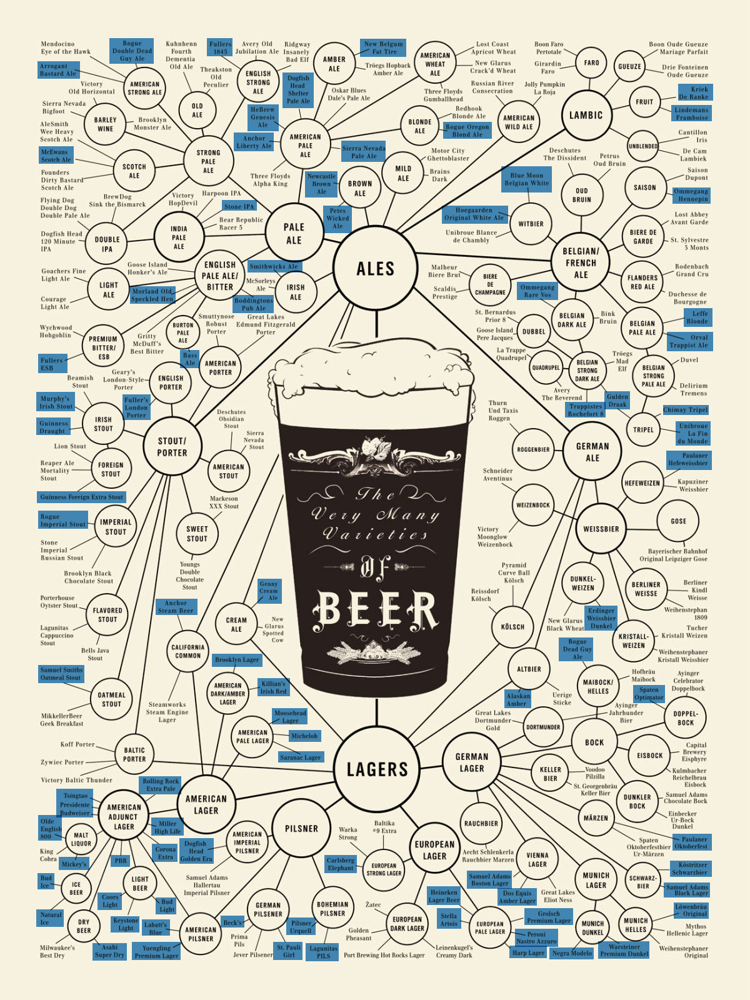
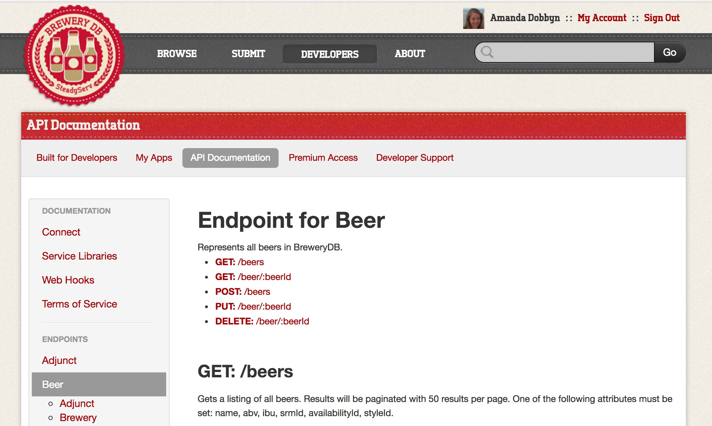
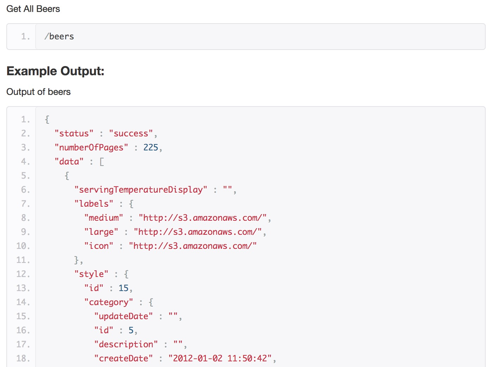

```{r setup, include=FALSE}
library(knitr)
knitr::opts_chunk$set(cache=TRUE)

# Set the working directory path to one directory up so this .Rmd file's working directory is the same as the R Project directory. This way we don't have to change the file paths when sourcing in.
knitr::opts_chunk$set(root.dir=normalizePath('../'))
knitr::opts_knit$set(root.dir=normalizePath('../'))
```

```{r source_in, echo=FALSE, message=FALSE, warning=FALSE}
devtools::install_github("aedobbyn/dobtools")
library(dobtools)
library(tidyverse)
library(feather)
library(jsonlite)
library(emo)

# Data
beer_necessities <- read_feather("./beer_necessities.feather") %>% as_tibble()

# Helpers
source("./run_it/key.R")
```


```{r beer_caps, echo=FALSE}
# For cap_a_word_partial()
words_to_cap <- c("abv", "ibu", "srm", "id", 
                "Abv", "Ibu", "Srm", "Id")
```


<br>

This past summer I spent a chunk of time doing some [beer-in-hand data science](https://github.com/aedobbyn/beer-data-science) on, well, beer data. After I gave a [talk](https://aedobbyn.github.io/beer-data-science/) on the analysis at the aptly-named Oktoberfest edition of RLadies Chicago, a few people were interested in getting ahold of some beer data for themselves. I hope to spread the wealth in this quick post by going through some of the get-off-and-running steps that I took to grab beer data from BreweryDB API and do a first bit of cleaning on it.

I'll give a little backstory on why I started diving into beer data, which you can feel free to skip if you're just interested in the data extraction and wrangling parts.


### Backstory

One day after work shooting it with a coworker, [Kris](https://kro.ski/), we were supplied with beer and a whiteboard, which in my book is a failsafe great combination. I don't pretend to be a beer aficionado, but Kris is the real deal; in addition to being an excellent web developer, Kris and his girlfriend man the popular Instagram account [kmkbeer](https://ink361.com/app/users/ig-6733117611/kmkbeer/photos). Around this time, Kris had started building an app for rating beers on a variety of dimensions, so you could rate, say, [Deschutes's Fresh Squeezed IPA](https://www.beeradvocate.com/beer/profile/63/60330/) on maltiness, sweetness and a host of other dimensions. That way you could remember not just that it's a 4.5/5 stars but that it's pretty juicy, all things considered. 

The main sticking point -- and this is where the whiteboard markers came out -- is that you'd want to be able to capture that a beer tasted smoky *for a porter* or was hoppy *for a wheat beer*. That's important because a very hoppy wheat beer might be considred quite a mildly hopped IPA. At this point we started drawing some distributional density curves and thinking about setting priors for every style. That prior would be the flavor baseline for each type of beer, allowing you to make these types of "for a" distinctions on the style level.  

This is about when I started thinking about the concept of beer "styles" in general. You've got -- at the highest split -- your ales and your lagers, and then within those categories you've got pale ales and IPLs and kölschs and double IPAs and whatnot. The categories people typically recognize as beer syles.



But: are styles even the best way of dividing up beers? Or is it just the easiest and most immediate thing we've got? Assuming that beers do necessarily fit well into styles is a bit circular; we only have the style paradigmn to work off of so, if we're tasked with classifying a beer we're likely to reach for style as an easy way to bucket beers.

This brought me to thinking about clustering, of course. If styles <em>do</em> define the beer landscape well then, I figured, styles should match up with clusters pretty well. If they don't, well, that would be some evidence that the beer landscape is more of an overlapping mush than a few neat, cut-and-dry buckets and that maybe some stouts are actually closer to porters than they are to the typical stout, or whatever the case may be.

So! Where to get the data, though. The usual question. Well, Kris had his beers from an online database called [BreweryDB](http://www.brewerydb.com/developers), so, armed with a URL and a question I was interested in, I decided to check it out. 

### Getting Data

BreweryDB offers a RESTful API; what that means is that once you've created an API key [^1], you can hand that key over in a URL with query parameters and receive data back. The one caveat here is you won't get everything the API has to offer without creating a [premium](http://www.brewerydb.com/developers/premium) key ($6 a month); once you do, you'll get unlimited requests and a few extra endpoints beyond what you get at the free tier. 



A look through the [BreweryDB API documentation](http://www.brewerydb.com/developers/docs) shows how you should structure your request in order to be handed back the data you want. You can get that data back as JSON (the default), XML, or serialized PHP. We'll be asking for JSON. If you're requesting data on a single beer, you'd supply a URL that contains the endpoint `beer`, the beer's ID, and your key like so:  `http://api.brewerydb.com/v2/beer/BEER_ID_HERE/?key=/YOUR_KEY_HERE`.

If you entered such a URL in the browser, the response looks like:

&nbsp;


&nbsp;

That's beer data! But not that useful yet. We want to take that JSON and fit it into a dataframe. To do that, I turned to the excellent `jsonlite` package, which has a few functions for converting from JSON to R objects (generally lists) and vice versa. The main function we'll need is `fromJSON()`. Underneath `jsonlite` is are the `httr` and `curl` packages that allows you to construct HTTP requests in a straightforward way; what `fromJSON()` in particular does is take a URL, write a GET request for you, and give you back the reponse as a nested list.

To get our feet wet, we can generalize our URL write a little function that takes a beer ID and returns a nested list of data.

```{r get_beer_func}
base_url <- "http://api.brewerydb.com/v2"
key_preface <- "/?key="

get_beer <- function(id) {
  jsonlite::fromJSON(paste0(base_url, "/beer/", id, "/", key_preface, key))
}
```


Okay so now we can reqeust a given beer by its ID:

```{r get_alphaking}
get_beer("GZQpRX")
```


&nbsp;

If we wanted to go back to JSON we can take a list like that and, you guessed it, use `toJSON()`:

```{r}
get_beer("GZQpRX") %>% toJSON()
```

&nbsp;


BreweryDB's got several endpoints that take a single parameter, an ID, just like the beer endpoint that we based our function on. I wanted a function for each of these endpoints so I could quickly take a look at the structure of the data returned. Rather than construct them all by hand like we did with `get_beer()`, this seemed like a good time to write a function factory to create functions to GET any beer, brewery, category, etc. if we know its ID.

First, a vector of all the single-parameter endpoints:

```{r endpoints}
endpoints <- c("beer", "brewery", "category", "event", "feature", "glass", "guild", "hop", "ingredient", "location", "socialsite", "style", "menu")
```


We'll first write a generic function for getting data about a single ID, `id` from an endpoint `ep`. 


```{r get_}
# Base function
get_ <- function(id, ep) {
  jsonlite::fromJSON(paste0(base_url, "/", ep, 
                "/", id, "/", key_preface, key))
}
```

Then we use a bit of functional programming in `purrr::walk()` and `purrr::partial()` to create `get_` functions from each of these endpoints in one fell swoop.


```{r walk}
# Create new get_<ep> functions
endpoints %>% walk(~ assign(x = paste0("get_", .x),
                    value = partial(get_, ep = .x),
                    envir = .GlobalEnv))
```


What's happening here is that we're piping each endpoint through `assign()` as the `.x` argument. `.x` serves as both the second half of our new function name, `get_<ep>`, and the endpoint argument of `get_()`, which we defined above (that is, the `ep` argument in the `fromJSON()` call). This means we're using the same word in both the second half of our newly minted function name and as its only argument.
(`assign` is the same thing as the usual `<-` function, but lets us specify an environment a little bit easier.)

Now we have the functions `get_beer()`, `get_brewery()`, `get_category()`, etc. in our global environment so we can do something like:

```{r get_hop}
get_hop("3")
```


Bam.

This is good stuff for exploring the type of data we can get back from each of the endpoints that take a singe ID. However, for this project I'm mainly just interested in beers and their associated data. So after a bit of poking around using other endpoints, I started thinking about how to build up a dataset of beers and all their associated attributes that might reasonably relate to their style.

<br>

### Building the Dataset

So since we're mostly interested in beer, our main workhorse endpoing is going to be `beers`. 



The next challenge is how best to go about getting all the beers BreweryDB's got. We can't simply ask for all of them at once because our response from any one call to the API is limited to 50 beers per page. We can specify page with the `&p=` parameter in the URL.

The strategy I took, implemented in `paginated_request()`, was to go page by page, ask for all 50 beers on the page and tack that page's data on to the bottom of the one before it.

Helpfully, the `numberOfPages` variable in each page of the response tells us what the total number of pages is for this particular endpoint; it's is the same no matter what page we're on, so we'll take it from the first page and save that in our own variable, `number_of_pages`. We know which page we're on from `currentPage`. So since we know which page we're on and how many total pages there are, we can send requests and unnest each one into a datataframe until we hit `number_of_pages`. We attach each of the freshly unnested dataframes to all the ones that came before it, and, when we're done, return the whole thing.

What the `addition` parameter of our function does is let you paste any other parameters onto the end of the URL. If you want it on, `trace_progress` tells you what page you're on so you can more accurately judge how many more funny animal videos I mean stats lectures you can watch before you've gotten your data back. (It's worth noting that this function isn't optimized for speed at all, so queue up those videos or speed it up a bit by pre-allocating memory or vectorizing it `r emo::ji("relaxed")`.)


```{r get_beer, eval=FALSE}
paginated_request <- function(ep, addition, trace_progress = TRUE) {    
  full_request <- NULL
  first_page <- fromJSON(paste0(base_url, "/", ep, "/", key_preface, key
                                , "&p=1"))
  number_of_pages <- ifelse(!(is.null(first_page$numberOfPages)), 
                            first_page$numberOfPages, 1)      

    for (page in 1:number_of_pages) {                               
    this_request <- fromJSON(paste0(base_url, "/", ep, "/", key_preface, key
                                    , "&p=", page, addition),
                             flatten = TRUE) 
    this_req_unnested <- unnest_it(this_request)    #  <- list unnested here
    
    if(trace_progress == TRUE) {message(paste0("Page ", this_req_unnested$currentPage))} 
    
    full_request <- bind_rows(full_request, this_req_unnested[["data"]])
  }
  return(full_request)
} 
```


You'll notice a little helper funciton inside the for loop called `unnest_it()`. I'll explain what that's doing.

Looking back at the structure of the data resulting from `get_beer()`, we've got a nested list with things like `abv`, and `isOrganic`. The goal is get that nested list into a dataframe with as few list columns as possible. (If you're not familiar, a list-col is a column whose values are themselves lists, allowing for different length vectors in each row. They are neat but not what we're here for right now.)

Some bits of the data that we want are nested at deeper levels than others. For example, `$data$style` contains not just the `name` of the style but also the style's `description`, its `shortName`, the typical minimum ABV in `abvMin`, etc.

```{r style}
get_beer("GZQpRX")$data$style
```

In these cases, we really only care about what's contained in the `name` vector; I'm okay with chucking the style attributes.

```{r style_name}
get_beer("GZQpRX")$data$style$name
```


We'll write a helper function to put that into code. What `unnest_it()` will do is go along each vector in the top level of the `data` portion of the response and, if particular list item we're unnesting has a `name` portion (like `$style$name`), it will grab that value and stick it in the appropriate column. Otherwise, we'll just take whatever the first vector is in the data response. (We only need to resort to this second option in one case that I'm aware of, which is glassware -- glassware doesn't have a `name`.)

```{r unnest_it}
unnest_it <- function(lst) {
  unnested <- lst
  for(col in seq_along(lst[["data"]])) {
    if(! is.null(ncol(lst[["data"]][[col]]))) {
      if(! is.null(lst[["data"]][[col]][["name"]])) {
        unnested[["data"]][[col]] <- lst[["data"]][[col]][["name"]]
      } else {
        unnested[["data"]][[col]] <- lst[["data"]][[col]][[1]]
      }
    }
  }
  return(unnested)
}
```


Okay, so we run the thing and assign it to the object `beer_necessities`. 
<!-- (I meant to change the name a long time ago but now it stuck and changing it would almost certainly break more things than it's worth `r emo::ji("woman_shrugging_medium_light_skin_tone")`). -->

```{r beer_necessities, eval=FALSE}
beer_necessities <- paginated_request(ep = "beers", addition = "&withIngredients=Y")
```

We ask for ingredients in our addition so we know which particular hops and malts are included in each beer. These were unnested using a similar procedure.


Let's take a look at some of what we've got:

```{r beer_necessities_kable, echo=FALSE, fig.align="center"}
knitr::kable(beer_necessities[115:120, ] %>% select(id, name, style, style_collapsed, glass, abv, ibu, srm, hops_name, malt_name))
```

The three main "predictor" variables we've got are ABV, IBU, and SRM. They stand for alcohol by volume, International Bitterness Units, and Standard Reference Method, respectively. What they mean is: how alcoholic is the beer, how bitter is it, and what color is it on a scale of light to dark.


```{r beer_necessities_glimpse}
glimpse(beer_necessities)
```


Much tidier. Next, I put the data in a couple different places: 1) a local MySQL database using the `RMySQL` package which relies on the more generic database package `DBI`, and 2) a `.feather` file [^2], which I highly recommend.


&nbsp;

### Initial Munge

The last thing I'll get into here is the first bit of transforming I did once I'd gotten the data.

Looking through the outcome variable, style, I noticed that we've got `r length(levels(beer_necessities$style))` total styles. A lot of these are styles that I'd really consider sub-styles. Like, should American-Style Amber (Low Calorie) Lager and American-Style Amber Lager *really* be considered two different style beers? You may think the disctinciton is important -- and if you do, let me know why! -- but I say probably not.

```{r style_levels}
levels(beer_necessities$style)
```


The goal of my fist bit of munging will be to lump some of those sub-styles of beer in with their closest cousins. Thinking about the best way of doing this objectively, I noticed that most of the sub-styles tended to contain another broader style plus some modifiers; in other words, sub-styles were longer versions of the main styles.

For that reason, I decided to do the lumping based on the text of the style itself. I defined a few keywords that appeared in the most popular styles. 


```{r keywords}
keywords <- c("Pale Ale", "India Pale Ale", "Double India Pale Ale", "Lager", "India Pale Lager", "Hefeweizen", "Barrel-Aged","Wheat", "Pilsner", "Pilsener", "Amber", "Golden", "Blonde", "Brown", "Black", "Stout", "Imperial Stout", "Fruit", "Porter", "Red", "Sour", "Kölsch", "Tripel", "Bitter", "Saison", "Strong Ale", "Barley Wine", "Dubbel")
```

Next I wrote the function below called `collapse_styles()`.

`collapse_styles()` is going to do kind of what it says on the tin -- for each beer, find out which keyword, or `style_collapsed` to lump each `style` into. 

One important detail of `keywords` is that *order matters*. I intentionally ordered keywords that are contained within one another from most general to most specific.

Take the first three keywords: `"Pale Ale", "India Pale Ale", "Double India Pale Ale"`. I think the distinction between these three styles is important because they are three of the most popular styles in BreweryDB and because they taste noticeably different. What we're going to do is, for every beer, loop through all the keywords and if we find a match between its `style` and one of these `keywords` and assign that keyword as its `style_collaped`. Since we're looping through the keywords in the order we've defined above, the *last* match we get to will be the one that ultimately is assigned as that beer's `style_collaped`.

That means that if a beer's style is Super Duper Strong Imperial Double India Pale Ale, it'll first be assigned the `style_collapsed` "Pale Ale", then "India Pale Ale", and finally "Double India Pale Ale". That's exactly what we want because "Double India Pale Ale" is the most specific of those three and, presumably, closest in spirit to Super Duper Strong Imperial Double India Pale Ale.


```{r collapse_styles}
collapse_styles <- function(df, trace_progress = TRUE) {
  
  df[["style_collapsed"]] <- vector(length = nrow(df))
  
  for (beer in 1:nrow(df)) {
    if (grepl(paste(keywords, collapse="|"), df$style[beer])) {    
      for (keyword in keywords) {         
        if(grepl(keyword, df$style[beer]) == TRUE) {
          df$style_collapsed[beer] <- keyword    
        }                         
      } 
    } else {
      df$style_collapsed[beer] <- as.character(df$style[beer])       
    }
    if(trace_progress == TRUE) {message(paste0("Collapsing this ", df$style[beer], " to: ", df$style_collapsed[beer]))}
  }
  return(df)
}
```

If we set `trace_progress` to `TRUE` we can make sure things are working as intended.


Cool, now we've got a factor column in our dataframe with only `r length(keywords)` instead of `r length(levels(beer_necessities$style))` levels. 

After a little time spent reading documentation, crafting a few functions for grabbing the beer we need and getting it into a tidy data structure that's easy to manipulate, we're off to the races. Now's probably a good time to crack a cold one before moving onto some actual analysis! In my case, that actual analysis mainly involved looking at clusters of beers by building this [Shiny app ](https://amandadobbyn.shinyapps.io/clusterfun/) and trying to predict a beer's style using a random forest and a small neural net.


If you made it this far and are interested in reading more of my yammering on about the subject, my upstanding coworker [Eddie](https://www.linkedin.com/in/eddievb/), founder of the honourable Earlybird Software Open Beer Consortium, took the time to [interview](https://medium.com/earlybird-software/chatting-with-data-scientist-amanda-dobbyn-about-analyzing-beer-styles-10a7a3278dfd) me about the project. Once again, all the code for the project is up at https://github.com/aedobbyn/beer-data-science. Pull requests are more than welcome.

Cheers and happy exploring!


[^1]: Since it's not super sensitive information, I store my key in a gitignored file that I `source()` in whenever I need to hit the API. You could also save the key as a global variable in an `.Renviron` file in your home directory and access it with `Sys.getenv()`.

[^2]: [`feather`](https://github.com/wesm/feather) is a binary file format so it's fast to read in *and* saves your types so you don't need to worry about `stringsAsFactors` or setting your types after you read in your data like you'd need to with a typical CSV file. It's a great way to port data between R and Python as well.


```{r sessionInfo}
sessionInfo()
```


